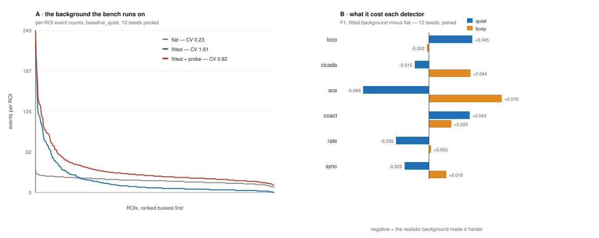

# Handoff — the bench background is no longer flat, and four things want a decision

**Work is in flight.** Branch `bench-background-is-not-flat`, pushed, **deliberately
red**: six tests fail and I have not touched them, because at least three of them
encode findings rather than numbers. Nothing here is merged.

> Tony, 2026-08-28: *"all the benchmarks have changed because the bench is
> changed. cut the gordian knot. lets go."*

That settled the one thing that had held this back since 2026-08-14. `bg_rate_shape`
and `bg_burst_shape` were fitted, documented, and left `None` for a single reason —
keeping the RNG stream identical so every published seed reproduced. The bench
revamp had already spent that comparability, so the `None`s were buying nothing.

## What changed

Three lines in `BENCH_RECORDING`, plus moving `MEASURED_BURST_SHAPE` /
`MEASURED_BURST_BINS` up beside `MEASURED_RATE_SHAPE` because the dict now uses
them ~950 lines before they were defined. Both "⚠ not wired into the bench"
docstring notes are now false and were rewritten.



## What it cost — 12 seeds, paired, same process

`evaluate(..., gen={"bg_rate_shape": None, "bg_burst_shape": None})` reaches the
old background from the new tree, so this is paired per seed and the only thing
differing is the background model. **Use 12 seeds, not 3** — the first 3-seed run
showed deltas up to 0.12 that were mostly seed noise, and reporting them would
have been wrong.

| detector | quiet Δ F1 | busy Δ F1 |
|---|---|---|
| loco | +0.045 | −0.002 |
| cicada | −0.015 | +0.044 |
| sce | **−0.069** | **+0.076** |
| coact | +0.043 | +0.023 |
| rate | −0.035 | +0.002 |
| sync | −0.025 | +0.018 |

**Quiet keeps its ranking** (coact > loco > rate > cicada > sync > sce). **Busy
reorders at the top** — flat `rate > loco > coact`, fitted `coact ≈ rate > loco` —
but those three sat within 0.02 of each other, so that is a coin landing
differently, not a result.

## The finding worth more than the deltas

PR #50 §1 predicted the promiscuity probe would erase the heterogeneity when it
was switched on. **It does, and now it is measurable on the shipped bench:**

| bench recording | CV of per-ROI counts | busiest ROI's share |
|---|---|---|
| flat, no probe | 0.23 | 4.6% |
| **fitted, no probe** | **1.52** | **22.2%** |
| **fitted + probe (what ships now)** | **0.77** | **12.6%** |
| real baseline windows | 2.00 | 30% |

The fit buys most of the way to real; the probe gives half of it back, because it
adds a *flat* rate to every ROI. So the bench runs a realistic field for 89% of
its duration and a flattened one for the 11% the probe covers. **This makes #50's
open ask live rather than theoretical: does the probe multiply each ROI's own
rate, or add a flat one?** Today it adds, and nothing records that as a choice.

⚠ These CV/share figures are computed on **total** per-ROI counts (background +
planted + distractors + probe). #50's headline "26.7% → 0.0% silent" is
background-only and **I did not reproduce that isolation** — the Slice hands back
combined trains. The comparison across the four cases is fair because all four are
measured the same way; the absolute silent-fraction is not comparable to #50's.

## The four decisions — none of them mine

Six tests fail. I left every one of them failing on purpose.

1. **`test_the_declared_grid_brackets_its_own_optimum[coact]`** — coact's F1 now
   peaks at the **low end of its alpha grid** (0.01). The edge-of-range rule
   firing exactly as designed. **Its operating point wants re-fitting on the new
   background**, and the question behind it is whether *all* the operating points
   should be re-derived — they carry provenance strings tying them to
   constellation's MATLAB campaign, and re-fitting them here substitutes a
   different authority for that. That is the real decision.
2. **`test_precision_survives_the_regime_shift[rate]`** — rate swings **0.103**
   against a 0.10 budget. Marginal, but the guard exists to say an operating point
   that only works at one background is not an operating point. Re-fit, or widen
   the budget with a reason.
3. **`test_five_of_six_are_flat_well_below_the_shipped_tolerance`** — detectors now
   plateau at 2.5 s (loco, coact) and 2.0 s (rate), above the shipped 1.5 s match
   tolerance. **F1 at 1.5 s may now understate every detector.** Moving the
   tolerance changes every score again.
4. **Three × `test_background_curve`** — `coact now wins everywhere` on the
   background-rate axis, and the largest rank change fell from 4 places to 2. One
   of these tests says in its own failure message *"the reordering this test was
   written for has gone, which is good news worth looking at."* **The instability
   they were written to prove was partly an artifact of the flat field.** Do not
   re-baseline these quietly — rewriting them to assert the new numbers deletes
   the finding.

## Reproduce any of it

```bash
PYTHONPATH=$PWD/src python <scratch>/flat_vs_fitted.py 12   # the paired table
PYTHONPATH=$PWD/src python <scratch>/silent_tail.py 12 baseline_quiet
PYTHONPATH=$PWD/src python -m pytest tests/ -q               # the six
```

The three scratch scripts are not in the tree. They are short and the tables above
say what they compute; if they are wanted permanently they belong in `tools/`
beside `probe_vs_heterogeneity.py`, which does the same job for #50.

**`PYTHONPATH=$PWD/src` is not optional in a worktree** — see
`docs/todo/2026-08-28-a-worktree-pytest-run-tests-the-primary-checkouts-src.md`.

## Also left in flight by this session

- **#292** — amended and pushed. The two role-2 rules it predated (trace forward,
  ask what the humans hold) are applied; five residual ⚠ now named, the largest
  being that **nobody has ever asked the Cossart lab anything** while the memo
  makes four claims about their artifacts and one about their intent. **It has not
  been re-murderboarded since the amendment** — the freshness gate blocked it,
  #370 cleared that, and this session ran out of room before the re-run. That is
  the one thing owed on it before merge.
- **#270** — rebased and **merged**. Its 3/3 failure was a site-date test main had
  long since fixed; the branch was 205 commits stale.
- **#370** — merged. Re-vendor plus the finding that the freshness gate compares
  stamps rather than content, so any upstream commit makes every consumer stale.
- **#53 / #50** — read and summarised for Tony; both await his decision, not a
  merge. #50's §1 is the item this branch just made urgent.

## Honest note on this document

**It has not been through `/murderboard`, and the repo requires that of a
handoff.** The session was out of context. Its numbers are the ones printed by the
runs above and were re-derived at 12 seeds after the 3-seed run proved misleading,
but no adversarial pass has been run over the prose. Treat the four decisions as
the reliable content and the framing as unreviewed.
