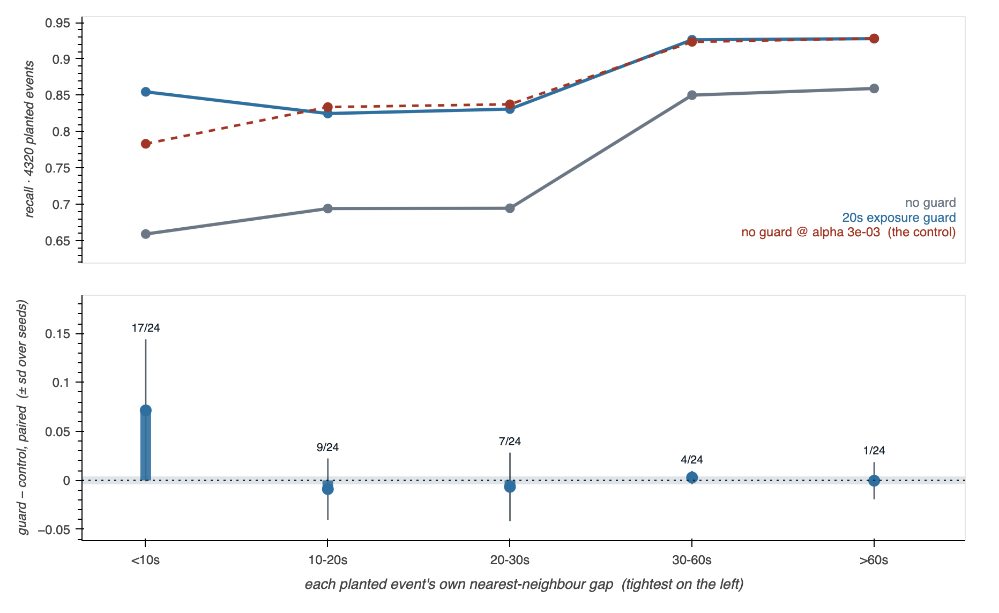

# Handoff — 2026-08-27, for the big push

**In flight: #292, #53, #50** — all three are proposals sitting with other teams, and
none of them blocks work here. **#304 and #270 merged on 2026-08-28.** When the last
closes, `tests/test_handoff_is_honest.py` goes red and retires this file.

`main` green at `ced0da4`; suite **1,569**; sapper clear. Board: **11 ACTIVE** on the git
board and **30** on the machine-local one, of which only **7 have a live worktree**.

> **Refreshed 2026-08-30, and every figure above had rotted.** It listed #304 and #270 as
> in flight two days after they merged, quoted `main` at `ab1dbfd` — 61 commits back — and
> the suite at 1,391 when it is 1,569, and reported the board "down to 4 ACTIVE claims"
> while the local one carried 30.
>
> **None of that made the gate fire.** `test_handoff_is_honest.py` only goes red when the
> *last* named PR closes, so this file could be wrong about four things out of five and
> still read as authoritative — and it is the first thing the briefing reads aloud at
> every session start. Same can-the-alarm-ring shape this project keeps finding, and it
> earns the general form: **a file whose whole job is to say what is true cannot be
> checked only on its own retirement condition.**

---

## ⚠ Start here: two decisions, and one of them blocks the pipeline

The session briefing reads these out loud at every start. They are the only things no
session can advance.

| | decision | what it blocks |
|---|---|---|
| 1 | **How does the promiscuity probe enter the score?** [two scorers, two winners](docs/todo/2026-08-25-two-scorers-two-winners-and-nothing-decides.md) | **the re-fit** — RESET §7 step 5 |
| ~~2~~ | ~~Did you mean to close PR #298?~~ | **ANSWERED 2026-08-30 — ADR-0003 exists** |
| 2 | **Send the Kreuz letter.** [PySpike `max_tau`](docs/todo/2026-08-11-file-pyspike-max-tau-issue.md) | nothing — it has been ready for 19 days |
| 3 | **What happens to `bench-background-is-not-flat`?** [below](#the-fitted-background-cannot-land-green) | the tube numbers, and what `main` says about its own bench |

**The PR #298 question is closed.** Tony asked on 2026-08-30 for the orphaned branches to
be merged, which answered it: `parity-was-the-inheritance` landed in #406 and
`docs/adr/0003-parity-was-the-inheritance-not-the-contract.md` is on `main`. The nine
files that cited it resolve, and the ADR index's reserved-not-skipped note is retired.

**Decision 1 is the gate.** Two scoring rules are live in the tree and pick **opposite
winners** for the rate detector: `BenchResult.precision` excludes the promiscuity probe,
`tools/probe_rate_mechanism.py` includes it while its docstring claims to mirror
`bench.evaluate`. A campaign is a maximisation over a score, so two scores ship two
different sets of settings and whichever runs first looks authoritative. There is a third
option the todo names and nobody has taken: **a gate a candidate must pass rather than a
term in F1**, which is what `hot_fa` already is — the only form that does not redefine
every published score in the project.

**Decision 2 is cheap if it was an accident.** #298 was `MERGEABLE`, `CLEAN` and 3/3 green
when it closed at 03:08 UTC on 2026-08-26, with no comment anywhere. The timeline says
`closed by syncytium2`, which is both you and every session here, so it cannot distinguish
a decline from a tidy-up. The branch `parity-was-the-inheritance` still exists at `016df3b`.
Reopening is one click and nine citations come right at once. **The decision it records is
not in doubt and is already shipped** — `excess_mode="corrected"` has been the default in
both the Python and the browser since #303. What closed was the document, not the practice.

## The fitted background cannot land green

**`bench-background-is-not-flat` merges cleanly into `main` and fails four tests, and
none of them is a merge artifact.** It wires the measured background shape into the
bench — which `main` still describes, in `bench.py`'s own prose, as *"Not wired into the
bench"*.

- **Three `test_background_curve.py` tests, left red on purpose by their author**, who
  said so in the commit: *"coact now wins everywhere — the instability they were written
  to prove was partly an artifact of the flat field. Re-baselining them would delete a
  finding, so they are left red for a human."*
- **`test_lab_server.py::test_the_server_reproduces_the_published_bakeoff`**, fold 3,
  `29 != 28`. `docs/learned/bakeoff.json` was computed on the flat field, so the
  published bake-off goes stale the instant the fitted background is wired.

**Why it matters more than a stuck branch.** Every tube-variant number in the 2026-08-29
handoff — the 2×2 mechanism screen, the seed axis, the 0.662 tie at the top — was measured
in that environment. It does not exist on `main`. So the branch is not optional cleanup:
until it lands or is abandoned, the published bench and the numbers most likely to be
quoted describe two different benches.

Neither failure is a session's to resolve. One asks what a finding means; the other asks
what gets regenerated and republished.

## Where the pipeline is

`docs/RESET.md` §7 is the order of work. **It is still only on the unmerged `the-reset`
branch** — a session on `main` cannot read the document the whole plan refers to.

| step | | state |
|---|---|---|
| 0 | the assessor becomes a pair | ✅ landed 2026-08-24 |
| 1 | the null test — plant nothing, expect zero | ✅ it leaked; corrected in #303 |
| 2 | the background axis becomes a reported curve | ✅ nothing is flat |
| 3 | fresh assessment + **K decision** | ⛔ Tony |
| 4 | mechanism changes, behind flags | ⛔ Tony — and see the guard, below |
| 5 | **the re-fit**, then regenerate `docs/learned/` in one pass | ⛔ behind decision 1 |
| 6 | the treatment contrast | last |

## The guard: a finding that is not a defect, and needs your call

Deliberately unfiled, because it is a scoping decision and filing it as a todo would
present a choice as a defect.

**The re-fit cannot select a guard, and cannot see one.** Two locks:

```
OPERATING_POINTS['coact'].params = {int_win_sec, context_win_sec, alpha, n_surrogates}
                          .knob  = 'alpha'        # guard_sec, guard_norm absent
REGIMES                          = ['baseline_quiet', 'baseline_busy']
```

Both regimes measure **crowding 0.00** — crowding being the fraction of planted events with
another inside their own reference window, which is the number that decides whether the
guard's main mechanism can fire at all. `BENCH_RECORDING` plants events 120 s apart
against a ±30 s reference window, so mutual masking is impossible *by construction*. The
campaign will optimise a grid that does not contain the guard, on the two recordings where
its mechanism cannot fire, and the result will read as *"we measured; it is not worth it."*

That matters because **the guard does work, in your own data**, not in some other domain.
One bin moves and the rest are flat, which is the whole argument in one picture:



- Real folder, 39 recordings: crowding median **0.00**, IQR 0.00–0.30, range 0.00–0.57.
  **Seven of thirty-nine** sit above the crowded diagnostic's 0.38.
- In `TAIL_RECORDING`, fitted to those seven, against a control loosened until it matched
  on **both** recall (0.865 vs 0.871) and precision (0.910 vs 0.909): **+0.071 recall in
  the `<10 s` gap bin, 17 of 24 seeds, every other bin flat.** A matched threshold change
  cannot buy that. `forks.md` §4a's conclusion is false in the tail.
- Radar has treated guard cells as standard since 1983, with parallels in sonar, VHE
  astronomy and MACS. Having it off is the unusual position, not the default one.

**Two honest ways forward, and it is a decision, not a task:** put `guard_sec` on the coact
knob axis and add a crowded regime to the scoring set so the campaign can find it or
genuinely reject it — *or* scope the re-fit to the median recording on purpose and write
into `forks.md` that the guard is out of scope by construction, so nobody later mistakes
the campaign's silence for evidence. Home for either:
[revise the bench before the refit](docs/todo/2026-08-23-revise-the-bench-recording-before-the-refit.md).

Caveats that belong with it: the tail result is **recall**, on simulated data fitted to
real statistics, at a 20 s guard — not the shipped 0.0 — and #317's finding that best-F1
does not move is untouched and consistent. A gain concentrated in 14% of events is worth
about a point of overall recall, which is exactly what a best-F1 comparison cannot see.

## Open PRs

| PR | state | |
|---|---|---|
| [#304](https://github.com/syncytium2/bugarach/pull/304) | green | CFAR is a knob axis we already have |
| [#292](https://github.com/syncytium2/bugarach/pull/292) | green | the attribution memo credits the wrong laboratory |
| [#270](https://github.com/syncytium2/bugarach/pull/270) | **RED**, stale since 2026-08-24 | no independent assessor; wants a rebase |
| [#53](https://github.com/syncytium2/bugarach/pull/53) | green | one parameter object, before the third breaking change |
| [#50](https://github.com/syncytium2/bugarach/pull/50) | green | for the generator team: two fitted features cancel |

**#292 has new grounds since it was opened.** The murderboard was re-vendored on 2026-08-26
(#307) and brought two rules written after an attribution report missed the same class
twice: *trace citations forward, not only back*, and *ask what the humans hold*. That case
turned on an email that sat in an inbox four months while three review arms reached for
radar and econometrics. Both bear directly on #292 and on the `attribution-corrections`
worktree; neither has been applied to it.

## Also true, and cheap

- **The site is 10 commits behind, and one of them changes a page it serves.**
  `docs/deploy.md`. Nothing in the repo publishes it; it moves when a person runs it.
- **4 ACTIVE board claims**, each with a branch genuinely ahead of `main`:
  `assessor-is-not-an-oracle`, `the-reset`, `parity-was-the-inheritance`,
  `attribution-corrections`. The other eight were released on 2026-08-27 — every one held
  nothing, and the briefing was showing them as live.
- **72 open todos.** A record, not a queue; most predate the reset.
- **⚠ The briefing has ~56 bytes of headroom, and the number that binds is the one from a
  fresh clone.** With this file present it delivers **8,944B on a fresh clone** against a
  9,000B budget, and 8,578B on this configured machine. The fresh figure is the real one:
  on a machine with no `hooksPath`, no board and no darkroom, every standing alarm fires at
  full length instead of collapsing to `commit gates: ACTIVE`. That is the shape CI runs,
  and the first draft of this handoff pushed it to 9,078B — over, degrading `FOUNDATIONS
  §9` to its six bolded claims. **Measure on a throwaway clone before adding anything to
  that hook**, and read the canary on line 1: it says `(TERSE` once it has degraded.
  `tools/hook_spill_census.sh` puts the real spill threshold at (8,962B, 10,186B] from 55
  recorded refusals, so there is very little budget left to buy.

## Two open items from the hook audit

Both moved out of [the hook audit](docs/handoffs/2026-08-25-the-session-hooks.md) into
`docs/todo/` on 2026-08-26, because an archived handoff is read once and a todo is counted
at every session start.

- [`murderboard_revendor.py --selftest` is not portable](docs/todo/2026-08-26-murderboard-revendor-selftest-is-not-portable.md)
  — two failures here, zero upstream. It is a vendored file: send it back, do not patch it.
- [two SessionStart hooks and neither sees the total](docs/todo/2026-08-26-two-session-start-hooks-and-neither-sees-the-total.md)
  — roughly **15KB** of context before your first message. Each hook is budgeted; the sum
  is nobody's job. Read the number from the todo, not from here: it was 15,388B on the
  26th and 14,779B the next morning, because both hooks report on live state. A figure
  that moves overnight is exactly what a dated page should not be holding, which is why
  the item lives in `docs/todo/` now.

## The pattern both sessions kept finding

Every defect in two days was a **status** defect, not a fact defect: something true when
written and false when read. A briefing that passed fifteen tests and reached nobody. A
guard that skipped in CI, the one place it promised to shout. A reproduce command that
stopped reproducing once the bug was fixed. A byte count that drifted 14KB → 15KB. "Nine
references" that had become ten — the tenth added by the session writing about the problem.

What worked was never more care. It was moving the claim out of prose and into something
that runs: the briefing prints its own size, the handoff names a PR a test can resolve.
**Anything in a durable document that a machine could check and doesn't is the next one.**
