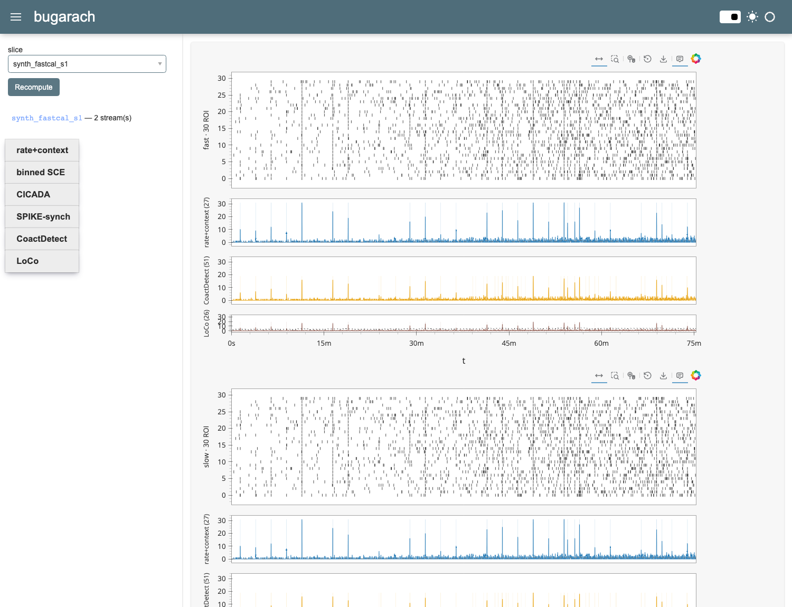
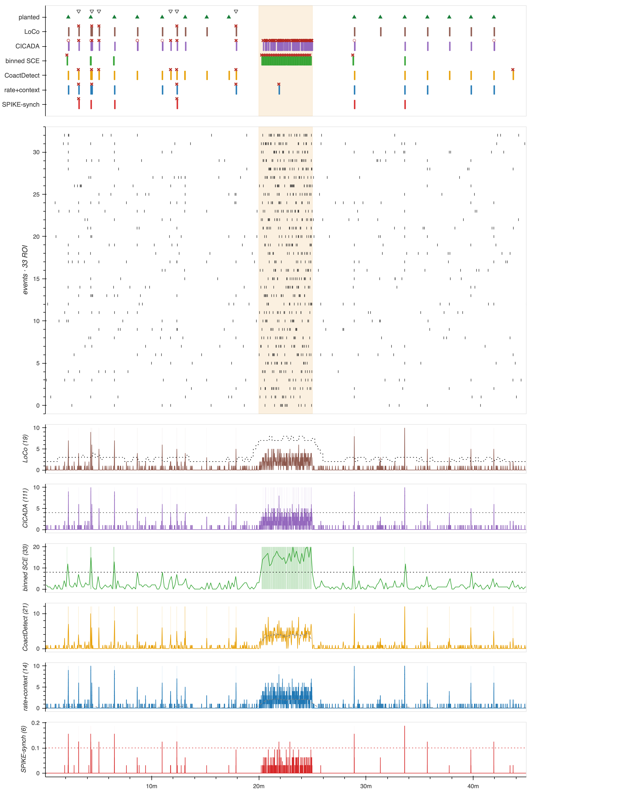
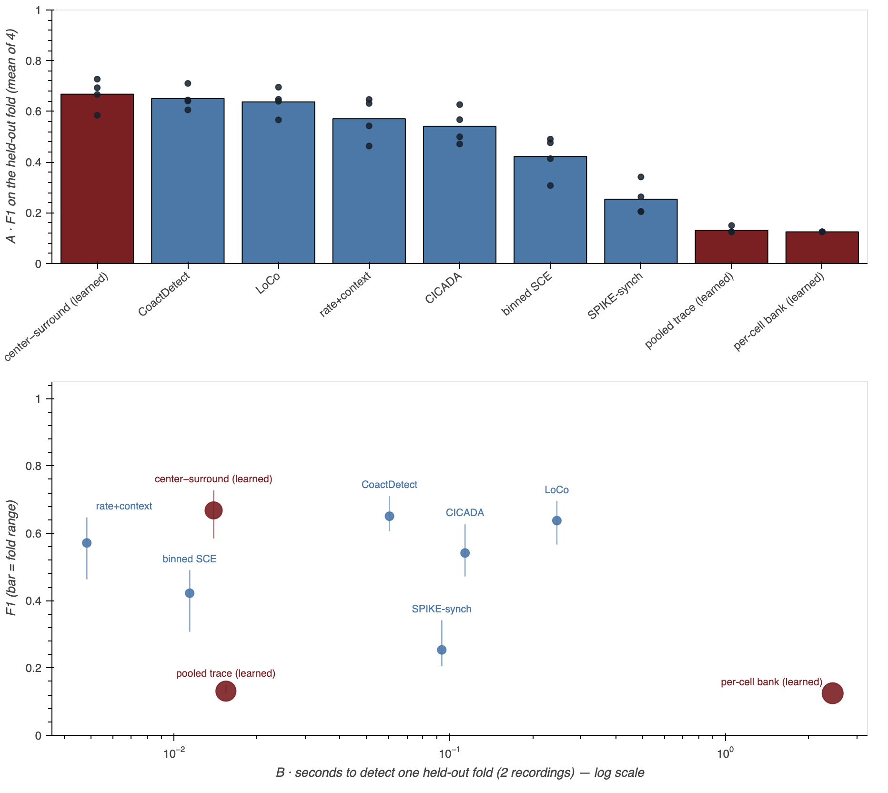

# bugarach

[](https://github.com/syncytium2/bugarach/actions/workflows/ci.yml)
&nbsp;·&nbsp; [bugarach.tonydefazio.com](https://bugarach.tonydefazio.com)

**Find the moments when many cells fire together — and measure how often you are
wrong on a simulation built from your own recordings.** bugarach lifts six
coordinated-event detectors out of MATLAB, plants
events in simulated recordings so a detector can be scored against what was
actually there instead of against another detector's opinion, and trains a small
network on that simulation. It reads one folder of event times, so a lab that has
never heard of this project can point it at its own recordings.

Its input is a list of event times per **ROI** — one region of interest, meaning
one cell's worth of signal pulled out of a calcium-imaging movie by whatever
software you already use. Those events may arrive split into **streams**: this lab
separates fast and slow calcium transients, and every detector runs on each stream
on its own. Everything below works from those times, plus one number — the
acquisition frame interval, which three of the six detectors need and no list of
times can carry. The quickest look costs nothing: the
[raster viewer](https://bugarach.tonydefazio.com/viewer.html) draws a folder of
them in the browser, with no upload and nothing installed.



> **The name.** Pic de Bugarach is the mountain in the French Pyrenees that doomsday
> believers converged on for the 2012 Mayan-calendar apocalypse, convinced it alone
> would be spared. The world did not end; the village had to restrict access to the
> summit. A coordination detector is a machine for deciding whether an alignment is
> real — this repo is named for the people who decided without one.
> (Team constellation, alongside `syzygy`, `murmuration`, `fireflies`.)

## The idea: an instrument built for your recordings

**Coordination is not one phenomenon, so there is no one detector to train.**
Stars coordinate and cells coordinate, and between them the timescales run over
many orders of magnitude — along with the sampling rates, the mechanisms, and what
counts as an event at all. A network trained across every source of coordination
spends its capacity on a space in which almost nothing transfers. Worse for a
working lab: what it learns is the average case, so the preparation that departs
from the average is the one it scores as noise.

So the instrument gets built per lab, in a loop:

1. **Measure** an *untreated* recording — without using a detector, so no
   detector's opinion can leak into what follows (`bugarach.assess`).
2. **Simulate** from that measurement alone, planting events at known times with
   known participants (`bugarach.adapt` → `bugarach.simulate`).
3. **Tune and train** on that synthetic baseline: the six detectors get their
   operating points, the network gets its weights (`bugarach.bench`,
   `bugarach.learn`).
4. **Detect** — and only now is the finished instrument pointed at the whole
   dataset, treatments included.

Simulating the treatment would spend the effect you ran the experiment to
measure. Withholding it is what lets the effect come back as a result.

That loop has been run end to end exactly once, on this lab's own recordings — the
bake-off below is its output. Two counts appear on this page and they are different
populations, not a typo: the measurement in step 1 read **85** baseline recordings
out of this lab's `.mat` store, and the export folder the lab later approved as the
input contract holds **84**, the difference being what the lab withdrew. (How many
that is depends which record you read — the folder says one, FOUNDATIONS says two —
which is
[worth reconciling](docs/todo/2026-08-23-the-store-and-the-folder-disagree-about-how-many-were-withdrawn.md)
before either number is quoted as settled.) No outside lab has run it, so read
the per-lab promise as a design demonstrated once at home, not as a practice with a
track record.

## What is built

The MATLAB originals — `explore_sce` and the detectors, generator and scoring
suite around it — live in **interface2**, this lab's analysis repository. It is
private, so it is named here as the source of a port and never linked; nothing in
this repo needs it to build, run or be tested.

| what exists | what it means |
| --- | --- |
| **Six detector ports** | rate+context, CoactDetect, LoCo, binned SCE, CICADA and SPIKE-synch — each agreeing with its MATLAB original to within 1e-9 on every returned number, in every detection mode, on committed synthetic fixtures. That is a port-fidelity claim and it is the whole of what is checkable from a clone: it says the Python computes what the MATLAB computed, which is what lets the ports be cited in the originals' place. It says nothing about either being right. |
| **Peak gating** | The half-prominence extent kernel the peak-gated mode needs, written **clean-room** from a spec and validated against an independently built adversary implementation. |
| **A generator with ground truth** | Coordinated events planted at known times in per-ROI background activity, so a miss and a false alarm are counted rather than argued about (`bugarach.simulate`, from interface2's `generate_synth_coord.m`). |
| **A scorer that reads intervals** | Binned detectors report a bin's left edge; matching that edge against a planted onset scored a correct detector at **0.00 recall on fourteen detections that each spanned a planted event**. Detections are matched as intervals, greedily, closest pair first (`bugarach.score`). |
| **A bench with four refusals** | It will not run a detector at whatever its signature happens to default to: on the sparse benchmark this rule was written against, CoactDetect scored F1 0.72 that way and 1.00 at its calibrated point. (That benchmark has since been replaced by two regimes measured from the export folder, so treat the pair as the incident that motivated the rule rather than as a current score.) It will not report an optimum sitting on the edge of the grid it searched. It will not accept a sweep in which every point ties, which is how SPIKE-synch was caught: its threshold sweep returned the same result at every setting, because the knob being swept was not the one binding it. And it will not calibrate a detector that fires too often in the no-event probe (`bugarach.bench`). |
| **A detector-free assessment** | Measures how much coordination a recording holds against a rate-matched null, with no operating point to tune, so it can set the generator's priors without closing the circle (`bugarach.assess`). |
| **Learned detectors** | A new architecture is one class and one `@register` line; it is then trained on the same data, scored by the same scorer, and placed on the same accuracy-versus-cost curve as everything else (`bugarach.learn`). |
| **The viewer** | Panel/HoloViews: per-stream raster, one signal row per detector, x-linked, live recompute. Streams are generic — `fast`/`slow` is this project's convention, not the viewer's, and a one-stream recording is the default presentation. |
| **The way in** | One folder of CSVs, [specified in full](docs/export_folder_spec.md): the event times of each ROI, the timing of each period, the acquisition frame interval, and no fourth fact. `bugarach check` tells a producer whether their folder conforms, `bugarach assess` measures how coordinated the recordings are without any detector's opinion in the answer, and the [browser raster viewer](https://bugarach.tonydefazio.com/viewer.html) draws it without the files leaving their computer. |

### The result you can take away

Three files come out. `detections.csv` is **one row per call** — one detector
saying "here", not one coordinated event. Six detectors reading the same recording
write up to six rows for the same moment, and nothing reconciles them, because which
detector fired is exactly what a merged row would throw away.
`detector_settings.csv` records what each detector ran at, and `run.json` names
every recording the run opened — so a recording that found nothing and a recording
nobody opened cannot be mistaken for each other. Six rows of a real
`detections.csv`, from a simulated recording so they can be published here
(`simulate_coordination(seed=1)`, each detector at its `bugarach.bench` operating
point; the recording, stream, mode and region columns dropped along with the carried
identity columns, and the numbers rounded):

```text
detector  onset_sec  width_sec  width_def     n_roi  strength  strength_unit
rate      27.6       2.1        NA            NA     15.64     intra_event_event_rate_hz
coact     28.1       2.0        episode_span  30     14.60     coactivity_z
loco      28.6       0.2        tightness     30     30.0      local_coincidence_coactivity
sce       20.1       9.3        tightness     30     30.0      binned_coactivity_roi_count
cicada    28.7       0.3        NA            30     30.0      synchronous_cell_count
sync      28.5       0.2        NA            30     0.70      spike_synchronization_c
```

All six are calling the same planted event, at 28.63 s, and they disagree about
where it is by nearly nine seconds. Binned SCE's row looks unlike the rest because it
reports the 10-second **bin** the event fell in: its onset is that bin's left edge and
its width is how far apart the onsets inside the bin were. Comparing that onset to the
planted time would score it a miss by 8.5 seconds; comparing its **interval** finds the
event inside. That is why the scorer matches intervals rather than onsets, and why
doing it the other way once scored a correct detector at zero.

Four different numbers under `strength` and **six** different meanings beside them —
three detectors print 30.0 and no two of them mean the same thing by it, which is why
the unit travels **in the row** rather than in a lookup table a reader might not
have. The `NA`s are load-bearing too: rate+context reports no participant
count at all, because it measures how fast the population is firing rather than how
much of it acted together, and the five that do report one do not all count the same
thing. Every row also carries its recording, stream, and your own period index and
label unchanged — except where a detection lands outside every period you declared,
which happens when `regions.csv` stops before the recording does. On the folder
below that was 305 rows of 34,124, and `detect` says so on every run. Full
contract:
[`docs/export_folder_spec.md`](docs/export_folder_spec.md), "What bugarach emits
back".

| route | what it covers | what you get |
| --- | --- | --- |
| `bugarach detect my_export/` | the whole folder in one pass — every recording × six detectors × every stream × every period the folder declared | all three files, written to disk |
| `bugarach view my_export/` | the recording on screen, at the detector settings on screen | the same three files, zipped, behind a Save button |
| [the browser page](https://bugarach.tonydefazio.com/viewer.html) | one recording, or the whole folder, with nothing installed and no file leaving the computer | `detections.csv` and `run.json` as downloads. ⚠ the deployed page lags `main`, and nothing deploys it automatically — see below |

The browser writes its table in JavaScript rather than through the library, so a
test suite pins it to the library's contract: the column list and its order, the
strength unit each detector declares, and that the numbers survive the round trip. The
Panel viewer's zip is pinned to the same list. What nothing does is compare a browser
run and a `bugarach detect` run on the same folder, row for row.

The headless route is the one that scales: this lab's 84-recording
`revised_2v_periods` export goes through all six detectors in about 45 to 50 seconds
on an M-series MacBook and yields 34,124 rows. **That is throughput, not a result.**
Nothing in those rows has been scored — a real recording has no answer key, the six
detectors disagree with each other, and no route attaches a confidence to a call.
The bake-off below is the only place on this page where a detector's error rate is
measured at all, and it is measured on simulated recordings.

**What is still missing**

Each of these costs something today, and none is a tidy-up waiting for a spare
afternoon.

- **Nothing hands a tuned setting to the headless route.** The browser can now save
  one to a file and load it back, and the file names the data set it was fitted on;
  `bugarach detect` still takes a folder and no settings, so it runs this lab's
  calibrated operating points for every lab. The per-lab loop ends one step short of
  the command that would consume its answer.
- **`detector_settings.csv` cannot say what grid SPIKE-synch ran on.** The two other
  detectors that need the acquisition interval are handed it; this one runs at the
  0.1 s in its own signature, and its rows name no grid at all — so for one detector
  of the six, the file written to make a run reproducible omits the number the run
  depended on. Why that is so is under [Use](#use).
- **Peak-gated mode is unreachable.** `detections.csv` carries a `mode` column, and
  every row any route has ever written says `threshold`. The peak-gated half of the
  detector contract is real in the library and exposed by nothing.
- **A folder with no `slices.csv` at all passes `check` and detects nothing.** That
  folder is *conforming* — only the recording files are required — so `check` is
  right to pass it and says in its notes that the interval will have to be supplied.
  `bugarach detect` then refuses it: every recording is skipped, nothing is written,
  and the exit status is non-zero. The two answers are consistent and still surprise
  a reader, because "conforming" and "runnable" are different questions and only one
  of them is about the folder. Pass `--frame-interval` and it runs. (A `slices.csv`
  whose interval is missing, blank or `NA` is a different case: `check` exits 1 and
  names the column.)
- **Nothing publishes the site.** Deploying means a person typing `npm run deploy`,
  and a stale page looks exactly like a current one. So the gap is measured and
  reported rather than enforced — a failing check that nothing in this repo can
  clear would only teach people to ignore failing checks. It has run far enough
  behind for a fix to be described here and absent there; `python
  tools/site_staleness.py` says how far behind it is right now, and the answer moves
  every time somebody remembers to deploy.
- **The simulation is only ever checked against its source folder by hand.** The
  viewer has a button that draws the comparison; nothing downstream consumes what it
  draws.
- **Training does not happen on the published page, and the scoreboard is not on it
  either.** Step 3 of the loop above needs `bugarach lab`, which serves the same page
  locally with a training panel appended; the public page has no trainer and shows no
  cross-detector scoreboard, the latter held back until its wording has been through
  the review this repo requires of anything a stranger reads.
- **Nothing measures a detector against a real recording.** Every error rate on this
  page is measured on simulated data. That is the deliberate design — planting the
  events is what makes a miss countable — but it means no route tells you how often
  the calls in your own `detections.csv` are right.

The build order these sit in, and the one stage that is blocked, are in
[`docs/workflow_plan.md`](docs/workflow_plan.md).

**What each of the six keys on**, since the rest of this page compares them:
rate+context looks for the population firing faster than its own slow background;
CoactDetect counts distinct ROIs coinciding against a rolling shuffled null; LoCo
compares local coactivity against a percentile envelope of that null; binned SCE
thresholds coactivity per fixed bin over a whole period; CICADA slides a window and
shuffles each cell independently; SPIKE-synch measures how tightly event times line
up, without binning at all.

## What six detectors do with a known answer

Every coordinated event here was planted, so a hit, a miss and a false alarm are
drawn rather than argued about. Forty-five minutes of simulated recording, and
what six detectors made of it:



Top row, the answer: ▲ a planted event at least one detector recovered, and a grey
down-triangle for a distractor — a correlated burst that is real coincidence and not
a coordinated event. (A red down-triangle marks a planted event every detector
missed. There are none on this seed, which is why you will not find one.) Then one
lane per detector, each bar a call it made, ✗ a false alarm and ○ a second call on
an event another detection had already claimed. Then the raster all six were
reading, one row per ROI, **every onset drawn the same** — which of them a
detector gathered into an event is not marked, because none of them reports that:
they report a window, and that is what the lanes above draw. Below the raster,
what each detector computes from it, with its own threshold drawn on where it has
one: four of the six do.

**The shaded block is the trap.** It fires faster than the rest of the recording
and contains no planted events at all, so every bar inside it is a false alarm by
construction — it is there to catch a detector that keys on how much is happening
rather than on how much of it is together. Two take the bait plainly: CICADA fires
85 times inside it and binned SCE 28, while LoCo and CoactDetect fire not once.

> ⚠ **This figure and those two counts predate CICADA's recalibration.** Re-running
> the same seed today gives CICADA **35** probe firings and binned SCE **29**, with
> LoCo and CoactDetect still at zero. The shape of the finding survives and the
> numbers printed above it do not — they are quoted from the figure, so that the page
> and the picture cannot disagree, and the figure is
> [due a rebuild](docs/todo/2026-08-23-the-diagnostic-figures-are-one-calibration-behind.md).

Firings inside the block still enter neither the numerator nor the denominator of
the F1 scores below, so they cannot move a detector's rank. They are no longer free,
though: the bench now refuses to calibrate a detector whose probe firing rate clears
a per-detector ceiling, so promiscuity costs an operating point even when it cannot
cost an F1. The remaining half —
[that the headline score itself cannot see it](docs/todo/2026-08-16-promiscuity-probe-cannot-fail.md)
— is recorded rather than dressed up as a result.

[**The annotated version**](docs/generator/coord_diagnostic_bench_quiet.png)
carries the full legend and each detector's scores;
[the interactive one](https://bugarach.tonydefazio.com/diagnostic.html) lets you
zoom a false alarm. Both rebuild with:

```bash
python tools/make_diagnostic.py --bench baseline_quiet --seed 3 --scale 2 \
    --out docs/generator --tag bench_quiet \
    --hero docs/generator/coord_diagnostic_bench_quiet_hero.png
```

Most of those flags are not decoration: without them it renders at a different
scale and writes to the darkroom instead of to the two files this page shows.
(`--seed 3` is already the default.)

> ⚠ **Rebuilding gives different numbers from the ones on this page** — the committed
> figures predate CICADA's recalibration, as the note under the figure above says.

## The bake-off — same data, same scorer, held-out folds

Eighty-five real baseline recordings were measured without a detector; one
generator spec was derived from that measurement; every detector was then
calibrated or trained on three quarters of the resulting simulated data set and
scored on the quarter it had never seen, all four rotations. **F1** is the usual
harmonic mean of recall (what fraction of planted events were found) and precision
(what fraction of calls were real), so 1.0 is perfect and a detector can reach it
only by finding everything and inventing nothing. A call counts as finding a planted
event if it lands within **1.5 s** of it — wide against a median *realized* event
about 0.8 s across, and deliberately so: the alternative scored a detector at zero
recall for calls that visibly covered the event. It buys a trustworthy ranking at the
cost of any claim about timing accuracy, and it helps the imprecise detectors most.



| detector | F1 (mean of 4 folds) | fold range | probe firings | detect s | params |
| --- | --- | --- | --- | --- | --- |
| center−surround (learned) | 0.668 ± 0.061 | 0.58–0.73 | 15.8 | 0.014 | 1,149 |
| CoactDetect | 0.651 ± 0.044 | 0.61–0.71 | 1.2 | 0.060 | — |
| LoCo | 0.638 ± 0.053 | 0.57–0.70 | 2.5 | 0.245 | — |
| rate+context | 0.571 ± 0.085 | 0.46–0.65 | 34.8 | 0.005 | — |
| CICADA | 0.541 ± 0.070 | 0.47–0.63 | 214.8 | 0.114 | — |
| binned SCE | 0.422 ± 0.083 | 0.31–0.49 | 58.8 | 0.011 | — |
| SPIKE-synch | 0.254 ± 0.065 | 0.21–0.34 | 8.8 | 0.094 | — |
| pooled trace (learned) | 0.131 ± 0.012 | 0.12–0.15 | 0.0 | 0.015 | 2,065 |
| per-cell bank (learned) | 0.125 ± 0.000 | 0.12–0.12 | 0.0 | 2.453 | 2,393 |

`detect s` is wall-clock to scan one held-out fold — two recordings, about 118
minutes of data.

**The top three tie on F1 and do not tie on the trap.** Four folds of thirty
planted events cannot separate 0.668 from 0.651; the fold ranges overlap, and the
figure draws every fold so that is visible rather than hidden behind a bar. But
`probe firings` is the column F1 cannot see — firings inside the no-event block are
excluded from precision, by design, so a detector that keys on activity is not
punished for it in the score. On that column the three are not alike at all: the
learned model fires into the block **15.8** times a fold against CoactDetect's
**1.2**. Read the tie as "indistinguishable at finding planted events, and not
indistinguishable at ignoring the trap" — and note that the two detectors this page
praises for ignoring the trap are the two hand-written ones. The
claim the numbers support is that a 1,149-parameter network **reaches the level of
the best hand-written detectors here**, having been given no more information than
they were — and then detects four times faster than CoactDetect and eighteen
times faster than LoCo, from 5.6 seconds of training. It is **not** the fastest
detector here: rate+context scans the same fold in 0.005 s, roughly three times
quicker again, and sits 0.10 of F1 below.

⚠ **What this does not establish.** Eight simulated recordings — two per fold —
four folds, one training run each. The `±` above is the standard deviation across
those four folds and the range column is their min and max; neither is a confidence
interval, and seed variance within a fold was never measured. A hit is scored within
a 1.5 s matching tolerance, against a median realized event about 0.8 s wide, so the
ranking is meaningful and a bare F1 implying timing accuracy is not. The two learned models at the floor land
their threshold on the low edge of the searched grid, which this project treats
elsewhere as a search that stopped too early. The data set rests on one human choice
— how many clusters to read the assessment at — and a different choice cuts the
event rate to roughly a quarter and builds a different benchmark. And the recordings are simulated:
their generator spec was measured from real ones, but **nothing here says any
detector is right about a real slice.** Full run, with the figures and the rest of the
caveats: [`docs/learned/bakeoff.md`](docs/learned/bakeoff.md).

## Where the imitation stops being convincing


> ⚠ **The one figure here still using the old raster convention.** It inks the
> onsets inside a window LoCo called and mutes the rest; every other raster in
> this repo now draws each onset identically. It is also the only figure that
> cannot be rebuilt without the real archive, so it lags on purpose rather than
> by oversight.

The ROI count, the duration, the per-ROI rate, the participation and the jitter
are the same in both panels. The texture is not: a real field has a few ROIs
carrying most of the activity and many carrying almost none, and what activity
there is arrives in bursts, while the generator spreads events evenly across every
ROI and across the whole recording. Run the same detector at the same detector settings on
both and **LoCo finds 5 coordinated events in the real recording and 10 in the
imitation** — one recording pair, not a rate. Matching the rate, the jitter and the
participation is necessary to imitate a recording, and it is not sufficient. The gap is open work, written down rather than papered over.

That the gap matters is not hypothetical here. Detector settings tuned on a dense
benchmark — a coordinated event every 14 s — collapsed when the same settings met
sparse data, because four planted events sat inside every 60 s context window and
contaminated the null the detectors depend on. Binned SCE's precision fell from
74% to 10%, and finding out cost two weeks. Both benchmarks were synthetic, which
is the point: a simulator that does not match the recordings can mis-tune a
detector all by itself. `tools/regime_shift.py` is that failure turned into an
assertion that fails a test run rather than a field season. The same failure
redrawn on the fitted generator — every detector calibrated quiet, then deployed
busy — is
[`docs/learned/regime_shift_fitted.png`](docs/learned/regime_shift_fitted.png);
its numbers are that rerun's, not the 74%-to-10% pair above.

## Where this sits, and who else is doing it

Four groups already train networks whose output is a population event with times
— [DOSED](https://github.com/Dreem-Organization/dosed) on sleep EEG,
[cnn-ripple](https://github.com/PridaLab/cnn-ripple) on hippocampal LFP, SpikeNet on
epileptiform discharges, and SEED
([Tapia-Rivas et al., Sci Rep 14:263, 2024](https://doi.org/10.1038/s41598-023-50736-7))
on sleep spindles and K-complexes. None works on calcium imaging, and all ultimately
learn from events a human expert labeled — SEED reduces how many it needs by
pretraining on a rule-based detector, but does not remove the requirement. What differs here is the substrate and where the answers
come from: the events are planted in a simulation fitted to one lab's own
recordings, so the ground truth is exact and the benchmark is rebuilt per lab.
The classical side of the same problem is
[CICADA](https://gitlab.com/cossartlab/cicada) and the coactivity-versus-shuffle
rule it comes from — both among the six ported here.

**No method from the literature has been run on this project's recordings**, so
nothing here claims to beat one. The reading behind that paragraph — which papers
were read closely and which were deliberately not opened — is on the site as
[the landscape](https://bugarach.tonydefazio.com/landscape.html), built from
`docs/learned/landscape.src.html`.

## Install

Requires Python ≥ 3.11.

```bash
python3 -m venv .venv && source .venv/bin/activate
pip install -e ".[ui]"        # viewer;  [dev] adds pytest,  [dl] adds torch
```

## Use

**An export folder is the documented way in.** One CSV per recording, named by the
recording, plus two small tables a lab keeps like a notebook:

```text
my_export/
  20240708_13.csv     roi,time_sec[,stream]      <- 7,NA means ROI 7 fired nothing
  20240708_17.csv
  slices.csv          slice_id,frame_interval_sec,+ any identity columns
  regions.csv         slice_id,region_idx,label,start_sec,end_sec
```

Only the recording files are required, and each table buys one thing: `slices.csv`
buys the acquisition frame interval, `regions.csv` buys your own analysis windows.
Those windows arrive **already computed** and are used verbatim, because how to trim a window
encodes one lab's protocol rather than a universal rule — re-deriving them would
trim twice. Nothing in the contract is specific to a lab, a preparation or a
pipeline; bugarach never decides which ROIs were healthy enough to keep, since
only whoever ran the experiment can; and extra columns are carried through rather
than rejected. Full contract:
[`docs/export_folder_spec.md`](docs/export_folder_spec.md).

```bash
bugarach check  my_export/         # does this folder conform? exit 0 or 1
bugarach assess my_export/         # how coordinated is it? no detector involved
bugarach detect my_export/         # run all six, write detections.csv
bugarach view   my_export/         # one recording per page, detectors on top
bugarach view   my_export/ --raster-only
                                   # just the events, nothing computed
bugarach view   path/to/store.mat  # or an events CSV, or a directory of either
bugarach lab                       # the same page served locally, training on
```

`check` and `detect` ask **one** resolver where each period's analysis window
falls, so across every folder shape the suite pins they no longer reach opposite
verdicts — which they did, for one afternoon, until that test was written. `detect` writes to
the shared output folder this project calls the darkroom — resolved by
`bugarach.paths.darkroom()` from `$BUGARACH_DARKROOM` — unless `--out` says
otherwise, on the rule that output meant for a person should not need a flag to
reach them. Outside this lab there is no such mount, and `--out` is then required.

From Python there are three ways in — an export folder, plain arrays of times, or
one of this lab's `.mat` stores (the legacy path, kept for migration) — and all three
produce the same `Slice`:

```python
from bugarach.io import load_folder, slice_from_events
from bugarach import load_slice

# a Slice is one recording: its named streams, each stream's per-ROI event
# times, and the periods the folder declared.
#
# dt is the acquisition frame interval, in seconds, and it is REQUIRED — no
# default, no guess. A folder states it in slices.csv; anything else has to be
# told. See the note at the end of this section for why.
slices = load_folder("my_export")                        # -> a list of Slice
s_mat  = load_slice("tests/fixtures/synth_fastcal_s1.mat", dt=0.1)
s_arr  = slice_from_events([roi0_times, roi1_times], dt=0.1)

# whichever way it arrived, a Slice answers the same questions:
s_arr.streams                    # generic name -> Stream mapping. Arrays and a
                                 # folder with no stream column both give "events";
                                 # only this lab's stores give "fast"/"slow".
s_mat.fast.n_rois, s_mat.fast.n_events   # canonical-store accessors
s_mat.fast.t50rise[0]            # ROI 0's event onsets (sec) — what detectors read
s_mat.fast.locs[0]               # the same events' peaks (on this synthetic
                                 # fixture they equal the onsets; on a real
                                 # recording the peak lags)
s_mat.regions                    # the recording's periods (optional)
```

Then run a detector:

```python
from bugarach.detectors import loco_detect

det = loco_detect(s_mat)
fast = det.streams["fast"]
fast.onset_sec, fast.width_sec, fast.width_kind    # width_kind says what width means
```

**All six answer in the same shape** — the point of the port, not a coincidence of
it: a statistic trace, and the events found in it as an onset and a width. Two
exceptions are worth knowing before you rely on the uniformity. Five of the six take
a detection mode, supra-threshold or peak-gated; CICADA has one mode and no such
argument. And `width_kind` — the field that says what a width measures — is carried
by three of the six, so `width_def` is `NA` in the output for the other three. That contract is
interface2's `detector_output_spec.md`, and it is what lets one scorer, one bench
and one viewer drive all six with no special case for any of them. Scoring the
whole set against planted truth is therefore a loop, not six branches:

```python
from bugarach.bench import run_detector
from bugarach.score import score_stream
from bugarach.simulate import simulate_coordination

sim, truth = simulate_coordination(seed=1)
for name in ("rate", "coact", "loco", "sce", "cicada", "sync"):
    det = run_detector(name, sim)                 # by name, not by signature
    print(name, round(score_stream(truth, det).f1, 2))
```

Two differences survive underneath the contract, and each has something that
absorbs it. LoCo, binned SCE and CICADA take a whole slice because they window by
region, while rate+context, CoactDetect and SPIKE-synch take one stream's trains
and an extent — `run_detector` hides that split, though only for a recording whose one
stream is named `events`, as the generator's is, so the viewer keeps its own
dispatch for stores carrying several streams. And two of the six — rate+context and SPIKE-synch — spell the event fields
`locs`/`widths` rather than `onset_sec`/`width_sec`. That is not a difference in
meaning: SPIKE-synch keeps its MATLAB original's field names because parity is the
contract. `score_stream` reads either spelling, and `emit.DETECTOR_FIELDS` is the one
table where all six are reconciled for anything that writes a row.

⚠ **Three of the six detectors need the acquisition frame interval, and one of them
still guesses it.** Event times do not carry the interval the analysis grid is built
from, and it cannot be recovered from them, so it is asked for at the door rather than
defaulted — a default here is a guess about somebody else's microscope. Two of the
three now refuse outright when it is missing. The third does not:

| detector | its parameter | called directly, with no interval | through `bugarach detect` |
| --- | --- | --- | --- |
| rate+context | `grid_dt` | **refuses** — the argument is required | handed the folder's interval |
| CICADA | `imaging_rate_hz` | **refuses**, and names the recording | handed the folder's interval |
| SPIKE-synch | `dt` | **silently uses 0.1 s** | **still 0.1 s — not reached** |

So a lab imaging at 20 Hz gets two refusals and one quietly wrong answer, where it
used to get one warning and two wrong answers. The remaining hole is SPIKE-synch's,
and it is the reason its rows in `detector_settings.csv` name no grid: nothing hands
it one, so there is nothing to record.

A recording whose folder states no interval is **refused, one recording at a time**:
`detect` names the refusal and records it in `run.json`, scores the rest, and exits
0 — a folder where some recordings are unusable still yields the ones that are. If
*every* recording is skipped it writes no `detections.csv` at all and exits
non-zero, because a run that scored nothing is not a result. Requiring the interval
at load was [the fix](docs/todo/2026-08-16-dt-must-be-required-at-load.md); SPIKE-synch
is the one caller it did not reach, and deliberately so — its 0.1 s is a calibrated
bin, not an acquisition property.

The per-lab loop runs as four scripts, each writing what the next one reads:

```bash
# measure the recordings, with no detector involved
python tools/assess_archive.py --dataset my_export --out docs/learned

# turn that measurement into a generator spec
python tools/derive_spec.py --assessment ... --out ... --k 3

# calibrate every detector, train the network, score on held-out folds
python tools/fair_bakeoff.py --spec ... --out ...

# draw what happened
python tools/make_diagnostic.py
```

## Data policy

Only **synthetic** slices and synthetic-derived references are committed. Real
recordings stay machine-local behind `BUGARACH_DATA_ROOT`; the public site
generates every figure from a seed and has no code path that opens a store. The
one real recording published here is baseline-only and carries no before/after
result, released deliberately and by name — it is an exception of one, not a
category ([FOUNDATIONS §5](docs/FOUNDATIONS.md)).

The detectors need only event times, so the input is small: the 85 baseline
recordings the bake-off was measured from are about 4 MB of event times, and the
84-recording export folder they arrive in as CSV is about 20 MB — against a 127 GB
trace archive that nothing here opens.

## How this repo is kept honest

- **A MATLAB oracle, not a hand-checked number.** Reference outputs are generated
  by `tools/matlab_ref/` and compared at 1e-9. The MATLAB-semantics helpers in
  `detectors/_shared.py` are deliberately un-numpy-ish — two-ended colon
  construction, mid-point percentiles — and must never be "fixed" toward numpy.
- **Over a thousand tests** — 1,190 on the day this was written, and the number
  moves most days — covering the clean-room harnesses, the six detector parity
  suites, the browser-driven webapp checks and the sapper self-test. On a clone with
  nothing else set up, twelve skip and the rest pass: ten want a built `site/` (run
  `python tools/build_site.py` and they run too), one wants a `.mat` store, and one
  stays skipped until you set the flag that turns a skipped browser check into a
  failure — because a green run with no browser says nothing about the webapp, and
  the suite used to report that silence as a pass.
- **[Sapper](tools/sapper.py)** turns incidents into checks that fire by
  themselves — a personal path in a public repo, `default_rng` in `src/`, a
  PySpike runtime import. A rule must prove it can fire before it exists;
  `--staged` gates commits and CI runs them all.
- **[Clean-room specs](docs/clean_room/WORKFLOW.md)** for anything implemented
  from a description rather than from source: two independent implementers who
  never see each other's code, hand-derived hostile vectors, and a fuzzer run
  between them.
- **The murderboard** ([`docs/doc_review_process.md`](docs/doc_review_process.md))
  reviews every document deliverable through eleven roles before it is handed
  over. It has retracted a novelty claim, caught a fabricated author list, and
  found nearly two hundred problems in a plan that was rewritten rather than
  shipped — the run record is in
  [`docs/reviews/`](docs/reviews/workflow_plan_2026-08-16.md), with a row per role.

## Licensing & citations

bugarach itself is **BSD-3-Clause** (see `LICENSE`). It deliberately builds only on
permissively licensed implementations — that is what lets it run as a shared web app
without asking anyone's permission. The one restricted tool in the ecosystem,
cSPIKE, is **not** used; the equivalent algorithms come from PySpike instead. Do not port
code from cSPIKE's MATLAB source.

| Upstream | License | Role here |
| --- | --- | --- |
| [PySpike](https://github.com/mariomulansky/PySpike) | BSD | SPIKE-synchronization semantics ported from its (BSD) source; test-suite cross-check (its `max_tau` bug, live since 0.8.0, limits it to the uncapped regime) |
| [CICADA](https://gitlab.com/cossartlab/cicada) | MIT | CICADA detection method (ported; carries upstream copyright notice) |
| cSPIKE (MATLAB) | research/education only — **no code used** | reference outputs for parity tests only (research use, via interface2) |

⚠ SPIKE-synchronization is a **native port** rather than a PySpike wrapper because
**PySpike's `max_tau` cap has been broken since 0.8.0**: the cap is applied only as the default
for the inter-spike intervals missing at the ends of a train, so spikes seconds
apart "coincide" under a 0.25 s
cap. The write-up is [`docs/kreuz_note.md`](docs/kreuz_note.md), and
`tests/test_sync_detect.py::test_pyspike_max_tau_is_still_inert` is the assertion
that will fail the day upstream fixes it. PySpike stays a test-suite
cross-check in the uncapped regime, where the two definitions agree.

**Cite in any publication that uses results from this tool:**

- **PySpike** — Mulansky M., Kreuz T., *PySpike — A Python library for analyzing
  spike train synchrony*, SoftwareX 5, 183–189 (2016).
- **CICADA** — the [Cossart-lab repo](https://gitlab.com/cossartlab/cicada) carries
  no citation file; the lab's own pointer is its bioRxiv preprint for the packages
  that superseded it. The port here is of the older `sce_stats_utils`.
- Method papers for the remaining detectors will be added here as each is confirmed.

## Dev

```bash
pip install -e ".[dev]"
git config core.hooksPath .githooks     # once per clone — see below
pytest
```

**That middle line is not optional, and the suite will tell you so.** Git ignores
`.githooks/` until a clone is pointed at it, the setting lives in `.git/config` and
travels with nothing, and a clone without it looks exactly like a clone with it —
commits simply stop being checked. That was this clone's state from the first
commit until someone thought to look, and nothing failed in between. `pytest` now
fails on a clone whose gates are not wired, and prints that command.

The `[dev]` extra includes PySpike, used only as a cross-validation reference in the
test suite — the detectors themselves have no PySpike dependency. The suite runs on
the committed synthetic fixture; point `BUGARACH_DATA_ROOT` at an
`event_store_onset*` directory to also smoke-test a real slice, and that one test
skips when it is unset.

Working in this repo: [`CLAUDE.md`](CLAUDE.md) for the durable rules,
[`docs/FOUNDATIONS.md`](docs/FOUNDATIONS.md) for what is canonical and wins over
any conversation, [`docs/GLOSSARY.md`](docs/GLOSSARY.md) for the two-axis
vocabulary (stream axis versus detector axis), and
[`docs/git_workflow.md`](docs/git_workflow.md) for how work lands.
