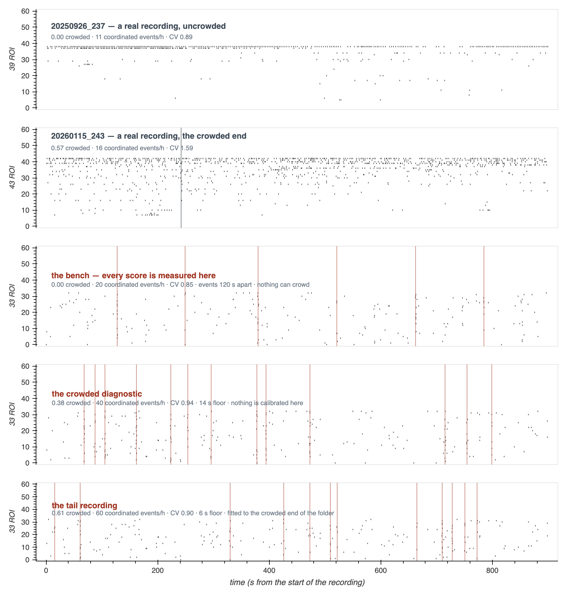
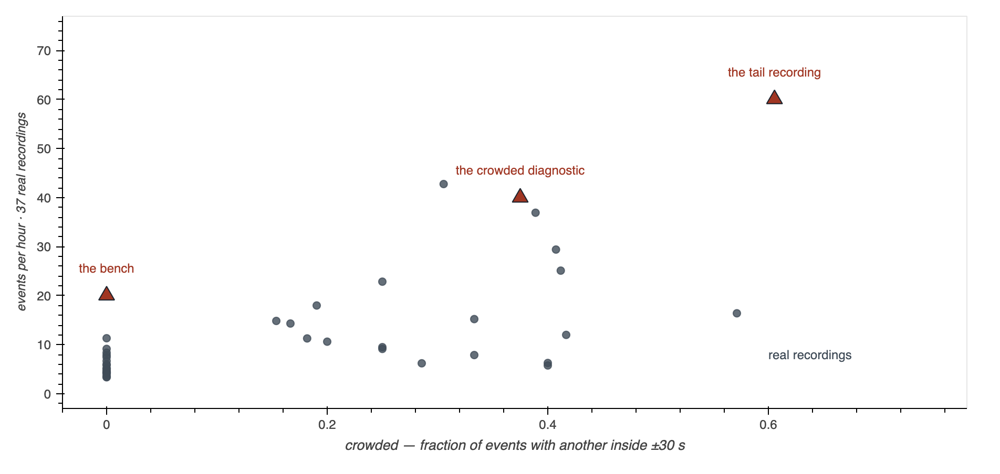

# The benchmark, what is wrong with it, and what the guard work found

> **Not murderboarded at time of writing.** Written for Tony, for one question:
> *what is the current state of the benchmark, and what have the last several sessions
> actually been arguing about.* Every number is quoted from a named tool or file.

Six sessions of work on one detector setting have been conducted entirely in summary
statistics, and nobody looked at the recordings. This starts with the recordings.

---

## 1. What the data looks like

Five recordings, the same 15 minutes of each, drawn the same way. **One row per ROI**,
one mark per event, quietest ROI at the bottom. The **vertical lines are coordinated
events** — *detected* on the two real recordings, because real recordings have no ground
truth, and *planted* on the three simulated ones, where we know the answer.

Three things to see, and the third is the one that matters most:

**The two real rows do not look like the three simulated rows.** In a real recording one
or two ROIs carry an enormous share of the activity — the near-solid line across the top
of both real panels is a *single ROI* firing almost continuously. The simulated
background is even: every ROI fires at about the same rate, and no row stands out.

**Coordinated events are rare in real recordings.** The uncrowded real recording has 11
an hour, so in 15 minutes there are about three, and none happens to fall in this
window. The simulated recordings have 20, 40 and 60 an hour — you can see the planted
events as clean vertical stripes.

**You can see the bench's spacing rule.** In the bench panel the planted events are
never close together. That is not chance: `BENCH_RECORDING` sets `min_sep_sec = 120`,
and it matters enormously — see §3.

---

## 2. Where the simulated recordings actually sit

Every real recording in the export folder as a dot, on two axes:

- **crowded** — the fraction of that recording's events with another event within ±30 s.
  30 s is half CoactDetect's 60 s reference window, so this is exactly *"how often does
  one event sit inside another's reference."*
- **events per hour** — how much coordination there is at all.

The three simulated recordings are the triangles. Reading it:

| | crowded | events/h | where it sits |
|---|---|---|---|
| **the bench** | 0.00 | 20 | at the real median crowding, but denser than most real recordings there |
| **the crowded diagnostic** | 0.38 | 40 | at the top edge of the real cloud |
| **the tail recording** | 0.61 | 60 | **outside the real cloud entirely** |

**The tail recording is in the wrong place, and this figure is how I found out.** It was
built last session to reach the crowded end. It does — but it gets there by being
*dense*, and the real recording at 0.57 crowded (`20260115_243`) has only **16 events an
hour**. Real recordings reach the crowded end two different ways, and only one of them is
simulated:

- **dense and regular** — `20260706_343`, 37 events/h, interval CV 0.93.
- **sparse but bursty** — `20260115_243`, 16 events/h, interval CV **1.59**.

The tail recording takes the first route and overshoots it. The second route is
unsimulated. §6 says what to do about it.

---

## 3. Which detector, and what a "guard" is

Everything below is about **CoactDetect** (`coact`) on the **FAST** stream, at its
shipped operating point: 2 s bins, a 60 s reference window, `alpha = 1e-4`, 100
surrogates, and a minimum of 3 distinct ROIs. LoCo has the same problem and is discussed
where it differs, but nothing here changes it.

**How CoactDetect works, in four sentences.** Time is cut into 2 s bins. For each bin it
counts how many *distinct* ROIs have an event in it. To decide whether that count is
surprising, it builds a null: take the 60 s window centred on that bin, circularly shift
each ROI's events within it at random, and count again — a hundred times. If the real
count beats that null by enough, the bin fires.

**The problem is one sentence.** The bin being tested is *inside* the window used to
judge it. Its own events help build the bar it has to clear. Radar named this in the
1960s and gave it two forms:

- **self-masking** — an event raises its own threshold.
- **mutual masking** — a *neighbouring* event, inside the same reference window, raises
  it too. This is why crowding matters: at a 60 s window, a neighbour within 30 s is in
  the reference.

**A guard is the standard fix**: cut a band out of the reference around the moment being
tested, so the event's own energy is not in its own background estimate. Every CFAR radar
detector has had guard cells since the 1970s.

**In bugarach the guard exists and is switched off** — `guard_sec = 0.0` on all three
rolling detectors. `docs/forks.md` §4a explains why: the guard's recall gain was measured
as *flat across the neighbour gap*, meaning it helped isolated events as much as crowded
ones, which makes it a threshold knob rather than a masking fix. **That conclusion is
what the last several sessions have been testing.**

---

## 4. What happened, session by session

**The guard moves the bar in two directions at once.** Splitting bins by whether the
excised band actually held any events, the bar *falls* where the band held events and
*rises* where it held nothing. Opposite signs, every seed. (#308, #310)

**The rise has a closed form, and it is not biology.** CoactDetect's bar is a *density* —
events divided by the length of the line they are shuffled on. Cutting a band out shortens
that line. If the band held no events, the numerator is untouched and the bar rises by
exactly `C / (C − guard)`: 1.0909 at a 5 s guard, 1.5000 at 20 s. Measured: 1.0964 and
1.5092. No free parameter. (#315)

**Radar, astronomy and genomics all met this, and two of them fix it.** Radar's estimate
is a *mean over N cells* — drop a cell and both the sum and N shrink, so nothing moves;
and a radar reference cell is never empty, so the asymmetry is invisible there. Gamma-ray
astronomy carries the exposure ratio explicitly as α and puts exclusion regions in the
denominator; genomics scales its local background by window length. bugarach shortened
the line without renormalizing. (#315)

**Fixing it does not improve F1.** Once `alpha` is re-swept, every guard configuration's
best F1 is inside one seed standard deviation of no guard at all — on every recording.
`alpha` alone moves F1 further than the guard does. (#317)

**But two thirds of that test could not have found anything.** `BENCH_RECORDING` spaces
events 120 s apart against a ±30 s reference window, so **no planted event is ever inside
another's** — measured crowding **0.00**. Mutual masking is impossible by construction on
the recording every score is measured on, and `bench.py` says so about itself. (#319)

**In the tail, the gain is not flat.** Given a recording that reaches the crowded end,
and with the normalization fixed, the guard buys **+0.071 recall in the `<10 s` bin and
0.000 in every other bin** — against a no-guard control loosened to the same overall
recall *and* the same precision. (#325)

---

## 5. The guard variations, and how they perform

There are two axes: **how wide** the guard is, and **what it removes**.

| | what it does |
|---|---|
| `guard_norm="compact"` | *shipped.* Removes the excised events **and** the excised span — the two side pieces are laid end to end and shuffled on the shorter line. |
| `guard_norm="exposure"` | Removes the excised events and **keeps the window length**. Counts come out; exposure does not. |

`compact` is why the bar rises where nothing was excised:

Open circles are `C / (C − guard)`, not a fit. On the `compact` rows the red bar stops on
them. On the `exposure` rows it collapses to the line — and the blue bar gets **much
longer**, because the normalization had been cancelling most of the relief.

### Performance, on F1: nothing

Best F1 over the `alpha` grid, 12 seeds. Every entry is inside one seed sd of the
no-guard entry beside it.

| recording | no guard | 5 s compact | 5 s exposure | 20 s compact | 20 s exposure | seed sd |
|---|---|---|---|---|---|---|
| quiet | 0.703 | 0.711 | 0.709 | 0.731 | 0.723 | ±0.056 |
| busy | 0.613 | 0.617 | 0.630 | 0.625 | 0.584 | ±0.071 |
| crowded | 0.882 | 0.885 | 0.885 | 0.883 | 0.884 | ±0.017 |

One thing *did* move, exactly as predicted: 20 s `exposure` peaks at `alpha = 1e-7` where
20 s `compact` peaks at `1e-5`. The bar genuinely dropped, so it takes two more decades of
strictness to get back — which is CFAR's own rule showing up in a measurement.

### Performance, on recall in the tail: a real effect, in one bin

The dashed red line is the control: **no guard at all**, with `alpha` loosened until it
matches the guard on overall recall (0.865 vs 0.871) *and* precision (0.910 vs 0.909). It
lands on the guard in every bin except the tightest.

| gap bin | `<10s` | `10-20s` | `20-30s` | `30-60s` | `>60s` |
|---|---|---|---|---|---|
| planted events | 591 | 1220 | 783 | 1207 | 519 |
| **guard − control** | **+0.071** | −0.009 | −0.007 | +0.003 | −0.000 |
| seeds agreeing | 17/24 | 9/24 | 7/24 | 4/24 | 1/24 |

One bin moves, four are flat, and the one that moves is the only one where events sit
inside each other's reference window. A threshold change matched on both margins cannot
buy those 7 points.

**So the guard does real masking work, and only where events crowd.** §4a's *instrument*
was right; it was defeated by a recording with a 14 s floor and by a normalization that
cancelled most of the effect.

**And it is still not worth switching on.** The effect lives in 14% of events on a
diagnostic recording nothing is calibrated on, at a 20 s guard, and it does not move F1.

---

## 6. What is actually wrong, and what I would do next

**1. The tail recording is in the wrong place — and I built it.** It reaches 0.61 crowded
at 60 events/h; the real recording at 0.57 crowded runs at 16. Fix: reach the tail the
*second* way — hold the rate near 16/h and raise `interval_cv` toward the real 1.59 —
and check whether the `<10 s` effect survives when crowding comes from bursting rather
than density. Until that runs, the +0.071 is a result about dense crowding only.

**2. The bench's background is flat and real backgrounds are not.** Panel 1 of the raster
figure is the argument: one ROI carries the recording. `assess` already fits the shape
(`MEASURED_RATE_SHAPE` = 0.275) and `docs/learned/flat_vs_fitted.json` shows swapping it
moves scores far more than seed noise — `rate` 0.636 → 0.547 and `sync` 0.367 → 0.500,
which very nearly swaps them, while `coact` and `loco` both gain about 0.03. This is
bigger than anything the guard work found, and
`docs/todo/2026-08-23-revise-the-bench-recording-before-the-refit.md` already argues it.

> ⚠ **A correction I owe, since I wrote the error twice.** That todo says the swap
> *"reorders the six"*, and `docs/reviews/guard_prior_art_2026-08-26.md` repeated it from
> there. **It does not.** Ranked by F1 the order is identical under both fields —
> coact > loco > rate > sync > cicada > sce. What moves is the *spacing*: rate and sync
> close from 0.269 apart to 0.047 apart without crossing. The review doc is corrected in
> this branch; the todo belongs to another session and is left alone.

**3. `forks.md` §4a needs a ruling.** Its conclusion is now false in the tail. It has been
left untouched through four merged PRs because amending it is Tony's call, not a patch.

**4. LoCo is unfixed.** It has the same density inflation, damped by an integer-valued
percentile — it moves about half of `C / (C − guard)`, in the predicted direction. No fix
is offered because its threshold pool is built over bins inside each half, so `exposure`
is not a one-line change there.

**5. Nothing here is about real slices.** Every performance number is simulated. The only
real measurements in this document are the crowding statistics and the two rasters.
