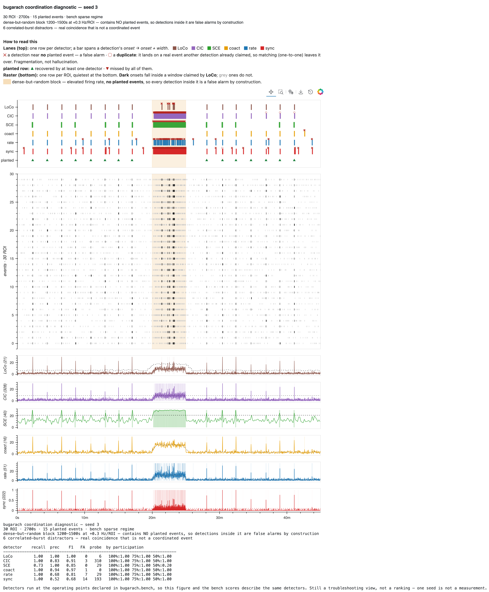

# The coordination generator

`bugarach.simulate.simulate_coordination` builds a synthetic recording with
**coordinated events planted into it at known times, with known participants**,
so a detector can be scored against what was actually there rather than against
another detector's opinion. It emits a real `Slice`, so every detector consumes
it with no adapter.

```python
from bugarach.simulate import simulate_coordination
from bugarach.score import score_stream

s, gt = simulate_coordination(seed=1)
score_stream(gt, loco_detect(s).streams["events"])
```

Every figure below is regenerable:

```bash
python tools/make_generator_figures.py --out docs/generator     # all of them
python tools/make_generator_figures.py --param jitter_sec       # just one
```

Each shows the same recording at three or four values of one knob, everything
else held, with **▲ marking planted event times** and onsets belonging to a
planted event drawn dark against a muted background.

---

## Why this document exists

The generator's parameters are the experiment's assumptions. `simulation_plan.md`
§5 records what two of them cost when they were wrong: event spacing that put
four coordinated events inside every null window, and invented timescales that
survived two rebuilds because nobody had a picture of what they implied. The
middle rebuild is the cautionary one — it fixed the thing everyone was looking
at, looked repaired, and was still wrong.

A knob whose effect you cannot see is a knob you are guessing at.

---

## Structure

| what | how |
|---|---|
| background | per-ROI homogeneous Poisson at `bg_rate_hz` |
| coordinated events | `n_per_level` events at each fraction in `participation`, interleaved in time, participants drawn without replacement |
| timing | renewal placement with a `min_sep_sec` floor and tunable `interval_cv` |
| participant onsets | jittered around the event time, SD `jitter_sec`, quantized to `grid_sec` |
| promiscuity probe | `hot_window` — a dense-but-random block at `hot_rate_hz`, ramping in over `ramp_sec`, containing **no** planted events |
| distractors | `n_distractors` correlated population bursts recruiting `distractor_frac` of ROIs — real coincidence that is **not** a coordinated event |

Ground truth travels with the data: `gt.events` carries `(time, frac, n_part,
rois, jitter_sec)` per event, `gt.distractors` the negatives, and
`gt.participation_mask(n_roi)` the per-(ROI, event) label. Detector outputs are
never labels — scoring against them yields a detector emulator.

---

## Parameters

### `bg_rate_hz` — background firing rate (default 0.05)


The planted events are identical in all four rows; only how far they stand out
of the background changes. This is the sparse/dense axis the bench shifts along
(0.05 → 0.15), and the axis on which RateDetect and spike-sync collapse.

### `participation` — fraction of ROIs recruited (default `(1.0, 0.75, 0.50)`)


One value per row here; normally all three are interleaved in one recording so
recall can be broken down by level. The **participant floor**: somewhere down
this axis every detector stops seeing the event, and a detector that finds every
all-ROI event and nothing at 50% is a different instrument from one that
degrades gracefully — the two share a headline recall.

### `jitter_sec` — how tightly participants fire together (default 0.05)


0 is a perfect vertical stripe. By 2 s the event is a smear no coincidence
detector can bind, and it is no longer meaningfully "an event" at all. This is
the tightness axis, and the one the upstream calibrated benchmark replaced with
values **measured off real recordings** — see the domain-gap warning below.

### `min_sep_sec` — the spacing floor (default 15.0, bench uses 120.0)


**The contaminated-null axis, and the most consequential knob here.** Detectors
estimate their null over context windows up to 120 s wide. At 15 s spacing,
several coordinated events sit inside every context window, so the
circular-shift "null" is built from data containing real coordination and the
threshold inflates. That is exactly what made the first upstream benchmark
unusable and cost two weeks of tuning against it.

`bugarach.bench` sets 120 s for this reason, and that constraint is what sets
the bench recording's 45-minute duration rather than the other way round.

### `interval_cv` — irregularity of the gaps (default 1.0)


0 is metronomic, 1 is Poisson-like above the floor, >1 is bursty. The default is
**1 and not 0 deliberately**: evenly spaced events let a model predict from the
clock instead of from the activity, and score well on synthetic data for a
reason that does not transfer.

### `hot_window` / `hot_rate_hz` / `ramp_sec` — the promiscuity probe


A dense-but-random block (shaded) with **no planted events**, ramping in rather
than stepping — a sharp step produced a boundary false alarm upstream. A
detector keyed on rate lights it up; one keyed on coordination does not. On the
bench this separates the six sharply: CICADA fires ~59 times a minute inside it,
CoactDetect ~0.4.

Its firings are counted separately and kept **out** of headline precision. Folded
in, the probe dominates everything and the number stops measuring the detector:
CICADA reads F1 0.09 that way against 0.68 in the upstream campaign.

### `n_distractors` / `distractor_frac` — correlated bursts (default 0)


Real cross-ROI coincidence that is not a coordinated event. They look like
events in the raster on purpose — they are the negatives that separate "found
coordination" from "found several things happening at once". Recorded in
`gt.distractors`, never in `gt.events`; firing on one is counted but not scored
as a false alarm, because whether a burst *should* count is a live question and
the count is how it gets settled.

### `grid_sec` — imaging-grid quantization (default 0.1)


0 is continuous time. Coarse grids collapse jitter into lockstep, which flatters
any detector binning at the same scale. Uses MATLAB rounding (halves away from
zero) — numpy's round-half-to-even moves events between bins.

### `n_roi` — population size (default 30)


Participation is a fraction, so the absolute number of co-firing ROIs scales
with this — and every detector with a `min_rois` floor has an implicit opinion
about it.

### The rest

| parameter | default | note |
|---|---|---|
| `duration_sec` | 600.0 | bench uses 2700; long enough to space events past the context window |
| `n_per_level` | `(5, 5, 5)` | events at each participation level |
| `spacing` | `"renewal"` | or `"uniform"` — uniform placement with a min-separation rejection loop, which is the MATLAB behaviour |
| `margin_sec` | 5.0 | keep-out at each end |
| `streams` | `("events",)` | single-stream by decision; `("fast","slow")` duplicates into the canonical two-stream shape |
| `regions` | `None` | **none by default** — see below |
| `seed` | `None` | `None` is nondeterministic; an int is reproducible on every platform |

---

## `regions` — why it defaults to nothing

Until 2026-08-13 the generator stamped every recording with a region named
`baseline` spanning the whole duration. That reads as harmless metadata. It is
not: `baseline` is a label from the wet-lab protocol, and the region windowing
rules read it as the pre-solution period and trim analysis to its final
`baseline_window_max_sec` (1200 s).

SCE honours that trim. LoCo and CICADA do not restrict detection to the window.
So on a 45-minute recording SCE analysed 1500–2700 s while being scored against
the 15 events planted across all of it — a recall ceiling of 7/15. It measured
0.40 and read as the weakest of the six. It is in fact the **most precise**
(1.00 in both regimes); it was being shown 44% of the data.

| | with the region | without |
|---|---|---|
| SCE recall | 0.40 | 0.73–0.87 |
| SCE F1, sparse | 0.56 | 0.89 |
| LoCo, CICADA | — | unmoved |

A synthetic recording has no baseline and no treatment period. Pass `regions=`
to simulate a protocol on purpose; that is the only way it should happen.

---

## Does this match the simulation the detectors were tuned on?

**No, and the differences are worth knowing before comparing any number here to
the MATLAB campaign's.**

Stated up front: this section is assembled from what this repo records about
`generate_synth_coord.m` and `generate_coord_benchmark.m`, **not from running
them**. That needs MATLAB and an interface2 checkout, neither of which is
required to run or validate the ports. Confirming these against execution is
outstanding work.

| | upstream (tuning) | here | consequence |
|---|---|---|---|
| **RNG** | `poissrnd` / `randn` / `randperm` | numpy legacy `RandomState` | not bit-parity, **by design** — only `rand` is bit-compatible, which is why the *detectors* could be matched to 1e-9 and the generator cannot be |
| **event spacing** | 150 s (FAST) / 300 s (SLOW) in the calibrated benchmark | `min_sep_sec` default **15 s**; bench uses 120 s | the default is ~10× denser than the benchmark the optima came from — squarely in the contaminated-null regime |
| **interval distribution** | uniform placement with min-separation rejection | renewal process, `interval_cv` default 1.0 | different by choice; `spacing="uniform"` reproduces the MATLAB behaviour |
| **benchmark structure** | *one* recording holding a participation × tightness grid across a sparse→dense background ramp | two discrete regimes, fixed participation levels | scores here are not cell-for-cell comparable to `score_coord_grid.m`'s |
| **region trimming** | optima measured with trimming **disabled** (`NOTRIM`, `clamp_context_to_region=false`) | detectors default to `clamp_context_to_region=True` | the windowing context differs from the one the operating points were derived under |
| **timescales** | onset jitter and per-ROI rates **measured off real recordings** | `jitter_sec=0.05`, `bg_rate_hz=0.05` with no recorded provenance in this repo | the largest gap, and the one §6 names as the honest blocker |

The last row is the one that matters most. `simulation_plan.md` §5 puts it
directly: **domain randomization widens a distribution, it does not center one.**
Sampling event spacing over [10, 60] s when reality is 150 s covers reality zero
percent of the time and produces a confident-looking training set.

### What follows from that

Four of the six detectors' declared operating points are **not** F1-optimal on
this generator (see
[`docs/todo/2026-08-12-reconcile-detector-defaults.md`](todo/2026-08-12-reconcile-detector-defaults.md)).
That is not evidence the defaults are wrong. Re-tuning to a synthetic benchmark
whose realism nothing has measured is the trap this project already paid for —
*stranded validation*, and *the benchmark, not the detectors, was the original
problem*. What would license a change is the real-data validation §6 names, not
a better F1 against data we generated ourselves.

One point of agreement is worth recording: upstream's `rate excess_thr=10` was
untrustworthy because it sat at the edge of its swept range, and a wider sweep
here finds the same value as a genuine interior peak. An independent bench
reproducing an upstream optimum is the useful kind of agreement.

---

## Seeing it against the detectors

`tools/make_diagnostic.py` renders the same recording with detector lanes above
the raster and **each detector's analysis trace below it** — the statistic it
actually thresholds, with its threshold drawn and its claimed windows shaded.

```bash
python tools/make_diagnostic.py --bench sparse --out docs/generator
```



`--bench` renders `bugarach.bench`'s own recording, so the figure and the bench
scores describe the same run rather than merely the same detectors. That view is
what found the region bug above: SCE's trace simply stopped, and no amount of
staring at the scores would have said why.

### ✕ and ○ are different failures

A **✕** is a detection near no planted event. A **○** is a *duplicate*: it lands
on a real event that another detection already claimed, and greedy matching is
one-to-one, so it is left over.

The distinction matters because the two have different causes and different
fixes — fragmentation is a merge-gap problem, firing at noise is a threshold
problem — and precision that lumps them together cannot tell you which you have.
Measured on the sparse regime, outside the probe block: CICADA's false alarms
are *all* within 2 s of a planted event, while RateDetect's and spike-sync's sit
30 s+ away from anything. Those are not the same detector failing in the same
way.

The lane figure drew both as ✕ until 2026-08-13, and worse, marked them by
**point** scoring while the scoreboard beside it used spans — so every SCE
detection got an ✕ while sitting on top of the event it had found. Noticing that
"almost every ✕ has an event next to it" is what surfaced it.
