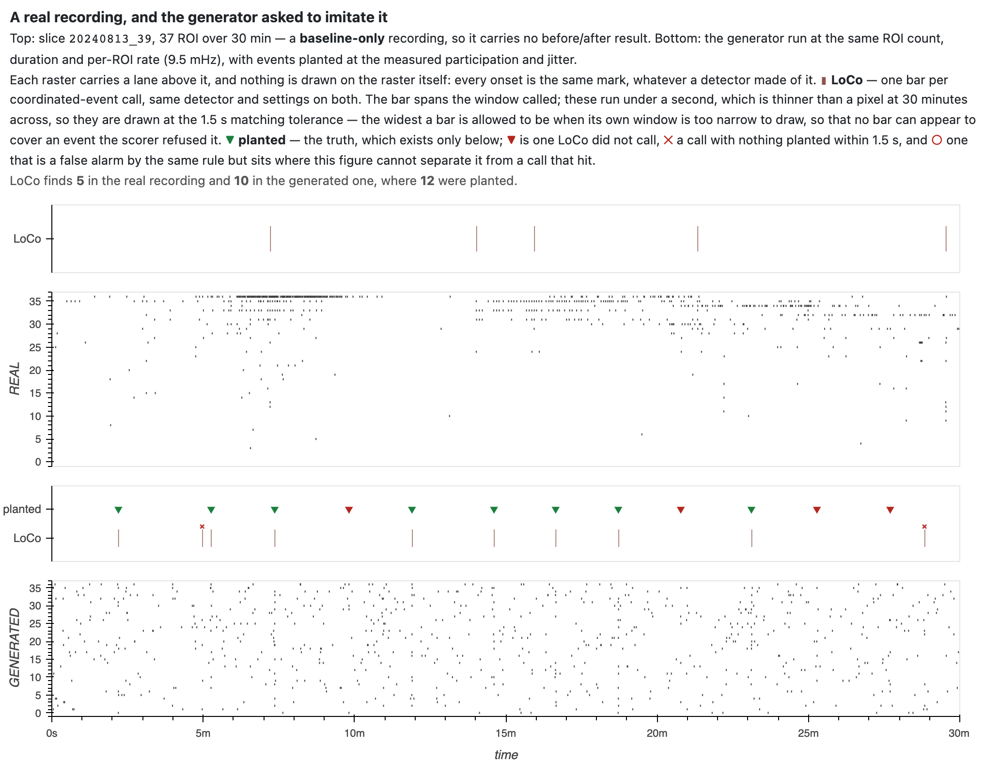
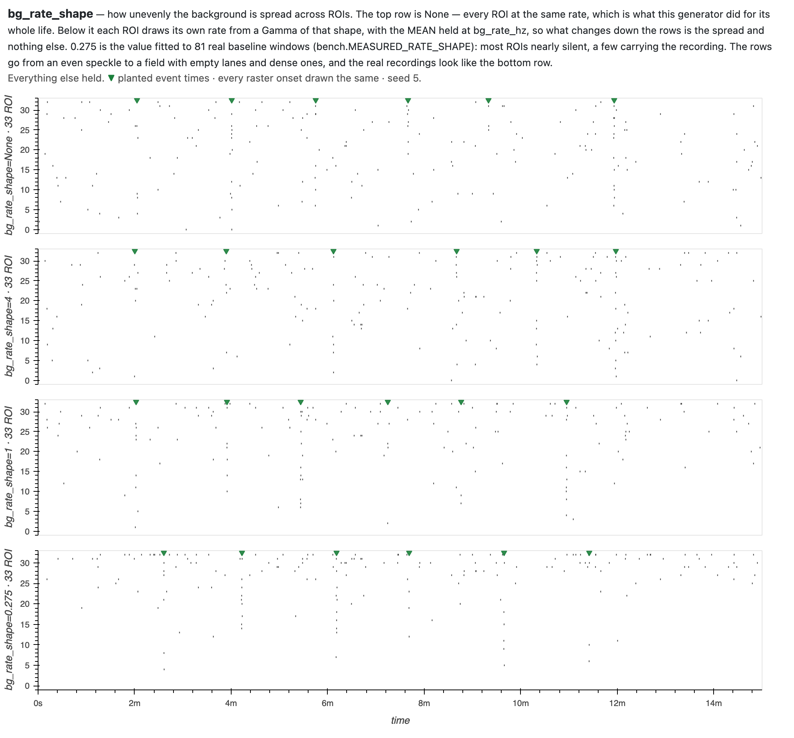
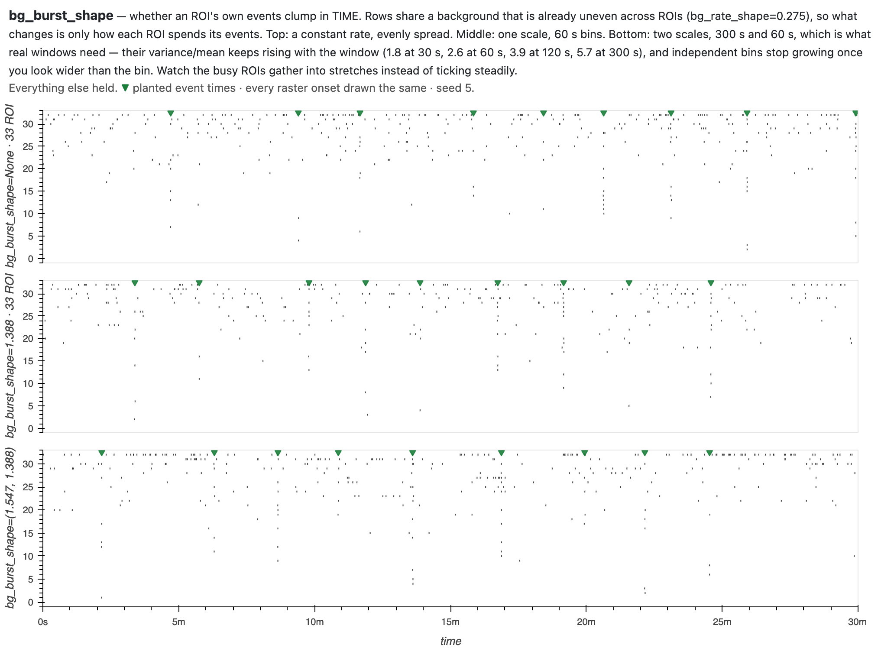

# The coordination generator

`simulate_coordination` builds synthetic recordings that stand in for a real
slice's event data, with the coordinated events **planted** — their times and
participants known exactly. A detector run on one can be scored against what was
actually there, instead of against another detector's opinion.

Terms — ROI, slice, stream, and the six detectors — are defined in
[`GLOSSARY.md`](GLOSSARY.md). The six are **LoCo, CICADA, SCE, CoactDetect,
RateDetect and SPIKE-synch** (written `spike-sync` in code); a *stream* is one
channel of onset times per ROI.

---

## Start here: what it is imitating, and how well



Top is a real recording. Bottom is the generator given its ROI count, its
duration and its per-ROI rate, with events planted at the measured participation
and jitter. Same detector, same settings, on both.

**They do not look alike, and the difference is not in the numbers this document
spends most of its length on.** Population, duration and per-ROI rate are taken
from this recording; participation and jitter from the campaign's measurements.
Spacing and irregularity are the bench's own settings, matched to no property of
this slice, and the probe, the distractors and the imaging grid play no part at
all. What the figure does not match is the *shape* of the background (`--seed 5`,
so the generated column reproduces). Half of that gap now has a knob and half
does not — `bg_rate_shape` spreads the background unevenly across ROIs, nothing
yet makes it bursty in time — and **the figure shows the flat default**, which is
still what the bench runs:

| | real slice | generated |
|---|---|---|
| spread of per-ROI rates (CV) | **2.04** | 0.24 |
| quietest → busiest ROI | 0 → 99 mHz | 7 → 18 mHz |
| share of all events in the busiest ROI | **28.1%** | 4.4% |
| clumping of events in time (CV per minute) | **0.78** | 0.25 |

A real field has a few ROIs carrying most of the activity and many carrying
almost none — one ROI here holds 28% of every event in the recording — and the
activity arrives in bursts. The generator draws a **homogeneous Poisson process
with the same rate for every ROI**, so its field is flat in both directions.

**This is the rule, not this slice.** Across the baseline window of every
archived slice that has one — 81 windows, 2 643 ROIs, fast stream — the per-ROI
rate has a median of **1.7 mHz**, an interquartile range of **0.0–10.6**, and a
maximum of **486**. The generator's quiet regime sits at a median of 11.1
(IQR 10.0–12.6) with a maximum of **16**. It is wrong in both directions at once:
its typical ROI is about six times busier than the real median, and its busiest
is thirty times quieter than the real maximum. **Thirty-five percent of real ROIs
record no events at all** in their baseline window, against none in either
generated regime, and within a slice the mean per-ROI rate runs a median **2.6×**
its median — a symmetric distribution gives 1.0. No setting of `bg_rate_hz`
repairs any of this, because that knob scales every ROI together. Reproduce with
`python tools/make_roi_rate_distribution.py` (`--numbers-only` prints the table
and writes no figure; both forms need `$BUGARACH_DATA_ROOT`, because the survey
reads the real archive).

⚠ **A zero-event ROI is not a dead ROI.** That verdict is made at export, in
MATLAB, which sees every treatment of an ROI at once: it requires silence at
baseline *and* under drug *and*, where the slice has one, under a high-potassium
positive control — a record the baseline-only restriction in
[`FOUNDATIONS.md`](FOUNDATIONS.md) §9 puts out of reach here. The dead rate lands
nearer 3%. The 35% above is a property of the window, not a judgement about the
cell.

That matters for these detectors specifically. Four of the six count *distinct
ROIs coactive* — CoactDetect, LoCo, binned SCE and CICADA; RateDetect scores a
population-rate excess against a slow context rate, and SPIKE-synch a
synchronization profile. For the four, a population where most ROIs contribute
almost no events has a much smaller effective size than its ROI count suggests;
for all six, a circular-shift null built from a flat field is not the null a
clumpy one produces. LoCo finds 5 coordinated events in the real recording and
10 in the generated one — the synthetic recording is the easier problem.

**So the calibration below is necessary and not sufficient.** Getting the rate,
jitter and participation right — which took finding out they were 5×, 7× and
2.8–5.6× wrong — fixes the marginal distributions and leaves the structure
untouched.

---

## What an unexamined default already cost

Until 2026-08-13 four of this generator's parameters were guesses. They were not
close, and every one of them made coordination **easier to find** than it is:

| knob | assumed | measured | |
|---|---|---|---|
| background rate | 0.05 Hz/ROI | **0.0096 Hz/ROI** | assumed 5× busier |
| onset jitter | 0.05 s | **0.36 s** ⚠ | assumed 7× tighter |
| participation | 50–100% of ROIs | **6 of ~33 ≈ 18%** | assumed 2.8–5.6× more |
| population | 30 ROIs | ~33 | right |

The measurements were not missing — they were in
`constellation/coordination_timescale_summary.csv` the whole time, produced by
interface2's `run_coordination_timescale_batch.m`.

**What that hid.** On the invented values most detectors scored F1 ≥0.9 and the
bench could barely tell them apart. (⚠ that run is not exactly reproducible — the
same historical configuration also emitted the spurious region below, so the two
defects are entangled in any reconstruction.) On measured values they run 0.32–0.78 and
separate, because a real coordinated event recruits about **six ROIs** — twice
the `min_rois = 3` floor that LoCo, SCE and CoactDetect ship with, and close
enough to it that a detector's floor decides what it can see. That is the
regime the instruments were built for, and the only one where their differences
show.

A second default cost more than it looks. The generator used to stamp every
recording with a region named `baseline`, which the region-windowing rules read
as a wet-lab protocol label and trim to its final 1200 s. SCE honours that trim,
so it analysed 1500–2700 s of a 45-minute recording — **44% of the data** — while
being scored against the events planted across all of it. It is now off by
default; pass `regions=` to simulate a protocol deliberately.

---

## Why this document exists

The generator's parameters are the experiment's assumptions. The plan's catalogue
of traps records what two of them cost: event spacing that put four coordinated
events inside every null window, and invented timescales that survived a rebuild
because nobody had a picture of what they implied. That middle version is the
cautionary one — it fixed the thing everyone was looking at, looked repaired, and
was still wrong.

A knob whose effect you cannot see is a knob you are guessing at. So every
parameter below has a figure.

---

## What a recording contains

| component | how it is generated |
|---|---|
| background | per-ROI homogeneous Poisson at `bg_rate_hz` |
| coordinated events | `n_per_level` events at each fraction in `participation`, interleaved in time, participants drawn without replacement within an event |
| timing | renewal placement with a `min_sep_sec` floor and tunable `interval_cv` |
| participant onsets | jittered around the event time, SD `jitter_sec`, quantized to `grid_sec` |
| promiscuity probe | `hot_window` — extra background at `hot_rate_hz`, ramping in over `ramp_sec`, containing **no** planted events |
| distractors | `n_distractors` correlated bursts recruiting `distractor_frac` of ROIs — real coincidence that is **not** a coordinated event |

Ground truth travels with the data: `gt.events` carries `(time, frac, n_part,
rois, jitter_sec)` per event and `gt.distractors` the negatives. Detector outputs
are never labels — score against them and you measure agreement, not truth; train
on them and you get a detector emulator.

**How a detection is scored.** A detection is an interval `[onset, onset+width]`;
it matches a planted event when that event falls inside the span, or within
**`tol_sec = 1.5 s`** of its nearer edge. Matching is greedy and one-to-one:
closest pair first, each detection claiming at most one event. Recall is the
fraction of planted events matched; precision is matched detections over all
detections **outside the probe block**; F1 is their harmonic mean.

---

## Parameters

Each figure shows one recording re-rendered across several values of a single
knob. A green **▼** marks planted event times along the top — unconditioned here,
since these figures run no detector — and an open grey **▽** marks distractors
where a sweep plants any — both pointing down, at the rows
they are about. **Every raster onset is drawn the same.** Read the marks along the top
against an unmarked raster: if the structure is not visible there, that is the
finding, not a failure of the picture. (Why the rasters stopped being inked is in
the corrections appendix.)

### `bg_rate_hz` — background rate (default 0.05; bench uses 0.0052–0.0190)


The planted structure is the same in every row; only how far it stands out
changes. The middle three rows are the untreated interquartile range and its
median.

*Event times do shift between rows: the background draw consumes random numbers,
so the schedule redraws with the knob. Compare structure, not event for event.*

### `bg_rate_shape` — how unevenly the background is spread (default `None`; bench still uses `None`)



`bg_rate_hz` sets the background's *level*; this sets its *spread*. `None` gives
every ROI the same rate — the flat field, and what this generator did for its
whole life. A number draws each ROI's own rate from `Gamma(shape, mean/shape)`,
holding the mean at `bg_rate_hz`, so only the spread changes down the rows.

**0.275 is fitted, not chosen.** An ROI's rate is modelled as a Gamma and its
count as Poisson over that rate — Negative Binomial marginally — and 0.275 is
the maximum-likelihood shape over the 81 baseline windows above, each keeping
its own mean. `python tools/fit_background_shape.py` re-derives it and exits
non-zero if `bench.MEASURED_RATE_SHAPE` has drifted from the archive.

What makes it believable is what it was *not* asked to do. Nothing in the fit
targets the silent fraction, yet drawing at this shape leaves **38%** of ROIs
with no event against a real **35%**, at a median of 1.7 mHz against a real 1.7.
There is no zero-inflation term; the silence is what a low rate drawn from the
tail does over a finite window. A flat field at the same mean leaves 2% silent
at a median of 10.0 mHz — busier than a typical real ROI and missing every busy
one.

⚠ The tail overshoots — the fit reaches ~847 mHz where the data reaches 486.

⚠ **It is off, and the bench does not use it.** Every operating point and every
score in this document was measured on the flat field. Switching it on is a
recalibration, not a default change, and it has not been done.

⚠ **This fixes the ROI axis only.** Real activity also arrives in bursts *in
time*; this knob does nothing about that, and no clustered arrival process
exists here yet.

### `bg_burst_shape` / `bg_burst_bin_sec` — whether an ROI clumps in time (default `None`; bench still uses `None`)



`bg_rate_shape` decides which ROIs are busy. This decides whether a busy ROI
spends its events steadily or in bursts. `None` is a constant rate; a number
multiplies the rate in each bin by a `Gamma(shape, 1/shape)` draw, mean 1, so the
expected total is untouched and only its distribution over time moves. Counts per
bin are then Negative Binomial — the model the clumping was fitted under.

**This is what a "hot ROI" actually is.** Rate heterogeneity alone does not
produce one. On slice `20240813_39` the varied-rate generator gives its busiest
ROI 170 events against the real 178 — and it still does not read as hot, because
it spreads them at about six a minute where the real ROI puts **35 into one
minute and 57% of everything into three**. The eye is reading clumping, not
average rate.

**One scale cannot work, and the data says so rather than the model.** Real ROIs
keep getting more over-dispersed the wider the window:

| variance/mean | 30 s | 60 s | 120 s | 300 s |
|---|---|---|---|---|
| real baseline windows | 1.81 | 2.60 | 3.87 | 5.68 |
| constant rate | 1.00 | 1.00 | 1.00 | 1.00 |
| two scales, 300 s + 60 s | 1.87 | 2.76 | 3.04 | 4.44 |

Independent bins stop growing once the window exceeds the bin, so a busy stretch
spanning several minutes needs a coarse scale multiplying a fine one. Pass a
sequence: `bg_burst_shape=(1.547, 1.388)`, `bg_burst_bin_sec=(300.0, 60.0)`.
Both shapes are maximum-likelihood over the 783 ROIs carrying 10+ events in
their baseline window, each ROI keeping its own mean —
`python tools/fit_background_shape.py` re-derives them and exits non-zero on
drift.

Fixing the ROI is what makes the estimate clean: rate differences *between* ROIs
are constant inside one of them, so the over-dispersion left over is temporal.

⚠ **The coarse end is still short** — 4.44 against 5.68 at 300 s. The two shapes
are fitted per scale independently and then multiplied; a joint fit would not
give these two numbers, and the joint likelihood has no closed form. So a busy
stretch here is shorter than a real one.

⚠ **Interval distributions were not an option**, and that is a property of the
data rather than a preference — see the note under "Where the numbers come from".
A baseline window gives the median ROI under one event and leaves 35% with none,
so requiring a few intervals per ROI keeps 37% of them and drops exactly the
quiet ones. Binned counts survive that.

⚠ **Off, and the bench does not use it.** Every score in this document was
measured on a background that is constant in time.

### `participation` — fraction of ROIs recruited (default `(1.0, 0.75, 0.50)`; bench uses `(0.30, 0.18, 0.10)`)


The **participant floor**. Recall is reported broken down by this, and the six
detectors diverge sharply at the bottom of the range: in the **quiet regime** at
~3 ROIs, CoactDetect still finds 93% across the bench's three seeds while SCE,
RateDetect and SPIKE-synch find none. (The single-seed diagnostic beside this
page reports 80% for the same detector at the same setting — one seed is not a
measurement, which is why the bench pools three.) ⚠ CoactDetect's 0.93 falls to 0.20 in the busy regime — the floor moves
with the background.

⚠ The 10% level is ~3 ROIs, which is *below* the `min_rois=4` floor the
participation measurement itself was taken at. It is a stress point, not a
calibration.

### `jitter_sec` — how tightly participants fire together (default 0.05; bench uses 0.36)


⚠ **The figure cannot resolve this knob.** At 900 s across the panel, 0.36 s of
jitter is under one pixel — the rows are indistinguishable, and that is a
limitation of the rendering, not a property of the parameter. It needs an
event-scale inset before it earns its place; until then read the row labels.

⚠ **The least trustworthy number here.** 0.36 s comes from a statistic whose own
circular-shift surrogate null is **0.42 s** — destroy all cross-ROI phase and the
measurement barely moves, so most of that 0.36 is the width of the gather window
the measurement used, not coordination tightness. Its own source file marks it
*"secondary, flagged-soft."* Treat it as an upper bound at the estimator's
resolution; real tightness is unresolved.

### `min_sep_sec` — the spacing floor (default 15.0; bench uses 120.0)


**The contaminated-null axis, and the most consequential knob here.** The shaded
band is one 120 s detector context window, drawn to scale. At a 15 s floor
several events fall inside it, so the circular-shift "null" is built from data
containing the signal and the threshold inflates — the trap that made the first
upstream benchmark unusable.

That spacing sets the bench recording's 45-minute duration, not the other way
round. The renewal placer the bench uses needs a *mean* interval above the floor,
so 15 events at 120 s need **>1920 s** of placeable span — more than the 1680 s
that simple end-to-end spacing would suggest — and the probe window is excluded
from placement on top of that.

### `interval_cv` — irregularity of the gaps (default 1.0)


0 is metronomic, which lets a model predict from the clock instead of from the
activity — it would score well on synthetic data for a reason that does not
transfer.

⚠ At the bench's own spacing the knob still works but is heavily compressed: a
120 s floor with a ~136 s mean interval leaves little room above it, so setting
0 / 0.5 / 1.0 / 2.0 realizes **0.00 / 0.05 / 0.11 / 0.15** — a mean over ten
seeds, and worth stating because these move with the seed set. Quoted
whole-recording the realized CV is **0.80**, but that figure is carried almost
entirely by one gap — the schedule steps over the excluded probe window — so it
describes the probe, not the spacing. Both numbers are real; they are different
bases, and the 0.11 one is the one that answers "is the spacing irregular".

### `hot_window` / `hot_rate_hz` / `ramp_sec` — the promiscuity probe (off by default; bench uses 1200–1500 s at 0.06 Hz with a 30 s ramp)


Extra background inside the shaded block, with **no planted events**, ramping in
rather than stepping. In the **quiet regime** it separates one detector sharply:
CICADA fires **17.3 times a minute** in there, CoactDetect 0.0 and LoCo 0.1, with
SCE intermediate at 5.6.

Those firings are counted separately and kept **out** of headline precision —
folded in, the probe's severity would set everyone's precision instead of their
behaviour.

⚠ That separation is regime-dependent: in the busy regime CICADA and SCE
converge, so the probe distinguishes them only where the background is thin.

### `n_distractors` / `distractor_frac` — correlated bursts (default 0; bench uses 6 at 0.18)


Real cross-ROI coincidence that is not a coordinated event, marked **▽**. They
recruit the same fraction of ROIs as a planted event, so they are genuinely
confusable, and the six detectors answer them differently — in the **quiet
regime**, SCE fires on 3 of 18, SPIKE-synch 4, RateDetect 13, LoCo 16, CICADA and
CoactDetect 18. The 18 is the bench's 6 distractors pooled over its three seeds,
not a third setting of the knob. ⚠ The ordering reshuffles in the busy regime;
this is one regime's answer, not a ranking.

Detections on distractors match no planted event, so they **are** counted as
false alarms and do lower precision.

### `grid_sec` — imaging-grid quantization (default 0.1)


Coarse grids collapse jitter into lockstep, which flatters any detector binning
at the same scale. Uses MATLAB rounding — halves away from zero — because numpy's
round-half-to-even moves events between bins. The effect is sub-pixel at this
width; read the row labels, not the ink.

### `n_roi` — population size (default 30; bench uses 33)


Participation is a fraction, so the absolute number of co-firing ROIs scales with
this — and every detector with a `min_rois` floor has an implicit opinion about
the population size you set.

### The rest

| parameter | default | note |
|---|---|---|
| `duration_sec` | 600.0 | bench uses 2700; **2471 s** is the shortest that fits 15 events at a 120 s floor (bisected, all 15 placed on twelve seeds), so this carries some margin |
| `n_per_level` | `(5, 5, 5)` | events at each participation level |
| `spacing` | `"renewal"` | `"uniform"` reproduces `generate_synth_coord.m`'s rejection-loop placement |
| `margin_sec` | 5.0 | keep-out at each end |
| `streams` | `("events",)` | single-stream by decision; `("fast","slow")` duplicates into the two-stream shape |
| `regions` | `None` | see above — a named region triggers protocol windowing |
| `seed` | `None` | `None` is nondeterministic; an int reproduces on every platform |

---

## Where the numbers come from

**Baseline recordings only.** Treatments are what these instruments are pointed
at; taking the properties of coordination from them assumes the answer. Both
bench regimes are the interquartile spread of the untreated flavour itself —
0.0052 Hz/ROI at p25 and 0.0190 at p75, around a median of 0.0102. Untreated
slices vary 3.7-fold among themselves, and that variation is the axis an
operating point has to survive. Re-derived 2026-08-20 from the export folder,
the export folder the lab approved; the previous endpoints (0.0038 / 0.0175, a 4.6-fold
span) were fitted against the `.mat` store, which carries every recording ever
processed including the two the lab withdrew.

Source: `constellation/coordination_timescale_summary.csv`, flavour
`all-baseline`, fast stream, `min_rois=4`. **The denominators differ by row:**

⚠ The two regime endpoints are **derived, not read**: the file carries population
rates in events/min (`rate_p25` 7.55, `rate_p75` 34.88), and converting them to
per-ROI needs the same `rate_med / (60 × roiRate_mean_med)` ratio flagged below.
They inherit its uncertainty.

| quantity | value | n |
|---|---|---|
| per-ROI rate | 0.0096 Hz | **84** slices |
| onset jitter | 0.36 s (null 0.42) ⚠ | **47** — those in which a cluster resolved at `min_rois=4` |
| participation | 6 ROIs | **47**, same subset |
| event width | 0.9 s (fast) | 84 |

⚠ `n_roi ≈ 33` is **not a column in that file.** It is recoverable only as
`rate_med / (60 × roiRate_mean_med)` = 33.16 — a ratio of two independently taken
across-slice medians, which is not the median per-slice ROI count.

⚠ Participation is **left-censored by the instrument that measured it**: a
cluster below `min_rois` cannot be observed, so 6 is the median of a tail, and it
moves with the floor (4.5 at `min_rois=3`, 6 at 4, 9 at 6, 11 at 8).

---

## Does this match the simulation the detectors were tuned on?

**No.** Worth knowing before comparing any number here to the MATLAB campaign's.

This section is assembled from what the repo records about
[`simulation_plan.md`](simulation_plan.md) and the upstream sources, **not from
running them** — that needs MATLAB and an interface2 checkout. Confirming it
against execution is outstanding.

| axis | upstream (tuning) | here |
|---|---|---|
| random numbers | `poissrnd` / `randn` / `randperm` | numpy `RandomState` — only uniform draws agree bit-for-bit, which is why the *detectors* could be matched to 1e-9 and a generator cannot be |
| event spacing | 150 s fast / 300 s slow | default 15 s; bench 120 s |
| interval distribution | rejection-loop placement in `generate_synth_coord.m`; **exactly equal spacing** in the calibrated `generate_coord_benchmark.m` | renewal, `interval_cv` 1.0 |
| benchmark structure | one participation × tightness grid over a background ramp | two discrete regimes |
| region trimming | optima measured with trimming disabled | LoCo defaults to `clamp_context_to_region=True` |
| timescales | measured off real recordings | the same measurements — with the caveats above |

The third row deserves note: the benchmark the operating points came from places
events at *exactly equal* spacing, which is the metronomic case the `interval_cv`
default exists to avoid.

---

## What follows: no re-tuning is licensed

A sweep on this generator beats the declared operating point for **most of the
six**, in both regimes, and the set differs between them. SCE and SPIKE-synch are
beaten in both by wide margins; others turn on differences in the third decimal
(CoactDetect 0.768 against 0.776) that reverse with the seed.

**No tally is quoted here on purpose.** Two independent review rounds produced
three different counts from the same sweep, because the count is decided by ties.
A number that unstable is not evidence of anything, and the argument does not
need it.

**None of it licenses a change.** Re-tuning to a synthetic benchmark whose
realism rests on one unreviewed measurement, and which no real recording has ever
checked, is the trap this project already paid for.

⚠ SPIKE-synch's declared `C_threshold = 0.1` is **not on its own sweep grid**, so
its F1 at the shipped point is not evaluated by the sweep that judges it.

---

## What is still unsigned

The measurements above are real. The decision resting on them was never checked,
and this document would mislead a reader who stopped before here.

- **The campaign is marked PROVISIONAL by its own record.** `optim_history`'s
  README states that the calibrated settings were adopted into production
  *without* the real-data validation the deck named as its deciding step, and
  that a CICADA minimum-cell-floor flaw survived that adoption and is still open.
- **`jitter_sec` is calibrated to a near-null statistic** (0.36 observed against
  a 0.42 surrogate null), and the calibration does not round-trip: build a
  recording at 0.36 and the estimator that produced 0.36 measures ~0.64 back.
- **`bg_rate_hz` is a background rate; the measured value is a total rate** that
  includes the coordinated events, the probe and the distractors. Realized totals
  are **0.0114 Hz/ROI in the quiet regime against a nominal 0.0038** (3.0×) and
  0.0255 against 0.0175 (1.5×) — so the regime named for the untreated p25 is in
  fact busier than the untreated *median* it was cut from. ⚠ **Those realized
  totals were measured against the pre-2026-08-20 endpoints and have not been
  re-measured** since the axis moved to 0.0052 / 0.0190. The direction of the
  point survives — a nominal background rate is not the realized total — but the
  three ratios above are stale until someone re-runs them.
- **The background model now has both axes, and neither is switched on.**
  `bg_rate_shape` makes ROIs differ from each other — reproducing the 35% that
  record nothing, without modelling silence directly — and `bg_burst_shape` makes
  an ROI clump in time, reproducing the fine-scale over-dispersion. Both are
  fitted from baseline windows and both are re-derived by
  `tools/fit_background_shape.py`. What remains: **the coarse end of the temporal
  fit undershoots** (variance/mean 4.44 against 5.68 at 300 s), so a busy stretch
  is shorter here than in real tissue, and the two burst shapes are fitted per
  scale independently rather than jointly. And `BENCH_RECORDING` still runs a
  background that is flat in both axes, so **every score in this document is
  measured on the old one**. Turning either on re-derives the whole bench.
- **The bench has never been scored against a real recording.** Everything here
  is measured on data this generator produced. The figure at the top is the only
  thing in this document that touches real data, and it is a visual comparison,
  not a score.

None of these is a reason to distrust the *ports* — those are matched to their
MATLAB originals to 1e-9 on committed fixtures, which is a separate and much
stronger guarantee. They are reasons not to read a bench F1 as a statement about
real tissue.

---

## Seeing it against the detectors

`tools/make_diagnostic.py` renders a recording with detector lanes above the
raster and **each detector's analysis trace below it** — the statistic it
actually thresholds, with its claimed windows shaded. Four of the six also carry
their threshold as a dotted line; CoactDetect and RateDetect do not expose one to
the viewer, so their rows show the statistic alone.

```bash
python tools/make_diagnostic.py --bench baseline_quiet --seed 3 --scale 2 \
    --out docs/generator --tag bench_quiet \
    --hero docs/generator/coord_diagnostic_bench_quiet_hero.png
```


That view is what found the region bug: SCE's trace simply stopped, and no amount
of staring at the scores would have said why.

### ✕ and ○ are different failures

A **✕** is a detection that matched no planted event — nothing within the 1.5 s
tolerance of its span. A **○** is a *duplicate*: it lands on a real event that
another detection already claimed, and matching is one-to-one, so it is left
over.

The distinction matters because the causes differ — fragmentation is a merge-gap
problem, firing at noise is a threshold problem — and a precision number that
merges them cannot tell you which you have. Measured on the quiet regime, outside
the probe: **41% of CICADA's unmatched detections sit within 2 s of a planted
event**, against 0% for every other detector — whose medians run 31–47 s out,
except SCE at 8.3 s.

**These distances are onset-to-event**, not span-to-event: each unmatched
detection's own onset to the nearest planted time. That is a different basis from
the matching rule above, which asks whether the event falls inside the detection's
*span* (or within `tol_sec` of its edge) — a wide detection can therefore be far
in onset and close in span. The two bases give different numbers, so a comparison
against these figures has to use the same one.

---

## Appendix — running it

```python
from bugarach.simulate import simulate_coordination
from bugarach.detectors.loco import loco_detect
from bugarach.score import score_stream

s, gt = simulate_coordination(seed=1)
score_stream(gt, loco_detect(s).streams["events"])
```

Every figure regenerates:

```bash
python tools/make_generator_figures.py --out docs/generator   # all of them
python tools/make_generator_figures.py --param jitter_sec --out docs/generator
```

## Appendix — corrections to earlier versions

- **The rasters once inked the onsets inside an event.** Every raster in this
  document used to draw the onsets falling inside a detected or planted window
  dark and mute the rest. It read as the detector naming its participants, and it
  was this figure's own rule — *is this onset inside the window* — applied to the
  detector's output. No detector here returns that list; their results carry a
  window, and for five of the six a participant count. Worse for these pages, the
  ink in the knob sweeps was located by the **ground truth**, so a setting that
  planted something no detector could recover still produced tidy inked columns.
  Every onset now draws the same (Tony, 2026-08-18). `reality_check.png` held out
  longest — it is the one figure here that cannot be drawn without a real
  recording — and was rebuilt on 2026-08-22, the same day Tony opened the site and
  found it still carrying the old ink. Its detections moved to a lane above each
  raster at the same time, which is the other half of the same rule: the recording
  below, what a detector made of it above.

- **TTX is not a silencing control.** An earlier version treated a TTX-rate
  recording as an empirical null on the premise that blocked action potentials
  make coordination impossible, and proposed raising `min_rois` until TTX slices
  went quiet. Coordination *persists* under TTX — confirmed with these ports on
  the archived baseline/TTX slices — so that proposal would have deleted a
  finding rather than measured it. See [`FOUNDATIONS.md`](FOUNDATIONS.md) §9.
- **No treatment is a source for any coordination property.** Two earlier
  versions used senktide and then TTX as regime endpoints. Both are treatments.
- **The lane figure once drew duplicates as ✕**, and marked them by point
  scoring while the scoreboard beside it used spans — so every SCE detection was
  flagged a false alarm while sitting on the event it had found.
