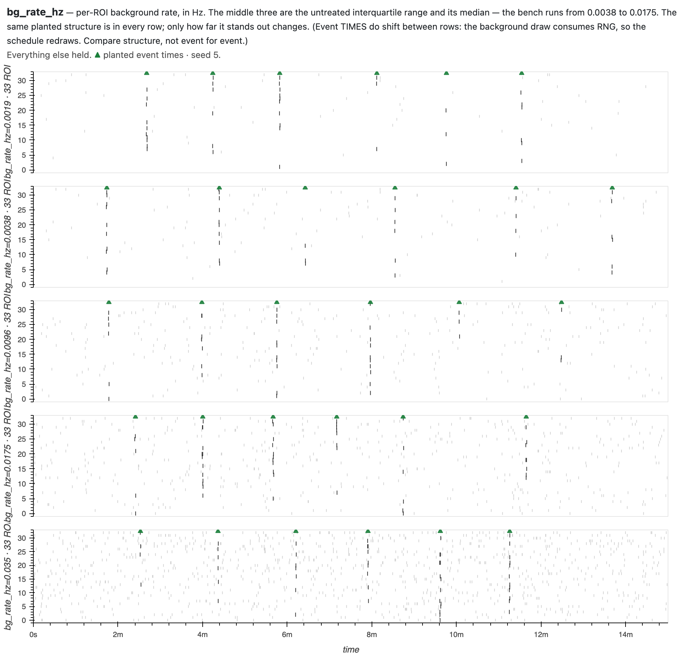
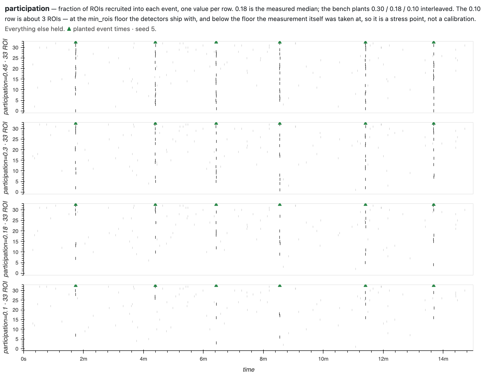
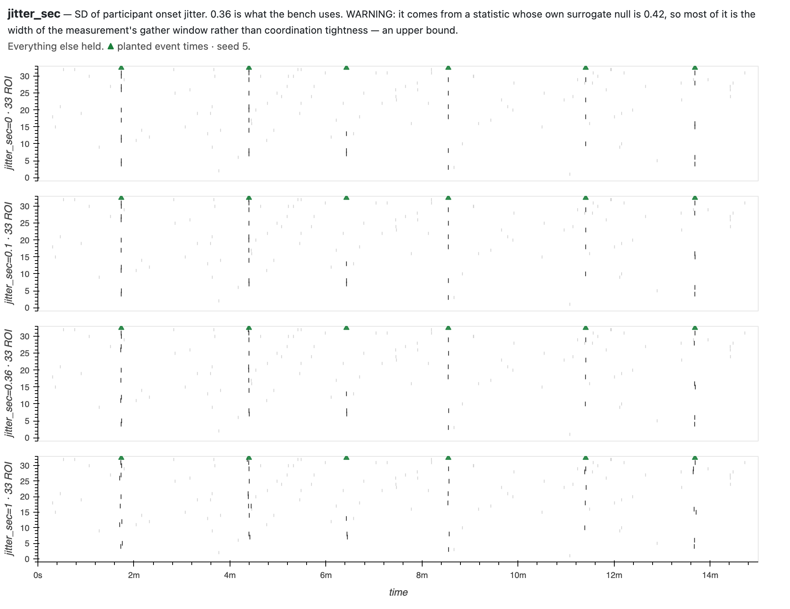
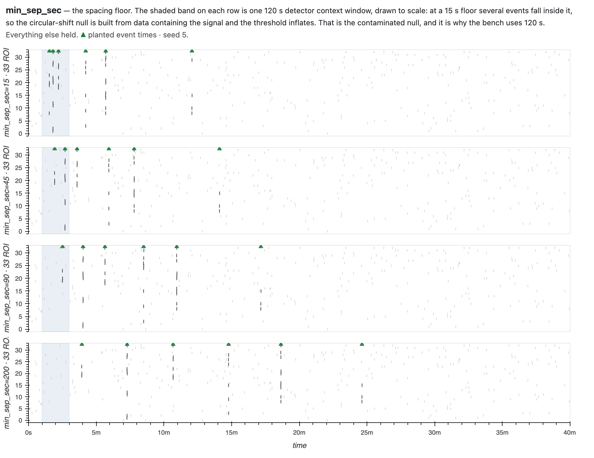
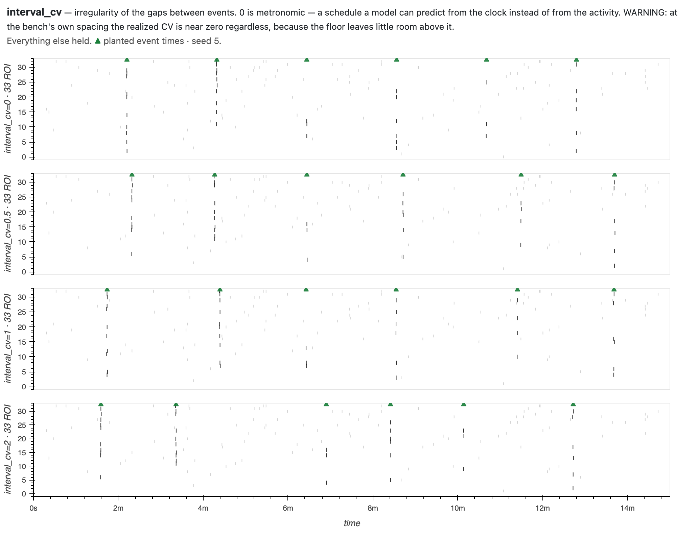
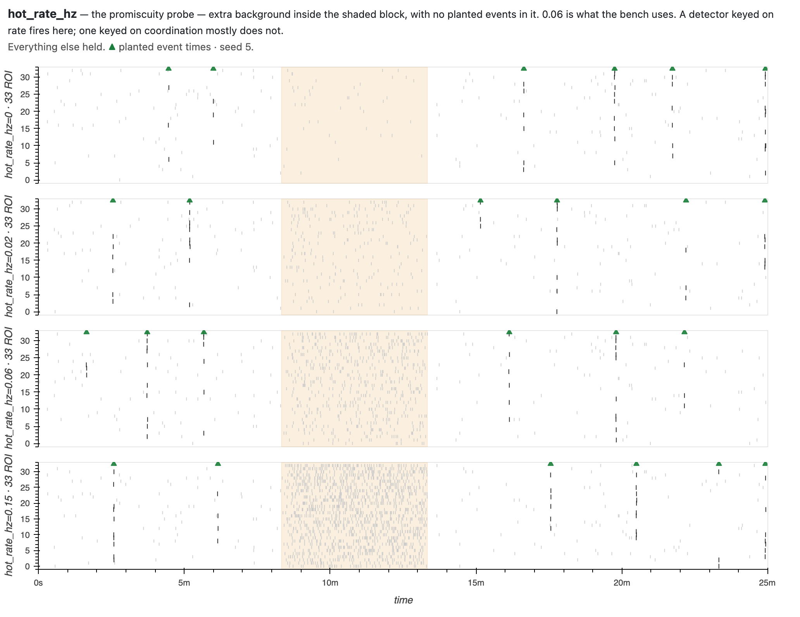
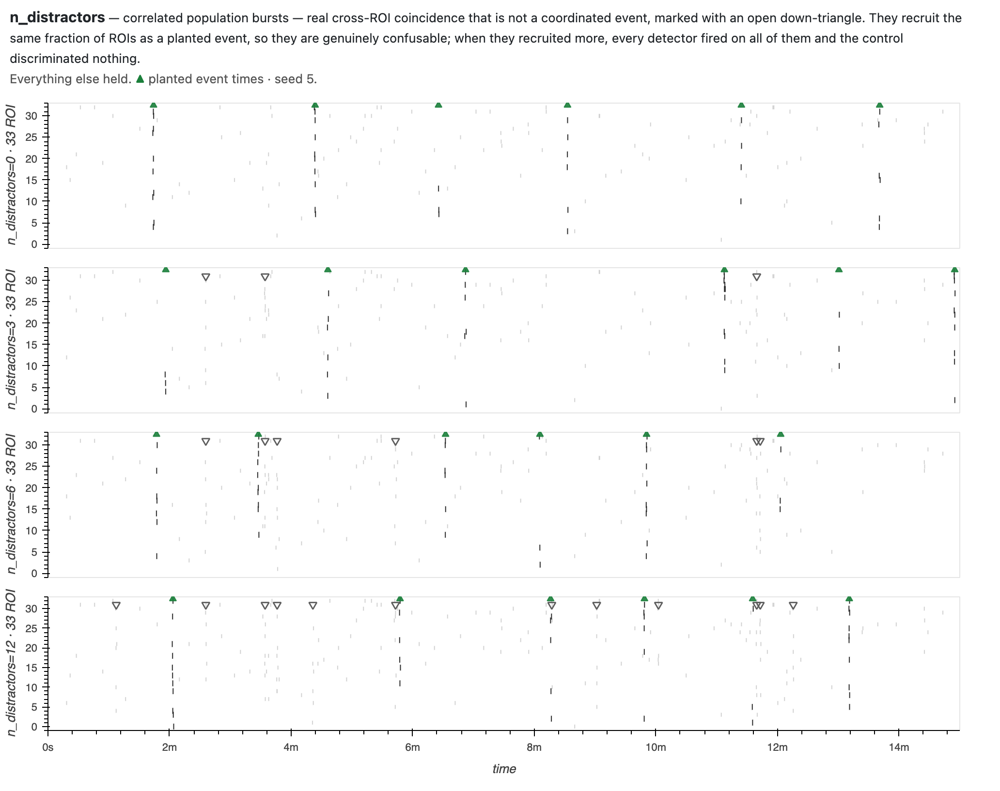
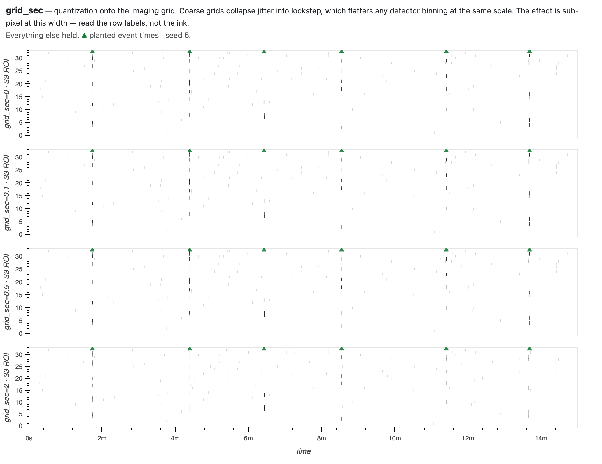
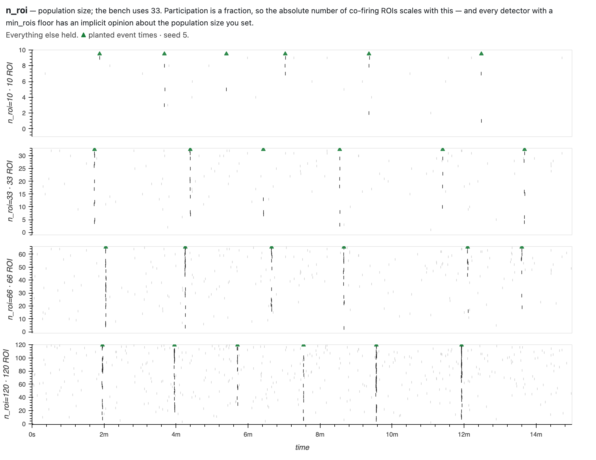
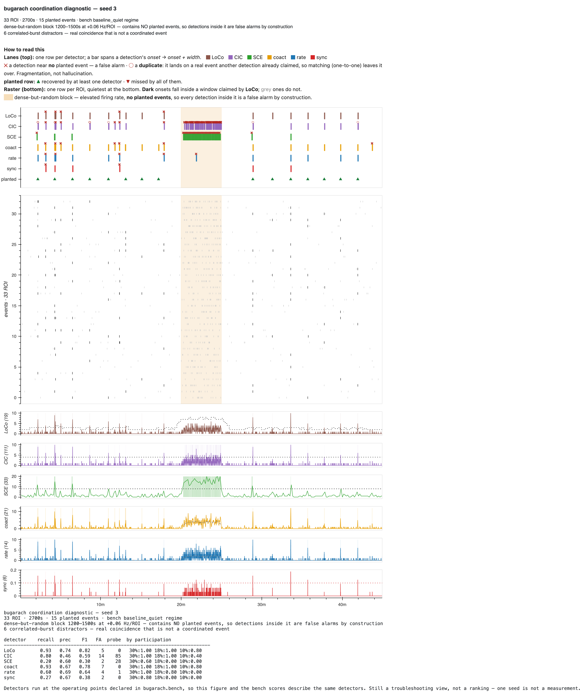

# The coordination generator

Synthetic recordings with **coordinated events planted at known times, with known
participants**, so a detector can be scored against what was actually there
rather than against another detector's opinion.

Terms — ROI, slice, stream, and the six detectors — are defined in
[`GLOSSARY.md`](GLOSSARY.md). The six are **LoCo, CICADA, SCE, CoactDetect,
RateDetect and SPIKE-synch** (written `spike-sync` in code); a *stream* is one channel of onset times per ROI
(this lab's stores carry two, `fast` and `slow`; most labs have one).

---

## What an unexamined default already cost

Until 2026-08-13 four of this generator's parameters were guesses. They were not
close, and every one of them made coordination **easier to find** than it is:

| knob | assumed | measured | |
|---|---|---|---|
| background rate | 0.05 Hz/ROI | **0.0096 Hz/ROI** | assumed 5× busier |
| onset jitter | 0.05 s | **0.36 s** ⚠ | assumed 7× tighter |
| participation | 50–100% of ROIs | **6 of ~33 ≈ 18%** | assumed 3–5× more |
| population | 30 ROIs | ~33 | right |

The measurements were not missing — they were in
`constellation/coordination_timescale_summary.csv` the whole time, produced by
interface2's `run_coordination_timescale_batch.m`.

**What that hid.** On the invented values most detectors scored F1 ≥0.9 and the
bench could barely tell them apart. (⚠ that run is not exactly reproducible — the
same historical configuration also emitted the spurious region below, so the two
defects are entangled in any reconstruction.) On measured values they run 0.32–0.78 and
separate, because a real coordinated event recruits about **six ROIs** — twice
the `min_rois = 3` floor that LoCo, SCE and CoactDetect ship with, and close
enough to it that a detector's floor decides what it can see. That is the
regime the instruments were built for, and the only one where their differences
show.

A second default cost more than it looks. The generator used to stamp every
recording with a region named `baseline`, which the region-windowing rules read
as a wet-lab protocol label and trim to its final 1200 s. SCE honours that trim,
so it analysed 1500–2700 s of a 45-minute recording — **44% of the data** — while
being scored against the events planted across all of it. It is now off by
default; pass `regions=` to simulate a protocol deliberately.

---

## Why this document exists

The generator's parameters are the experiment's assumptions. The plan's catalogue
of traps records what two of them cost: event spacing that put four coordinated
events inside every null window, and invented timescales that survived a rebuild
because nobody had a picture of what they implied. That middle version is the
cautionary one — it fixed the thing everyone was looking at, looked repaired, and
was still wrong.

A knob whose effect you cannot see is a knob you are guessing at. So every
parameter below has a figure.

---

## What a recording contains

| component | how it is generated |
|---|---|
| background | per-ROI homogeneous Poisson at `bg_rate_hz` |
| coordinated events | `n_per_level` events at each fraction in `participation`, interleaved in time, participants drawn without replacement within an event |
| timing | renewal placement with a `min_sep_sec` floor and tunable `interval_cv` |
| participant onsets | jittered around the event time, SD `jitter_sec`, quantized to `grid_sec` |
| promiscuity probe | `hot_window` — extra background at `hot_rate_hz`, ramping in over `ramp_sec`, containing **no** planted events |
| distractors | `n_distractors` correlated bursts recruiting `distractor_frac` of ROIs — real coincidence that is **not** a coordinated event |

Ground truth travels with the data: `gt.events` carries `(time, frac, n_part,
rois, jitter_sec)` per event and `gt.distractors` the negatives. Detector outputs
are never labels — score against them and you measure agreement, not truth; train
on them and you get a detector emulator.

**How a detection is scored.** A detection is an interval `[onset, onset+width]`;
it matches a planted event when that event falls inside the span, or within
**`tol_sec = 1.5 s`** of its nearer edge. Matching is greedy and one-to-one:
closest pair first, each detection claiming at most one event. Recall is the
fraction of planted events matched; precision is matched detections over all
detections **outside the probe block**; F1 is their harmonic mean.

---

## Parameters

Each figure shows one recording re-rendered across several values of a single
knob. **▲** marks planted event times, **▽** marks distractors, and onsets
belonging to a planted event are drawn dark against a muted background.

### `bg_rate_hz` — background rate (default 0.05; bench uses 0.0038–0.0175)



The planted structure is the same in every row; only how far it stands out
changes. The middle three rows are the untreated interquartile range and its
median.

*Event times do shift between rows: the background draw consumes random numbers,
so the schedule redraws with the knob. Compare structure, not event for event.*

### `participation` — fraction of ROIs recruited (default `(1.0, 0.75, 0.50)`; bench uses `(0.30, 0.18, 0.10)`)



The **participant floor**. Recall is reported broken down by this, and the six
detectors diverge sharply at the bottom of the range: in the **quiet regime** at
~3 ROIs, CoactDetect still finds 93% while SCE, RateDetect and SPIKE-synch find
none. ⚠ CoactDetect's 0.93 falls to 0.20 in the busy regime — the floor moves
with the background.

⚠ The 10% level is ~3 ROIs, which is *below* the `min_rois=4` floor the
participation measurement itself was taken at. It is a stress point, not a
calibration.

### `jitter_sec` — how tightly participants fire together (default 0.05; bench uses 0.36)



⚠ **The figure cannot resolve this knob.** At 900 s across the panel, 0.36 s of
jitter is under one pixel — the rows are indistinguishable, and that is a
limitation of the rendering, not a property of the parameter. It needs an
event-scale inset before it earns its place; until then read the row labels.

⚠ **The least trustworthy number here.** 0.36 s comes from a statistic whose own
circular-shift surrogate null is **0.42 s** — destroy all cross-ROI phase and the
measurement barely moves, so most of that 0.36 is the width of the gather window
the measurement used, not coordination tightness. Its own source file marks it
*"secondary, flagged-soft."* Treat it as an upper bound at the estimator's
resolution; real tightness is unresolved.

### `min_sep_sec` — the spacing floor (default 15.0; bench uses 120.0)



**The contaminated-null axis, and the most consequential knob here.** The shaded
band is one 120 s detector context window, drawn to scale. At a 15 s floor
several events fall inside it, so the circular-shift "null" is built from data
containing the signal and the threshold inflates — the trap that made the first
upstream benchmark unusable.

That spacing sets the bench recording's 45-minute duration, not the other way
round. The renewal placer the bench uses needs a *mean* interval above the floor,
so 15 events at 120 s need **>1920 s** of placeable span — more than the 1680 s
that simple end-to-end spacing would suggest — and the probe window is excluded
from placement on top of that.

### `interval_cv` — irregularity of the gaps (default 1.0)



0 is metronomic, which lets a model predict from the clock instead of from the
activity — it would score well on synthetic data for a reason that does not
transfer.

⚠ At the bench's own spacing the knob still works but is heavily compressed: a
120 s floor with a ~136 s mean interval leaves little room above it, so setting
0 / 0.5 / 1.0 / 2.0 realizes **0.00 / 0.06 / 0.11 / 0.23**. Quoted whole-recording
the realized CV is **0.80**, but that figure is carried almost entirely by one
gap — the schedule steps over the excluded probe window — so it describes the
probe, not the spacing. Both numbers are real; they are different bases, and the
0.11 one is the one that answers "is the spacing irregular".

### `hot_window` / `hot_rate_hz` / `ramp_sec` — the promiscuity probe (off by default; bench uses 1200–1500 s at 0.06 Hz with a 30 s ramp)



Extra background inside the shaded block, with **no planted events**, ramping in
rather than stepping. In the **quiet regime** it separates one detector sharply: CICADA fires **17.3
times a minute** in there, CoactDetect 0.0 and LoCo 0.1, with SCE intermediate at
5.6. ⚠ That separation is regime-dependent — in the busy regime CICADA and SCE
converge, so the probe distinguishes them only where the background is thin. Those firings are counted separately and kept **out** of headline precision —
folded in, the probe's severity would set everyone's precision instead of their
behaviour.

### `n_distractors` / `distractor_frac` — correlated bursts (default 0; bench uses 6 at 0.18)



Real cross-ROI coincidence that is not a coordinated event, marked **▽**. They
recruit the same fraction of ROIs as a planted event, so they are genuinely
confusable, and the six detectors answer them differently — in the **quiet regime**, SCE
fires on 3 of 18, SPIKE-synch 4, RateDetect 13, LoCo 16, CICADA and CoactDetect
18. ⚠ The ordering reshuffles in the busy regime; this is one regime's answer,
not a ranking.

Detections on distractors match no planted event, so they **are** counted as
false alarms and do lower precision.

### `grid_sec` — imaging-grid quantization (default 0.1)



Coarse grids collapse jitter into lockstep, which flatters any detector binning
at the same scale. Uses MATLAB rounding — halves away from zero — because numpy's
round-half-to-even moves events between bins. The effect is sub-pixel at this
width; read the row labels, not the ink.

### `n_roi` — population size (default 30; bench uses 33)



Participation is a fraction, so the absolute number of co-firing ROIs scales with
this — and every detector with a `min_rois` floor has an implicit opinion about
the population size you set.

### The rest

| parameter | default | note |
|---|---|---|
| `duration_sec` | 600.0 | bench uses 2700; ~2480 is the shortest that fits 15 events at a 120 s floor, so this carries some margin |
| `n_per_level` | `(5, 5, 5)` | events at each participation level |
| `spacing` | `"renewal"` | `"uniform"` reproduces `generate_synth_coord.m`'s rejection-loop placement |
| `margin_sec` | 5.0 | keep-out at each end |
| `streams` | `("events",)` | single-stream by decision; `("fast","slow")` duplicates into the two-stream shape |
| `regions` | `None` | see above — a named region triggers protocol windowing |
| `seed` | `None` | `None` is nondeterministic; an int reproduces on every platform |

---

## Where the numbers come from

**Baseline recordings only.** Treatments are what these instruments are pointed
at; taking the properties of coordination from them assumes the answer. Both
bench regimes are the interquartile spread of the untreated flavour itself —
0.0038 Hz/ROI at p25 and 0.0175 at p75, around a median of 0.0096. Untreated
slices vary 4.6-fold among themselves, and that variation is the axis an
operating point has to survive.

Source: `constellation/coordination_timescale_summary.csv`, flavour
`all-baseline`, fast stream, `min_rois=4`. **The denominators differ by row:**

⚠ The two regime endpoints are **derived, not read**: the file carries population
rates in events/min (`rate_p25` 7.55, `rate_p75` 34.88), and converting them to
per-ROI needs the same `rate_med / (60 × roiRate_mean_med)` ratio flagged below.
They inherit its uncertainty.

| quantity | value | n |
|---|---|---|
| per-ROI rate | 0.0096 Hz | **84** slices |
| onset jitter | 0.36 s (null 0.42) ⚠ | **47** — those in which a cluster resolved at `min_rois=4` |
| participation | 6 ROIs | **47**, same subset |
| event width | 0.9 s (fast) | 84 |

⚠ `n_roi ≈ 33` is **not a column in that file.** It is recoverable only as
`rate_med / (60 × roiRate_mean_med)` = 33.16 — a ratio of two independently taken
across-slice medians, which is not the median per-slice ROI count.

⚠ Participation is **left-censored by the instrument that measured it**: a
cluster below `min_rois` cannot be observed, so 6 is the median of a tail, and it
moves with the floor (4.5 at `min_rois=3`, 6 at 4, 9 at 6, 11 at 8).

---

## Does this match the simulation the detectors were tuned on?

**No.** Worth knowing before comparing any number here to the MATLAB campaign's.

This section is assembled from what the repo records about
[`simulation_plan.md`](simulation_plan.md) and the upstream sources, **not from
running them** — that needs MATLAB and an interface2 checkout. Confirming it
against execution is outstanding.

| axis | upstream (tuning) | here |
|---|---|---|
| random numbers | `poissrnd` / `randn` / `randperm` | numpy `RandomState` — only uniform draws agree bit-for-bit, which is why the *detectors* could be matched to 1e-9 and a generator cannot be |
| event spacing | 150 s fast / 300 s slow | default 15 s; bench 120 s |
| interval distribution | rejection-loop placement in `generate_synth_coord.m`; **exactly equal spacing** in the calibrated `generate_coord_benchmark.m` | renewal, `interval_cv` 1.0 |
| benchmark structure | one participation × tightness grid over a background ramp | two discrete regimes |
| region trimming | optima measured with trimming disabled | LoCo defaults to `clamp_context_to_region=True` |
| timescales | measured off real recordings | the same measurements — with the caveats above |

The third row deserves note: the benchmark the operating points came from places
events at *exactly equal* spacing, which is the metronomic case the `interval_cv`
default exists to avoid.

---

## What follows: no re-tuning is licensed

A sweep on this generator beats the declared operating point for **four of the
six in the quiet regime** (CICADA, SCE, RateDetect, SPIKE-synch) and **three in
the busy one** (LoCo, SCE, SPIKE-synch). Only SCE and SPIKE-synch are beaten in
both; no detector sits at its optimum in both. **That licenses no change to any
of them.** Re-tuning to a synthetic benchmark
whose realism rests on one unreviewed measurement, and which no real recording has
ever checked, is the trap this project already paid for.

⚠ spike-sync's declared `C_threshold = 0.1` is **not on its own sweep grid**, so
its F1 at the shipped point is not evaluated by the sweep that judges it.

---

## What is still unsigned

The measurements above are real. The decision resting on them was never checked,
and this document would mislead a reader who stopped before here.

- **The campaign is marked PROVISIONAL by its own record.** `optim_history`'s
  README states that the calibrated settings were adopted into production
  *without* the real-data validation the deck named as its deciding step, and
  that a CICADA minimum-cell-floor flaw survived that adoption and is still open.
- **`jitter_sec` is calibrated to a near-null statistic** (0.36 observed against
  a 0.42 surrogate null), and the calibration does not round-trip: build a
  recording at 0.36 and the estimator that produced 0.36 measures ~0.64 back.
- **`bg_rate_hz` is a background rate; the measured value is a total rate** that
  includes the coordinated events, the probe and the distractors. Realized totals
  are **0.0114 Hz/ROI in the quiet regime against a nominal 0.0038** (3.0×) and
  0.0255 against 0.0175 (1.5×) — so the regime named for the untreated p25 is in
  fact busier than the untreated *median* it was cut from.
- **The bench has never been run against a real recording.** Everything here is
  measured on data this generator produced.

None of these is a reason to distrust the *ports* — those are matched to their
MATLAB originals to 1e-9 on committed fixtures, which is a separate and much
stronger guarantee. They are reasons not to read a bench F1 as a statement about
real tissue.

---

## Seeing it against the detectors

`tools/make_diagnostic.py` renders a recording with detector lanes above the
raster and **each detector's analysis trace below it** — the statistic it
actually thresholds, with its claimed windows shaded. Four of the six also carry
their threshold as a dotted line; CoactDetect and RateDetect do not expose one to
the viewer, so their rows show the statistic alone.

```bash
python tools/make_diagnostic.py --bench baseline_quiet --tag bench_quiet --out docs/generator
```



That view is what found the region bug: SCE's trace simply stopped, and no amount
of staring at the scores would have said why.

### ✕ and ○ are different failures

A **✕** is a detection that matched no planted event — nothing within the 1.5 s
tolerance of its span. A **○** is a *duplicate*: it lands on a real event that
another detection already claimed, and matching is one-to-one, so it is left
over.

The distinction matters because the causes differ — fragmentation is a merge-gap
problem, firing at noise is a threshold problem — and a precision number that
merges them cannot tell you which you have. Measured on the quiet regime, outside
the probe: **41% of CICADA's unmatched detections sit within 2 s of a planted
event**, against 0% for every other detector — whose medians run 31–47 s out,
except SCE at 8.3 s.

---

## Appendix — running it

```python
from bugarach.simulate import simulate_coordination
from bugarach.detectors.loco import loco_detect
from bugarach.score import score_stream

s, gt = simulate_coordination(seed=1)
score_stream(gt, loco_detect(s).streams["events"])
```

Every figure regenerates:

```bash
python tools/make_generator_figures.py --out docs/generator   # all of them
python tools/make_generator_figures.py --param jitter_sec --out docs/generator
```

## Appendix — corrections to earlier versions

- **TTX is not a silencing control.** An earlier version treated a TTX-rate
  recording as an empirical null on the premise that blocked action potentials
  make coordination impossible, and proposed raising `min_rois` until TTX slices
  went quiet. Coordination *persists* under TTX — confirmed with these ports on
  the archived baseline/TTX slices — so that proposal would have deleted a
  finding rather than measured it. See [`FOUNDATIONS.md`](FOUNDATIONS.md) §9.
- **No treatment is a source for any coordination property.** Two earlier
  versions used senktide and then TTX as regime endpoints. Both are treatments.
- **The lane figure once drew duplicates as ✕**, and marked them by point
  scoring while the scoreboard beside it used spans — so every SCE detection was
  flagged a false alarm while sitting on the event it had found.
