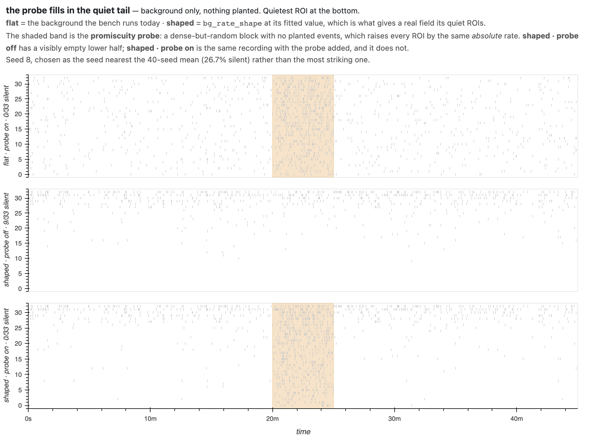

# What the consumer side wants from a generator revision

Input for the generator team's parameter revision, written before their request
for feedback so it can be read while options are still open. From bugarach: the
Python ports of the six detectors, their bench, and a **paused, unbuilt**
evaluation of learned detectors.

Nothing here asks for a number to be changed. Each item is either an interaction
between features that were designed separately, a structural property the
generator cannot express, or a question only the lab can answer that a revision
is the natural moment to settle.

Ordered by how much the revision can still change: §1–2 are choices the fitted
background has just made live, §3–5 are gaps that outlast any parameter set, §6
is what must not be re-broken. Not the usual problem-then-fix arc, because the
fixes are the generator team's to choose.

Measured against `origin/main` at `e3ec0bc`, using the fitted values the
generator already carries (`MEASURED_RATE_SHAPE = 0.275`,
`MEASURED_BURST_SHAPE = (1.547, 1.388)` at bins `(300, 60)` s). An earlier draft
of this file was measured against a 41-commit-stale checkout and got its lead
finding wrong; the numbers below were re-taken after merging.

---

## 1. The promiscuity probe will erase the heterogeneity, when you switch it on

The **promiscuity probe** is `hot_window` — a dense-but-random block carrying no
planted events, so a detector keyed on rate fires there and one keyed on
coordination does not. The bench always runs it.

`bg_rate_shape` gives the background a realistic shape: a few busy ROIs, many
near-silent. Over the bench recording's length it leaves **26.7%** of ROIs with
no background event at all — close to the 35% measured over 81 real baseline
windows / 2 643 ROIs (`bugarach.bench.MEASURED_RATE_SHAPE`); the residual gap is
duration, not shape (at 1200 s the generator gives 34.5%).

Run both and the second erases the first. The silent fraction goes to **0.0%**.

The probe raises **every** ROI by the same *absolute* rate, so it is a flat field
laid over a shaped one:

| | |
|---|---|
| probe span | 300 s of 2700 s — **11.1%** of the recording |
| background events per ROI, whole recording | 25.9 |
| probe events per ROI, measured | **17.1** |
| **probe share of a typical ROI's events** | **39.7%** |

(17.1 and not the 18.0 that `hot_rate_hz × span` gives: `ramp_sec` thins the
wash-in and loses half the ramp. Measured rather than computed for that reason.)

So 39.7% of a typical ROI's activity comes from 11.1% of its duration, and a
recording that was meant to have a quiet tail has none.

**Stated precisely, because it decides how urgent this is:** the bench runs a
**flat** background today, so nothing is currently broken. `bg_rate_shape` and
`bg_burst_shape` are both off by default, deliberately — leaving them `None`
keeps the RNG stream identical so every existing seed reproduces. This is a
finding about what happens **when the revision turns the shape on**, which is
presumably the point of fitting it.

Both features are individually well-argued. The probe is deliberately severe at
6× measured baseline, and its severity is already documented as a setting rather
than a property. Their **product** is what looks unchosen.

This is not an argument for a weaker probe. It is an argument that the probe
should be shaped the way the background is: if a rate-fooled detector is what it
tests, raising the busiest and the near-silent ROIs by the same absolute amount
is not the only way to ask.

**Ask:** decide whether the probe **multiplies** each ROI's own rate or **adds** a
flat one, and record which. Today it adds, and nothing records that as a choice.

Every number in this section is printed by
`python tools/probe_vs_heterogeneity.py`, which also renders the figure — the
same re-derivable arrangement `tools/fit_background_shape.py` gives the fit
itself.

---

## 2. Who takes part in an event is independent of how active a cell is

Participants are drawn uniformly — `rng.choice(n_roi, size=n_part,
replace=False)` — so participation carries no relationship to an ROI's rate.
Measured over 30 seeds, background count against times-participated:

| bench background | per-ROI CV | p90/p10 rate spread | rate → participation |
|---|---|---|---|
| flat (what the bench runs today) | 0.150 | 1.5× | ρ = +0.04, p = 0.21 |
| fitted heterogeneity + burstiness | 1.025 | 6.6× | ρ = −0.06, p = 0.04 |

Both are negligible in **magnitude** — the second reaches p = 0.04 on 990
ROI-recordings and still explains **under 0.5% of the variance** (ρ² = 0.004),
and its sign is if anything backwards. (A naive correlation on total counts reads +0.24 and is an artifact:
taking part in an event *adds* events to that ROI's train. The table subtracts
planted and distractor contributions.)

**While the background was flat this did not matter** — every ROI was
interchangeable, so drawing uniformly was the only thing to do. `bg_rate_shape`
changes that. Once ROIs genuinely differ 6.6-fold, drawing participants blind to
rate becomes an assertion: *coordination recruits without regard to how active a
cell is.* That may well be right. Nobody chose it.

It is also the item that most affects anything learned. Tony's specification for
how a model reads a recording is that **ROI rows are sorted by firing frequency**
— "that's how humans look at it." Sorting makes row index a coordinate rather
than a label. With the flat background that coordinate is Poisson noise; with
`bg_rate_shape` it is real structure that is, by construction, uninformative
about who participates. A model would correctly find it useless, and we would be
at risk of reading that as a fact about the preparation.

**Ask:** *are busier cells more likely to take part in a coordinated event?* Not
ours to answer — it is a fact about the preparation, and `fireflies`/global
FOUNDATIONS §15 territory. But the uniform draw is an implicit "no", and a
revision is when it gets made explicit either way.

---

## 3. An event's extent should be recorded, not parameterized

`PlantedEvent` describes an event's temporal footprint as `time ± 3·jitter_sec`.
Against what the generator actually produces, 75 planted events at bench
settings:

| | width |
|---|---|
| nominal ±3σ | **2.16 s**, identical for every event |
| realized participant footprint | **median 0.80 s**, range 0.10 – 1.70 s |

2.7× too wide on a typical event and flat across a 17-fold spread it cannot
represent, because six Gaussian draws do not span exactly ±3σ and grid
quantization moves the edges again.

Already proposed additively in bugarach **PR #46** (record the onset each
participant actually got; read the footprint off those; emitted data verified
bit-identical across 17 configurations × 3 seeds, including the new background
shape knobs). Raised here because the same choice exists upstream in
`generate_synth_coord.m`, and because a revision that moves `jitter_sec` changes
the size of this error without fixing it.

Worth noting what makes it self-maintaining: switching on the fitted background
moved the realized footprint from 0.80 s to 0.90 s. A recorded footprint tracks
that automatically; a parametric one has to be revised alongside every change.

---

## 4. Tightness is only meaningful in samples

bugarach FOUNDATIONS §6 was amended on 2026-08-16 (**PR #48**) after Tony's
ruling that data must not load without a stated sampling interval. What reaches
the generator:

At a 0.1 s grid, 0.36 s of jitter is ~4 samples. A lab imaging at 30 Hz sees the
same biological event as ~11. **Every bench recording shares one grid**, so
nothing in the benchmark can currently fail when a detector — or a model — has
learned this microscope rather than the phenomenon.

**Asks:**

1. Sweep **event-width-in-samples**, the dimensionless quantity, not just jitter
   in seconds.
2. Let imaging rate vary across recordings, so the failure above becomes visible.
3. Report performance as a **curve over tightness**, the way the bench already
   reports recall by participation level. A pooled F1 cannot separate "found
   coordination" from "found our timescale."

---

## 5. There is still no labelled negative for the distinctness rule

`coactivity` is **distinct active ROIs — one count per ROI, never a spike count**
(GLOSSARY), and all six detectors enforce it. The failure that rule prevents is
**one busy ROI firing repeatedly** being read as several ROIs firing together.

`bg_burst_shape` now supplies the raw material — an ROI's own events clump in
time, fitted at two scales. What is still missing is a **labelled** case: the
clumping is background, so nothing scores a detector on whether it survived it.
`hot_window` raises all ROIs uniformly, and distractors are multi-ROI bursts,
which is a different negative (real coincidence, not coordination).

So the benchmark contains nothing that separates a detector honouring
distinctness from one that does not. That is a gap for the six, and a larger one
for anything learned, where distinctness is not enforced by construction and can
only be probed behaviourally. `simulation_plan.md` §5 makes exactly this argument
about CICADA's missing `min_rois` floor — a structural flaw no threshold tuning
removes — and notes that for a network it is worse, because the flaw cannot be
read off the weights.

**Ask:** a labelled negative in which a small number of ROIs burst repeatedly
inside an event-width window, with no cross-ROI coordination.

---

## 6. Two things to carry into the revision

**The measured values may still be provisional.** ⚠ **Unverified from here** —
both statements below are quoted from `docs/simulation_plan.md` §6, not checked
against the upstream files, which need MATLAB and an interface2 checkout this
repo does not require: that `rederive_optima_fast.m` marks the
coordination-timescale parameters *"PROVISIONAL — params from a measurement
pending Tony's review"*, and that `optim_history/README.md` records the
calibrated settings being adopted **without** the real-data validation the deck
named as its deciding step. **The generator team can check both directly and
should.** If they hold, these are real measurements carrying an unsigned
decision, and a revision is when that gets signed or reopened — and if the values
move, every validation number computed against the old ones is stranded, which
`simulation_plan.md` §5 lists as an already-paid cost.

**The traps, as constraints rather than history** — all from
`simulation_plan.md` §5:

- **The contaminated null.** Spacing below the detectors' context window puts real
  coordination inside the null the threshold is derived from. Any spacing change
  is a change to the class base rate, never a cosmetic realism detail.
- **Randomizing is not centering.** Widening a range around an unmeasured centre
  covers reality zero percent of the time and looks confident doing it.
- **Regularity is a cue.** `interval_cv` defaults to 1 and not 0 on purpose.
- **Probe severity is a setting, not a property** — see §1, which is that lesson
  arriving through a second door.
- **An optimum at the edge of a swept range is not an optimum.**

---

## What bugarach can supply

The bench runs all six ports against planted truth with no MATLAB, so a proposed
parameter set can be scored here before it is adopted — including the
regime-shift guard, the promiscuity probe, and the participant floor (recall
broken down by how many ROIs the event recruited). If it helps
to have a candidate revision evaluated while it is still a draft, that is cheap,
and we would rather run it early than after adoption.

One offer with a caveat attached: switching `bg_rate_shape` and `bg_burst_shape`
into `BENCH_RECORDING` is a one-line change we can score on request. Both are
currently off **by design** — leaving them `None` keeps the RNG stream identical
so every existing seed reproduces — so turning them on invalidates every bench
number computed before it. That is the stranded-validation trap, and it is a
decision for the revision rather than a tidy-up.
