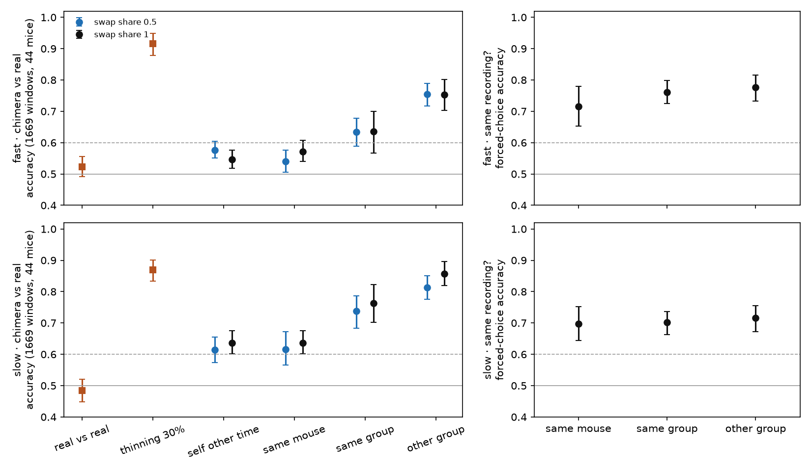

# Goal: a coordinated-event detector that learns without labels

> **The goal page for this work — start here.** The tree calls the same goal *the label-free
> detector*, *self-supervised coordination*, *the surrogate-contrastive objective* and *the
> detector-design thread*; they are one goal. This page holds the goal, what is settled about it,
> what was tried and dropped, and what is waiting on Tony, with a link beside every line. **The
> linked file wins** where the two disagree, and a line found wrong is fixed in the same change as
> whatever you were doing.
>
> **Working material, not murderboarded** — same standing as [`pipeline.md`](../pipeline.md). No tree
> counts; measured numbers are content and carry their source. How the page stays true is at the
> bottom; the convention is in [`README.md`](README.md).
>
> **Last reconciled 2026-09-14** against `origin/main` and the open branches.

---

## The goal

Twenty-two hours of baseline recordings exist that nobody can annotate, and every learned number in
this project was fitted on a simulator that plants one event width, uniform participation and no
recurring assemblies. A detector trained to tell a real recording from a **surrogate** of itself — a
copy with cross-ROI timing destroyed and everything else kept — would learn from the real recordings
and not from the simulator's assumptions. That is still the only route in sight to a learned detector
that has not merely learned the simulator
([the handoff that set it up](../handoffs/2026-09-10-the-surrogate-is-the-design.md)).

Abbreviations used below: **ROI**, region of interest (one imaged cell); **ISI**, interval between two
onsets of the same ROI; **AUC**, area under the ROC curve; ***J***, the displacement a surrogate
applies to onsets; **τ**, the dead-time floor, the shortest same-ROI interval the event extractor can
emit.

## Where it stands

**Nothing is running, and no document is the authority for what to run next.**

- **The surrogate screen is stopped** (Tony, 2026-09-12). He was asked how to settle the
  family-size question below and whether to write a third re-evaluation; he answered that the first
  needs discussion before deciding and to stop there for now
  ([handoff on the screen branch](https://github.com/syncytium2/bugarach/blob/surrogate-screen-overnight/docs/handoffs/2026-09-12-both-reevaluations-withdrawn.md)).
- **The ROI-swap evidence plan is live, and its first real-data stage returned STOP** (2026-09-13).
  Its next stage is simulation and needs a murderboard before it starts
  ([the plan](../todo/2026-09-12-evidence-before-more-effort-on-the-roi-swap.md)).
- **The thread has no exit criterion.** One is proposed and not adopted — see *Waiting on Tony*.

The next move is a conversation, not a run.

---

## What is settled

**Strength** follows [`MILESTONES.md`](../MILESTONES.md): *measured* is a number from a run,
*decided* is a ruling, *argued* is reasoning nobody has measured.

### Before this goal — the simulator-trained models

| finding | strength | source |
|---|---|---|
| Centre−surround ties the best hand-written detectors on simulated data, at a fraction of the cost | measured, one run per fold, no seed error bars | [`model_track.md`](../model_track.md) |
| It transfers badly from a quiet background to a busy one: roughly −0.24 against +0.12 the other way. Baseline → treated is the bad direction, and FOUNDATIONS §9 forces it | measured | [`model_track.md`](../model_track.md), [the collision](../todo/2026-09-10-the-design-trains-quiet-and-deploys-busy.md) |
| On the Cossart folder the learned models score best and are the only ones that cannot travel | measured, held | [`learned/cossart_transfer/README.md`](../learned/cossart_transfer/README.md) |
| The simulator plants no recurring assemblies, so no benchmark here can reward membership structure | measured from the code | [`model_track.md`](../model_track.md) |

### The surrogate

| finding | strength | source |
|---|---|---|
| **Independent per-onset dither leaks one ROI at a time.** Real same-ROI intervals have a floor (0.40 s fast, 3.20 s slow on the senktide baselines; the overnight plan measures 2.80 s slow on the field-step-excluded folder); dither breaks it in 29.5 % of windows at *J* = 1.6 s against 0.0 % of real ones, so one count separates them at AUC 0.647 with no cross-ROI information | measured by a review role — reproduce before building on it | [run record](../reviews/2026-09-10-coordination-without-labels_2026-09-10.md) |
| **A control made by applying the same corruption again cannot catch that leak** — its reference class already contains it (0.000 real → 0.932 one dither → 0.953 two) | measured; the lesson is general | same run record |
| **Every surrogate candidate enters; none is pruned; the tiers with a pooling operator run as a grid** | decided, Tony 2026-09-10 | [ruling](../todo/2026-09-10-which-surrogates-enter-the-screen.md) |
| ***J* is per stream; τ is declared by the producer, not fitted** | decided | [handoff](../handoffs/2026-09-10-the-surrogate-is-the-design.md), [τ todo](../todo/2026-09-10-the-dead-time-floor-is-the-producers-number.md) |
| **Analysis runs only on field-step-excluded data** | decided, Tony 2026-09-12 | [`MILESTONES.md`](../MILESTONES.md) |
| **The screen ran** on 2026-09-11 over both folders. Candidates the per-ROI leak detector could not tell from real: do-nothing everywhere; interval and pattern jitter at one frame; **rigid shift out to 1.6 s fast, 1.4 s slow and four frames on Cossart**. The known-bad control was caught even at one frame, so the test has power | measured | [the join todo](../todo/2026-09-12-join-the-leak-results-to-the-destruction-results.md) |
| ⚠ **Every fast-stream candidate that returned a number was voided by a defect**: the voiding rule read seed 0 of a twenty-seed negative control whose flag rate was the nominal 0.05 | measured; a defect in the rule, not a fact about the data | [voiding todo](../todo/2026-09-12-126-fast-candidates-were-voided-on-one-seed-of-twenty.md) |
| ⚠ **Joint-ISI dither was never measured** — every cell hit the memory or time cap. Unmeasured, not failed | measured | [todo](../todo/2026-09-12-joint-isi-dithering-is-unmeasured-not-failed.md) |
| **About 39 % of ROIs are bit-identical in every surrogate** on the lab folder (4–7 % on Cossart), flat in *J*: ROIs with no events to move. So about 39 % of the negative class *is* the positive class, and no surrogate choice removes it. Empty baselines are a group feature and §9 governs them | measured; ruling by Tony 2026-09-12 | [todo](../todo/2026-09-12-an-empty-baseline-is-a-group-feature-and-39-percent-of-every-surrogate-is-the-data.md) |
| **The screen's report, reviewed**: at its settings no Holm-adjusted yardstick could flag; on Cossart the destruction measure cannot register removal at all | measured, two review rounds | [review record](https://github.com/syncytium2/bugarach/blob/surrogate-screen-overnight/docs/reviews/report_steps_excluded_2026-09-11.md) (screen branch) |
| …but **a pre-declared family of five band statistics *can* flag on the existing run**. Picking those five after seeing the results would be post-hoc, which is why the family size is Tony's call | measured | [handoff](https://github.com/syncytium2/bugarach/blob/surrogate-screen-overnight/docs/handoffs/2026-09-12-both-reevaluations-withdrawn.md) (screen branch) |

### The model

| finding | strength | source |
|---|---|---|
| **The current `tube` cannot tell a count leak from coordination.** It averages over ROIs before its first kernel, so its input is how many ROIs are active per frame — and a surrogate that changes event counts moves exactly that. The per-ROI leak gate cannot see this channel | argued; Tony named it a foot gun, 2026-09-12 | [todo](../todo/2026-09-12-tube-cannot-tell-a-count-leak-from-coordination.md) |
| Stella et al. 2022 ranks surrogates for a significance test, which is a weaker requirement than a clean training contrast. Do not adopt trial shifting on its authority | argued from the paper | [todo](../todo/2026-09-12-stellas-criterion-is-a-significance-test-not-a-training-signal.md) |

### Swapping ROIs across recordings

| finding | strength | source |
|---|---|---|
| **Negatives drawn across recordings taught recording identity in every study that measured it** | literature | [reading log](../learned/recombination_nulls_reading_log.md) |
| **Recording identity is visible in our data without any access to coordination.** Window pairs tell their own recording at 0.70–0.78 in both streams. A coordination-blind classifier spots other-group donors at 0.75 fast and 0.86 slow; same-mouse donors cost nothing measurable, and are also same-day donors. In the slow stream even a train moved within its own recording is visible (0.64) | measured, declared before running | [result](../learned/recording_identity.md), Figure 1 |

**Figure 1. Recording identity, 2026-09-13.** Left panels: accuracy of a classifier that cannot see
coordination at telling a recording from a *chimera* of itself (some ROIs replaced by trains from a
donor), by donor distance; squares are the controls, the dashed line the declared 0.60 gate. Right
panels: telling whether two windows come from the same recording. Other-group donors clear the gate
in both streams, and in the slow stream every tier does. Full caption and tables in [`recording_identity.md`](../learned/recording_identity.md).

---

## Tried and dropped — do not re-propose without new evidence

- **Independent per-onset dither as training negatives.** Leaks one ROI at a time; kept in the screen
  only as the known-bad control. [Run record](../reviews/2026-09-10-coordination-without-labels_2026-09-10.md);
  the withdrawn draft is [`proposals/2026-09-10-coordination-without-labels.html`](../proposals/2026-09-10-coordination-without-labels.html).
- **ROI swap as training negatives.** Closed on the literature and on Figure 1. The swap as a
  *significance* null is still open, with same-mouse donors only.
  [Proposal, not recommended after three review rounds](../proposals/2026-09-12-the-roi-swap-null.md).
- **Two re-evaluations of the screen**, both withdrawn for quoting probe numbers where production
  numbers existed. On the screen branch:
  [first](https://github.com/syncytium2/bugarach/blob/surrogate-screen-overnight/docs/proposals/2026-09-12-surrogate-screen-reevaluated.md),
  [second](https://github.com/syncytium2/bugarach/blob/surrogate-screen-overnight/docs/proposals/2026-09-12-surrogate-screen-reevaluated-v2.md).
- **Reading "no leak" as a score.** Do-nothing survives every leak test; the leak test is a gate, and a
  candidate is credited only at a displacement where it also destroys coordination
  ([displacement floor](../todo/2026-09-12-the-verdict-rule-needs-a-displacement-floor.md)).

---

## Waiting on Tony

Each is a decision, not a task, and nothing below it can be settled by a session.

| decision | why it gates the goal | filed |
|---|---|---|
| **An exit criterion** — *viable* (a candidate that neither leaks nor fails to destroy coordination, on both folders), *narrowed* (one folder), *stopped* (none; write it up as a result about the data) | Without one, the thread cannot tell "not yet" from "no". Should be adopted before any verdict rule reads the numbers | [todo](../todo/2026-09-12-the-label-free-detector-thread-has-no-exit-criterion.md) |
| **The family size for the band statistics** — pre-declare for a future run, rerun at 260 or 520 splits keeping all thirteen, re-score openly as post-hoc, or decide after a third draft | Decides whether the screen can flag anything at all | [handoff](https://github.com/syncytium2/bugarach/blob/surrogate-screen-overnight/docs/handoffs/2026-09-12-both-reevaluations-withdrawn.md) (screen branch) |
| **What happens to draft PR #530** — the screen's code, the pattern-jitter clean-room spec, the reviewed report builder and this thread's latest handoff | The largest body of work toward this goal that is not on `main` | [#530](https://github.com/syncytium2/bugarach/pull/530) |
| **How the voiding rule reads a seeded control** — the seed distribution, not one draw | Re-derives every fast verdict without a rerun. Do not look at what un-voids first | [todo](../todo/2026-09-12-126-fast-candidates-were-voided-on-one-seed-of-twenty.md) |
| **ROIs no surrogate can touch** — accept the noise, weight the loss, or drop (§9 rules out dropping without a group-aware argument) | Sets a label-noise floor for any objective on this folder | [todo](../todo/2026-09-12-an-empty-baseline-is-a-group-feature-and-39-percent-of-every-surrogate-is-the-data.md) |
| **The quiet → busy transfer penalty** — accept and state it, or bound it before any treatment number is read | Training on baseline is forced; deploying on treated is the measured-bad direction | [todo](../todo/2026-09-10-the-design-trains-quiet-and-deploys-busy.md) |
| **Joint-ISI dither** — measure at feasible displacements, or record it as out on cost | A silently dropped candidate violates the no-pruning ruling | [todo](../todo/2026-09-12-joint-isi-dithering-is-unmeasured-not-failed.md) |
| **Whether the ROI-swap plan continues** to its simulated-ground-truth stage (murderboard first) | The swap's only open use is as a significance null | [plan](../todo/2026-09-12-evidence-before-more-effort-on-the-roi-swap.md) |
| **Ask the producer for τ**, and whether four motion-pinned recordings stay in training | Both are the producer's numbers, reached through Tony | [τ](../todo/2026-09-10-the-dead-time-floor-is-the-producers-number.md), [pinned recordings](../todo/2026-09-10-four-recordings-carry-an-unflagged-contaminant.md) |

## Open work a session can do without a ruling

- **An aggregate-channel leak test** beside the per-ROI one — the precondition for training anything
  that averages over ROIs. [Tube foot gun](../todo/2026-09-12-tube-cannot-tell-a-count-leak-from-coordination.md).
- **Count preservation after encoding as a hard gate**; check whether the statistic exists under
  another name first. [Todo](../todo/2026-09-12-count-preservation-after-encoding-is-the-gate-stella-actually-found.md).
- **Rigid shift's unwrapped edge**, tested where it is weakest.
  [Todo](../todo/2026-09-12-rigid-shift-without-wrap-loses-onsets-at-the-window-edge.md).
- **The encoder** clips out-of-range onsets onto the boundary frames and truncates frame positions:
  [clipping](../todo/2026-09-10-the-encoder-clips-onsets-onto-the-boundary-frames.md),
  [truncation](../todo/2026-09-11-the-encoder-truncates-frame-positions.md).
- **CI does not install Elephant**, so the surrogate tests skip there.
  [Todo](../todo/2026-09-12-ci-installs-no-elephant-so-the-surrogate-tests-skip.md); upstream defects:
  [todo](../todo/2026-09-11-elephant-surrogate-defects-are-not-filed-upstream.md).
- **Seven code findings on the screen branch**, none started — including two implementations of the
  √2·*J* window rule that disagree, and a test that certifies a circularity the review says to remove.
  Listed in the [screen handoff](https://github.com/syncytium2/bugarach/blob/surrogate-screen-overnight/docs/handoffs/2026-09-12-both-reevaluations-withdrawn.md).
- **The figure this thread still owes**: the same-ROI interval distribution, real against each
  surrogate, with the floor marked.

⚠ **The screen thread is stopped**, so work that touches its verdict rule or its family size is not
in this list. Check *Waiting on Tony* before starting anything there.

---

## Where the work lives

| what | where |
|---|---|
| Screen machinery: `surrogate_stats`, the screen and report builders, the pattern-jitter clean room, the Elephant adapter's tests | **only on** `surrogate-screen-overnight`, draft [#530](https://github.com/syncytium2/bugarach/pull/530) |
| The per-ROI discriminator | on `main` as [`src/bugarach/surrogate_discriminator.py`](../../src/bugarach/surrogate_discriminator.py), copied verbatim from that branch for the identity run |
| The recording-identity measurement | [`tools/measure_recording_identity.py`](../../tools/measure_recording_identity.py) |
| The learned models | [`src/bugarach/learn/`](../../src/bugarach/learn/) |
| Run outputs | `<darkroom>/bugarach/2026-09-11-surrogate-screen/`, `<darkroom>/bugarach/2026-09-13-recording-identity/` — resolve with `bugarach.paths.darkroom()` |
| Papers | `<darkroom>/bugarach/lit/surrogates/`, `<darkroom>/bugarach/lit/recombination/`, `<darkroom>/bugarach/lit/ml/`; asks in [`lit_needed.md`](../lit_needed.md) |
| Review records | [`reviews/`](../reviews/), files dated 2026-09-10 and later with *coordination-without-labels*, *surrogate* or *roi-swap* in the name |

**Branches checked 2026-09-14.** `surrogate-screen-plan`, `surrogate-field-ruled` and
`the-conditioned-run` show as unpushed in the session briefing but were squash-merged (#529, #526,
#514) — nothing is lost. Open PR [#531](https://github.com/syncytium2/bugarach/pull/531) holds the
handoff for moving the 2026-09-11 run to the workstation; the run has since finished and its report
been reviewed, and that handoff asks to be deleted once #530 lands.

---

## Keeping this page true

- **A result toward this goal updates this page in the same PR.** A decision moves from *Waiting on
  Tony* to *What is settled* with its date. A dropped approach moves to *Tried and dropped* with its
  reason.
- **A session working on this goal says so on its board claim** (`Goal: unsupervised-learning`) and
  names its branch `unsup/<slug>`. Branches stay short-lived and land on `main`; the page, not a
  branch, is what holds the goal together.
- **No tree counts, no numbers without a source.** Pointers and decisions age slowly; restated
  measurements are the part that goes stale, so each one links to the file that owns it.
