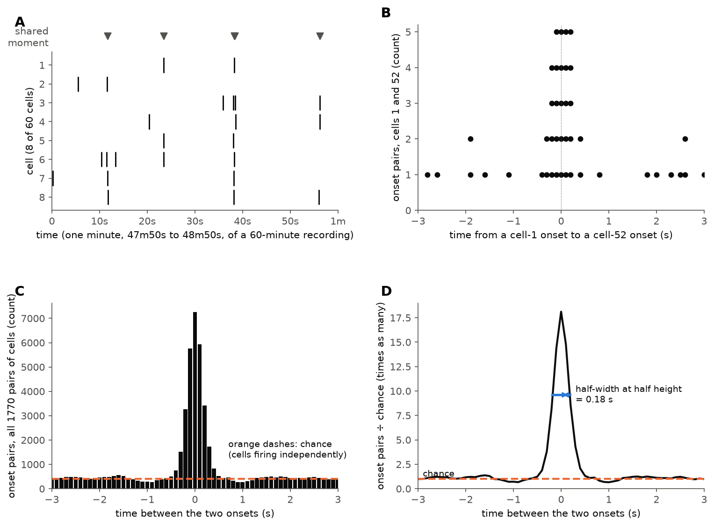
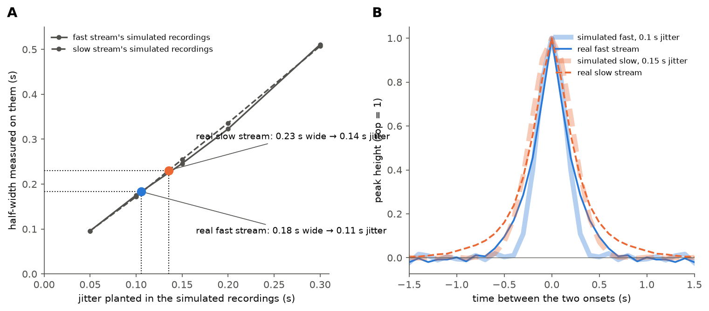

# How we measure the timing spread of coordinated firing, without first deciding what a coordinated event is

Written 2026-09-22 for readers who are not math-oriented, and not murderboarded (Tony, 2026-09-22:
no time), in answer to the objection that measuring
**jitter** is circular: *how can you measure how tightly cells fire together if you have not defined
what firing together is?* Two figures; the script that draws them is
[`explain_correlogram.py`](explain_correlogram.py), and the measurement they explain is the
[2026-09-22 jitter run](../runs/2026-09-22-jitter-correlogram/README.md).

**Terms used below.**

- **Cell**: one imaged neuron, called an ROI (region of interest) elsewhere in this project.
- **Onset**: the moment one cell's calcium signal reaches half its rise in one event. Our event
  detection works on one event in one cell at a time and uses nothing from any other cell, so an
  onset's time is fixed before any question about coordination is asked.
- **Jitter**: how far the cells joining a shared moment scatter around it, in seconds. Small jitter
  means they fire almost together; large jitter means they straggle.
- **Lag**: the time between two onsets in two different cells.

## Why this answers the objection

The measurement never decides which onsets belong to "a coordinated event". It takes **every** pair
of onsets from two different cells, asks how far apart in time they are, and counts how often each
gap occurs, compared with how often it would occur if the cells fired independently of one another.
If cells tend to fire together, short gaps turn up more often than chance allows, and **how quickly
that excess falls away as the gap grows** is the timing spread. It has no grouping, no time window
that defines an event, and no detector.

The earlier figure this replaces did group onsets first, into fixed time windows, and its answer
came out tracking the window's own size. That earlier figure was circular in the way the
objection describes; this one is not.

---

**Figure 1. Building the correlogram, on a toy recording.** A made-up 60-minute recording of 60
cells, with round-number settings chosen to make each step visible: each cell fires on its own
about once every 80 seconds, a shared moment happens about once every 20 seconds, and each cell
joins a given shared moment with a 30% chance, scattered around it by 0.11 s of jitter. The
settings are for illustration only.

- **A. The raw material: onsets.** One minute of 8 of the 60 cells. Each tick is one onset. The
  triangles in the lane above mark when the toy's shared moments happened; the measurement is
  never told these, and they are shown only so you can see what it is looking for.
- **B. One pair of cells.** For every onset in cell 1, the time to every onset in cell 52 within
  3 seconds either way. Each dot is one such pair of onsets, stacked where gaps repeat. Pairs that
  came from a shared moment pile up near a gap of 0 seconds; pairs of unrelated onsets land
  anywhere.
- **C. Every pair of cells at once.** The same count over all 1,770 pairs of cells, in 0.1-second
  steps of gap. The orange dashes are how many pairs each gap would get if every cell fired
  independently at its own overall rate. That level is computed from each cell's number of onsets
  and the recording's length, and nothing else.
- **D. Divide by chance.** Panel C's bars divided by the orange dashes: 1 means "as often as chance".
  Far from 0 the curve sits at chance; near 0 short gaps are far more common than chance. **The
  answer is the width of that peak**, read where it has fallen to half its height above chance:
  here 0.18 s from the centre to that point. On real recordings the same step first subtracts the
  level at gaps of 5–10 s, so slow drifts that many cells share do not widen the peak.

---

**Figure 2. From width to jitter, and the real recordings.**

- **A. The ruler.** To turn a width into a jitter, we simulated recordings where the jitter is
  known, at values from 0.05 s to 0.3 s (48 simulated recordings at each value, for each stream),
  and measured each one's width. Width rises steadily with jitter, which is the test the method
  had to pass. The real recordings are read off it: **the fast stream's 0.18 s width means 0.11 s
  of jitter, and the slow stream's 0.23 s means 0.14 s.** Converting by formula instead of by
  simulation, assuming a bell-shaped scatter, gives 0.110 s and 0.138 s, so the answer does not
  depend on the simulator.
- **B. The real recordings against the simulations.** The measured correlograms of all 84
  recordings' baseline periods, fast (solid blue) and slow (dashed orange), each scaled so its top
  is 1 and its floor is 0, drawn over the simulated shape at the nearest simulated jitter (pale:
  0.1 s for fast, 0.15 s for slow). The fast stream follows its simulation closely. The slow
  stream has the same tight centre with a longer tail, which looks more like a mix of tight and
  looser events than a single jitter; the half-width reports the tight centre.

---

## What the measurement still depends on

- **The accuracy of each onset's time.** Any error in timing a single cell's onset widens the peak,
  so on this account 0.11 s is an upper bound on the true jitter. Onsets are recorded to the
  nearest 0.1-second frame; the rounding is included in the simulations and adds only about
  0.03 s of spread.
- **Anything that makes many cells appear to fire in the same frame**, such as motion, a change in
  light, or background signal shared across the field, would narrow the peak and read as tight
  coordination. The correlogram cannot tell those apart from coordination. That is a question
  about the recordings, and it is ours to check: on the slow stream, pairs with a gap of 0 occur
  about 28 times as often as chance.
- **The subtraction of slow shared drift** (gaps of 5–10 s) is a choice; a different window would
  move the width somewhat.

**Reference for the method:** Perkel, Gerstein & Moore (1967), *Neuronal spike trains and
stochastic point processes II: simultaneous spike trains*, Biophysical Journal 7:419–440 — the
cross-correlogram, here applied to onsets pooled over all pairs of cells.
