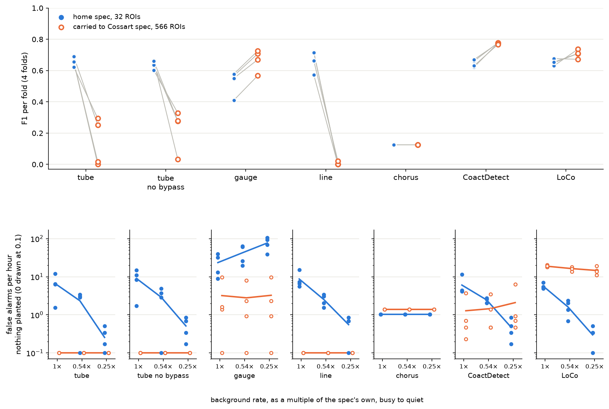
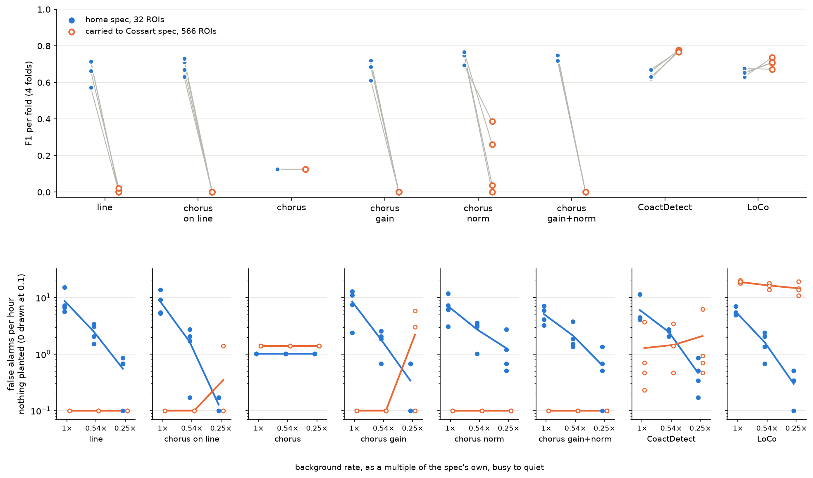

# The field-size candidates, on simulation: gauge carries to 566 ROIs, and has a quiet-field problem

> **Working material, not murderboarded.** Same standing as the handoffs and
> [`../../pipelines/learned-model-evaluation.md`](../../pipelines/learned-model-evaluation.md). Every
> number here is on **simulated recordings**. The Cossart spec was built unreviewed, with this lab's
> background shape ([`../cossart_transfer/README.md`](../cossart_transfer/README.md)), so the
> carried scores are good for telling candidates apart and are **not publishable**.

Run 2026-09-16 on branch `eval-field-size-candidates`. The candidates are two of the three designs in
the proposal held back from #589 (branch `claude/net-design-proposal-hw8rve`). `quorum` did not run:
every bench recording has one field size, so its exponent cannot be identified yet.

## What ran

`tools/fair_bakeoff.py`, 4 folds of 6 simulated recordings each (24 recordings), every model fitted
on the **home spec** (32 regions of interest, ROIs) and scored twice: on held-out home recordings,
and with `--score-spec` on the **Cossart spec** (566 ROIs). Nothing about the Cossart spec is visible
to the fit, including the threshold. Each learned model was trained at two torch seeds
(`--train-seed 0` and `1`); the hand-written detectors have no seed.

| model | what it is here | compared against |
|---|---|---|
| `gauge` | `tube`'s kernel bank, standardised against 8 shifted copies of the window, no bypass | `tube_no_bypass` |
| `tube_no_bypass` | the shipped `tube` with its raw-brightness bypass removed | `tube` |
| `chorus` | `line`'s per-ROI vote plus a spread and a loudest-four channel | `line` |
| `tube`, `line` | shipped models | CoactDetect |
| CoactDetect, LoCo | hand-written detectors | — |

All learned models trained at learning rate 1e-2, the control's rate, so no comparison mixes a
mechanism with its optimisation.

**New in this run: a quiet-field negative** (`--null-rates`). Each held-out recording gets null
twins with nothing planted, no distractors and no busy window, at 1×, 0.54× and 0.25× its
background rate, scored at the operating point already chosen. 0.54× is baseline's lower-quartile
per-ROI rate over the lab mean (0.0052 Hz of 0.0097 Hz, FOUNDATIONS §9); 0.25× is a stress level
below anything measured. The existing busy-window probe gives any model that divides by its
surround a free pass, and gauge divides.

**Not run**, and recorded as skipped rather than absent: the pipeline's aggregate-channel leak test,
its rigid-shift controls, label-free training and the real-recording check. These candidates were
built for field size, and the supervised bake-off at home and carried is the stage that asks that.

## Results

F1 is the mean over 4 folds. A fold with planted events and no hits counts as F1 0, not as missing
(`folds_with_no_hits_read_as_zero` in each `compare_seed*/field_size_candidates.json` lists them).

The **probe** columns are the busy-window false alarms (`hot_fa`): every simulated recording carries
a 300 s stretch, 1,200 s to 1,500 s, where every ROI fires at 0.06 Hz with nothing planted. That is
6.2 times the home background (0.0097 Hz) and 2.6 times the Cossart background (0.0233 Hz). A fold
holds 6 held-out recordings, so its count covers 30 minutes of busy window; the table gives the mean
over folds converted to **false alarms per hour of busy window** (count × 2). Probe firings are left
out of precision, so they do not show up in F1.

Each cell gives the seed 0 value, then the seed 1 value. The hand-written detectors have no seed, so they get one value.

| model | F1 home | F1 on Cossart | probe home, per hour | probe on Cossart, per hour |
|---|---|---|---|---|
| gauge | 0.526 / 0.513 | **0.668 / 0.585** | 112 / 79.5 | 26.5 / 31.5 |
| tube_no_bypass | 0.639 / 0.669 | 0.229 / 0.230 | 101.5 / 108 | 0 / 0 |
| tube | 0.656 / 0.635 | 0.140 / 0.244 | 125.5 / 101.5 | 0 / 0 |
| line | 0.666 / 0.710 | 0.005 / 0.145 | 8.5 / 34.5 | 0 / 0 |
| chorus | 0.125 / 0.125 | 0.125 / 0.125 | 0 / 0 | 0 / 0 |
| CoactDetect | 0.645 | 0.774 | 5.5 | 25 |
| LoCo | 0.653 | 0.707 | 14 | 27 |

Per-fold probe counts are in each `bakeoff*.json` under `per_fold[].hot_fa`.

⚠ **A probe count of zero is only evidence from a model that fires.** On Cossart, `tube`,
`tube_no_bypass` and `line` fire almost nowhere (F1 0.005 to 0.244), and chorus fires in the same few
places whatever its input, so their zeros there say they are nearly silent, not that they resist a
busy window. gauge's 26.5 and 31.5 per hour on Cossart sit level with CoactDetect's 25 and LoCo's 27.
At home gauge fires in the busy window about as often as the two tubes (80 to 126 per hour) and 15
to 20 times as often as CoactDetect: standardising against its own null did not buy busy-window
robustness on a 32-ROI field.

`tube` at seed 0 reproduces the shipped 24-recording bake-off's 0.656 exactly, so adding the
`bypass` flag did not move the shipped model.

Paired differences, per fold, as mean and *t* on 3 degrees of freedom:

| comparison | home, seed 0 | home, seed 1 | Cossart, seed 0 | Cossart, seed 1 |
|---|---|---|---|---|
| gauge − tube_no_bypass | −0.113 (*t* −4.2) | −0.157 (*t* −3.1) | **+0.439 (*t* 5.4)** | **+0.356 (*t* 4.3)** |
| tube_no_bypass − tube | −0.017 (*t* −2.4) | +0.034 (*t* 1.2) | +0.088 (*t* 1.4) | −0.014 (*t* −0.2) |
| gauge − CoactDetect | −0.119 (*t* −3.9) | −0.133 (*t* −3.1) | −0.106 (*t* −3.0) | −0.188 (*t* −4.8) |
| line − CoactDetect | +0.021 (*t* 0.9) | +0.065 (*t* 7.3) | −0.768 | −0.629 (*t* −6.1) |

False alarms per hour on the quiet-field twins, home spec, mean over folds:

| model | 1×, seed 0 | 0.54×, seed 0 | 0.25×, seed 0 | 1×, seed 1 | 0.54×, seed 1 | 0.25×, seed 1 |
|---|---|---|---|---|---|---|
| gauge | 23.5 | 42.6 | **76.8** | 15.9 | 26.5 | **57.3** |
| tube_no_bypass | 9.0 | 2.9 | 0.5 | 8.6 | 2.7 | 0.5 |
| tube | 6.6 | 2.3 | 0.3 | 9.5 | 3.1 | 0.8 |
| line | 8.7 | 2.5 | 0.6 | 5.2 | 1.8 | 0.3 |
| CoactDetect | 6.0 | 2.5 | 0.5 | | | |

**Figure 1. Training seed 0.** Top: F1 per fold, filled blue on the home spec (32 ROIs), open orange
for the same fitted model on the Cossart spec (566 ROIs); grey lines join a fold. Bottom: one panel
per model, false alarms per hour with nothing planted, background rate falling left to right; a
zero is drawn at 0.1 on the log axis. Seed 1 is
[`compare_seed1/field_size_candidates.png`](compare_seed1/field_size_candidates.png) and agrees.

## What the data show

- **gauge is the only learned model that carries to 566 ROIs**, and the gain is the standardisation,
  not the bypass it also drops: gauge beats `tube_no_bypass` on Cossart by +0.44 and +0.36 F1, while
  dropping the bypass alone moves Cossart F1 by +0.09 and −0.01.
- **It pays for that at home and still does not reach the hand-written detectors.** gauge is 0.11 to
  0.16 F1 below its control at home, and 0.11 to 0.19 below CoactDetect in both corpora. Nothing here
  licenses shipping it (the pipeline's gate is the comparison against the hand-written detectors).
- **gauge's false alarms climb as the field empties**, at both seeds, where every other model's fall
  (Figure 1, bottom). Before training, one onset in an otherwise empty 32-ROI, 4,096-frame window
  pushed gauge's standardised input to about 22,900, against a maximum of 29 on a field at the lab's
  rate: the spread of 8 shifted copies of a near-empty window is close to zero, and gauge divides by
  it. On the Cossart spec, where 566 ROIs keep the window busy, its false alarms stay flat at 3 to 5
  per hour.
- **chorus does not train.** At both seeds and in every fold its threshold sat at the bottom of the
  grid (0.0001) and it scored F1 0.125, the same failure `tiny` has always shown. Its *t* values in
  the JSON are arithmetic on a constant and mean nothing.
  **Why: its per-cell encoder starts deaf, and nothing reaches it to fix that**
  ([`why_chorus.txt`](why_chorus.txt), from `tools/diagnose_chorus_training.py`). At
  initialisation one onset moves a cell's vote by at most 0.0003 on a 0-to-1 scale, at three torch
  seeds; the mean over 32 ROIs then divides that by 32. The gradient reaching the encoder is
  1.5 × 10⁻⁶ against 0.41 at the head, about 270,000 times smaller. The loss does not fall in 900
  steps (1.82 at the first step, 1.88 at the last) where `line`'s falls to about 0.1 by step 200.
  After training the pooled mean differs by less than 0.0001 between event frames and background,
  and the output probability spans 0.567 to 0.652. **It is not the learning rate**: at 1e-3 the loss
  curve is the same to two decimals. `line` works because its per-cell stage is built with gain: a
  smear normalised to peak one, then a sigmoid with gain 8, so one onset moves a vote most of the
  way from 0 to 1 at the first step. That `tiny`'s identical 0.125 has the same cause is likely and
  untested.
- **line, the best learned model at home, carries worst**: 0.005 and 0.145 F1 on Cossart, with
  three and two folds of no hits. A share-of-field-lit statistic thresholded at 32 ROIs does not
  survive 566.

## Repairing chorus: it trains, it is the best model at home, and it does not carry

Four versions, each run the same way (4 folds of 6, training seed 0, learning rate 1e-2, at home and
carried to Cossart, with the null twins), in [`chorus_repairs/`](chorus_repairs/). Their six
hand-written rows come from the seed-0 run above, which scored the same folds
(`--skip-hand-written`; the six are deterministic).

| version | the change | vote change for one onset at initialisation |
|---|---|---|
| chorus | none, the failed control | 0.0002 to 0.0003 |
| chorus_line | `line`'s per-cell stage (peak-one smear, sigmoid with gain 8) with chorus's spread and loudest-four channels | 0.96 |
| chorus_gain | chorus's encoder, with a learnable gain on the raster started at 1,000 | 0.57 to 0.61 |
| chorus_norm | chorus's encoder, each cell's output standardised over time | 0.22 to 0.51 |
| chorus_gain_norm | standardised, then `line`'s vote: learnable gain started at 8 and a bias | 0.73 to 0.99 |

The initialisation column is from [`tools/probe_untrained_response.py`](../../../tools/probe_untrained_response.py)
at two torch seeds; 1,000 was chosen there, before any training, as the smallest input gain that moved
a vote by more than half.

| model | F1 home | F1 on Cossart | probe home, per hour | null twins home, per hour at 1× / 0.54× / 0.25× |
|---|---|---|---|---|
| chorus_norm | **0.741** | 0.171 | 2.0 | 7.1 / 2.7 / 1.3 |
| chorus_gain_norm | **0.737** | 0 | 1.5 | 5.1 / 2.1 / 0.6 |
| chorus_line | 0.686 | 0 | 4.5 | 8.4 / 1.7 / 0.1 |
| chorus_gain | 0.678 | 0 | 2.5 | 8.5 / 1.8 / 0.3 |
| line | 0.666 | 0.005 | 8.5 | 8.7 / 2.5 / 0.6 |
| chorus | 0.125 | 0.125 | 0 | 1.0 / 1.0 / 1.0 |
| CoactDetect | 0.645 | 0.774 | 5.5 | 6.0 / 2.5 / 0.5 |

Paired against CoactDetect at home: chorus_norm +0.096 F1 (*t* 6.7), chorus_gain_norm +0.092
(*t* 8.2), chorus_line +0.041 (*t* 3.6), chorus_gain +0.032 (*t* 2.0). chorus_line against `line`:
+0.020 (*t* 1.5).

**Figure 2. The chorus repairs, training seed 0.** Drawn as Figure 1. Darkroom copy:
`<darkroom>/bugarach/field-size-candidates/chorus-repairs-seed0/`.

- **Every repair trains.** The failure was the deaf per-cell stage and nothing else: each of the four
  ways of giving it gain lifts chorus from 0.125 to 0.68–0.74 at home.
- **At home, the standardised versions are the best models in this project's bake-off**, 0.09 F1
  above CoactDetect at *t* 6.7 and 8.2 on 3 degrees of freedom, with fewer busy-window false alarms
  than CoactDetect (1.5 and 2.0 per hour against 5.5) and quiet-field false alarms that fall as the
  field empties, as they should. A learned per-cell encoder that trains beats `line`'s hand-built one
  by about 0.07; the extra pooled channels on `line`'s stage add only 0.02, inside the noise.
- **None of them carries.** On the Cossart spec chorus_line, chorus_gain and chorus_gain_norm make
  **no detections at all** in any fold, and chorus_norm makes 1 to 60 per fold against 90 planted
  events. This is what the field-size argument predicts for their pools: a mean over ROIs is a
  fraction of the field and the loudest-four channel is a fixed count, and a threshold learned on
  either at 32 ROIs does not hold at 566. Training them made that failure visible; it did not cause it.
- **One training seed only.** The home margins are large next to the seed-to-seed movement seen for
  the other models (up to 0.04), but the second seed has not been run.

## Limits

- Simulation only, and the Cossart spec is unreviewed with an inherited background.
- 4 folds: *t* has 3 degrees of freedom, and two training seeds are a replicate, not a distribution.
- The quiet-field twins are this run's construction; 0.25× is below any measured baseline.
- gauge's null is deterministic and set by row order, so relabelling the ROIs moves its output
  slightly (about 0.03 on an untrained model at 32 ROIs); `encode` fixes the order in use.
- Every run's provenance records `git_dirty: true`: the output folder was untracked while the runs
  wrote into it. The tools each run used were committed at the recorded commit.

## Files

`bakeoff.json` and `bakeoff_seed1.json` (home), `bakeoff_generator_spec_to_spec_k12.json` and
`..._seed1.json` (Cossart), the four run logs, and `compare_seed0/`, `compare_seed1/` from
`tools/compare_field_size_candidates.py`. Darkroom copies of both figures:
`<darkroom>/bugarach/field-size-candidates/seed0/` and `seed1/`.
