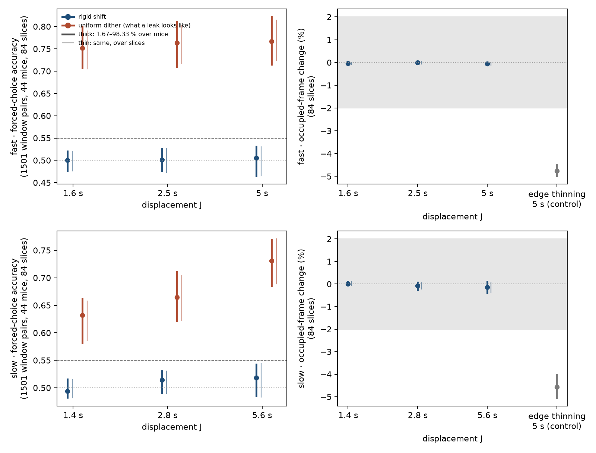
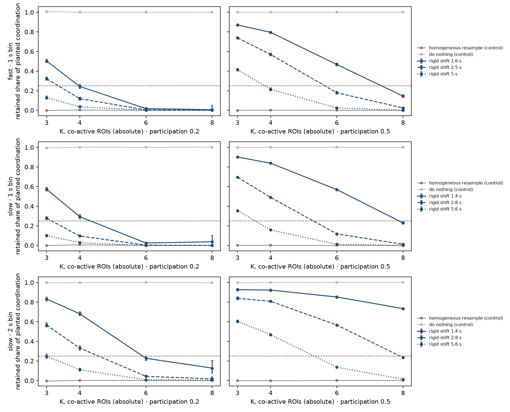
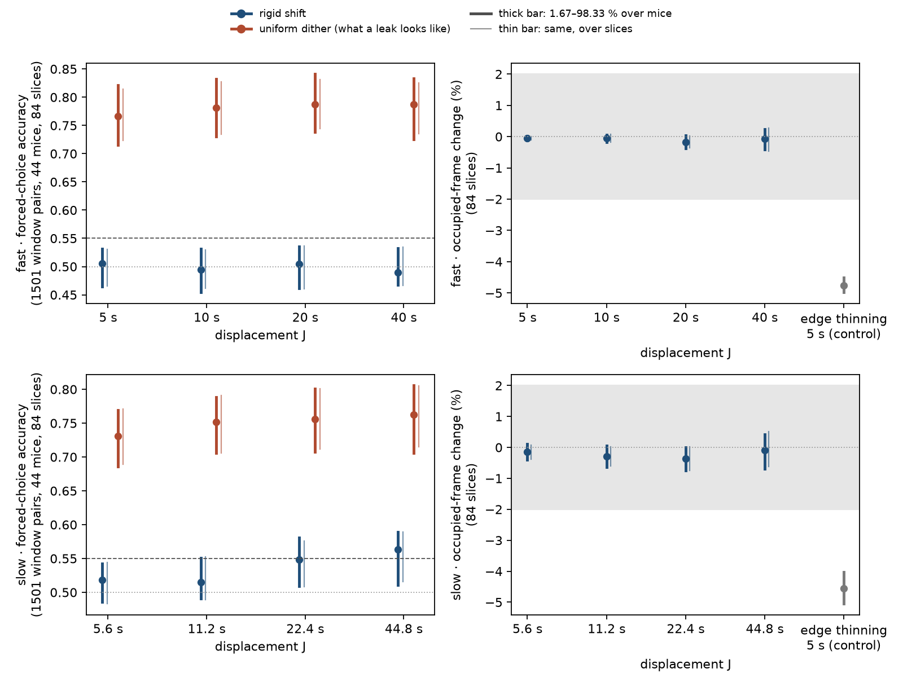
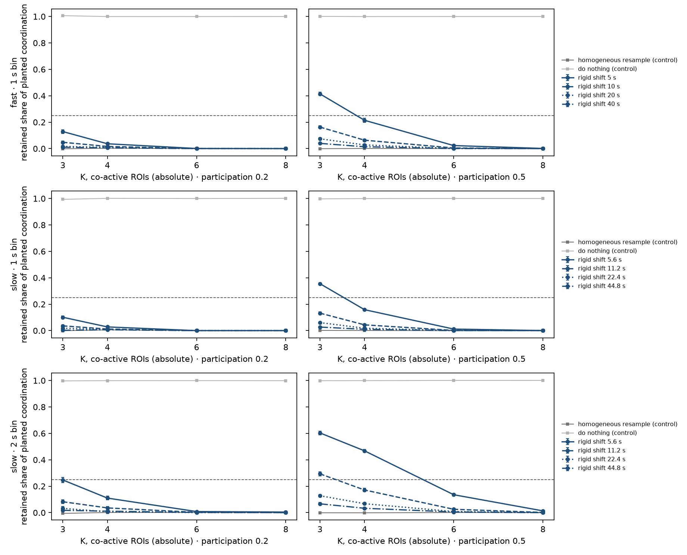
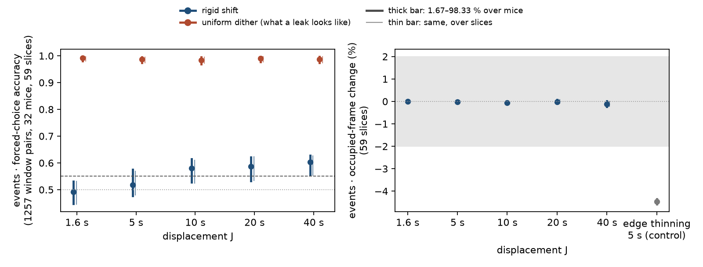
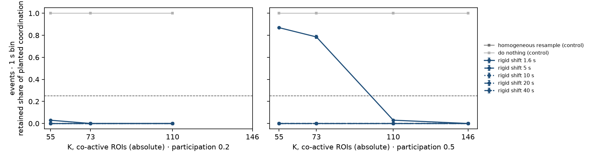

# Rigid shift, one look — does it hide while it removes coordination?

> ⚠ **Under correction, 2026-09-15 — read this before anything below.** This note was reviewed
> after it shipped ([run record](../../reviews/rigid-shift-look-2026-09-15.md)). Two of its
> readings do not hold as written, and the rest of the note has not yet been rewritten.
>
> - **The rising "leak" at large displacements on the slow stream and on Cossart is probably not
>   a leak.** The classifier's pooled per-ROI statistics respond when ROIs that rise and fall
>   together are shifted apart. A reviewer shifted every ROI of a recording by one *shared*
>   offset. That moves each ROI's drift exactly as rigid shift does but keeps cross-ROI
>   structure, and it reads at chance:
>   - slow stream, 44.8 s: 0.502, against 0.558 for independent offsets;
>   - Cossart, 10 s: 0.500, against 0.560;
>   - each value is 3 surrogate draws × 3 fold seeds.
>
>   The classifier is detecting removed shared modulation, not drift moved in time. The slow
>   window, "Cossart only near 5 s" and "larger shifts leak" all rest on that misreading. The fast
>   stream is unaffected (40 s: 0.506, against 0.510 for a shared offset).
> - **The Cossart destruction result could not have failed.** At K of 55 co-active ROIs or more,
>   every shift of 2.6 s or longer has to read 0. The Cossart events that matter are smaller: about
>   28 of 566 ROIs (8.1 %,
>   [cossart_transfer](../cossart_transfer/README.md)), below every K scanned.
> - **Also corrected:**
>   - **The slow window:** at 11.2 s the upper bound over mice is 0.551, which crosses 0.55.
>   - **The groups:** the slow leak is not "almost entirely" in DI. MALE reads 0.593 at 44.8 s,
>     and group cannot be separated from imaging day.
>   - **The Cossart recordings:** they are in vivo two-photon imaging of CA1 in awake pups aged
>     5–12 postnatal days, not slices. The data are
>     [DANDI:000219](https://dandiarchive.org/dandiset/000219) by Robin Dard, Michel Picardo and
>     Rosa Cossart, licensed CC-BY-4.0. They come from Dard et al. 2022, *eLife* 11:e78116,
>     doi:10.7554/eLife.78116.
>   - **Prior art:** rigid shift is published as whole-train shifting (Pipa, Riehle & Grün 2007;
>     Pipa et al. 2008; Louis, Borgelt & Grün 2010). The published form wraps the train; this run
>     does not.

> **Exploratory, run 2026-09-14 night.** Tony set the pre-registration machinery aside for one
> figure he reads himself. The dashed lines at 0.55, ±2 % and 0.25 are the thresholds he signed
> earlier, drawn for reference, not applied as a rule. Not murderboarded. Baseline windows of the
> lab folder only.
> Results: `<darkroom>/bugarach/archive/2026-09/2026-09-15-rigid-shift-look/`. Code: `tools/look_rigid_shift.py`
> and `tools/make_rigid_shift_look_figure.py` on branch `unsup/rule-as-code`.

## The answer, short

**On the fast stream, rigid shift at 10–20 s looks usable.** A classifier that cannot see
coordination cannot tell it from the real recording (accuracy 0.50, chance 0.50). Onset counts are
unchanged, and the shift removes 84–99 % of planted coordination in synthetic recordings. At the
displacements first planned (1.6–5 s) it hides just as well but removes too little: a large event
keeps up to 87 % of its coordination.

**On the slow stream, the window is narrow.** Up to about 11 s the shift hides (0.52), but large
events on the 2 s bin keep 29 % of their coordination. At 22 s and beyond it starts to give itself
away (0.55–0.56), almost entirely in the DI group (0.62–0.68). DI is the group whose slow baselines
the recording-identity run found least stationary, so the classifier is probably seeing slow drift
moved in time.

## What was measured

Every lab recording has a declared baseline region, and all 84 were read from it; none was
skipped. Each baseline was cut into whole 60 s windows, and the first and last were dropped as
edge windows. That gives 1,501 window pairs per stream, from 44 mice.

- **Leak.** Each window is paired with the same window of a rigid-shifted copy of its recording.
  The shift moves each ROI's whole train by one random offset within ±*J*. A linear classifier
  sees each ROI's own onset statistics, pooled over ROIs, so it cannot see cross-ROI timing, and
  it is asked to pick the real one. The edge-band features are left out, because the second review
  showed they see coordination under a shift. Accuracy is resampled over mice and, separately, over
  slices; the two intervals came out almost identical everywhere. Uniform dither, which moves every
  onset independently, is drawn beside it as what a leak looks like.
- **Destruction.** Synthetic twins are built with this stream's typical ROI count (31), length and
  per-ROI rates. One twin of each pair has events planted in 20 % or 50 % of ROIs, the other none;
  there are 20 pairs per level. Both go through the same shift. **Retained share** is how much of
  the planted coordination excess survives, where excess is what the assessor counts in a 1 s bin
  (and a 2 s bin on slow) above its circular-shift null. **K** is the number of ROIs that must fire
  together in one bin. Controls: homogeneous resample (should read 0) and do-nothing (should
  read 1).
- **Count.** Occupied frames per ROI per window, shifted against real. The edge-thinning control at
  5 s must show a change.

## Figures

### The displacements first planned

**Figure 1. Leak and onset count at the planned displacements.**
- **Left panels:** forced-choice accuracy for rigid shift (blue) and uniform dither (red), fast
  above and slow below. Thick bars are the 1.67–98.33 % range over mice, thin bars the same over
  slices. The dotted line is chance, the dashed line 0.55.
- **Right panels:** occupied-frame change in percent, with the ±2 % band shaded and the
  edge-thinning control in grey.
- **What it shows:** rigid shift reads 0.49–0.52 at every displacement while dither reads
  0.63–0.77, and counts move by at most 0.14 % against the control's −4.6 %.

**Figure 2. How much planted coordination survives at the planned displacements.**
- **Rows:** fast at a 1 s bin, slow at 1 s, slow at 2 s.
- **Columns:** 20 % and 50 % of ROIs in each planted event.
- **Axes:** x is K; each line is one displacement. Bars are 95 % over the 20 twin pairs. The grey
  squares are the two controls, which read 0 and 1 as they should.
- **What it shows:** removal is poor for large events at low K. At K = 3 with 50 % participation,
  1.6 s keeps 0.87, and 5 s still keeps 0.41 (fast, 1 s bin) and 0.60 (slow, 2 s bin).

### Larger displacements, the follow-up

Run the same night, because the first run showed no leak rising with displacement.

**Figure 3. Leak and onset count at 5–40 s (fast) and 5.6–44.8 s (slow).**
- **Panels:** as in Figure 1.
- **Fast:** stays at chance to 40 s (0.49–0.51).
- **Slow:** rises to 0.549 at 22.4 s and 0.563 at 44.8 s, with lower bounds 0.509 and 0.510. By
  group at 44.8 s: DI 0.675, MALE 0.593, ORX 0.506, OVX 0.507.
- **Counts:** stay within 0.4 %.

**Figure 4. How much planted coordination survives at 5–40 s (fast) and 5.6–44.8 s (slow).**
- **Panels:** as in Figure 2.
- **Fast, K = 3, 50 % participation:** retained falls 0.41 → 0.16 → 0.07 → 0.04 across 5, 10, 20
  and 40 s.
- **Slow, 2 s bin:** 0.60 → 0.29 → 0.13 → 0.07.

### The Cossart folder, 2026-09-15

Tony asked whether it works on the Cossart dataset. The same look was run on the Cossart folder:
59 recordings from 32 mice, 1,257 window pairs. The folder declares no baseline region, so each
recording was read whole; the typical recording is 12,634 frames at a 0.118 s frame interval,
about 25 minutes. The twins have 566 ROIs,
the folder's typical field. With 566 ROIs a K of 3–8 would count chance coincidences, so K was
scaled with the field to 55, 73, 110 and 146 ROIs. There are 10 twin pairs per level.
Displacements are 1.6, 5, 10, 20 and 40 s.

**Figure 5. Leak and onset count on the Cossart folder.**
- **Panels:** as in Figure 1, one stream.
- **Leak:** rigid shift reads 0.49 at 1.6 s and 0.52 at 5 s (range over mice 0.48–0.58). From
  10 s it gives itself away: 0.58 at 10 s, 0.59 at 20 s and 0.60 at 40 s, with lower bounds
  0.53–0.56. Uniform dither reads 0.98–0.99. The ranges over slices match those over mice.
- **Counts:** within 0.11 %, against −4.5 % for the control.

**Figure 6. How much planted coordination survives on the Cossart folder.**
- **Panels:** as in Figure 2, with the 1 s bin only. The homogeneous-resample control reads 0
  and sits under the rigid-shift lines. At K = 146 with 20 % participation, a planted event holds
  113 ROIs, which is fewer than K, so there is nothing to remove and no point.
- **What it shows:** from 5 s every displacement removes all of it. At 1.6 s, events in 50 % of
  ROIs keep 0.87 at K = 55 and 0.79 at K = 73.

**Reading.** On Cossart the only candidate is near 5 s: it hides, though its upper bound crosses
0.55, and it removes large events. Unlike the lab's fast stream, larger shifts leak. Why is
not known. One untested guess: the recordings are whole, so slow drift is moved in time, the
same story as the lab's slow stream.

**The K scaling makes removal easy.** Take an event in 283 ROIs, shifted ±5 s. It spreads over
10 s, about 28 ROIs per 1 s bin, which is below K = 55. If the Cossart events that matter involve
tens of ROIs, the right K is small, removal needs a larger shift, and that is where the leak
begins. Small K on Cossart is not measured. The screen's review found that the destruction
measure could not register removal on Cossart at its settings; with K scaled, the controls read
0 and 1, so here it can.

## What this cannot say

- **The destruction test uses synthetic events with one frame of jitter.** Real coordinated events
  are probably looser: an interface2 commit measured real fast onset jitter at about 1 s. Looser
  events are harder to remove, so these retained shares are a best case.
- **The leak classifier is linear and sees per-ROI statistics.** A trained model is a stronger
  learner. "Not detected here" is not "undetectable".
- **Shifting by 10–20 s removes all cross-ROI structure faster than that,** not only fast
  coordination: shared slow modulation within that range goes too. A model trained against these
  negatives learns "real = anything shared on timescales under about *J*". Whether that is what
  should count as coordination is a scientific call, not a statistical one.
- **Same recordings.** This uses the recordings the earlier screen explored, and it chose its
  follow-up displacements after seeing the first run. It is a look, not a confirmation.

## The decision this sets up for Tony

1. **Fast:** is rigid shift at 10–20 s a negative class worth training against, given the
   timescale caveat above?
2. **Slow:** accept a narrow window near 11 s, which hides but leaves some large-event
   coordination, or look for a slow-specific surrogate that respects the DI nonstationarity?
