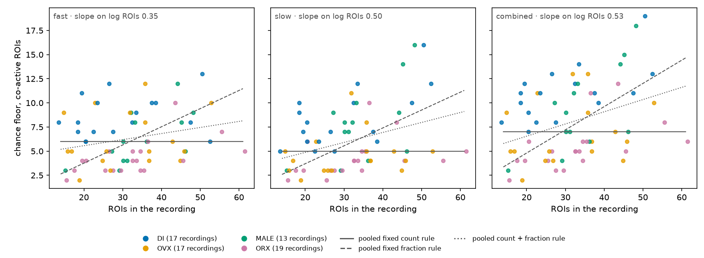
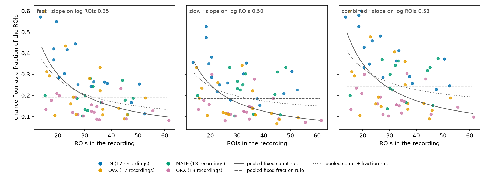
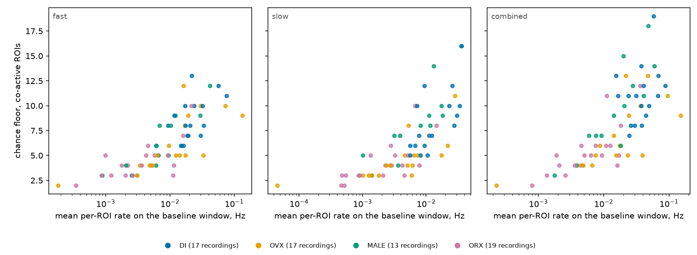
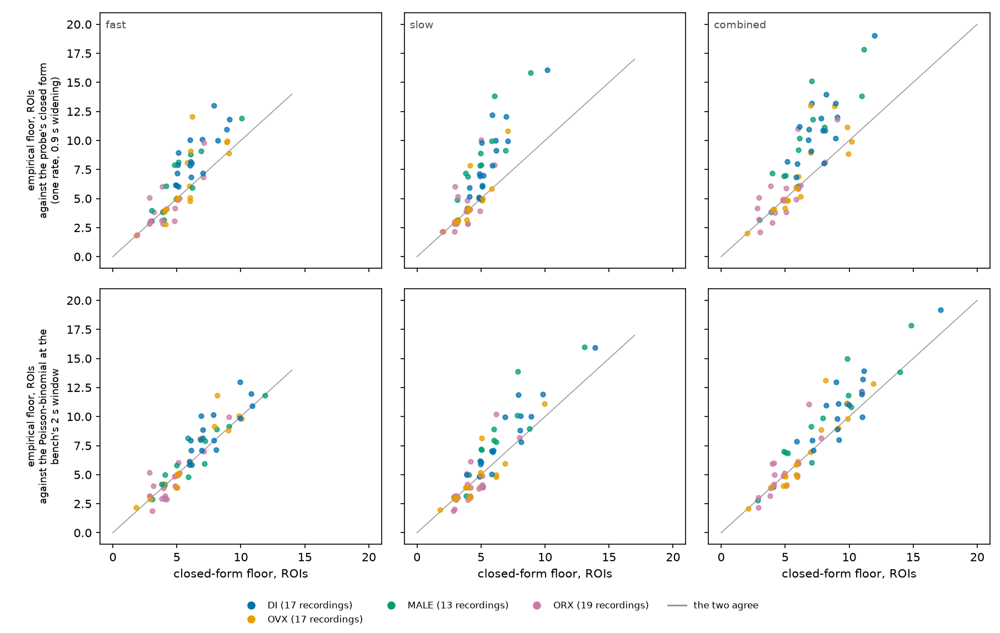

# The chance floor follows each recording's event rate; ROI count, as a count or as a fraction, explains little of it

Run 2026-09-23 (evening) on WSMIP064, for the orchestrator at Tony's request. It is evidence for
**link 1 of the scoring design, the event floor**. That link is open with Tony. His ruling so far:
participation should have a floor and a fraction, because the number of ROIs varies. The open
questions are:

- does the count floor *K* come from chance?
- where does the fraction *f* come from?
- does each stream get its own?

**This record decides none of them.** It gives no recommendation for *K* or *f* beyond what the
data show.

**Working material, not murderboarded.** No bench constant, operating point or ADR changes.

**Dataset:** `2026-09-23_revised_2v_long_senktide_ttx_STEPS_AND_PINS_EXCLUDED` (role
`senktide_ttx`, the default on [#786](https://github.com/syncytium2/bugarach/pull/786)'s branch,
not yet on `main`). It holds 66 recordings from 36 mice with 14–61 regions of interest (ROIs)
each, and only baseline windows are read (FOUNDATIONS §9).
- Groups: DI 17 recordings (10 mice), OVX 17 (9), MALE 13 (8), ORX 19 (9).
- **Confirmed by Tony in this session.** Nothing was filtered.

**Tool:** `tools/measure_chance_floor.py` (new), built beside `tools/probe_field_size.py` and
importing its closed form rather than copying it. Figures come from
`tools/make_chance_floor_figure.py`.
**Record:** `summary.json` here, with per-recording floors and group statistics. The darkroom
folder `bugarach/2026-09-23-chance-floor-66/`, claimed on `docs/SESSIONS.md`, holds
`results.json` (per-ROI rates, and the null and real call rates at every *K*), the run log and the
figures.
**Size:** 1,000 rigid-shift draws per recording per stream, 20 jobs, 24 s wall clock.

## What was measured

- **The co-active count** at each sliding-window position is the number of ROIs with at least
  one onset in the next *w* seconds.
  - *w* is CoactDetect's `int_win_sec`: **2 s on all three streams**, read from each bench's
    operating point at run time.
  - CoactDetect is the project's calibrated coincident-event detector.
- **A call at count *K*** is one unbroken run of window positions whose count is at least *K*.
- **The null** is ADR-0006's:
  - `rigid_frames(shared=False)`: every ROI's whole train slid by its own offset, uniform in
    ±*J*, with *J* = 20 s.
  - It keeps each ROI's rate, its own timing (dead time included) and the minute-scale shared
    change. It destroys the alignment between ROIs.
  - Both the real recording and the null are read on the window trimmed by *J* at each end.
- **The empirical floor** is the smallest *K* whose calls on the null, pooled over the 1,000
  draws, come to **at most 1 per hour** of baseline.
- **Stability:** the floor from each half of the draws matches the full-draw floor on 61, 60 and
  64 of 66 recordings (fast, slow, combined). Where it differs, it differs by 1 ROI.
- **Closed forms, per recording, from the same ROIs' rates:**
  - `probe_field_size`'s formula as that probe runs it: one homogeneous rate, each onset widened
    to 9 frames (0.9 s), and 1 chance frame per hour.
  - The same with each ROI's own rate, as a Poisson-binomial count.
  - The same null at the bench's 2 s window, homogeneous and Poisson-binomial.

## Figure 1, the floor against ROI count



**Figure 1.** The empirical chance floor (co-active ROIs) against ROIs in the recording, one mark
per recording, one panel per stream.
- Colour is group. Recordings sharing a value are offset sideways by group.
- Lines are the three rules fitted to all 66 recordings: a fixed count (solid), a fixed fraction
  of the ROIs (dashed), and count plus fraction, *a* + *b* × ROIs (dotted).

**The floor ranges 2–13 ROIs on fast, 2–16 on slow and 2–19 on combined.** Two recordings with the
same ROI count can differ by 8 or more. **ROI count explains little of it**: Spearman correlation
0.27 fast, 0.33 slow, 0.36 combined.

## Figure 2, the same floor as a fraction of the ROIs



**Figure 2.** The floor divided by the recording's ROI count, against ROI count, with the same
three pooled rules.

As a fraction it runs from 0.08 to 0.60 on fast, 0.07 to 0.53 on slow and 0.09 to 0.60 on
combined. It falls with ROI count, but the spread at any one count is as wide as the fall.

**Slope of log floor against log ROI count** (0 means a fixed count, 1 a fixed fraction):

| stream | all 66 | DI | OVX | MALE | ORX |
|---|---|---|---|---|---|
| fast | **0.35** [0.04, 0.71] | 0.15 | 0.23 | 0.97 | 0.62 |
| slow | **0.50** [0.22, 0.86] | 0.51 | 0.28 | 1.01 | 0.57 |
| combined | **0.53** [0.20, 0.93] | 0.38 | 0.34 | 1.24 | 0.72 |

Brackets are the 95% mouse bootstrap. The groups' own intervals are wide; MALE's runs
[0.49, 2.11] on fast.

**How far each rule misses, pooled** (median absolute miss, in ROIs):

| stream | fixed count | fixed fraction | count + fraction |
|---|---|---|---|
| fast | 6 ROIs: misses by 2.00 | 0.188 of the ROIs: misses by 2.06 | 4.31 + 0.063 × ROIs: misses by 2.29 |
| slow | 5 ROIs: misses by 2.00 | 0.185: misses by 2.15 | 2.80 + 0.103 × ROIs: misses by 2.37 |
| combined | 7 ROIs: misses by 3.00 | 0.240: misses by 2.91 | 4.02 + 0.126 × ROIs: misses by 3.02 |

- **No rule written in ROI count tracks the floor better than the others; all three miss by
  2–3 ROIs.**
- The pooled slope sits between a count and a fraction on every stream, and its interval
  excludes both 0 and 1 on all three.
- **Within a group, the best of the three rules misses by 0.65–2.0 ROIs, against 2.0–2.9
  pooled, because the group already carries much of what moves the floor** (Figure 3).

## Figure 3, the floor against the recording's rate



**Figure 3.** The floor against the recording's mean per-ROI onset rate on its baseline window
(Hz, log scale), coloured by group.

**This is the axis that carries the floor.** Spearman correlation between floor and mean rate:
0.84 fast, 0.84 slow, 0.79 combined, against 0.27–0.36 for ROI count.

With log rate beside log ROI count in one regression (all 66 recordings), the slope on log ROIs
falls to 0.27 fast, 0.34 slow and 0.41 combined. The slope on log rate is 0.30, 0.31 and 0.34.

**The groups separate along this axis because their rates differ** (the
[afternoon run](../2026-09-23-groups-rates-comod-66/README.md)). DI sits high and ORX low on every
stream.

## The floor by group

Median floor over recordings [95% mouse bootstrap]. A pair is **robust** when its gap survives
leave-one-out *and* the mouse bootstrap of the difference excludes zero.

⚠ A median of whole-ROI floors rarely moves when one recording is dropped. Leave-one-out ranges
here are often a single point, and on their own they pass almost any gap. So the bootstrap is the
test that binds, and both are in `summary.json`.

**As a count (co-active ROIs):**

| stream | DI | OVX | MALE | ORX | all 66 | robust pairs |
|---|---|---|---|---|---|---|
| fast | 8 [7, 10] | 5 [5, 8.5] | 6 [4, 8] | 4 [3, 5] | 6 [5, 7] | DI–ORX |
| slow | 7 [6, 10] | 4 [3, 5] | 8 [4, 9] | 4 [3, 5] | 5 [4, 7] | DI–OVX, DI–ORX, MALE–ORX |
| combined | 11 [9, 12] | 6 [5, 9] | 9 [6.5, 12] | 5 [4, 6] | 7 [6, 10] | DI–OVX, DI–ORX, MALE–ORX |

**As a fraction of the ROI count:**

| stream | DI | OVX | MALE | ORX | all 66 | robust pairs |
|---|---|---|---|---|---|---|
| fast | 0.286 [0.255, 0.417] | 0.189 [0.135, 0.252] | 0.185 [0.133, 0.242] | 0.127 [0.111, 0.157] | 0.188 [0.158, 0.242] | DI–OVX, DI–MALE, DI–ORX |
| slow | 0.286 [0.213, 0.353] | 0.116 [0.108, 0.188] | 0.233 [0.156, 0.311] | 0.125 [0.105, 0.147] | 0.185 [0.138, 0.230] | DI–OVX, DI–ORX, OVX–MALE, MALE–ORX |
| combined | 0.373 [0.289, 0.470] | 0.189 [0.160, 0.294] | 0.300 [0.183, 0.364] | 0.156 [0.131, 0.192] | 0.240 [0.190, 0.306] | DI–OVX, DI–ORX, MALE–ORX |

**A floor set from all 66 together sits on the wrong side for DI and for ORX, in opposite
directions:**

- **DI:** its interval lies above the all-66 median on every stream (fast 7–10 against 6, slow
  6–10 against 5, combined 9–12 against 7). The all-66 floor would admit a typical DI recording
  at a count its own rates reach by chance more than once an hour.
- **ORX:** its interval lies below the all-66 median on fast (3–5 against 6) and combined (4–6
  against 7), and reaches it on slow (3–5 against 5). The all-66 floor asks ORX recordings for
  more co-active ROIs than chance requires of them.

The same split holds as a fraction: DI 0.29–0.37 against ORX 0.13–0.16.

**What the separated pairs share is a rate difference.** DI–ORX, the robust pair on every stream
and in both units, is also the largest rate gap measured this afternoon.

## Figure 4, empirical against closed form



**Figure 4.** The empirical floor against two closed forms, one mark per recording, jittered by
±0.2 ROI.
- Top row: `probe_field_size`'s formula at the recording's mean rate.
- Bottom row: the Poisson-binomial at the bench's 2 s window with each ROI's own rate.
- Grey line: agreement.

| stream | Poisson-binomial at 2 s: empirical floor above / equal / below | median difference | probe's formula: empirical above / below |
|---|---|---|---|
| fast | 21 / 32 / 13 | 0 ROIs (−1 to +4) | 32 / 8 |
| slow | 28 / 22 / 16 | 0 ROIs (−1 to +6) | 32 / 5 |
| combined | 31 / 23 / 12 | 0 ROIs (−1 to +5) | 37 / 7 |

**The Poisson-binomial at the bench's window matches the empirical floor at the median.** It
misses by up to 6 ROIs on individual recordings. Whenever it misses by more than 1 ROI, it comes
out **too low**. The miss grows with rate (Spearman correlation 0.27–0.42).

The largest misses:

| stream | recording | group | empirical floor | Poisson-binomial |
|---|---|---|---|---|
| fast | `20260702_334` | OVX | 12 | 8 |
| slow | `20241211_127` | MALE | 14 | 8 |
| slow | `20250806_174` | ORX | 10 | 6 |
| combined | `20241211_127` | MALE | 15 | 10 |

`20260702_334` and `20250806_174` are two of the recordings the afternoon run found carrying their
groups.

**Why the empirical floor comes out higher is not established here.** The rigid-shift null keeps
two things the closed form assumes away: minute-scale shared change and each ROI's own clustering
in time. Either could raise it, and ADR-0006 treats the first as background.

**The probe's own formula comes out lower more often.** It uses a 0.9 s widening where the bench
uses 2 s, and one rate for every ROI. It sits below the empirical floor on 32–37 of 66
recordings.

**The real recordings clear their own floor.** At each recording's empirical floor, the median
real recording makes 3.1 calls per hour on fast, 6.8 on slow and 6.4 on combined, against a null
at or below 1. On the fast stream, 39 of 66 recordings exceed 1 call per hour at their floor
(slow 42, combined 45). The rest make no calls at that count.

## What the data say about the three questions

This section reports only what was measured.

- **Does *K* come from chance?** A chance floor exists on every recording and is stable to 1 ROI
  at 1,000 draws. It varies from 2 to 19 co-active ROIs, and **it varies mostly with the
  recording's rate, not its ROI count.**
- **Where does *f* come from?** A fixed fraction of the ROIs tracks the chance floor no better
  than a fixed count does. Pooled, the floor scales between the two (slope 0.35–0.53), and the
  fraction the data give differs by group: 0.13 for ORX, up to 0.37 for DI.
- **Does each stream get its own?**
  - The all-66 median floor is 6 ROIs on fast, 5 on slow and 7 on combined, at the same 2 s
    window.
  - As a fraction: 0.188, 0.185 and 0.240.
  - By group, the streams differ by more than that. Combined runs highest for DI and MALE
    (11 and 9, against 6–8 on fast and slow).

## What limits the reading

- **One window and one *J*.** The window is CoactDetect's 2 s. The slow and combined benches use
  it sliding, the fast bench binned, and this tool slides on all three. *J* is ADR-0006's 20 s.
  Neither was varied in this run.
- **Calls are runs, not merged calls.** CoactDetect merges calls closer than its merge gap (8 s on
  slow and combined), which would lower the null's call rate. These floors are therefore at or
  slightly above what a merging detector would see.
- **The budget is 1 per hour**, as `probe_field_size` states it. Every floor moves with it.
- **Group is nested in imaging day:** 34 dates, none with more than one group. A group floor is
  also a floor for the days those mice were recorded.
- **The bench modules were read at run time** while #786 was changing them on the Mac. The window
  this run used is recorded as `window_sec` in `summary.json` for each stream. It was 2 s on all
  three.

## Reproduce

```
python -m bugarach.dataset confirm        # Tony's yes first, never on his behalf
python tools/measure_chance_floor.py --out <run> --draws 1000 --jobs 20
python tools/make_chance_floor_figure.py --run <run> --also docs/learned/runs/2026-09-23-chance-floor-66
```

`summary.json` is stamped with its dataset. Until #786 puts `senktide_ttx` on `main`,
`tools/check_scored_dataset.py` lists it as scored on another folder.
