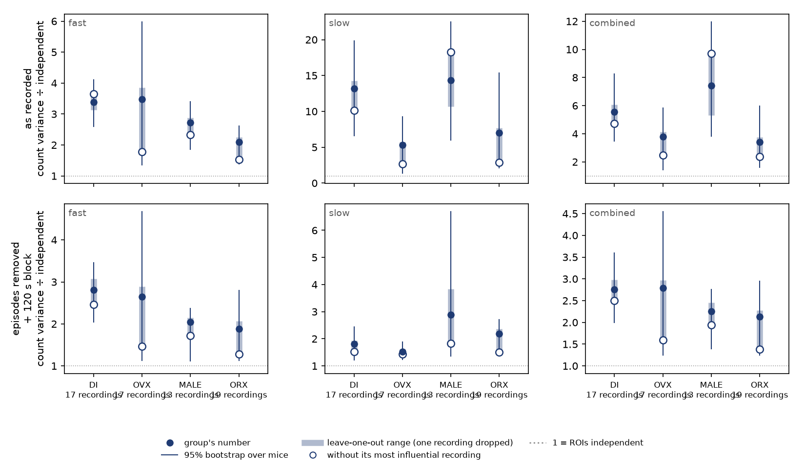
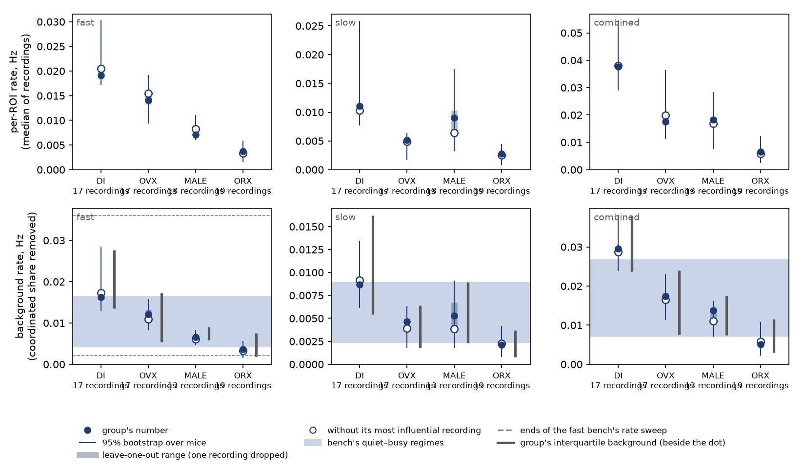
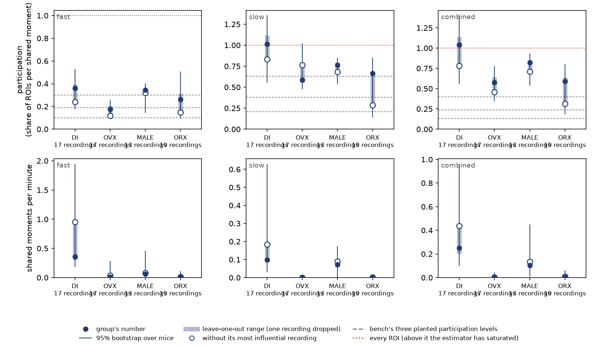

# The four groups differ in rate and in how much of it is shared; co-modulation and participation do not hold a difference once mice are resampled

Run 2026-09-23 on WSMIP064, for the orchestrator at Tony's request. It feeds one open question:
**do the four groups differ enough in coordination that detectors would need tuning per group?**
Tony calls that an experimental question. On the 84-recording folder the answer was "not
readable", because single recordings carried whole groups. This run asks it again on the
66-recording folder, with the leave-one-out check built into both tools so it goes with every
rerun.

**Working material, not murderboarded** — same standing as the other run records here.
**Measures; adopts nothing.** No operating point, bench constant or model changes.

**Dataset:** `2026-09-23_revised_2v_long_senktide_ttx_STEPS_AND_PINS_EXCLUDED` (role
`senktide_ttx`): 66 recordings from 36 mice, only recordings whose first treatment is senktide or
TTX, **baseline windows only**. It is the default on the branch `default-senktide-ttx`
([#786](https://github.com/syncytium2/bugarach/pull/786)), not yet on `main`. **Confirmed by Tony
in this session** ("data set from 9-23 confirmed") before anything read it. Every recording in the
folder is in every number. Nothing was filtered.

| group | recordings | mice |
|---|---|---|
| DI (diestrus) | 17 | 10 |
| OVX (ovariectomised) | 17 | 9 |
| MALE | 13 | 8 |
| ORX (orchiectomised) | 19 | 9 |

**Tools:** `tools/measure_slow_comodulation.py` (co-modulation, all three streams) and
`tools/measure_coordination_rates.py --by-group` (rate and participation). Both gained their group
checks in this change, through the new `bugarach.influence`. Figures come from
`tools/make_group_comparison_figure.py`.
**Records:** `comodulation_summary.json` and `coordination_rates.json` are in this folder. The
co-modulation run's per-recording `results.json` and both run logs are in the darkroom folder
`bugarach/2026-09-23-groups-rates-comod-66/`, claimed on `docs/SESSIONS.md`.
Wall clock: 509 s for co-modulation (20 jobs, 8 surrogate draws per recording); under 1 minute
for rates.

## Terms

- **ROI**: region of interest, one traced cell.
- **Streams**:
  - **fast** and **slow**: the two event streams the export carries.
  - **combined**: every fast and slow onset of a ROI as one train (`bugarach.combined`).
- **Leave-one-out**: the group's number recomputed with each recording dropped in turn.
  - Its **range** is what a single recording can do to the number.
  - The **most influential recording** is the one whose drop moves the number furthest.
- **Survives leave-one-out** (the orchestrator's criterion): the gap between two groups is
  wider than **both** groups' leave-one-out ranges, so no single recording can close it from
  either side.
- **Mouse bootstrap**: 1,000 resamples of a group's **mice** with replacement. A drawn mouse
  brings all of its recordings, because recordings from one mouse are not independent. Intervals
  are the 2.5th–97.5th percentiles.
- **The two tests answer different questions.**
  - Leave-one-out asks whether a gap is about one recording.
  - The bootstrap asks whether it is about which mice happened to be recorded.
  - A difference is called **robust** below only when it passes both.
- **Leave-one-out drops recordings, not mice.** A mouse with three recordings can still carry
  a group through all three.

## Answer, per measure

| measure | pairs that survive leave-one-out **and** the mouse bootstrap |
|---|---|
| co-modulation, as recorded | **none are separated by the mouse bootstrap** — see Figure 1; 2–3 pairs per stream survive leave-one-out only |
| co-modulation, episodes removed + 120 s block control | fast: DI > MALE and DI > ORX survive leave-one-out, not the bootstrap. Slow and combined: **none** survive leave-one-out |
| per-ROI rate and background rate | fast: DI–MALE, DI–ORX, OVX–MALE, OVX–ORX. Slow: DI–OVX, DI–ORX. Combined: DI–OVX, DI–MALE, DI–ORX, OVX–ORX |
| coordinated share of the rate | **the same four pairs on every stream: DI–OVX, DI–ORX, OVX–MALE, MALE–ORX** (and DI–MALE on slow by leave-one-out alone) |
| shared moments per minute | slow and combined: the same four pairs. Fast: none pass both |
| participation (share of ROIs per shared moment) | **none, on any stream** |

**The groups differ in how active they are and in how much of that activity is shared.** They
do not differ, on these data, in how many ROIs join a shared moment.

**The per-ROI rate order is DI > OVX > MALE > ORX on fast, and DI > MALE > OVX > ORX on slow
and combined** (on combined, MALE and OVX are within 5% of each other). ORX is the sparse group
on every stream, as earlier results suggested; here it is measured.

**The coordinated share splits the groups two against two.** DI and MALE carry a share of 8–18%
of their rate on every stream. OVX and ORX carry under 1%, and their intervals start at or
within 0.2 percentage points of zero. That
split is the pattern the data show. What it means for the preparation is not this record's to
say.

## Figure 1, co-modulation by group



**Figure 1.** Pooled 1-minute count-variance ratio (count variance ÷ the variance the same ROIs
would give if independent; 1 = independent) by group.

- Rows: as recorded (top); CoactDetect's episodes removed plus the 120 s block control (bottom).
  CoactDetect is the project's calibrated coincident-event detector.
- Columns: fast, slow, combined.
- Marks:
  - dot: the group's number;
  - thin whisker: 95% mouse bootstrap;
  - thick bar: leave-one-out range;
  - ring: the number without the group's most influential recording.

Across all 66 recordings the as-recorded ratio is 3.15 [2.48, 3.89] on fast, 11.72 [7.27,
16.01] on slow and 5.34 [3.83, 6.93] on combined. With the episodes removed and the block
control applied it is 2.51, 2.06 and 2.57.

**As recorded** (ratio [mouse bootstrap] · leave-one-out range · most influential recording →
the group without it):

| stream | DI | OVX | MALE | ORX | pairs surviving leave-one-out |
|---|---|---|---|---|---|
| fast | 3.38 [2.61, 4.10] · 3.14–3.65 · `20250926_237` → 3.65 | 3.48 [1.36, 5.98] · 1.77–3.85 · `20260702_334` → **1.77** | 2.72 [1.86, 3.40] · 2.34–2.88 · `20250827_199` → 2.34 | 2.10 [1.39, 2.61] · 1.53–2.25 · `20260115_243` → 1.53 | DI–MALE, DI–ORX |
| slow | 13.20 [6.64, 19.81] · 10.11–14.24 · `20260303_296` → 10.11 | 5.32 [1.38, 9.25] · 2.66–5.71 · `20250829_204` → 2.66 | 14.31 [6.01, 22.50] · 10.70–18.30 · `20260706_343` → 18.30 | 7.02 [2.11, 15.36] · 2.84–7.72 · `20250806_174` → **2.84** | DI–OVX, DI–ORX, OVX–MALE |
| combined | 5.56 [3.49, 8.27] · 4.71–6.09 · `20260303_296` → 4.71 | 3.78 [1.45, 5.82] · 2.48–4.15 · `20260702_334` → 2.48 | 7.41 [3.84, 11.97] · 5.31–9.71 · `20260706_343` → 9.71 | 3.42 [1.62, 5.96] · 2.37–3.75 · `20250806_174` → 2.37 | DI–OVX, DI–ORX |

**Episodes removed + 120 s block control:**

| stream | DI | OVX | MALE | ORX | pairs surviving leave-one-out |
|---|---|---|---|---|---|
| fast | 2.81 [2.05, 3.46] · 2.47–3.07 · `20250925_231` → 2.47 | 2.65 [1.12, 4.67] · 1.46–2.89 · `20260702_334` → **1.46** | 2.04 [1.11, 2.37] · 1.72–2.15 · `20260706_343` → 1.72 | 1.88 [1.13, 2.79] · 1.28–2.07 · `20260115_243` → 1.28 | DI–MALE, DI–ORX |
| slow | 1.81 [1.23, 2.43] · 1.52–1.93 · `20260630_316` → 1.52 | 1.52 [1.24, 1.88] · 1.42–1.61 · `20240813b42` → 1.42 | 2.88 [1.36, 6.69] · 1.83–3.84 · `20241211_127` → 1.83 | 2.19 [1.46, 2.70] · 1.51–2.36 · `20260115_243` → 1.51 | none |
| combined | 2.75 [1.99, 3.60] · 2.50–2.98 · `20250731_151` → 2.50 | 2.79 [1.25, 4.54] · 1.59–2.97 · `20260702_334` → **1.59** | 2.26 [1.40, 2.76] · 1.94–2.46 · `20260706_343` → 1.94 | 2.13 [1.24, 2.95] · 1.38–2.27 · `20260115_243` → 1.38 | none |

**Every pair that survives leave-one-out has overlapping mouse-bootstrap intervals.** The
co-modulation tool bootstraps each group on its own and has no bootstrap of the difference
between groups. The rates tool does, and so the rates have a proper test where this table only
has an overlap. Overlapping intervals do not prove there is no difference. They do mean none of
these gaps can be called robust. The closest to separating is fast as recorded: DI's interval
starts at 2.61, where ORX's ends.

### The same three recordings as on the 84-recording folder

The first run on the de-pinned export
([three streams](../2026-09-23-comodulation-three-streams/README.md)) named three recordings.
All three carry their groups again here:

- **`20260702_334` (OVX)** halves OVX on fast (3.48 → 1.77 as recorded, 2.65 → 1.46 after
  removal) and on combined after removal (2.79 → 1.59). It is the single most influential
  recording across all groups in three of the six stream-by-arm cells.
- **`20250806_174` (ORX)** takes slow ORX from 7.02 to 2.84 as recorded. It is the recording
  [#765](https://github.com/syncytium2/bugarach/pull/765) named for slow jitter. It also carries
  ORX's slow participation below, so **three measures now point at one recording**.
- **`20260115_243` (ORX)** is ORX's most influential recording after removal and the block
  control on all three streams.

## Figure 2, rate by group against the bench



**Figure 2.** Per-ROI rate (top) and background rate (bottom) by group, 1 s counting window.

- **Per-ROI rate**: the median over recordings of each recording's mean per-ROI onset rate.
- **Background rate**: the per-ROI rate minus the coordinated share, as `bench.REGIMES` is
  defined. The share comes from the fixed-participant model, the one the bench adopted.
- Marks as in Figure 1. The grey bar beside each dot is the group's interquartile background
  rate across its recordings.
- Shaded band: the bench's quiet–busy background regimes.
- Dashed lines (fast only): the ends of the rate grid `bench.sweep` scores across. The slow and
  combined benches have no rate sweep.

**Where each group sits against the bench.** The bench's regimes are the 25th and 75th
percentiles of the 84-recording folder, taken over the recordings that clear
`fit_background_shape`'s floors. Their values:

| bench | quiet | busy | rate sweep |
|---|---|---|---|
| fast | 0.0042 Hz | 0.0165 Hz | 0.0021–0.036 Hz |
| slow | 0.0024 Hz | 0.0089 Hz | none |
| combined | 0.0072 Hz | 0.0268 Hz | none |

⚠ FOUNDATIONS §9 still quotes 0.0052–0.0190 Hz. That was the fast raw rate before the
coordinated share was subtracted (bench.py's `REGIMES` docstring), not the current axis.

On the 66-recording folder as a whole, the same quantity reads:

| stream | quiet | busy |
|---|---|---|
| fast | 0.0050 Hz | 0.0169 Hz |
| slow | 0.0024 Hz | 0.0093 Hz |
| combined | 0.0071 Hz | 0.0292 Hz |

**Pooled, the 66 sit on the bench's axis.** Split by group, they do not:

| stream | DI | OVX | MALE | ORX |
|---|---|---|---|---|
| fast | 0.0136–0.0277 Hz: above busy, inside the sweep | 0.0054–0.0173 Hz: just above busy, inside the sweep | 0.0058–0.0090 Hz: inside the regimes | **0.0019–0.0075 Hz: below quiet, and its lower quartile below the sweep's 0.0021 Hz** |
| slow | 0.0054–0.0162 Hz: above busy | 0.0018–0.0064 Hz: below quiet | 0.0023–0.0090 Hz: both ends outside | **0.0008–0.0037 Hz: below quiet** |
| combined | 0.0237–0.0380 Hz: above busy | 0.0075–0.0239 Hz: inside | 0.0074–0.0176 Hz: inside | **0.0029–0.0116 Hz: below quiet** |

**The bench's two regimes are the spread across groups, not within one.** On every stream DI's
upper quartile is above the busy end and ORX's lower quartile is below the quiet end.

**On fast, the rate sweep already reaches both ends.** The sweep covers 0.0021–0.036 Hz.
ORX's lower quartile, 0.0019 Hz, is the only group quartile outside it, by 0.0002 Hz.

**On slow and combined there is no sweep.** ORX's slow background, 0.0008–0.0037 Hz, is
below anything the slow bench plants.

**Whether an operating point chosen at quiet and busy holds at ORX's rates is untested on slow
and combined.** On fast it is measurable today, with `bench.sweep`.

## Figure 3, participation and shared moments



**Figure 3.** Participation (top) and shared moments per minute (bottom) by group, 1 s window.

- **Participation**: participants per shared moment divided by the recording's ROI count,
  fixed-participant model, median over recordings.
- Dashed lines: the bench's three planted participation levels.
- Dotted red line: every ROI. **A value above it means the estimator has saturated.**
  - DI reads 1.01 on slow and 1.04 on combined, which is not a physical participation.
  - The fixed model sets participants per moment to f3/f2 + 2 (the ratio of excess triples to
    excess pairs; see `solve` in the tool).
  - On slow and combined that comes out at 19–28 participants per moment by group (DI 27 on
    slow, 28 on combined), at or above the ROI count of many recordings.
- Read the slow and combined participation rows as **"large, not resolved"**. The
  multiple-interaction model's *p* (`participation_binomial` in the JSON) stays below 1 and
  gives the same verdict: no pair passes both tests.

**No group difference in participation survives the mouse bootstrap, on any stream, under
either model.** Some pairs pass leave-one-out alone, which is the weaker test. On slow and
combined, ORX's participation is carried by `20250806_174` (0.66 → 0.29 on slow).

**Shared moments per minute follow the coordinated-share split.** DI and MALE read 0.06–0.36
per minute. OVX and ORX read 0.0004–0.014 per minute, with bootstrap intervals that start
within 0.0005 per minute of zero.

## Rate and participation tables

Value [95% mouse bootstrap], then the leave-one-out range. Fixed-participant model, 1 s window.
The JSON has every quartile, both models and the bootstrap interval of every pairwise
difference.

#### fast

| measure | DI (17 recordings, 10 mice) | OVX (17 recordings, 9 mice) | MALE (13 recordings, 8 mice) | ORX (19 recordings, 9 mice) | pairs that survive leave-one-out | pairs whose mouse-bootstrap difference excludes 0 |
|---|---|---|---|---|---|---|
| per-ROI rate, Hz | 0.0192 [0.0172, 0.0301]<br>0.0191–0.0205 | 0.0141 [0.0094, 0.0192]<br>0.0133–0.0155 | 0.0071 [0.0060, 0.0111]<br>0.0069–0.0083 | 0.0037 [0.0017, 0.0058]<br>0.0034–0.0040 | all six | DI–MALE, DI–ORX, OVX–MALE, OVX–ORX |
| background rate, Hz | 0.0162 [0.0129, 0.0284]<br>0.0157–0.0173 | 0.0121 [0.0084, 0.0157]<br>0.0109–0.0131 | 0.0065 [0.0048, 0.0082]<br>0.0060–0.0067 | 0.0037 [0.0016, 0.0055]<br>0.0033–0.0038 | all six | DI–MALE, DI–ORX, OVX–MALE, OVX–ORX |
| participation | 0.36 [0.18, 0.53]<br>0.24–0.40 | 0.18 [0.10, 0.25]<br>0.12–0.21 | 0.35 [0.15, 0.40]<br>0.32–0.36 | 0.26 [0.10, 0.50]<br>0.15–0.31 | DI–OVX, OVX–MALE | none |
| shared moments per minute | 0.357 [0.186, 1.937]<br>0.304–0.951 | 0.014 [0.000, 0.278]<br>0.006–0.035 | 0.059 [0.016, 0.450]<br>0.048–0.082 | 0.004 [0.000, 0.103]<br>0.002–0.012 | OVX–MALE, MALE–ORX | DI–OVX, DI–ORX |
| coordinated share of rate | 0.123 [0.058, 0.250]<br>0.113–0.208 | 0.003 [0.000, 0.032]<br>0.002–0.007 | 0.085 [0.012, 0.177]<br>0.062–0.089 | 0.009 [0.001, 0.037]<br>0.007–0.016 | DI–OVX, DI–ORX, OVX–MALE, MALE–ORX | DI–OVX, DI–ORX, OVX–MALE, MALE–ORX |

#### slow

| measure | DI | OVX | MALE | ORX | pairs that survive leave-one-out | pairs whose mouse-bootstrap difference excludes 0 |
|---|---|---|---|---|---|---|
| per-ROI rate, Hz | 0.0111 [0.0077, 0.0258]<br>0.0103–0.0114 | 0.0052 [0.0018, 0.0063]<br>0.0049–0.0053 | 0.0091 [0.0034, 0.0174]<br>0.0064–0.0103 | 0.0027 [0.0009, 0.0044]<br>0.0025–0.0028 | DI–OVX, DI–ORX, OVX–ORX, MALE–ORX | DI–OVX, DI–ORX |
| background rate, Hz | 0.0087 [0.0062, 0.0134]<br>0.0084–0.0092 | 0.0046 [0.0018, 0.0063]<br>0.0039–0.0049 | 0.0053 [0.0018, 0.0090]<br>0.0038–0.0067 | 0.0021 [0.0008, 0.0041]<br>0.0021–0.0023 | DI–OVX, DI–MALE, DI–ORX, OVX–ORX, MALE–ORX | DI–OVX, DI–ORX |
| participation (saturated, see Figure 3) | 1.01 [0.56, 1.35]<br>0.83–1.12 | 0.59 [0.48, 1.02]<br>0.55–0.76 | 0.76 [0.54, 0.85]<br>0.68–0.79 | 0.66 [0.15, 0.85]<br>0.29–0.69 | DI–OVX | none |
| shared moments per minute | 0.099 [0.032, 0.627]<br>0.090–0.184 | 0.000 [−0.000, 0.006]<br>0.000–0.001 | 0.072 [0.004, 0.173]<br>0.059–0.090 | 0.000 [0.000, 0.016]<br>0.000–0.002 | DI–OVX, DI–ORX, OVX–MALE, MALE–ORX | DI–OVX, DI–ORX, OVX–MALE, MALE–ORX |
| coordinated share of rate | 0.184 [0.072, 0.383]<br>0.174–0.235 | 0.001 [−0.000, 0.006]<br>0.001–0.002 | 0.122 [0.046, 0.395]<br>0.113–0.167 | 0.006 [0.001, 0.040]<br>0.006–0.015 | DI–OVX, DI–MALE, DI–ORX, OVX–MALE, MALE–ORX | DI–OVX, DI–ORX, OVX–MALE, MALE–ORX |

#### combined

| measure | DI | OVX | MALE | ORX | pairs that survive leave-one-out | pairs whose mouse-bootstrap difference excludes 0 |
|---|---|---|---|---|---|---|
| per-ROI rate, Hz | 0.0377 [0.0292, 0.0543]<br>0.0376–0.0380 | 0.0175 [0.0116, 0.0363]<br>0.0165–0.0199 | 0.0183 [0.0078, 0.0282]<br>0.0168–0.0193 | 0.0065 [0.0026, 0.0120]<br>0.0058–0.0069 | DI–OVX, DI–MALE, DI–ORX, OVX–ORX, MALE–ORX | DI–OVX, DI–MALE, DI–ORX, OVX–ORX |
| background rate, Hz | 0.0295 [0.0240, 0.0380]<br>0.0287–0.0298 | 0.0174 [0.0116, 0.0229]<br>0.0165–0.0183 | 0.0137 [0.0072, 0.0162]<br>0.0110–0.0138 | 0.0051 [0.0024, 0.0107]<br>0.0051–0.0058 | all six | DI–OVX, DI–MALE, DI–ORX, OVX–ORX |
| participation (saturated, see Figure 3) | 1.04 [0.56, 1.40]<br>0.78–1.14 | 0.58 [0.35, 0.78]<br>0.46–0.64 | 0.82 [0.54, 0.93]<br>0.71–0.85 | 0.59 [0.19, 0.80]<br>0.31–0.64 | DI–OVX, DI–ORX, OVX–MALE | none |
| shared moments per minute | 0.249 [0.100, 0.957]<br>0.202–0.438 | 0.001 [0.000, 0.039]<br>0.000–0.002 | 0.103 [0.013, 0.446]<br>0.093–0.134 | 0.003 [0.001, 0.059]<br>0.002–0.010 | DI–OVX, DI–ORX, OVX–MALE, MALE–ORX | DI–OVX, DI–ORX, OVX–MALE, MALE–ORX |
| coordinated share of rate | 0.098 [0.039, 0.284]<br>0.079–0.139 | 0.000 [0.000, 0.010]<br>0.000–0.001 | 0.087 [0.034, 0.286]<br>0.070–0.093 | 0.004 [0.002, 0.028]<br>0.004–0.008 | DI–OVX, DI–ORX, OVX–MALE, MALE–ORX | DI–OVX, DI–ORX, OVX–MALE, MALE–ORX |

## What limits the reading

- **The coordinated share is an estimator calibrated on the bench**, at the bench's background
  rates. The recorded calibration passes on all three benches at the 1 s window, with share
  error −17% fast, −17% slow and −19% combined. ORX sits at or below the quiet end, where the
  calibration has fewer planted moments per recording to recover. That is a reason to measure
  the estimator at ORX's rates, not a reason to doubt the split: OVX sits inside the regimes on
  combined and still reads under 1%.
- **The rates tool's surrogate keeps shared modulation slower than about a minute**, so a
  minute-scale drift is not in its coordinated share. Figure 1 measures exactly that drift.
  Near-zero coordinated share for OVX and ORX next to a co-modulation ratio above 1 is
  therefore not a contradiction: the two tools look at different timescales.
- **Group is nested in imaging day.** Checked on this folder: 34 imaging dates, none with
  more than one group, as on the earlier export ([INDEX](../../../INDEX.md), the ROI-swap row).
  A group difference here is also a difference between the days those mice were recorded.
  Nothing in these data separates the two.
- **Leave-one-out drops recordings, not mice**, and the co-modulation tool bootstraps groups
  one at a time rather than their difference (Figure 1's note).

## Reproduce

```
python -m bugarach.dataset confirm        # Tony's yes first, never on his behalf
python tools/measure_slow_comodulation.py --out <run>/comodulation --jobs 20
python tools/measure_coordination_rates.py --out <run>/rates --by-group --jobs 20
python tools/make_group_comparison_figure.py --run <run> --also docs/learned/runs/2026-09-23-groups-rates-comod-66
```

The default must be `senktide_ttx` (#786's `current_export.toml`). On `main` as of this run it is
still `steps_and_pins_excluded`, so `tools/check_scored_dataset.py` will list these two JSON
files as scored on another folder until #786 lands.
