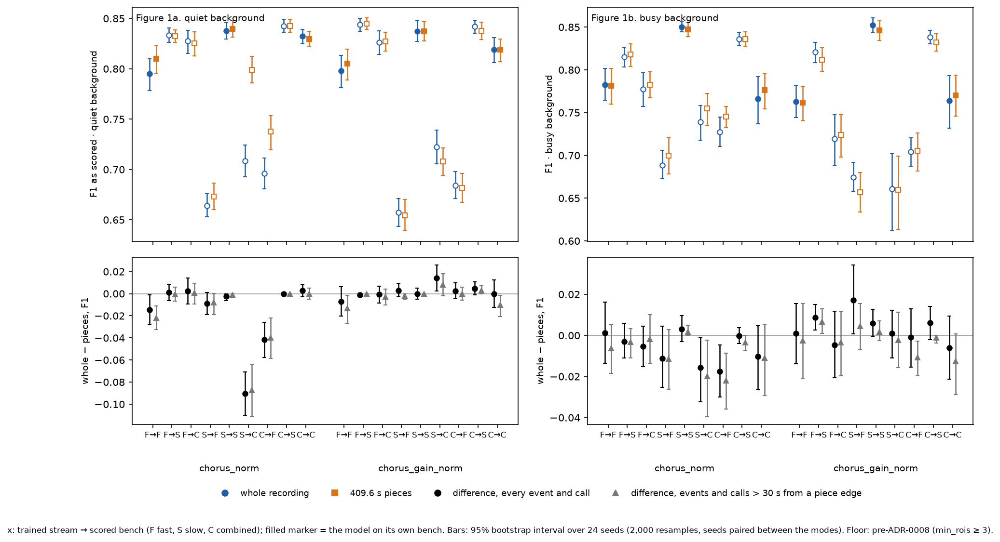
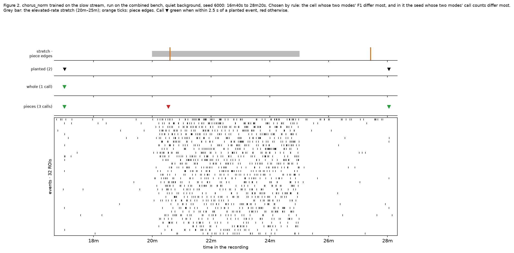

# chorus over the whole recording and over 409.6 s pieces: how much the span moves the calls

Run 2026-09-24 on WSMIP064, at Tony's request through the orchestrator: *"run the chorus variants
over 409.6s"*. `chorus_norm` and `chorus_gain_norm` standardise each cell's encoder output over
the span they are given. They were trained on 4,096-frame crops (409.6 s at 0.1 s frames), but they
run on a whole 2,700 s bench recording or on a whole real analysis window. This run measures what
that mismatch does. It retrains nothing and changes no detector or floor.

> **Floor: pre-ADR-0008.** The models were tuned with `min_rois` never below 3. ADR-0008's
> per-window floor on the bench waits on #793.

**Working material, not murderboarded. Nothing is adopted.**

## Method

- **Models.** Each training run's picked checkpoint, per stream, as recorded in
  [the overnight record](../2026-09-24-overnight-coact-chorus/candidates.json). That gives 2 models
  × 3 training streams = 6 checkpoints. Every checkpoint runs on all three benches, as the
  [3 × 3](../2026-09-24-cross-stream-3x3/README.md) did.
- **Two inference modes, same weights.**
  - **whole**: one `Trained.predict` over the recording's extent (bench) or the window (real data).
  - **pieces**: consecutive non-overlapping 409.6 s pieces, each predicted through `extent`, with
    the calls concatenated.
    - Pieces start at the start of the extent. A bench recording's extent begins at its first
      event, about 3 s in, so the first bench edge falls near 413 s rather than 409.6 s.
    - **The last piece is whatever remains, shorter than 409.6 s, and is predicted as it is**:
      nothing is padded, merged or dropped.
    - The encoder takes `floor(span / dt) + 1` frames, so neighbouring pieces share their one
      boundary frame.
- **Edge zones.** The model sees about ±27 s: 31 frames in the per-cell stack and 511 in the head,
  at 0.1 s frames. Everything within 30 s of an internal piece edge is an edge zone. Every bench
  result is scored twice:
  - over the whole recording;
  - **away from edges**: planted events and calls in an edge zone are left out of both modes.

  The whole − pieces difference that survives the second scoring comes from the span. The change
  between the two scorings is the edge effect. A bench recording has 6 internal edges, so the edge
  zones cover 360 s of its 2,700 s (13%).
- **Bench scoring**, as `tools/score_bench_candidates.py` does it:
  - seeds 6000–6023 per background, quiet and busy;
  - the no-coordination recording on seeds 56000–56011;
  - F1 as scored, and F1 with decoy calls left out of precision (ADR-0006);
  - recall and precision;
  - calls per minute inside the elevated-rate stretch (20m–25m);
  - calls per hour on the no-coordination recording.

  Each metric gets a bootstrap 95% interval over seeds: 2,000 resamples, with each seed's two
  modes resampled together, so the interval on the difference is paired.
- **Real data.** The 66 recordings of `2026-09-23_revised_2v_long_senktide_ttx_STEPS_AND_PINS_EXCLUDED`
  (`dataset.default()`, stamped in `results.json`). The run covers every analysis window and all
  three streams, each with its own stream's two models. For each mode it reports calls per hour,
  and the share of calls that match between the modes: onsets within the scorer's 2.5 s tolerance,
  paired one to one, closest first. Descriptive only.
- **Tools and cost.**
  - `tools/measure_chorus_context_span.py` ran 1,080 bench jobs and the 66 recordings in about
    245 s on 20 workers.
  - `tools/make_chorus_context_span_figures.py` draws the figures and `tables.md`.
  - The outputs are in the darkroom at `bugarach/2026-09-24-chorus-context-span/`, with a copy here.

## Figure 1: whole against pieces, every model × stream × bench

**Figure 1, whole against pieces.** Columns are the two backgrounds. Top row: F1 under each mode.
Bottom row: the whole − pieces difference, over everything (black) and away from edges (grey).

- **On the model's own bench, the span barely moves F1.**
  - In 11 of the 12 own-bench cells the difference's interval contains zero.
  - The exception is chorus_norm on fast, quiet: −0.015 [−0.028, −0.001].
- **Across benches, chorus_norm can lose a lot over the whole recording.**
  - Slow-trained, on the combined bench, quiet: −0.090 [−0.111, −0.070]. Recall falls from 0.911
    with pieces to 0.750 with the whole recording, while precision barely moves (0.711 and 0.672).
  - Combined-trained, on the fast bench, quiet: −0.042 [−0.058, −0.026], again mostly recall.
  - chorus_gain_norm's differences go the other way and are small: at most +0.017.
  - Overall, 8 of 36 cells have an interval that excludes zero: 5 favour pieces and 3 favour the
    whole recording.
- **The edge effect is small.** Leaving out the edge zones changes the difference by a median of
  0.003 F1 across the 36 cells, and by at most 0.013. Pieces make 2,612 calls in edge zones and
  whole makes 2,527, summed over every bench cell.

## Figure 2: one recording across the stretch and a piece edge

**Figure 2, one bench recording.** The run chose it by rule, not by eye: first the cell where the
two modes' F1 differ most (slow-trained chorus_norm on the combined bench, quiet), then the seed in
that cell where their call counts differ most (6000).

- The lanes above the raster show the elevated-rate stretch and the piece edges, the planted
  events, and each mode's calls. A call is green when it lies within 2.5 s of a planted event and
  red otherwise. Nothing is drawn on the raster.
- The whole-recording mode misses the planted event at 28m, and pieces recover it.
- Pieces add one false call at the piece edge inside the stretch, at 20m36s.

## The elevated-rate stretch

Calls per minute inside the stretch, whole · pieces, are in `tables.md`, together with the same
counts outside the edge zones.

- **Slow-trained chorus_norm**: pieces mode adds calls in the stretch, 0.16–0.21 per minute against
  0.00–0.07 over the whole recording. **All of them are at the piece edge**: outside the edge zones
  the two modes agree to within 0.01 per minute.
  - The edge zone removes about 1 minute of the 5-minute stretch. The away-from-edge rates are still
    divided by 5 minutes, so they read slightly low.
- **Combined-trained models**: a span effect remains away from the edge.
  - On the fast and combined benches, pieces call more in the stretch. For chorus_norm on fast,
    quiet, that is 0.14 against 0.02 per minute.
  - On the slow bench, pieces call less: for chorus_gain_norm, quiet, 0.73 against 1.02 per minute.
  - All of these differences have intervals clear of zero, except chorus_gain_norm on its own
    combined bench, quiet, where the interval touches zero ([−0.06, 0.00] calls per minute).

## The no-coordination recording

The whole-recording mode is never below pieces. Most cells are 0.00–0.11 calls per hour under both
modes; the largest are about 1 per hour, from the fast-trained models:

| model | trained on | scored on | whole | pieces | whole − pieces [95%] |
|---|---|---|---|---|---|
| chorus_norm | fast | combined | 1.22 | 0.44 | +0.78 [+0.33, +1.33] |
| chorus_gain_norm | fast | combined | 1.11 | 0.67 | +0.44 [+0.11, +0.78] |

These rates are in calls per hour. Twelve seeds give 9 hours per mode. Every other interval
contains zero or touches it at its lower bound.

## Real data: how well the modes agree

Pooled over groups, each model × stream × window kind:

- **Calls per hour differ by at most 2** between the modes, on rates of 17–62 per hour.
- **86.7–97.7% of either mode's calls have a partner in the other.** Agreement is lowest on the
  fast stream, 86.7–95.6%. It is 95.2–97.7% on the slow stream and 92.8–96.0% on the combined
  stream.

By group, in `tables.md`:

- **Agreement is lowest for OVX on the fast stream.** For chorus_norm it is 77.3% of whole calls on
  baseline windows and 84.5% on treatment windows.
- **Calls per hour move most there too.** On OVX treatment windows, fast stream, chorus_norm makes
  11.96 calls per hour whole and 16.28 in pieces.

Descriptive only: nothing here is a group comparison.

## Answering the question

- **F1.** Beyond seed noise in 8 of 36 cells, and in only 1 of the 12 own-bench cells (−0.015).
  The large moves are chorus_norm run off its own stream, where pieces recover recall that the
  whole recording loses (up to 0.090 F1).
- **Stretch calls.** For slow-trained chorus_norm, the extra stretch calls in pieces are all at the
  edge. For the combined-trained models, a span effect remains away from the edge, up to about
  0.3 calls per minute, and its direction depends on the bench.
- **No-coordination false alarms.** Whole is never below pieces, and exceeds it beyond noise only
  for the fast-trained models on the combined bench: +0.78 and +0.44 calls per hour.
- **Edge effect.** A median of 0.003 F1. It shows up as stretch calls at the edge, not as F1.
- **Real windows.** 87–98% of calls match between the modes, pooled over groups.

## Files

- `results.json`: every cell with its intervals, the per-window real-data rows and summary, the
  model paths, and the dataset stamp.
- `tables.md`: every bench cell, the no-coordination recording, and the real data by window kind
  and by group, in DI, OVX, MALE, ORX order.
- `fig1_whole_vs_pieces.png`, `fig2_example_raster.png`.
