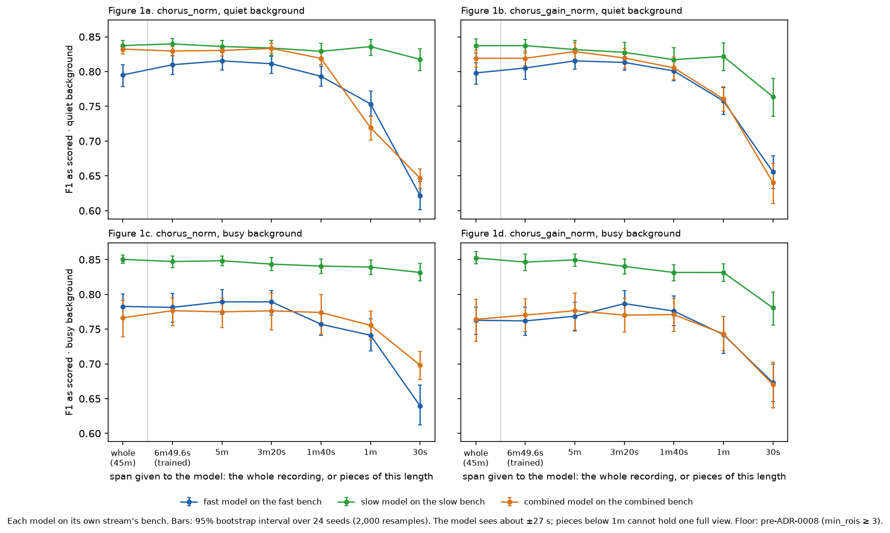
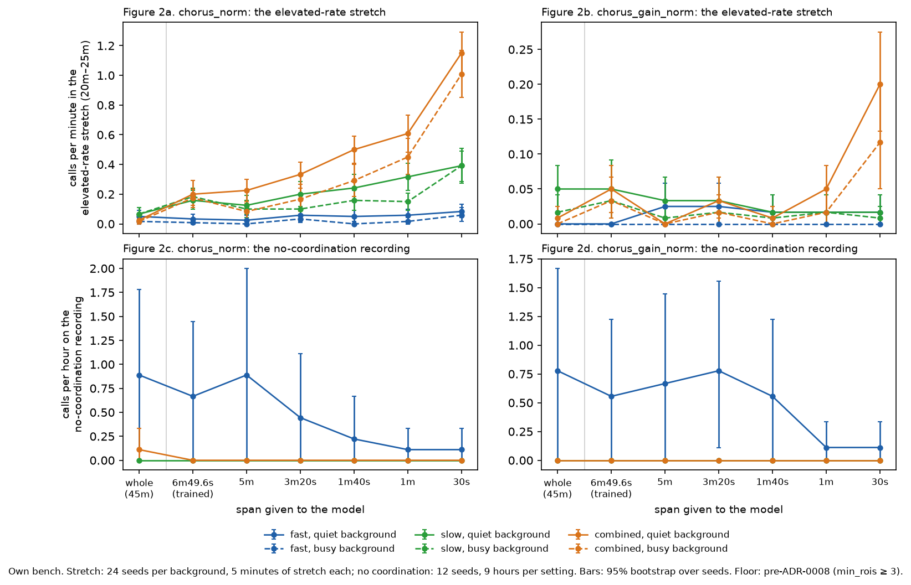
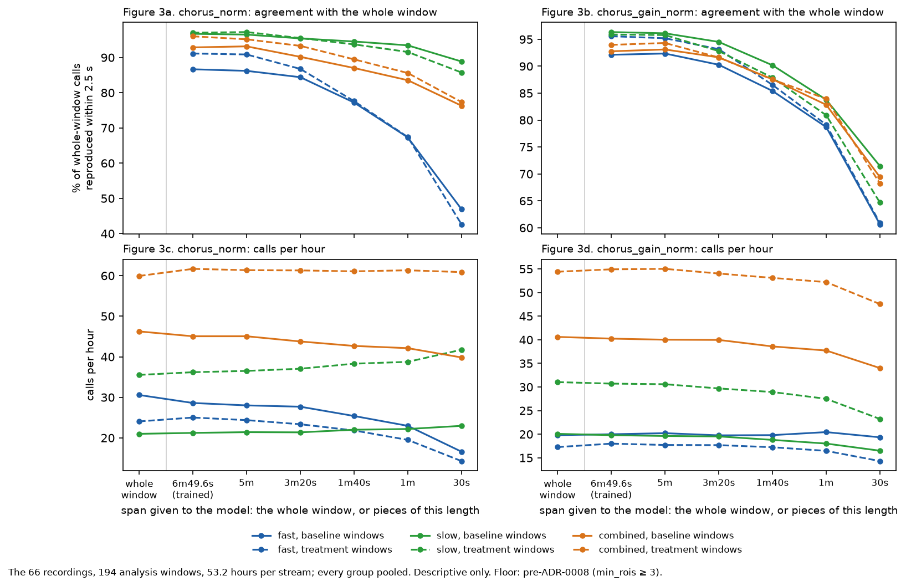

# How little chorus needs to see: the 409.6 s-trained models run over pieces down to 30 s

Run 2026-09-24 on WSMIP064, at Tony's request. After the
[context-span run](../2026-09-24-chorus-context-span/README.md) he asked *"what if we test how
little chorus needs to see? 400s is still pretty long, what about 300, 200, even 100 or less?"*,
then *"train it at 400, run it short"*. Nothing was retrained or changed.

> **Floor: pre-ADR-0008.** The models were tuned with `min_rois` never below 3. ADR-0008's
> per-window floor on the bench waits on #793.

**Working material, not murderboarded. Nothing is adopted.**

## The answer

| piece length | own bench: change in F1 from the whole recording | all 36 cells: pieces better · worse, beyond seed noise | real windows: whole-window calls reproduced |
|---|---|---|---|
| 409.6 s (the training crop) | −0.006 to +0.015 | 5 · 3 | 89–97% |
| 300 s (5m) | −0.006 to +0.020 | 9 · 3 | 89–97% |
| 200 s (3m20s) | −0.012 to +0.024 | 6 · 7 | 86–95% |
| 100 s (1m40s) | −0.026 to +0.013 | 1 · 17 | 77–94% |
| 60 s (1m) | −0.113 to −0.002 | 1 · 20 | 67–92% |
| 30 s | −0.186 to −0.019 | 0 · 28 | 45–87% |

- **Down to 200 s, nothing is lost.** On each model's own bench, F1 stays within about 0.02 of the
  whole recording in either direction.
  - The fast-trained models even gain a little: chorus_norm on fast, quiet, is +0.016 at 200 s.
- **100 s costs little.** The worst own-bench cell loses 0.026 F1 (chorus_norm on fast, busy).
- **60 s is where it breaks**, except for the slow stream.
  - The fast and combined models lose 0.02–0.11 F1.
  - Slow chorus_norm holds to within 0.011 at 60 s.
- **30 s fails.** Losses are 0.02–0.19 F1. A 30 s piece is shorter than the model's own view of
  about ±27 s.

## Method

- **Models.** The six picked checkpoints from the
  [overnight training](../2026-09-24-overnight-coact-chorus/candidates.json): chorus_norm and
  chorus_gain_norm × fast, slow and combined, all trained on 409.6 s crops. Each runs on all three
  benches.
- **Settings, same weights.**
  - **whole**: one prediction over the recording's extent (bench) or the window (real).
  - **Pieces** of 409.6, 300, 200, 100, 60 and 30 s: consecutive and non-overlapping from the start
    of the extent, each predicted through `extent`, with the calls concatenated.
    - The last piece is whatever remains and is predicted as it is.
    - Every piece is standardised over its own span, so a short piece is normalised against few
      events.
- **This is not a causal or real-time test.** Inside every piece the model still looks up to 27 s
  ahead. Shorter pieces limit how much the model sees in total, not which direction it looks.
- **Scoring covers everything, edges included.** Below 60 s every call is within 30 s of a piece
  edge, so the context-span run's away-from-edge scoring would have nothing left to score. The
  scoring is `tools/score_bench_candidates.py`'s:
  - seeds 6000–6023 per background, quiet and busy;
  - the no-coordination recording on seeds 56000–56011;
  - F1 as scored and without decoys (ADR-0006), recall, precision;
  - calls per minute in the elevated-rate stretch (20m–25m);
  - calls per hour on the no-coordination recording.

  Each metric has a bootstrap 95% interval over seeds, 2,000 resamples, and a paired interval on
  its difference from whole.
- **Real data.** The 66 recordings of `2026-09-23_revised_2v_long_senktide_ttx_STEPS_AND_PINS_EXCLUDED`
  (`dataset.default()`, stamped): 194 analysis windows, 53.2 hours per stream, each stream with its
  own models. For each setting the run reports calls per hour and the share of whole-window calls
  it reproduces: onsets within 2.5 s, paired one to one. Descriptive only.
- **Tools and cost.**
  - `tools/measure_chorus_span_sweep.py` reuses the context-span tool's piece and matching helpers.
    It ran 1,080 bench recordings × 7 settings and the 66 recordings in 890 s on 20 workers.
  - `tools/make_chorus_span_sweep_figures.py` draws the figures and `tables.md`.
  - The outputs are in the darkroom at `bugarach/2026-09-24-chorus-span-sweep/`, with a copy here.

## Figure 1: F1 against piece length

**Figure 1, F1 against piece length**, each model on its own stream's bench.

- The fast-stream (blue) and combined-stream (orange) models are flat to 200 s, dip at 100 s, and
  fall away at 60 s and 30 s.
- The slow-stream model (green) stays flat to 60 s.
  - For chorus_norm it holds even at 30 s: 0.818 against 0.838 on the quiet background.
- The whole-recording point (left) is not the best on every panel. The fast models score higher on
  pieces from 409.6 s to 200 s.

## Figure 2: the elevated-rate stretch and the no-coordination recording

**Figure 2, the stretch and the no-coordination recording.**

- **chorus_norm makes more stretch calls as pieces shorten** (Figure 2a).
  - The combined model goes from 0.02–0.03 calls per minute on the whole recording to 0.45–0.61 at
    60 s and 1.0–1.15 at 30 s.
  - The slow model goes from 0.07 to 0.39 per minute at 30 s.
  - A short piece that falls inside the stretch is standardised against the stretch alone.
- **chorus_gain_norm is flat, at 0.05 per minute or less, down to 60 s** (Figure 2b). Only its
  combined model rises at 30 s, to 0.12–0.20.
- **On the no-coordination recording, shorter pieces call less, not more** (Figures 2c and 2d).
  - The two fast-trained models fall from 0.78–0.89 calls per hour on the whole recording to 0.11
    at 60 s. The intervals are wide: 12 seeds, 9 hours per setting.
  - The slow and combined models are at 0.00–0.11 per hour at every length.

## Figure 3: the real windows

**Figure 3, the real windows.**

- **Top: the share of whole-window calls that each piece length reproduces.**
  - chorus_gain_norm keeps 86–89% at 100 s on every stream.
  - chorus_norm on the fast stream falls fastest: 77% at 100 s, 67% at 60 s, 45% at 30 s.
- **Bottom: calls per hour barely move down to 100 s.** At 30 s they fall on most streams: fast
  chorus_norm goes from 26.7 to 15.2 calls per hour. Slow chorus_norm is the exception and rises,
  from 29.6 to 34.0.
- Treatment windows (dashed) track baseline windows (solid) throughout.
- Groups are in `tables.md`, in DI, OVX, MALE, ORX order.

## What this does and does not say about a real-time model

- **It says** a model trained on 409.6 s crops keeps its bench F1 on 200 s pieces, and nearly keeps
  it on 100 s pieces. It needs one to two minutes of context, not seven.
- **It does not say** the model can run causally. Every call here still had up to 27 s of look-ahead
  inside its piece.
  - A real-time test needs the model to call an event from data up to that event only. That means
    a causal (left-padded) head, or a delay equal to its look-ahead, and a model trained that way.
  - That would be new training. It was not part of this request.

## Files

- `results.json`: every cell at every setting, with intervals and paired differences; the
  per-window real rows and summary; the dataset stamp; the model paths, relative to the darkroom.
- `tables.md`: every cell.
- `fig1_f1_by_piece_length.png`, `fig2_stretch_and_null.png`, `fig3_real_agreement.png`.
