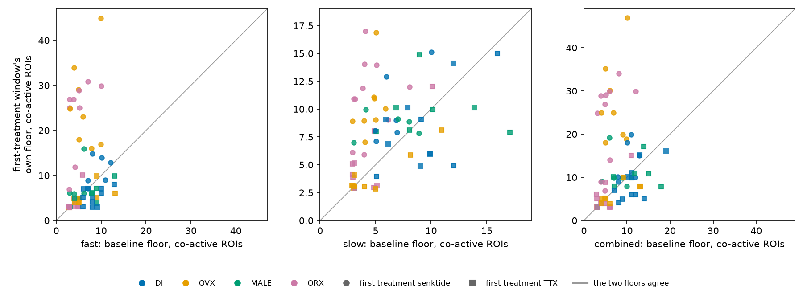
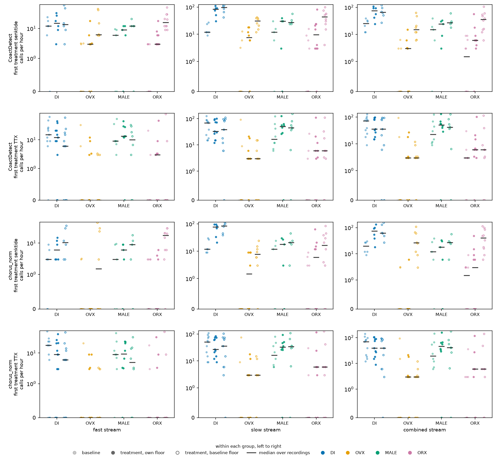

# Overnight 2026-09-24: CoactDetect and chorus on the 66 recordings, every window under its own floor and its baseline's

Run on WSMIP064, 02:43–02:49 UTC, at Tony's request through the orchestrator. This is Phase 3 of
the overnight brief, the detection run on the new dataset. The detectors are those tuned and
trained in Phase 2 ([run record](../2026-09-24-overnight-coact-chorus/README.md)).

**Working material, not murderboarded.** It measures, and nothing is adopted or concluded about the
preparation.

**Dataset:** `2026-09-23_revised_2v_long_senktide_ttx_STEPS_AND_PINS_EXCLUDED` (role
`senktide_ttx`, the default on `main`): 66 recordings, 36 mice. **Confirmed by Tony in this
session.** Every recording in the folder ran and none failed. `results.json` carries
`dataset.stamp()`.

**Tool:** `tools/detect_with_floors.py` (new). Figures come from `tools/make_detect_floors_figure.py`.

**Files:**
- In this folder: `windows.csv`, one row per recording × window × stream × detector × variant, with
  its floors and calls per hour; `results.json`.
- In Dropbox, with the per-call table (`calls/`, 22,661 calls, left out of the repo as bulk):
  `<darkroom>/bugarach/runs/2026-09-24-detect-66-floors/`.

## What ran

- **Windows.** Every analysis window the folder declares, 2.9 per recording on average: the
  baseline and each treatment period, as `bugarach detect` scores them.
  - Each recording's **first treatment** is its first non-baseline window: TTX in 37 recordings,
    senktide in 29.
  - All three streams: fast, slow and combined.
- **Floors** (ADR-0008, `bugarach.event_floor`, #794):
  - For every window and stream, the larger of 3 ROIs and the window's chance floor: 1 call per
    hour under the per-ROI rigid shift, *J* = 20 s, a 2 s window, 1,000 draws.
  - 582 window-stream floors in all. 44 differ by 1 ROI between the two halves of the draws.
  - The **baseline floor** of a window is the same recording's baseline floor carried over. On a
    baseline window it equals the window's own.
- **CoactDetect**, at the setting Phase 2 chose per stream:
  - fast: the search's proposal (sliding, alpha 1e-5, 120 s context, 8 s merge gap);
  - slow and combined: the shipped points.

  It ran three ways:
  - `tuned`, at the setting's own `min_rois`, the stop-gap, **pre-ADR-0008 floor**;
  - `own_floor`, with `min_rois` set to the window's floor;
  - `baseline_floor`.
- **chorus_norm** and **chorus_gain_norm**, the checkpoint Phase 2 picked per stream, run once per
  window.
  - Each call's **participants** are the ROIs with an onset inside the call, the call widened to
    2 s when it is shorter.
  - Each call is then kept or not under each floor. That is ADR-0008's "only the scoring of
    treatment windows runs twice, and that reuses the same trained models".

A detector's calls per hour are quantised by the window's length. In a 20-minute window one call is
3 calls per hour.

## Figure 1, the floors



**Figure 1.** For each recording, its first-treatment window's own floor against its baseline floor,
in co-active ROIs, one panel per stream. Colour is group, and marker is the first treatment
(circle senktide, square TTX). On the diagonal the two floors agree.

**Senktide raises the floor, and by far the most in OVX and ORX.** Median floor, baseline → first
treatment:

| stream | DI | OVX | MALE | ORX |
|---|---|---|---|---|
| senktide, fast | 9 → 11 | **6 → 24** | 5 → 6 | **4 → 26** |
| senktide, slow | 6 → 8 | 5 → 10 | 7 → 9 | 4 → 12 |
| senktide, combined | 10 → 12 | **6 → 25** | 7 → 10 | **5 → 28** |
| TTX, fast | 8 → 5 | 5 → 5 | 8 → 6 | 4 → 3 |
| TTX, slow | 9 → 7 | 3 → 3 | 8 → 9 | 3 → 4 |
| TTX, combined | 11 → 7 | 5 → 5 | 12 → 10 | 5 → 4 |

Recordings per cell, senktide: DI 6, OVX 8, MALE 5, ORX 10. TTX: DI 11, OVX 9, MALE 8, ORX 9.

Under TTX the floors stay where they were or fall.

## Figure 2, what each floor does to the calls



**Figure 2.** Calls per hour, one mark per recording.
- Rows: CoactDetect and chorus_norm, each for recordings whose first treatment was senktide and
  for those where it was TTX.
- Columns: the three streams.
- Within each group, left to right: baseline at its own floor; the first treatment at its own
  floor; the first treatment at the baseline floor.
- Bar: median. Axis: logarithmic above 1 call per hour, linear below.

**Median calls per hour, fast stream, CoactDetect:**

| first treatment | group | baseline | treatment, own floor | treatment, baseline floor |
|---|---|---|---|---|
| senktide | DI | 12.0 | 15.0 | 13.5 |
| senktide | OVX | 0.0 | 3.0 | 6.2 |
| senktide | MALE | 6.0 | 9.0 | 12.0 |
| senktide | ORX | 0.0 | 3.0 | **16.0** |
| TTX | DI | 15.0 | 12.0 | 6.0 |
| TTX | OVX | 0.0 | 0.0 | 0.0 |
| TTX | MALE | 9.0 | 13.3 | 10.0 |
| TTX | ORX | 0.0 | 3.0 | 0.0 |

**Where the two floors disagree, they disagree about senktide in OVX and ORX:**

| stream, detector | ORX, own floor | ORX, baseline floor | OVX, own floor | OVX, baseline floor |
|---|---|---|---|---|
| slow, CoactDetect | 9.5 | 43.5 | 7.5 | 30.6 |
| combined, CoactDetect | 6.0 | 36.0 | 3.0 | 15.0 |
| combined, chorus_norm | 3.0 | 40.5 | 0.0 | 26.1 |

Counted at the baseline floor, senktide looks like a large rise in coordinated events in those two
groups. Counted at the treatment window's own floor, most of that rise is gone. This is the
comparison ADR-0008 decision 4 asked for, "so we can compare". **Which reading is the right one is
not this record's to say**: FOUNDATIONS §9 says senktide raises event rate, and a treatment's
effect is `fireflies`' question, not this repository's.

**Under TTX the two floors give nearly the same counts on every stream**, because the floors
themselves barely move.

**CoactDetect and chorus_norm move the same way** between the two floors in every group, treatment
and stream of Figure 2. Their levels differ from cell to cell. For example, at baseline on fast,
chorus_norm makes fewer calls than CoactDetect in the senktide-first DI recordings (median 3.0
against 12.0 calls per hour) and more in the TTX-first ones (18.0 against 15.0).

## What limits the reading

- **The bench tuning under these detectors is pre-ADR-0008** (Phase 2), and ADR-0008's floor on the
  bench waits on two questions (#793). The `own_floor` and `baseline_floor` rows apply ADR-0008 on
  real windows. The `tuned` rows are the stop-gap.
- **Medians over 5–11 recordings a cell, no intervals, no test.** This is a description of one run,
  and group is nested in imaging day (34 dates, none with two groups).
- **Chorus's participants are counted, not reported by the model.** The rule is the onsets inside
  the call widened to 2 s. Another rule would move the floored chorus counts.
- **44 of 582 floors are unstable by 1 ROI** across halves of the draws.
- **Nothing is filtered.** A window with no calls is a zero, not a missing value.

## Reproduce

```
python tools/detect_with_floors.py --candidates <phase2>/candidates/candidates.json \
    --models <phase2> --out ~/runs/2026-09-24-detect-66-floors --workers 20 --draws 1000
python tools/make_detect_floors_figure.py --run ~/runs/2026-09-24-detect-66-floors --out <folder>
python tools/archive_run.py ~/runs/2026-09-24-detect-66-floors --name 2026-09-24-detect-66-floors --to-repo --bulk calls
```

`<phase2>` is `<darkroom>/bugarach/2026-09-24-overnight-floor-coact-chorus/phase2/`. It holds the
chosen checkpoints and `candidates.json`, and the repo copy of `candidates.json` is in the Phase 2
record. The default dataset must be confirmed first, by Tony.
