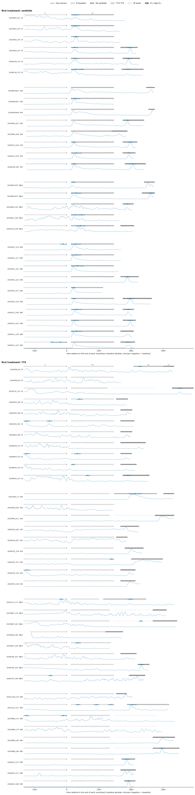
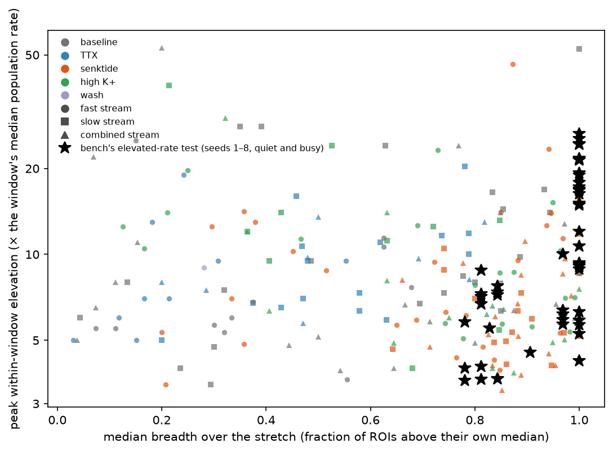
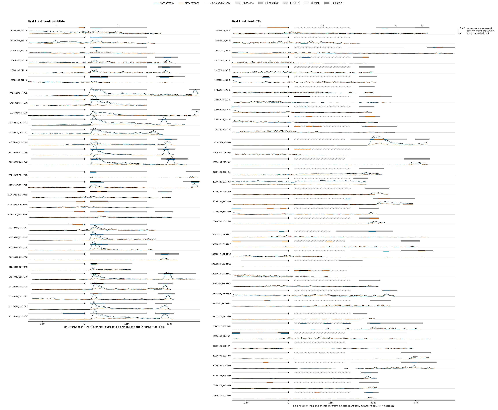

# Elevated-rate stretches in the 66 recordings: in which windows, and which groups

Run 2026-09-24 on WSMIP064, for the orchestrator at Tony's request. **This is a measurement and it
decides nothing.** It proposes no amendment to ADR-0008's floor rule and no change to the bench.

## Tony's three questions

1. **Are there elevated-rate stretches in the real recordings?** Yes.

   A stretch here is at least 2 minutes at 3× or more the window's own median population rate.

   | window type | recordings with a stretch, fast stream | stretches per hour |
   |---|---|---|
   | baseline | 8 of 66 | 0.50 |
   | TTX | 7 of 37 | 0.76 |
   | senktide | 26 of 33 | 2.59 |
   | high K⁺ | 20 of 50 | 3.19 |

2. **Where are they found?**
   - **In every window type**, but mostly in senktide and high K⁺. Baseline and TTX have few,
     at similar rates to each other.
   - **Senktide stretches look like the bench's.** They are broad (median breadth 0.77 on fast: most
     ROIs above their own median at once) and long (median 225 s). In the GDX senktide windows, 13
     of 20 start within the first two minutes, at the onset of the drug.
   - **Baseline and TTX stretches are shorter and narrower.** On fast the median duration is 170 s
     at baseline and 160 s under TTX, with median breadth 0.33 and 0.18. A few ROIs carry them.
   - **Only baseline is admissible for the bench** (FOUNDATIONS §9). Its stretches are 120–350 s
     long, 3.5–53× the window's median, and 14 of 51 (across three streams) are as broad as the
     bench's (median breadth at least 0.8).
3. **Which groups have them?**
   - **All four, in every window type** (tables below).
   - **At baseline, fast stream:** DI 2 of 17 recordings, OVX 1 of 17, MALE 2 of 13, ORX 3 of 19.
   - **In senktide windows, fast stream:** DI 7 of 7 recordings, OVX 5 of 9, MALE 5 of 6, ORX 9
     of 11.

**The known GDX senktide period.** The fixed measure finds it: a stretch at senktide onset in 13 of
the 20 OVX and ORX senktide windows on fast, starting within 2 minutes of the window's start and
lasting 120–370 s:

> 20240814a47, 20241212_131, 20250911_214, 20250911_217, 20250911_222, 20250912_227, 20250912_229,
> 20260115_240, 20260115_243, 20260121_250, 20260122_256, 20260122_259, 20260226_285.

- One more has a stretch later in the window: 20241002_72, starting 410 s in.
- Six have none at *k* = 3: 20240813b42, 20240814b49, 20250829_207, 20250904_209, 20250912_225,
  20260121_252. Their peaks are 2.1–4.7× the window median, either below *k* = 3 or above it for
  less than 2 minutes. The onset rise is visible in their rows of Figure 1a.
- The full list is in the GDX table below, with slow and combined.
- It was **reported, not used**: no setting was chosen or changed to catch it.

## The definitions were fixed before the data were read

The definitions are the orchestrator's brief of 2026-09-24 12:24 UTC, taken without change. They
are implemented in `tools/measure_rate_stretches.py` at commit **`40fb417`**.

- **Population rate:** onsets per ROI per second in a sliding window, stepped by 10 s. The primary
  window is 60 s; 30 s and 120 s are the check.
- **Elevation**, two ways, never mixed:
  - **within-window:** the population rate ÷ the same window's median population rate;
  - **against baseline:** ÷ the same recording's baseline-window median, same stream and width.
- **Breadth:** at each position, the fraction of the window's ROIs whose own rate there is above
  their own median over the window.
- **A stretch:** a contiguous run of positions with within-window elevation ≥ *k*, lasting at least
  120 s. *k* = 2, 3 and 5, side by side.
  - ⚠ One reading was mine: duration runs from the first position's start to the last position's
    end, i.e. last start − first start + the window width. With it, the bench's 300 s stretch reads
    as 335–385 s at 60 s.
  - Per stretch: start, duration, peak elevation both ways, median breadth.
- **A window whose median population rate is zero** has no within-window elevation, and so no
  stretch. It is counted, not given one. There are 34 such window-streams, mostly sparse ORX,
  MALE and OVX baseline and TTX windows, so **the measure is blind in the sparsest windows**.
- **Data read:** every analysis window the folder declares, on fast, slow and combined.
  - The 66 recordings give 582 window-streams.
  - Window types come from the folder's own labels: baseline, TTX, senktide, high K⁺, wash.
  - Nothing was filtered.

⚠ **Disclosure.** After the brief and before writing the tool, I looked once at the fast
population rate in the 20 GDX senktide windows, at the brief's own settings (60 s, 10 s), to see
whether the known period was there. That look changed no setting: every setting above is the
brief's. Tony's correction arrived after it ("it might be dangerous to tune the elevated rate
detector on the known effect of senktide"), and nothing needed reverting.

**Dataset:** `2026-09-23_revised_2v_long_senktide_ttx_STEPS_AND_PINS_EXCLUDED`, the default: 66
recordings, 36 mice, confirmed by Tony in this session. `results.json` in the darkroom carries
`dataset.stamp()`. Run time 105 s, 22 workers.

## The check at 30 s and 120 s

Recordings with a stretch at *k* = 3, fast stream, by window width:

| window type | 30 s | 60 s | 120 s |
|---|---|---|---|
| baseline | 6 | 8 | 15 |
| TTX | 1 | 7 | 12 |
| senktide | 19 | 26 | 28 |
| high K⁺ | 10 | 20 | 12 |

**The counts depend on the width**, and so does part of the ordering:
- A wider window smooths the rate and lets slower, milder rises cross *k* over two minutes; a
  narrower one is noisier around the median.
- **Senktide carries the most stretches at every width.** Its 19–28 recordings stay above the
  other window types at 30 s, 60 s and 120 s.
- The rest reorder. At 30 s and 60 s high K⁺ is second; at 120 s baseline (15) passes it (12)
  and TTX draws level with it (12).
- So "baseline has few stretches" holds at 30 s and 60 s but not at 120 s.

## Figure 1, population rate in every recording



**Figure 1a.** Population rate in every recording, fast stream, aligned at baseline end.

**Figure 1b.** The same, slow stream ([fig1_slow_population_rate.png](fig1_slow_population_rate.png)).

**Figure 1c.** The same, combined stream
([fig1_combined_population_rate.png](fig1_combined_population_rate.png)).

In all three:
- **Rows:** one per recording, grouped by first treatment (senktide, then TTX, each block labelled
  at its left), then by group (DI, OVX, MALE, ORX). There is a gap between groups and a larger one
  between the blocks.
- **Time axis:** **time relative to the end of that recording's baseline window, in minutes.**
  - 0 is baseline end, so the first treatment starts at the same horizontal place in every row.
  - Negative time is baseline.
  - The axis is shared by every row but drawn only under the last row of each first-treatment
    block, with the repository's 60-base ticks.
- **Trace:** the population rate, onsets per ROI per second, 60 s window stepped by 10 s, each row
  on its own scale.
  - **The curve is continuous over the whole recording**, including the gaps between analysis
    windows. The export's events cover the full recording.
  - The lane shows the analysis windows, from which every tabled value is extracted.
  - Stretches are still detected per window, against that window's own median, so the stretch bars
    and every number in this record are unchanged.
- **Lane above each trace**, a thin strip:
  - the analysis windows in neutral greys (baseline light, senktide mid, high K⁺ dark, TTX hatched,
    wash near-white);
  - t = 0, as a black tick;
  - every *k* = 3 stretch, as a bar with a ▼ pointing down, in the stream's colour.
- **Window names** (B, SK, TTX, K+, W) are written only on the first row of each block. Below it
  the grey tones identify the windows, with a key in the legend (TTX hatched).
- **Each lane sits directly on its own trace**, and a wider gap separates one recording from the
  next.
- Nothing is drawn on the trace.

Aligned at baseline end on Tony's request, and laid out as he asked on 2026-09-24 (thin lane,
names only where the treatment changes, one axis per block). The measurement did not change.

## Figure 2, how large and how broad



**Figure 2.** Every real stretch at *k* = 3, 60 s: peak within-window elevation (× the window's
median population rate, log scale) against median breadth. Colour is the window type, and the
marker is the stream. The black stars are the bench's elevated-rate test, measured by the same
code on bench seeds 1–8, quiet and busy.

- **The bench's stretch sits in one corner:** breadth 0.8–1.0, elevation 4–27×.
- **Real senktide and high K⁺ stretches reach that corner.**
- **Real baseline and TTX stretches mostly do not.** They spread across every breadth, and the
  narrow ones are a few ROIs rising.

## Figure 3, the three streams on one scale



**Figure 3.** Population rate of the fast, slow and combined streams, superimposed, in every
recording, all on one y-scale, drawn as a hidden-line waterfall at twice the gain of a fitted scale.
- **Streams:** fast in blue (#0072B2), slow in vermillion (#D55E00), combined in black. Combined
  is every fast and slow onset of an ROI as one train.
- **Unit:** onsets per ROI per second, in a 60 s window stepped by 10 s.
- **Continuous curves:**
  - Each curve runs over the whole recording, including the gaps between analysis windows.
  - The lane shows the analysis windows, from which the tabled values are extracted.
  - Stretches are detected per window, as in the run.
  - The curves are cached beside `results.json` in the darkroom folder as `full_curves.json`,
    stamped with the dataset.
- **One shared scale, gain ×2, as a waterfall:**
  - **One row height is 0.23 onsets per ROI per second**, the same in every row, shown by the one
    reference bar at the top right.
  - A trace that exceeds it runs up into the rows above. Nothing is clipped and no row is rescaled.
  - The largest peak, 0.452 (20260122_259, combined stream, inside its senktide window, not in a
    gap), reaches about two row heights (1.97).
  - The median recording peaks at about 0.11, half a row.
- **Hidden-line drawing:**
  - Rows are drawn from the top down, and each row's traces sit on a white fill from the row's
    baseline up to the highest of its three curves. So a lower row's peak covers what lies behind
    it in the rows above, instead of tangling with it.
  - Within a row the traces are drawn over the window lane, so a peak that crosses its own lane
    stays visible.
  - A faint grey line marks each row's zero.
- **Rows that overrun:**
  - 14 rows peak above one row height, and none reaches two:
    20260122_259 (1.97 rows), 20250829_207 (1.96), 20240814a47 (1.91), 20260226_285 (1.82),
    20260121_252 (1.78), 20241002_72 (1.73), 20250911_222 (1.68), 20250911_217 (1.67),
    20240813b42 (1.46), 20260115_240 (1.42), 20260121_250 (1.40), 20250912_229 (1.38),
    20250904_209 (1.30), 20260115_243 (1.05).
  - All but 20241002_72 peak in the senktide block, most at senktide onset. There the white fill
    of each row covers the peak-free stretches of the row above for up to about one row. The gain
    was not changed.
- **Time axis:** time relative to the end of each recording's baseline window, in minutes; 0 is
  baseline end, and negative time is baseline. It is drawn only under the last row of each
  first-treatment block.
- **Rows:** grouped by first treatment (senktide, then TTX, each block labelled at its left), then
  by group (DI, OVX, MALE, ORX), with a gap between groups and a larger one between the blocks.
- **Two columns** (Tony, 2026-09-24: the TTX rows in a second column):
  - **Left column:** the recordings with no TTX window, the 29 senktide-first recordings.
  - **Right column:** every recording with a TTX window, the 37 TTX-first recordings. None of the
    66 has both senktide first and a TTX window.
  - Both columns use the same scale: one row height is 0.23 onsets per ROI per second, and 400 s
    of recording is one inch. So equal durations have equal widths, and one reference bar serves
    both.
  - Each column has its own time axis under its block, with the same tick interval.
  - The figure is 26.5 × 21.8 inches.
- **Windows in the lane are neutral**, so the three colours belong to the streams alone:
  - baseline light grey, senktide mid grey, high K⁺ dark grey, TTX hatched light grey, wash
    near-white;
  - their names are written only on the first row of each block, and a key in the legend
    identifies the grey tones below it.

  Figures 1a–c use the same lane.
- **Lane above each trace**, a thin strip: the analysis windows, t = 0 (black tick), and every stretch as a bar
  with a ▼ pointing down, in its stream's colour on its own track (fast lowest, then slow, then
  combined). A stretch is at least 2 minutes at *k* = 3 or more times the window's median
  population rate, 60 s window. Nothing is drawn on the traces.

The repo copy is `docs/learned/runs/2026-09-24-elevated-rate-stretches/fig3_three_streams_one_scale.png`.
The darkroom copy is in `bugarach/2026-09-24-elevated-rate-stretches/`. Tony asked for this figure
on 2026-09-24, and it is drawn from the same `results.json` as Figures 1 and 2.

## Tables

The first section is baseline only, **the only admissible source for anything that shapes the
bench** (FOUNDATIONS §9). The second, TTX, senktide, high K⁺ and wash, is **descriptive only and
must not be read as calibration**.
- "Stretches per hour" is per hour of that window type.
- Durations are in seconds, elevations are × the window median, and breadth is a fraction of ROIs.
- The floor table compares ADR-0008's floor over the whole window with the floor once that window's
  *k* = 3 stretches are cut out and the rest joined (`bugarach.event_floor`, 1,000 draws). It lists
  only windows that have a stretch.

### BASELINE windows only: the only admissible source for anything that shapes the bench (FOUNDATIONS §9)

#### fast stream, 60 s window

| window type | group | windows | recordings with a stretch, k = 2 / 3 / 5 | stretches per hour, k = 2 / 3 / 5 | median duration, s, k = 3 | median peak elevation, ×, k = 3 | median breadth, k = 3 |
|---|---|---|---|---|---|---|---|
| baseline | DI | 17 | 7 / 2 / 2 | 1.41 / 0.53 / 0.35 | 170 | 7.7 | 0.62 |
| baseline | OVX | 17 | 3 / 1 / 1 | 1.07 / 0.18 / 0.18 | 190 | 10.6 | 0.62 |
| baseline | MALE | 13 | 4 / 2 / 0 | 0.94 / 0.47 / 0.00 | 120 | 4.7 | 0.43 |
| baseline | ORX | 19 | 6 / 3 / 1 | 1.27 / 0.80 / 0.16 | 170 | 5.5 | 0.15 |
| baseline | all | 66 | 20 / 8 / 4 | 1.19 / 0.50 / 0.18 | 170 | 6.0 | 0.33 |

#### slow stream, 60 s window

| window type | group | windows | recordings with a stretch, k = 2 / 3 / 5 | stretches per hour, k = 2 / 3 / 5 | median duration, s, k = 3 | median peak elevation, ×, k = 3 | median breadth, k = 3 |
|---|---|---|---|---|---|---|---|
| baseline | DI | 17 | 8 / 3 / 2 | 2.47 / 0.88 / 0.71 | 160 | 9.8 | 0.85 |
| baseline | OVX | 17 | 3 / 2 / 0 | 0.89 / 0.71 / 0.00 | 130 | 5.4 | 0.49 |
| baseline | MALE | 13 | 6 / 6 / 4 | 2.81 / 1.88 / 0.94 | 165 | 8.2 | 0.68 |
| baseline | ORX | 19 | 5 / 4 / 2 | 1.75 / 0.95 / 0.48 | 130 | 13.0 | 0.42 |
| baseline | all | 66 | 22 / 15 / 8 | 1.93 / 1.05 / 0.50 | 140 | 8.4 | 0.74 |

#### combined stream, 60 s window

| window type | group | windows | recordings with a stretch, k = 2 / 3 / 5 | stretches per hour, k = 2 / 3 / 5 | median duration, s, k = 3 | median peak elevation, ×, k = 3 | median breadth, k = 3 |
|---|---|---|---|---|---|---|---|
| baseline | DI | 17 | 5 / 2 / 0 | 1.06 / 0.53 / 0.00 | 130 | 5.8 | 0.71 |
| baseline | OVX | 17 | 3 / 1 / 0 | 0.71 / 0.18 / 0.00 | 170 | 6.7 | 0.67 |
| baseline | MALE | 13 | 8 / 4 / 1 | 1.88 / 0.94 / 0.23 | 140 | 5.0 | 0.72 |
| baseline | ORX | 19 | 7 / 5 / 5 | 2.71 / 1.43 / 0.80 | 160 | 11.0 | 0.15 |
| baseline | all | 66 | 23 / 12 / 6 | 1.60 / 0.78 / 0.28 | 150 | 6.5 | 0.54 |

### Treatment and control windows: DESCRIPTIVE ONLY, not calibration

#### fast stream, 60 s window

| window type | group | windows | recordings with a stretch, k = 2 / 3 / 5 | stretches per hour, k = 2 / 3 / 5 | median duration, s, k = 3 | median peak elevation, ×, k = 3 | median breadth, k = 3 |
|---|---|---|---|---|---|---|---|
| TTX | DI | 11 | 7 / 4 / 2 | 3.59 / 1.11 / 0.55 | 150 | 6.5 | 0.18 |
| TTX | OVX | 9 | 2 / 1 / 0 | 0.68 / 0.34 / 0.00 | 130 | 9.5 | 0.31 |
| TTX | MALE | 8 | 4 / 1 / 0 | 2.51 / 0.42 / 0.00 | 160 | 7.0 | 0.17 |
| TTX | ORX | 9 | 4 / 1 / 1 | 2.79 / 1.05 / 0.70 | 160 | 13.0 | 0.18 |
| TTX | all | 37 | 17 / 7 / 3 | 2.46 / 0.76 / 0.34 | 160 | 7.0 | 0.18 |
| senktide | DI | 7 | 7 / 7 / 3 | 3.58 / 3.58 / 1.34 | 190 | 5.8 | 0.67 |
| senktide | OVX | 9 | 9 / 5 / 2 | 3.35 / 1.68 / 0.67 | 250 | 5.3 | 0.96 |
| senktide | MALE | 6 | 6 / 5 / 4 | 3.50 / 3.00 / 2.50 | 210 | 9.8 | 0.36 |
| senktide | ORX | 11 | 10 / 9 / 7 | 3.36 / 2.52 / 1.96 | 270 | 11.4 | 0.87 |
| senktide | all | 33 | 32 / 26 / 16 | 3.43 / 2.59 / 1.58 | 225 | 7.8 | 0.77 |
| high K+ | DI | 13 | 7 / 5 / 5 | 4.74 / 2.96 / 2.96 | 160 | 15.2 | 0.25 |
| high K+ | OVX | 15 | 5 / 4 / 1 | 2.67 / 2.13 / 0.53 | 140 | 6.2 | 0.97 |
| high K+ | MALE | 10 | 4 / 3 / 2 | 3.47 / 2.61 / 1.74 | 140 | 8.6 | 0.85 |
| high K+ | ORX | 12 | 9 / 8 / 6 | 5.80 / 5.16 / 3.87 | 160 | 8.2 | 0.83 |
| high K+ | all | 50 | 25 / 20 / 14 | 4.15 / 3.19 / 2.23 | 160 | 9.5 | 0.82 |
| wash | DI | 1 | 1 / 0 / 0 | 3.00 / 0.00 / 0.00 | – | – | – |
| wash | OVX | 1 | 0 / 0 / 0 | 0.00 / 0.00 / 0.00 | – | – | – |
| wash | MALE | 2 | 1 / 1 / 0 | 1.67 / 1.67 / 0.00 | 120 | 9.0 | 0.28 |
| wash | ORX | 4 | 3 / 0 / 0 | 3.16 / 0.00 / 0.00 | – | – | – |
| wash | all | 8 | 5 / 1 / 0 | 2.38 / 0.40 / 0.00 | 120 | 9.0 | 0.28 |

#### slow stream, 60 s window

| window type | group | windows | recordings with a stretch, k = 2 / 3 / 5 | stretches per hour, k = 2 / 3 / 5 | median duration, s, k = 3 | median peak elevation, ×, k = 3 | median breadth, k = 3 |
|---|---|---|---|---|---|---|---|
| TTX | DI | 11 | 5 / 3 / 0 | 3.04 / 1.66 / 0.00 | 135 | 7.2 | 0.58 |
| TTX | OVX | 9 | 4 / 1 / 1 | 2.05 / 0.68 / 0.68 | 170 | 15.5 | 0.62 |
| TTX | MALE | 8 | 3 / 2 / 1 | 2.51 / 1.67 / 0.42 | 135 | 8.1 | 0.47 |
| TTX | ORX | 9 | 3 / 2 / 1 | 1.40 / 1.05 / 0.35 | 130 | 10.0 | 0.79 |
| TTX | all | 37 | 15 / 8 / 3 | 2.29 / 1.27 / 0.34 | 140 | 9.5 | 0.58 |
| senktide | DI | 7 | 2 / 1 / 0 | 1.34 / 0.45 / 0.00 | 140 | 4.7 | 0.64 |
| senktide | OVX | 9 | 3 / 2 / 0 | 1.01 / 0.67 / 0.00 | 175 | 4.1 | 0.90 |
| senktide | MALE | 6 | 5 / 4 / 1 | 2.50 / 2.50 / 1.00 | 160 | 7.3 | 0.80 |
| senktide | ORX | 11 | 8 / 5 / 0 | 2.52 / 1.40 / 0.00 | 170 | 5.3 | 0.88 |
| senktide | all | 33 | 18 / 12 / 1 | 1.85 / 1.20 / 0.19 | 160 | 5.3 | 0.86 |
| high K+ | DI | 13 | 8 / 6 / 6 | 5.33 / 3.55 / 3.55 | 215 | 13.2 | 0.48 |
| high K+ | OVX | 15 | 4 / 2 / 1 | 2.13 / 1.07 / 0.53 | 225 | 9.3 | 0.85 |
| high K+ | MALE | 10 | 3 / 2 / 1 | 3.47 / 1.74 / 0.87 | 155 | 6.8 | 0.54 |
| high K+ | ORX | 12 | 2 / 0 / 0 | 1.29 / 0.00 / 0.00 | – | – | – |
| high K+ | all | 50 | 17 / 10 / 8 | 3.03 / 1.60 / 1.28 | 205 | 12.2 | 0.58 |
| wash | DI | 1 | 1 / 0 / 0 | 3.00 / 0.00 / 0.00 | – | – | – |
| wash | OVX | 1 | 0 / 0 / 0 | 0.00 / 0.00 / 0.00 | – | – | – |
| wash | MALE | 2 | 0 / 0 / 0 | 0.00 / 0.00 / 0.00 | – | – | – |
| wash | ORX | 4 | 3 / 0 / 0 | 3.16 / 0.00 / 0.00 | – | – | – |
| wash | all | 8 | 4 / 0 / 0 | 1.99 / 0.00 / 0.00 | – | – | – |

#### combined stream, 60 s window

| window type | group | windows | recordings with a stretch, k = 2 / 3 / 5 | stretches per hour, k = 2 / 3 / 5 | median duration, s, k = 3 | median peak elevation, ×, k = 3 | median breadth, k = 3 |
|---|---|---|---|---|---|---|---|
| TTX | DI | 11 | 6 / 3 / 1 | 3.32 / 1.11 / 0.28 | 155 | 7.8 | 0.49 |
| TTX | OVX | 9 | 2 / 1 / 0 | 0.68 / 0.34 / 0.00 | 120 | 9.7 | 0.69 |
| TTX | MALE | 8 | 3 / 1 / 1 | 2.09 / 0.42 / 0.42 | 180 | 9.8 | 0.48 |
| TTX | ORX | 9 | 2 / 2 / 1 | 1.40 / 1.05 / 0.70 | 140 | 13.0 | 0.82 |
| TTX | all | 37 | 13 / 7 / 3 | 1.95 / 0.76 / 0.34 | 140 | 9.7 | 0.50 |
| senktide | DI | 7 | 6 / 3 / 1 | 2.69 / 1.79 / 0.45 | 155 | 5.0 | 0.77 |
| senktide | OVX | 9 | 9 / 4 / 1 | 3.35 / 1.34 / 0.34 | 205 | 5.0 | 0.99 |
| senktide | MALE | 6 | 6 / 5 / 2 | 3.00 / 3.00 / 1.00 | 185 | 7.3 | 0.86 |
| senktide | ORX | 11 | 10 / 8 / 5 | 2.80 / 2.24 / 1.40 | 230 | 6.9 | 0.98 |
| senktide | all | 33 | 31 / 20 / 9 | 2.96 / 2.04 / 0.83 | 200 | 6.0 | 0.89 |
| high K+ | DI | 13 | 8 / 7 / 4 | 5.33 / 4.14 / 2.37 | 180 | 8.1 | 0.63 |
| high K+ | OVX | 15 | 5 / 4 / 1 | 2.67 / 2.13 / 0.53 | 130 | 5.6 | 0.97 |
| high K+ | MALE | 10 | 3 / 3 / 0 | 3.47 / 2.61 / 0.00 | 150 | 6.3 | 0.65 |
| high K+ | ORX | 12 | 7 / 4 / 2 | 4.51 / 2.58 / 1.29 | 160 | 6.1 | 0.92 |
| high K+ | all | 50 | 23 / 18 / 7 | 3.99 / 2.87 / 1.12 | 150 | 6.3 | 0.83 |
| wash | DI | 1 | 1 / 0 / 0 | 3.00 / 0.00 / 0.00 | – | – | – |
| wash | OVX | 1 | 0 / 0 / 0 | 0.00 / 0.00 / 0.00 | – | – | – |
| wash | MALE | 2 | 1 / 0 / 0 | 1.67 / 0.00 / 0.00 | – | – | – |
| wash | ORX | 4 | 2 / 0 / 0 | 2.37 / 0.00 / 0.00 | – | – | – |
| wash | all | 8 | 4 / 0 / 0 | 1.99 / 0.00 / 0.00 | – | – | – |

#### The GDX senktide windows (OVX and ORX), by recording, 60 s window

| recording | group | stream | window median rate, Hz | peak within-window elevation, × | k = 3 stretches: start into window (s), duration (s), peak (×), breadth |
|---|---|---|---|---|---|
| 20240813b42 | OVX | fast | 0.0883 | 3.5 | none |
| 20240813b42 | OVX | slow | 0.0329 | 1.4 | none |
| 20240813b42 | OVX | combined | 0.1248 | 2.6 | none |
| 20240814a47 | OVX | fast | 0.0500 | 8.6 | 0, 250, 8.6, 1.00 |
| 20240814a47 | OVX | slow | 0.0235 | 2.5 | none |
| 20240814a47 | OVX | combined | 0.0775 | 5.7 | 10, 170, 5.7, 1.00 |
| 20240814b49 | OVX | fast | 0.0395 | 4.7 | none |
| 20240814b49 | OVX | slow | 0.0136 | 2.2 | none |
| 20240814b49 | OVX | combined | 0.0547 | 3.7 | none |
| 20241002_72 | OVX | fast | 0.0632 | 5.2 | 410, 370, 5.2, 1.00 |
| 20241002_72 | OVX | slow | 0.0219 | 4.1 | 490, 220, 4.1, 0.95 |
| 20241002_72 | OVX | combined | 0.0904 | 4.4 | 420, 320, 4.4, 1.00 |
| 20250829_207 | OVX | fast | 0.1091 | 3.6 | none |
| 20250829_207 | OVX | slow | 0.0318 | 2.2 | none |
| 20250829_207 | OVX | combined | 0.1434 | 3.1 | none |
| 20250904_209 | OVX | fast | 0.0986 | 2.5 | none |
| 20250904_209 | OVX | slow | 0.0261 | 2.9 | none |
| 20250904_209 | OVX | combined | 0.1188 | 2.5 | none |
| 20260122_256 | OVX | fast | 0.0329 | 3.9 | 20, 130, 3.9, 0.85 |
| 20260122_256 | OVX | slow | 0.0148 | 4.1 | 40, 130, 4.1, 0.86 |
| 20260122_256 | OVX | combined | 0.0472 | 3.8 | 20, 140, 3.8, 0.89 |
| 20260122_259 | OVX | fast | 0.0311 | 14.0 | 10, 290, 14.0, 0.95 |
| 20260122_259 | OVX | slow | 0.0131 | 2.8 | none |
| 20260122_259 | OVX | combined | 0.0468 | 9.7 | 20, 240, 9.7, 0.97 |
| 20260226_285 | OVX | fast | 0.0747 | 5.3 | 20, 140, 5.3, 0.96 |
| 20260226_285 | OVX | slow | 0.0216 | 1.9 | none |
| 20260226_285 | OVX | combined | 0.1025 | 4.1 | none |
| 20241212_131 | ORX | fast | 0.0051 | 8.8 | 50, 220, 8.8, 0.52 |
| 20241212_131 | ORX | slow | 0.0189 | 2.8 | none |
| 20241212_131 | ORX | combined | 0.0255 | 3.4 | none |
| 20250911_214 | ORX | fast | 0.0100 | 14.1 | 0, 280, 14.1, 0.85 |
| 20250911_214 | ORX | slow | 0.0233 | 3.3 | none |
| 20250911_214 | ORX | combined | 0.0350 | 6.0 | 10, 220, 6.0, 1.00 |
| 20250911_217 | ORX | fast | 0.0302 | 11.4 | 0, 280, 11.4, 0.97 |
| 20250911_217 | ORX | slow | 0.0255 | 3.5 | none |
| 20250911_217 | ORX | combined | 0.0536 | 7.2 | 0, 250, 7.2, 0.98 |
| 20250911_222 | ORX | fast | 0.0147 | 23.4 | 0, 370, 23.4, 0.94 |
| 20250911_222 | ORX | slow | 0.0172 | 5.3 | 50, 180, 5.3, 0.97 |
| 20250911_222 | ORX | combined | 0.0328 | 11.8 | 0, 270, 11.8, 1.00 |
| 20250912_225 | ORX | fast | 0.0056 | 2.1 | none |
| 20250912_225 | ORX | slow | 0.0052 | 2.3 | none |
| 20250912_225 | ORX | combined | 0.0111 | 1.8 | none |
| 20250912_227 | ORX | fast | 0.0137 | 4.4 | 10, 120, 4.4, 0.76 |
| 20250912_227 | ORX | slow | 0.0059 | 6.3 | 40, 130, 6.3, 0.88 |
| 20250912_227 | ORX | combined | 0.0196 | 4.5 | 20, 130, 4.5, 0.94 |
| 20250912_229 | ORX | fast | 0.0479 | 4.3 | 30, 120, 4.3, 0.84 |
| 20250912_229 | ORX | slow | 0.0121 | 6.0 | 50, 170, 6.0, 0.91 |
| 20250912_229 | ORX | combined | 0.0603 | 4.1 | 30, 170, 4.1, 0.95 |
| 20260115_240 | ORX | fast | 0.0219 | 12.6 | 30, 270, 12.6, 0.94 |
| 20260115_240 | ORX | slow | 0.0151 | 5.0 | 80, 170, 5.0, 0.86 |
| 20260115_240 | ORX | combined | 0.0380 | 8.6 | 30, 250, 8.6, 0.97 |
| 20260115_243 | ORX | fast | 0.0047 | 46.5 | 0, 230, 46.5, 0.87 |
| 20260115_243 | ORX | slow | 0.0089 | 4.9 | 50, 120, 4.9, 0.84 |
| 20260115_243 | ORX | combined | 0.0151 | 15.9 | 0, 190, 15.9, 1.00 |
| 20260121_250 | ORX | fast | 0.0304 | 9.5 | 0, 310, 9.5, 0.88 |
| 20260121_250 | ORX | slow | 0.0181 | 3.2 | none |
| 20260121_250 | ORX | combined | 0.0480 | 6.7 | 10, 240, 6.7, 0.88 |
| 20260121_252 | ORX | fast | 0.0877 | 4.4 | none |
| 20260121_252 | ORX | slow | 0.0315 | 2.4 | none |
| 20260121_252 | ORX | combined | 0.1253 | 3.3 | none |

#### The ADR-0008 floor, whole window against stretches (k = 3) removed

| stream | window type | group | windows with a stretch | median floor, whole window, ROIs | median floor, stretches removed, ROIs | windows where the floor falls |
|---|---|---|---|---|---|---|
| fast | baseline | DI | 2 | 9 | 4 | 2 |
| fast | baseline | OVX | 1 | 13 | 6 | 1 |
| fast | baseline | MALE | 2 | 6 | 6 | 1 |
| fast | baseline | ORX | 3 | 4 | 3 | 2 |
| fast | baseline | all | 8 | 7 | 4 | 6 |
| fast | TTX | DI | 4 | 4 | 4 | 0 |
| fast | TTX | OVX | 1 | 4 | 3 | 1 |
| fast | TTX | MALE | 1 | 4 | 4 | 0 |
| fast | TTX | ORX | 1 | 4 | 3 | 1 |
| fast | TTX | all | 7 | 4 | 3 | 2 |
| fast | senktide | DI | 7 | 9 | 7 | 7 |
| fast | senktide | OVX | 5 | 18 | 11 | 5 |
| fast | senktide | MALE | 5 | 6 | 4 | 4 |
| fast | senktide | ORX | 9 | 27 | 8 | 9 |
| fast | senktide | all | 26 | 14 | 7 | 25 |
| fast | high K+ | DI | 5 | 7 | 3 | 4 |
| fast | high K+ | OVX | 4 | 28 | 9 | 4 |
| fast | high K+ | MALE | 3 | 17 | 5 | 3 |
| fast | high K+ | ORX | 8 | 18 | 5 | 8 |
| fast | high K+ | all | 20 | 17 | 5 | 19 |
| fast | wash | MALE | 1 | 3 | 3 | 0 |
| fast | wash | all | 1 | 3 | 3 | 0 |
| slow | baseline | DI | 3 | 10 | 7 | 2 |
| slow | baseline | OVX | 2 | 6 | 4 | 1 |
| slow | baseline | MALE | 6 | 8 | 6 | 5 |
| slow | baseline | ORX | 4 | 6 | 4 | 3 |
| slow | baseline | all | 15 | 7 | 5 | 11 |
| slow | TTX | DI | 3 | 5 | 4 | 2 |
| slow | TTX | OVX | 1 | 8 | 4 | 1 |
| slow | TTX | MALE | 2 | 8 | 6 | 2 |
| slow | TTX | ORX | 2 | 6 | 4 | 1 |
| slow | TTX | all | 8 | 7 | 4 | 6 |
| slow | senktide | DI | 1 | 7 | 6 | 1 |
| slow | senktide | OVX | 2 | 10 | 7 | 2 |
| slow | senktide | MALE | 4 | 9 | 5 | 4 |
| slow | senktide | ORX | 5 | 12 | 8 | 4 |
| slow | senktide | all | 12 | 10 | 7 | 11 |
| slow | high K+ | DI | 6 | 6 | 4 | 6 |
| slow | high K+ | OVX | 2 | 12 | 6 | 2 |
| slow | high K+ | MALE | 2 | 8 | 4 | 2 |
| slow | high K+ | all | 10 | 8 | 4 | 10 |
| combined | baseline | DI | 2 | 10 | 6 | 2 |
| combined | baseline | OVX | 1 | 13 | 10 | 1 |
| combined | baseline | MALE | 4 | 8 | 7 | 2 |
| combined | baseline | ORX | 5 | 5 | 3 | 3 |
| combined | baseline | all | 12 | 8 | 6 | 8 |
| combined | TTX | DI | 3 | 5 | 5 | 0 |
| combined | TTX | OVX | 1 | 5 | 3 | 1 |
| combined | TTX | MALE | 1 | 8 | 7 | 1 |
| combined | TTX | ORX | 2 | 6 | 4 | 1 |
| combined | TTX | all | 7 | 5 | 5 | 3 |
| combined | senktide | DI | 3 | 11 | 9 | 3 |
| combined | senktide | OVX | 4 | 19 | 12 | 4 |
| combined | senktide | MALE | 5 | 10 | 7 | 5 |
| combined | senktide | ORX | 8 | 29 | 12 | 8 |
| combined | senktide | all | 20 | 18 | 12 | 20 |
| combined | high K+ | DI | 7 | 8 | 4 | 7 |
| combined | high K+ | OVX | 4 | 28 | 10 | 4 |
| combined | high K+ | MALE | 3 | 7 | 5 | 3 |
| combined | high K+ | ORX | 4 | 24 | 10 | 4 |
| combined | high K+ | all | 18 | 18 | 8 | 18 |

#### The bench's elevated-rate test on the same scales (60 s window, k = 3)

| bench | background | peak within-window elevation, × | duration, s | median breadth |
|---|---|---|---|---|
| fast | quiet | 22.9 (14.9–26.5) | 385 | 1.00 |
| fast | busy | 9.3 (5.9–15.0) | 360 | 1.00 |
| slow | quiet | 7.2 (5.5–8.8) | 340 | 0.81 |
| slow | busy | 3.7 (3.6–4.5) | 160 | 0.81 |
| combined | quiet | 17.3 (12.0–21.7) | 375 | 1.00 |
| combined | busy | 5.8 (4.2–6.4) | 335 | 1.00 |

## What the floor comparison shows

Cutting out real stretches lowers the ADR-0008 floor most where the stretches are: senktide windows on fast go from a median 14 to 7 co-active ROIs (25 of 26 windows fall; ORX 27 to 8), high K+ from 17 to 5. At baseline, fast, the 8 windows with a stretch go from 7 to 4. Real stretches lift real floors the way the bench's lifts the bench's, most strongly in the windows ADR-0008 already treats separately (treatment windows, scored under two floors).

## Reproduce

```
python -m bugarach.dataset confirm        # Tony's yes first, never on his behalf
python tools/measure_rate_stretches.py --out <folder> --workers 22 --draws 1000
python tools/make_rate_stretch_figures.py --run <folder> --also docs/learned/runs/2026-09-24-elevated-rate-stretches
```

`results.json` (per window: every curve, every stretch, both floors) is in `<darkroom>/bugarach/2026-09-24-elevated-rate-stretches/`, with the figures.
