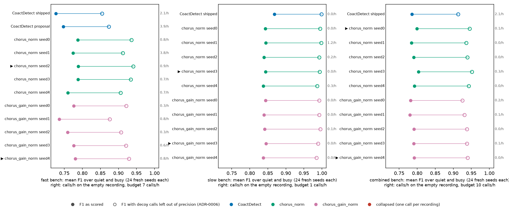

# Overnight 2026-09-24: CoactDetect searched and chorus trained on the fast, slow and combined benches

Run on WSMIP064 overnight, 02:25–02:40 UTC, at Tony's request through the orchestrator: *"Can we
get chorus and coact opt/trained and detection run on the new data set?"* This is Phase 2 of that
brief, the tuning and training. The detection run on the 66 recordings is Phase 3, with its own
record.

> **Floor: pre-ADR-0008.** ADR-0008 (#791) sets each window's minimum participation from its own
> null. Applying that to the bench waits on two decisions of Tony's (#793,
> `docs/todo/2026-09-24-the-bench-floor-and-the-elevated-rate-stretch.md`). So this run used the
> brief's stop-gap: the search never offers `min_rois` below 3, and chorus has no participation
> floor. Every number below is from the stop-gap.

**Working material, not murderboarded.** **Nothing here is adopted.** No operating point in
`bench*.py` changed. The fast bench's CoactDetect proposal is a proposal, and adopting it is
Tony's call. The detection run uses it through its own settings, not through the bench.

**Scored both ways** (ADR-0006): F1 as scored, and F1 with calls on decoys left out of precision.
A decoy is a planted event with only its label changed, so a call on one is a call on
coordination. Until the objective's ADR says what becomes of the decoys, both are reported, and
selection used the first.

## What ran

| step | tool | where it ran | time |
|---|---|---|---|
| CoactDetect search, per bench | `tools/search_all_settings.py --bench <b> --sliding --only coact --workers 14` | CPU | fast 1.9 min, slow 0.4 min, combined 10.0 min |
| chorus training, per bench | `tools/train_learned_on_bench.py --bench <b> --model <m> --seeds 0 1 2 3 4 --device cuda` | RTX A4000 | 11–19 s per fit, 30 fits |
| every candidate on fresh seeds | `tools/score_bench_candidates.py` (new) | CPU, 24 workers | 2.4 min |

- **The search's own selection:** 48 seeds per background are chosen on, and seeds 49–96 are held
  out.
- **Chorus:**
  - It is fitted on seeds 1000–1023, and each training run picks its seed on 4000–4023, so the F1 it
    reports there is a selection score.
  - The models are `chorus_norm` and `chorus_gain_norm`, 5 seeds each per bench.
- **To compare the two families fairly**, every candidate was scored again on seeds 6000–6023 per
  background, which neither selection saw. Calls per hour on the no-coordination recording were
  measured on seeds 56000–56011.

## Figure 1, every candidate on fresh seeds, both ways



**Figure 1.** One panel per bench; each row is a candidate.
- Filled dot: mean F1 as scored.
- Ring: mean F1 with decoy calls left out of precision.
- Right-hand column: calls per hour on the no-coordination recording.
- ▶: the seed each training run's own rule picked.
- No fit collapsed, so nothing is drawn red.

## The picked candidates

Mean F1 is over the quiet and busy backgrounds, 24 fresh seeds each. Recall is given as quiet /
busy.
- **Empty recording:** calls per hour on the no-coordination recording. The budget is
  CoactDetect's `MAX_FALSE_POSITIVES_PER_HOUR`: 7 fast, 1 slow, 10 combined.
- **Elevated-rate test:** calls per minute inside it, quiet / busy.

**fast** (48 recordings per background)

| candidate | mean F1 as scored | mean F1 without decoy calls | F1 quiet / busy | recall quiet / busy | empty recording, calls/h | elevated-rate test, calls/min |
|---|---|---|---|---|---|---|
| CoactDetect, shipped (binned) | 0.726 | 0.855 | 0.778 / 0.674 | 0.922 / 0.731 | 2.11 | 0.10 / 0.03 |
| **CoactDetect, proposal** | **0.747** | **0.874** | 0.785 / 0.710 | 0.931 / 0.756 | 3.89 | 0.27 / 0.16 |
| chorus_norm seed 2 (picked) | 0.789 | 0.941 | 0.795 / 0.783 | 0.933 / 0.925 | 0.89 | 0.05 / 0.02 |
| chorus_gain_norm seed 4 (picked) | 0.780 | 0.929 | 0.798 / 0.763 | 0.933 / 0.875 | 0.78 | 0.00 / 0.00 |

**slow**

| candidate | mean F1 as scored | mean F1 without decoy calls | F1 quiet / busy | recall quiet / busy | empty recording, calls/h | elevated-rate test, calls/min |
|---|---|---|---|---|---|---|
| CoactDetect, shipped (sliding; the search moved nothing) | **0.869** | **0.999** | 0.872 / 0.865 | 1.000 / 1.000 | 0.00 | 0.20 / 0.14 |
| chorus_norm seed 3 (picked) | 0.844 | 0.994 | 0.837 / 0.850 | 0.981 / 0.994 | 0.00 | 0.07 / 0.07 |
| chorus_gain_norm seed 3 (picked) | 0.845 | 0.989 | 0.837 / 0.852 | 0.972 / 0.986 | 0.00 | 0.05 / 0.02 |

**combined**

| candidate | mean F1 as scored | mean F1 without decoy calls | F1 quiet / busy | recall quiet / busy | empty recording, calls/h | elevated-rate test, calls/min |
|---|---|---|---|---|---|---|
| CoactDetect, shipped (sliding; the search moved nothing) | 0.785 | 0.913 | 0.834 / 0.737 | 0.983 / 0.800 | 2.11 | 0.36 / 0.24 |
| chorus_norm seed 0 (picked) | **0.799** | **0.945** | 0.832 / 0.766 | 0.986 / 0.961 | 0.11 | 0.03 / 0.02 |
| chorus_gain_norm seed 4 (picked) | 0.792 | 0.940 | 0.819 / 0.764 | 0.956 / 0.922 | 0.00 | 0.01 / 0.00 |

## What the search proposed

- **fast** moved three settings and switched CoactDetect from binned to sliding:
  - alpha 1e-4 → 1e-5;
  - context window 60 → 120 s;
  - merge gap to 8 s;
  - `min_rois` stays at 3.

  Held-out gain on the search's own seeds: **+0.037 mean F1 [+0.026, +0.045]**. On the fresh seeds
  it holds at +0.021 (0.726 → 0.747). The proposal makes more calls on the empty recording (2.11 →
  3.89 calls/h), still inside the budget of 7.
- **slow** and **combined** moved nothing. The shipped points were already the best admissible
  values, at 0.863 and 0.772 held-out mean F1 on the search's own seeds.
- The full proposal, with every parameter, is in `candidates.json` under
  `benches.fast.coact_proposal`, and the searches' own records are in `search-*/search.json`.

## Chorus

- **No fit collapsed.** All 30 fits made more than one call on every fresh recording, and none sat
  at the collapse score of 0.125. That fits the collapse history: the training tool fits at lr 0.01,
  and the collapses were at lr 0.03 (`docs/todo/2026-09-19-chorus-norm-does-not-train-at-lr-0.03.md`).
- **Every seed trained.** Mean F1 on the fresh seeds was 0.736–0.789 on fast, 0.838–0.845 on slow
  and 0.780–0.804 on combined.
- **Against CoactDetect** on fresh seeds, both ways:
  - chorus leads on fast (0.789 against the proposal's 0.747) and on combined (0.799 against
    0.785);
  - it trails on slow (0.844 against 0.869);
  - it makes fewer calls on the empty recording and inside the elevated-rate test on all three.
- Without decoy calls, the slow bench is saturated: CoactDetect 0.999, chorus 0.989–0.994.

## What waits on Tony

- **Whether to adopt the fast CoactDetect proposal.** It is sliding at alpha 1e-5, with a 120 s
  context and an 8 s merge gap.
- **The two ADR-0008 questions in #793.** Until they are answered, every tuned number here is
  pre-ADR-0008.

## Reproduce

```
python tools/search_all_settings.py --bench fast --sliding --only coact --workers 14 --out <d>/search-coact-fast
python tools/train_learned_on_bench.py --bench fast --model chorus_norm --seeds 0 1 2 3 4 --device cuda --out <d>/models-fast
python tools/score_bench_candidates.py --phase2 <d> --out <d>/candidates
python tools/make_bench_candidates_figure.py --candidates <d>/candidates/candidates.json --out <d>/candidates
```

The same for `slow` and `combined`. ⚠ The two chorus models of one bench share one `--out` folder,
so the second run's `best.json` and `summary.json` overwrite the first's. The checkpoints are named
per model, and `score_bench_candidates.py` picks from each model's own training log, so nothing was
lost.

The run folder, with the models, is `<darkroom>/bugarach/2026-09-24-overnight-floor-coact-chorus/phase2/`.
