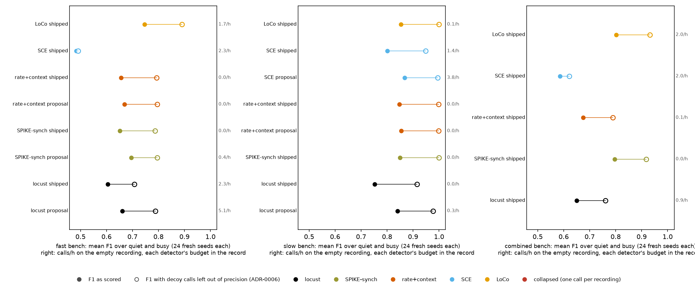

# Overnight 2026-09-24: the other five coded detectors searched on the fast, slow and combined benches

Run on WSMIP064, 02:55–03:25 UTC. This is Phase 4 of the overnight brief, *"if time allows
train/opt the full suite"*.
- **Phase 2** ([record](../2026-09-24-overnight-coact-chorus/README.md)) did CoactDetect and chorus.
- **Here:** LoCo, SCE, rate+context, SPIKE-synch and locust (`cicada` in code, ADR-0002) on all
  three benches.

> **Floor: pre-ADR-0008**, as in Phase 2. `min_rois` is never below 3 where a detector has it.
> ADR-0008's per-window floor on the bench waits on #793's two questions for Tony.

**Working material, not murderboarded. Nothing is adopted.** Every proposal below is a proposal
for Tony, and no `bench*.py` operating point changed. **F1 is reported both ways** (ADR-0006): as
scored, and with calls on decoys left out of precision. Selection used the first.

## What ran

- **The search:** `tools/search_all_settings.py --bench <b> --sliding --only loco sce rate sync cicada --workers 14`.
  - Run times: fast 30.5 min, slow 14.5 min, combined 16.8 min.
  - Selection seeds 1–48, held out 49–96.
  - The adoption rule is the repository's: a candidate replaces the shipped point only where its
    held-out gain has a 95% bootstrap interval above zero, within every budget.
- **Fresh-seed scoring:** every shipped point and proposal, rescored on seeds 6000–6023 per
  background, which the search never saw (`tools/score_bench_candidates.py`, now generalised to
  any coded detector).
  - Calls per hour on the no-coordination recording were measured on seeds 56000–56011.

## Figure 1, shipped and proposed settings on fresh seeds, both ways



**Figure 1.** One panel per bench. Each row is a detector's shipped point, or the search's proposal
where it had one.
- Filled dot: mean F1 over quiet and busy as scored.
- Ring: mean F1 with calls on decoys left out of precision.
- Right: calls per hour on the no-coordination recording. Each detector's own budget is in the
  table below.

## The table

Each cell gives mean F1 as scored / mean F1 without decoy calls / calls per hour on the
no-coordination recording. "budget" is the detector's `MAX_FALSE_POSITIVES_PER_HOUR`, in calls per
hour. The search's held-out gain is on its own seeds 49–96.

| bench | detector | budget | shipped | proposal | the search's held-out gain |
|---|---|---|---|---|---|
| fast | LoCo | 3 | 0.746 / 0.890 / 1.67 | no proposal | |
| fast | SCE | 6 | 0.483 / 0.491 / 2.33 | no proposal | |
| fast | rate+context | 1 | 0.657 / 0.793 / 0.00 | **0.669 / 0.796 / 0.00** | +0.012 [+0.009, +0.015] |
| fast | SPIKE-synch | 1 | 0.651 / 0.787 / 0.00 | **0.695 / 0.795 / 0.44** ⚠ | +0.051 [+0.038, +0.062] |
| fast | locust | 6 | 0.605 / 0.707 / 2.33 | **0.661 / 0.789 / 5.11** | +0.053 [+0.041, +0.065] |
| slow | LoCo | 1 | 0.853 / 0.999 / 0.11 | no proposal | |
| slow | SCE | 5 | 0.801 / 0.949 / 1.44 | **0.867 / 0.994 / 3.78** | +0.062 [+0.054, +0.070] |
| slow | rate+context | 1 | 0.847 / 0.999 / 0.00 | **0.854 / 0.999 / 0.00** | +0.006 [+0.003, +0.008] |
| slow | SPIKE-synch | 1 | 0.849 / 0.999 / 0.00 | no proposal | |
| slow | locust | 1 | 0.753 / 0.915 / 0.00 | **0.840 / 0.976 / 0.33** | +0.075 [+0.067, +0.083] |
| combined | LoCo | 5 | 0.802 / 0.932 / 2.00 | no proposal (+0.003 [−0.002, +0.007]) | |
| combined | SCE | 7 | 0.586 / 0.621 / 2.00 | no proposal | |
| combined | rate+context | 1 | 0.675 / 0.789 / 0.11 | no proposal | |
| combined | SPIKE-synch | 1 | 0.796 / 0.918 / 0.00 | no proposal | |
| combined | locust | 2 | 0.651 / 0.760 / 0.89 | no proposal (+0.003 [−0.006, +0.012]) | |

**Every proposal holds on the fresh seeds, and every one stays inside its detector's budget there.**
The combined bench moved nothing, as it did for CoactDetect in Phase 2.

## What each proposal moved, and what to check before adopting it

Settings the shipped point does not declare are compared against the function's default.

- **fast rate+context:** merge gap 8 s and an additive threshold (alpha 2.0). The gain is small,
  +0.012.
- **fast SPIKE-synch** ⚠:
  - It moved to `dt` 0.00625 s, `C_min` 0.0025, `tau_max` 2 s, `max_gap` 8 s and a fixed tau.
  - **`dt` and `C_min` stopped after three extensions each, which is the search's cap**
    (`MAX_EXTENSIONS`), and the log says both were still "best at the edge" at the last step.
  - They are unbracketed edges, not optima. The same shape is recorded for locust on 2026-09-17
    (the goal page). A higher cap, or a bracketed rerun, comes before this proposal means anything.
- **fast locust:**
  - It moved to percentile 99.995, 5 synchronous frames, a minimum distance of 128 frames (12.8 s)
    and a global threshold.
  - Empty-recording calls rise from 2.33 to 5.11 per hour, against a budget of 6.
- **slow SCE:**
  - It moved to 5 s bins (from 10 s) and a 10 s merge gap.
  - Empty-recording calls rise from 1.44 to 3.78 per hour, against a budget of 5.
- **slow rate+context:** merge gap 5 s, additive threshold. The gain is +0.006.
- **slow locust:**
  - It moved to 5 synchronous frames, a minimum distance of 128 frames and a global threshold.
  - Here the minimum distance is bracketed: the search tried 256 frames and it scored lower.

Every parameter of every proposal is in `candidates.json` under `benches.<bench>.detectors`, and
each search's own record is in `search-<bench>/search.json`.

## Learned models beyond chorus

Not trained. `tools/train_learned_on_bench.py` trains only the two chorus variants, and no tool on
`main` trains the other architectures on a given bench and saves a checkpoint for it. Building that
means choosing configurations, and that is a design choice left for Tony rather than made at night.

## Reproduce

```
python tools/search_all_settings.py --bench fast --sliding --only loco sce rate sync cicada --workers 14 --out <d>/search-rest-fast
python tools/score_bench_candidates.py --phase2 <d> --out <d>/candidates --search "search-rest-{bench}" --detectors loco sce rate sync cicada
python tools/make_bench_candidates_figure.py --candidates <d>/candidates/candidates.json --out <d>/candidates
```

The same for `slow` and `combined`. The run folder is
`<darkroom>/bugarach/2026-09-24-overnight-floor-coact-chorus/phase4/`.
