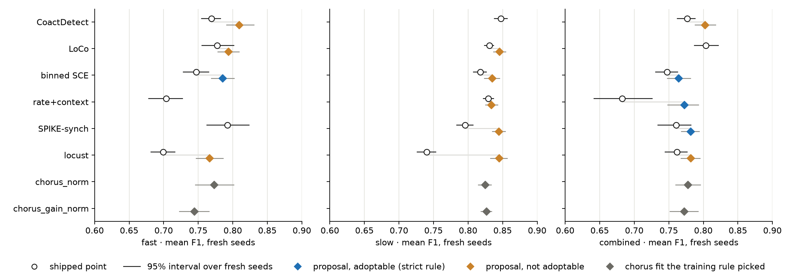
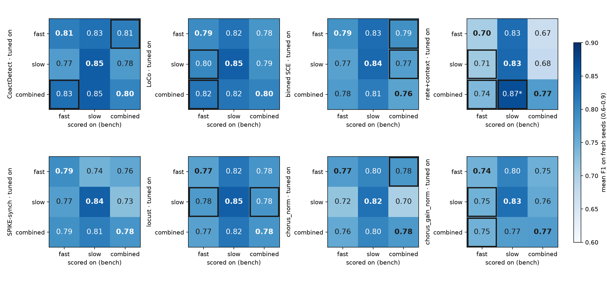
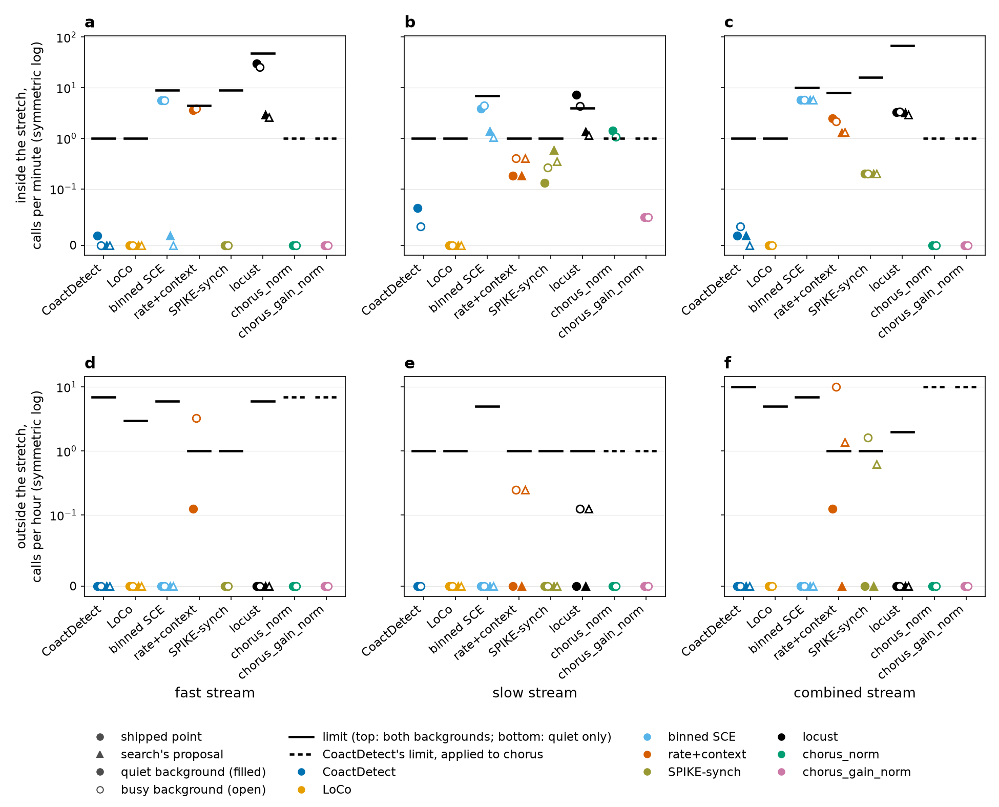
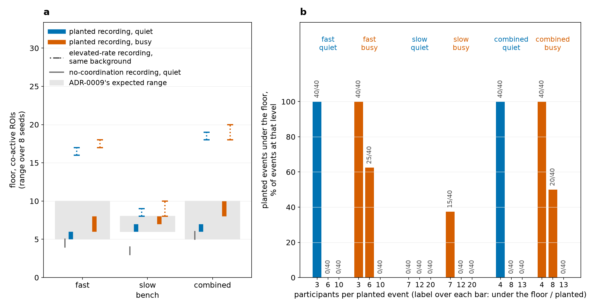

# The final-parameters night, 2026-09-25: what is adoptable, and what waits on Tony

**Nothing here is adopted.** No `bench*.py` operating point changed. The night re-searched every
coded detector, and retrained the two chorus models, under the event floor of ADR-0008. Nine
decisions for Tony follow, and one open question the night raised but this page does not ask
(*Real data*, below the decisions).

**What the floor did.** In each simulated recording (on the bench, one recording is one window) a
call now needs a minimum number of co-active ROIs (regions of interest, one imaged cell each), set
from that recording's own chance null. A planted event with fewer participants than that minimum is
"don't care": it no longer counts for or against a detector. Three things follow:

- Much of the planted bench falls under the floor: on fast and combined, all of the weakest planted
  events, and on the busy background many of the middle ones too (Decision 4).
- Four operating points shipped today fail a budget on the new bench (Decision 3).
- For the detectors whose participation minimum the floor sets, some of their own thresholds stop
  mattering (Decisions 7 and 8).

**The decisions at a glance.** Terms are in the box below the table, and in full under
*Definitions* at the end.

| # | the ask | could it change today's adoption set? |
|---|---|---|
| 1 | Adopt the four proposals that meet the strict rule? One of them changes what SPIKE-synch measures. | this *is* the set; take it last, because 2–7 set its terms |
| 2 | Keep one setting per stream, when another stream's version sometimes scores higher? | yes: combined binned SCE |
| 3 | Four shipped operating points fail a budget. Change how those budgets are defined? | yes: every budget verdict |
| 4 | Accept a bench whose weakest planted events no longer count toward recall? | yes: what every F1 measures |
| 5 | Does a setting at a hard limit (0, or 1 frame) count as bracketed? | yes: up to 5 more proposals, 3 of them flagged |
| 6 | Slow binned SCE is at the close-events allowance within noise: in or out? | yes: 1 more proposal |
| 7 | CoactDetect's `alpha` ran to the extension cap. Ship it, or stop the grid? | yes: combined CoactDetect |
| 8 | May a context window be shorter than 20 s, and should LoCo's own threshold be searched under the floor? | no: search rule |
| 9 | Keep the cap that limits a guard to a quarter of its context? | no: search rule |

> **Terms you need for the decisions.**
> - **Bench.** The simulated recordings every detector is tuned and scored on, one bench per stream
>   (fast, slow, combined). A **planted event** is a coordinated event the simulator put there; a
>   **decoy** (the glossary's *distractor*) is a planted correlated burst labelled as *not* an event.
> - **Level.** Planted events come at three participation levels per stream, as a share of the
>   recording's ROIs: on fast 10%, 20% and 30% (3, 6 and 10 ROIs). Table 3 gives all three streams.
> - **Shipped point and proposal.** The operating point `bench*.py` ships today, and the setting the
>   search proposes instead.
> - **Strict rule** (the runbook's): the held-out gain interval is above zero, every budget passes,
>   and the proposal is **bracketed**, meaning no setting sits at an end of its searched grid.
> - **Budgets:** the **elevated-rate test** (a 45-minute recording with nothing planted, where for a
>   5-minute **stretch** every ROI's event rate is raised; calls there are false alarms caused by
>   rate); the **no-coordination recording** (background only, nothing planted); the **precision
>   swing** (precision on quiet minus precision on busy); and the **close-events test** (the F1 lost
>   on recordings whose planted events can be as close as 6 s).
> - **Seed sets.** The search chose on selection seeds 1–48 and picked its proposal on held-out seeds
>   49–96. Nothing chose on the **fresh seeds** (6000–6023).
> - **Guard.** A stretch around the tested window that a detector leaves out of its background
>   estimate.

## Decision 1: adopt these four?

**Take this decision last.** Decisions 2–7 decide what "adoptable" and "F1" mean here, and each can
change this set.

Four proposals meet the runbook's strict rule **for the budgets that were measured**. The runbook
asks for every budget on held-out and on fresh seeds. Two were not measured there: the precision
swing on held-out seeds, and the close-events test on fresh seeds. Counting only measured budgets is
this report's relaxation, not the runbook's (Table 2 names each gap).

**The independent check is the paired gain on fresh seeds**: proposal minus shipped on the same
recordings, with 2,000 paired resamples. The held-out gain beside it is biased upward, because the
held-out seeds also chose the proposal (below).

| stream | detector | settings that change | held-out gain in F1 [95%] (biased up) | paired fresh-seed gain in F1 [95%] | fresh F1, shipped → proposal |
|---|---|---|---|---|---|
| fast | binned SCE | bin width (`bin_width_sec`) 10 → 2 s; merge gap (`merge_gap_sec`) none → 10 s | +0.060 [+0.046, +0.077] | +0.038 [+0.017, +0.058] | 0.747 → 0.785 |
| combined | binned SCE | threshold (`threshold_pctile`) 98th → 99th percentile | +0.015 [+0.006, +0.024] | +0.017 [+0.001, +0.033] | 0.748 → 0.764 |
| combined | rate+context | rate-excess threshold (`excess_threshold_hz`) 4.5 → 6 Hz; merge gap (`merge_gap_s`) 8 → 16 s | +0.093 [+0.076, +0.113] | +0.090 [+0.062, +0.115] | 0.683 → 0.773 |
| combined | SPIKE-synch | coincidence threshold (`C_threshold`) 0.08 → 0.1; coincidence window (`tau_mode`) `isi_adaptive` → `fixed` | +0.029 [+0.016, +0.043] | +0.021 [+0.003, +0.040] | 0.761 → 0.782 |

All four paired intervals sit above zero, and none has a correction for making four comparisons.
The paired gains are in `064/phase3-3x3/review_checks.json`, from
`tools/final_parameters_review_checks.py`. Both columns are paired, but that tool resamples each
background separately, while the search's held-out interval uses one index for both backgrounds.

**Figure 1. Fresh-seed F1 for each detector's shipped point and its proposal, by stream.**

- Circles are the shipped point. Diamonds are the proposal: blue where it meets the strict rule,
  orange where it does not. Gray squares are chorus, at the fit its training rule picked; chorus has
  no shipped point.
- F1 is the mean over the quiet and busy backgrounds, on 24 fresh recordings per background, with a
  95% interval over those recordings (2,000 resamples) under each point.
- These are the two versions' separate intervals, not the paired gain in the table above. Two
  intervals can overlap while the paired gain sits above zero, as for combined binned SCE and
  combined SPIKE-synch.

**What to weigh before deciding:**

- **Combined SPIKE-synch's proposal changes what the detector is.**
  - It turns off the ISI-adaptive coincidence window, which the glossary calls "core
    SPIKE-synchronization (Kreuz 2015), not an option on it". The window goes back to event
    synchronization (Quian Quiroga, Kreuz and Grassberger 2002, Phys Rev E 66:041904), and
    SPIKE-synchronization is Kreuz, Mulansky and Bozanic 2015, J Neurophysiol 113:3432–3445.
  - In practice the two modes barely differ here. Both run with a 0.25 s maximum window
    (`tau_max`), and at the bench's event rates that cap binds for over 99% of onsets on quiet and 94%
    on busy. So the shipped detector is itself almost fixed-window coincidence counting.
  - **The ruling may be avoidable.** A review rerun scored each change on its own (point values, mean
    F1, combined bench): `C_threshold` 0.1 alone with the ISI-adaptive window gives 0.786 on the fresh
    seeds, against 0.782 for the proposal and 0.761 shipped, and matches the proposal within 0.003 on
    the selection and held-out seeds
    ([methods review, finding 1](../../../reviews/2026-09-25-final-parameters-review-roles/round3/06-rtfm.md)).
    That variant keeps the name and the citation. It has no paired interval or bracketing check yet,
    and running them waits on the word to rerun.
  - Adopting the fixed window as proposed needs its own ruling: a qualified name and a changed methods
    citation. The authors' own intermediate option, a minimum relevant time scale (Satuvuori et al.
    2017), exists. No record shows Kreuz has been asked about a fixed-window variant.
- **Where the gain comes from: the busy background, and false alarms that are not decoys.** Per
  background, fresh seeds, shipped → proposal (F1 as scored; F1 without decoy calls; recall; decoy
  calls):

  | proposal | quiet background | busy background |
  |---|---|---|
  | fast binned SCE | 0.785 → 0.790; 0.986 → 0.985; recall 0.996 → 0.971; decoys 124 → 117 | 0.709 → 0.781; 0.920 → 0.977; recall 0.968 → 0.955; decoys 97 → 76 |
  | combined binned SCE | 0.772 → 0.771; 0.978 → 0.978; recall 1.000 → 0.996; decoys 131 → 131 | 0.724 → 0.758; 0.922 → 0.942; recall 0.962 → 0.930; decoys 106 → 89 |
  | combined rate+context | 0.793 → 0.807; 1.000 → 1.000; recall 1.000 → 1.000; decoys 125 → 115 | 0.572 → 0.739; 0.710 → 0.956; recall 1.000 → 1.000; decoys 126 → 114 |
  | combined SPIKE-synch | 0.799 → 0.795; 1.000 → 0.992; recall 1.000 → 0.983; decoys 121 → 118 | 0.723 → 0.769; 0.898 → 0.965; recall 0.978 → 0.962; decoys 98 → 94 |

  - On quiet, F1 barely moves. On busy it rises, and F1 without decoy calls rises as much or more: the
    proposals mostly stop calling background co-activity that is not a planted event. Decoy calls
    fall a little, most on fast binned SCE.
  - Recall falls under three of the four, by up to 0.032 (combined binned SCE, busy).
  - These are point values from the record. Paired intervals per background were not computed; the
    orchestrator's rule for this session is that nothing is rerun without its word.
- **What F1 cannot see: calls on coordinated planted events under the floor.** The counts below are
  calls matched to planted events under the floor, shipped → proposal, fresh seeds. Each denominator
  is the number of events under the floor at that level (Table 3).

  | proposal | lowest level, quiet | lowest level, busy | middle level, busy |
  |---|---|---|---|
  | fast binned SCE | 22 → 5 of 120 | 23 → 6 of 120 | 60 → 49 of 85 |
  | combined binned SCE | 36 → 24 of 120 | 19 → 12 of 120 | 39 → 33 of 55 |
  | combined rate+context | 34 → 2 of 120 | 41 → 11 of 120 | 55 → 54 of 55 |
  | combined SPIKE-synch | 6 → 5 of 120 | 41 → 20 of 120 | 42 → 41 of 55 |

  - The proposals call far fewer of the lowest level, and about as many of the busy middle level.
  - **Calling them is not free in the scorer, so the search is rewarded for not calling them.** The
    scorer matches calls to *all* planted events before it sets the under-floor ones aside
    (`score.py`). So an event under the floor can take a call away from a counted event, which then
    counts as a miss. And a second call on the same under-floor event stays a false alarm. How much
    this moved the search is not measured.
  - Whether losing these calls is acceptable is part of this decision.
- **The held-out seeds also chose.**
  - The proposal was picked as the best of the search's final candidates on held-out seeds 49–96,
    among those whose gain interval there was above zero (`score_bench_candidates.proposal()`).
  - So "interval above zero" is how the proposal was chosen, not a test it later passed. The
    held-out interval also uses only 400 resamples.
- **Combined binned SCE's case is the thinnest of the four.** Its paired lower bound is +0.001. The
  held-out choice changed the winner: on the selection seeds another candidate led by 0.0003 F1. Its
  quiet F1 does not move. And fast's binned SCE proposal scores higher on the combined bench
  (Decision 2).
- **Which budgets could have failed.** A pass is evidence only where the check could fail.
  - **The precision swing** is live for all four, and all four pass it.
  - **The elevated-rate test inside the stretch** is live for binned SCE: combined binned SCE makes
    5.7 calls per minute there, shipped and proposal, against a limit of 10. It is live for
    rate+context, which has no participation minimum. For combined SPIKE-synch it has no power: the
    elevated-rate recording's floor is 16–20 co-active ROIs on fast and combined (Figure 4), and it
    makes exactly 0.2 calls per minute there on every seed set. That is one call per 5-minute
    stretch, whatever the settings. ADR-0009 expected the test to partly measure the floor; that it
    measures nothing else for SPIKE-synch is this report's reading.
  - **The no-coordination recording and calls outside the stretch** mostly cannot bind: the floor is
    set so that the recording's own null reaches it at most once per hour, and the measured values
    sit far under their limits.
  - **The close-events test** was run on selection and held-out seeds only.
- **One proposal goes over a limit where that limit is not applied.** Calls outside the stretch are
  held to their limit on the quiet background only. On busy, combined rate+context's proposal makes
  1.28 calls per hour on the held-out seeds and 1.38 on the fresh ones, against a limit of 1
  (Figure 3, panel f).

**Decide:** adopt all four, some, or none. For combined SPIKE-synch, either rule on whether a fixed
coincidence window may still be called SPIKE-synch, or ask for the `C_threshold`-only variant to be
checked instead.

## The rulings that can change today's set

### Decision 2: one setting per stream, when another stream's version sometimes scores higher

Figure 2 scores every version on every stream's bench.

- 14 of the 48 off-diagonal cells score higher than the stream's own version (outlined in Figure 2).
- In 13 of those the two versions' separate intervals overlap, and in one they do not (starred):
  combined-tuned rate+context on the slow bench, 0.865 [0.855, 0.874] against slow's own proposal
  at 0.834 [0.825, 0.843]. With 48 comparisons, some wins are expected from noise.
- **Overlap is a lenient test.** Both versions are scored on the same recordings, so the right test
  is a paired interval on the difference, and the record does not hold one per cell. Some of the 13
  "overlapping" cells may differ under it.
- **The one that bears on Decision 1:** on the combined bench, fast's binned SCE proposal scores
  0.788 [0.774, 0.802], and combined's own proposal 0.764 [0.748, 0.781]. A review rerun of the
  paired difference, 2,000 resamples on the fresh seeds, gives +0.024 [+0.005, +0.044]: fast's
  version is better on combined
  ([methods review, finding 4](../../../reviews/2026-09-25-final-parameters-review-roles/round3/06-rtfm.md)).
- **Choosing on these numbers spends the fresh seeds.** They are the only set nothing has chosen on.
  A version chosen from Figure 2 would need a new untouched seed set to confirm it.

**Figure 2. Each detector's version tuned on one stream, scored on every stream's bench (the 3 × 3).**

- Rows give the bench the version was tuned on; columns give the bench it was scored on.
- Each cell is the mean F1 on fresh seeds. The diagonal is bold. A cell outlined in black scores
  higher than its column's diagonal; a star marks the one whose 95% interval does not overlap the
  diagonal's (the lenient test above, not a paired one).
- Compare down a column. The slow bench is easier for almost every detector, so the darker slow
  column is not a finding.
- The version is the proposal where the stream had one, else the shipped point, and for chorus the
  picked fit. The cells' 95% intervals are in `adoption.json` under `cross_stream`.

**Decide:** (a) keep per-stream settings; or (b) ship fast's binned SCE setting on combined too,
after confirming it on new seeds.

### Decision 3: four shipped operating points fail a budget, for two different reasons

No limit was loosened (ADR-0009 decision 4). **If nothing is decided, these four stay shipped while
failing.**

| stream | detector | budget failed | measured, selection · held-out · fresh | limit |
|---|---|---|---|---|
| fast | SPIKE-synch | precision swing (busy is *higher*) | 0.181 · not recorded · 0.148 | 0.10 |
| fast | rate+context | precision swing (busy is lower) | 0.181 · not recorded · 0.175 | 0.10 |
| combined | rate+context | precision swing | 0.245 · not recorded · 0.257 | 0.15 |
| slow | locust | elevated-rate test, calls per minute inside the stretch | 7.24 · 6.85 · 7.23 (quiet); 4.35 (busy, fresh) | 4.0 |

**Reason 1, the precision swing: the floor, and decoys under it.**
- Fast SPIKE-synch's swing is decoy calls alone. Without decoy calls its precision is 1.000 on both
  backgrounds.
- As scored, on the fresh seeds, it makes 84 decoy calls on quiet and 23 on busy. Decoys are planted
  at 6 participants. The busy floor (6–8 ROIs) blocks calls on most of them; the quiet floor (5–6)
  does not.
- A 6-participant planted event under the floor is "don't care". A call on a 6-participant decoy
  under the same floor still counts as a false alarm.
- The budget takes the absolute swing. It was written for precision falling on busy.
- Fast rate+context's swing is not a decoy effect: precision without decoys is 0.992 on quiet
  against 0.764 on busy.

**Reason 2, slow locust: where the elevated-rate test now sits, not the floor.**
- Locust has no participation minimum, and nothing is planted in the elevated-rate recording, so the
  floor does not reach it.
- Every elevated-rate ceiling was measured with the stretch inside a planted recording, at an older
  stretch rate. ADR-0009 moved the stretch into a recording of its own, at a re-measured rate.
- Shipped slow locust, quiet, seeds 1–8: 1.83 calls per minute with the stretch inside a planted
  recording, and 5.00 in its own recording. The ceiling of 4.0 was set over the first figure. Both
  numbers were measured by the second review round
  ([methods review, finding 1](../../../reviews/2026-09-25-final-parameters-review-roles/round2/06-rtfm.md)),
  not by the night's runs.

**Also failing, in Table 2 only until now:** slow chorus_norm's picked fit fails the elevated-rate
test inside the stretch, against CoactDetect's limits (about 1.4 calls per minute on quiet, limit
1.0). Figure 3 draws CoactDetect's limits over the chorus columns, dashed; this is panel b.

Fast SPIKE-synch and rate+context have no proposal because every neighbouring setting the search
tried also failed, which left it no allowed move. The diagnosis is in the darkroom, at
`bugarach/2026-09-25-final-parameters/064/phase2/DIAGNOSIS-sync-and-rate-moved-nothing.md`.

**Figure 3. The elevated-rate recording, supplied by WSMIP065.**

- The recording is 45 minutes with nothing planted. For 5 of those minutes (with 30 s ramps) every
  ROI's event rate is set to one rate: the 99th percentile of real 300 s baseline stretches (0.1334
  Hz on fast, 0.0321 Hz on slow, 0.1529 Hz on combined).
- The top row, calls per minute inside the stretch, is held to its limit (black bar) on both
  backgrounds.
- The bottom row, calls per hour outside it, is held to its limit on the quiet background only. An
  open marker (busy) above its bar there is not a failure.
- The recordings are 12 per background, on seeds 66000–66011.
- Panels a–c are inside the stretch and d–f outside it, for the fast, slow and combined streams.
  Chorus has no limit of its own and is held to CoactDetect's, drawn dashed over its columns.

**Decide:** both options on the table would turn today's failures into passes. Say so plainly,
because neither is a neutral re-measurement:
- **Re-measure the elevated-rate and precision-swing ceilings on the new bench.** Ceilings set at
  today's shipped points would sit above today's failures.
- **Make a call on a decoy under the floor "don't care"**, like a planted event under the floor. That
  removes fast SPIKE-synch's swing.

### Decision 4: much of the planted bench now sits under the floor

| stream | busy background, weakest level under the floor | busy background, middle level under the floor |
|---|---|---|
| fast | 120 of 120 events (3 participants) | 85 of 120 events (6 participants) |
| slow | 50 of 120 events (7 participants) | 0 of 120 events |
| combined | 120 of 120 events (4 participants) | 55 of 120 events (8 participants) |

- On the quiet background of fast and combined, the weakest level is entirely under the floor too.
- ADR-0009 expected a third to a half of fast and combined events to drop out. On busy, fast loses
  57% of its planted events (205 of 360) and combined 49% (175 of 360).
- Figure 4 re-measures this on seeds 1–8, a subset of the selection seeds: fast busy middle 25 of 40
  events, combined busy middle 20 of 40, slow busy weakest 15 of 40.
- In Figure 4, on the quiet background, each planted recording's floor sits about 1 ROI above the
  no-coordination recording's on fast and combined, and about 3 on slow. So the planted events raise
  the null that decides which of them count.

**Figure 4. The bench floors re-measured on the ADR-0009 bench, supplied by WSMIP065.**

- Panel a: each recording kind's floor in co-active ROIs, as the range over 8 seeds, against the
  range ADR-0009 expected. The elevated-rate recording's range is drawn as a dotted line with a
  plain tick at each end.
- Panel b: the share of planted events under the floor at each participant count, over the same
  8 seeds × 5 events.

**Decide:** accept a bench whose weakest level no longer counts toward recall, or change the planted
levels?

### Decision 5: does a value at a hard limit count as bracketed?

Five proposals are held back only by bracketing: one setting sits at a value that cannot go further.

| stream | detector | the setting at its limit | held-out gain in F1 [95%] |
|---|---|---|---|
| fast | locust | minimum run of synchronous frames (`n_synchronous_frames`) = 1 frame | +0.098 [+0.087, +0.110] |
| slow | locust | the same, 1 frame | +0.102 [+0.091, +0.115] |
| combined | locust | the same, 1 frame (moved there from 5) | +0.036 [+0.020, +0.052] |
| slow | rate+context | guard (`guard_sec`) = 0 s | +0.005 [+0.003, +0.007] |
| slow | SPIKE-synch | minimum coincidence (`C_min`) = 0 | +0.043 [+0.035, +0.051] |

- **All three locust proposals carry an earlier stop.** Their minimum spacing between calls
  (`sce_min_distance_frames`) is 128 frames (12.8 s) on fast and combined and 256 frames (25.6 s) on
  slow. The slow-bench handoff of 2026-09-21 called that climb "not a setting to ship until the
  anchor is settled", and `bench_combined.py` carries the same flag. The anchor question
  ([todo](../../../todo/2026-09-16-locust-anchor-and-the-panel-viewer.md)) is still open.
- Fast and combined locust converged on the same setting (99.99995th percentile, 1 frame, 128
  frames). That is why they score identically in Figure 2.
- **Slow locust passes the elevated-rate test by construction.** At least 25.6 s between calls
  allows at most 2.34 calls per minute, under the limit of 4.0. Its pass says nothing about rejecting
  rate-driven co-activity.
- Several shipped points sit at the same limits: locust at 1 frame on fast and slow, slow
  SPIKE-synch at `C_min` 0, slow rate+context at guard 0. Under the strict rule they would be
  unbracketed too.
- Slow SPIKE-synch's `C_min` plateau (every value from 0 to 0.03 gave identical calls,
  `bench_slow.py`) was measured on 2026-09-21, before the floor, at `dt` 0.1 s, so it is not known to
  hold at the proposal.
- Slow SPIKE-synch's proposal also moves its bin `dt` 0.1 → 0.00625 s. 0.00625 s is not a tuned
  value: onsets sit on the 0.1 s frame grid, and a review rerun found fresh-seed F1 identical (0.845)
  at every `dt` from 0.05 s down, against 0.815 at 0.1 s. What matters is going below half a frame,
  which changes what the floor-set minimum counts
  ([methods review, finding 5](../../../reviews/2026-09-25-final-parameters-review-roles/round3/06-rtfm.md)).
- Under the strict rule none of the five is adoptable. If a limit counts, all five pass every
  measured budget, making nine; three of those nine are the flagged locust proposals.

**Decide:** does a limit count as a bracket? And, separately, is the locust anchor question settled?

### Decision 6: slow binned SCE at the close-events allowance

- Slow binned SCE's proposal (merge gap `merge_gap_sec` none → 5 s) gains +0.014 [+0.011, +0.019]
  held out.
- It loses 0.0207 mean F1 on the close-events test on the held-out seeds, against an allowance of
  0.02. The same statistic read 0.0198 on the selection seeds.
- It is a point estimate on 12 recordings per background, and `bench_slow.py` calls the 0.02
  allowance "still unsigned". So it is at the allowance within noise.
- **The close-events test may have little power.** Slow locust's proposal cannot make two calls
  within 25.6 s, and loses only 0.007 F1 on it held out; fast and combined locust, at 12.8 s, gain.
  So close pairs may be a small share of the events it scores. How many planted pairs are closer
  than those spacings was not counted.

**Decide:** in or out?

## Search rules for next time

Decisions 8 and 9 do not change today's set: every proposal they touch is held back for another
reason. Decision 7 is here because it is a search rule, but ruling "ship it" would make combined
CoactDetect adoptable (its only open setting is `alpha`).

### Decision 7: CoactDetect's `alpha` runs to the extension cap

- The search lowered `alpha` as far as it was allowed, in one step on the selection seeds: fast 1e-4
  → 1.4e-9 (+0.031 F1), combined 1e-5 → 1.4e-9 (+0.013).
- **Read `alpha` as a z-cutoff, not a probability.** CoactDetect's p-value is a one-sided
  normal-approximation tail, so 1e-4 is a cutoff of about 3.7 standard deviations and 1.4e-9 about
  6.0. Out there the approximation's nominal probability is far below the true tail: on combined
  with a 3 s window, a nominal 1.4e-9 is an exact binomial tail of about 5e-5 on quiet and 7.6e-7 on
  busy.
- In ROIs, 1.4e-9 with a 3 s window means at least 6 co-active ROIs on quiet and 13 on busy. The
  quiet figure sits at or below combined's quiet floor (6–7 ROIs), so on quiet the floor, not
  `alpha`, decides (methods review, finding 6).
- Held-out gains: fast +0.055 [+0.036, +0.075]; combined +0.039 [+0.026, +0.056]. Neither is
  bracketed. Combined's context is also at 120 s, the longest the bench allows: the search extended
  it to 240 s, which the rule that a context must fit the null rejected, so the record counts it as
  inside its grid.
- **Fast CoactDetect does not fail the close-events test against the point fast ships.** Table 2
  marks it failed because the search measured a loss of 0.044 against the shipped values in their
  sliding form, which fast does not ship. Against the binned point, on the same held-out
  close-events seeds, the loss is 0.0165, inside the 0.02 allowance (`review_checks.json`).

**Decide:** stop CoactDetect's grid at a stated z-cutoff (for example 5 standard deviations,
`alpha` about 3e-7)?

### Decision 8: context windows under 20 s, and LoCo's own threshold

- ADR-0009 decision 5 lists the context grid as 20, 30, 45, 60, 90 and 120 s. It caps the context at
  120 s and does not say whether a search may go below 20 s.
- Fast and combined LoCo's grids were extended below 20 s. Fast's search moved to 5 s in its first
  round (its grid reached 2.5 s); combined's rounds stayed at 120 s, and its two-setting grid's best
  was 10 s. Neither proposal is below 20 s.
- **Under the floor, LoCo's own threshold decides almost nothing.**
  - Every LoCo search extended its `threshold_pctile` grid downward to the 1st percentile.
  - On combined, the shipped point and a candidate at the 1st percentile made the same calls, and the
    held-out gain was exactly 0 on 48 recordings.
  - The floor, counted in a 2 s window, sits above chance for LoCo's 0.5 s and 1 s windows. So LoCo's
    calls there are the floor's calls.
- **Fast and slow LoCo's "cap" in Table 1 is a labelling artefact.** Their proposals sit at the top of
  the grid (99.99th and 99.995th percentile), which was never extended. The six extensions all went
  down, but the bracketing record counts extensions per setting rather than per end, so it labels the
  top "cap". Read it as "edge".

**Decide:** is 20 s the shortest context? And should LoCo's threshold be searched at all under the
floor?

### Decision 9: the guard cap

- The runbook caps a guard at a quarter of its context window. No ADR records the cap.
- At 20 s and 30 s contexts the cap is 5 s and 7.5 s, so the 8 s guard the slow and combined grids
  carry is excluded there.
- ⚠ Until this report, the cap was never applied to LoCo.
  - The one search that could reach an over-cap guard was **fast** LoCo: it moved to a 5 s context in
    its first round (cap 1.25 s), and its guard grid (0.5–4 s) comes after context in the same round.
  - Slow and combined LoCo's rounds kept the context at 120 s, and their two-setting grid holds the
    guard at 0, so they never paired a short context with a guard.
  - Fixed on this page's branch (`run/final-parameters`), in `bench.settings_are_valid`, with a test.
  - No LoCo proposal uses a nonzero guard, so no proposal changes. The bracketing records were not
    re-checked.

**Decide:** keep the cap?

## Real data: what the floor does on the 66 recordings

**Nothing is asked here today; it is flagged because it bears on the floor all nine decisions rest
on.** Under senktide and high K⁺, in the gonadectomized groups, each treatment window's own floor
sits well above its recording's baseline floor. Under TTX it does not.

Median of each treatment window's own floor minus its recording's baseline floor, in co-active ROIs
(fast / slow / combined):

| group | senktide | high K⁺ | TTX |
|---|---|---|---|
| DI (diestrus) | +1 / +2 / +2 ROIs | −3 / −1 / −2 ROIs | −3 / −1 / −3 ROIs |
| OVX (ovariectomized) | +17 / +6 / +18 ROIs | +9 / +6 / +10 ROIs | 0 / 0 / 0 ROIs |
| MALE | +1 / +1.5 / +2 ROIs | −0.5 / +1.5 / +1.5 ROIs | −2 / 0 / −0.5 ROIs |
| ORX (orchidectomized) | +20 / +8 / +22 ROIs | +12 / +6 / +14.5 ROIs | 0 / +1 / 0 ROIs |

- In the OVX and ORX senktide and high-K⁺ rows, all 291 flips go one way: calls survive only at the
  baseline floor. (A flip is a window, stream and detector with calls under one floor and none under
  the other.) Under TTX, 73 of 82 flips go the other way, calls only at the window's own floor.
- **Two readings, and nothing here tells them apart.** A per-window floor may absorb the
  treatment-window co-activity the project studies. Or, as ADR-0008 decision 4 intends, the floor
  difference measures how much of an apparent change in co-activity is a change in event rate.
- The group pattern is untested: 6 to 15 windows per cell. And group is nested in imaging day
  (ADR-0008: 34 dates, none with more than one group), so a group difference cannot be told from a
  day difference.
- **Descriptive only** (FOUNDATIONS §9). It states no treatment effect.
- **Settings.** Each stream ran at its phase-3 setting: the proposal where there was one, otherwise
  the shipped point. That includes settings not adopted, such as combined SPIKE-synch's fixed window
  and slow locust's 25.6 s spacing.
- **Counts.** 128 treatment windows × 3 streams × 8 detectors = 3,072 combinations. The two floors
  differ in 2,696 and flip in 498. Full tables: `065/report-inputs/real_data.md` in the darkroom.

## The full tables

**How to read them:**
- **Held-out gain** is the bootstrap median of the proposal's F1 minus the shipped point's, on seeds
  49–96, with a paired 400-resample interval over recordings (one index for both backgrounds). It is
  biased upward (Decision 1).
- **Fast CoactDetect and LoCo** were searched from the shipped values in their sliding form, while
  fast ships them binned. So their held-out gain, and their "shipped" budgets on the selection and
  held-out seeds, are those of the sliding starting point. Their fresh-seed shipped figures are the
  binned point's.
- **Fresh F1** is on seeds 6000–6023, as scored and without decoy calls, with 2,000-resample
  intervals.
- **Calls on under-floor events** sums, over both backgrounds and every level, the calls matched to
  planted events under the floor (Decision 1).
- **Bracketed (strict)** lists each open setting with its reason: **cap** (the extension cap was
  used up), **edge** (at an end for another reason) or **limit** (the value cannot go further).
- **Chorus** is checked against CoactDetect's limits, the anchor of its training rule.
- **Methods caveats:**
  - The floor is counted in a 2 s co-activity window, whatever window a detector counts in. For wider
    windows (combined CoactDetect's 3 s, binned SCE's 2–10 s bins) chance co-activity is higher than
    the floor assumes. For narrower ones (LoCo's 0.5 s and 1 s), the floor sits above chance.
  - SPIKE-synch's floor-set `min_n` sums coincident onsets over a call's bins, not distinct ROIs, and
    how many it counts depends on the bin `dt`.
  - The floor sets a minimum inside CoactDetect, LoCo, binned SCE and SPIKE-synch. Rate+context,
    locust and chorus have none. They can call events below the floor, and those calls count as false
    alarms.
  - Floor stability, as ADR-0008 asks. On seeds 1–8 (`065/bench-floor/bench_floor.json`), the floors
    from each half of the draws match the full floor on 114 of 120 recordings; all 48 planted
    recordings are stable, and the 6 exceptions are elevated-rate and no-coordination recordings. On
    the 144 fresh-seed planted recordings, they match on 142, the two exceptions on slow and off by
    1 ROI; that check was run by the second review round
    ([methods review, finding 3](../../../reviews/2026-09-25-final-parameters-review-roles/round2/06-rtfm.md)),
    not by the night's runs.

**Table 1. Every detector × stream.**

<!-- adoption-table:start (written by tools/make_final_parameters_report.py; do not edit by hand) -->
| stream | detector | settings that change, shipped → proposal | held-out gain in F1 [95% interval] | fresh F1, shipped → proposal [95% interval] | fresh F1 without decoy calls, shipped → proposal | calls on under-floor events, shipped → proposal | bracketed (strict) | bracketed if a limit counts | adoptable (strict) |
|---|---|---|---|---|---|---|---|---|---|
| fast | CoactDetect | significance cutoff (`alpha`) 1e-4 → 1.4e-9; context window (`context_win_sec`) 60 s → 30 s; counting (`window_mode`) binned → sliding | +0.055 [+0.036, +0.075] (against sliding at the shipped values) | 0.769 [0.755, 0.782] → 0.809 [0.791, 0.831] | 0.981 → 0.956 | 60 → 39 of 325 events | no: `alpha` (cap), `guard_sec` (limit) | no | no |
| fast | LoCo | context window (`context_win_sec`) 120 s → 20 s; threshold (`threshold_pctile`) 99.5th percentile → 99.99th percentile; counting (`window_mode`) binned → sliding | +0.010 [+0.001, +0.018] (against sliding at the shipped values) | 0.777 [0.755, 0.802] → 0.794 [0.779, 0.809] | 0.946 → 0.989 | 34 → 43 of 325 events | no: `threshold_pctile` (cap), `guard_sec` (limit) | no | no |
| fast | binned SCE | bin width (`bin_width_sec`) 10 s → 2 s; merge gap (`merge_gap_sec`) none (no merge) → 10 s | +0.060 [+0.046, +0.077] | 0.747 [0.729, 0.765] → 0.785 [0.769, 0.802] | 0.953 → 0.981 | 105 → 60 of 325 events | yes | yes | **yes** |
| fast | rate+context | none (no proposal) | — | 0.703 [0.678, 0.727] | 0.931 | 112 of 325 events | — | — | — |
| fast | SPIKE-synch | none (no proposal) | — | 0.792 [0.763, 0.823] | 0.899 | 8 of 325 events | — | — | — |
| fast | locust | minimum spacing between calls (`sce_min_distance_frames`) 4 frames (0.4 s at 0.1 s per frame) → 128 frames (12.8 s at 0.1 s per frame); threshold (`sce_percentile`) 99.999th percentile → 99.99995th percentile | +0.098 [+0.087, +0.110] | 0.699 [0.682, 0.716] → 0.766 [0.747, 0.786] | 0.954 → 0.995 | 122 → 81 of 325 events | no: `n_synchronous_frames` (limit) | yes | no |
| fast | chorus_norm | the fit the training rule picked (training seed 1) | — | 0.773 [0.746, 0.802] | 0.891 | 21 of 325 events | — | — | — |
| fast | chorus_gain_norm | the fit the training rule picked (training seed 4) | — | 0.744 [0.723, 0.766] | 0.883 | 26 of 325 events | — | — | — |
| slow | CoactDetect | none (no proposal) | — | 0.848 [0.838, 0.857] | 1.000 | 41 of 50 events | — | — | — |
| slow | LoCo | merge gap (`merge_gap_sec`) 4 s → 8 s; null's context (maxlt: before the window only; symmetric: both sides) (`null_context_mode`) maxlt → symmetric | +0.012 [+0.009, +0.016] | 0.831 [0.824, 0.837] → 0.846 [0.837, 0.855] | 0.996 → 1.000 | 29 → 29 of 50 events | no: `threshold_pctile` (cap), `context_win_sec` (edge), `guard_sec` (limit) | no | no |
| slow | binned SCE | merge gap (`merge_gap_sec`) none (no merge) → 5 s | +0.014 [+0.011, +0.019] | 0.818 [0.808, 0.826] → 0.835 [0.824, 0.846] | 0.982 → 0.988 | 41 → 41 of 50 events | yes | yes | no |
| slow | rate+context | merge gap (`merge_gap_s`) 3 s → 5 s | +0.005 [+0.003, +0.007] | 0.830 [0.822, 0.837] → 0.834 [0.825, 0.843] | 0.995 → 0.995 | 50 → 50 of 50 events | no: `guard_sec` (limit) | yes | no |
| slow | SPIKE-synch | bin width (`dt`) 0.1 s → 0.00625 s; longest gap inside one call (`max_gap`) 4 s → 8 s; longest coincidence window (`tau_max`) 0.5 s → 1 s | +0.043 [+0.035, +0.051] | 0.796 [0.783, 0.807] → 0.845 [0.835, 0.854] | 0.956 → 0.999 | 19 → 35 of 50 events | no: `C_min` (limit) | yes | no |
| slow | locust | minimum spacing between calls (`sce_min_distance_frames`) 4 frames (0.4 s at 0.1 s per frame) → 256 frames (25.6 s at 0.1 s per frame) | +0.102 [+0.091, +0.115] | 0.740 [0.726, 0.754] → 0.845 [0.833, 0.857] | 0.914 → 0.974 | 49 → 46 of 50 events | no: `n_synchronous_frames` (limit) | yes | no |
| slow | chorus_norm | the fit the training rule picked (training seed 3) | — | 0.825 [0.815, 0.834] | 0.989 | 50 of 50 events | — | — | — |
| slow | chorus_gain_norm | the fit the training rule picked (training seed 3) | — | 0.827 [0.819, 0.834] | 0.993 | 48 of 50 events | — | — | — |
| combined | CoactDetect | significance cutoff (`alpha`) 1e-5 → 1.4e-9; co-activity window (`int_win_sec`) 2 s → 3 s | +0.039 [+0.026, +0.056] | 0.777 [0.763, 0.788] → 0.803 [0.788, 0.818] | 1.000 → 0.978 | 62 → 49 of 295 events | no: `alpha` (cap) | no | no |
| combined | LoCo | none (no proposal) | — | 0.804 [0.787, 0.822] | 0.983 | 13 of 295 events | — | — | — |
| combined | binned SCE | threshold (`threshold_pctile`) 98th percentile → 99th percentile | +0.015 [+0.006, +0.024] | 0.748 [0.731, 0.763] → 0.764 [0.748, 0.781] | 0.950 → 0.960 | 94 → 69 of 295 events | yes | yes | **yes** |
| combined | rate+context | rate-excess threshold (`excess_threshold_hz`) 4.5 Hz → 6 Hz; merge gap (`merge_gap_s`) 8 s → 16 s | +0.093 [+0.076, +0.113] | 0.683 [0.642, 0.726] → 0.773 [0.748, 0.793] | 0.855 → 0.978 | 130 → 67 of 295 events | yes | yes | **yes** |
| combined | SPIKE-synch | coincidence threshold (`C_threshold`) 0.08 → 0.1; coincidence window (`tau_mode`) isi_adaptive → fixed | +0.029 [+0.016, +0.043] | 0.761 [0.734, 0.782] → 0.782 [0.768, 0.794] | 0.949 → 0.978 | 89 → 66 of 295 events | yes | yes | **yes** |
| combined | locust | minimum run of synchronous frames (`n_synchronous_frames`) 5 frames (0.5 s at 0.1 s per frame) → 1 frame; threshold (`sce_percentile`) 99.999th percentile → 99.99995th percentile | +0.036 [+0.020, +0.052] | 0.762 [0.745, 0.777] → 0.782 [0.768, 0.796] | 0.982 → 0.979 | 123 → 46 of 295 events | no: `n_synchronous_frames` (limit) | yes | no |
| combined | chorus_norm | the fit the training rule picked (training seed 1) | — | 0.778 [0.760, 0.796] | 0.950 | 24 of 295 events | — | — | — |
| combined | chorus_gain_norm | the fit the training rule picked (training seed 0) | — | 0.772 [0.752, 0.793] | 0.940 | 26 of 295 events | — | — | — |
<!-- adoption-table:end -->

**Table 2. Every budget, for the shipped point and the proposal, on each seed set.** A cell reads
"pass" or names each failed budget. Two budgets were never measured on a whole seed set, and the
column header says so rather than every cell: the precision swing on held-out seeds, and the
close-events test on fresh seeds. "Not run" means no budget was measured on that seed set.

<!-- budget-table:start (written by tools/make_final_parameters_report.py; do not edit by hand) -->
| stream | detector | version | selection seeds 1–48 | held-out seeds 49–96 (precision swing not recorded) | fresh seeds 6000–6023 (close-events test not run) |
|---|---|---|---|---|---|
| fast | CoactDetect | shipped | pass | pass (the sliding starting point) | pass |
| fast | CoactDetect | proposal | pass | **fail: close-events test** (close-events against the sliding starting point) | pass |
| fast | LoCo | shipped | pass | pass (the sliding starting point) | pass |
| fast | LoCo | proposal | pass | pass (close-events against the sliding starting point) | pass |
| fast | binned SCE | shipped | pass | pass | pass |
| fast | binned SCE | proposal | pass | pass | pass |
| fast | rate+context | shipped | **fail: precision swing** | pass | **fail: precision swing** |
| fast | SPIKE-synch | shipped | **fail: precision swing** | pass | **fail: precision swing** |
| fast | locust | shipped | pass | pass | pass |
| fast | locust | proposal | pass | pass | pass |
| fast | chorus_norm | picked fit | not run | not run | pass (CoactDetect's limits) |
| fast | chorus_gain_norm | picked fit | not run | not run | pass (CoactDetect's limits) |
| slow | CoactDetect | shipped | pass | pass | pass |
| slow | LoCo | shipped | pass | pass | pass |
| slow | LoCo | proposal | pass | pass | pass |
| slow | binned SCE | shipped | pass | pass | pass |
| slow | binned SCE | proposal | pass | **fail: close-events test** | pass |
| slow | rate+context | shipped | pass | pass | pass |
| slow | rate+context | proposal | pass | pass | pass |
| slow | SPIKE-synch | shipped | pass | pass | pass |
| slow | SPIKE-synch | proposal | pass | pass | pass |
| slow | locust | shipped | **fail: elevated-rate test, inside the stretch** | **fail: elevated-rate test, inside the stretch** | **fail: elevated-rate test, inside the stretch** |
| slow | locust | proposal | pass | pass | pass |
| slow | chorus_norm | picked fit | not run | not run | **fail: elevated-rate test, inside the stretch** (CoactDetect's limits) |
| slow | chorus_gain_norm | picked fit | not run | not run | pass (CoactDetect's limits) |
| combined | CoactDetect | shipped | pass | pass | pass |
| combined | CoactDetect | proposal | pass | pass | pass |
| combined | LoCo | shipped | pass | pass | pass |
| combined | binned SCE | shipped | pass | pass | pass |
| combined | binned SCE | proposal | pass | pass | pass |
| combined | rate+context | shipped | **fail: precision swing** | pass | **fail: precision swing** |
| combined | rate+context | proposal | pass | pass | pass |
| combined | SPIKE-synch | shipped | pass | pass | pass |
| combined | SPIKE-synch | proposal | pass | pass | pass |
| combined | locust | shipped | pass | pass | pass |
| combined | locust | proposal | pass | pass | pass |
| combined | chorus_norm | picked fit | not run | not run | pass (CoactDetect's limits) |
| combined | chorus_gain_norm | picked fit | not run | not run | pass (CoactDetect's limits) |
<!-- budget-table:end -->

**Table 3. Planted events under the floor, by stream and background, on the fresh seeds.** Levels
are given as a share of a recording's ROIs and as the number of participating ROIs.

<!-- floor-table:start (written by tools/make_final_parameters_report.py; do not edit by hand) -->
| stream | background | floors (co-active ROIs) | planted events under the floor, by participation level (of 120 per level: 24 recordings × 5 events) |
|---|---|---|---|
| fast | quiet | 5–6 | 10% (3 ROIs): 120, 20% (6 ROIs): 0, 30% (10 ROIs): 0 |
| fast | busy | 6–8 | 10% (3 ROIs): 120, 20% (6 ROIs): 85, 30% (10 ROIs): 0 |
| slow | quiet | 6–7 | 21% (7 ROIs): 0, 38% (12 ROIs): 0, 63% (20 ROIs): 0 |
| slow | busy | 7–8 | 21% (7 ROIs): 50, 38% (12 ROIs): 0, 63% (20 ROIs): 0 |
| combined | quiet | 6–7 | 13% (4 ROIs): 120, 25% (8 ROIs): 0, 40% (13 ROIs): 0 |
| combined | busy | 7–10 | 13% (4 ROIs): 120, 25% (8 ROIs): 55, 40% (13 ROIs): 0 |
<!-- floor-table:end -->

## Definitions

- **F1.** The harmonic mean of recall and precision. A call matches a planted event when the event lies
  within 2.5 s of the call's span, one call per event: a second call on the same event counts as a
  false alarm, so a longer merge gap can gain by splitting fewer calls. F1 is pooled over the
  recordings of a background; *mean F1* averages the quiet and busy backgrounds.
- **Call.** One event a detector reports.
- **Quiet and busy backgrounds.** The bench's two background event rates, taken from the 25th and 75th
  percentiles of real baseline windows.
- **SCE.** Synchronous calcium event. **ROI.** Region of interest: one imaged cell.
- **Stream.** The event trace analyzed: fast, slow or combined.
- **Detectors.** CoactDetect, LoCo, binned SCE, rate+context, SPIKE-synch and locust are the six
  coded detectors; chorus is the learned one, trained on the bench in two variants (chorus_norm and
  chorus_gain_norm). `docs/GLOSSARY.md` describes each.
- **Shipped point.** The operating point `bench*.py` ships (the glossary's *operating point*).
- **Event floor** (ADR-0008). For each window, the larger of 3 ROIs and the smallest number of
  co-active ROIs its own rigid-shift null reaches at most once per hour. The null shifts each ROI's
  whole event train by up to *J* = 20 s, with 1,000 draws and a 2 s co-activity window. For the
  detectors that have one, the floor sets the participation minimum (the **floor-set minimum**).
- **Don't care** (ADR-0009 decision 2). A planted event with fewer participants than its
  recording's floor is left out of recall, and the one call matched to it is left out of precision.
  Matching runs over all planted events first, so such an event can still take a call from a counted
  one, and further calls on it stay false alarms (Decision 1).
- **Planted recording, no-coordination recording, elevated-rate recording.** A bench recording with
  planted events; one with background activity and nothing planted; and one with nothing planted and
  a 5-minute stretch of raised event rate (Figure 3).
- **Seed sets.** Selection seeds 1–48 (the search chose on them); held-out seeds 49–96 (the proposal
  was picked on them); fresh seeds 6000–6023 for the bench, 56000–56011 for the no-coordination
  recording and 66000–66011 for the elevated-rate recording (nothing chose on them).
- **Budgets:** the elevated-rate test (calls per minute inside its stretch, calls per hour outside
  it); the no-coordination recording (calls per hour); the precision swing (precision on quiet minus
  precision on busy, taken as an absolute value); the close-events test (a loss of at most 0.02 mean F1
  against the shipped point, on recordings whose planted events can be as close as 6 s).
- **Decoy** (the glossary's *distractor*, ADR-0006). A planted correlated burst labelled as not a
  coordinated event. F1 *without decoy calls* leaves calls on decoys out of precision.
- **Search terms.** A *rounds* search moves one setting at a time; a *pair* search walks a grid over
  two settings together. The **extension cap** lets the search extend a setting's grid past its end
  at most 6 times (`--max-extensions 6`).
- **Sliding and binned.** Two ways a detector can count: in a window that slides with each frame, or
  in fixed bins.
- **Context window.** The stretch around each moment over which a detector estimates its background.
- **WSMIP064 and WSMIP065.** The two workstations that ran the night.

## What ran

| phase | where | code | record (darkroom, `bugarach/2026-09-25-final-parameters/`) |
|---|---|---|---|
| 0: the floor and the search | #808, #810 | `main` | — |
| 0: the bench per ADR-0009 | #809 | `main` | `065/bench-floor/` (code commit not recorded) |
| 1: pilot, 4 seeds | WSMIP064 | the floor-and-search PR and the bench PR merged locally, never pushed; the chorus pilot on the floor-and-search PR alone | `064/pilot/`, `064/pilot-chorus-prb-only/` |
| 2: fast searches and chorus | WSMIP064 | `main` `b6e40f0` | `064/phase2/` |
| 2: slow and combined searches | WSMIP065 | `main` `b6e40f0` | `065/phase2/` |
| 3: fresh seeds, fast and chorus | WSMIP064 | `main` `a70b185` (#811) | `064/phase3/`, `064/phase3-chorus-slow-combined/` |
| 3: fresh seeds, slow and combined | WSMIP065 | branch `score-candidates-benches` `7af68c9`, before #811 merged | `065/phase3/` |
| 3: the 3 × 3 | WSMIP064 | `main` `723f1e6` (after #812 and #813) | `064/phase3-3x3/` |
| 3: real data | WSMIP065 | `879be03`, #814's head (merged since, same tree); includes #813 | `065/phase3-real-v3/` |
| 4: review checks | WSMIP064 | `tools/final_parameters_review_checks.py` on this branch | `064/phase3-3x3/review_checks.json` |
| 4: this page | WSMIP064 | `tools/make_final_parameters_report.py` on this branch | `report/` |

- **Searches:** `tools/search_all_settings.py --bench <b> --sliding --max-extensions 6`.
- **Chorus:** `tools/train_learned_on_bench.py --bench <b> --model <m> --seeds 0 1 2 3 4 --device cuda`.
- **Selection budgets** (`064/phase3-3x3/selection_budgets.json`): computed with the search's own
  `Evaluator` and `make_admissible` by a script that is not in the repository. Two reviewers
  recomputed every check from the recorded values with the same rule and found no mismatch. That
  checks the arithmetic, not the measured values.
- **The 3 × 3:** each of the 38 versions (every shipped point, proposal and picked chorus fit; Figure 2
  shows the 24 chosen ones) reproduces its `candidates.json` fresh-seed row exactly when scored on its
  own bench. That is a reproducibility check: both sides come from the same scorer on the same seeds.
- **Real data:** v3 supersedes `065/phase3-real-v2/`, where locust and binned SCE were unseeded; only
  4 locust flips changed.
- **This page:** `tools/make_final_parameters_report.py --night <darkroom>/bugarach/2026-09-25-final-parameters`
  writes the tables, Figures 1–2 and `adoption.json`.
