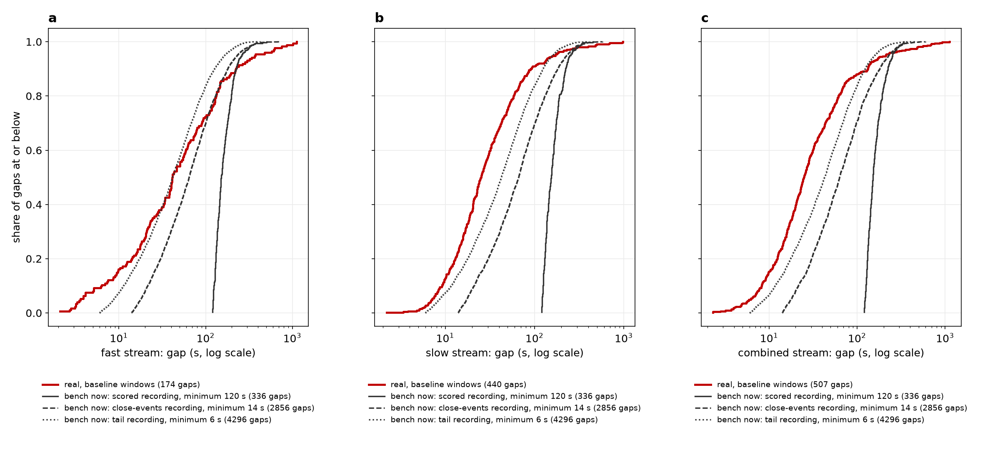
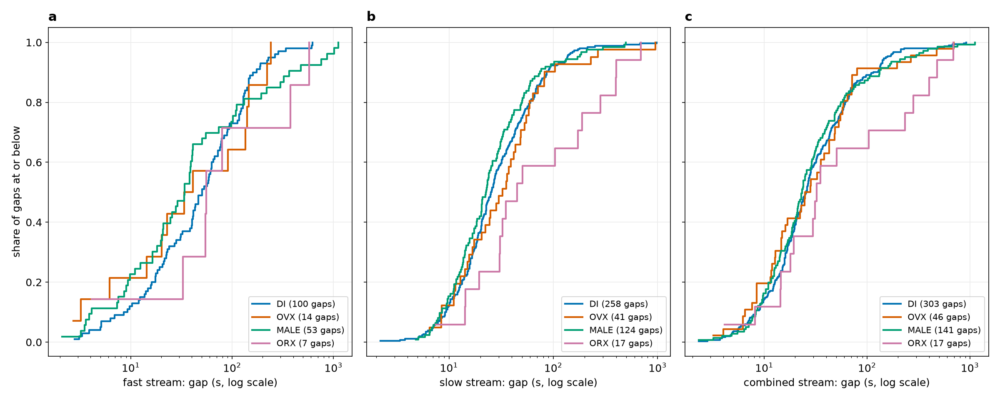

# The real inter-event intervals, measured without a detector

**ADR-0010 (proposed), part 2, step 1.** This is a measurement only; nothing on the bench changes.
The bench plants coordinated events at least 120 s apart. This measures how far apart they are in
the real recordings, so the generator can draw its planted gaps from that distribution. It uses no
detector's calls, because a detector's merging hides exactly the short gaps in question.

**Dataset:** `2026-09-23_revised_2v_long_senktide_ttx_STEPS_AND_PINS_EXCLUDED`, 66 recordings
(`senktide_ttx`, the default dataset, confirmed by Tony this session). The stamp is in
`summary.json` and `intervals.json`.

**Scope:** baseline windows only (FOUNDATIONS §9): 66 windows on each of the fast, slow and
combined streams, 21.8 hours per stream.

**Code:** `tools/measure_real_intervals.py`, with its tests in
`tests/test_measure_real_intervals.py`. The figures are drawn by
`tools/make_real_intervals_figures.py`.

## How an event and a gap are defined

1. **Co-activity count.** The number of ROIs with an onset in a 2 s window, at every start
   position on the recording's own frame grid. That is 0.1 s on all 66 recordings: their frame
   interval, not a chosen grid. The count comes from `event_floor.coactive_counts`, the one
   ADR-0008's null uses.
2. **Events.** Each maximal run of positions where the count is at or above the baseline window's
   own ADR-0008 floor (`event_floor.window_floor`, 1,000 draws) is one event. That is what the
   floor's null counts as one call. The event is timed at the centre of its highest position.
3. **Merging.** **Events less than 2 s apart (one co-activity window) are merged into one, keeping
   the higher.**
4. **Gaps.** A gap is the time between neighbouring events in the same window, in seconds.

## Per stream

| Stream | Events | Gaps | Events per hour | Gap median | 5th, 25th, 75th, 95th percentile | Share under 10 s | Share under 120 s |
|---|---|---|---|---|---|---|---|
| fast | 212 events | 174 gaps | 9.7 | 41.3 s | 3.8 s, 17.8 s, 115.7 s, 368.3 s | 16% | 76% |
| slow | 481 events | 440 gaps | 22.0 | 25.1 s | 7.1 s, 14.8 s, 49.7 s, 170.6 s | 13% | 92% |
| combined | 552 events | 507 gaps | 25.3 | 24.8 s | 6.2 s, 14.3 s, 52.4 s, 211.5 s | 15% | 89% |

**What the bench plants now.** On every stream, the scored recording plants 15 events in 45 minutes,
which is 20 events per hour. None of its gaps is under 120 s: they run 122 to 265 s, 5th to 95th
percentile. The close-events recording plants 40 events per hour with a minimum spacing of 14 s.
The tail recording plants 60 events per hour with a minimum of 6 s. Figure 1 draws all three
against the real gaps.

**Figure 1. The real gaps against the bench's planted gaps, per stream.** Cumulative share of gaps,
log time axis:
- real gaps on baseline windows: red;
- the bench's planted gaps now, seeds 1–24, on the scored recording (solid), the close-events
  recording (dashed) and the tail recording (dotted).

On all three streams most real gaps are shorter than anything the scored recording plants. On slow
and combined they are also shorter than the close-events and tail recordings' gaps.

## By group

Groups are in DI, OVX, MALE, ORX order. Each group's gaps are tested against those of the other
three groups, by Mann–Whitney U and Kolmogorov–Smirnov, two-sided.

| Stream | Group | Recordings | Events per hour | Gaps | Gap median | Median of the rest | Mann–Whitney p | Kolmogorov–Smirnov p |
|---|---|---|---|---|---|---|---|---|
| fast | DI | 17 | 20.5 | 100 | 50.4 s | 36.0 s | 0.34 | 0.084 |
| fast | OVX | 17 | 3.4 | 14 | 37.2 s | 41.5 s | 0.87 | 0.72 |
| fast | MALE | 13 | 15.0 | 53 | 34.0 s | 50.5 s | 0.18 | 0.033 |
| fast | ORX | 19 | 2.1 | 7 | 55.7 s | 41.0 s | 0.35 | 0.53 |
| slow | DI | 17 | 48.5 | 258 | 25.4 s | 24.5 s | 0.76 | 0.63 |
| slow | OVX | 17 | 8.2 | 41 | 32.6 s | 24.5 s | 0.43 | 0.40 |
| slow | MALE | 13 | 31.9 | 124 | 22.6 s | 26.8 s | 0.049 | 0.18 |
| slow | ORX | 19 | 3.8 | 17 | 44.9 s | 24.5 s | 0.0086 | 0.021 |
| combined | DI | 17 | 56.5 | 303 | 25.6 s | 24.1 s | 0.75 | 0.45 |
| combined | OVX | 17 | 9.1 | 46 | 26.6 s | 24.8 s | 0.82 | 0.63 |
| combined | MALE | 13 | 35.9 | 141 | 23.4 s | 26.1 s | 0.42 | 0.55 |
| combined | ORX | 19 | 4.5 | 17 | 32.2 s | 24.6 s | 0.13 | 0.18 |

**Figure 2. The real gaps by group, per stream.** Cumulative share of gaps, log time axis, one
panel per stream.

**What this bears on, for Tony's open point 1 (whether to pool the groups).** It decides nothing.
- **The groups differ most in how many events they have**, not in how far apart the events are.
  On combined, DI has 56.5 events per hour and ORX 4.5. A pooled gap distribution is therefore
  mostly DI's and MALE's: 444 of the 507 combined gaps.
- **Where a test is below 0.05, it is where the gap shapes differ.** Slow ORX's gaps are longer
  (median 44.9 s against 24.5 s, from only 17 gaps). Slow MALE is shorter by Mann–Whitney. Fast
  MALE differs by Kolmogorov–Smirnov.
- **The p values are optimistic, and there are many of them.** Gaps from the same recording are not
  independent, and these are 24 tests. Treat them as descriptive.
- **A generator could draw from the per-group gaps as well as the pooled ones.** The per-group
  gaps are in `intervals.json`, beside the pooled ones, for that reason.

## Files

- `intervals.json`: for the generator. Per stream, the pooled gaps and the gaps by group, in
  seconds, with the dataset stamp and the rules above.
- `summary.json`: the numbers in the tables above.
- `gaps.csv`: one row per gap.
- `windows.csv`: one row per baseline window and stream, with its floor, hours and event count.
- `RUN.md`: how it was run.

The same files, plus `events.csv` (one row per event), are in the darkroom at
`bugarach/2026-09-25-real-intervals/`.
