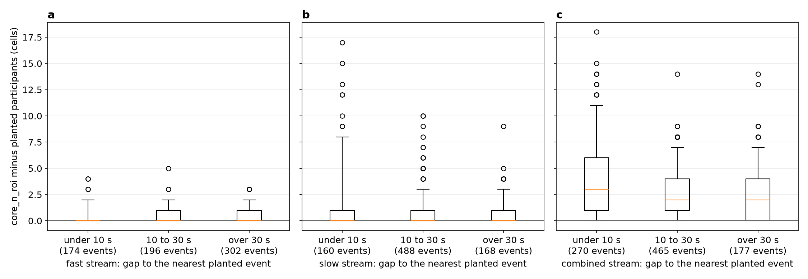

# The realistic bench, its floors, and the call_measure check

**For the full-panel night under [ADR-0010](../../../adr/0010-tune-train-and-review-against-the-data-as-they-are.md)**
(accepted 2026-09-25): parts 2 to 4, and rulings 1 to 4. This builds and measures the bench.
**Nothing is on by default, and no shipped detector setting changes.**

## The bench

**How it is chosen.** A spacing name, `bench.SPACINGS`. It is set by `--spacing` on four tools:
the search (`tools/search_all_settings.py`), the fresh-seed scorer
(`tools/score_bench_candidates.py`), the training tool (`tools/train_learned_on_bench.py`) and the
floor probe (`tools/probe_bench_floor.py`). The name travels to every worker in
`BUGARACH_BENCH_SPACING`, as the stream already does in `BUGARACH_BENCH`.

**One switch.** `bench.spacing()` is the only source of truth, and one flag names the whole
realistic setup:
- the realistic recordings;
- in the search, every one of ADR-0010's rulings (#828's `realistic()` reads the spacing);
- in training, boundary planting and floor labels;
- fast's doubled seeds, decided once by `bench.seed_factor`.

`--realistic`, #828's flag on the search and training tools, is an alias for `--spacing
realistic`, and is refused together with `--spacing bench`. #828's `BUGARACH_REALISTIC` and a bench
module's `REALISTIC` attribute are retired.

| Spacing | Planted gaps | Events per 45-minute recording | Use |
|---|---|---|---|
| `bench` (the default) | at least 120 s, as before | 15 | every recording byte-identical to before |
| `realistic` | every gap resampled from the stream's measured baseline gaps, all four groups pooled (ruling 2: replace, not mix) | fast 7, slow 17, combined 19 | tonight's search, training and scoring |
| `orx` | the same, from ORX's recordings alone | the same | a scoring-only check (ruling 1) |

**Where the numbers come from.**
- The gaps are read from the committed measurement,
  [`../2026-09-25-real-intervals/gaps_for_generator.json`](../2026-09-25-real-intervals/gaps_for_generator.json).
  That is the same data as its `intervals.json`, in the schema `bugarach.real_intervals` reads, so a
  run reproduces from a clone.
- **Event counts** come from the measured events per hour (9.7, 22.0 and 25.3) times 0.75 h,
  rounded. They are split over the three participation levels as evenly as possible, the middle
  level first. The recording length stays 45 minutes.
- **Seeds.** Under `realistic` and `orx`, fast's selection, held-out and fresh seed counts are
  doubled (`bench.seed_factor`): 96 selection seeds in the search, and 48 fresh and 24 null seeds
  in the scorer. Slow and combined keep theirs.

**Retired under a realistic spacing only** (part 4):
- **`context_fits_the_null`** passes every context. The 120 s cap stands: it lives in the grids.
- **The close-events recording's veto** (`CROWDED_RECORDING`, `MAX_CROWDED_DROP`) is switched off
  in the search, whose record says so (`crowded_veto`, `spacing`).

## Floors re-measured (part 4)

`tools/probe_bench_floor.py`: 8 seeds × 2 backgrounds × 3 benches, 1,000 null draws each.
**Floors are not hard-coded.** Every recording's floor comes from its own null
(`bench.with_floor`), so the realistic bench's floors apply to it, and only to it, by construction.
The files are `bench_floor_realistic.json` and `bench_floor_orx.json`. ADR-0009's expected ranges
describe the old spacing, so its stop rule is not applied here.

Floors are the fewest co-active ROIs a planted event must reach to count. The last column is the
share of events at each participation level that fall under the floor.

| Stream, background | Floor on the old bench | Floor, realistic | Floor, ORX spacing | Realistic: events under the floor, by level |
|---|---|---|---|---|
| fast, quiet | 5–6 | 5–6 | 5–6 | 3 participants: 16 of 16; 6: 0 of 24; 10: 0 of 16 |
| fast, busy | 6–8 | 6–8 | 6–8 | 3: 16 of 16; 6: 18 of 24; 10: 0 of 16 |
| slow, quiet | 6–7 | **7–9** | 7–8 | **7: 35 of 40**; 12: 0 of 48; 20: 0 of 48 |
| slow, busy | 7–8 | **8–9** | 8–9 | **7: 40 of 40**; 12: 0 of 48; 20: 0 of 48 |
| combined, quiet | 6–7 | 6–8 | 7 | 4: 48 of 48; 8: 0 of 56; 13: 0 of 48 |
| combined, busy | 8–10 | 8–10 | 9–10 | 4: 48 of 48; **8: 42 of 56**; 13: 0 of 48 |

**What changes:**
- **Slow's floor rises by about one ROI.** Its weakest planted level (7 participants) now falls
  almost entirely under the floor: 35 to 40 of 40 events, where the old bench had 0 to 15.
- **On busy combined, 75% of the middle level falls under the floor**, against 50% before.
- **Under ADR-0009 decision 2 these events are "don't care"**: neither a hit nor a miss. So the
  realistic bench scores recall on fewer, larger events on slow and combined.

## Does call_measure's core count track the planted participants? (ruling 3)

`tools/check_call_measure.py`, on the realistic bench:
- seeds 1–24 on both backgrounds, 1–48 on fast;
- every planted event measured by `call_measure.measure_call`, centred on its time, at the stream's
  defaults;
- `core_n_roi` compared with the event's true participant count;
- split by the gap from the event to its nearest planted neighbour.

File: `call_measure_summary.json`.

| Stream | Nearest neighbour | Events | Median error (cells) | Mean absolute error (cells) | Exact | Within 1 cell | Over | Under |
|---|---|---|---|---|---|---|---|---|
| fast | under 10 s | 174 | 0 | 0.37 | 75% | 91% | 25% | 0% |
| fast | 10 to 30 s | 196 | 0 | 0.43 | 68% | 92% | 32% | 0% |
| fast | over 30 s | 302 | 0 | 0.42 | 71% | 91% | 29% | 0% |
| slow | under 10 s | 160 | 0 | 1.32 | 53% | 78% | 47% | 0% |
| slow | 10 to 30 s | 488 | 0 | 0.79 | 59% | 82% | 41% | 0% |
| slow | over 30 s | 168 | 0 | 0.78 | 58% | 81% | 42% | 0% |
| combined | under 10 s | 270 | +3 | 3.96 | 16% | 33% | 84% | 0% |
| combined | 10 to 30 s | 465 | +2 | 2.41 | 23% | 44% | 77% | 0% |
| combined | over 30 s | 177 | +2 | 2.36 | 25% | 44% | 75% | 0% |

**Figure 1.** `core_n_roi` minus the planted participant count, in cells, for every planted event on
the realistic bench, by stream (a fast, b slow, c combined) and by gap to the nearest planted
event. Boxes are the quartiles; whiskers run from the 5th to the 95th percentile.

**What the check shows.** These are measurements; adoption per stream is decided in the morning.
- **It never under-counts.** When it is wrong, it counts background cells into the core.
- **Fast:** it tracks the planted count to within 1 cell for 91% to 92% of events, whatever the
  neighbour gap.
- **Slow:** it tracks to within 1 cell for 78% to 82%, and a neighbour under 10 s away raises the
  error, a mean of 1.32 cells.
- **Combined:** it over-counts in 75% to 84% of events, by a median of 2 to 3 cells. Combined uses
  slow's 2.5 s gap and 5 s half-aperture over every fast and slow onset, so the core sweeps in more
  background.
