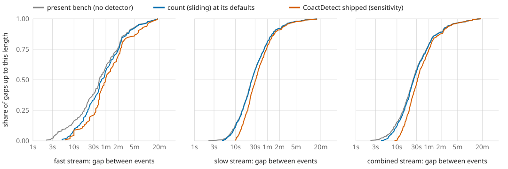
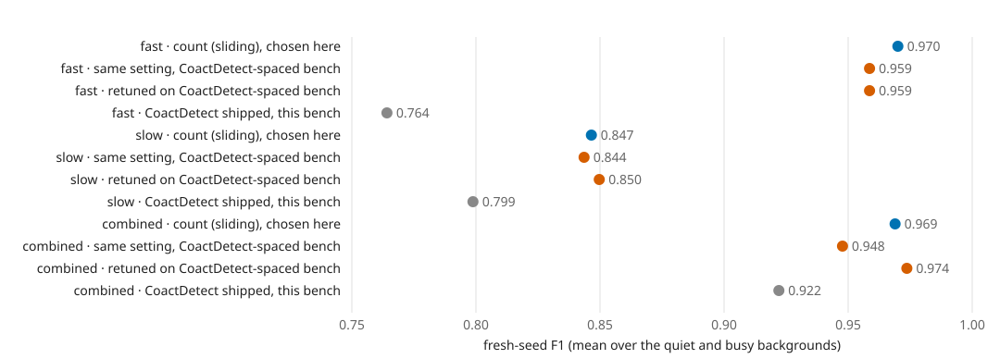

# One function builds the bench and is the detector

WSMIP065, built 2026-09-28 9:06 AM EDT. **Working material, not murderboarded.** ADR-0012 (Proposed). Dataset `2026-09-23_revised_2v_long_senktide_ttx_STEPS_AND_PINS_EXCLUDED` (66 recordings, baseline windows only). Every number is in `report.json`.

## In plain words

The bench's three real-data inputs now come from one function, count (sliding), at one setting fixed in advance and shared by every stream (2 s window, each window's own floor, k 0, merge 3 s). Against the bench as it stood: fast 9.7 → 9.1 events per hour, participation 0.20 → 0.31, jitter 0.105 → 0.332 s; slow 22.0 → 21.9 events per hour, participation 0.38 → 0.62, jitter 0.131 → 0.320 s; combined 25.3 → 24.7 events per hour, participation 0.25 → 0.63, jitter 0.150 → 0.364 s. Retuned on the rebuilt benches, fresh-seed F1: fast count (sliding) 0.970 against CoactDetect retuned 0.764 and shipped 0.764; slow count (sliding) 0.847 against CoactDetect retuned 0.847 and shipped 0.799; combined count (sliding) 0.969 against CoactDetect retuned 0.968 and shipped 0.922. On fast the gap is a budget, not a detector: CoactDetect's search found 5 settings that score better and every one breaks the precision-swing limit of 0.10 (0.101 to 0.218), so it stays at its shipped setting, whose swing is itself 0.138 on the fresh seeds; count (sliding) gets to its setting with a swing near zero. With CoactDetect shipped building the spacing instead: fast F1 0.970 → 0.959 at the same setting, 0.959 retuned (the same setting); slow F1 0.847 → 0.844 at the same setting, 0.850 retuned (a different setting); combined F1 0.969 → 0.948 at the same setting, 0.974 retuned (a different setting).

## 1. The inputs, before and after

*Before*: the bench as it stands (ADR-0010 part 2): spacing from runs of the 2 s co-active count at or above each window's floor, placed at each run's peak and merged under 2 s apart; participation from moments with at least 4 ROIs co-active within 1 s; timing spread from the cross-ROI onset correlogram. *After*: count (sliding) at its untuned defaults, the same on every stream (2 s window, the window's own ADR-0008 floor, k 0, merge 3 s), gives all three: gaps between neighbouring calls measured call start to call start; participation as the median of each call's peak distinct-ROI count over the window's ROIs (the outer two planted levels keep the bench's present ratios to the middle, which were chosen, not measured, capped at 0.95); and timing spread as the median within-call SD of the participating ROIs' first onsets, calibrated to the generator's `jitter_sec` by running the same extractor on bench recordings planted at known jitter (`calibration.json`).

**Table 1.** Pooled over the four groups, baseline windows.

| stream | inputs | events per hour | gap p5 | p25 | median | p75 | p95 | gaps under 10 s | participation (middle level) | planted levels | jitter_sec |
|---|---|---|---|---|---|---|---|---|---|---|---|
| fast | before | 9.7 per hour | 3.8 s | 17.8 s | 41.3 s | 115.7 s | 368.3 s | 16% | 0.20 | 0.30 / 0.20 / 0.10 | 0.105 s |
| fast | after | 9.1 per hour | 8.5 s | 21.9 s | 46.8 s | 122.1 s | 374.8 s | 9% | 0.31 | 0.45 / 0.31 / 0.15 | 0.332 s |
| slow | before | 22.0 per hour | 7.1 s | 14.8 s | 25.1 s | 49.7 s | 170.6 s | 13% | 0.38 | 0.63 / 0.38 / 0.21 | 0.131 s |
| slow | after | 21.9 per hour | 7.6 s | 15.0 s | 25.4 s | 50.1 s | 171.0 s | 11% | 0.62 | 0.95 / 0.62 / 0.35 | 0.320 s |
| combined | before | 25.3 per hour | 6.2 s | 14.3 s | 24.8 s | 52.4 s | 211.5 s | 15% | 0.25 | 0.40 / 0.25 / 0.13 | 0.150 s |
| combined | after | 24.7 per hour | 7.1 s | 15.1 s | 25.5 s | 53.1 s | 212.4 s | 12% | 0.63 | 0.95 / 0.63 / 0.33 | 0.364 s |

**Table 2.** After, by group (DI, OVX, MALE, ORX): events per hour, median gap, and median participation share.

| stream | DI | OVX | MALE | ORX |
|---|---|---|---|---|
| fast | 19.8 per hour, 56.9 s, 0.37 | 3.0 per hour, 66.3 s, 0.42 | 13.6 per hour, 38.3 s, 0.24 | 1.9 per hour, 68.1 s, 0.24 |
| slow | 48.0 per hour, 25.5 s, 0.63 | 8.2 per hour, 33.1 s, 0.64 | 31.9 per hour, 22.4 s, 0.56 | 3.8 per hour, 44.9 s, 0.35 |
| combined | 55.2 per hour, 25.6 s, 0.67 | 8.8 per hour, 29.5 s, 0.69 | 35.2 per hour, 23.4 s, 0.58 | 4.3 per hour, 34.4 s, 0.42 |

**Figure 1. The gaps between planted events.** For each stream, the share of gaps up to each length (log time axis): the bench as it stands (gray), count (sliding) at its defaults (blue), and CoactDetect shipped as the extractor, the sensitivity check (orange). The 3 s merge means no gap under 3 s survives count (sliding)'s extraction.

## 2. Retuned on the rebuilt benches

**Table 3.** Fresh-seed F1 (seeds neither the search nor the extraction saw; mean over the quiet and busy backgrounds) and paired ΔF1 against CoactDetect shipped with its 95% interval. "As searched" is the setting the search chose on that stream's rebuilt bench, the floor kept out of the search.

| stream | detector | setting | F1 | ΔF1 vs CoactDetect shipped [95%] | precision, quiet · busy (swing) | recall, quiet · busy | bracketed |
|---|---|---|---|---|---|---|---|
| fast | count (sliding), as searched | window 2 s, k 3 ROIs, merge gap 3 s | 0.970 | 0.207 [0.189, 0.225] | 0.99 · 0.98 (0.005) | 0.96 · 0.95 | yes |
| fast | count (sliding), defaults | window 2 s, k 0 ROIs, merge gap 3 s | 0.689 | -0.076 [-0.093, -0.059] | 0.48 · 0.57 (0.093) | 1.00 · 1.00 | — |
| fast | CoactDetect, retuned | alpha 0.0001, integration window 2 s, context window 60 s | 0.764 | 0.000 [0.000, 0.000] | 0.57 · 0.71 (0.138 ⚠ over the 0.10 limit) | 0.97 · 0.96 | — |
| fast | CoactDetect, shipped | alpha 0.0001, integration window 2 s, context window 60 s | 0.764 | 0.000 [0.000, 0.000] | 0.57 · 0.71 (0.138 ⚠ over the 0.10 limit) | 0.97 · 0.96 | — |
| slow | count (sliding), as searched | window 2 s, k 0 ROIs, merge gap 3 s | 0.847 | 0.048 [0.037, 0.060] | 0.74 · 0.73 (0.004) | 0.99 · 0.99 | — |
| slow | count (sliding), defaults | window 2 s, k 0 ROIs, merge gap 3 s | 0.847 | 0.048 [0.037, 0.060] | 0.74 · 0.73 (0.004) | 0.99 · 0.99 | — |
| slow | CoactDetect, retuned | merge gap 3 s, alpha 0.0001, integration window 2 s, context window 20 s, guard 2 s | 0.847 | 0.049 [0.037, 0.061] | 0.74 · 0.74 (0.004) | 0.99 · 1.00 | no |
| slow | CoactDetect, shipped | merge gap 8 s, alpha 0.0001, integration window 2 s, context window 60 s, guard 0 s | 0.799 | 0.000 [0.000, 0.000] | 0.73 · 0.72 (0.015) | 0.90 · 0.88 | — |
| combined | count (sliding), as searched | window 2 s, k 0 ROIs, merge gap 2 s | 0.969 | 0.047 [0.035, 0.059] | 0.93 · 0.95 (0.018) | 1.00 · 1.00 | no |
| combined | count (sliding), defaults | window 2 s, k 0 ROIs, merge gap 3 s | 0.967 | 0.045 [0.034, 0.057] | 0.93 · 0.95 (0.018) | 1.00 · 0.99 | — |
| combined | CoactDetect, retuned | merge gap 2 s, alpha 1e-05, integration window 2 s, context window 120 s, guard 8 s | 0.968 | 0.046 [0.035, 0.058] | 0.93 · 0.95 (0.018) | 1.00 · 1.00 | no |
| combined | CoactDetect, shipped | merge gap 8 s, alpha 1e-05, integration window 2 s, context window 120 s, guard 8 s | 0.922 | 0.000 [0.000, 0.000] | 0.93 · 0.95 (0.022) | 0.91 · 0.90 | — |

**Why CoactDetect did not move on fast.** Its search ran one round and moved nothing. Rerun with every candidate logged (`diagnostics/`): 5 candidates scored above the shipped point on the search's selection seeds (up to F1 0.817) and every one was refused for precision swing (0.101 to 0.218 against a limit of 0.10, the same limit count (sliding) is held to); the shipped point itself sits at 0.097 there and 0.138 on the fresh seeds. So on fast the comparison is decided by that budget, not by F1 alone: count (sliding) reaches its setting with a swing near zero, and CoactDetect cannot get there within the limit. The limit was set on the old bench; whether it should hold on this one is a question, not an answer here.

## 3. Sensitivity: CoactDetect shipped builds the spacing instead

The spacing alone is rebuilt with CoactDetect at its shipped setting as the extractor (same floor, same windows); participation and jitter stay count (sliding)'s, so only the gaps differ. count (sliding) is then scored at the setting chosen in section 2, and retuned on that bench.

**Table 4.** count (sliding), fresh-seed F1.

| stream | setting chosen on count's bench | F1 there | F1 on CoactDetect-spaced bench | retuned there | F1 retuned | CoactDetect shipped there |
|---|---|---|---|---|---|---|
| fast | window 2 s, k 3 ROIs, merge gap 3 s | 0.970 | 0.959 | window 2 s, k 3 ROIs, merge gap 3 s | 0.959 | 0.716 |
| slow | window 2 s, k 0 ROIs, merge gap 3 s | 0.847 | 0.844 | window 2 s, k 0 ROIs, merge gap 8 s | 0.850 | 0.850 |
| combined | window 2 s, k 0 ROIs, merge gap 2 s | 0.969 | 0.948 | window 2 s, k 1 ROIs, merge gap 3 s | 0.974 | 0.942 |

**Figure 2. The sensitivity check.** Fresh-seed F1 per stream: count (sliding) at the setting chosen on its own bench (blue), the same setting on the bench whose spacing CoactDetect shipped extracted and count (sliding) retuned there (orange), and CoactDetect shipped on count's bench (gray).

## Limits

- The extraction's participation is higher than the old measure's by construction: a call has to reach the window's floor, where the old measure counted any moment with 4 or more ROIs co-active within 1 s. The high planted level is capped at 0.95 on slow and combined.
- The calibrated jitter comes from one statistic run through one generator; it disagrees with the correlogram's measure (Table 1, before) by a factor of about 2 to 3, and which one is right about real events is not settled here.
- No gap under the 3 s merge exists on the rebuilt bench: count (sliding) cannot see one, so the bench no longer plants one. That is the price of the extractor being the detector, said openly (ADR-0012).
- Fresh-seed intervals cover simulation seeds only; nothing here is a treatment-effect claim.

## Where everything is

- `inputs-count_sliding/`, `inputs-coact_shipped/`: the extracted inputs (the bench reads them through `BUGARACH_BENCH_INPUTS`), with `calls.csv`, `calibration.json`.
- `main/search-<stream>/<detector>/`, `sensitivity/search-<stream>/count_sliding/`: the searches.
- `main/fresh/`, `sensitivity/fresh-main-settings/`, `sensitivity/fresh-retuned/`: the fresh-seed scorings (`candidates.json`).
- Tools: `tools/extract_bench_inputs.py`, `tools/search_all_settings.py`, `tools/score_bench_candidates.py`, `tools/one_function_bench_report.py`.
