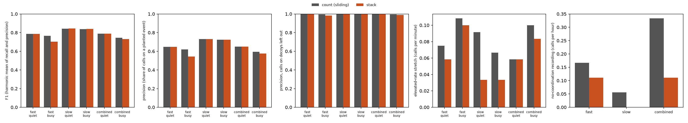
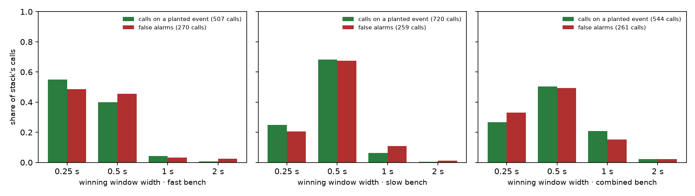
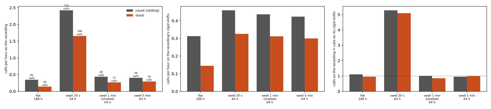
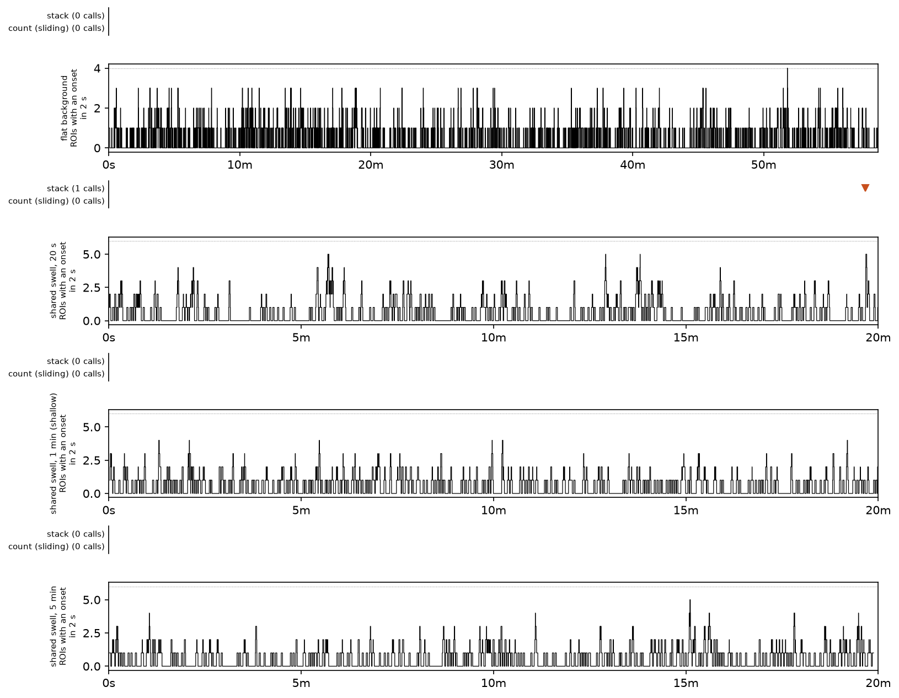

# stack against count (sliding): the three benches, and recordings whose rates swell together

**2026-10-07. Simulated recordings only; no export folder was read.** A working record of one
measurement, **not murderboarded**: if any of it reaches an outside reader, review that artifact
first. Nothing ships from it and no operating point changes.

## The idea, and what was built

Tony's "stacking blocks" (2026-10-07): at each sliding window, stack the onsets that fall inside
it. The tower's **height** is the number of distinct ROIs (regions of interest, the cells). Its
**stability** is how tightly their onsets sit in time. Both are judged against the shift null.

`stack` (`bugarach.detectors.count.stack_detect`) is `count_sliding` run at four window widths at
once: 0.25, 0.5, 1 and 2 s. Stability needs no statistic of its own, because a tight tower is a
high count in a narrow window.

- Each width's count is turned into its **tail probability**: the chance of a count that high
  if every ROI's train were shifted independently around the recording. `sliding.py` computes
  that exactly, with no random draw.
- A moment is called when the smallest of the four tail probabilities is small enough. Each call
  reports the width that won, in seconds, as its stability.
- "Small enough" is **not a setting**. It is the largest tail probability at which `stack` calls
  no more often than `count_sliding` does at the ADR-0008 floor, on 200 rigid shifts of the same
  recording (each ROI's train moved by its own offset within ±20 s; ADR-0006's null). So looking
  at four widths is paid for in the counts each width needs, not in extra false alarms.
- **One width alone is `count_sliding`, call for call** (`tests/test_stack.py`). Every difference
  below is therefore what the three narrower windows add.

**Frame interval.** Every simulated recording here has a 0.1 s frame interval, so all four widths
are kept; a width under the frame interval is dropped, since it resolves nothing. ⚠ The default
export folder's frame interval was **not read**: the folder waits on Tony's confirmation. The
only figure in the repository is a comment in `tools/measure_slow_comodulation.py`, "at most
0.119 s", under which 0.25 s is still the narrowest width that holds two frames.

## What was measured

`tools/measure_stack.py`, 217 s on one laptop. Numbers are in [`summary.json`](summary.json).

- **Benches**: fast, slow and combined, each at the quiet and the busy background, 24 recordings
  of 45 minutes each per cell, at `count_sliding`'s own operating point (2 s window, 3 s merge
  gap, the recording's ADR-0008 floor, which ran from 5 to 11 ROIs). Scored by the bench's scorer
  at its 2.5 s tolerance and pooled by `bench.pool_scores`. Also 24 no-coordination recordings
  and 24 elevated-rate recordings per cell.
- **Swells**: the synthetic worlds of `tools/measure_slow_comodulation.py`, 192 recordings each,
  with **no planted event**: a flat background (188 hours), and every ROI's rate multiplied by
  one shared multiplier that wanders on a 20 s, a 1-minute or a 5-minute timescale (64 hours
  each). Every call there is a call on rates that change together.

## Result 1: on the benches the two rules find the same planted events

**Figure 1. The benches.** Left to right: F1 (the harmonic mean of recall and precision);
precision as the bench scores it; precision with calls on decoys left out; calls per minute
inside the elevated-rate stretch; calls per hour on the no-coordination recording. Grey is count
(sliding), orange is stack.

| bench | background | F1, count (sliding) | F1, stack | calls on decoys, count (sliding) | calls on decoys, stack |
|---|---|---|---|---|---|
| fast | quiet | 0.787 | 0.786 | 130 calls | 131 calls |
| fast | busy | 0.766 | 0.704 | 100 calls | 136 calls |
| slow | quiet | 0.843 | 0.844 | 133 calls | 133 calls |
| slow | busy | 0.838 | 0.840 | 126 calls | 126 calls |
| combined | quiet | 0.788 | 0.788 | 129 calls | 129 calls |
| combined | busy | 0.745 | 0.732 | 122 calls | 130 calls |

- **Recall is 1.000 for stack in every cell** and 0.997 to 1.000 for count (sliding). There is
  no recall for stability to add: the scored planted events are already found.
- **Nearly every false alarm, for both rules, is a call on a decoy.** A decoy is planted
  coordination that the bench labels negative (ADR-0006 says it cannot be a true negative, and
  its fate is still open). With decoy calls left out, precision is 0.98 to 1.00 for both.
- **Stack's one clear loss, fast busy (0.704 against 0.766), is 36 more decoy calls.** Decoys are
  as tight as planted events, so a rule that rewards tightness finds more of them.
- **Stack calls more of the planted events that sit under the floor.** Those are out of the score
  (ADR-0009), so F1 cannot see it: on fast busy, 74 of 75 under-floor events at 20% participation
  against 51 of 75; on combined quiet, 49 of 120 at 13% against 8 of 120.
- In the elevated-rate stretch stack calls less often on slow (0.03 against 0.07 to 0.09 calls
  per minute) and about the same elsewhere. On the no-coordination recordings both are near
  zero: 2, 0 and 2 calls for stack against 3, 1 and 6 in 18 hours each.

**Figure 2. Which width wins.** For each bench, the share of stack's calls won by each window
width, split into calls on a planted event (green) and false alarms (red).

The winning width does **not** separate the two. Calls on planted events and false alarms are won
by the same widths in the same proportions, mostly 0.25 and 0.5 s. That follows from the bullet
above: the false alarms are decoys, built like planted events.

⚠ **The bench is partly circular for stability.** Its planted jitter was copied from the measured
jitter (`8137da71`), so a rule that rewards onsets as tight as the bench plants them is rewarded
by construction. The narrow widths winning in Figure 2 says the bench plants tight events; it is
not evidence that real coordinated events are that tight.

## Result 2: the swell hypothesis is not supported

The hypothesis was that stack calls fewer minute-scale swells than count (sliding) at the same
false-alarm rate.

**Figure 3. Recordings with no planted event.** Left: calls per hour on the recording, with the
number of calls above each bar. Middle: calls per hour on rigid shifts of the same recordings.
Right: the first divided by the second, with the dotted line at 1, where a rule calls a
recording exactly as often as its rigid shifts.

| world | calls, count (sliding) | calls, stack | recording ÷ rigid shifts, count (sliding) | recording ÷ rigid shifts, stack |
|---|---|---|---|---|
| flat background, 188 hours | 65 calls | 26 calls | 1.11 | 0.96 |
| shared swell, 20 s, 64 hours | 155 calls | 106 calls | 5.28 | 5.09 |
| shared swell, 1 minute (shallow), 64 hours | 28 calls | 17 calls | 1.00 | 0.85 |
| shared swell, 5 minutes, 64 hours | 26 calls | 19 calls | 0.96 | 0.99 |

- **Stack does make fewer calls in every world, and that is not the hypothesis holding.** It
  makes fewer on the flat background too, by the largest margin. Counts are whole numbers, so
  stack cannot land exactly on count (sliding)'s rigid-shift rate; it lands under it, at about
  0.3 calls per hour against 0.45. The two rules were not at the same false-alarm rate, and the
  left panel mostly shows that.
- **Against its own rigid-shift rate, each rule responds to swells the same way** (right panel).
  The 20 s swell makes both call about five times as often as on their rigid shifts, 5.28 and
  5.09. Stack does not see through it; 61 of its 106 calls there were won by the 2 s window.
- **Neither rule calls 1-minute or 5-minute swells above its rigid-shift rate at all.** The
  ratios sit at 1. The rigid shift keeps swells that slow, so the ADR-0008 floor has already
  absorbed them, for count (sliding) as much as for stack. There was nothing at the minute scale
  left for stability to remove.

**Figure 4. One recording from each world.** Each lower panel is the number of ROIs with an onset
in a 2 s sliding window, with the recording's floor as the dotted line. The lane above it marks
each rule's calls with a triangle pointing down at the trace. Each panel is its own recording
with its own time axis; the flat one is 45 minutes and the others 20.

## What this does and does not say

- **Says:** stack is a correct, tested generalisation of count (sliding); on these benches it
  finds the same scored events; it is more sensitive to tight coordination under the floor; and
  it is no better than count (sliding) at ignoring shared rate change.
- **Does not say** anything about real recordings. Whether real coordinated events are tight
  enough for the narrow windows to matter is the open question, and the bench cannot answer it
  because its tightness was copied in.
- **Limits.** The swell worlds are illustrative and fitted to nothing (their tool says so), at
  one depth each. The tail probabilities take each ROI's rate as constant over the recording.
  Stack runs at about 70% of count (sliding)'s rigid-shift rate, not at the same rate, so any
  raw count comparison flatters it. No intervals are given: these are pooled counts.

## Not done

- **Real baseline recordings.** `dataset.default()` is unconfirmed this session, and the
  relayed brief says the default folder was stopped by #858. Neither is this session's to clear.
- `stack` is **not** in `bench.OPERATING_POINTS`, the search, the folder run or either viewer.
  Registering it there is 20-odd files and three budget records; this run does not argue for it.

## Reproduce

    python tools/measure_stack.py --also docs/learned/runs/2026-10-07-stack

The darkroom copy is `bugarach/2026-10-07-stack/`.
