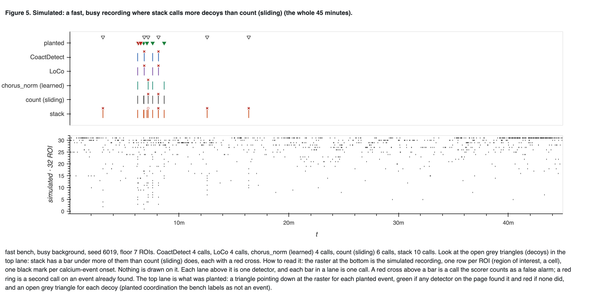
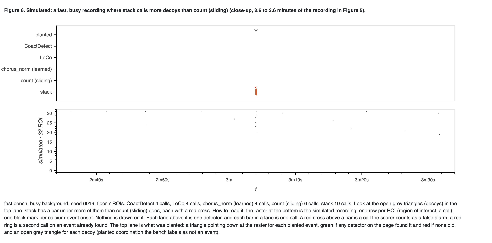
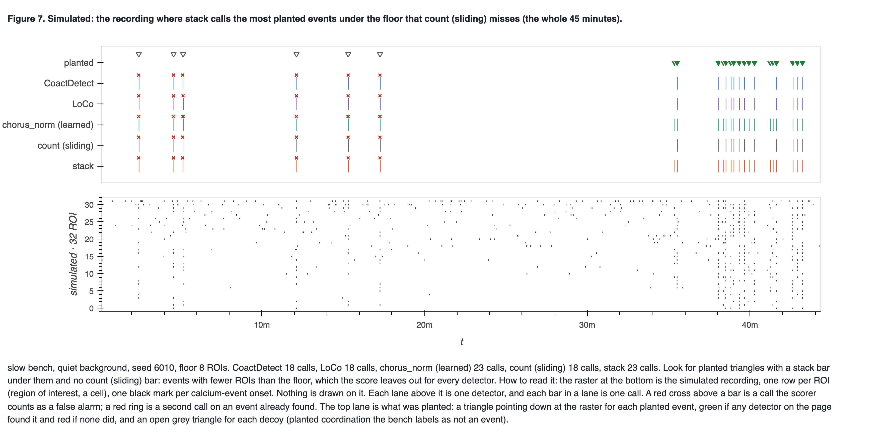
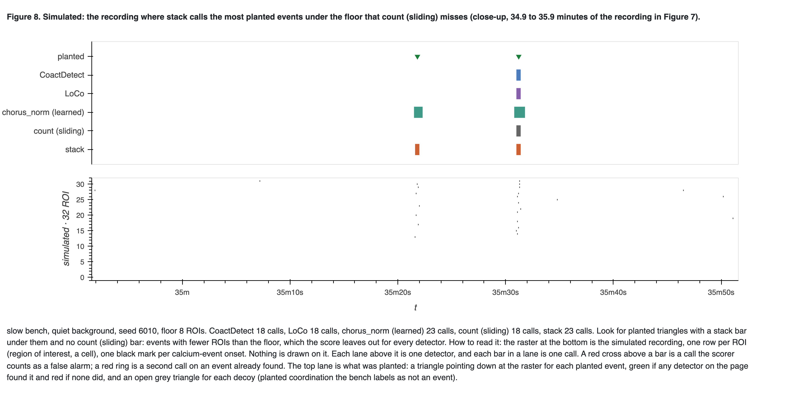
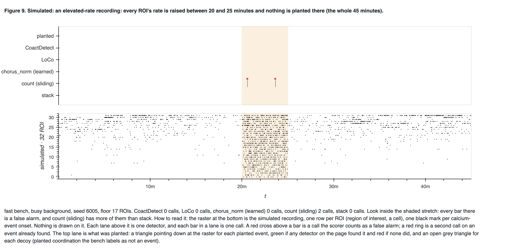
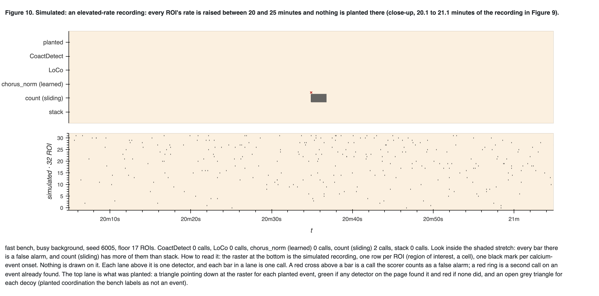

# stack: against count (sliding), and against the best detectors on record

> ⚠ **This page measured stack's first form**, which was replaced the same day. The first form
> used one null for the whole recording, calibrated against count (sliding) on rigid shifts. The
> current `stack` (`src/bugarach/detectors/stack.py`) is self-contained and uses LoCo's local
> context-window null; none of the numbers below apply to it. To reproduce this page, check out
> `8646eb4`.

**2026-10-07. Everything on this page is from simulated recordings.** A working record of one
measurement, **not murderboarded**: if any of it reaches an outside reader, review that artifact
first. Nothing ships from it and no operating point changes.

Words used on this page, once:

- **ROI**: region of interest, one cell. **Call**: a detector's claim that a coordinated event
  happened. **Floor**: the smallest number of ROIs active together that counts as an event in
  that recording (ADR-0008); it ran from 5 to 11 ROIs here.
- **F1**: the harmonic mean of recall (the share of scored planted events found) and precision
  (the share of calls that land on a planted event).
- **Decoy**: planted coordination that the bench labels as *not* an event. A call on one counts
  against precision. ADR-0006 says a decoy cannot really be a negative, and what becomes of them
  is still open.
- **Rigid shift**: the same recording with each ROI's train moved by its own random offset
  within ±20 s. It is what "chance" means here (ADR-0006).

## The idea, and what was built

Tony's "stacking blocks" (2026-10-07): at each sliding window, stack the onsets that fall inside
it. The tower's **height** is the number of distinct ROIs. Its **stability** is how tightly their
onsets sit in time. Both are judged against the shift null.

`stack` (`bugarach.detectors.count.stack_detect`) is `count_sliding` run at four window widths at
once: 0.25, 0.5, 1 and 2 s. Stability needs no statistic of its own, because a tight tower is a
high count in a narrow window.

- Each width's count is turned into its **tail probability**: the chance of a count that high
  if every ROI's train were shifted independently around the recording. `sliding.py` computes
  that exactly, with no random draw.
- A moment is called when the smallest of the four tail probabilities is small enough. Each call
  reports the width that won, in seconds, as its stability.
- "Small enough" is **not a setting**. It is the largest tail probability at which `stack` calls
  no more often than `count_sliding` does at the floor, on 200 rigid shifts of the same
  recording. So looking at four widths is paid for in the counts each width needs, not in extra
  false alarms.
- **One width alone is `count_sliding`, call for call** (`tests/test_stack.py`). Every difference
  between those two below is therefore what the three narrower windows add.

**Frame interval.** Every simulated recording here has a 0.1 s frame interval, so all four widths
are kept; a width under the frame interval is dropped, since it resolves nothing.

## What was measured, and against what

`tools/measure_stack.py`, 239 s on one laptop. Numbers are in [`summary.json`](summary.json).

**Five detectors.** `stack` and `count_sliding`, and the three the record puts at or near the top
on every stream (the 2026-09-28 detector table in the darkroom, and
[the 3 × 3 cross-stream run](../2026-09-24-cross-stream-3x3/README.md)):

| detector | run at | tuned? |
|---|---|---|
| CoactDetect | its shipped operating point on each bench | yes, by search |
| LoCo | its shipped operating point on each bench | yes, by search |
| chorus_norm (a learned model) | its picked training run per stream: seed 3 fast, seed 4 slow, seed 1 combined | yes, trained on that bench |
| count (sliding) | its untuned starting point: 2 s window, 3 s merge gap, at the floor | no |
| stack | count (sliding)'s point, plus the three narrower windows | **no. It has no search** |

**The bench is the current reference**: realistic spacing (ADR-0010), the fresh seeds 6000 and up
that no search and no training run saw, scored by the bench's scorer at its 2.5 s tolerance. That
is 48 recordings per background on fast and 24 on slow and combined, 45 minutes each, plus half
as many elevated-rate and no-coordination recordings. **The check that this is the same
measurement as the record:** mean F1 for CoactDetect, LoCo, chorus_norm and count (sliding)
comes out at exactly the detector table's values on all three streams.

⚠ An earlier version of this page used the older bench (events at least 120 s apart, seeds 1 to
24) and only the two count rules. Its conclusions about those two rules are unchanged; its
numbers are replaced by the ones below.

## Result 1: stack does not beat the best detectors on the bench

**Figure 1. The five detectors on the fast, slow and combined benches, quiet and busy
backgrounds.** Left to right: F1; precision as the bench scores it; precision with calls on
decoys left out; calls per minute inside the elevated-rate stretch; calls per hour on the
no-coordination recording. Blue CoactDetect, purple LoCo, green chorus_norm, grey count
(sliding), orange stack. **Stack was not tuned and the first three were.**

Mean F1 over the two backgrounds:

| stream | CoactDetect | LoCo | chorus_norm | count (sliding) | stack |
|---|---|---|---|---|---|
| fast | 0.608 | **0.645** | 0.621 | 0.579 | 0.556 |
| slow | 0.786 | **0.823** | 0.817 | 0.821 | 0.821 |
| combined | 0.767 | **0.813** | 0.778 | 0.793 | 0.783 |

- **LoCo has the highest F1 on all three streams.** Stack is last on fast, level with count
  (sliding) and LoCo on slow (within 0.002), and mid-table on combined.
- **Against count (sliding), its ablation, stack finds the same scored events.** Recall is equal
  to three decimals in five of six cells. Where stack's F1 is lower (fast busy, 0.497 against
  0.543; combined busy, 0.746 against 0.767) the whole difference is more calls on decoys: 276
  against 230, and 131 against 117.
- **With decoy calls left out, precision is 0.97 to 1.00 for every detector.** On this bench
  F1 mostly measures how many decoys a detector calls. chorus_norm calls the fewest on fast
  (52 on busy) and finds the fewest planted events there (recall 0.64).

### What stack does differently, which F1 does not score

**It calls the planted events that sit under the floor.** Those have fewer ROIs than the floor,
so the score leaves them out for every detector (ADR-0009).

| bench, background, participation | under-floor planted events | called by CoactDetect | LoCo | chorus_norm | count (sliding) | stack |
|---|---|---|---|---|---|---|
| slow, quiet, 21% of ROIs | 70 | 15 | 8 | 69 | 16 | 69 |
| slow, busy, 21% | 110 | 34 | 16 | 109 | 36 | 106 |
| fast, busy, 20% | 93 | 41 | 19 | 18 | 67 | 91 |
| combined, busy, 25% | 112 | 83 | 13 | 49 | 92 | 109 |
| combined, quiet, 13% | 144 | 1 | 0 | 0 | 1 | 31 |

Only chorus_norm matches it, and only on slow.

**It makes fewer calls where there is nothing to find**, though the best detectors make fewer
still:

| | CoactDetect | LoCo | chorus_norm | count (sliding) | stack |
|---|---|---|---|---|---|
| elevated-rate stretch, slow quiet (calls per minute) | 0.07 | 0.00 | 1.98 | 0.07 | 0.03 |
| elevated-rate stretch, slow busy | 0.03 | 0.00 | 2.43 | 0.03 | 0.02 |
| elevated-rate stretch, fast busy | 0.00 | 0.00 | 0.00 | 0.05 | 0.03 |
| elevated-rate stretch, combined busy | 0.03 | 0.00 | 0.78 | 0.12 | 0.08 |
| no-coordination recording, fast (calls per hour, 18 hours) | 0.17 | 0.00 | 0.00 | 0.56 | 0.17 |
| no-coordination recording, slow (9 hours) | 0.11 | 0.00 | 0.00 | 0.11 | 0.11 |
| no-coordination recording, combined (9 hours) | 0.22 | 0.00 | 0.00 | 0.22 | 0.00 |

- Stack is at or below count (sliding) in every row. On the no-coordination recordings these
  are counts of 0 to 10 calls, so read the direction and not the size.
- **LoCo makes no call at all** in any elevated-rate stretch or no-coordination recording.
- chorus_norm calls two a minute inside the slow elevated-rate stretch, over the budget of one,
  as the detector table already marks.

**Figure 2. Which window width won each of stack's calls**, on each bench: calls on a planted
event (green) against false alarms (red), as a share of each.

The winning width does **not** separate the two. Both are won mostly by the 0.25 and 0.5 s
windows, because the false alarms are decoys and decoys are built like planted events.

⚠ **The bench is partly circular for stability.** Its planted jitter was copied from the measured
jitter (`8137da71`), so a rule that rewards onsets as tight as the bench plants them is rewarded
by construction. The narrow widths winning in Figure 2 says the bench plants tight events.

## Result 2: the rasters

Each page is `bugarach.ui.diagnostic`'s lane panel over its raster panel. The raster is the
simulated recording, one row per ROI, one mark per onset, and nothing is drawn on it. Each lane
above it is one detector and each bar is one call. A red cross above a bar is a false alarm. The
top lane is what was planted: a triangle pointing down for each planted event (green if any
detector on the page found it, red if none did) and an open grey triangle for each decoy. The
recordings were picked by `tools/make_stack_rasters.py` as the largest difference of each kind.

**Figure 5. A fast, busy recording where stack calls more decoys than count (sliding).** Look at
the open grey triangles: stack has a bar under more of them, each with a red cross.

**Figure 6. One minute of Figure 5, around a decoy only stack calls.** Look at the raster under
the stack bar: a few onsets in one tight column, too few for the 2 s floor.

**Figure 7. The slow, quiet recording where stack calls the most under-floor planted events that
count (sliding) misses.** Look for green triangles with a stack bar and a chorus_norm bar under
them and nothing in the three lanes between.

**Figure 8. One minute of Figure 7 with two planted events.** The right one has enough ROIs and
all five detectors call it. The left one is under the floor: only chorus_norm and stack call it.

**Figure 9. A fast, busy elevated-rate recording.** Every ROI's rate is raised between 20 and 25
minutes (shaded) and nothing is planted. Look inside the shading: count (sliding) makes two
false calls and the other four detectors make none.

**Figure 10. One minute of Figure 9 around the first of those two calls.**

## Result 3: the swell hypothesis is not supported

The hypothesis was that stack calls fewer minute-scale swells than count (sliding) at the same
false-alarm rate. Tested on the two count rules only, on the synthetic worlds of
`tools/measure_slow_comodulation.py`: 192 recordings each with **no planted event**, a flat
background (188 hours) and every ROI's rate multiplied by one shared multiplier that wanders on
a 20 s, a 1-minute or a 5-minute timescale (64 hours each).

**Figure 3. Recordings with no planted event.** Left: calls per hour on the recording, with the
number of calls above each bar. Middle: calls per hour on rigid shifts of the same recordings.
Right: the first divided by the second, with the dotted line at 1, where a rule calls a
recording exactly as often as its rigid shifts.

| world | calls, count (sliding) | calls, stack | recording ÷ rigid shifts, count (sliding) | recording ÷ rigid shifts, stack |
|---|---|---|---|---|
| flat background, 188 hours | 65 calls | 26 calls | 1.11 | 0.96 |
| shared swell, 20 s, 64 hours | 155 calls | 106 calls | 5.28 | 5.09 |
| shared swell, 1 minute (shallow), 64 hours | 28 calls | 17 calls | 1.00 | 0.85 |
| shared swell, 5 minutes, 64 hours | 26 calls | 19 calls | 0.96 | 0.99 |

- **Stack does make fewer calls in every world, and that is not the hypothesis holding.** It
  makes fewer on the flat background too. Counts are whole numbers, so stack cannot land exactly
  on count (sliding)'s rigid-shift rate; it lands under it, at about 0.3 calls per hour against
  0.45. The two rules were not at the same false-alarm rate.
- **Against its own rigid-shift rate, each rule responds to swells the same way** (right panel).
  The 20 s swell makes both call about five times as often as on their rigid shifts.
- **Neither rule calls 1-minute or 5-minute swells above its rigid-shift rate at all.** The
  rigid shift keeps swells that slow, so the floor has already absorbed them.

**Figure 4. One recording from each swell world.** Each lower panel is the number of ROIs with an
onset in a 2 s sliding window, with the recording's floor as the dotted line. The lane above it
marks each rule's calls with a triangle pointing down at the trace. Each panel is its own
recording with its own time axis; the flat one is 45 minutes and the others 20.

## What this does and does not say

- **Says:** on the reference bench stack is not better than LoCo, CoactDetect or chorus_norm by
  F1, and is no better than count (sliding) at ignoring shared rate change. What it adds over
  count (sliding) is sensitivity to tight groups of onsets with fewer ROIs than the floor:
  planted events the score leaves out, and decoys the score counts against it.
- **Does not say** whether that sensitivity is wanted. That turns on what a decoy and an
  under-floor event are, which is the open scoring question, not a property of stack.
- **Limits.** Stack is untuned and three of its comparators are tuned. The checkpoints for
  chorus_norm live in the darkroom, not the repository. The swell worlds are illustrative and
  fitted to nothing. No intervals are given: these are pooled counts.

## Real recordings: in the darkroom, not here

On Tony's instruction (2026-10-07) the five detectors were also run on the baseline windows of
the six September 2026 APV+CNQX-then-gabazine pilot recordings, with
`tools/measure_stack_on_folder.py`. Frame interval 0.1 s, so all four widths were kept. The
numbers, the raster pages and the folder's own caveats (an eval folder, field steps never
scanned) are in `<darkroom>/bugarach/2026-10-07-stack/README.md` and its `sept-pilot-4x/` and
`sept-pilot-3x/` subfolders. Nothing derived from those recordings is in this repository
(FOUNDATIONS §5). Read that page before quoting this one: on real baselines stack does not
behave as it does on the bench.

## Not done

- **The default folder.** `dataset.default()` is unconfirmed this session, and the default
  folder was stopped by #858. Neither is this session's to clear.
- `stack` is **not** in `bench.OPERATING_POINTS`, the search, the folder run or either viewer.

## Reproduce

    python tools/measure_stack.py --also docs/learned/runs/2026-10-07-stack
    python tools/make_stack_rasters.py --also docs/learned/runs/2026-10-07-stack

The darkroom copy is `bugarach/2026-10-07-stack/`.
