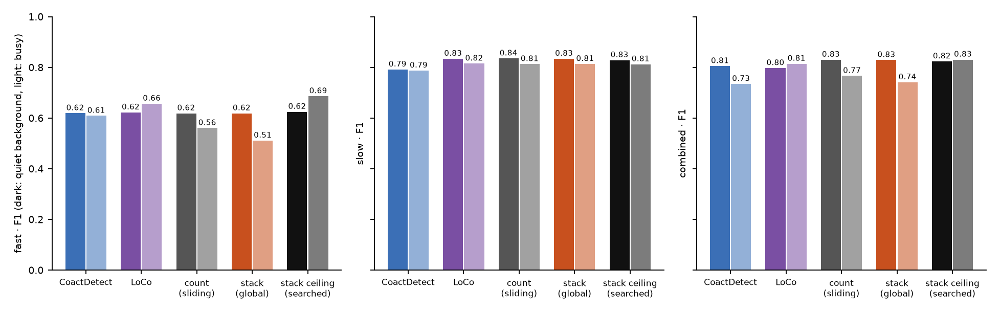
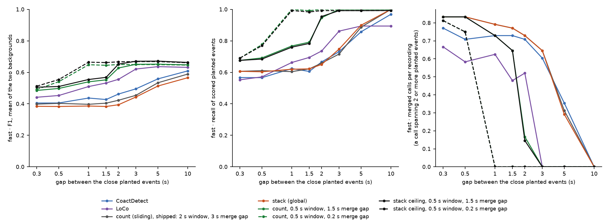
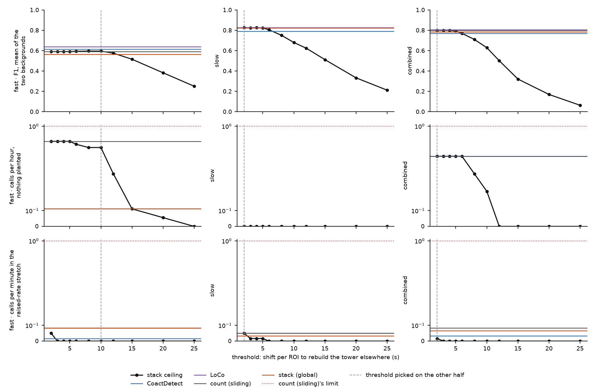

# The stack ceiling: the idea, a page, and two bench runs (2026-10-08)

**Figure 1. F1 on the three benches after searching every setting of the stack ceiling.** F1 is
the harmonic mean of recall and precision. Each pair of bars is one detector on the quiet (dark)
and busy (light) background. The reference detectors run at their shipped operating points. All
bars are from the odd seeds, which picked nothing.

**Simulated recordings only. A working record of one day, not murderboarded.** Nothing ships
from it and no operating point changes.

## The result, after the search

**Searched, the rule matches or beats the shipped LoCo on fast and combined. Almost none of that is the
stack ceiling's own idea: it is the sliding count in a 0.5 s window.**

The first run (next section) searched the threshold alone. Tony's question on it,
*"stack_ceiling was not optimized?"*, was fair: every detector beside it ran at a fully searched
operating point. `tools/search_stack_ceiling.py` then searched the window, the period, the merge
gap and the threshold as one grid of 2,520 settings per stream, picked on the even seeds inside
count (sliding)'s three limits, and reported on the odd seeds.

| stream | detector | F1, quiet | F1, busy | calls per hour, nothing planted | calls per minute in the raised-rate stretch |
|---|---|---|---|---|---|
| fast | LoCo | 0.623 | 0.657 | 0.00 | 0.00 |
| fast | count (sliding), shipped | 0.619 | 0.561 | 0.61 | 0.08 |
| fast | best with the rebuild cost off: window 0.5 s, gap 1.5 s | 0.625 | 0.670 | 0.00 | 0.00 |
| fast | stack ceiling, searched: window 0.5 s, period 480 s, gap 1.5 s, threshold 10 s | 0.625 | 0.686 | 0.00 | 0.00 |
| slow | LoCo | 0.834 | 0.815 | 0.00 | 0.00 |
| slow | count (sliding), shipped | 0.835 | 0.813 | 0.00 | 0.05 |
| slow | stack ceiling, searched: window 1 s, gap 0.5 s, threshold 0 s (cost off) | 0.828 | 0.812 | 0.00 | 0.00 |
| combined | LoCo | 0.797 | 0.814 | 0.00 | 0.00 |
| combined | count (sliding), shipped | 0.830 | 0.767 | 0.44 | 0.08 |
| combined | best with the rebuild cost off: window 0.5 s, gap 3 s | 0.824 | 0.830 | 0.00 | 0.00 |
| combined | stack ceiling, searched: window 0.5 s, period 480 s, gap 3 s, threshold 8 s | 0.824 | 0.831 | 0.00 | 0.00 |

Gain in F1 (mean of the two backgrounds) of the searched rule, on the odd seeds, with a 95%
bootstrap interval over recordings:

| stream | over LoCo | over count (sliding), shipped | over the best setting with the cost off |
|---|---|---|---|
| fast | +0.016 (−0.004 to +0.037) | +0.066 (+0.046 to +0.092) | +0.008 (+0.001 to +0.017) |
| slow | −0.004 (−0.009 to 0.000) | −0.004 (−0.008 to +0.001) | 0.000, the same setting |
| combined | +0.021 (+0.007 to +0.035) | +0.029 (+0.001 to +0.061) | +0.001 (−0.008 to +0.009) |

- ⚠ **The reference detectors here are the shipped points, and on fast those are not the best on
  record.** Fast LoCo and CoactDetect ship in their binned form at points set on 2026-09-16.
  Their sliding forms were searched on this realistic bench on 2026-09-26 and reached a held-out
  mean F1 of 0.661 each (from 0.626 and 0.583 shipped); nothing was adopted
  (`<darkroom>/bugarach/2026-09-26-full-panel/064/README.md`). The searched stack ceiling's mean
  here is 0.655, on different seeds. So on fast it is about level with the tuned sliding forms,
  not ahead of them. Slow LoCo and CoactDetect ship sliding and searched (2026-09-21, before
  ADR-0008's floor and the realistic spacing); combined ships a sliding search pick (2026-09-23).
- ⚠ **The 0.5 s window is a rediscovery.** count (sliding) was searched on this bench on
  2026-09-26 (`<darkroom>/bugarach/2026-09-26-full-panel/064/count/README.md`): on fast the best
  setting was a 0.5 s window with 2 ROIs above the floor, +0.020 F1 over CoactDetect's proposal
  and refused for its precision difference between backgrounds (0.146 against a limit of 0.10).
  Slow did not move and combined chose 1 s. None was adopted, so count (sliding) ships untuned.
  This search did not vary the ROIs above the floor.
- **The rebuild cost adds 0.008 F1 on fast, nothing on slow and 0.001 on combined.** A threshold
  of 0 switches the cost off and leaves the sliding count at that window against the floor. On
  slow the search picked exactly that.
- **The gain over shipped count (sliding) comes from the window.** With the cost off, a 0.5 s
  window scores 0.670 on the fast busy background against 0.561 at the shipped 2 s, and makes no
  call on recordings with nothing planted (0.61 per hour at 2 s).
- ⚠ **That is a finding about count (sliding), and it needs its own check.** The floor is counted
  in a 2 s window (ADR-0008) and is here applied to a 0.5 s one, which asks for more than the
  floor was set to mean. `bench.FLOOR_AT_WINDOW_ENV` exists to study that and was off. The
  repository's own search of count (sliding) is the place to confirm it.
- ⚠ **The period is unbracketed on fast and combined:** the pick is 480 s, the longest tried. It
  only matters through the cost, which adds little.
- The merge gap and window are bracketed. The grid edges of the first search (period 240 s, gap
  0.5 s) were extended once.

Numbers: [`search_summary.json`](search_summary.json). 672 recordings, 394 s on one laptop.

## Short intervals: a controlled test, and it separates the detectors

**Figure 3. Planted events at a chosen short gap, fast stream.** Left: F1, mean of the quiet and
busy backgrounds. Middle: recall of the scored planted events. Right: merged calls per
recording, a merged call being one whose span holds two or more scored planted events. The
horizontal axis is the gap between the close planted events. Solid green and black: the sliding
count in a 0.5 s window with a 1.5 s merge gap, without and with the stack ceiling's rebuild
cost. Dashed: the same with a 0.2 s merge gap.

Tony, once every tuned detector had landed within a few hundredths of F1 on the fast bench:
*"i suspect we need the revised bench with short intervals."* The realistic bench cannot show
this. Its gaps were measured from peaks of a count in a 2 s window, so its shortest fast gap is
2.1 s.

`tools/measure_close_events.py` is the part that needs no real recording. On the fast bench's
recording, half the gaps between neighbouring planted events are set to one chosen value and the
rest keep the old spacing: 48 recordings per gap, 336 planted events, 134 close gaps.
**It is a controlled test, not a bench.** The gap values are a sweep axis, not a measurement.

| gap between close events | 0.3 s | 0.5 s | 1 s | 1.5 s | 2 s | 3 s | 5 s | 10 s |
|---|---|---|---|---|---|---|---|---|
| F1: CoactDetect, shipped | 0.41 | 0.41 | 0.44 | 0.43 | 0.46 | 0.50 | 0.56 | 0.61 |
| F1: LoCo, shipped | 0.44 | 0.45 | 0.51 | 0.53 | 0.56 | 0.62 | 0.64 | 0.63 |
| F1: count (sliding), shipped (2 s window, 3 s merge gap) | 0.40 | 0.40 | 0.40 | 0.40 | 0.42 | 0.45 | 0.53 | 0.59 |
| F1: count, 0.5 s window, 1.5 s merge gap | 0.49 | 0.50 | 0.54 | 0.55 | 0.63 | 0.65 | 0.65 | 0.65 |
| F1: count, 0.5 s window, 0.2 s merge gap | 0.49 | 0.54 | 0.65 | 0.64 | 0.65 | 0.65 | 0.65 | 0.65 |
| F1: stack ceiling, 0.5 s window, 0.2 s merge gap | 0.51 | 0.55 | 0.66 | 0.66 | 0.67 | 0.67 | 0.67 | 0.66 |
| recall: count (sliding), shipped | 0.61 | 0.61 | 0.60 | 0.62 | 0.66 | 0.72 | 0.89 | 1.00 |
| recall: LoCo, shipped | 0.55 | 0.57 | 0.66 | 0.69 | 0.74 | 0.86 | 0.89 | 0.89 |
| recall: count, 0.5 s window, 0.2 s merge gap | 0.69 | 0.78 | 1.00 | 0.99 | 1.00 | 1.00 | 1.00 | 1.00 |

- **At a 10 s gap the detectors sit within 0.09 F1 of each other. At 1 s they span 0.40 to
  0.66.** Short intervals are where they differ.
- **What decides it is the merge gap, then the window.** A detector cannot separate two events
  closer than its merge gap. Shipped count (sliding) and CoactDetect merge up to 3 s and lose a
  third or more of the events until the gap passes 5 s. With a 0.2 s merge gap the 0.5 s window
  recalls every scored event down to a 1 s gap.
- **Under 1 s nothing here separates the pair.** At 0.5 s and 0.3 s the best recall is 0.78 and
  0.69. Two events 0.3 s apart, each with onsets spread over about 0.1 s, overlap in a 0.5 s
  window.
- **The stack ceiling's rebuild cost still adds 0.01 to 0.02 F1** over the same count without it,
  at every gap. It does not separate close events any better.
- ⚠ **The references are the shipped fast points**, which are binned and tuned on a bench with no
  close events. The sliding proposals of 2026-09-26 were not run here.
- ⚠ **The scorer allows 2.5 s** between a call and a planted event, which is longer than most of
  these gaps. It matches one call to one event, so a merge still costs a miss, but which of two
  close events a call is credited to is not meaningful below that tolerance.
- ⚠ A participating ROI can take part in both events of a close pair, with two onsets 0.3 s
  apart. Whether real ROIs do that is not known here.

**What a real revised bench needs, and what blocks it.** The gaps have to be measured again in a
window narrower than 2 s, on real baselines. The default folder is stopped for the pinning
undercount (#858), so that measurement waits on the producer's corrected export, or on Tony's
word that this measurement is unaffected. The merge gaps in every shipped operating point were
tuned on recordings with no close events, and would have to be searched again on the revised
bench.

Numbers: [`close_events_summary.json`](close_events_summary.json). 384 recordings, 104 s.

## The real gaps, measured in narrower windows

⚠ **Measured on the stopped default folder, on Tony's acknowledgment.** Asked on 2026-10-08
whether to run the gap measurement on the stopped folder, he answered *"go"*, agreed to the
wording of the acknowledgment, and ran it himself. Measurement only, baseline windows, nothing
ships from it. Every number was also computed without the four DI recordings the stop names;
no share below moves by more than 0.01, and those rows are in the darkroom file.

`tools/measure_real_intervals.py --window-sec` at 1 s and 0.5 s, on the 66 recordings of
`2026-09-23_revised_2v_long_senktide_ttx_STEPS_AND_PINS_EXCLUDED`. The 2 s rows are the
2026-09-25 measurement, which is what the realistic bench plants from. The floor is counted in
the same window as the events.

| stream | window | floor, median | events per hour | gaps | shortest gap | under 2 s | under 5 s | under 10 s |
|---|---|---|---|---|---|---|---|---|
| fast | 2 s | 6 ROIs | 9.7 | 174 | 2.1 s | 0.0% | 7.5% | 16.1% |
| fast | 1 s | 5 ROIs | 14.3 | 270 | 1.2 s | 1.9% | 11.1% | 18.9% |
| fast | 0.5 s | 4 ROIs | 18.4 | 357 | 0.6 s | 3.9% | 16.0% | 23.5% |
| slow | 2 s | 5 ROIs | 22.0 | 440 | 2.2 s | 0.0% | 0.9% | 12.7% |
| slow | 1 s | 4 ROIs | 23.9 | 481 | 1.0 s | 1.5% | 2.7% | 15.8% |
| slow | 0.5 s | 4 ROIs | 25.6 | 518 | 0.5 s | 4.4% | 5.8% | 19.9% |
| combined | 2 s | 7 ROIs | 25.3 | 507 | 2.3 s | 0.0% | 3.4% | 15.2% |
| combined | 1 s | 6 ROIs | 29.7 | 602 | 1.1 s | 2.2% | 8.1% | 21.9% |
| combined | 0.5 s | 5 ROIs | 33.2 | 679 | 0.5 s | 6.3% | 13.5% | 27.0% |

- **Short gaps exist, and they are a small share.** In a 0.5 s window, 4 to 6% of gaps are under
  2 s and 6 to 16% are under 5 s. The 2 s measurement could not see any under 2 s.
- **A narrower window counts more events, most of all on fast**: 18.4 per hour at 0.5 s against
  9.7 at 2 s. The floor falls with the window (a median of 4 ROIs against 6 on fast), and it is
  set so that chance reaches it at most once an hour at each window, so the extra events are
  not chance by that rule. They are smaller, tighter events the 2 s floor refuses.
- **So the window changes what counts as an event, not only how close two can sit.** A bench
  built from the 0.5 s measurement would plant nearly twice as many fast events, at a lower
  floor. That is a bigger revision than adding short gaps, and it touches ADR-0008's 2 s window.
- The 2 s folder of this run came back empty; the 2 s rows above are the earlier measurement.

The figure and every row, with and without the four named recordings, are in the darkroom only
(`<darkroom>/bugarach/2026-10-08-stack-ceiling/real-gaps/`), built by
`tools/make_real_gaps_by_window.py` from the measurement's output files.

## The first run: the threshold alone

**Figure 2. The stack ceiling's call rule on the three benches, by threshold, at borrowed
settings.** The window (2 s), merge gap (3 s) and period (120 s) are held. Columns are the
fast, slow and combined streams. Top row: F1 (the harmonic mean of recall and precision), averaged
over the quiet and busy backgrounds. Middle row: calls per hour on recordings with nothing
planted. Bottom row: calls per minute inside a stretch where every ROI's rate is raised. Black
curve: the stack ceiling at each threshold. Horizontal lines: CoactDetect (blue), LoCo (purple),
count (sliding) (grey) and stack (global) (orange) at their shipped operating points. Dotted red:
count (sliding)'s limit. Dashed grey: the threshold picked on the other half of the seeds.
Everything drawn is from the odd seeds.

**At the borrowed settings the rule is count (sliding) with fewer calls in a raised-rate
stretch.** This run is what the search above corrects: only the threshold was free.

| stream | detector | F1, quiet | F1, busy | calls per hour, nothing planted | calls per minute in the raised-rate stretch |
|---|---|---|---|---|---|
| fast | LoCo | 0.623 | 0.657 | 0.00 | 0.00 |
| fast | CoactDetect | 0.619 | 0.609 | 0.11 | 0.02 |
| fast | count (sliding) | 0.619 | 0.561 | 0.61 | 0.08 |
| fast | stack (global) | 0.619 | 0.511 | 0.11 | 0.08 |
| fast | stack ceiling, 10 s | 0.602 | 0.588 | 0.50 | 0.00 |
| slow | LoCo | 0.834 | 0.815 | 0.00 | 0.00 |
| slow | CoactDetect | 0.792 | 0.788 | 0.00 | 0.05 |
| slow | count (sliding) | 0.835 | 0.813 | 0.00 | 0.05 |
| slow | stack (global) | 0.834 | 0.814 | 0.00 | 0.03 |
| slow | stack ceiling, 2 s | 0.834 | 0.816 | 0.00 | 0.05 |
| combined | LoCo | 0.797 | 0.814 | 0.00 | 0.00 |
| combined | CoactDetect | 0.805 | 0.735 | 0.44 | 0.03 |
| combined | count (sliding) | 0.830 | 0.767 | 0.44 | 0.08 |
| combined | stack (global) | 0.829 | 0.741 | 0.00 | 0.07 |
| combined | stack ceiling, 2 s | 0.830 | 0.768 | 0.44 | 0.02 |

What Figure 2, the threshold sweep, and the table show:

- **On slow and combined the picked threshold is 2 s, the lowest tried.** At that threshold the
  rule calls nearly every moment that reaches the floor, which is count (sliding). Its F1 matches
  count (sliding)'s to the third decimal. Raising the threshold only loses recall.
- **On fast the picked threshold is 10 s.** Against count (sliding) it gains 0.027 F1 on the busy
  background and loses 0.017 on the quiet one. LoCo is ahead on both.
- **It does what it was built for in the raised-rate stretch.** From a threshold of 3 s up it
  makes no call there on fast and combined, where count (sliding) makes 0.08 per minute. Every
  detector here is already far inside the limit of 1 per minute, so the bench barely rewards it.
- **The threshold cannot buy precision, because the false calls are on decoys.** A decoy is
  planted coordination the bench labels as not an event (ADR-0006). On fast, precision stays
  between 0.40 and 0.55 at every threshold while recall falls from 0.97 to 0.12. A decoy is as
  costly to rebuild elsewhere as an event is. With calls on decoys left out, count (sliding)
  scores 0.983 on fast and the stack ceiling at 10 s scores 0.943 and 0.926.
- **The floor does most of the work.** It ran from 3 to 20 ROIs over these recordings. A tower
  that reaches the floor is, on these recordings, almost always planted.

## How it was run

`tools/measure_stack_ceiling.py --seeds 48`, 672 recordings, 183 s on one laptop. Numbers:
[`bench_summary.json`](bench_summary.json).

- **Fixed, not searched:** the 2 s window and 3 s merge gap are count (sliding)'s shipped
  operating point on each stream. The ROI minimum is each recording's ADR-0008 floor. The period
  is 120 s, LoCo's context.
- **The threshold** was run at 2, 3, 4, 5, 6, 8, 10, 12, 15, 20 and 25 s on every recording.
  The pick is the threshold with the highest F1 on the even seeds among those inside count
  (sliding)'s two limits. Every number above is from the odd seeds. On slow and combined that
  is, per background, 24 recordings with planted events and 12 with a raised-rate stretch, and
  12 recordings with nothing planted. Fast has twice as many of each (the bench doubles its
  seeds under the realistic spacing).
- **Seeds** are the fresh ones (6000 onward) that no search and no training run saw. Planted
  events use the realistic spacing (ADR-0010).
- **References** run at their shipped operating points and the same floor. The learned
  `chorus_norm` was left out, because it needs checkpoints from the darkroom.
- The measure takes a median of 0.08 to 0.16 s per 45-minute recording.

## The idea

Tony's question of 2026-10-08, asked to get away from the approaches `stack` shares with LoCo
and count (sliding): *"what is the tallest stack of width w we can create from circular shifting
events over period p?"* The answer is a count. Every ROI (region of interest, a cell) with an
onset anywhere in the period can be slid into the window, so the tallest stack is the number of
ROIs with an onset in the period: the **ceiling**. The **fill** is the height (ROIs in the
window, unshifted) divided by the ceiling. No probability, no calibration, no draws.

**The call rule.** A tower at a moment stands with no shift. The **cost to rebuild it
elsewhere** is the shift per ROI it takes to build a tower as tall at a typical other moment of
the same period (the median over them), in seconds. A moment is called when that cost reaches a
threshold and at least the floor of ROIs stand.

## The page

[`explainer_stack-ceiling_20261008.html`](explainer_stack-ceiling_20261008.html) animates one
period of a simulated recording as its ROIs shift toward the window, beside the tower they build
and the growth curve the animation traces. Below that, the whole recording with the calls in a
lane above it, and a slider for the threshold. Open it in a browser; the
[picture](explainer_stack-ceiling_20261008.png) is one frame of it.

    python tools/make_stack_ceiling_demo.py --also docs/learned/runs/2026-10-08-stack-ceiling

The page uses two 15-minute recordings on one seed, a minimum of 3 ROIs in place of the floor,
and its own matching in place of the bench's scorer. On them, a threshold of 10 s finds the four
planted events of 6 and 10 ROIs, misses both of 3 ROIs, and makes 1 call in the raised-rate
stretch where fill at 0.4 makes 22. Those two settings were picked by eye on four seeds of the
same recordings.

## Not done

- No real recording.
- The search is a grid, picked once: no second seed split, and the period's best value is past
  the longest tried.
- The 0.5 s window has not been tried on count (sliding) through the repository's own search,
  nor with the floor counted in the rule's own window.
- ⚠ The cost saturates near a quarter of the period (30 s at 120 s) for a tower holding most of
  the period's ROIs, so it cannot rank large events against each other.
- Neither the page nor this record was put through the murderboard.

Code: `src/bugarach/detectors/stack_ceiling.py`, `tests/test_stack_ceiling.py`,
`tools/make_stack_ceiling_demo.py`, `tools/measure_stack_ceiling.py`,
`tools/search_stack_ceiling.py`, `tools/measure_close_events.py`.
