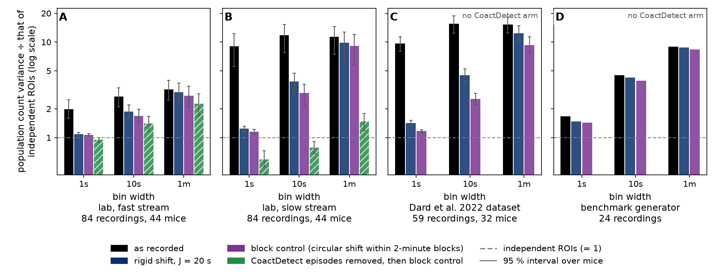
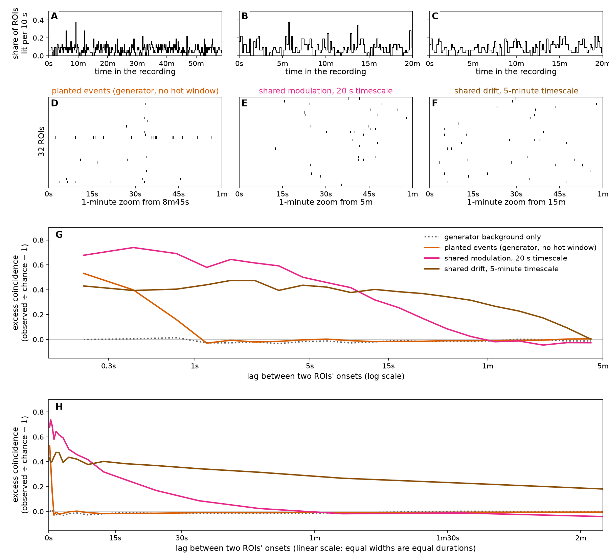
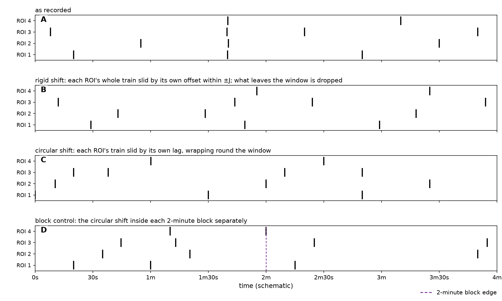
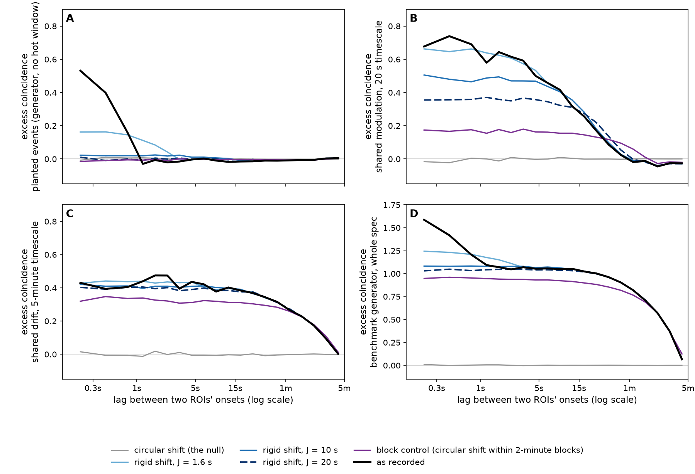

# Slow co-modulation: the recordings' shared swings in rate, and what rigid shift leaves of them

> **Why this page exists.** A detector trained without labels to tell a recording from a *rigid
> shift* of itself is paid for anything the shift destroys. Whether that includes slow, shared
> changes in rate — and whether it should — is an open decision in the label-free detector thread
> ([goal page](../../goals/unsupervised-learning.md); the question as posed is item 2 of *What
> waits on Tony* in the [rigid-shift report](../tube_self_supervised/README.md#what-waits-on-tony),
> itself not yet re-reviewed). This page shows what that slow structure is and how much of it the
> recordings hold.
>
> **Exploratory, one run, 2026-09-17, baseline windows only; nothing here is a milestone.**
> **Measured** marks a number from this run and **argued** marks reasoning nobody has measured.
> Numbers from recordings carry a 95 % interval from resampling mice; synthetic numbers do not.

## What the page finds

**Figure 1. How much more the number of onsets swings than it would if ROIs were independent.**
For each dataset, the variance of the population onset count — onsets summed over every ROI in a
bin — divided by the same variance after a circular shift has made the ROIs independent; 1 means
no shared structure. Bins of 1 s, 10 s and 1 minute. Bars: as recorded; rigid shift at *J* = 20 s;
the block control; and, on the lab folder only, CoactDetect's episodes removed and then the block
control (each defined below). Whiskers are 95 % intervals over mice; the benchmark generator has
none. Log scale.

Measured, and read off Figure 1:

- **Lab fast stream: the population count swings about 2× chance at 1 s and about 3× at 1 minute.**
  Rigid shift at 20 s takes the 1 s swing back to chance (1.98 → 1.09) but removes only about a tenth
  of the 1-minute excess (3.21 → 3.00; paired difference 0.21 [0.10, 0.34]). With CoactDetect's
  episodes removed *and* every ROI's timing scrambled within 2-minute blocks, the 1-minute swing is
  still 2.27× [1.71, 2.87]; per recording the median is 1.28×, above 1 in 69 % of recordings, and
  dropping the five recordings with the most onset pairs leaves 2.13×. **That is shared change in onset
  count at the scale of a minute or more that is not CoactDetect's events, and rigid shift leaves
  almost all of it.** What carries it — a drift in every ROI's rate, or a drift in the rate of small
  events CoactDetect does not call — and its exact timescale are not resolved within a 17–20 minute
  window.
- **Lab slow stream: the swings are mostly the events.** About 9–12× at every bin width, and 1.76× at 1
  minute once CoactDetect's episodes are removed (1.48× with the block control after; per recording
  the median is 1.06×). ⚠ A few busy recordings carry this stream: five of them hold 62 % of its onset
  pairs, and weighted that way the removal took 61 % of onsets (the median recording lost 6.8 %).
- **The [Dard et al. 2022](#published-lineage) dataset swings most:** about 15× at 1 minute, and
  still 9.3× [7.7, 11.4] under the block control. Its recordings hold a median of 566 ROIs each, so a
  small shared change per pair of ROIs becomes a large one in the count.
- **The benchmark generator the repository trains and scores on carries more slow shared swing than
  the lab fast stream** — 8.9× at 1 minute, from the whole-field dense block it plants for 5 minutes
  to catch detectors that respond to rate — and rigid shift leaves that too (8.8×).

**The decision this sets up, for Tony:** does shared change in rate over minutes belong to
**coordination**, to the **background** a detector should subtract, or to the **producer** to
explain? It sharpens the question as the rigid-shift report posed it (shared modulation on
timescales of 10–45 s): on the lab fast stream most of the shared slow structure sits at a minute or
longer, where rigid shift at 10–20 s barely touches it; a smaller component in the 10–45 s range is not
excluded. The rest of the page builds the evidence in this order: the
two kinds of shared activity, a measurement that tells them apart, what each surrogate does where
the answer is known, and then the recordings.

## Two ways ROIs are active together

The recordings are calcium imaging of hippocampal slices. An **ROI** (region of interest) is one
imaged cell; an **onset** is the half-rise time of one of its calcium transients. The producer
extracts two event **streams** from every ROI, **fast** and **slow** transients (their peaks trail the
half-rise by roughly 0.3 s and 2 s; [`export_folder_spec.md`](../../export_folder_spec.md)). An ROI is
**lit** in a bin if it has an onset there.

Two different things put many ROIs in the same stretch of a recording.

- **A coordinated event:** several ROIs have onsets within a fraction of a second of each other.
- **Shared modulation:** every ROI's onset rate rises and falls together, over tens of seconds or
  longer, without any two onsets being aligned. This page calls shared modulation slower than about a
  minute **drift**.

Both light more ROIs than independent cells would, so a detector that counts lit ROIs responds to
both. A **label-free detector** here is a model trained to score a recording above a **surrogate** of
it: a copy that keeps each ROI's own firing and destroys the relation between ROIs. The surrogate
this thread chose is **rigid shift**, which slides each ROI's whole onset train by its own random
offset within ±*J* seconds (*J*, the shift radius). It was chosen to destroy coordinated events.
What it does to shared modulation decides whether the detector is paid for that too.

## Telling them apart: the cross-correlogram

For every pair of distinct ROIs, count the pairs of onsets separated by a lag *τ*. Sum those counts
over all ROI pairs and recordings, sum the counts expected if each pair fired independently at its
own observed totals, and divide. The result minus one is the **excess coincidence** at *τ*: 0 means
no more onset pairs than chance at the window's average rates, 1 means twice as many. Plotted against
*τ* this is the population cross-correlogram, normalised by its independence level (Perkel, Gerstein
& Moore 1967). Pooling weights each recording by its number of onset pairs. **A coordinated event
makes a narrow peak** at lags shorter than its own spread; **shared modulation on a timescale *T*
makes a broad shoulder** out to lags of roughly *T*; modulation drawn separately for each ROI makes
nothing.

**Figure 2. Three synthetic kinds of activity and the shape each leaves.** Panels A–C: share of the
32 ROIs lit per 10 s bin over a whole recording. Panels D–F: a 1-minute raster from the same
recording (D is centred on a planted event). **The planted-event world** (A, D) is the repository's
own generator ([`generator_spec.json`](../generator_spec.json)) with its dense block and distractors
switched off: a per-ROI background of 0.0097 onsets per ROI per second over 3,525 s plus 15 planted
events of 3–7 ROIs. **The 20 s world** (B, E) and **the 5-minute world** (C, F) multiply every ROI's
background rate by one shared log-normal multiplier that wanders on that timescale, over 1,200 s,
with no events; their depth is chosen to be visible and fitted to nothing. Panels G and H: the
cross-correlogram of each world, pooled over 24 recordings, with the generator's background alone for
comparison, on a log lag axis (G) and a linear one (H). On the log axis a narrow peak and a
minute-wide shoulder look equally wide; H shows their real durations.

Two things in Figure 2 are easy to miss. **Shared modulation also makes sub-second coincidences**:
a busy stretch holds more onsets, and some land close together by chance, so the 20 s world starts
near +0.7 at the shortest lags with no event anywhere. And **the generator's own background reads
zero** (panel G, dotted): it varies each ROI's rate on its own.

⚠ **The excess is relative to the window's average rate.** Summed over all lags up to the window's
length it is zero by construction (Brody 1999), so a shoulder at some lags is paid back at others,
and the method cannot see a change in rate that spans the whole window.

## What the surrogates remove

**Figure 3. What each surrogate does to four onset trains** that share one aligned event near
1m40s. A schematic, drawn from fixed numbers. **Rigid shift** (B) slides each ROI's train by its own
offset and drops what leaves the window. **Circular shift** (C) slides each train by its own lag and
wraps it round the window; it removes every relation between ROIs and is the null, the reference
that reads zero. **The block control** (D) does the circular shift inside each 2-minute block
separately, so every ROI keeps its onset count in every block.

**Figure 4. Each synthetic world against every surrogate:** the planted-event world (A), the 20 s
world (B), the 5-minute world (C) and the benchmark generator with its whole spec (D). Every arm is
analysed on the same window, trimmed by 20 s at each end so rigid shift's dropped onsets never enter.
Curves are pooled over 24 recordings per world and 8 surrogate draws per recording.

Measured, from Figure 4:

- **Rigid shift spreads an event's coincidences rather than deleting them.** Two ROIs with
  independent offsets in ±*J* end up up to 2*J* apart, so the peak flattens into a low plateau
  reaching to about 2*J* (A).
- **It removes shared modulation only on timescales shorter than about *J*.** In the 20 s world the
  shortest-lag excess falls from about +0.7 to about +0.5 at *J* = 10 s and +0.35 at *J* = 20 s,
  and barely moves at 1.6 s (B). In the 5-minute world every rigid-shift curve lies on the recorded
  one (C).
- **The block control keeps any shared change in 2-minute counts, whatever made it.** It keeps most
  of the 5-minute drift (C), part of the 20 s modulation (B), and would keep events too: a block
  holding a large event holds an extra onset from each member. So "survives the block control" means
  "shared change in 2-minute counts", not "drift", unless events are removed first.
- **The benchmark generator has a shoulder of about +1.0 out to a minute** (D), from the 5-minute
  whole-field dense block its spec plants (`hot_window` 1,200–1,500 s at 0.06 onsets per ROI per
  second), and no rigid shift touches it.

## What the recordings hold

**Every dataset has a sub-second peak. The lab fast stream and the Dard et al. dataset also keep
excess out to lags of a minute and more, which rigid shift at 1.6–20 s leaves in place; on the lab
slow stream most of what looks like a shoulder goes with the events.**

**Figure 5. The recordings.** The lab export with field steps excluded — the approved export with
every onset within ±2 s of a whole-field brightness step removed
([`MILESTONES.md`](../../MILESTONES.md)) — read over each recording's declared baseline: the fast
(A, D) and slow (B, E) streams of the same 84 recordings from 44 mice, 17–20 minutes each, 26.9
hours per stream after trimming. The Dard et al. 2022 dataset (C, F): 59 recordings from 32 mice,
read whole from the first onset of any ROI, 19–25 minutes each, 22.4 hours, a median of 566 ROIs.
Top row full range, bottom row zoomed (the zoom differs per column). **CoactDetect episodes removed**
is the recording with every onset inside an episode of CoactDetect deleted: CoactDetect is the
repository's detector that flags bins where three or more distinct ROIs have onsets more often than a
circular shift within a rolling context window allows, and an episode is a run of flagged bins
(fast: 2 s bins, 60 s context, α = 10⁻⁴, as `bench.OPERATING_POINTS`; slow: 1 s bins, 120 s context,
α = 10⁻⁶, the slow point `coact_detect`'s docstring states, since no retuned slow point exists).
Shading is the 95 % interval over mice.

Measured, from Figure 5 and `summary.json`:

- **Lab fast.** The peak is +1.91 [+1.17, +3.13] at lags under 0.3 s and gone by about 1 s. A trough
  follows at 1–2.7 s (+0.03 to +0.04, below the block control, and negative with episodes removed), then
  a bump of +0.15 [+0.09, +0.24] near 3 s. From about 5 s out to a minute the shoulder is flat at +0.06
  to +0.08 and still +0.05 at 56–78 s; removing CoactDetect's episodes and then applying the block
  control leaves it at about +0.07. Removal halves the peak (+1.91 → +0.88); what remains is
  coincidence CoactDetect does not call. ⚠ Two of the arms cannot rule drift in or out on their own:
  the block control makes a flat excess from events alone (Figure 4, panel A), and rigid shift adds a
  plateau spread from the peak, so at 5–20 s the recording sits slightly *below* its own rigid shift.
  The evidence that can fail is that the recorded curve stays above zero at lags of a minute and more,
  which events at a steady rate cannot produce, and the count variance of Figure 1 after events are
  removed.
- **Lab slow.** The peak is +20.8 [+16.5, +25.8]. Onset pairs 2.7–5.4 s apart are about half as
  common as chance (−0.56 and −0.51), and that dip disappears with CoactDetect's episodes removed
  (+0.03, +0.08). The shoulder beyond 20 s, +0.10 to +0.16 as recorded, drops to about +0.05 to +0.09
  with removal. Rigid shift fills the dip in (+0.35 to +0.57 at *J* of 10 and 20 s), so a
  real-against-shifted contrast on this stream is paid for what follows an event as well as for the
  event. Without the five recordings holding the most onset pairs the dip is shallower (−0.39,
  −0.31).
- **Dard et al. dataset.** The peak is +0.78 [+0.64, +0.96] and takes about 3 s to fall; there is a
  small dip near 5 s (−0.05 [−0.09, −0.01]) and a shoulder of about +0.01 per pair out to 5 minutes,
  which the block control keeps. Per pair that is small; across 566 ROIs it is the 9× count swing of
  Figure 1.

**Why the slow stream dips — three readings, none tested.** A large synchronous event puts many ROIs
into a transient at once.

- **Extractor dead time.** The shortest interval the event extractor emits between two onsets of one
  ROI on this folder is 2.80 s, measured by a review role and not reproduced
  ([goal page](../../goals/unsupervised-learning.md)); the source attributes it to the extractor, which
  cannot split one transient into two onsets. An event's members then contribute few onsets for the
  next few seconds. The dip reaches 5.4 s, past that floor, so this cannot be the whole account.
- **A quiet interval after an event in the tissue**, which would remove onsets from every ROI, members
  or not.
- **Detection suppressed after a large transient**, a property of the extraction again.

All three need the event, so removing episodes cannot tell them apart. Splitting the lagged pairs by
whether their first ROI took part in the event would: dead time removes pairs only from members, a
network quiet interval from everyone. The Dard et al. dataset, with a different extractor, has a small
dip at the same lags (−0.05). Which reading holds is a question for the producer.

Numbers behind Figures 1 and 5

Population count variance ÷ that of independent ROIs, [95 % interval over mice]:

| dataset, arm | 1 s bins | 10 s bins | 1-minute bins |
|---|---|---|---|
| lab fast, as recorded | 1.98 [1.59, 2.48] | 2.69 [2.10, 3.33] | 3.21 [2.47, 3.97] |
| lab fast, rigid shift *J* 20 s | 1.09 [1.06, 1.13] | 1.88 [1.57, 2.21] | 3.00 [2.29, 3.74] |
| lab fast, block control | 1.07 [1.04, 1.10] | 1.69 [1.43, 1.98] | 2.75 [2.08, 3.46] |
| lab fast, episodes removed, then block control | 0.96 [0.90, 1.00] | 1.41 [1.18, 1.68] | 2.27 [1.71, 2.87] |
| lab slow, as recorded | 9.06 [5.58, 12.22] | 11.76 [7.74, 15.29] | 11.37 [7.50, 14.57] |
| lab slow, rigid shift *J* 20 s | 1.24 [1.15, 1.32] | 3.88 [2.85, 4.72] | 9.86 [6.47, 12.71] |
| lab slow, episodes removed | 0.86 [0.79, 0.92] | 1.28 [1.07, 1.48] | 1.76 [1.40, 2.14] |
| lab slow, episodes removed, then block control | 0.59 [0.49, 0.73] | 0.79 [0.68, 0.91] | 1.48 [1.19, 1.79] |
| Dard et al., as recorded | 9.69 [8.00, 11.35] | 15.54 [12.33, 18.85] | 15.23 [12.50, 18.28] |
| Dard et al., rigid shift *J* 20 s | 1.42 [1.33, 1.52] | 4.49 [3.80, 5.27] | 12.38 [10.18, 14.77] |
| Dard et al., block control | 1.17 [1.13, 1.21] | 2.54 [2.23, 2.92] | 9.33 [7.68, 11.36] |
| benchmark generator, as recorded (no interval) | 1.67 | 4.52 | 8.94 |

Removing onsets inside episodes can take a variance below 1: it empties the busiest bins. Removal took
a median of 2.5 % of each recording's onsets on fast and 6.8 % on slow; weighted as the pooled curves
weight recordings, 7.2 % on fast and 61 % on slow.

Paired differences in the 1-minute count-variance ratio, the same mice resampled for both arms:

| dataset | as recorded − rigid shift *J* 20 s | as recorded − episodes removed, then block control |
|---|---|---|
| lab fast | 0.21 [0.10, 0.34] | 0.94 [0.55, 1.37] |
| lab slow | 1.50 [0.56, 2.41] | 9.89 [6.13, 12.84] |
| Dard et al. | 2.85 [1.77, 3.95] | — |

Per recording, 1-minute count-variance ratio, median [quartiles] and share of recordings above 1:

| dataset | as recorded | episodes removed, then block control |
|---|---|---|
| lab fast | 1.52 [1.11, 2.70], 83 % | 1.28 [0.87, 1.85], 69 % |
| lab slow | 1.92 [1.09, 7.03], 80 % | 1.06 [0.81, 1.42], 55 % |
| Dard et al. | 13.34 [8.28, 19.00], 100 % | block control alone: 7.72 [4.72, 12.03], 100 % |

The five recordings with the most onset pairs hold 47 % of them on fast, 62 % on slow and 28 % on the
Dard et al. dataset; without them the 1-minute ratio after removal and block control is 2.13 on fast and
1.34 on slow.

## What this changes for the label-free thread

Argued from the figures above; nothing here was run against a trained model.

- **On the lab fast stream, rigid shift at 1.6–20 s leaves almost all of the slow shared structure in
  place.** What differs between a fast recording and its rigid shift is mainly the event peak, spread
  into a plateau, plus about a tenth of the 1-minute count excess. So for the label-free models
  trained on real recordings, change at a minute or more was at most a small part of the contrast; a
  10–45 s component, which rigid shift at 10–20 s would remove, is not excluded and not bounded here.
- **On the lab slow stream the contrast rewards the events and their aftermath at once**, the peak
  and the dip after it.
- **The label-free models trained on simulated recordings saw a large shared block** that rigid shift
  also leaves in place (Figure 4, panel D), so neither arm's contrast contained the slow structure.
- **A small displacement is not a modulation control.** Rigid shift at *J* = 1.6 s leaves drift intact
  and spreads the event peak (lab fast +1.91 → +0.44 at the shortest lags). A separate check, prompted
  by the same argument, measured it on synthetic recordings: a 10 s scorer tells an events-only
  recording from its 1.6 s shift at 0.669 and a shared-modulation-only one at 0.522
  (`tools/check_small_j_mixes_events.py` at `65285fa`, results in
  `docs/learned/tube_self_supervised/small_j_check/results.json` at `ef9fdc3`, both on the unmerged
  branch `unsup/rigid-shift-report-residuals`; its synthetic recordings use a sinusoidal modulation, not
  this page's).
- **Removing a local background removes drift.** `count_excess`, a no-training baseline on that same
  unmerged branch, subtracts a 30 s moving mean from the share of lit ROIs, which cancels change
  slower than 30 s by construction. Whether that explains its scores there — which come from
  simulated folds — is not tested here.

## The decision this sets up

**Does shared change in onset rate over minutes belong to coordination, to the background a detector
should subtract, or to the producer to explain?**

The page cannot say where the drift comes from, and that is what makes the choice real. On the slices
it could be a slow change in network state, or it could enter through the measurement — a focus or
slice-position change, bleaching, or a baseline fluorescence estimate that drifts and moves every ROI's
event threshold together. In the Dard et al. dataset, recorded in awake pups, the authors tie the
activity to the animals' own movement, which is a published candidate. Facts about the preparation
are not this repository's to derive: FOUNDATIONS §9 defers them to the global `syncytium2/foundations`
FOUNDATIONS §15, and questions about extraction are a conversation with the producer. ⚠ No record in
this tree says anyone has asked the producer, or the Dard et al. authors, about shared slow drift.

## What this does not settle

- **The excess is relative to each window's own average rate**, so structure spanning a whole
  recording is invisible, and a shoulder here is paid back at longer lags.
- **CoactDetect removal both misses and over-removes.** It needs three or more ROIs, so two-ROI
  coincidences and events too weak for its test stay, and it removes every onset inside an episode,
  member or not. The emptied episodes are gaps shared by every ROI, a small shared modulation of their
  own: weighted as the pooled curves weight recordings they cover 1.3 % of the time on fast and 4.4 % on
  slow.
- **The timescale and the carrier of the slow structure are not resolved.** Shared modulation on a 1-
  or 2-minute timescale, or coordinated events whose rate drifts over minutes, would also leave excess
  at a minute's lag that the block control keeps; how late the curve fades is set as much by the
  window's own average as by the drift.
- **The synthetic modulation is deep for visibility**: the 20 s and 5-minute worlds reach about +0.4 to
  +0.7 excess, five to ten times the lab fast shoulder.
- **The block control keeps shared 2-minute counts from any source**, events included; the lab
  claims rest on the arm that removes episodes first.
- **The count variance** uses full bins only and whole-window means, the same caveat as the excess.
- **Eight surrogate draws** per recording per arm; surrogate curves pool counts over draws, and their
  intervals over mice include draw noise.
- **The two folders differ in more than size.** The Dard et al. dataset is in vivo, in pups, and its
  onset is the first frame of an inferred active run, not a half-rise
  ([`tools/import_dandi.py`](../../../tools/import_dandi.py)), so compare shapes across folders, not lags
  to the second.
- **The field-step exclusion leaves a 4 s gap across all ROIs** where a step fell inside a baseline
  window: three recordings, about 12 s in 27 hours.
- **Baseline only, by rule.** Nothing here says what treatment does to the peak or the drift.
- **Group** is shown in Figure 6, below; pooled numbers above are not admissible on their own
  (FOUNDATIONS §9).

## By group

**Figure 6. The lab streams split by group:** as recorded (A fast, B slow) and with CoactDetect's
episodes removed and then the block control (C fast, D slow). Solid: pooled over recordings, as
everywhere else. Dashed: each mouse weighted equally. The groups are DI, MALE, ORX and OVX as the export
labels them. ⚠ Their expansions — diestrus females, intact males, orchidectomised males,
ovariectomised females — are the conventional readings and are not written down in this repository.

**The pooled group curves are dominated by one mouse each** — the heaviest mouse carries 37–48 % of a
group's onset pairs on the fast stream — so a group curve is close to one animal's, and the
equal-weight curves wander. On the fast stream every group's pooled curve sits in a similar low band
after removal and blocking, and so does every group's on the slow stream except MALE's equal-weight
curve. ⚠ Group cannot be separated from imaging day on this export: no imaging date holds more than
one group ([recording identity](../recording_identity.md)). So Figure 6 shows that the pooled result is
not one group's; it does not show a group difference.

## Published lineage

The phenomenon is old; what is new here is the measurement on these recordings.

- Shared rate changes of independent neurons elevate the cross-correlogram near zero lag, and a linear
  trend elevates it flat: Perkel, Gerstein & Moore 1967, *Biophys J* 7:419–440,
  doi:10.1016/S0006-3495(67)86597-4, p. 428. Covariation in excitability produces correlogram peaks that
  look like synchrony, and the correlogram integrates to the count covariance: Brody 1999, *Neural
  Comput* 11:1537–1551, doi:10.1162/089976699300016133. Slow common fluctuations produce zero-lag
  counts: Amarasingham, Harrison, Hatsopoulos & Geman 2012, *J Neurophysiol* 107:517–531,
  doi:10.1152/jn.00633.2011. Shared slow trends produce nonsense correlations, and circular shifting
  gives false positives under them: Harris 2021, bioRxiv doi:10.1101/2020.11.29.402719 (preprint).
- Rigid shift is whole-train dithering; "firing rates are smoothed on the timescale of the dither
  width" is Louis, Borgelt & Grün 2010, §17.3.3 (in *Analysis of Parallel Spike Trains*, Springer), who
  credit Pipa et al. 2008 and Harrison & Geman 2009. This page drops what leaves the window and trims,
  where Louis et al. roll the train, and shifts by 1.6–20 s, where the ranking in Stella et al. 2022
  used 25 ms.
- Holding each train's count fixed in fixed windows and randomising timing inside them is interval
  jitter (Date, Bienenstock & Geman 1998; Amarasingham et al. 2012). CoactDetect's own null is the same
  idea on a rolling window, which is one reason its episodes do not contain drift slower than that
  window.
- The Dard et al. 2022 dataset: in vivo two-photon calcium imaging of CA1 in mouse pups (P5–P12), Dard
  et al. 2022, *eLife* 11:e78116, doi:10.7554/eLife.78116; data DANDI:000219 (Dard, Picardo & Cossart),
  CC-BY-4.0, imported by `tools/import_dandi.py`. Its authors detect synchronous events against a
  per-cell circular shift.

## Reproduce

| step | command | output |
|---|---|---|
| measure | `python tools/measure_slow_comodulation.py` | `results.json` (per recording) and `summary.json` (pooled, no identifiers) in `<darkroom>/bugarach/2026-09-17-slow-comodulation/` |
| draw | `python tools/make_slow_comodulation_figure.py --run <that folder> --also docs/learned/slow_comodulation` | the six figures, into the same darkroom folder and here |

`summary.json` beside this page is the run's pooled output, with the paired and per-recording checks
under `checks`. The measurement took about 3 minutes on 8 workers; `--resummarise` rebuilds the summary
from an existing `results.json`. The tests, `tests/test_measure_slow_comodulation.py`, check the pair
count against a brute-force count out to 300 s of lag; that a fixed lag lands in its bin; that the block
control keeps each ROI's count per block; that rigid shift moves each ROI by one whole-frame offset and
drops what leaves the window; the count variance; and that the generator's background reads zero while
its planted events, its dense block and the 20 s world do not. They also check the circular arm reads
zero in every lag bin, which holds by construction and tests the arithmetic, not the estimator.
