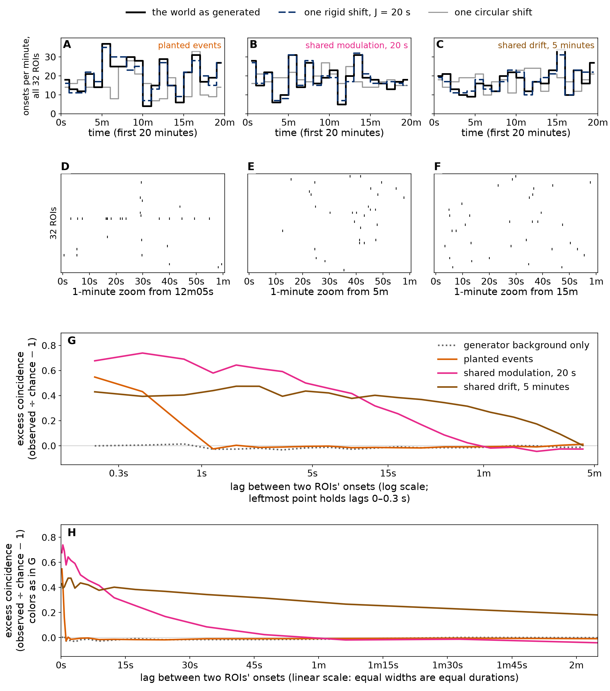
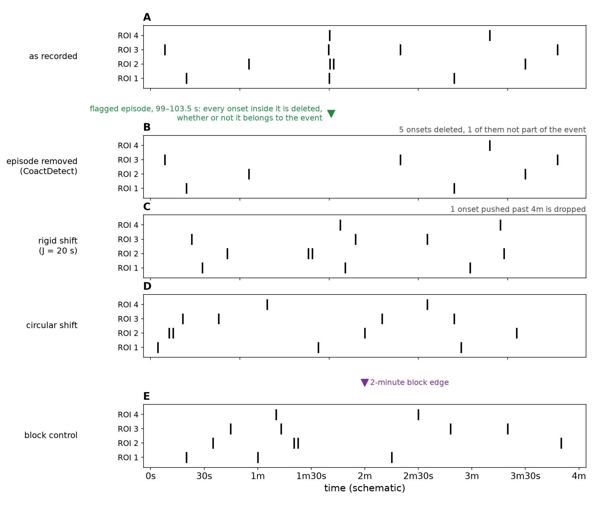
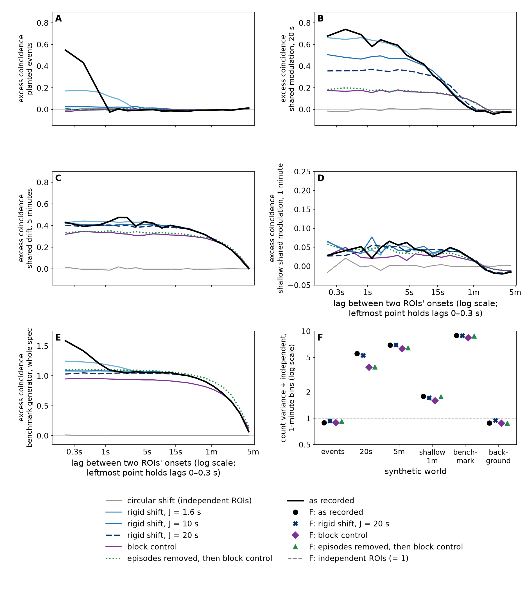
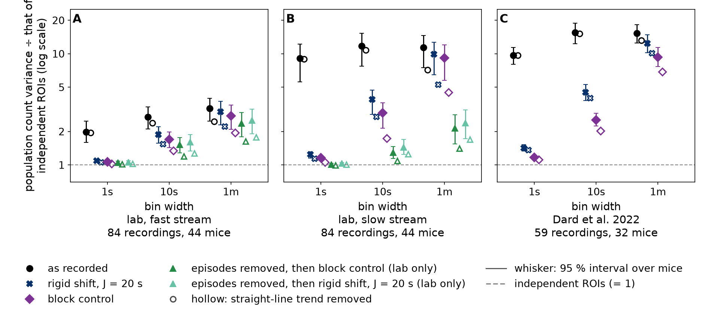
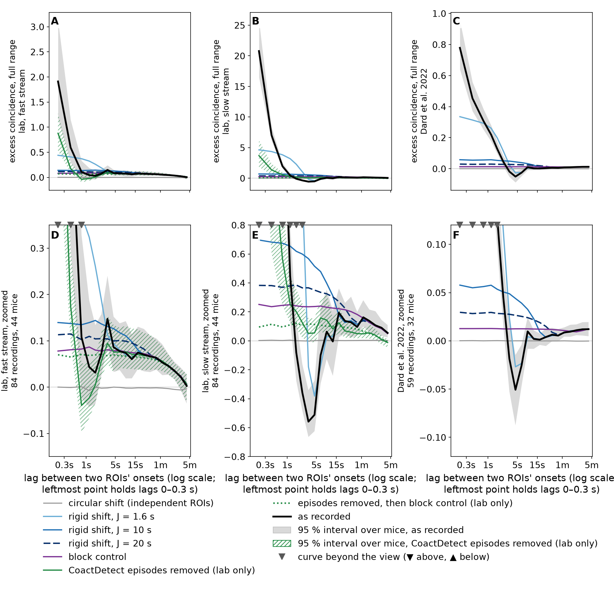
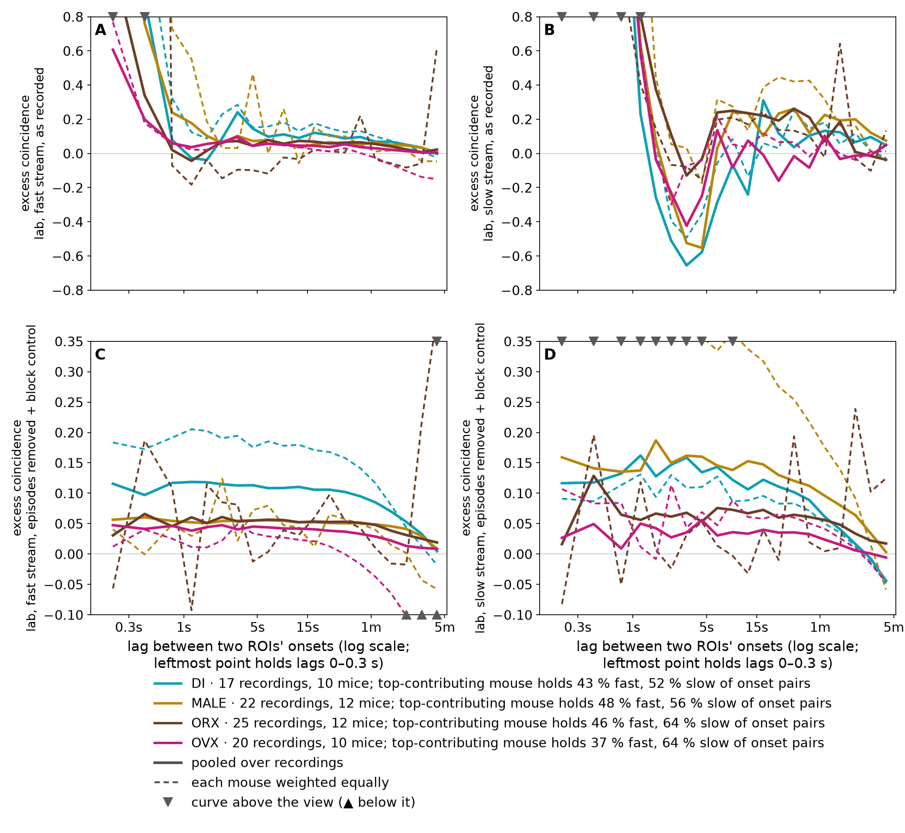

# Slow shared modulation: shared change in onset rate across ROIs, and what rigid shift leaves of it

> ## ⚠ STOP — the real-recording numbers on this page are on hold
>
> The export folder this page reads carries a contamination its own note declares and no column
> marks: non-rigid motion correction pinned 12 ROIs to the frame floor in four recordings. A
> frame-floor-pinned ROI is a **cross-cell** artifact, which is the same thing this page measures,
> so it is not a distant risk — it imitates the signal.
>
> **This run should not have happened over it.** The note was filed as a todo on 2026-09-10 and
> rediscovered by reviews three times before this page shipped; each time it was written down as a
> caveat instead of put to the producer. It is now a question on the producer's side, and the code
> refuses: `dataset.current()` stops any analysis reading a folder whose note declares a
> contamination nothing flags (Tony's ruling, 2026-09-17).
>
> **Until the producer answers, do not lean on any real-recording number here.** The synthetic
> results (Figures 1–3) never read the export folder and are unaffected. What is measured about the
> four: they change nothing on the fast stream (pooled 2.37 with, 2.38 without) and carry 19 % of
> the slow stream's pooled excess. All four are DI, the group that reads highest, so **the by-group
> reading is the part to trust least** — see [By group](#by-group). The count of four may be a
> floor: an open producer-side todo ranks two further recordings beside them.
>
> **The worry.** A detector can be trained with no labels by asking it to score a recording above a
> **surrogate** of that recording — a copy that keeps each cell's own activity and destroys the
> relation between cells. The model is paid for whatever the surrogate destroys, and for nothing
> else. This project's surrogate is the **rigid shift**: every cell's whole train of events slid by
> its own random offset, at most *J* seconds. It was chosen to destroy coordinated events. But if
> the recordings also hold slow, shared rise and fall in how often cells fire, and a rigid shift
> leaves that alone, then it sat unchanged on both sides of the comparison and the models were never
> graded on it. Those models did not beat random initialization
> ([goal page](../../goals/unsupervised-learning.md)), so what the comparison actually paid for is
> worth knowing before the next one is built. This page measures the shared change in the
> recordings.
>
> **The question moved, and this page says where it went.** The
> [rigid-shift report](../tube_self_supervised/README.md#what-waits-on-tony) asks whether shared
> modulation over **10–45 s** counts as coordination. Measuring it, the larger shared change sits at
> **a minute or more**, which a shift of at most 20 s cannot move. The 10–45 s band is the part a
> rigid shift does remove, and this page does not separate it from spread-out events; it stays open,
> and it is stated again at the end.
>
> **Exploratory, one run, 2026-09-17, baseline windows only; nothing here is a milestone.**
> **Measured** marks a number from this run, **argued** marks reasoning nobody has measured. Pooled
> numbers from recordings carry a 95 % interval from resampling mice. Per-recording numbers are
> single values. Synthetic numbers are quoted as point values; their intervals over the 24 simulated
> recordings are in `summary.json`.

## The short answer

- **Every dataset holds both kinds of shared activity**: coordinated events a fraction of a second
  wide, and shared change in onset rate over a minute or more.
- **On the lab fast stream the minute-scale part survives every control, at about a third of its
  recorded size.** The population onset count in 1-minute bins varies 3.21 times [2.47, 3.97] as
  much as it would if cells were independent; with the events found by **CoactDetect** (the
  repository's detector for stretches where three or more cells are active together) deleted, and
  each cell's timing then scrambled inside 2-minute blocks, 2.37 [1.79, 2.95]. The median recording
  sits at 1.29 and 75 % of recordings are above 1, against a chance reference of about 51 %.
- **On the lab slow stream most of the shared activity is the events**: 11.37 as recorded, 2.55 with
  the episodes deleted. What is left, 2.13 [1.54, 2.83], is close to the fast stream's.
- **In the Dard et al. 2022 dataset** (a different preparation, in living mouse pups) the count
  varies far more — 15.23 [12.50, 18.28] — but **per pair of cells it is the weakest of the three**:
  0.024, against 0.077 on the lab fast stream and 0.157 on the slow. It reads large because it
  images many more cells at once. No event-removal arm was run on it, so how much of it is slow
  change rather than events is not separated.
- **The benchmark generator this repository trains and scores on holds more minute-scale shared
  change than the lab fast stream** (8.94), from the 5-minute stretch of raised rate it plants.
- **For the label-free models:** a rigid shift at 1.6–20 s leaves minute-scale change in place. That
  much is **argued** — a shift of at most *J* cannot move onsets between bins many times wider than
  *J*, so no recording could have shown otherwise. The **measured** part is what remains once the
  events are gone: with the episodes deleted, a rigid shift at *J* = 20 s still leaves 2.52 of 2.56
  on the fast stream and 2.39 of 2.55 on the slow. So the slow shared change was on both sides of
  the training comparison, and what the comparison paid for was the events and structure faster than
  about 40 s.

**The decision this sets up** is [at the end](#the-decision-this-sets-up): whether shared change in
onset rate over a minute or more is coordination, background to subtract, or the producer's to
explain.

## Two ways ROIs are active together

An **ROI** (region of interest) is one imaged cell; an **onset** is the moment one of its calcium
transients begins. An ROI is **lit** in a bin of time if it has an onset there.

- **A coordinated event:** several ROIs have onsets within a fraction of a second of each other.
- **Shared modulation:** every ROI's onset rate rises and falls together, over tens of seconds or
  longer, without any two onsets being aligned. **Drift** here means shared modulation over a minute
  or more.

Both light more ROIs at once than independent cells would, which is why a detector cannot tell them
apart by counting lit cells alone.

**Figure 1, the two kinds.** Three simulated worlds, where the answer is known by construction. The
**planted-event world** (A, D) is the repository's own generator
([`generator_spec.json`](../generator_spec.json)) with its whole-field dense block and distractors
switched off: 32 ROIs whose rates vary around a mean of 0.0097 onsets per ROI per second, plus 15
planted events of 3–7 ROIs. The **20 s world** (B, E) and the **5-minute world** (C, F) give 32 ROIs
a flat rate of the same mean, multiplied by a single shared multiplier that wanders on that
timescale with no events at all; the multiplier is log-normal and swings by a factor of about 4 from
trough to peak in B and C. A–C: the population onset count per minute over the first 20 minutes, for
the world as generated, one rigid shift of it and one circular shift of it — **the rigid shift
follows the minute-to-minute swings in all three worlds, and the circular shift does not.** D–F: a
1-minute raster (D is centered on a planted event; its densest row is one high-rate ROI, not a
second kind of structure). G and H: the cross-correlogram of each world, defined in the next
section, pooled over 24 simulated recordings, with the generator's background alone for comparison,
on a log lag axis (G) and a linear one (H). On the log axis a narrow peak and a minute-wide shoulder
look equally wide; H shows their true durations.

## Two measurements

**The count-variance ratio** asks *how much* shared activity there is, and it is the headline number
on this page. Sum the onsets of every ROI in each bin, take the variance of that population count
over the window, and divide by the same variance after a **circular shift** of the same onsets —
each ROI's train slid by its own lag and wrapped around the window, which destroys every relation
between ROIs at every timescale. **1 means no shared structure at that bin width**, and it is what a
detector that counts lit ROIs responds to. It is a circular-shift version of Pielou's and Schluter's
variance ratio, and in neuroscience it is *N* times the Golomb–Rinzel synchrony measure χ²: it grows
roughly as 1 + (number of ROIs − 1) × the mean correlation between two ROIs' counts, so a dataset
with more ROIs reads larger at the same per-pair correlation (Zohary, Shadlen & Newsome 1994). That
is why this page also reports the per-pair correlation directly.

**The excess coincidence** asks *at what lag* the shared activity sits. Count the pairs of onsets in
two different ROIs separated by a lag *ℓ*, summed over all ROI pairs and recordings; divide by the
count expected if each pair fired independently at its own totals over the window; subtract one.
**The lag is unsigned** — a pair 3 s apart counts at *ℓ* = 3 s whichever ROI fired first — so the
plot runs from 0 outward rather than being symmetric about 0. Plotted against *ℓ* this is the
population cross-correlogram normalized by its independence level (Perkel, Gerstein & Moore 1967). 0
means no more onset pairs than chance at the window's average rates. **A coordinated event makes a
narrow peak**; **shared modulation on a timescale *T* makes a broad shoulder** out to lags near *T*
(Figure 1, panels G and H). Shared modulation also raises the shortest lags, because a busy stretch
holds more onsets and some land close together by chance.

The two measurements are the same thing seen two ways: the count variance at bin width *w* weights
the correlogram out to lag *w* by a triangle, (*w* − |*ℓ*|) (Bair, Zohary & Newsome 2001), and the
ratio grows with *w* when slow shared change is present (Kass & Ventura 2006), which is what the bin
sweep in Figure 4 shows.

⚠ **Both are relative to the window's own average**, and the window is 17–25 minutes. The excess
*onset pairs* summed over every lag up to the window's length is zero by construction, because
chance is set from the window's own totals, so a peak somewhere forces a deficit elsewhere. A change
that spans the whole window is only partly visible to the excess coincidence.

⚠ **Removing a straight line is not a test for a trend.** The page reports every ratio again after
fitting and removing each recording's straight-line trend, and that number is lower — but a
least-squares line over 16 to 19 bins also absorbs the slow part of any wander. The calibration is
in this run's own worlds: the **5-minute world is stationary by construction and has no trend**, and
detrending still takes it from 6.95 to 5.04, losing 32 % of its excess — the same share the lab fast
stream loses (3.21 to 2.46, 34 %). So the detrended column says what survives a straight-line fit,
not what is left after a trend is removed. Harris (2021) lists detrending beside circular shifting
among methods that inflate false positives in significance testing.

## What the surrogates remove

Four treatments of the same recording appear throughout, each divided by a null chosen to share
everything with it except the structure under test:

- **Rigid shift** — each ROI's whole train slid by its own offset drawn within ±*J* seconds, onsets
  pushed past either end dropped. The thread's surrogate, and the reason for this page.
- **Circular shift** — each train slid by its own lag and wrapped around the window. The null for
  everything else.
- **The block control** — the circular shift done inside each 2-minute block separately, so every
  ROI keeps its onset count in every block. ⚠ It is registered as a known-bad control: every block
  acquires a seam, and it keeps shared change in block counts **from any source, events included**.
- **Episode removal** — CoactDetect flags stretches where three or more ROIs are active together
  more often than a local circular shift allows; every onset inside a flagged **episode** is
  deleted, whether or not it belongs to the event.

**The null for episode removal has to carry the same holes.** Deleting every onset inside an episode
cuts gaps that are shared across ROIs, so a null that scatters each ROI's gaps to its own phase
scores those gaps as shared change. The null used here shifts each ROI circularly **within the
stretches no episode covers**, which keeps both its onset count and the shared gaps. The earlier,
mismatched null — the circular shift of the already-deleted trains — reads about 2 % higher on these
data (lab fast 2.42 against 2.37, lab slow 2.17 against 2.13, both at 1-minute bins), and the
direction is confirmed in a test where the truth is known: with events removed from otherwise
independent trains, the matched null reads 1.00 and the mismatched one 1.25.

**Figure 2, the surrogates drawn.** A schematic on fixed numbers: four onset trains over 4 minutes
that share one aligned event near 1m40s (A). **Episode removal** (B) deletes every onset inside the
flagged episode marked in the lane above, including one that is not part of the event. **Rigid
shift** (C) slides each train by its own offset within ±*J* and drops what leaves the window.
**Circular shift** (D) slides each train by its own lag and wraps it around. **The block control**
(E) does the circular shift inside each 2-minute block separately; the lane above marks the block
edge.

**Figure 3, what the surrogates remove.** Correlograms of the planted-event world (A), the 20 s
world (B), the 5-minute world (C), a **shallow 1-minute world** (D) whose depth gives a shoulder
near the lab fast stream's, and the benchmark generator with everything switched on (E), each
against every treatment, pooled over 24 simulated recordings and 8 surrogate draws per recording. F:
the 1-minute count-variance ratio of every world and treatment, with the generator's background
alone. Every treatment is measured on the same window, trimmed by 20 s at each end so onsets a rigid
shift drops never enter; the y-scale differs per panel and is named in each label.

Measured, from Figure 3, what the surrogates remove:

- **A rigid shift spreads an event's coincidences rather than deleting them** (A): the planted-event
  world's short-lag excess falls from +0.49 to +0.17 at *J* = 1.6 s and to about 0 at *J* = 10 s,
  while a low plateau appears out to about 2*J*.
- **A rigid shift removes shared modulation only faster than about *J***, which Pipa et al. 2008 and
  Louis, Borgelt & Grün 2010 state as a property of whole-train dithering (B–D): in the 20 s world
  the short-lag excess falls from +0.71 to +0.65 at *J* = 1.6 s, +0.49 at *J* = 10 s and +0.36 at
  *J* = 20 s; in the 5-minute and shallow 1-minute worlds every rigid-shift curve lies on the
  recorded one.
- **So at 1-minute bins a rigid shift leaves shared change in place whatever made it** (F): the 20 s
  world keeps 5.25 of 5.53, the 5-minute world 6.93 of 6.95, the shallow 1-minute world 1.71 of
  1.79. Surviving a rigid shift at that bin width says nothing about what carries the change.
- **The block control keeps most minute-scale change and part of the faster kind** (B–D, F): the
  5-minute world keeps 6.27 of 6.95 and the shallow 1-minute world 1.58 of 1.79, while the 20 s
  world drops to 3.85 of 5.53.
- **Episode removal does not leave an event-free world untouched; it nudges the ratio up** (F): the
  shallow 1-minute world goes from 1.79 to 2.01, a quarter of that world's whole excess, and the
  5-minute world from 6.95 to 7.06, while it deletes 1.1–5.0 % of onsets. The lab difference between
  the block control alone and removal-then-block control (2.75 to 2.37 on the fast stream) is
  therefore about the size of what removal does with no events present at all.
- **The benchmark generator has a shoulder of about +1.0 out to a minute** (E) and a 1-minute ratio
  of 8.94, from the 5-minute block in which every ROI's rate is raised by 0.06 onsets per second
  (from 1,200 s to 1,500 s, after a 30 s ramp). Its background alone reads 0.88, below 1, because
  the generator steps each ROI's rate on fixed 300 s and 60 s grids and the 20 s trim puts the
  1-minute bins out of phase with them; switch the grid off and it reads 1.01, align the window to
  it and 1.20. So the offset is a phase effect whose sign depends on the window, not a fixed
  correction.

## What the recordings hold

**The data.** The lab recordings are calcium imaging of hippocampal slices, exported with every
onset within ±2 s of a whole-field brightness step removed
([`MILESTONES.md`](../../MILESTONES.md)) and read over each recording's baseline, the stretch before
any treatment. The **producer** — the lab's pipeline that extracts events and writes the export —
gives every ROI two event **streams**, **fast** and **slow** transients, whose peaks trail the onset
by roughly 0.3 s and 2 s respectively
([`export_folder_spec.md`](../../export_folder_spec.md)). The **Dard et al. 2022 dataset** is a
second folder: non-anesthetized mouse pups aged 5–12 days, imaged in hippocampal area CA1, with a
different event inference and hundreds of ROIs per recording (see
[Published lineage](#published-lineage)).

**Figure 4, how much the count varies.** The count-variance ratio of the lab fast stream (A), the
lab slow stream (B) and the Dard et al. 2022 dataset (C) at 1 s, 10 s and 1-minute bins, as recorded
and under each treatment (the removal arms are lab-only). Markers are offset sideways within each
bin width for legibility. Filled markers: raw, with whiskers for the 95 % interval over mice. Hollow
markers: after removing each recording's straight-line trend, which the section above shows is not a
trend test. The lab folder: 84 recordings from 44 mice, 17–20 minutes each, the fast and slow
streams of the same recordings. The Dard et al. dataset: 59 recordings from 32 mice, read whole from
the first onset of any ROI, 19–25 minutes, a median of 566 ROIs. The published dataset has 62
sessions from 35 pups; why three are absent from this folder is not recorded here.

**Figure 5, the recordings' correlograms.** Excess coincidence of each dataset at full range (A–C)
and zoomed (D–F; the zoom differs per column and is named in each label). Shaded: 95 % interval over
mice for the recording as it is; hatched: the same with episodes removed. CoactDetect runs at the
repository's calibrated operating point — 2 s bins, a 60 s window of nearby time for its own
reference, per-bin significance level α = 10⁻⁴, episodes merged across gaps up to 3 s. ⚠ That point
was calibrated on the fast stream and is applied unchanged to the slow stream, where no point is
calibrated; at the slow viewer's documented setting the removal-then-block ratio reads 2.31 rather
than 2.13. A small down-pointing mark at a panel's edge means a curve leaves the view there.

Measured, from Figures 4 and 5 and `summary.json`:

- **Lab fast stream: a small shoulder that survives every control.** It runs at +0.06 to +0.08 from
  about 5 s to a minute and is still +0.05 at 78–110 s, and removal and blocking leave it there. The
  event peak is +1.91 [+1.17, +3.13] at lags under 0.3 s, halved to +0.88 by removal. The count
  varies 3.21 [2.47, 3.97] times the independent level at 1-minute bins, 2.37 [1.79, 2.95] with
  episodes removed and the block control. Per recording that last ratio has a median of 1.29 and is
  above 1 in 75 % of recordings, where an 8-draw circular reference scored the same way is above 1
  in 51 %; detrended, the median is 0.99. ⚠ There is also an unexplained bump at 2.7–3.8 s
  (+0.147 [+0.087, +0.240]) that moves to 3.8–5.4 s when mice are weighted equally.
- **Lab slow stream: the events dominate, and what is left resembles the fast stream.** The event
  peak is +20.8 [+16.5, +25.8] and the 1-minute count varies 11.37 times as recorded; removing
  episodes takes that to 2.55, and the block control after it to 2.13 [1.54, 2.83] (1.40 detrended;
  per-recording median 1.16, above 1 in 64 % against a 50 % reference). ⚠ The stream leans on a few
  busy recordings: five hold 62 % of its expected onset pairs, and removal took 64 % of onsets
  weighted that way against 8.8 % in the median recording.
- **Dard et al. dataset: much larger in total, weakest per pair.** The event peak is +0.78
  [+0.64, +0.96] and falls over about 3 s. The count varies 15.23 [12.50, 18.28] times at 1-minute
  bins and 9.33 under the block control, and exceeds 1 in every recording. But the mean correlation
  between two active ROIs' 1-minute counts is 0.024, against 0.077 on the lab fast stream and 0.157
  on the slow, and 98 % of its ROIs are active against 59–60 % in the lab folder. **The dataset
  reads larger because it images more ROIs, not because each pair is more strongly related.** No
  episode-removal arm was run on it, so events and slow change are not separated there.
- **The pooled intervals rest on few effective mice.** Weighted as the correlograms weight
  recordings, 12.7 on the fast stream, 7.7 on the slow and 17.5 on the Dard et al. dataset; weighted
  as the count variance weights them, 24.7, 23.1 and 24.4, and 24.2 and 29.4 for the removal arms.
  ⚠ At that few clusters a percentile bootstrap tends to cover less than its nominal 95 %, so these
  intervals are likely a little too narrow (MacKinnon & Webb 2017).

Numbers behind Figures 4 and 5

Count-variance ratio, raw [95 % interval over mice] · after removing a straight-line trend:

| dataset, treatment | 1 s bins | 10 s bins | 1-minute bins |
|---|---|---|---|
| lab fast, as recorded | 1.98 [1.59, 2.48] · 1.94 | 2.69 [2.10, 3.33] · 2.38 | 3.21 [2.47, 3.97] · 2.46 |
| lab fast, rigid shift *J* 20 s | 1.09 [1.06, 1.13] · 1.05 | 1.88 [1.57, 2.21] · 1.54 | 3.00 [2.29, 3.74] · 2.22 |
| lab fast, block control | 1.07 [1.04, 1.10] · 1.03 | 1.69 [1.43, 1.98] · 1.34 | 2.75 [2.08, 3.46] · 1.95 |
| lab fast, episodes removed | 1.37 [1.23, 1.54] · 1.33 | 1.74 [1.46, 2.03] · 1.42 | 2.56 [1.92, 3.21] · 1.82 |
| lab fast, episodes removed, then block control | 1.05 [1.02, 1.08] · 1.02 | 1.52 [1.29, 1.76] · 1.20 | 2.37 [1.79, 2.95] · 1.63 |
| lab fast, episodes removed, then rigid shift *J* 20 s | 1.06 [1.03, 1.09] · 1.02 | 1.60 [1.33, 1.87] · 1.27 | 2.52 [1.90, 3.17] · 1.77 |
| lab slow, as recorded | 9.06 [5.58, 12.22] · 8.97 | 11.76 [7.74, 15.29] · 10.79 | 11.37 [7.50, 14.57] · 7.12 |
| lab slow, rigid shift *J* 20 s | 1.24 [1.15, 1.32] · 1.14 | 3.88 [2.85, 4.72] · 2.71 | 9.86 [6.47, 12.71] · 5.30 |
| lab slow, block control | 1.16 [1.09, 1.22] · 1.06 | 2.94 [2.14, 3.63] · 1.74 | 9.14 [5.75, 12.04] · 4.50 |
| lab slow, episodes removed | 1.50 [1.25, 1.78] · 1.48 | 2.07 [1.58, 2.58] · 1.89 | 2.55 [1.80, 3.41] · 1.86 |
| lab slow, episodes removed, then block control | 1.01 [1.00, 1.03] · 1.00 | 1.29 [1.14, 1.47] · 1.09 | 2.13 [1.54, 2.83] · 1.40 |
| lab slow, episodes removed, then rigid shift *J* 20 s | 1.03 [1.01, 1.05] · 1.01 | 1.45 [1.24, 1.69] · 1.26 | 2.39 [1.72, 3.11] · 1.70 |
| Dard et al., as recorded | 9.69 [8.00, 11.35] · 9.64 | 15.54 [12.33, 18.85] · 15.18 | 15.23 [12.50, 18.28] · 13.15 |
| Dard et al., rigid shift *J* 20 s | 1.42 [1.33, 1.52] · 1.36 | 4.49 [3.80, 5.27] · 3.99 | 12.38 [10.18, 14.77] · 10.09 |
| Dard et al., block control | 1.17 [1.13, 1.21] · 1.11 | 2.54 [2.23, 2.92] · 2.02 | 9.33 [7.68, 11.36] · 6.85 |

Per recording, 1-minute ratio: median, share of recordings above 1, detrended median. Recordings are
the unit here, 84 from 44 mice on the lab folder. Chance references, scored the same way: a single
circular draw against an 8-draw mean is above 1 in 45 % (lab fast), 45 % (lab slow) and 40 %
(Dard et al.) of recordings; an 8-draw mean against another, which is the right reference for the
averaged treatments, in 51 %, 50 % and 54 %.

| dataset | as recorded | episodes removed, then block control |
|---|---|---|
| lab fast | 1.52, 83 %, 1.18 | 1.29, 75 %, 0.99 |
| lab slow | 1.92, 80 %, 1.50 | 1.16, 64 %, 0.99 |
| Dard et al. | 13.34, 100 %, 11.16 | block control alone: 7.72, 100 %, 5.69 |

Dropping the five recordings each treatment leans on most — by its own null's 1-minute variance —
leaves the removal-then-block ratio at 2.21 on the fast stream and 2.29 on the slow. Removal took a
median of 2.5 % of each recording's onsets on fast and 8.8 % on slow; weighted as the correlograms
weight recordings, 7.2 % and 64 %. The emptied episodes cover 1.3 % of the time on fast and 7.5 % on
slow, weighted the same way.

### Why the slow stream dips — an aside, three readings

A large synchronous event puts many ROIs into a transient at once, and onset pairs 2.7–5.4 s apart
are then about half as common as chance on the slow stream (−0.56, −0.51). The dip goes with the
episodes (+0.05, +0.05 once they are removed). A rigid shift at *J* = 10 s and 20 s fills it in
(+0.35 to +0.57); **at *J* = 1.6 s it does not** (−0.18, −0.38).

- **Extractor dead time.** On the slow stream the shortest interval between two onsets of one ROI is
  2.80 s, and such intervals stay depleted out to about 5.4 s: pooled over ROIs there are 15
  within-ROI intervals per second of interval width at 2.8–3.4 s, 95 at 3.4–4.0 s, 333 at 4.0–4.6 s
  and 771 at 4.6–5.4 s, against about 1,050 beyond. This repository attributes that floor to the
  extractor, which cannot split one transient into two onsets; the producer has not been asked
  ([todo](../../todo/2026-09-10-the-dead-time-floor-is-the-producers-number.md)). The depletion ends
  where the dip ends.
- **A quiet interval in the tissue itself after an event**, which would remove onsets from every ROI.
- **Detection suppressed after a large transient**, a property of the extraction again.

Splitting the lagged pairs by whether their first ROI took part in the event would separate the two
extraction readings, which remove pairs only from members, from a quiet interval in the tissue,
which removes them from every ROI. The Dard et al. dataset, with a different event inference, has a
smaller dip at the same lags (−0.05 [−0.09, −0.01]).

## By group

**Figure 6, by group.** The lab streams split by the export's group labels, as recorded (A fast, B
slow) and with episodes removed then the block control (C fast, D slow; y-scale named in each
label). Solid: pooled over recordings. Dashed: each mouse weighted equally. The labels are DI, MALE,
ORX and OVX, written as the export writes them; this repository reads them as intact females in
diestrus, intact males, orchidectomized males and ovariectomized females
([`proposals/2026-09-10-surrogate-evaluation-overnight.md`](../../proposals/2026-09-10-surrogate-evaluation-overnight.md)),
a reading the export contract does not state.

**The minute-scale change is uneven across groups and largest in DI, and it is present in all four.**
On the fast stream, after removal and blocking, DI's pooled curve sits at about +0.11 from 5 s to
30 s against +0.04 to +0.05 for the other three, and its 1-minute ratio is 2.73 against OVX 2.58,
MALE 1.89 and ORX 1.74 (per-recording medians 1.84, 1.23, 1.26, 1.16). On the slow stream MALE sits
highest (+0.14 and 2.89) with DI next (+0.12 and 1.97). ⚠ No group contrast is tested here: there is
no effect size, no interval and no model for any group difference, and the mouse contributing the
most onset pairs holds 37–48 % of its group's pairs on the fast stream and 52–64 % on the slow, so
every group curve leans on one animal (6.2 to 9.1 effective mice per group). ⚠ Group cannot be
separated from imaging day on this export — no imaging date holds more than one group
([recording identity](../recording_identity.md)) — so these are differences between groups of
recordings, not group differences.

**A different measure on the same recordings orders the groups the same way.** The rigid-shift
report's run counts how often a detector's events hold three or more ROIs, which is a detector's
call rate rather than a count variance, and it puts ORX lowest and DI highest by a wide margin
(0.46–0.50 against 0.92–0.96 for its supervised detectors, with the same ordering for the
hand-written references and for a counter with no fitted parameters). This is worth knowing and is
not extra evidence: it is the same 84 recordings seen through another statistic, so it says the
ordering is in the recordings rather than in the count-variance ratio — and it says nothing at all
about the imaging-day confound, which both measures share.

⚠ **It also shares an artifact, and the artifact sits at the top of the ordering.** All four
recordings with the known motion-correction contaminant are DI, the group both measures rank
highest, and a frame-floor-pinned ROI is exactly the cross-cell artifact both measures respond to.
On this page's measure the four do not account for DI's fast-stream height — dropping them leaves DI
at 2.81 rather than 2.73, slightly higher — but they do account for much of its slow-stream figure,
which falls from 1.97 to 1.49. Whether the same holds for the detector call rate cannot be checked:
reruns over that folder are stopped until the producer answers. Until then **neither ordering should
be read as biology**, and four may be a floor rather than a count — an open producer-side todo from
2026-09-02 ranks two further recordings beside the known four.

**The four recordings with a known motion-correction contaminant are in this analysis, and all four
are DI.** The producer's own note records that non-rigid motion correction pinned 12 ROIs to the
frame floor in four recordings, unflagged in any column
([todo](../../todo/2026-09-10-four-recordings-carry-an-unflagged-contaminant.md)). They are not
filtered out — which recordings are analysable is the producer's call, and the export folder is the
input — but the page reports what they carry. On the fast stream they make no difference (2.37 with,
2.38 without; 4 % of the pooled excess variance). **On the slow stream they do**: 2.13 with, 2.01
without, and they carry 19 % of the pooled excess variance from 4 of 84 recordings. The slow-stream
DI result in particular should be read with that in view.

## What this changes for the label-free thread

- **Change over a minute or more was on both sides of the training comparison.** **Argued**: a rigid
  shift of at most *J* cannot move onsets between bins many times wider than *J*, so this could not
  have come out otherwise — it is a property of the surrogate, not a finding about the tissue.
  **Measured**: what survives is not only events landing in the same bin. With the episodes deleted
  first, a rigid shift at *J* = 20 s still leaves 2.52 of 2.56 of the 1-minute count variance on the
  fast stream and 2.39 of 2.55 on the slow.
- **What the comparison did pay for.** On the lab fast stream a rigid shift at 20 s removes nearly
  all of the 1 s excess, about half of the 10 s excess (paired difference 0.81 [0.39, 1.35] of
  1.69), and about a tenth of the 1-minute excess: the events, and structure faster than about
  2*J* = 40 s. How much of the 10 s difference is spread-out events and how much is modulation
  between 10 and 45 s is not separated here.
- **On the lab slow stream such a comparison would also pay for what follows an event** — a rigid
  shift at *J* = 10–20 s fills in the dip — but no model was trained on the slow stream: the
  label-free models were trained on fast-stream baselines and on simulated recordings.
- **The models trained on simulated recordings saw the planted 5-minute block on both sides too**,
  since a rigid shift leaves it in place (Figure 3, panel E).
- **A check on the unmerged branch points the same way at a 40 s modulation. It is not independent,
  and its authors deliver it as described rather than tested.** It uses this thread's own models and
  crops; its shared modulation is a sinusoid with a 40 s period at depth 0.9, so nothing at a minute
  or more was tested against a model. There, models trained against a rigid shift score a recording
  with planted events above its 1.6 s shift in 95.8–100 % of paired crops, and a shared-modulation
  recording above its shift in 52.4–54.1 % (1.6 s) and 54.9–62.4 % (20 s), as condition means over
  12 fits each. ⚠ **The 1.6 s cell has no power to show anything**: on that branch's own reading the
  measure reads 0.550 there against 0.546 on its own null, so the near-50 % figure is not evidence
  that the models ignore modulation. The numbers carry no intervals, they rest on about 120
  correlated crop pairs, and that work is being rerun after its own review found a scoring defect
  elsewhere in the same stage. The 20 s figure is the usable one: the models do respond to a 40 s
  modulation, right at the boundary named above.

## The decision this sets up

**Does shared change in onset rate over a minute or more belong to coordination, to the background a
detector should subtract, or to the producer to explain?**

A worked example of the second option already exists on the unmerged branch: a simple comparison
detector with no fitted parameters that counts lit ROIs and subtracts their 301-frame moving mean
(about 30 s at a 0.1 s frame interval, about 36 s at the lab's 0.119 s), which cancels change slower
than that by construction. Whether that is why it scored as it did there is not tested here.

Nothing here says where the change comes from. On the slices it could be a slow change in network
state, or it could enter through the measurement: a focus or slice-position change, bleaching, or a
baseline fluorescence estimate that drifts and moves every ROI's event threshold together — and the
four recordings above show one such mechanism is already present in this export. In the Dard et al.
data the pups cycle through sleep, waking and bouts of movement on a scale of minutes, which is a
fact about the preparation rather than an artifact; the authors link activity to movement within
about 2 s, with a sign that changes with age, and report activity stable over each recording, and
their group's later protocol paper *recommends* discarding a recording with a strong change in
baseline fluorescence (Ratsifandrihamanana et al. 2023). Facts about the preparation are not this
repository's to derive: its FOUNDATIONS defers them to the lab's shared foundations document, and
questions about extraction are a conversation with the producer. ⚠ No record in this tree says
anyone has asked the producer, or the Dard et al. authors, about shared slow change.

## What this does not settle

- **Timescale and carrier.** Within a 17–25 minute window, change at a minute or more cannot be
  resolved into a timescale, and it could be carried by every ROI's rate or by the rate of small
  events CoactDetect does not call. The 1-minute bin ratio also counts from lag 0 upward, so it is
  not a band-limited measure of "slow".
- **The 10–45 s band the report asked about is still open.** A rigid shift at 10–20 s does remove
  structure there, and this page does not separate modulation in that band from events spread by
  the shift itself.
- **CoactDetect removal both misses and over-removes.** It needs three or more ROIs, so two-ROI
  coincidences and weak events stay, and it deletes every onset inside an episode, member or not.
- **The block control keeps shared change in 2-minute counts from any source**; the lab claims rest
  on the arm that removes episodes first.
- **No group difference is tested**, and group is confounded with imaging day.
- **Synthetic worlds are not the lab.** The 20 s and 5-minute worlds are five to ten times deeper
  than the lab shoulder, and the generator's own background reads 0.88 rather than 1 at 1-minute
  bins.
- **Surrogate-draw noise is not quoted per number.** Every averaged treatment uses 8 draws; a rerun
  with different seeds moved a pooled 1-minute ratio by about 5 % in one reviewer's check, so
  differences smaller than that should not be read.
- **The two folders differ in more than size.** The Dard et al. dataset is in living pups, and its
  onset is the first frame of an inferred active run, not the beginning of a transient, so compare
  shapes across folders, not lags to the second.
- **The field-step exclusion leaves a 4 s gap across all ROIs** where a step fell inside a baseline
  window: three recordings, 12 s in 27 hours. Those gaps are shared across ROIs and the circular
  shift does not carry them, which is the same mismatch the removal arms' null was built to fix. A
  gap of width *g* removes pairs at every lag up to about *g*, so a 4 s gap acts in the same band as
  the slow stream's 2.7–5.4 s dip — **the reason it is not the explanation there is the amount, not
  the shape**: 12 s in 27 hours is 0.01 % of the analysed time, against a dip of −0.56 pooled over
  84 recordings. What decides whether such a gap matters is the width of the measure's own window,
  not the share of time it occupies: a measure counting coincidences within a fraction of a second,
  or scoring crops a few minutes long, would feel one 4 s shared gap far more than the minute-scale
  ratios here do.
- **Baseline only, by rule.** Nothing here says what treatment does.
- **The run should not have happened over a declared contamination**, and the stop notice at the
  top of this page is the honest status of everything measured from recordings here. This is not an
  item that stays on a list: it is a question to the producer, and the analysis resumes when the
  answer does.

## Published lineage

- **Shared rate change inflates the correlogram.** Shared rate changes of independent neurons
  elevate the cross-correlogram near zero lag, and a linear trend elevates it flat: Perkel, Gerstein
  & Moore 1967, *Biophys J* 7:419–440, doi:10.1016/S0006-3495(67)86597-4, pp. 428–429. They call the
  effect second-order and bound it: the departure from the independence level is less than the
  square of the largest fractional rate variation, which fits the small shoulder measured here.
  Covariation in excitability across trials produces correlogram peaks that look like synchrony, and
  the shuffle-corrected covariogram sums to the count covariance across trials: Brody 1999, *Neural
  Comput* 11:1537–1551, doi:10.1162/089976699300016133, who credits Aertsen et al. 1989 with raising
  excitability covariation and Friston 1995 with describing it. Slow common fluctuations produce
  zero-lag coincidences: Amarasingham, Harrison, Hatsopoulos & Geman 2012, *J Neurophysiol*
  107:517–531, doi:10.1152/jn.00633.2011. Shared slow trends produce nonsense correlations — a term
  Yule 1926 (*JRSS* 89:1, doi:10.2307/2341482) introduced — circular shifting gives false positives
  under them, and shifting with the ends discarded and a trimmed central segment scored is the
  "linear shift" test: Harris 2021, bioRxiv doi:10.1101/2020.11.29.402719 (version of 19 June 2021),
  after Harris 2020, arXiv:2012.06862. The same paper lists detrending among the methods that
  inflate false positives.
- **The count-variance ratio.** Pielou 1972 (*J Theor Biol* 34:337–352,
  doi:10.1016/0022-5193(72)90166-X, with Robson's test in the appendix, pp. 350–352) introduced the
  comparison; Schluter 1984 (*Ecology* 65:998–1005, doi:10.2307/1938071) gives the variance ratio
  used here, with time bins for samples and ROIs for species. Schluter divides by the analytic sum
  of per-species variances; this page divides by the variance after a circular shift, which is the
  same quantity in expectation and agrees within 6 % on these data. In neuroscience the same
  construction is *N* times the Golomb–Rinzel synchrony measure χ² (Golomb & Rinzel 1993, *Phys Rev
  E* 48:4810; 1994, *Physica D* 72:259), whose dependence on *N* is set out in Ginzburg &
  Sompolinsky 1994 (*Phys Rev E* 50:3171); the 1 + (*N* − 1)ρ form of a pooled count's variance is
  Zohary, Shadlen & Newsome 1994 (*Nature* 370:140). That count correlation grows with window length
  when slow shared variation is present is Kass & Ventura 2006 (*Neural Comput* 18:2583), and its
  relation to the correlogram summed over the window is Bair, Zohary & Newsome 2001 (*J Neurosci*
  21:1676).
- **Rigid shift is whole-train dithering.** "Firing rates are smoothed on the timescale of the
  dither width": Louis, Borgelt & Grün 2010, §17.3.3, pp. 359–382 in *Analysis of Parallel Spike
  Trains*, doi:10.1007/978-1-4419-5675-0_17, who credit Pipa et al. 2008 (*J Comput Neurosci*
  25:64–88, doi:10.1007/s10827-007-0065-3) and Harrison & Geman 2009 (*Neural Comput* 21:1244–1258,
  doi:10.1162/neco.2008.03-08-730); the trace for random whole-train shifting ends at the
  NeuroXidence papers, Pipa, Riehle & Grün 2007 (*Neurocomputing* 70:2064–2068,
  doi:10.1016/j.neucom.2006.10.142) and Pipa et al. 2008. The older idea of sliding one train
  against another is Perkel's shift predictor. Louis et al. roll the train; this page drops and
  trims, as in Harris's linear shift. Stella et al. 2022 (*eNeuro* 9(3),
  doi:10.1523/ENEURO.0505-21.2022) rank trial shifting the most robust surrogate for
  spatio-temporal spike-pattern detection at a 25 ms dither; this page shifts by 1.6–20 s.
- **The block control** is a variant of interval jitter (Date, Bienenstock & Geman 1998, technical
  report, Division of Applied Mathematics, Brown University; Amarasingham et al. 2012), which holds
  each train's count fixed in fixed windows but re-places onsets independently inside them; the
  block control shifts the train circularly instead. CoactDetect's own null is a rolling-window
  circular shift in the same family ([`detector_history.md`](../../detector_history.md)).
- **Percentile bootstraps with few clusters under-cover:** MacKinnon & Webb 2017, *J Appl
  Econometrics* 32:233–254, doi:10.1002/jae.2508.
- **The Dard et al. 2022 dataset.** Dard RF, … Picardo MA and Cossart R (co-corresponding), *eLife*
  11:e78116, doi:10.7554/eLife.78116, INMED (Inserm U1249, Aix-Marseille University). Data: Dard,
  Picardo & Cossart, "Two photon calcium imaging in the CA1 region of the hippocampus in neonatal
  mice", DANDI:000219, version 0.260826.1155 (doi:10.48324/dandi.000219/0.260826.1155), licensed
  [CC-BY-4.0](https://creativecommons.org/licenses/by/4.0/); which version was downloaded, and the
  step that turned the published files into the sessions this repository imported, are not recorded.
  The paper infers activity with DeepCINAC (Denis et al. 2020, *eNeuro* 7:ENEURO.0038-20.2020), a
  cell counted active from the onset to the peak of a transient; imported by
  [`tools/import_dandi.py`](../../../tools/import_dandi.py). The authors detect synchronous events
  against a per-cell circular shift. Their group's recording protocol: Ratsifandrihamanana et al.
  2023, *STAR Protocols*, doi:10.1016/j.xpro.2023.102760.

## Reproduce

On branch `unsup/slow-comodulation`:

| step | command | output |
|---|---|---|
| measure | `python tools/measure_slow_comodulation.py` | `results.json` (per recording) and `summary.json` (pooled, no identifiers) in `<darkroom>/bugarach/2026-09-17-slow-comodulation/` |
| re-summarize | `python tools/measure_slow_comodulation.py --out <that folder> --resummarise` | rebuilds the summaries and checks from an existing `results.json` |
| draw | `python tools/make_slow_comodulation_figure.py --run <that folder> --also docs/learned/slow_comodulation` | the six figures here and in the darkroom folder, and `one_recording.png` in the darkroom only |

`summary.json` beside this page is the run's pooled output, with the paired, per-recording,
per-group, leave-five-out and null-choice checks under `checks` and `checks_by_group`. The run took
10 minutes 4 seconds on 12 workers with 8 surrogate draws per recording and treatment.

One more picture exists but is not published here: the population count per minute of a single real
lab fast-stream recording — the one nearest the median per-recording ratio — beside one rigid shift
and one circular shift of it. It stays in the darkroom as `one_recording.png` because it is derived
from a single real recording, which the project's data policy keeps machine-local. In it the rigid
shift follows the recording's minute-to-minute swings and the circular shift does not, as in Figure
1; the circular shift still swings between 11 and 39 onsets per minute against the recording's 6 to
41, because each ROI's own bursts produce minute-scale swings by themselves.

The tests, `tests/test_measure_slow_comodulation.py`, check that:

- the pair count matches a brute-force count over ROI pairs out to 300 s of lag, and a fixed lag
  lands in its bin;
- the null for the removal arms keeps both the arm's episode-shaped holes and every ROI's onset
  count, and the earlier mismatched null does not;
- the removal arms read about 1 at every bin width, the 1-minute width included, in a world where
  what survives removal is independent by construction;
- the block control keeps each ROI's count per block;
- a rigid shift moves each ROI by one whole-frame offset and drops what leaves the window;
- the count variance is the variance of the binned population count, and the detrended variance is
  the residual variance of a fitted line;
- the generator's background reads zero excess while its planted events, its dense block and the
  20 s world do not.

They also check that the circular arm's excess reads zero in every lag bin, which holds in
expectation and tests the arithmetic, not the estimator.
