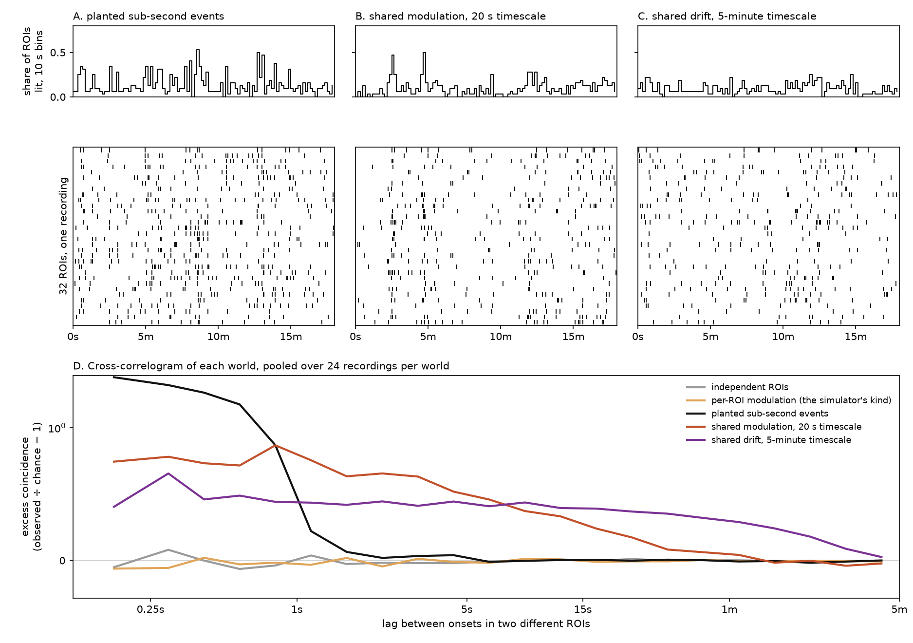
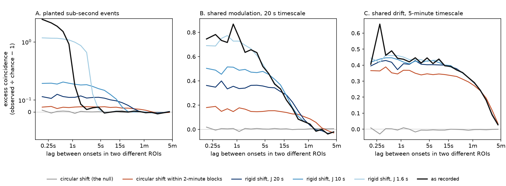
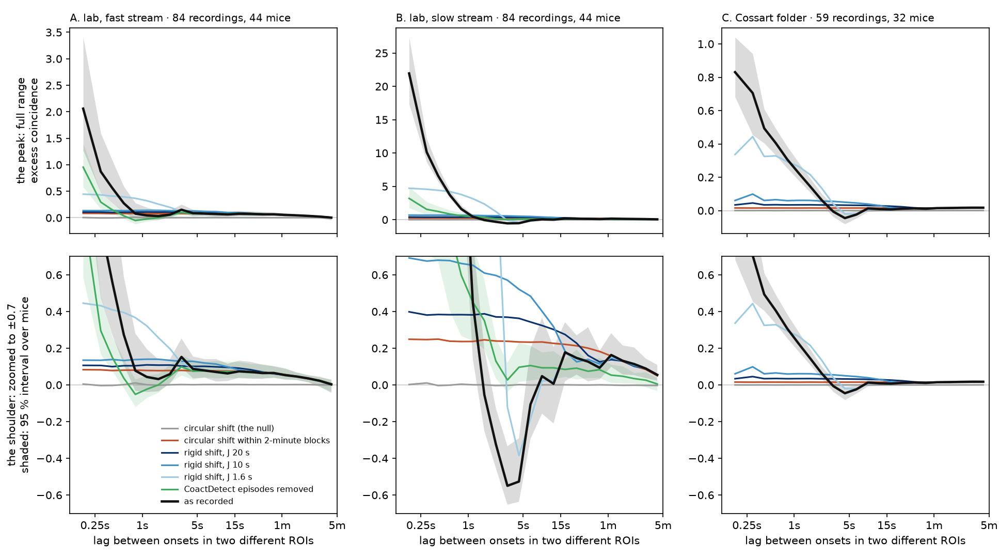
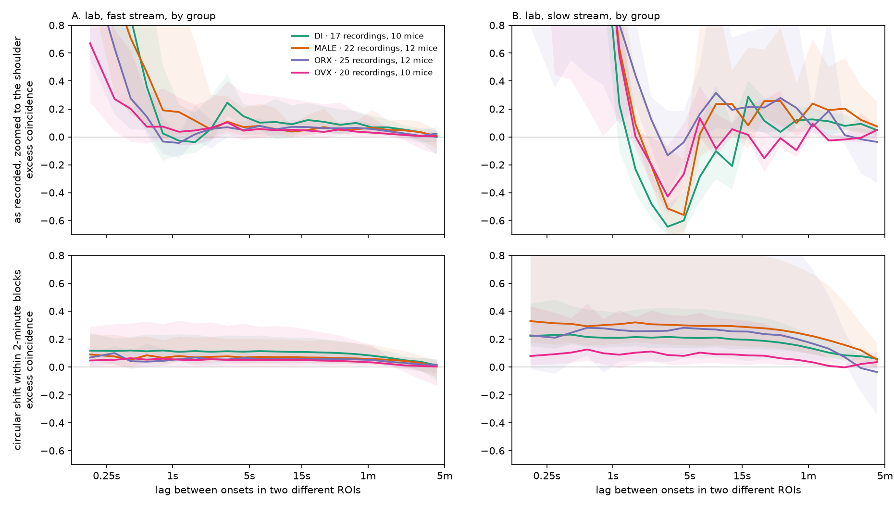

# Slow co-modulation: what it is, where it sits in time, and what rigid shift does to it

> **Exploratory, one run, 2026-09-17, baseline windows only.** Nothing here is a milestone.
> Numbers carry a 95 % interval from resampling **mice**; **measured** marks a number from this run,
> **argued** marks reasoning nobody has measured. It was written because the label-free detector
> thread ([goal page](../../goals/unsupervised-learning.md)) cannot settle whether *shared
> modulation counts as coordination* without first showing what that modulation is.

## The problem

Two different things can make many ROIs (regions of interest, one imaged cell each) active in the
same stretch of a recording.

- **A coordinated event.** Several ROIs have onsets within a fraction of a second of each other. The
  onsets themselves are aligned.
- **Shared slow modulation.** Every ROI's firing *rate* rises and falls together over tens of seconds
  or minutes. No two onsets need be aligned; there are simply more of them everywhere during a busy
  stretch.

Both put more ROIs in the same window than independent cells would, so a detector that counts lit
ROIs sees both. A label-free objective sees both too: it is paid to tell a recording from a
**surrogate** of itself, and **rigid shift** — each ROI's whole onset train slid by its own random
offset within ±*J* seconds (*J*, the displacement radius) — was chosen to destroy the first. Whether
it also destroys the second, and how much of the second the recordings hold, decides what such a
detector learns. This page measures both.

## How to read the measurement

For every pair of distinct ROIs, count pairs of onsets separated by a lag *τ*, and divide by the
count expected if the two ROIs fired independently at their own observed totals. Pool that over all
pairs and all recordings. The result minus one is the **excess coincidence** at lag *τ*: **0** means
independent, **1** means onset pairs at that lag are twice as common as chance, **−0.5** half as
common. As a function of *τ* this is a **population cross-correlogram**, and its shape separates the
two things above:

- **a coordinated event** makes a **narrow peak** at lags shorter than the event's own spread;
- **shared modulation** on a timescale *T* makes a **broad shoulder** out to lags of roughly *T*;
- **modulation drawn separately for each ROI** makes nothing, because nothing moves together.

**Figure 1. Three kinds of activity, and the shape each one leaves.** Synthetic recordings sized like
the lab fast stream (32 ROIs, 1,200 s, 0.0097 onsets per ROI per second). The top row is the share of
ROIs with an onset in each 10 s bin; below it, one recording's raster. The left column plants 32
events of 7 ROIs each, jittered by 0.3 s. The middle column multiplies every ROI's rate by one
shared multiplier that wanders on a 20 s timescale. The right column does the same on a 5-minute
timescale. The bottom panel is the cross-correlogram of each kind, pooled over 24 recordings, with
two controls that read zero: independent ROIs, and a multiplier drawn separately for each ROI —
which is how `src/bugarach/simulate.py` draws its background, *"a busy stretch belongs to a cell,
not to the whole field"*. Its vertical axis is linear between −1 and 1 and logarithmic beyond. The
parameters are chosen to be visible and are fitted to nothing.

Two things in Figure 1, the three kinds, are easy to miss. **Shared modulation creates sub-second
coincidences too** — the 20 s world's curve starts at about +0.75 at the shortest lags — because a
busy stretch holds more onsets and some of them land close together by chance. And **the simulator's
background has no shared modulation at all**, so no benchmark in this repository contains a
shoulder.

## What the surrogates remove

**Figure 2. What each surrogate does to each kind of activity.** The same three synthetic worlds as
Figure 1, each against: **rigid shift** at *J* of 1.6 s, 10 s and 20 s, exactly as
`tools/tube_self_supervised.py` draws it (one offset per ROI, onsets pushed past either end dropped);
the **circular shift**, each ROI's train moved by its own uniform lag with wrap, which removes every
relation between ROIs and is the null; and a **2-minute block control**, each ROI circularly shifted
within every 2-minute block by its own lag, which keeps every ROI's count in every block. Every arm is
analysed on the same window, trimmed by 20 s at each end so rigid shift's dropped onsets never enter.
The events panel's vertical axis is linear between −0.5 and 0.5 and logarithmic beyond.

Read Figure 2, what each surrogate removes, for three facts:

- **Rigid shift does not delete an event's coincidences; it spreads them.** Two ROIs with independent
  offsets in ±*J* end up displaced relative to each other by up to 2*J*, so the peak flattens into a
  low plateau reaching to about 2*J*. The planted-event world at *J* = 20 s sits near +0.1 out to
  about 30 s where it was zero.
- **Rigid shift removes modulation only on timescales shorter than about *J*.** In the 20 s world the
  shortest-lag excess falls from about +0.75 to about +0.5 at *J* = 10 s and to about +0.35 at 20 s;
  at *J* = 1.6 s nothing changes.
- **Drift slower than *J* passes through untouched.** In the 5-minute world every rigid-shift curve
  lies on the recorded curve. Only the block control and the circular shift move it, and the block
  control keeps most of it, because a 2-minute count still carries a 5-minute drift.

⚠ The block control is not a clean "slower than 2 minutes only" filter: in the 20 s world it keeps
about +0.15 of the recorded +0.75. What it separates reliably is a curve that *falls* across tens of
seconds (modulation near 20 s) from one that stays *flat* out to a minute (drift over minutes).

## What the recordings hold

**Figure 3. The recordings.** Baseline windows of the lab export (`steps_excluded`): the fast and
slow streams of the same 84 recordings from 44 mice, 26.9 hours analysed. The Cossart folder: 59
recordings from 32 mice, 22.7 hours, a median of 566 ROIs each, read whole because it declares no
regions. Top row: full range. Bottom row: the same curves zoomed to ±0.7. Shading is the 95 %
interval over mice for the recorded curve and for **CoactDetect episodes removed** — the recording
with every onset inside an episode of the CoactDetect detector deleted (lab folder only). Eight
surrogate draws per recording per arm.

Measured, lag bins as labelled; brackets are the 95 % interval over mice.

| | shortest lags, 0–0.25 s | 2.7–3.7 s | 3.7–5.2 s | 20–28 s | 56–78 s |
|---|---|---|---|---|---|
| **lab fast**, as recorded | +2.06 [+1.27, +3.41] | +0.15 [+0.10, +0.25] | +0.09 [+0.04, +0.16] | +0.07 [+0.04, +0.13] | +0.05 [+0.03, +0.09] |
| lab fast, CoactDetect episodes removed | +0.95 [+0.58, +1.40] | +0.10 [+0.05, +0.16] | +0.07 [+0.03, +0.13] | +0.07 [+0.03, +0.12] | +0.06 [+0.03, +0.09] |
| lab fast, 2-minute block control | +0.08 [+0.05, +0.15] | +0.08 [+0.04, +0.14] | +0.08 [+0.04, +0.14] | +0.07 [+0.04, +0.13] | +0.06 [+0.03, +0.09] |
| lab fast, rigid shift *J* 20 s | +0.11 [+0.06, +0.18] | +0.10 [+0.06, +0.18] | +0.10 [+0.06, +0.17] | +0.08 [+0.05, +0.14] | +0.05 [+0.03, +0.09] |
| **lab slow**, as recorded | +21.94 [+17.33, +27.37] | −0.55 [−0.65, −0.33] | −0.53 [−0.64, −0.29] | +0.15 [+0.06, +0.27] | +0.16 [+0.10, +0.28] |
| lab slow, CoactDetect episodes removed | +3.20 [+1.78, +4.95] | +0.03 [−0.04, +0.12] | +0.10 [+0.02, +0.23] | +0.09 [+0.03, +0.19] | +0.05 [+0.01, +0.11] |
| lab slow, 2-minute block control | +0.25 [+0.16, +0.42] | +0.24 [+0.16, +0.40] | +0.23 [+0.16, +0.39] | +0.21 [+0.14, +0.35] | +0.16 [+0.10, +0.27] |
| **Cossart**, as recorded | +0.83 [+0.68, +1.04] | −0.01 [−0.04, +0.03] | −0.05 [−0.08, −0.01] | +0.01 [+0.00, +0.02] | +0.01 [+0.01, +0.02] |
| Cossart, 2-minute block control | +0.02 [+0.01, +0.02] | +0.02 [+0.01, +0.02] | +0.02 [+0.01, +0.02] | +0.02 [+0.01, +0.02] | +0.01 [+0.01, +0.02] |

**Every folder has both a peak and a shoulder** (measured).

- **The peak** is what coordinated events look like. On the lab fast stream it is gone by about 1 s;
  on Cossart it takes about 3 s to fall to zero. Removing CoactDetect's episodes halves it on fast
  (+2.06 to +0.95) and cuts it by six-sevenths on slow (+21.94 to +3.20); what remains is
  coincidence CoactDetect does not call.
- **The shoulder** on the lab fast stream is small per pair, +0.05 to +0.09, but **flat from about
  3 s out to a minute**, and it fades only over several minutes. It is **unchanged by removing
  CoactDetect's episodes, unchanged by rigid shift at any *J* tried, and kept by the 2-minute block
  control**. In Figure 2's terms that is the drift world, not the 20 s world.
- **Because it is so wide, the shoulder holds most of the excess.** Of all excess onset pairs at
  lags up to 5 minutes, the share at lags beyond 1 s is **0.91 on lab fast**, 0.71 on lab slow and
  0.86 on Cossart (measured; `summary.json`, `peak_and_shoulder`).
- **Cossart's shoulder is +0.01 to +0.02 per pair**, which looks negligible and is not: every ROI
  pairs with 565 others, so a per-pair excess that small still moves the count of lit ROIs visibly
  (argued; this page measures pairs, not the count's variance).

**The lab slow stream has a dip.** Onset pairs 2.7–5.2 s apart are about half as common as chance
(−0.55 and −0.53), and the dip disappears when CoactDetect's episodes are removed (+0.03 and +0.10).
The argued reading: after a large synchronous event, its members sit inside their own refractory
interval — the same-ROI floor the goal page records as 2.80–3.20 s on the slow stream — so fewer of
them can fire again in the next few seconds. Rigid shift fills the dip in (+0.36 to +0.57 at *J* of
10 and 20 s in `summary.json`), so a real-against-shifted contrast on the slow stream is paid for
the event's aftermath as well as the event.

## By group

**Figure 4. The lab streams split by group.** DI, MALE, ORX and OVX: 17, 22, 25 and 20 recordings
from 10, 12, 12 and 10 mice. Top row: as recorded, zoomed to the shoulder. Bottom row: the 2-minute
block control. Shading is the 95 % interval over mice within the group.

On the fast stream the shoulder is present in all four groups at a similar height. On the slow
stream OVX's block-control curve sits lowest. ⚠ **Group cannot be separated from imaging day** on
this export — no imaging date holds more than one group ([`docs/INDEX.md`](../../INDEX.md), the
ROI-swap row; [recording identity](../recording_identity.md)) — and the intervals overlap, so this figure
shows that the pooled curve is not one group's; it does not show a group difference.

## What this changes for the label-free thread

Argued, from the figures above; nothing here was run against a trained model.

- **The decision is narrower than it was framed.** The goal page asks whether *shared modulation on
  timescales of 10–45 s* counts as coordination. On the lab fast stream — the stream every label-free
  model was trained on — the shared structure outside the peak is **drift over minutes**, and rigid
  shift at 1.6–20 s does not remove it. So on that stream it is not what those objectives were paid
  for. What rigid shift does change there is the peak, which it spreads into a plateau.
- **On the lab slow stream, the contrast rewards three things at once**: the peak, the dip after it,
  and the part of the shoulder faster than *J*. A classifier that separates slow recordings from
  their rigid shift is not evidence about any one of them.
- **A small displacement is not a modulation control.** Rigid shift at *J* = 1.6 s leaves drift
  intact and spreads the event peak (lab fast +2.06 → +0.45 at the shortest lags), so a scorer that
  separates real from a 1.6 s shift may be reading events. The session running the rigid-shift report
  confirmed this independently on synthetic recordings, 2026-09-17, and is carrying it in that
  report.
- **Removing a local background removes drift.** `count_excess`, the zero-parameter baseline in the
  rigid-shift report, subtracts a 30 s moving mean from the share of lit ROIs, which cancels drift
  over minutes by construction. That may be part of why it holds up against trained models; it is
  not tested here.
- **The benchmark has never contained any of this.** The simulator draws modulation per ROI, so no
  supervised model here has seen a shoulder or a dip.

**What this page cannot say is where the drift comes from.** Shared change in onset rate over minutes
could be the tissue's network state, or it could enter through the measurement — a focus or
slice-position change, bleaching, or a baseline fluorescence estimate that moves with them and moves
every ROI's event threshold together. Those are facts about the preparation and the producer's
extraction, not this repository's to decide; FOUNDATIONS §9 sends such questions to the lab. The
decision it sets up is Tony's: **does shared drift over minutes belong to coordination, to the
background a detector should subtract, or to the producer to explain?**

## What this does not settle

- **Pairs, not counts.** Excess coincidence is per pair of ROIs. What a count-based detector sees
  scales with the number of ROIs; this page does not measure the count's variance.
- **The 1 s cut** between peak and shoulder, and the **5-minute longest lag**, are choices; the share
  of excess beyond 1 s grows with the longest lag counted.
- **CoactDetect removal is partial by construction.** CoactDetect fires only where at least three ROIs
  coincide, so two-ROI coincidences and events too weak for its test stay; and every onset inside an
  episode goes, member or not. On lab fast that removed a median of 2.5 % of each recording's onsets
  (mean 10 %); on lab slow, a median of 7.1 % (mean 22 %). Slow uses the explore_sce viewer's slow
  settings (1 s bins, 120 s context, α = 10⁻⁶), because no retuned slow operating point exists.
  Cossart has no removal arm.
- **The block control keeps some faster structure** (Figure 2, the 20 s world), so "kept by the
  block control" means "mostly slower than tens of seconds", not "only slower than 2 minutes".
- **20 minutes of baseline per recording** bounds the slowest drift this can see; a trend across the
  whole window reads as a shoulder that has not yet fallen at 5 minutes.
- **Eight surrogate draws** per recording per arm. The surrogate arms' curves are means over draws;
  their intervals are over mice and include draw noise.
- **Baseline only, by rule.** Nothing here says what treatment does to either the peak or the drift.

## Reproduce

Code version `unsup/slow-comodulation` at the commit that adds this page. From a checkout with the
export folders on the machine:

| step | command | output |
|---|---|---|
| measure | `python tools/measure_slow_comodulation.py --out <dir>` | `results.json` (per recording, darkroom only) and `summary.json` (pooled, no identifiers) |
| draw | `python tools/make_slow_comodulation_figure.py --run <dir> --also docs/learned/slow_comodulation` | the four figures, into `<darkroom>/2026-09-17-slow-comodulation/` and here |

The run took under two minutes on 6 CPU workers. The tests are
`tests/test_measure_slow_comodulation.py`: the pair count against a brute-force count, zero for
independent ROIs, the nulls keeping what they claim, and the synthetic worlds' shapes.
