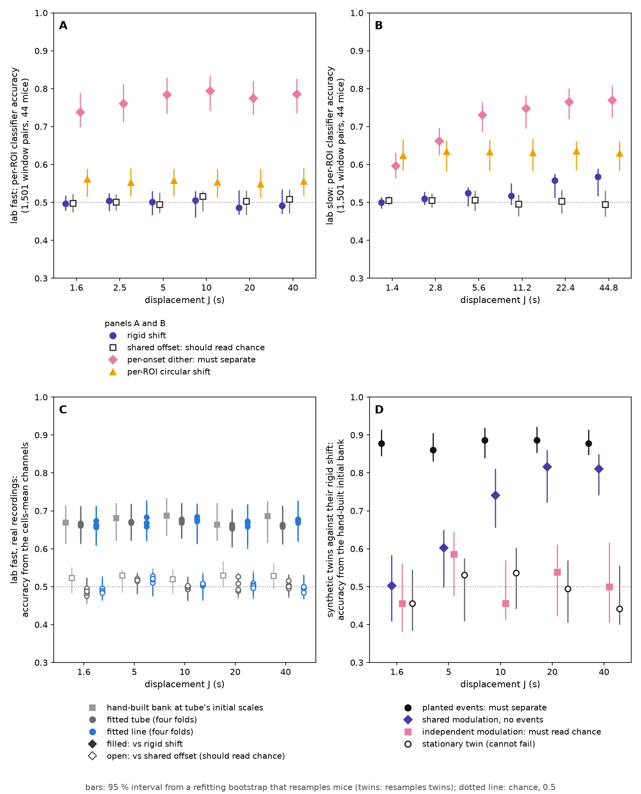
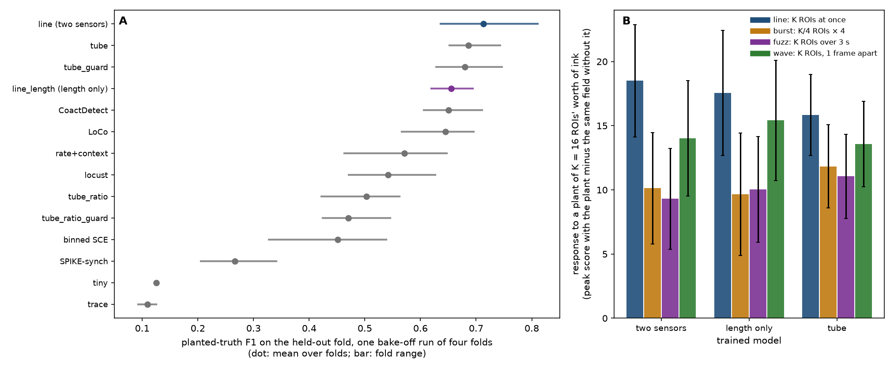
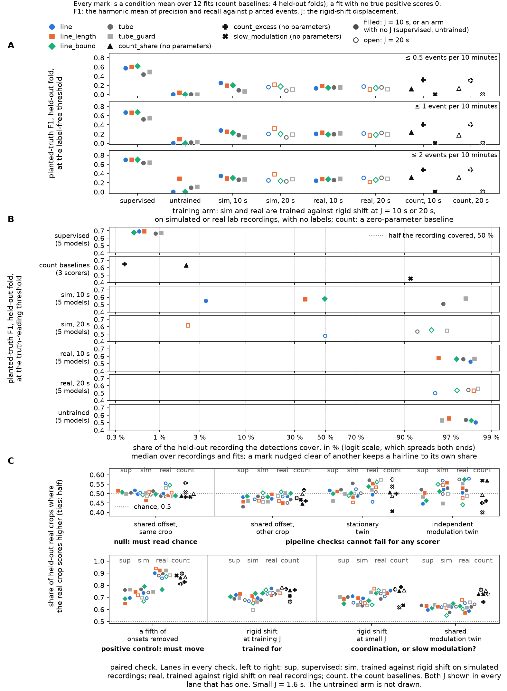

# Rigid shift as a teacher: what it hides, what it destroys, and what training on it alone buys

## What this run found

- **The per-ROI leak test can fail on the lab fast stream, and rigid shift still passes it.** A
  classifier that catches per-onset dither at 0.74–0.79 reads rigid shift at 0.49–0.51 at every
  displacement from 1.6 s to 40 s (Figure 1). Before this run that test had no positive control on
  the stream the experiment used.
- **The aggregate-channel gate gives the same answer when it is built from fitted models.** It used
  to be built from `tube`'s initial parameters. Read off what a fitted `tube` or `line` actually
  receives, real recordings separate from their rigid shift at 0.65–0.68, and the shared offset
  sits at 0.48–0.53 (Figure 1).
- **At three training seeds the bake-off separates none of the counting builds from each other or
  from CoactDetect.** `line` leads CoactDetect by +0.047 F1 with one fold of four carrying it, and
  the second sensor adds +0.015. Bounding each ROI's vote in time changes F1 by −0.004 (Figure 2).
- **Training against rigid shift alone beats random initialisation only at the stricter
  label-free thresholds, and is nowhere near supervised training.** At the loosest threshold the
  best untrained model is ahead of most trained cells; at the two stricter ones every trained cell
  is ahead of every untrained model. The truth-reading scores of the untrained arm, and of every
  arm trained on real recordings, come from detections that cover most of the recording
  (Figure 3).

> **Exploratory. This page replaces the version of 2026-09-16**, which was reviewed twice and
> carried residual defects that changed what its numbers meant
> ([run record](../../reviews/tube-self-supervised-2026-09-16.md);
> [what remained](../../handoffs/2026-09-16-rigid-shift-report-steps-3-and-4.md)). Every stage was
> rerun on 2026-09-16 and 2026-09-17 with those defects fixed; *What changed from the reviewed
> version* lists them. Nothing here is promoted: `docs/MILESTONES.md` reserves promoting a bake-off
> number to Tony, and its standing ruling is **a table of performance, not a ranking**.
>
> **Every number on this page is in [`summary.json`](summary.json)**, written by
> `tools/summarize_tube_self_supervised.py` from the stage outputs beside it.
>
> **⚠ marks a claim this page is telling you not to lean on**, with the reason beside it.

**Terms used below.** An **ROI** (region of interest) is one imaged cell. An **onset** is the frame
at which a cell's calcium transient starts. **F1** is the harmonic mean of recall and precision,
1.0 perfect. ***J*** is the displacement radius of a surrogate, in seconds. ***t*(3)** is the paired
*t* statistic over four folds, three degrees of freedom. **SD** is standard deviation. Model names
in `code` are registered architectures in `src/bugarach/learn/nets/`.

## The problem

The lab records calcium imaging of hippocampal slices, and a **coordinated event** is several cells
becoming active within a fraction of a second. Nobody has annotated this corpus, so every
*supervised* detector here is fitted on a **simulator** whose events were measured from the lab's
own recordings, and a detector that never sees a real event cannot be told it was wrong about one.

A label-free detector would need no annotation. It needs instead examples of what it should *not*
fire on: copies of a recording that keep everything except the thing being detected. **Rigid
shift** is the candidate. Each ROI's whole onset train slides by one random offset within ±*J*, so
every ROI keeps its own rate and its own intervals while the alignment *between* ROIs is destroyed.
Onsets pushed past the edge of the recording are dropped rather than wrapped.

Three questions follow, and the figures take them in order:

1. **Does rigid shift hide from a detector of everything except alignment, and does it destroy
   alignment?** (Figure 1)
2. **Is a counting architecture better than the centre-surround one** the project already has, and
   better than the hand-written detectors? (Figure 2)
3. **Can a detector be trained against rigid shift alone**, with no labels anywhere? (Figure 3)

A fourth, what these models call on real tissue, follows the figures.

## What changed from the reviewed version

Each fix below moved a number or what a number could mean. The code is on branch
`unsup/rigid-shift-report-residuals`.

- **`line` makes a weaker claim, and a variant tests the stronger one.** `line`'s docstring said one
  ROI casts at most one vote. Its sigmoid bounds a vote's height, not how long the vote lasts, and
  the difference-of-Gaussians stage after it averages over time. **`line_bound`**, registered beside
  it with the same 1,305 parameters, also bounds each ROI's vote in time and subtracts the vote's
  empty-field floor. Tony chose to measure both rather than rewrite either
  (`tests/test_line_vote.py` pins the difference).
- **The aggregate-channel gate is built from fitted models**, as well as from the initial
  parameters that licensed the first run.
- **The leak tests carry positive controls**: per-onset dither in the per-ROI test, and a fifth of
  every ROI's onsets removed in the trained models' paired checks, with a shared offset drawn at an
  independent crop beside the same-crop one.
- **The truth-reading threshold is picked by `bugarach.learn.train.pick_threshold`** with its
  edge-of-grid guard, over a grid that reaches the lowest score rather than stopping at the median;
  with the validation recordings `fold_maker` actually holds (two, not four); and, for the arm
  trained on simulated recordings, not on recordings that arm was trained on.
- **The bake-off runs at three training seeds**, and on today's `main`, where LoCo was retuned and
  simulated recordings carry event widths. CoactDetect's scores are unchanged by either.
- **Detection widths, coverage and every fitted parameter are stored per fit**, and a test checks
  that the numpy rigid shift used for training agrees in distribution with the tested,
  Elephant-backed `bugarach.surrogates.rigid_shift`.

## Figure 1. Rigid shift against the two leak tests, each with a control that can fail

**Figure 1.** **Panels A and B** use a linear classifier over per-ROI summary statistics (each
ROI's onset count, the quantiles of its same-ROI intervals and its shortest interval, pooled over
ROIs by mean, SD, minimum, median and maximum, plus the share of ROIs with an onset), which by
construction cannot see alignment between ROIs. It tells a 60 s window of a real baseline recording
from the same window of a transformed copy, with folds grouped by mouse, over 84 recordings and
1,501 window pairs per stream. Bars are 95 % intervals from a refitting bootstrap that resamples
mice. **Panel C** uses the same kind of classifier on aggregate channels of the lab fast stream only:
`tube` at its initial parameters (bars: 95 % interval), and the input a fitted `tube` or `line`
head receives, one supervised fit per held-out fold (bars: range over the four folds).

**The per-ROI test has power on the lab fast stream, and rigid shift passes it.**

| lab fast, *J* | 1.6 s | 2.5 s | 5 s | 10 s | 20 s | 40 s |
|---|---|---|---|---|---|---|
| rigid shift | 0.497 | 0.505 | 0.502 | 0.505 | 0.486 | 0.492 |
| shared offset | 0.498 | 0.502 | 0.495 | 0.516 | 0.504 | 0.509 |
| per-onset dither (positive control) | 0.738 | 0.761 | 0.784 | 0.794 | 0.775 | 0.785 |

A **shared offset** moves every ROI of a recording by the same offset, so each ROI's train moves
exactly as it does under rigid shift while the ROIs stay aligned; it should read chance. **Per-onset
dither** moves every onset independently within ±*J*, which breaks each ROI's shortest same-ROI
interval, something these features see; it must separate. Its lowest interval bound on this stream
is 0.70. So a leak confined to single ROIs, of the size dither makes, would have been caught, and
rigid shift shows none.

On the lab slow stream dither is caught at 0.60–0.77, the shared offset reads 0.495–0.507, and rigid
shift reads 0.500–0.524 up to 11.2 s and then **0.558 at 22.4 s and 0.567 at 44.8 s**, with interval
bounds of 0.51 and 0.52. That is the slow shared modulation the earlier look found; it is not a
per-ROI leak, because the shared offset, which moves each ROI identically, stays at chance.

**The aggregate gate answers the same with fitted channels.** On the lab fast stream, real against
rigid shift reads 0.664–0.688 from the initial bank and 0.654–0.684 from fitted `tube` and `line`
heads across folds and displacements; real against the shared offset reads 0.520–0.530 and
0.484–0.527; an unplanted synthetic twin against its own rigid shift, where nothing legitimate can
be found, reads 0.442–0.536 and 0.469–0.592; a planted twin against its rigid shift, the positive
control, reads 0.861–0.886 and 0.864–0.914.

⚠ **What the aggregate test excludes is narrow.** A classifier reading only the cells-mean trace
already separates real from rigid shift at 0.657–0.674 (initial bank, onsets widened by one frame)
and 0.619–0.643 (fitted banks, raw trace). That trace is the share of the field that is active,
which is what a counting architecture computes. So the test rules out a leak on these channels that
the shared offset would also carry, and nothing about co-activity itself.

## Figure 2. The supervised bake-off at three training seeds, and the plant probe

**Figure 2.** **Panel A**: every detector on the simulator's held-out folds, four folds of two
recordings each, 30 planted events per fold; learned models at training seeds 0, 1 and 2. A dot is
one fold's F1 averaged over the three seeds; the bar is the mean over the four folds and is not a
confidence interval. Rows are grouped by family, not ordered by score. **Panel B**: each supervised
model's peak response to a plant on a quiet synthetic field, divided by its response to a plant of
equal ink; an open marker is a ratio whose divisor is within one SD of zero over the 12 fields. One
training seed.

`line` carries two sensors. **Relative length** is how much of the field is lit at once; the
**concentration** channels are the ratio of that count at a narrow smear to the count at the next
wider one. `line_length` keeps only the first. `line_bound` keeps both and bounds each ROI's vote in
time.

| detector | what it is | F1 ± SD over folds | fold range | recall | precision | probe firings | fit time |
|---|---|---|---|---|---|---|---|
| line | learned here | 0.698 ± 0.064 | 0.64–0.78 | 0.875 | 0.584 | 3.25 | 66–67 s |
| line_bound | learned here | 0.694 ± 0.040 | 0.67–0.75 | 0.881 | 0.575 | 3.50 | 289–292 s |
| line_length | learned here | 0.682 ± 0.038 | 0.64–0.73 | 0.842 | 0.580 | 4.42 | 64–66 s |
| tube | learned here | 0.654 ± 0.050 | 0.61–0.72 | 0.836 | 0.544 | 20.67 | 7.7–8.2 s |
| tube_guard | learned here | 0.643 ± 0.052 | 0.59–0.69 | 0.797 | 0.548 | 15.25 | 7.3–7.7 s |
| tube_ratio | learned here | 0.508 ± 0.025 | 0.48–0.53 | 0.647 | 0.432 | 0.17 | 8.7–8.9 s |
| tube_ratio_guard | learned here | 0.466 ± 0.054 | 0.42–0.54 | 0.611 | 0.399 | 0.00 | 8.7–8.9 s |
| tiny | learned here | 0.125 ± 0.000 | 0.12–0.12 | 0.067 | 1.000 | 0.00 | 89 s |
| trace | learned here | 0.120 ± 0.011 | 0.11–0.14 | 0.072 | 0.669 | 0.00 | 9.4–9.5 s |
| CoactDetect | hand-written here | 0.651 ± 0.044 | 0.61–0.71 | 0.767 | 0.572 | 1.25 | — |
| LoCo | hand-written here | 0.631 ± 0.046 | 0.57–0.68 | 0.742 | 0.555 | 3.50 | — |
| rate+context | hand-written here | 0.607 ± 0.082 | 0.52–0.70 | 0.675 | 0.552 | 26.50 | — |
| binned SCE | port of another lab's | 0.582 ± 0.072 | 0.50–0.68 | 0.758 | 0.478 | 59.75 | — |
| locust | port of another lab's | 0.545 ± 0.052 | 0.48–0.60 | 0.708 | 0.447 | 239.25 | — |
| SPIKE-synch | wraps another lab's measure | 0.267 ± 0.072 | 0.21–0.34 | 0.175 | 0.569 | 8.75 | — |

**Probe firings** are calls made inside a stretch of the benchmark where ROIs are dense but nothing
is planted, averaged over folds and seeds. They are excluded from precision and reported separately,
because a detector can buy recall with promiscuity. **Fit time** is the range over the three seeds
of the mean seconds per fit, with the three bake-offs sharing one Mac; ⚠ it is a comparison within
this run, not a benchmark.

**Paired per-fold differences**, on each fold's seed-averaged F1:

| comparison | fold 1 / 2 / 3 / 4 | mean | *t*(3) | without the largest fold | mean at seed 0 / 1 / 2 |
|---|---|---|---|---|---|
| line − CoactDetect | −0.005 / −0.004 / +0.178 / +0.018 | +0.047 | 1.06 | +0.003 | +0.063 / +0.055 / +0.023 |
| line_bound − CoactDetect | −0.033 / +0.033 / +0.147 / +0.025 | +0.043 | 1.13 | +0.008 | +0.050 / +0.047 / +0.031 |
| line_length − CoactDetect | −0.035 / +0.036 / +0.126 / −0.001 | +0.032 | 0.91 | −0.000 | +0.005 / +0.052 / +0.038 |
| tube − CoactDetect | −0.052 / −0.035 / +0.116 / −0.017 | +0.003 | 0.08 | −0.035 | +0.036 / −0.017 / −0.010 |
| line − line_length | +0.029 / −0.040 / +0.052 / +0.019 | +0.015 | 0.78 | +0.003 | +0.058 / +0.003 / −0.015 |
| line_bound − line | −0.028 / +0.037 / −0.031 / +0.007 | −0.004 | −0.25 | −0.018 | −0.012 / −0.007 / +0.008 |
| line − tube | +0.047 / +0.031 / +0.062 / +0.035 | +0.044 | 6.19 | +0.038 | +0.027 / +0.071 / +0.033 |
| CoactDetect − LoCo | +0.071 / +0.005 / +0.039 / −0.035 | +0.020 | 0.88 | +0.003 | same at every seed |

**Every learned margin over CoactDetect is carried by the third fold.** Without it, no learned model
is ahead by more than 0.008. **The second sensor's +0.058 in the reviewed version was one seed**: at
the other two seeds it is +0.003 and −0.015. **Bounding the vote in time changes nothing measurable
in F1**, and a fit takes 289–292 s against `line`'s 66–67 s. The one separable comparison in the table is
`line` over `tube`, positive on all four folds.

**Panel B, the plant probe.** Four plants of equal ink on a quiet field of 32 ROIs: a **line plant**
(as many ROIs as the plant size, one onset each, in one frame), a **burst** (a quarter of those ROIs
firing four times each over 0.6 s), **fuzz** (the same ROIs spread over 2.9 s) and a **wave** (the
same ROIs one frame apart). Each value is the line plant's response divided by the other plant's,
where a response is the model's peak score with the plant minus the same field without it.

| supervised model | ÷ burst, plant 4 / 8 / 16 | ÷ fuzz, 4 / 8 / 16 | ÷ wave, 4 / 8 / 16 |
|---|---|---|---|
| line | 3.90 ⚠ / 1.63 / 1.83 | 1.27 / 1.44 / 1.99 | 1.01 / 1.05 / 1.32 |
| line_length | 5.05 / 1.99 / 1.82 | 1.24 / 1.31 / 1.75 | 1.01 / 1.04 / 1.14 |
| line_bound | 9.82 ⚠ / 2.78 / 1.80 | 1.21 / 1.24 / 1.60 | 1.04 / 1.13 / 1.35 |
| tube | 2.24 / 1.23 / 1.34 | 1.22 / 1.08 / 1.43 | 1.00 / 0.99 / 1.17 |

⚠ marks a divisor within one SD of zero. All three counting builds separate the line plant from a
burst better than `tube` does. At the largest plant, `line` separates it from fuzz best (1.99), then
`line_length` (1.75), `line_bound` (1.60) and `tube` (1.43), so bounding the vote does not improve
the separation from fuzz. **Read this panel as a direction, not a measurement**: the head is a
six-layer stack, so a ratio of two response differences does not compare strictly across models;
the wave's span grows with the plant size by construction; and the field is flat, where the bench's
background is not.

## Figure 3. Training against rigid shift, with no labels

**Figure 3.** Five architectures × three training seeds × four folds, in six arms: supervised and
untrained controls, and trained against rigid shift with no labels on unlabelled **simulated**
recordings ("sim") or real lab fast-stream **baseline** recordings ("real"), at *J* = 10 s and 20 s.
That is 12 fits per model per arm and 360 fits in all. A dot is one fit; a fit with no true positive
scores 0. **Panel A** is the truth-reading threshold, **panel B** the label-free one at no more than
2 events per 10 minutes. **Panel C** is the paired checks on held-out real recordings, for the models
trained on real recordings, both displacements pooled (24 fits per model).

**The objective.** A crop of 4,096 frames (409.6 s at this stream's 0.1 s frame interval) and the
same crop of its rigid shift go through the model; each crop's score is the mean of its top 1 % of
per-frame scores; the loss is `softplus(shift − real)`. 900 steps, no label read.

**Two thresholds.** The **label-free** threshold is, per held-out recording, the lowest threshold at
which the model fires at most a stated rate (0.5, 1 or 2 events per 10 minutes) on three rigid shifts
of **that** recording. The **truth-reading** threshold is the F1-best threshold on the training
folds' two validation recordings; it reads planted truth and is a comparison, not a usable rule.
± is the population SD over the 12 fits of a cell.

**Supervised, as the label-free threshold tightens:**

| model | ≤ 0.5 per 10 min | ≤ 1 | ≤ 2 | truth-reading |
|---|---|---|---|---|
| line | 0.571 | 0.668 | 0.697 ± 0.068 | 0.691 ± 0.064 |
| line_bound | 0.618 | 0.674 | 0.703 ± 0.038 | 0.678 ± 0.048 |
| line_length | 0.602 | 0.662 | 0.703 ± 0.057 | 0.696 ± 0.050 |
| tube | 0.434 | 0.519 | 0.629 ± 0.064 | 0.662 ± 0.051 |
| tube_guard | 0.492 | 0.551 | 0.636 ± 0.080 | 0.671 ± 0.054 |

As the rate tightens from 2 to 0.5 events per 10 minutes, the three counting builds keep more of
their F1 than the tube family does.

**Trained against rigid shift, and untrained**, at the label-free threshold (≤ 2 per 10 min | ≤ 1
per 10 min):

| model | sim, *J* 10 s | sim, 20 s | real, 10 s | real, 20 s | untrained |
|---|---|---|---|---|---|
| line | 0.347 \| 0.277 | 0.250 \| 0.201 | 0.242 \| 0.203 | 0.303 \| 0.212 | 0.000 \| 0.000 |
| line_bound | 0.307 \| 0.227 | 0.246 \| 0.204 | 0.276 \| 0.191 | 0.262 \| 0.183 | 0.004 \| 0.000 |
| line_length | 0.294 \| 0.252 | 0.386 \| 0.322 | 0.283 \| 0.230 | 0.219 \| 0.169 | 0.291 \| 0.093 |
| tube | 0.264 \| 0.175 | 0.228 \| 0.126 | 0.257 \| 0.196 | 0.307 \| 0.223 | 0.090 \| 0.014 |
| tube_guard | 0.279 \| 0.137 | 0.284 \| 0.190 | 0.286 \| 0.220 | 0.290 \| 0.194 | 0.114 \| 0.030 |

**At ≤ 2 per 10 minutes, untrained `line_length` (0.291) is ahead of 14 of the 20 trained cells. At
≤ 1 and ≤ 0.5 every trained cell is ahead of every untrained model**: 0.126–0.322 against at most
0.093 at ≤ 1, and 0.070–0.250 against at most 0.039 at ≤ 0.5. So training against rigid shift does
buy something a threshold can use once the rate is strict, and no architecture approaches its own
supervised score: at ≤ 1 the best trained cell is 0.322 against 0.519–0.674 supervised. No
architecture separates from the others. Between 0 and 4 fits of each cell of twelve ended at or
above chance loss (ln 2 = 0.693).

⚠ **The truth-reading scores of the untrained arm and of every arm trained on real recordings are not
detection.** Those arms reach 0.50–0.56 and 0.50–0.58, but the median share of each held-out
recording their detections cover is 0.962–0.984 and 0.954–0.985, with median widths of 23–128 s:
they touch planted events by being on almost everywhere. The supervised models cover 0.005–0.010.
Among the arms trained on simulated recordings, `line` at 10 s (0.551, covering 0.035) and
`line_length` at 20 s (0.620, covering 0.022) are narrow; `line_length` at 10 s, `line` at 20 s and
`line_bound` at 10 s cover 0.36–0.50; the tube family at both displacements and `line_bound` at 20 s
cover 0.93 or more. The reviewed version blamed this on a grid that stopped at the median score.
That floor is gone, and the chosen threshold sits on a grid edge in only 4 of the 360 fits, all of
them `line`, so the coverage is a property of those models' scores, not of the search.

**Panel C, the paired checks** (models trained on real recordings, per-cell means): real against
rigid shift 0.720–0.774; real against a copy with a fifth of every ROI's onsets removed **0.766–0.940,
so the checks can see a count change**; real against the shared offset at the same crop 0.484–0.555,
and at an independent crop 0.450–0.510; unplanted twins against their rigid shift 0.456–0.575. ⚠ The
same-crop shared offset ties on 10–69 % of crops in a cell, counted as half, which is why the
independent crop was added. Some `tube` fits score every crop identically (tie share 1.00) and
contribute only halves.

## On real recordings

All 84 lab fast-stream **baseline recordings**, each judged by a model that never saw its mouse,
beside CoactDetect and LoCo at their production operating points. **Neither is ground truth** —
nothing in this folder is annotated, and `docs/MILESTONES.md` blocks quoting any transfer figure
until a MAHICE review (machine-assisted human identification of coordinated events) exists. This is
a consistency check. Supervised models are fitted on the simulator at three seeds; models trained
against rigid shift are fitted per mouse fold at three seeds. Every row pools its seeds.

| detector | events per 10 min | ROIs with an onset in the detection's extent ±2 frames: median, share ≥ 3 | the same, extent ±1 s |
|---|---|---|---|
| CoactDetect | 2.70 | 7, 1.00 | 7, 1.00 |
| LoCo | 3.72 | 6, 1.00 | 7, 1.00 |
| supervised, label-free ≤ 2 (five models) | 4.29–5.03 | 4–5, 0.80–0.84 | 5, 0.86–0.89 |
| trained against rigid shift, label-free ≤ 2 (ten rows) | 5.67–6.75 | 0–1, 0.13–0.24 | 2–4, 0.40–0.63 |
| random times of the same widths, same recordings | — | 0–1, 0.06–0.18 | 1, 0.19–0.29 |

⚠ **CoactDetect and LoCo cannot report a thin event**: both run at a floor of three ROIs, so their
1.00 is a floor, not a finding. The random rows are width-matched to each detector's own events,
which is why their range spans the detectors.

**Calls from models trained against rigid shift mostly hold one ROI or none at the event itself**
(median 0–1 within ±2 frames), against 0.07–0.13 for random times matched to those same calls. The
supervised label-free models' calls hold a median of 4–5.

**Agreement** is the share of one detector's events that overlap any of another's within ±1 s. ⚠ It
is a many-to-one overlap share, not a recall: a detector that fragments one reference event into
five calls is credited five times.

| supervised model, label-free ≤ 2 | share of CoactDetect's / LoCo's events it overlaps | share of its own events near CoactDetect / LoCo |
|---|---|---|
| tube_guard | 0.856 / 0.752 | 0.462 / 0.542 |
| line_bound | 0.834 / 0.697 | 0.460 / 0.510 |
| tube | 0.831 / 0.681 | 0.473 / 0.530 |
| line | 0.776 / 0.649 | 0.442 / 0.494 |
| line_length | 0.752 / 0.601 | 0.428 / 0.476 |

The two references agree with each other at 0.780 (CoactDetect's events near LoCo's) and 0.591
(LoCo's near CoactDetect's). Every supervised model fires more often than either reference, so the
first column rewards firing more, and the second column is the one that bounds it. **The architecture
that leads the bake-off, `line`, is fourth of the five here on overlap with the references**, ahead of
its own length-only ablation. The models trained against rigid shift place 0.174–0.340 of their events
near a reference, against chance rates of 0.046–0.064 computed the same way.

⚠ **Detections of every kind are enriched near the window edges.** Within 5 s of a window edge the
uniform expectation is 0.84 % of events and within 12.8 s it is 2.1 %. The supervised label-free rows
put 3.8–5.9 % and 5.6–7.1 % there, the same models at their bake-off thresholds 1.6–2.2 % and
3.1–3.9 %, the rows trained against rigid shift 1.1–3.7 % and 3.1–5.5 %, CoactDetect 3.3 % and 4.7 %,
and LoCo 0.0 % and 1.1 %. Each supervised model is more edge-enriched at its label-free threshold
than at its bake-off threshold, so the threshold rule, not only the architecture, is involved. **The mechanism is
not identified.** The 12.8 s is the padded support of the models' difference-of-Gaussians kernels
(128 frames), not a fitted width.

The lanes-over-raster view of one baseline recording that the reviewed version pointed to in the
darkroom was drawn from that version's run and **was not redrawn for this one**; nothing here quotes
it. It is rebuilt with `tools/make_tube_real_lanes.py --run <real_compare> --out <darkroom> --family
line` once a darkroom folder is claimed. It holds a real baseline raster, which FOUNDATIONS §5
releases by name only, so it has no repo copy.

## What this does not settle

- **No learned model separates from CoactDetect** at four folds and three seeds; every margin rests
  on one fold. Promoting any of these rows is Tony's decision, and the numbers do not argue for it.
- **The surrogate is used three orders of magnitude from its published regime.** Stella et al. 2022
  rank whole-train shifting most robust at a dither of **25 ms**; this run shifts a whole recording by
  **10–20 s**, where it also removes shared modulation slower than an event on the lab slow stream
  (Figure 1, panel B).
- **The aggregate test cannot exclude co-activity**, because its strongest channel is the share of
  the field that is lit (Figure 1).
- **The objective is untuned**: one pooling rule, one learning rate, 900 steps. It pays for any
  separation of real from shifted, so a two-ROI coincidence earns as much as a crowd.
- **The label-free threshold is a stricter cut on the bench than on a real recording.** Rigid shift
  keeps each ROI's rate profile to within ±*J*, so the bench's dense probe stretch survives into the
  shifts the threshold is set on; real recordings have no such stretch. A bench label-free score and a
  real-recording label-free event rate are therefore not the same operating point.
- **`line_bound`'s bound is soft**: a four-onset burst's peak reaches 1.04–1.15 times a single
  onset's on an untrained model with hand-set widths, not 1.
- **The concentration channels are not a test of image orientation.** These models ignore ROI order,
  and the encoder sorts rows by rate, so a diagonal a person sees in a raster is not available to
  them; temporal concentration is the nearest readable quantity. The architecture is nonetheless
  registered with `orientation=True`, where no caveat travels with the word.
- **The benchmark is a simulator** whose planted events carry 0.31 s of jitter. Real fast onset jitter
  was measured at **0.36 s against a 0.42 s circular-shift null on 47 of 84 slices**, and
  `docs/generator.md` flags the 0.36 s as its least trustworthy number and an upper bound.
- **The real-recording statistics are pooled over events, not clustered by mouse.** The 84 recordings
  come from 44 mice. The leak tests in Figure 1 are mouse-grouped.
- **Only the lab fast stream** was used for label-free training.
- **`line` and `line_bound` have not been reviewed as code.** `tests/test_line_vote.py` pins the vote
  behaviour; the behavioural tests that pin `tube`'s claims are still hardwired to `tube`.
- **The literature search behind the lineage below covered** spike-train surrogates, radar
  constant-false-alarm-rate detection, calcium-imaging event detection and weakly-supervised
  sound-event detection. It did **not** cover anomaly detection and change-point analysis, EEG burst
  detection, or astronomical and seismological transient detection, where thresholds set to a stated
  event rate are routine.

## What waits on Tony

1. **Which `line` build, if any, stays.** At three seeds the second sensor adds +0.015 F1 (*t*(3) =
   0.78), and `line` makes fewer probe firings than `line_length` (3.25 against 4.42); bounding the
   vote in time adds −0.004 F1 at 289–292 s per fit against 66–67 s, and does not improve the fuzz
   separation. On real
   recordings `line` overlaps the references less than `line_bound`, `tube` and `tube_guard`. Nothing
   here separates the three builds.
2. **Does shared modulation on timescales of 10–45 s count as coordination?** Rigid shift removes it.
   It is detectable on the lab slow stream from 22.4 s (0.558, 0.567) and absent on the lab fast stream
   at every displacement up to 40 s. The answer decides whether *J* belongs at 10–20 s at all.
3. **Is the objective worth another attempt?** Training against rigid shift beats initialisation at
   strict label-free rates and is far below supervised training everywhere. An objective that pays for
   the **number** of ROIs in a window, rather than for any separation of real from shifted, is the
   next design; the weakly-supervised sound-event literature has measured which pooling rules
   localise events in time (Wang, Li & Metze 2019; McFee, Salamon & Bello 2018).
4. **Which firing rate should the label-free threshold target?** Under the ≤ 2 rule the supervised
   models realise 4.29–5.03 events per 10 minutes on real recordings, against CoactDetect's 2.70 and
   LoCo's 3.72. No recommendation is made here.

## The published lineage

Nearly every component here is prior art, and the report inherits it. Whole-train shifting is Pipa et
al. 2008, surveyed in Louis, Borgelt & Grün 2010, which recommends it and credits it jointly to Pipa et
al. 2008 and Harrison & Geman 2009, and ranked most robust by Stella et al. 2022 for the SPADE
analysis, at a 25 ms dither. ⚠ Pipa et al. 2008 itself credits the multiple-shift method (Grün et al.
1999) as its antecedent; that paper is closed-access and unread here, so **where whole-train shifting
begins is not established**.

On the edge rule: Louis, Borgelt & Grün 2010 rolls the train specifically to avoid underestimating the
expected coincidence count, and warns that dropping is acceptable only where start and end rates
match. This run drops, which **deflates the surrogate's coincidence count**, biasing the null in the
direction that makes real recordings look more coordinated. On the lab fast stream at the training
displacements, 10 s and 20 s, rigid shift drops 0.5 % and 1.1 % of onsets (Figure 1's run). Elephant's own `dither_spike_train` does not wrap either; the
only wrapping method on this page is Dard et al. 2022's *circular* shift.

Counting co-active cells against a per-cell circular shift, with a threshold read off that surrogate,
is how Dard et al. 2022 detect events in the Cossart dataset this project also uses. Holding a
false-alarm rate fixed by estimating the background and setting a threshold from it is
constant-false-alarm-rate (CFAR) detection (Finn & Johnson 1968); the stage that is CFAR-shaped here is
the difference-of-Gaussians, whose centre is the cell under test and whose surround is the local
reference. The label-free threshold rule is better described as a surrogate threshold. Capping each
cell at one vote is the clipping step of Unitary Events (Grün, Diesmann & Aertsen 2002, Part I; the
construction is Grün 1996); here `line` bounds the vote's height only and `line_bound` also bounds it
in time, and both bounds are soft.

**What is this project's own** is narrow: making that construction differentiable and trainable, and
setting its operating point at a stated event rate, is new **in the calcium-imaging literature**. ⚠
Training a detector under a stated false-alarm constraint is established in radar, including CFARnet
(Diskin et al. 2022) and differentiable Neyman–Pearson layers, so the transfer, not the idea, is what
is ours.

Two more names in Figure 2 are other labs' work, and their scores are not statements about it.
`SPIKE-synch` wraps the SPIKE-synchronization profile (Kreuz, Mulansky & Bozanic 2015) as implemented
in PySpike (Mulansky & Kreuz 2016); Kreuz's own lab has since published a detection layer on that
profile (Kreuz et al. 2022, *J Neurosci Methods* 381:109703). `locust` is a **partial, modified** port,
by way of interface2, of the Cossart lab's CICADA (software: Zenodo `10.5281/zenodo.10041434`;
framework: Hamon et al. 2026), and it skips CICADA's own transient-detection stage, so **its numbers
are never measurements of CICADA**. `binned SCE` descends from Cossart, Aronov & Yuste 2003.

## Provenance and how to reproduce

Branch `unsup/rigid-shift-report-residuals`. The bake-off ran at commit `70201e7`; every other stage at
`b85b5c9`. Each ran from a separate checkout pinned to its commit, with no uncommitted changes (checked
by hand: the run records say `git_dirty: null`, the value a provenance bug wrote for every clean
tree until commit `ea350be` on this branch fixed it). Python 3.14.5 and torch 2.14.0 on
one Mac, in the Elephant virtual environment, with `PYTHONPATH` set to that checkout's `src`.

**Surrogates.** Training, the label-free thresholds and the paired checks draw rigid shift through a
numpy implementation in `tools/tube_self_supervised.py`, an exact integer shift that differs from
Elephant's `dither_spike_train(edges=True)` in seeding only;
`tests/test_rigid_frames_matches_rigid_shift.py` checks the two agree in distribution. The leak tests
in Figure 1 draw rigid shift and per-onset dither through `bugarach.surrogates` (Elephant 1.2.1,
RRID:SCR_003833).

| stage | command | output |
|---|---|---|
| bake-off, per seed *s* in 0, 1, 2 | `tools/fair_bakeoff.py --spec docs/learned/generator_spec.json --train-seed s --out <dir>/bakeoff_seed<s>` | `bakeoff_seed*/` |
| aggregate leak | `tools/tube_aggregate_leak.py --out <dir>/aggregate_leak --jobs 12` | `aggregate_leak/` |
| lab leak controls | `tools/look_rigid_shift_controls.py --role steps_excluded --leak-only --out <dir>/controls_lab --jobs 12` | `controls_lab/` |
| label-free training | `tools/tube_self_supervised.py --out <dir>/training --jobs 12` | `training/` |
| real recordings | `tools/tube_ssl_real_compare.py --out <dir>/real_compare --checkpoints <dir>/real_compare/checkpoints --jobs 12` | `real_compare/` |
| plant probe | `tools/probe_line_vs_fuzz.py --checkpoints <dir>/real_compare/checkpoints --out <dir>/probe` | `probe/` |
| every number | `tools/summarize_tube_self_supervised.py --run <dir>` | `summary.json` |
| Figure 1 | `tools/make_rigid_shift_gates_figure.py --run <dir> --out <dir>` | `rigid_shift_gates_fig.png` |
| Figure 2 | `tools/make_line_sensors_figure.py --summary <dir>/summary.json --probe <dir>/probe --out <dir>` | `line_sensors_fig.png` |
| Figure 3 | `tools/make_tube_ssl_figure.py --run <dir>/training --out <dir>` | `tube_ssl_fig.png` |

`real_compare/checkpoints/` holds the seed-0, fold-0 fit of each architecture trained against rigid
shift, at each displacement: 10 of the 120 fits that stage made. The initial-bank figure for the
aggregate test is `aggregate_leak/tube_aggregate_fig.png`.

Earlier stages of this thread: the controls run in [`../rigid_shift_look/controls/`](../rigid_shift_look/controls/)
and the [handoff](../../handoffs/2026-09-15-rigid-shift-controls-and-tube-training.md) that describes
the first tube training run; ⚠ its numbers come from runs this page supersedes.
