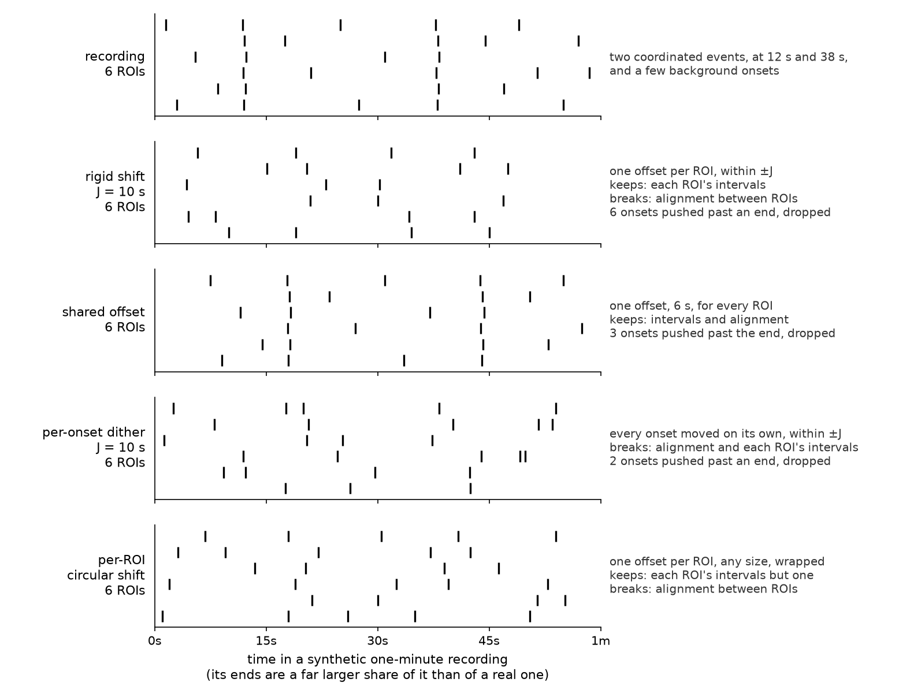
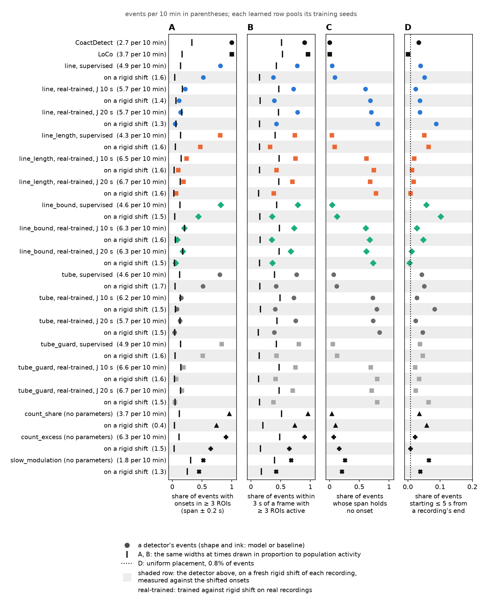

# Can a detector learn coordinated events from rigid shift alone?

## The problem

The lab images calcium in hippocampal slices, and a **coordinated event** is several cells becoming
active within a fraction of a second. None of the 84 lab fast-stream baseline recordings used here
is annotated, so every *supervised* detector in this project is fitted on a **simulator** whose
events were measured from the lab's own recordings. A detector that never sees a real event cannot
be told it was wrong about one.

A label-free detector would need no annotation. What it needs instead are copies of a recording
that keep everything except the thing to be detected, so that "score the recording above its copy"
is a training signal. **Rigid shift** is the candidate (Figure 1, the surrogates): each ROI's whole
train of onsets slides by one random offset within ±*J*, so every ROI keeps its own intervals while
the alignment *between* ROIs is broken. Onsets pushed past either end of the recording are dropped.

Two things can go wrong, and each has a test. A detector trained against a surrogate learns
**whatever the surrogate moves**, not only what it was meant to move. So the first test asks whether
anything besides alignment moves: first per ROI, then in the population-average channels that a
detector averaging over ROIs actually receives (the **aggregate leak test**). The second is that
rigid shift at *J* = 10–20 s also removes slow co-modulation, ROIs rising and falling together over
tens of seconds. A model trained against it may learn that instead of sub-second events.

The architecture question sits beside those two. `tube`, the project's existing learned detector,
averages over ROIs and then compares a narrow smoothing of that average with a wider one (a
center-surround filter). `line`, the **counting architecture** built for this work, first bounds each
ROI's contribution and then counts the ROIs lit together, with a second sensor for how tightly they
arrive. Its supervised score is both the case for the family and the ceiling a label-free version
of it is measured against.

**Figure 1. The surrogates, on a synthetic minute.** Six ROIs with two coordinated events, then the
same recording under each transform this page uses. The offsets are set by hand for the picture; a
real minute of recording loses a far smaller share of its onsets at the ends than this toy does.

So the page asks, in order:

1. **Does rigid shift move anything besides alignment?** (Figure 2, the leak tests)
2. **Does counting beat the center-surround filter and the hand-written detectors, when trained on
   the simulator?** (Figure 3, the bake-off)
3. **Can a detector be trained against rigid shift alone, and does what it learns look like
   sub-second events or slow co-modulation?** (Figure 4, training without labels)
4. **What do these models call on real recordings?** (Figure 5, real recordings)

## Terms

- **ROI**, region of interest: one imaged cell. An **onset** is the frame at which a cell's calcium
  transient starts. Recordings are 0.1 s per frame on the lab fast stream and 1.4 s per frame on the
  lab slow stream; training uses the fast stream only.
- **Surrogate**: a transformed copy of a recording. ***J***: the radius of a surrogate's
  displacement, in seconds. The surrogates of Figure 1 are rigid shift, a **shared offset** (one
  offset for every ROI, so alignment is kept), **per-onset dither** (each onset moved on its own)
  and a **per-ROI circular shift** (one offset per ROI of any size, wrapped at the end).
- **Leak**: anything a surrogate changes besides the alignment between ROIs. A **positive control**
  (the glossary's *known-bad control*) is a transform built so a test must detect it; a test that
  cannot has no power. A **null control** is one a test must read as chance.
- **Accuracy (0.5 = chance)**: the leak tests' score, the held-out accuracy of a classifier choosing
  which of a pair is the real recording.
- **Share where real scores higher (0.5 = chance)**: the trained models' paired checks, the share of
  held-out crops in which the model scores the real crop above its transformed copy; ties count as
  half.
- **F1**: the harmonic mean of recall and precision against events planted in simulated
  recordings, 1.0 perfect.
- **Label-free threshold**: set per held-out recording, with no labels. Scanning down from the
  top, it is the last threshold before the model fires more than a stated rate (0.5, 1 or 2 events
  per 10 minutes) on any of three rigid shifts of that recording. It caps the rate on the shifts,
  not on the recording.
- **Truth-reading threshold** (the glossary's *oracle threshold*): the F1-best threshold on two
  validation recordings with planted events. It reads the answer, so it is a comparison, not a rule,
  and not a ceiling either: a label-free threshold can score above it.
- **Arm**: one way of producing a model: supervised on the simulator; untrained (the architecture
  at its registered initial parameters); trained against rigid shift on simulated recordings
  (**sim**) or on real baseline recordings (**real**); or a **count baseline**, a scorer with no
  parameters. A **condition** is one arm, one *J* and one model.
- **CoactDetect** and **LoCo** are the project's hand-written detectors, each firing when at least
  three ROIs are active together against a local background.

## What this run found

- **Rigid shift moves nothing a per-ROI classifier can see on the lab fast stream, and that
  classifier has power.** It reads rigid shift at 0.486–0.505 accuracy at every *J* from 1.6 s to
  40 s, while per-onset dither reads 0.738–0.794 and a per-ROI circular shift, which keeps
  intervals as rigid shift does, reads 0.549–0.561 (Figure 2, the leak tests).
- **In the population-average channels, a real recording separates from its rigid shift at
  0.66–0.69, and the separation does not grow with *J*.** A synthetic twin with shared slow
  modulation and no events reads chance at *J* = 1.6 s (0.503) and 0.82 by 20 s; the real
  recordings already read 0.670 at 1.6 s. What separates them is not slow shared modulation alone.
- **At three training seeds no counting build separates from CoactDetect.** `line` leads by
  +0.047 F1 with a corrected 95 % interval of −0.17 to +0.26, and one fold of four carries every
  learned margin (Figure 3, the bake-off). `line` over `tube` is positive on all four folds.
- **Training against rigid shift beats the untrained architectures at strict rates and loses to a
  detector with no parameters at every rate.** At ≤ 1 event per 10 minutes the 20 trained conditions
  score 0.126–0.322 F1, the untrained models at most 0.093, and `count_excess`, the share of ROIs
  active minus its own 30 s mean, 0.400–0.404; supervised models score 0.519–0.674 (Figure 4,
  training without labels).
- **What training taught shows on synthetic twins, not on real crops: the trained models respond to
  planted sub-second events and only weakly to shared slow modulation.** Against a 1.6 s rigid shift
  they separate an events-only twin at 0.958–1.000 and a shared-modulation twin at 0.524–0.541; at
  20 s the modulation twin reaches only 0.549–0.624, below supervised models (0.658–0.733) and a 10 s
  average (0.829). The paired checks on real crops could not have shown this: a 10 s average also
  separates planted events from a 1.6 s shift (0.650).
- **On real recordings, supervised models and `count_excess` call multi-ROI co-activity that a rigid
  shift of the same recordings removes.** 0.799–0.830 and 0.903 of their events hold onsets in at
  least three ROIs, against 0.12–0.14 at activity-weighted random times, and 0.046–0.070 and 0.073 on
  the rigid shift. **The models trained against rigid shift see events at crop scale and do not
  localize them at a threshold**: 0.128–0.237 of their events hold three ROIs, inside the
  activity-weighted chance range of 0.127–0.203 (Figure 5, real recordings).
- **Four decisions follow**, in *What waits on Tony*.

> **Exploratory.** It replaces the version of 2026-09-16, whose third blind review found the trained
> models' controls unable to tell coordination from slow shared modulation; the controls here were
> added in answer ([record](../../reviews/tube-self-supervised-2026-09-17-round3.md)). Nothing here
> is promoted: `docs/MILESTONES.md` reserves that to Tony, and its standing ruling is **a table of
> performance, not a ranking**. Every result quoted from this run's outputs is a key in
> [`summary.json`](summary.json), written by `tools/summarize_tube_self_supervised.py`; constants of
> the tools and numbers from other documents carry their source where they appear. **⚠ marks a claim
> not to lean on**, with the reason beside it.

## Figure 2. The leak tests

**Figure 2. The leak tests.** **A** (lab fast) and **B** (lab slow): a linear classifier over per-ROI
statistics of a 60 s window tells real windows from transformed ones; accuracy with a 95 % interval
from a bootstrap that resamples mice and refits. **C**: the same forced choice on the lab fast
stream, read from population-average channels. **D**: synthetic twins against their own rigid shift,
read from the same channels.

**On the lab fast stream the per-ROI classifier sees three of the four transforms, and rigid shift
is not among them.**

| lab fast, accuracy (0.5 = chance) at *J* | 1.6 s | 2.5 s | 5 s | 10 s | 20 s | 40 s |
|---|---|---|---|---|---|---|
| rigid shift | 0.497 | 0.505 | 0.502 | 0.505 | 0.486 | 0.492 |
| shared offset (null control) | 0.498 | 0.502 | 0.495 | 0.516 | 0.504 | 0.509 |
| per-onset dither (positive control) | 0.738 | 0.761 | 0.784 | 0.794 | 0.775 | 0.785 |
| per-ROI circular shift (positive control) | 0.561 | 0.552 | 0.558 | 0.554 | 0.549 | 0.556 |

The classifier's inputs are each ROI's onset count, the quantiles of its same-ROI intervals and its
shortest interval, and the share of ROIs with an onset and with an interval, pooled over ROIs by
mean, standard deviation, minimum, median and maximum; 84 recordings from 44 mice, 1,501 window
pairs per stream, folds grouped by mouse. Features at the window's edges were removed because they
see a shift directly.

⚠ **What this test can and cannot see.** It cannot see alignment finer than its 60 s window. It
**can** see ROIs' counts rising and falling together across windows, which is why a per-ROI circular
shift, which keeps intervals but moves each ROI's counts by up to a whole recording, is caught
(lowest lower bound 0.513). Per-onset dither is caught mainly because it breaks each ROI's shortest
interval, something rigid shift can never do, so dither alone would not show the test has power
against a leak rigid shift could have. The circular shift is the control that can. The lab slow
stream shows the same effect at rigid shift's own displacements: 0.500–0.524 up to 11.2 s, then
**0.558 at 22.4 s and 0.567 at 44.8 s** (lower bounds 0.512 and 0.517), with the shared offset
at 0.495–0.507. That is slow shared modulation, not a per-ROI leak. The slow stream's
displacements are the fast stream's rounded to whole 1.4 s frames.

**In the population-average channels, real recordings separate from rigid shift at every *J*, and
the size of the separation does not depend on *J*.**

| lab fast, accuracy (0.5 = chance) | hand-built initial bank | fitted `tube`, four folds | fitted `line`, four folds |
|---|---|---|---|
| real vs rigid shift | 0.664–0.688 | 0.654–0.678 | 0.657–0.684 |
| real vs shared offset (null control) | 0.520–0.530 | 0.476–0.527 | 0.484–0.527 |
| planted-event twin vs its rigid shift (positive control) | 0.861–0.886 | 0.864–0.900 | 0.847–0.914 |
| stationary twin vs its rigid shift | 0.442–0.536 | 0.431–0.578 | 0.478–0.592 |
| independent-modulation twin vs its rigid shift (null control) | 0.456–0.586 | 0.417–0.558 | 0.464–0.569 |
| shared-modulation twin vs its rigid shift | 0.503–0.817 | 0.506–0.756 | 0.489–0.772 |

Ranges run over *J* = 1.6, 5, 10, 20 and 40 s, and for the fitted models also over the four
held-out folds. The **channels** are the share of ROIs active in each frame (the cells-mean trace)
and its response to difference-of-Gaussians kernels. The **hand-built bank** reproduces `tube`'s
kernels at initialization at its four scales and adds four wider ones, so it is a stand-in, not
`tube` itself; the fitted rows read what a supervised `tube` or `line` head actually receives. The
**twins** are synthetic recordings of 20 ROIs' worth of real rates: the stationary twin has no
events and no modulation, which rigid shift leaves unchanged, so it cannot fail and is kept only for
continuity; the shared-modulation twin gives every ROI one 40 s rate cycle of depth 0.9 and no
events; the independent-modulation twin gives each ROI its own.

**The shared-modulation twin is what slow co-modulation alone looks like in these channels**: chance
at *J* = 1.6 s (0.503, interval 0.408–0.583), rising to 0.742 at 10 s and 0.817 at 20 s. The
real recordings read 0.670 at 1.6 s and 0.664–0.688 at every other displacement. So what separates
real recordings from their rigid shift in these channels is present at a shift of 1.6 s, where 40 s
co-modulation is not. It is consistent with sub-second co-activity; it does not identify it.

⚠ **The cells-mean trace alone does almost all of it**: 0.657–0.674 from the initial bank's trace
and 0.619–0.643 from the fitted heads' trace. That trace is the share of the field active, which is
what a counting architecture computes. So this test excludes a leak the shared offset would also
carry and says nothing about whether the co-activity is coordination. Whether rigid shift
**removes** planted coordination was measured in the earlier look, not rerun here: 84–99 % of it on
the lab fast stream at 10–20 s ([the look](../rigid_shift_look/README.md)).

## Figure 3. The supervised bake-off

**Figure 3. The supervised bake-off.** **A**: every detector on the simulator's four held-out folds
(two recordings each, 30 planted events per fold); learned models at training seeds 0, 1 and 2. A
dot is one fold's F1 averaged over the seeds; the bar is the mean of the four folds, not an interval.
Rows are grouped by family and in the same order in every table and figure here. **B**: the
comparisons the page makes, fold by fold; the grey line is a 95 % interval with the
Nadeau–Bengio correction for folds that share training data. **C**: the plant probe, below.

**No learned model separates from CoactDetect, and one fold carries every learned margin.** Without
the third fold, no learned model leads CoactDetect by more than 0.008 F1. What sets that fold apart
was not examined. `line` over `tube` is the one comparison positive on every fold.

| comparison, ΔF1 | per fold | mean | 95 % interval, corrected | sign test *p* | mean without the fold with the largest difference |
|---|---|---|---|---|---|
| line − CoactDetect | −0.005 / −0.004 / +0.178 / +0.018 | +0.047 | −0.168 to +0.262 | 1.00 | +0.003 |
| line_length − CoactDetect | −0.035 / +0.036 / +0.126 / −0.001 | +0.032 | −0.137 to +0.200 | 1.00 | 0.000 |
| line_bound − CoactDetect | −0.033 / +0.033 / +0.147 / +0.025 | +0.043 | −0.141 to +0.227 | 0.63 | +0.008 |
| tube − CoactDetect | −0.052 / −0.035 / +0.116 / −0.017 | +0.003 | −0.183 to +0.189 | 0.63 | −0.035 |
| line − line_length (concentration channels) | +0.029 / −0.040 / +0.052 / +0.019 | +0.015 | −0.080 to +0.110 | 0.63 | +0.003 |
| line_bound − line (two changes, below) | −0.028 / +0.037 / −0.031 / +0.007 | −0.004 | −0.082 to +0.074 | 1.00 | −0.018 |
| line − tube | +0.047 / +0.031 / +0.062 / +0.035 | +0.044 | +0.009 to +0.078 | 0.13 | +0.038 |
| CoactDetect − LoCo | +0.071 / +0.005 / +0.039 / −0.035 | +0.020 | −0.090 to +0.130 | 0.63 | +0.003 |

⚠ Eight comparisons, none corrected for multiplicity; `line` over `tube` has a corrected *p* of
0.027, which eight comparisons would not survive by Bonferroni. Four folds cannot exclude any effect
smaller than about ±0.08 F1 between the counting builds.

**The builds.** `line` bounds each ROI's vote in height with a sigmoid, averages the votes over ROIs
(**relative length**, the share of the field lit), and adds **concentration channels**: that share at
a narrow smoothing divided by the share at the next wider one, near 1 when the lit ROIs arrive
together (registered in code as orientation channels; they read no image orientation, because these
models ignore ROI order). `line_length` keeps relative length only. `line_bound` differs from `line`
in **two** ways: each ROI's vote is also bounded in time, and the vote's resting level on an empty
field is subtracted. A difference between them is therefore not attributable to either change alone.
All three have 1,305 parameters.

| detector | what it computes | F1 ± SD over folds | recall | precision | promiscuity-probe calls per fold | seconds per fit |
|---|---|---|---|---|---|---|
| line | counting, two sensors | 0.698 ± 0.064 | 0.875 | 0.584 | 3.25 | 66–67 |
| line_length | counting, relative length only | 0.682 ± 0.038 | 0.842 | 0.580 | 4.42 | 64–66 |
| line_bound | counting, vote bounded in time | 0.694 ± 0.040 | 0.881 | 0.575 | 3.50 | 289–292 |
| tube | center-surround on the ROI average | 0.654 ± 0.050 | 0.836 | 0.544 | 20.67 | 7.7–8.2 |
| tube_guard | `tube` with a guard band between center and surround | 0.643 ± 0.052 | 0.797 | 0.548 | 15.25 | 7.3–7.7 |
| tube_ratio | `tube` dividing by the surround instead of subtracting | 0.508 ± 0.025 | 0.647 | 0.432 | 0.17 | 8.7–8.9 |
| tube_ratio_guard | both | 0.466 ± 0.054 | 0.611 | 0.399 | 0.00 | 8.7–8.9 |
| tiny | a small convolutional network ⚠ | 0.125 ± 0.000 | 0.067 | 1.000 | 0.00 | 89 |
| trace | a network on the cells-mean trace | 0.120 ± 0.011 | 0.072 | 0.669 | 0.00 | 9.4–9.5 |
| CoactDetect | hand-written here | 0.651 ± 0.044 | 0.767 | 0.572 | 1.25 | — |
| LoCo | hand-written here | 0.631 ± 0.046 | 0.742 | 0.555 | 3.50 | — |
| rate+context | hand-written here | 0.607 ± 0.082 | 0.675 | 0.552 | 26.50 | — |
| binned SCE | hand-written here, after Cossart, Aronov & Yuste 2003 ⚠ | 0.582 ± 0.072 | 0.758 | 0.478 | 59.75 | — |
| locust | partial port of CICADA ⚠ | 0.545 ± 0.052 | 0.708 | 0.447 | 239.25 | — |
| SPIKE-synch | wraps a synchronization profile ⚠ | 0.267 ± 0.072 | 0.175 | 0.569 | 8.75 | — |

**Promiscuity-probe calls** are detections inside a stretch of each simulated recording where ROIs
are dense but nothing is planted, excluded from precision because a detector can buy recall with
them. **Seconds per fit** is the range over seeds of the mean, with three bake-offs sharing one
Mac: a comparison within this run, not a benchmark. ⚠ **`tiny`** sits on its threshold grid's lowest
value in all 12 fold-seed fits, where each recording becomes one detection; 0.125 is what that
scores, not an operating point. ⚠ **binned SCE** (synchronous calcium events) is this project's
detector in that paper's tradition, not a port of it. ⚠ **`locust`** is a partial, modified port that
skips CICADA's own transient detection, and ⚠ **SPIKE-synch** thresholds a synchronization profile
without the detection layer its authors published, so neither row measures the other lab's method
(see *The published lineage*).

**The plant probe (panel C)** asks what each supervised model responds to. Four plants of the same
number of onsets are laid on a quiet synthetic field of 32 ROIs: a **synchronous plant** (one onset in
each of *n* ROIs, all in one frame), a **burst** (*n*/4 ROIs, four onsets each within 0.6 s), a
**fuzz** (the synchronous plant's *n* ROIs spread over 2.9 s) and a **wave** (the same *n* ROIs one
frame apart). Each ratio is the synchronous plant's response divided by the other plant's, where a
response is the model's peak score with the plant minus without it, over 12 fields, at one training
seed. All three counting builds separate the synchronous plant from a burst more than `tube` does. At
the largest plant, the ratios over fuzz are 1.99 for `line`, 1.75 for `line_length`, 1.60 for
`line_bound` and 1.43 for `tube`, each with an approximate standard error of 10–14 % of the ratio, so
each adjacent pair in that ordering differs by less than its combined error. **Read the panel as a
direction**: the head is a
six-layer stack, so a ratio of response differences does not compare strictly across models, and the
wave's span grows with the plant by construction.

## Figure 4. Training against rigid shift, with no labels

**Figure 4. Training against rigid shift, with no labels.** Five architectures × three training
seeds × four folds in four arms (supervised, untrained, sim and real, the last two at *J* = 10 s and
20 s): 360 fits, plus the three count baselines at each *J* on each fold (24 rows). Every mark is a condition's
mean; a fit with no true positive scores 0. **A**: F1 at the label-free threshold at each rate. **B**:
F1 at the truth-reading threshold against the share of the held-out recording the detections cover
there. **C**: the paired checks on held-out real crops (409.6 s each), grouped by what each can show.

**The objective.** A crop of 4,096 frames and the same crop of its rigid shift go through the model;
each crop's score is the mean of its top 1 % of per-frame scores; the loss is
softplus(shifted score − real score). 900 steps, three crop pairs per step, no label read. Crops stay
more than *J* from either end, so the onsets rigid shift drops never enter training.

**A detector with no parameters beats every model trained against rigid shift.** `count_excess`,
the share of ROIs with an onset within ±0.2 s minus its own 30 s moving mean, scores above all 20
trained conditions at every label-free rate. Training against rigid shift does beat the untrained
architectures once the rate is strict, and every trained condition stays far below supervised
training.

| planted-truth F1 at the label-free threshold | ≤ 0.5 events per 10 min | ≤ 1 | ≤ 2 |
|---|---|---|---|
| supervised (5 models) | 0.434–0.618 | 0.519–0.674 | 0.629–0.703 |
| `count_excess` (no parameters, both *J*) | 0.307–0.319 | 0.400–0.404 | 0.478 |
| `count_share` (no parameters, both *J*) | 0.122–0.133 | 0.181–0.234 | 0.312 |
| trained against rigid shift (20 conditions) | 0.070–0.250 | 0.126–0.322 | 0.219–0.386 |
| untrained (5 models) | 0.000–0.039 | 0.000–0.093 | 0.000–0.291 |
| `slow_modulation` (no parameters, both *J*) | 0.000 | 0.000 | 0.000 |

Ranges are over condition means of 12 fits (4 held-out folds for the count baselines). At ≤ 2 events
per 10 minutes, untrained `line_length` (0.291) is ahead of 14 of the 20 trained conditions; at the
two stricter rates every trained condition is ahead of every untrained model. Between 1 and 9 of the
12 fits in a trained condition score no true positive at ≤ 0.5, and up to 5 at ≤ 2. In the `line`
conditions the label-free threshold fell to its grid's lowest value in 8, 9 and 10 fit-and-recording
settings at the three rates (all of them `line`, 2–4 per condition), where one detection can cover a
whole recording. `slow_modulation` fires within the rate on no held-out recording's shifts and
scores 0.

⚠ **The truth-reading scores of every arm trained on real recordings, and of the untrained arm, are
not detection** (panel B). They reach 0.499–0.577 and 0.503–0.559 with detections covering a median
0.954–0.985 and 0.962–0.984 of each held-out recording, 23–128 s wide: they touch planted events by
being on almost everywhere. Supervised models cover 0.005–0.010 and `count_excess` 0.004, at 0.662–0.696
and 0.648. Among the arms trained on simulated recordings, `line` at 10 s (0.551, covering 0.035) and
`line_length` at 20 s (0.620, covering 0.022) are narrow; `line_length` at 10 s, `line` at 20 s and
`line_bound` at 10 s cover 0.36–0.50; the tube family at both displacements and `line_bound` at 20 s
cover 0.92 or more. The truth-reading threshold sits on its grid's edge in 4 of the 360 trained,
supervised and untrained fits, all `line`, so the coverage is the models' and not the search's.

**The paired checks (panel C) cannot say whether a model learned sub-second events or slow shared
modulation, and models trained on labelled events give the same pattern as models trained against
rigid shift.**

| share where the real crop scores higher (0.5 = chance), condition means | supervised | trained on simulated | trained on real | count baselines |
|---|---|---|---|---|
| shared offset, same crop (null) | 0.500–0.517 | 0.464–0.513 | 0.484–0.555 | 0.482–0.557 |
| shared offset, independent crop (null) | 0.431–0.487 | 0.456–0.505 | 0.450–0.510 | 0.446–0.518 |
| stationary twin vs its rigid shift (cannot fail) | 0.462–0.521 | 0.454–0.554 | 0.456–0.575 | 0.406–0.575 |
| independent-modulation twin vs its rigid shift (null) | 0.446–0.521 | 0.448–0.569 | 0.442–0.579 | 0.400–0.569 |
| a fifth of every ROI's onsets removed (positive control) | 0.650–0.765 | 0.669–0.791 | 0.766–0.940 | 0.810–0.896 |
| rigid shift at the training *J* | 0.688–0.730 | 0.596–0.734 | 0.720–0.774 | 0.664–0.783 |
| rigid shift at *J* = 1.6 s | 0.649–0.709 | 0.631–0.693 | 0.687–0.774 | 0.616–0.786 |
| shared-modulation twin vs its rigid shift | 0.596–0.642 | 0.552–0.650 | 0.575–0.679 | 0.662–0.763 |

The null checks read chance for every group. The positive control moves above 0.5 in 10–12 of 12
fits per supervised condition, 11–12 per condition trained on real recordings, 8–12 per condition
trained on simulated recordings, and in every count-baseline fold; in the untrained arm it moves in
only 1–8 of 12, which is expected of models that separate nothing. The untrained models read
0.485–0.519 on the rigid-shift checks.

Two results say the last two rows cannot separate the alternatives on real crops. **Supervised
models, trained on planted events and never shown modulation, see the shared-modulation twin
(0.596–0.642) and the 1.6 s shift (0.649–0.709) as much as the models trained against rigid shift
do.** And **the 1.6 s check reads events as well as modulation**: `slow_modulation`, which averages
over 10 s and so cannot resolve a sub-second event, separates a synthetic twin with planted events and
no modulation from its 1.6 s shift at 0.650, and so its own real-crop reading at 1.6 s (0.616–0.633)
can come from events alone.

**So the models were asked directly** (`small_j_check`, with `tools/check_small_j_mixes_events.py`):
every checkpoint trained against rigid shift on real recordings (10 conditions × 12 fits), a
supervised fit and an untrained model of each architecture, and the count baselines, each scored on
synthetic twins against their own rigid shift, with the paired checks' crops and rule, 60 twin
recordings per scorer.

| share where the twin scores above its rigid shift | events, no modulation, *J* 1.6 s | events plus independent modulation, 1.6 s | shared modulation, no events, 1.6 s | shared modulation, 20 s | independent modulation, no events, 1.6 s (null) |
|---|---|---|---|---|---|
| trained against rigid shift (10 conditions) | 0.958–1.000 | 0.950–1.000 | 0.524–0.541 | 0.549–0.624 | 0.455–0.497 |
| supervised (5 fits) | 0.975–1.000 | 0.792–1.000 | 0.550–0.625 | 0.658–0.733 | 0.475–0.517 |
| untrained (5 models) | 0.458–0.546 | 0.438–0.583 | 0.438–0.500 | 0.475–0.517 | 0.487–0.521 |
| `count_excess` | 1.000 | 1.000 | 0.554 | 0.646 | 0.458 |
| `slow_modulation` | 0.650 | 0.613 | 0.550 | 0.829 | 0.546 |

**The models trained against rigid shift respond to planted sub-second events as strongly as the
supervised ones do, and to shared slow modulation less than the supervised models or a 10 s average
do.** Above chance on the events twin in 11–12 of 12 fits per condition. The twins are synthetic
(participation 0.2, a 40 s modulation cycle of depth 0.9), so this shows what the crop score responds
to, not what real recordings contain; how the lab's recordings co-modulate is measured separately
(on branch `unsup/slow-comodulation`, under its own review).

The training loss, averaged over the last five logged steps, ended at or above chance (ln 2 = 0.693)
in 0–4 of 12 fits per condition; the median share of training pairs won over those steps is
0.90–1.00 for the arms trained on simulated recordings and 0.63–0.80 for those trained on real ones.
⚠ The same-crop shared offset ties on up to 0.98 of crops in a fit, counted as half, and 10 trained
fits tie on every crop; the independent-crop version is there so ties are not what holds it at 0.5.

## Figure 5. Real recordings

**Figure 5. Real recordings.** Each detector on all 84 lab fast-stream baseline recordings (four
groups pooled), and each learned model and count baseline also on one rigid shift of every recording
at the *J* its threshold was set with. **A**: the share of events with an onset in at least 3 ROIs
within the event's span, against the same share at uniformly random times and at times drawn in
proportion to population activity, ten draws per event. **B**: the share of events starting within
5 s of either end of the recording, against uniform placement. **C, D**: the share of a detector's
events that a CoactDetect event (C) or a LoCo event (D) overlaps within 1 s, against the same overlap
at random times.

**Supervised models and `count_excess` call co-activity on real recordings, and lose it on a rigid
shift of them. Models trained against rigid shift call events that hold no more co-activity than
random times weighted by population activity.**

| detector, label-free threshold ≤ 2 events per 10 min | events per 10 min | share of events with onsets in ≥ 3 ROIs | same, random times weighted by activity | on its rigid shift: events per 10 min, share ≥ 3 ROIs |
|---|---|---|---|---|
| CoactDetect (production operating point) | 2.70 | 1.00 ⚠ | 0.33 | — |
| LoCo (production operating point) | 3.72 | 1.00 ⚠ | 0.16 | — |
| supervised, five models | 4.27–4.93 | 0.799–0.830 | 0.122–0.140 | 1.36–1.49, 0.046–0.070 |
| trained against rigid shift, ten conditions | 5.67–6.75 | 0.128–0.237 | 0.127–0.203 | 1.26–1.45, 0.038–0.098 |
| `count_excess` (no parameters) | 6.29 | 0.903 | 0.118 | 1.23, 0.073 |
| `count_share` (no parameters) | 3.74 | 0.960 | 0.121 | 0.31, 0.098 |
| `slow_modulation` (no parameters) | 1.83 | 0.523 | 0.316 | 1.08, 0.425 |

A detector's **event** spans its merged detection (detections closer than 2 s merge), and an ROI
counts if it has an onset within that span ±0.2 s. ⚠ CoactDetect and LoCo fire only when at least
three ROIs coincide, so their 1.00 is their definition, not a finding. Each learned row pools its three
training seeds (for the models trained against rigid shift, 3 seeds × 4 mouse folds); the count
baselines have no seed. The supervised label-free threshold on real recordings is set on rigid shifts
at *J* = 20 s.

- **The rate cap holds on the shifts, not on the recordings.** Every learned model fires 1.26–1.49
  times per 10 minutes on its rigid shift, inside the ≤ 2 cap its threshold was set to, and 4.27–6.75
  times on the recordings themselves. For the supervised models and `count_excess` that excess is
  multi-ROI co-activity that the shift removes. For the models trained against rigid shift it is not:
  their share of events with at least three ROIs (0.128–0.237) sits inside the activity-weighted
  chance range (0.127–0.203), and the median event holds 0–1 ROIs.
- **`slow_modulation` is the detector the checks worried about**, and on real recordings it behaves as
  one: about half its events hold three ROIs, against 0.32 by chance, and its rigid shift keeps most
  of that (0.43), because a 10 s average of the active share is slow enough to survive a 20 s shift in
  part.

**Agreement** is the share of one detector's events that any event of another overlaps within ±1 s
(Figure 5, panels C and D). ⚠ It is a many-to-one overlap, not a recall: a detector that splits one
reference event into five is credited five times.

| detector | share of CoactDetect's events it overlaps | share of LoCo's | share of its own events near CoactDetect | near LoCo |
|---|---|---|---|---|
| supervised, five models | 0.680–0.825 | 0.545–0.715 | 0.431–0.472 (chance 0.052–0.056) | 0.475–0.543 |
| trained against rigid shift, ten conditions | 0.466–0.685 | 0.307–0.619 | 0.202–0.307 (chance 0.046–0.064) | 0.174–0.340 |
| `count_excess` | 0.845 | 0.868 | 0.382 (chance 0.045) | 0.518 |

The two references agree with each other at 0.780 (CoactDetect's events near LoCo's) and 0.591. Every
learned model fires more often than either reference, so overlapping more of a reference's events
partly rewards firing more; the share of a detector's own events near a reference is the column that
does not.

⚠ **Edge enrichment is a property of the detectors, not of the recordings.** Within 5 s of either end
of a recording, uniform placement expects 0.8 % of events. The supervised label-free rows put 3.8–5.7 %
there on the recordings and **5.0–10.0 % on their rigid shifts**, where no alignment is left to find;
at their bake-off thresholds 1.6–2.2 %. The rows trained against rigid shift put 1.1–3.7 % there, and
0.7–8.8 % on their shifts; CoactDetect 3.3 %, LoCo 0.0 %, `count_excess` 2.2 %. A candidate cause, not
tested: the difference-of-Gaussians kernels pad the recording with zeros up to 12.8 s beyond each end
and the head reaches a further 6.3 s, so the frames nearest an end are judged against an empty
background. Rigid shift drops onsets there too, which lowers the background the threshold is set
against.

**Nothing here is ground truth.** No recording in the export folder is annotated, and
`docs/MILESTONES.md` blocks quoting any transfer figure until a MAHICE review (machine-assisted human
identification of coordinated events) exists. This is a consistency check. The 84 recordings come from
44 mice in four groups, pooled here; events are pooled across runs on the same recordings, not
clustered by mouse.

**Nothing here is ground truth.** No recording in the export folder is annotated, and
`docs/MILESTONES.md` blocks quoting any transfer figure until a MAHICE review (machine-assisted human
identification of coordinated events) exists. This is a consistency check. Supervised models are
fitted on the simulator at three seeds; models trained against rigid shift are fitted per mouse fold
at three seeds; every row pools its runs. ⚠ Events are pooled over runs on the same recordings, not
clustered by mouse (84 recordings from 44 mice). An **event** merges detections closer than 2 s.

## What this does not settle

- **No learned model separates from CoactDetect** at four folds and three seeds. Promoting any row is
  Tony's decision, and these numbers do not argue for it.
- **Rigid shift here is not the published regime.** Whole-train shifting as published shifts each of
  many short **trials** independently, and Stella et al. 2022 found it the most robust of the
  surrogates they compared at a 25 ms dither. This run shifts one ~20 min recording as a single trial
  by 10–20 s, 400–800 times that dither; a lag pattern repeated between two ROIs survives it as one
  new constant lag.
- **Dropping onsets at the ends biases the null.** Rolling the train instead keeps the expected
  coincidence count (Louis, Borgelt & Grün 2010); dropping lowers the surrogate's, which makes real
  recordings look more coordinated. At 10 s and 20 s rigid shift drops 0.5 % and 1.1 % of lab fast
  onsets. Training crops stay clear of the ends; the label-free thresholds and the leak tests do not.
- **The aggregate leak test cannot exclude co-activity**, because its strongest channel is the share
  of the field lit (Figure 2, the leak tests).
- **The objective is untuned**: one pooling rule, one learning rate, 900 steps. It pays for any
  separation of real from shifted, so a two-ROI coincidence earns as much as a crowd.
- **A bench label-free score and a real-recording label-free event rate are not the same operating
  point.** The bench's dense probe stretch survives into the rigid shifts its threshold is set on,
  and real recordings have no such stretch; and on the bench the supervised and untrained thresholds
  use rigid shifts at *J* = 10 s, on real recordings at 20 s.
- **`line_bound`'s time bound is soft**: a four-onset burst's peak vote reaches 1.04–1.15 times one
  onset's on an untrained model with hand-set widths (`tests/test_line_vote.py`, which checks the
  vote helpers rather than the full forward pass).
- **The simulator's events carry 0.311 s of onset jitter**, measured within clusters against a null of
  0.335 s (`docs/learned/generator_spec.json`); `docs/generator.md` gives 0.36 s against 0.42 s from an
  earlier fit and calls it its least trustworthy number. Either way the planted spread is close to its
  own null.
- **Of the real recordings, only the lab fast stream** was used for training; the other training arm
  used simulated recordings, whose five-minute dense stretch is itself shared slow drift that rigid
  shift leaves in place. **`line` and `line_bound` have not been reviewed as code.**
- **The literature search** covered spike-train surrogates, radar constant-false-alarm-rate
  detection, learned Neyman–Pearson detection, calcium-imaging population-event detection, and
  weakly supervised sound-event detection. It did not cover anomaly and change-point detection, EEG
  (electroencephalography) burst detection, astronomical or seismological transient detection,
  time-shift surrogates in nonlinear time-series analysis, or contrastive learning beyond the two
  papers named below.

## What waits on Tony

In the order the argument raised them.

1. **Does shared modulation over tens of seconds count as coordination?** Rigid shift at *J* removes
   only modulation faster than about *J*. On the lab slow stream the per-ROI classifier detects what
   rigid shift removes from 22.4 s (Figure 2, panel B); on the lab fast stream it detects nothing up
   to 40 s, which is a statement about that classifier, not a finding that the modulation is absent.
   The models trained against rigid shift respond to it only weakly on synthetic twins (Figure 4). The
   answer decides whether *J* belongs at 10–20 s.
2. **Does any learned build stay, given that none separates from CoactDetect; and if one does,
   which?** All three are registered and on the bake-off roster today; staying means remaining there,
   and a build that goes is unregistered with its tests. Between the builds: the concentration
   channels add +0.015 F1 (corrected interval −0.080 to +0.110) and cut promiscuity-probe calls from
   4.42 to 3.25 per fold; `line_bound` changes F1 by −0.004 (−0.082 to +0.074) at about four times
   the fit time, with its two changes confounded. On real recordings the three builds' supervised calls
   hold 0.804–0.814 multi-ROI co-activity and overlap 0.680–0.804 of CoactDetect's events, with no
   interval that separates them.
3. **Is the objective worth another attempt, as built?** It taught every architecture to respond to
   planted sub-second events at the scale of a 409.6 s crop, and not to localize them: at a threshold
   the trained models lose at every rate to `count_excess`, a count judged against its local
   background with no parameters (Figure 4), and on real recordings their calls hold no more co-activity
   than chance (Figure 5). An objective that pays for the number of ROIs in a window, rather than any
   separation of real from shifted, is the next design, and `count_excess` is the bar it has to
   clear; the
   weakly supervised sound-event literature measured which pooling rules localize events in time
   (Wang, Li & Metze 2019; McFee, Salamon & Bello 2018).
4. **Which event rate should the label-free threshold target?** The rule caps the rate on rigid
   shifts, not on the recording: at ≤ 2 events per 10 minutes on the shifts, the supervised models fire
   4.27–4.93 times per 10 minutes on real recordings and `count_excess` 6.29, against CoactDetect's
   2.70 and LoCo's 3.72 (Figure 5). The label-free rule also places more of a supervised model's
   events near a recording's ends than its bake-off threshold does (3.8–5.7 % against 1.6–2.2 % within
   5 s). No recommendation is made here.

## The published lineage

Nearly every component here is prior art.

**Whole-train shifting.** Pipa, Riehle & Grün 2007 describe a resampling method that Harrison &
Geman 2009 call closely related to their pattern jitter; Pipa et al. 2008 give whole-train shifting
in full. Louis, Borgelt & Grün 2010 recommend it, credit it jointly to Pipa et al. 2008 and Harrison
& Geman 2009, and roll the train at the ends so as not to underestimate the expected coincidence
count, noting that rolling is safe for their data because start and end rates match. Stella et al.
2022 found trial shifting, per neuron and per trial, the most robust of the surrogates they compared
for SPADE (spike pattern detection and evaluation) and recommend it there, at a 25 ms dither. ⚠ The
trail stops at Pipa, Riehle & Grün 2007, which is closed access and unread here; the multiple-shift
method of Grün et al. 1999 that Pipa et al. 2008 cite is, by its abstract, a coincidence detector
rather than a random-shift null. Elephant's `dither_spike_train` drops onsets at the ends as this run
does; the forms Louis et al. recommend and Stella et al. prefer both wrap, as does Dard et al.'s
circular shift.

**Counting co-active cells against a surrogate.** Cossart, Aronov & Yuste 2003 counted co-active
cells per frame against interval reshuffles; they credit Mao et al. 2001, not reached here. Dard et
al. 2022 do the same against a per-cell circular shift, with a threshold at the 99th percentile, on
the dataset this project also uses. The label-free threshold is that kind of **surrogate threshold**.

**Holding a false-alarm rate fixed.** Constant-false-alarm-rate (CFAR) detection sets a threshold in
proportion to an estimate of the background: Finn 1967, and the cell-averaging treatment of Finn &
Johnson 1968 (Finn's 1966 conference paper was not reached). `tube`'s difference of Gaussians is
CFAR-shaped only loosely: it subtracts its surround rather than scaling by it and has no guard cells,
so it does not hold the false-alarm probability constant when the background scale changes;
`tube_ratio` is the proportional variant. Capping each cell's contribution per bin is the clipping
step of Unitary Events (Grün, Diesmann & Aertsen 2002; the construction is Grün 1996).

**Learning against a surrogate or a constraint.** Training a model to score data above samples from
a chosen noise distribution is noise-contrastive estimation (Gutmann & Hyvärinen 2012), and this
objective is that with a domain-specific noise distribution. Telling real from surrogate with a
held-out classifier, as the leak tests do, is a classifier two-sample test (Lopez-Paz & Oquab 2017).
Training detectors under a Neyman–Pearson false-alarm constraint is established: in statistical
learning (Scott & Nowak 2005), in radar since at least Jarabo-Amores et al. 2009, and more recently
as a differentiable Neyman–Pearson criterion used as a loss (Zhu, Li & Zhang 2023) and in CFARnet
(Diskin, Beer, Okun & Wiesel 2024).

**What is this project's own** is narrow: a counting detector of this shape made differentiable,
trained against a whole-recording rigid shift, and thresholded at a stated rate on that surrogate, in
calcium imaging. The transfer is ours, not the ideas.

**Other labs' detectors in Figure 3.** `SPIKE-synch` wraps the SPIKE-synchronization profile (Kreuz,
Mulansky & Bozanic 2015) as implemented in PySpike (Mulansky & Kreuz 2016). The Kreuz group's own
event detection on that profile, which also requires a threshold on the mean calcium signal, is
Cecchini et al. 2021 (Kreuz, personal communication, April 2026). `locust` is a partial, modified port,
by way of interface2, of CICADA, from Cossart and Picardo's group at INMED (software: Denis et al.
2020), described as a framework by Hamon et al. 2026 (corresponding author Dard, EPFL, with INMED
co-authors). `binned SCE` descends from Cossart, Aronov & Yuste 2003 and is not a port.

## References

- Cecchini G, et al. (2021). *PLoS Comput Biol* 17(5):e1008963.
- Cossart R, Aronov D, Yuste R (2003). Attractor dynamics of network UP states in the neocortex. *Nature* 423:283–288.
- Dard RF, et al. (2022). *eLife* 11:e78116.
- Denis J, Dard RF, Quiroli E, Cossart R, Picardo MA (2020). CICADA. Zenodo, doi:10.5281/zenodo.10041434.
- Diskin T, Beer Y, Okun U, Wiesel A (2024). CFARnet. *Signal Processing* 223:109543 (arXiv:2208.02474).
- Finn HM (1967). Adaptive detection with regulated error probabilities. *RCA Review* 28(4):653–678.
- Finn HM, Johnson RS (1968). Adaptive detection mode with threshold control as a function of spatially sampled clutter-level estimates. *RCA Review* 29(3):414–464.
- Grün S (1996). Unitary joint-events in multiple-neuron spiking activity. Reihe Physik 60, Harri Deutsch.
- Grün S, Diesmann M, Aertsen A (2002). Unitary events in multiple single-neuron spiking activity: I. Detection and significance. *Neural Comput* 14(1):43–80.
- Grün S, Diesmann M, Grammont F, Riehle A, Aertsen A (1999). *J Neurosci Methods* 94:67–79.
- Gutmann MU, Hyvärinen A (2012). *J Mach Learn Res* 13:307–361.
- Hamon et al. (2026). bioRxiv, doi:10.64898/2026.07.03.736318.
- Harrison MT, Geman S (2009). *Neural Comput* 21:1244–1258.
- Jarabo-Amores MP, et al. (2009). *IEEE Trans Signal Process* 57:4175.
- Kreuz T, Mulansky M, Bozanic N (2015). SPIKY. *J Neurophysiol* 113(9):3432–3445.
- Lopez-Paz D, Oquab M (2017). Revisiting classifier two-sample tests. ICLR.
- Louis S, Borgelt C, Grün S (2010). Generation and selection of surrogate methods for correlation analysis. In Grün S, Rotter S (eds), *Analysis of Parallel Spike Trains*, ch. 17. Springer.
- Mao BQ, et al. (2001). *Neuron* 32:883–898 (not reached).
- McFee B, Salamon J, Bello JP (2018). *IEEE/ACM Trans Audio Speech Lang Process* 26(11):2180–2193.
- Mulansky M, Kreuz T (2016). PySpike. *SoftwareX* 5:183–189.
- Nadeau C, Bengio Y (2003). Inference for the generalization error. *Mach Learn* 52:239–281.
- Pipa G, Riehle A, Grün S (2007). *Neurocomputing* 70(10–12):2064–2068, doi:10.1016/j.neucom.2006.10.142.
- Pipa G, Wheeler DW, Singer W, Nikolić D (2008). NeuroXidence. *J Comput Neurosci* 25:64–88.
- Scott C, Nowak R (2005). A Neyman–Pearson approach to statistical learning. *IEEE Trans Inf Theory* 51:3806–3819.
- Stella A, Bouss P, Palm G, Grün S (2022). *eNeuro* 9(3), ENEURO.0505-21.2022.
- Wang Y, Li J, Metze F (2019). A comparison of five multiple instance learning pooling functions for sound event detection with weak labeling. ICASSP.
- Zhu, Li, Zhang (2023). *IEEE Trans Geosci Remote Sens* 61:1–14, doi:10.1109/TGRS.2023.3302472.

## Provenance and how to reproduce

Branch `unsup/rigid-shift-report-residuals`. Every stage ran from a separate checkout pinned to one
commit, with no uncommitted changes, on one Mac (Python 3.14.5, torch 2.14.0, Elephant 1.2.1), with
`PYTHONPATH` set to that checkout's `src` and torch pinned to one thread per process.

| stage | command | output | commit, as recorded |
|---|---|---|---|
| bake-off, per seed *s* in 0, 1, 2 | `tools/fair_bakeoff.py --spec docs/learned/generator_spec.json --train-seed s --out <dir>/bakeoff_seed<s>` | `bakeoff_seed*/` | `70201e7` ⚠ |
| plant probe | `tools/probe_line_vs_fuzz.py --checkpoints <dir>/real_compare/checkpoints --out <dir>/probe` | `probe/` | `b85b5c9` ⚠ |
| per-ROI leak test | `tools/look_rigid_shift_controls.py --role steps_excluded --leak-only --out <dir>/controls_lab --jobs 12` | `controls_lab/` | `28ea5ad` ⚠ |
| aggregate leak test | `tools/tube_aggregate_leak.py --out <dir>/aggregate_leak --jobs 12` | `aggregate_leak/` | `28ea5ad` |
| label-free training | `tools/tube_self_supervised.py --out <dir>/training --jobs 12` | `training/` | `28ea5ad` |
| real recordings | `tools/tube_ssl_real_compare.py --out <dir>/real_compare --checkpoints <dir>/real_compare/checkpoints --jobs 12` | `real_compare/` | `28ea5ad` |
| models on synthetic twins | `tools/check_small_j_mixes_events.py --out <dir>/small_j_check --twins 30 --draws 2 --jobs 12 --checkpoints <all 120 checkpoints> --supervised-seeds 0 --untrained-seeds 0` | `small_j_check/` | `f55db21` |
| every quoted result | `tools/summarize_tube_self_supervised.py --run <dir>` | `summary.json` | recorded in its `provenance` key |
| figures | `tools/make_surrogate_schematic_figure.py`, `make_rigid_shift_gates_figure.py --run <dir>`, and `make_line_sensors_figure.py`, `make_tube_ssl_figure.py`, `make_tube_real_summary_figure.py` with `--summary <dir>/summary.json`; each writes to the darkroom unless given `--out`, and `--also` keeps a second copy | `*_fig.png` | rebuilt pixel-identical from that summary |

⚠ **What the records can and cannot show.** The aggregate leak test, training, real-recordings and
twin-check outputs carry a provenance stamp with the commit and `git_dirty: false`. The bake-off
records its commit with `git_dirty: null`, the value a provenance bug wrote for every clean tree until
`ea350be` fixed it; those checkouts were checked clean by hand. The per-ROI leak test and the plant
probe record no commit: the per-ROI test ran in the same pinned chain as training, whose log records
`28ea5ad` and a clean tree, and the probe is carried over unchanged from the previous run at `b85b5c9`,
which the models it reads (supervised fits and the seed-0, fold-0 checkpoints) make comparable here
because their training did not change.

**Surrogates.** Training, the label-free thresholds, the paired checks and the twin check draw rigid
shift through a numpy implementation in `tools/tube_self_supervised.py` (`rigid_frames`), the same
construction as `bugarach.surrogates.rigid_shift` with different seeding;
`tests/test_rigid_frames_matches_rigid_shift.py` checks, for one onset in the middle of a recording,
that the two offsets' means and standard deviations agree within 1.5 frames and their distributions
within a Kolmogorov–Smirnov distance of 0.05. That would not detect a systematic one-frame bias
(harmless for alignment, since it acts as a shared offset) and does not exercise the edges. The per-ROI leak test draws every
surrogate through `bugarach.surrogates` (Elephant 1.2.1, RRID:SCR_003833).

**Checkpoints.** `real_compare/checkpoints/` holds the seed-0, fold-0 fit of each architecture at each
displacement, 10 of the 120 the real-recordings stage writes; the twin check read all 120, which the
stage regenerates bit for bit (the ten here match the previous run's weights exactly).

**A real raster.** The lanes-over-raster view of one baseline recording that an earlier version pointed
to in the darkroom was drawn from that version's run and was not redrawn for this one; nothing here
quotes it. It holds a real baseline raster, which FOUNDATIONS §5 keeps out of the repo, and is rebuilt
with `tools/make_tube_real_lanes.py` into a claimed darkroom folder.

**What changed from the version reviewed on 2026-09-17.** Its third blind review found the trained
models' checks unable to tell coordination from slow shared modulation, and the Tony-approved answer
was to add controls that can fail and rerun:

- rigid shift at *J* = 1.6 s in the paired checks and the aggregate leak test; shared- and
  independent-modulation twins; a per-ROI circular shift as a second positive control in the per-ROI
  test; three zero-parameter count baselines through every threshold and check; and the models
  scored directly on synthetic twins, which is where the question was answered;
- on real recordings, activity-weighted random times, every learned model and baseline also run on a
  rigid shift of the recordings, and agreement pooled over all seeds (it had used seed 0 for one
  direction);
- every figure drawn from `summary.json`, five of them, numbered and in the page's model order;
- the page reordered problem first, with terms before results, claims before tables, and the
  citations corrected (Cecchini et al. 2021 for the SPIKE-synch detection layer; Pipa, Riehle &
  Grün 2007 in the origin trail; Louis et al.'s edge condition, which is about rolling; Finn 1967;
  the Neyman–Pearson and noise-contrastive lineage).

Earlier stages of this thread: the controls run in [`../rigid_shift_look/controls/`](../rigid_shift_look/controls/)
and the [handoff](../../handoffs/2026-09-15-rigid-shift-controls-and-tube-training.md) that describes the
first tube training run; ⚠ its numbers come from runs this page supersedes.
