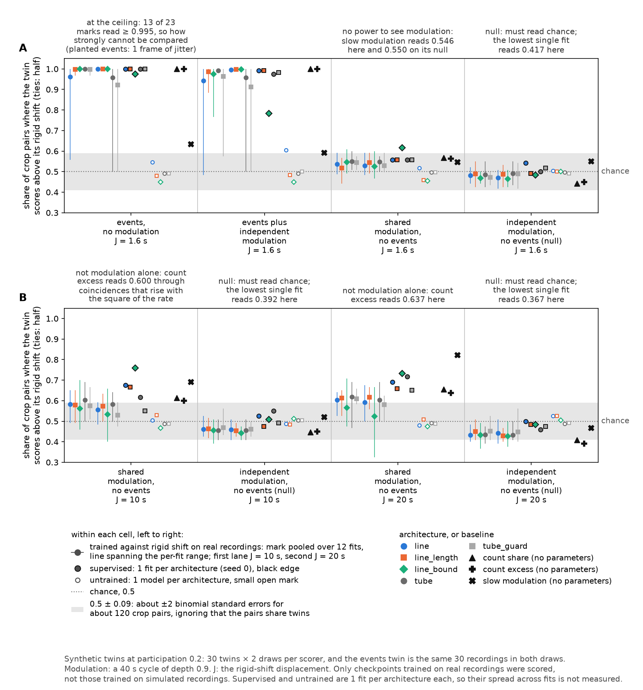

# Can a detector learn coordinated events from rigid shift alone?

**Not as built.** Models trained against rigid shift with no labels do learn to respond to planted
sub-second events, but at a threshold a detector with no parameters, `count_excess`, has a higher
mean score than every one of them at every event rate tried, and on real recordings their calls
land beside co-activity more often than on it. Supervised training stays far ahead. What follows
is how that was measured, what the measurements cannot show, and four decisions for Tony at the
end.

## The problem

The lab images calcium in hippocampal slices, and a **coordinated event** is several cells becoming
active within a fraction of a second. None of the 84 baseline (untreated) recordings from the lab's
fast stream used here is annotated, so every *supervised* detector in this project is fitted on a
**simulator** whose events were measured from the lab's own recordings. A detector that never sees
a real event cannot be told it was wrong about one.

A label-free detector would need no annotation. What it needs instead are copies of a recording
that keep everything except the thing to be detected, so that "score the recording above its copy"
is a training signal. **Rigid shift** is the candidate: each region of interest's (ROI's, one imaged
cell's) whole train of onsets slides by one random offset within ±*J*, so every ROI keeps its own
intervals while the alignment *between* ROIs is broken. Onsets pushed past either end of the
recording are dropped.

**Figure 1. The surrogates, on a synthetic minute.** Six ROIs with two coordinated events, then the
same recording under each transform this page uses. The offsets are set by hand for the picture; a
real recording loses a far smaller share of its onsets at the ends than this toy minute does.

A surrogate has two jobs, and only one is tested here. It must **remove** coordination: an earlier
look measured rigid shift removing 84–99 % of planted coordination on the lab fast stream at
*J* = 10–20 s ([the look](../rigid_shift_look/README.md)), and that was not rerun. And it must
**leave everything else**: a detector trained against a surrogate learns whatever the surrogate
moves, not only what it was meant to move. Rigid shift at *J* = 10–20 s also removes slow
co-modulation, ROIs rising and falling together over tens of seconds, so a model trained against it
may learn that instead of sub-second events.

So the page asks, in order (terms are defined in the next section):

1. **What can a detector reach with labels?** The supervised bake-off sets the ceiling and compares a
   counting architecture with the project's existing learned detector (Figure 2, the bake-off).
2. **Does rigid shift move anything besides alignment?** (Figure 3, the leak tests)
3. **Can a detector be trained against rigid shift alone?** (Figure 4, training without labels)
4. **Does what it learns look like sub-second events or slow co-modulation?** (Figure 5, the twin
   check)
5. **What do these models call on real recordings?** (Figure 6, real recordings)

## Terms

- **ROI**, region of interest: one imaged cell. An **onset** is the frame at which a cell's calcium
  transient starts. Recordings are 0.1 s per frame; the lab **fast** and **slow** streams are two
  acquisition protocols, and training uses the fast stream only. A **baseline** recording is one
  made before any treatment. The 84 recordings come from 44 mice in four **groups**, which the export
  folder labels DI, MALE, ORX and OVX; this page carries the labels and does not interpret them
  (`docs/export_folder_spec.md`: their meaning is the producer's, not a consumer's). FOUNDATIONS §9
  records that effects run in opposite directions between these groups, which is why the
  real-recording results are broken down by group rather than only pooled.
- **Surrogate**: a transformed copy of a recording. ***J***: the radius of a surrogate's
  displacement, in seconds. Besides rigid shift, Figure 1, the surrogates, shows a **shared offset**
  (one offset for
  every ROI, so alignment is kept), **per-onset dither** (each onset moved on its own) and a
  **per-ROI circular shift** (one offset per ROI of any size, wrapped at the end).
- **Leak**: anything a surrogate changes besides the alignment between ROIs. A **positive control**
  (the glossary's *known-bad control*) is a transform built so that a test must detect it; a test
  that cannot has no power. A **null control** is one a test must read as chance. A **pipeline
  check** is one that cannot fail for any scorer, because its two sides are exchangeable; it checks
  the code, not the models.
- **Twin**: a synthetic recording built from a real recording's per-ROI rates to contain one
  ingredient. The **events twin** has planted coordinated events (one per minute, each ROI taking part
  with probability 0.2, one frame of jitter) and no modulation; the **stationary twin** has neither;
  the **shared-modulation twin** gives every ROI the same rate cycle (40 s period, depth 0.9) and no
  events; the **independent-modulation twin** gives each ROI its own cycle. Figure 3's leak test
  uses 20 twins of 31 ROIs and 20 minutes (30 cycles each); Figure 5's twin check uses 30.
- **Channels**: the share of ROIs with an onset in each frame (the **cells-mean trace**) and its
  responses to difference-of-Gaussians kernels, what a detector that averages over ROIs receives.
  The **head** is the network layers after the channels.
- **Fold**: the bake-off splits eight simulated recordings into four folds of two; a model is fitted
  without one fold and scored on it (**held out**). A **crop** is 4,096 frames (409.6 s) of a
  recording, the unit training and the paired checks work on.
- **Accuracy (0.5 = chance)**: the leak tests' score, the held-out accuracy of a classifier choosing
  which of a pair is the real recording. **Share where real scores higher (0.5 = chance)**: the
  trained models' paired checks, the share of held-out crops in which a model scores the real crop
  above its transformed copy; ties count as half.
- **F1**: the harmonic mean of recall and precision against events planted in simulated recordings,
  1.0 perfect. Each simulated recording also holds a five-minute **promiscuity-probe stretch** where
  ROIs fire densely and nothing is planted; calls inside it are counted separately and left out of
  precision, so that the stretch does not dominate it.
- **Label-free threshold**: set per held-out recording, with no labels. Scanning down from the
  top, it is the last threshold before the model fires more than a stated rate (0.5, 1 or 2 events
  per 10 minutes) on any of three rigid shifts of that recording. It caps the rate on the shifts,
  not on the recording.
- **Truth-reading threshold** (the glossary's *oracle threshold*): the F1-best threshold on two
  validation recordings with planted events. It reads the answer, so it is a comparison, not a rule,
  and not a ceiling either: a label-free threshold can score above it.
- **Arm**: one way of producing a model: supervised on the simulator; untrained (the architecture at
  its initial parameters as defined in code); trained against rigid shift on simulated recordings
  (**sim**) or on real baseline recordings (**real**); or a **zero-parameter baseline**. A
  **condition** is one arm, one *J* and one model.
- **Zero-parameter baselines**, added so that the trained models have something to lose to:
  **`count_share`**, the share of ROIs with an onset within ±0.2 s of each frame; **`count_excess`**,
  that share minus its own 30 s moving mean; and **`slow_modulation`**, the share of ROIs with an
  onset in each frame averaged over 10 s, which sees only slow modulation.
- **Activity-weighted random times**: event positions drawn at random in proportion to the
  recording's population activity, with each detector's own event widths. They are the chance level
  for real recordings, where busy stretches hold co-activity by chance.
- **CoactDetect** and **LoCo** are the project's hand-written detectors, each firing when at least
  three ROIs are active together against a local background; **rate+context** fires on population
  rate against a slower context (a RateDetect port). Their lineage is in
  [`docs/detector_history.md`](../../detector_history.md), section 4.

## What this run found

- **No model trained against rigid shift reaches the zero-parameter baseline at a threshold.** At
  ≤ 1 event per 10 minutes the 20 trained conditions score 0.126–0.322 F1, the untrained models at
  most 0.093, `count_excess` 0.400–0.404, and supervised models 0.519–0.685 (Figure 4, training
  without labels). That is a comparison of condition means with no interval; single fits beat
  `count_excess` in 41–48 of 240 cases.
- **Counting and the center-surround filter do not separate from CoactDetect under supervision.**
  `line` leads by +0.047 F1 with a corrected 95 % interval of −0.17 to +0.26, one fold carries every
  learned margin, and two of the four folds share one fitted model (Figure 2, the bake-off). `line`
  over `tube` is positive on all four folds.
- **Rigid shift moves nothing a per-ROI classifier can see on the lab fast stream, and that
  classifier has power**: rigid shift reads 0.489–0.504 at every *J* from 1.6 s to 40 s, a per-ROI
  circular shift 0.545–0.559 (Figure 3, the leak tests). On the lab slow stream it reads 0.558 and
  0.567 at 22.4 s and 44.8 s, consistent with slow shared modulation.
- **In the channels, a real recording separates from its rigid shift at 0.66–0.69 at every *J***,
  including 1.6 s, where a synthetic twin with 40 s shared modulation and no events reads chance
  (0.486). What separates them there is not that modulation; it is consistent with sub-second
  co-activity and does not identify it.
- **On synthetic twins, the models trained against rigid shift on real recordings respond to planted
  events; their response to shared modulation is weaker than supervised models' but untested**
  (Figure 5, the twin check). The events twin sits at the ceiling, the 1.6 s modulation cell cannot
  detect modulation, and there are no intervals, so this is a description.
- **On real recordings the models trained against rigid shift fire more often than the supervised ones
  and land beside co-activity rather than on it**: 60–73 % of their events span no onset in any ROI,
  while 0.673–0.752 of them sit within 3 s of a frame with three or more ROIs lit, against 0.450–0.482
  by chance; at ±0.2 s 4 of 10 conditions clear their own chance and one falls below it. Supervised
  models put
  0.797–0.829 of their events on three or more ROIs and `count_excess` 0.899, and a rigid shift of the
  same recordings cuts their rate to about 1.5 events per 10 minutes without emptying what they call
  (0.448–0.515 and 0.637) — the page's earlier claim that a shift removes that co-activity came from
  scoring shift events against the unshifted recording (Figure 6, real recordings).
- **Four decisions follow**, in *What waits on Tony*.

> ## The contamination was answered, and the whole chain reran on the answer
>
> An earlier version of this page ran over a declared contamination and reported it as a footnote:
> non-rigid motion correction **pinned 12 ROIs to the frame floor** in four recordings, *"not flagged
> in any column"*. Tony ruled on 2026-09-17 that a known contamination stops the work rather than
> becoming a caveat, and that the question goes to the producer
> ([the question](../../todo/2026-09-10-four-recordings-carry-an-unflagged-contaminant.md)).
>
> **The producer answered the same evening.** `2026-09-17_revised_2v_long_STEPS_AND_PINS_EXCLUDED`
> removes every event inside a pinned window — 83 of them, each listed in `moco_pinned_excluded.tsv`,
> the windows confirmed panel by panel — and gives the reason this project reached independently: a
> pinned ROI is a **cross-cell** artifact, four ROIs on `20260629_312` sharing one 0–375 s window, so
> it manufactures the near-simultaneous multi-ROI structure a rate-matched null cannot explain. Every
> number on this page is from a rerun of the whole chain on that folder.
>
> **It changed almost nothing, and that is worth saying plainly** — a reader would reasonably expect a
> data change described that way to move something. Supervised models put 0.797–0.829 of their events
> on three or more ROIs (0.799–0.830 before); the models trained against rigid shift 0.118–0.243
> (0.128–0.237); `count_excess` 0.899 (0.903). F1 at ≤ 1 event per 10 minutes is identical in the
> trained, untrained and baseline arms and moves by 0.011 at the top of the supervised range
> (0.519–0.685 against 0.519–0.674). The per-ROI leak test still reads rigid shift as chance at every
> displacement, and the channels still separate real from shifted at 0.671 at *J* = 1.6 s.
> So the contamination was never what produced these results.
>
> ⚠ **Two residuals the answer does not clear.** The producer's census removes at `n_exceed >= 100`,
> and **two ROIs sit below that cut and remain** — `20260702_338` at 13 exceeding frames and
> `20260630_325` at 10, against 515–2,195 for everything removed; one further slice, `20260629_314`,
> is absent from the census entirely. And **group is perfectly confounded with imaging day**: 84
> recordings, 48 imaging dates, no date holding more than one group, so no answer about pinned ROIs
> can make a group comparison here biological.
>
> **Exploratory.** It replaces the version of 2026-09-16, whose third blind review found the trained
> models' controls unable to tell coordination from slow shared modulation; the controls here were
> added in answer ([record](../../reviews/tube-self-supervised-2026-09-17-round3.md)). Its fourth
> blind review ([record](../../reviews/tube-self-supervised-2026-09-17-round4.md)) found a scoring
> bug in the real-recordings stage and several wrong statements; they are corrected here and the
> stage was rerun, and the page is delivered **without a fifth review**, on Tony's ruling, so it has
> not converged. Nothing here is promoted: `docs/MILESTONES.md` reserves that to Tony, and its
> standing ruling is **a table of performance, not a ranking**. Every result quoted from this run's
> outputs is a key in [`summary.json`](summary.json), written by `tools/summarize_tube_self_supervised.py`;
> constants of the tools and numbers from other documents carry their source where they appear.
> **⚠ marks a claim not to lean on**, with the reason beside it.

## Figure 2. The supervised bake-off

**Figure 2. The supervised bake-off.** **A**: every detector on the simulator's four held-out folds
(two recordings each, 30 planted events per fold); learned models at training seeds 0, 1 and 2. A
dot is one fold's F1 averaged over the seeds; the bar is the mean of the four folds, not an interval.
**B**: the comparisons the page makes; the mean difference on its corrected 95 % interval, with the
four folds as small gray marks. **C**: the plant probe, below.

**No learned model separates from CoactDetect, and one fold carries every learned margin.** Without
the third fold, no learned model leads CoactDetect by more than 0.008 F1. What sets that fold apart
was not examined. `line` over `tube` is the one comparison positive on every fold.

**The builds.** `tube`, the project's existing learned detector, averages over ROIs and compares a
narrow smoothing of that average with a wider one (a **center-surround** filter). `line`, the
**counting architecture** built for this work, bounds each ROI's vote in height with a sigmoid,
averages the votes over ROIs (**relative length**, the share of the field lit), and adds
**concentration channels**: that share at a narrow smoothing divided by the share at the next wider
one, near 1 when the lit ROIs arrive together. `line_length` keeps relative length only. `line_bound`
differs from `line` in **two** ways: each ROI's vote is also bounded in time, and the vote's resting
level on an empty field is subtracted, so a difference between them cannot be attributed to either
change alone. `line` and `line_bound` have 1,305 parameters, `line_length` 1,233.

| detector | what it computes | F1 ± SD over folds | recall | precision | promiscuity-probe calls per fold | seconds per fit |
|---|---|---|---|---|---|---|
| line | counting, relative length and concentration channels | 0.698 ± 0.064 | 0.875 | 0.584 | 3.25 | 66–67 |
| line_length | counting, relative length only | 0.682 ± 0.038 | 0.842 | 0.580 | 4.42 | 64–66 |
| line_bound | counting, vote bounded in time, resting level subtracted | 0.694 ± 0.040 | 0.881 | 0.575 | 3.50 | 289–292 |
| tube | center-surround on the ROI average | 0.654 ± 0.050 | 0.836 | 0.544 | 20.67 | 7.7–8.2 |
| tube_guard | `tube` with a gap (guard band) between center and surround | 0.643 ± 0.052 | 0.797 | 0.548 | 15.25 | 7.3–7.7 |
| tube_ratio | `tube` dividing by the surround instead of subtracting | 0.508 ± 0.025 | 0.647 | 0.432 | 0.17 | 8.7–8.9 |
| tube_ratio_guard | both | 0.466 ± 0.054 | 0.611 | 0.399 | 0.00 | 8.7–8.9 |
| tiny | a small convolutional network ⚠ | 0.125 ± 0.000 | 0.067 | 1.000 | 0.00 | 89 |
| trace | a network on the cells-mean trace | 0.120 ± 0.011 | 0.072 | 0.669 | 0.00 | 9.4–9.5 |
| CoactDetect | co-active ROIs against a local background | 0.651 ± 0.044 | 0.767 | 0.572 | 1.25 | — |
| LoCo | co-active ROIs, greatest-of local background | 0.631 ± 0.046 | 0.742 | 0.555 | 3.50 | — |
| rate+context | population rate against a slower context | 0.607 ± 0.082 | 0.675 | 0.552 | 26.50 | — |
| binned SCE | synchronous calcium events, after Cossart, Aronov & Yuste 2003 ⚠ | 0.582 ± 0.072 | 0.758 | 0.478 | 59.75 | — |
| locust | partial port of CICADA ⚠ | 0.545 ± 0.052 | 0.708 | 0.447 | 239.25 | — |
| SPIKE-synch | thresholds a synchronization profile ⚠ | 0.267 ± 0.072 | 0.175 | 0.569 | 8.75 | — |

SD is the standard deviation over the four folds. **Seconds per fit** is the range over seeds of the
mean, with three bake-offs sharing one Mac: a comparison within this run, not a benchmark. ⚠ **`tiny`**
sits on its threshold grid's lowest value in all 12 fold-seed fits, where each recording becomes one
detection; 0.125 is what that scores, not an operating point. ⚠ **binned SCE** is this project's
detector in that paper's tradition, not a port of it. ⚠ **`locust`** is a partial port of CICADA
(Calcium Imaging Complete Automated Data Analysis, from the Institut de Neurobiologie de la
Méditerranée, INMED) that skips CICADA's own transient detection, and ⚠ **SPIKE-synch** thresholds a
synchronization profile without the detection layer its authors published, so neither row measures
the other lab's method (see *The published lineage*).

| comparison, ΔF1 | per fold | mean | 95 % interval, corrected | sign test *p* | mean without the fold with the largest difference |
|---|---|---|---|---|---|
| line − CoactDetect | −0.005 / −0.004 / +0.178 / +0.018 | +0.047 | −0.168 to +0.262 | 1.00 | +0.003 |
| line_length − CoactDetect | −0.035 / +0.036 / +0.126 / −0.001 | +0.032 | −0.137 to +0.200 | 1.00 | 0.000 |
| line_bound − CoactDetect | −0.033 / +0.033 / +0.147 / +0.025 | +0.043 | −0.141 to +0.227 | 0.63 | +0.008 |
| tube − CoactDetect | −0.052 / −0.035 / +0.116 / −0.017 | +0.003 | −0.183 to +0.189 | 0.63 | −0.035 |
| line − line_length (concentration channels) | +0.029 / −0.040 / +0.052 / +0.019 | +0.015 | −0.080 to +0.110 | 0.63 | +0.003 |
| line_bound − line (two changes) | −0.028 / +0.037 / −0.031 / +0.007 | −0.004 | −0.082 to +0.074 | 1.00 | −0.018 |
| line − tube | +0.047 / +0.031 / +0.062 / +0.035 | +0.044 | +0.009 to +0.078 | 0.13 | +0.038 |
| CoactDetect − LoCo | +0.071 / +0.005 / +0.039 / −0.035 | +0.020 | −0.090 to +0.130 | 0.63 | +0.003 |

⚠ **Two of the four folds are one model.** The bake-off harness validates thresholds on the last
training fold and fits on the rest, so the third and fourth held-out folds are both fitted on the
same four recordings at the same seed: each learned model has 9 distinct fits here, not 12, and the
third fold's margin is that shared model scored on its own held-out recordings. The corrected
intervals assume distinct training sets per fold, which this split does not provide, so they are
not calibrated. The harness defect is project-wide and filed separately
([todo](../../todo/2026-09-17-two-bake-off-folds-train-the-same-model.md)). ⚠ Eight comparisons,
none corrected for multiplicity: `line` over `tube` has a corrected *p* of 0.027, which eight
comparisons would not survive by Bonferroni. On four folds the smallest possible two-sided sign-test
*p* is 0.125, so that column cannot show significance. Four folds cannot exclude any effect smaller
than about ±0.08 F1 between the counting builds.

**The plant probe (panel C)** gives the direction behind the counting builds. Four plants of the same
number of onsets are laid on a quiet synthetic field of 32 ROIs: a **synchronous plant** (one onset in
each of *n* ROIs, all in one frame), a **burst** (*n*/4 ROIs, four onsets each within 0.6 s), a
**fuzz** (the synchronous plant's *n* ROIs spread over 2.9 s) and a **wave** (the same *n* ROIs one
frame apart). Each ratio is the synchronous plant's response divided by the other plant's, where a
response is the model's peak score with the plant minus without it, over 12 fields; the supervised
fits here are trained on all eight simulated recordings at seed 0. All three counting builds
separate the synchronous plant from a burst more than `tube` does. At the largest plant, the ratios
over fuzz are 1.99 for `line`, 1.75 for `line_length`, 1.60 for `line_bound` and 1.43 for `tube`.
**Read the panel as a direction**: the builds cannot be ordered among themselves. The quoted standard
errors (10–14 % of the ratio) treat the two responses as independent although both come from the same
12 fields, the head is a six-layer stack so a ratio of response differences does not compare strictly
across models, and the wave's span grows with the plant by construction.

## Figure 3. The leak tests

**Figure 3. The leak tests.** **A** (lab fast) and **B** (lab slow): a linear classifier over per-ROI
statistics of a 60 s window tells real windows from transformed ones; accuracy with a 95 % interval
from a bootstrap that resamples mice and refits. **C**: the same forced choice on the lab fast
stream, read from the channels. **D**: synthetic twins against their own rigid shift, read from the
same channels.

**On the lab fast stream the per-ROI classifier sees both positive controls, and rigid shift reads
as chance.** The classifier's inputs are each ROI's onset count, the quantiles of its same-ROI
intervals and its shortest interval, and the share of ROIs with an onset and with an interval, pooled
over ROIs by mean, standard deviation, minimum, median and maximum; 84 recordings from 44 mice,
1,501 window pairs per stream, folds grouped by mouse. Only interior windows are scored, and every
*J* is shorter than a window, so no onset dropped at an end reaches this test; features at a
window's edges were removed because they see a shift directly.

| lab fast, accuracy (0.5 = chance) at *J* | 1.6 s | 2.5 s | 5 s | 10 s | 20 s | 40 s |
|---|---|---|---|---|---|---|
| rigid shift | 0.500 | 0.504 | 0.502 | 0.502 | 0.490 | 0.489 |
| shared offset (null control) | 0.499 | 0.497 | 0.503 | 0.514 | 0.504 | 0.518 |
| per-onset dither (positive control) | 0.738 | 0.763 | 0.783 | 0.795 | 0.775 | 0.779 |
| per-ROI circular shift (positive control) | 0.554 | 0.554 | 0.559 | 0.555 | 0.545 | 0.552 |

⚠ **What this test can and cannot see.** It cannot see alignment finer than its 60 s window. It
**can** see ROIs' counts rising and falling together across windows, which is why a per-ROI circular
shift, which keeps intervals but moves each ROI's counts by up to a whole recording, is caught
(lowest lower bound 0.513). Per-onset dither is caught mainly because it breaks each ROI's shortest
interval, which rigid shift never does, so the circular shift, not dither, is what shows the test has
power against a leak rigid shift could have. On the lab slow stream, whose displacements are 1.4 s ×
1, 2, 4, 8, 16 and 32, rigid shift reads 0.500–0.524 up to 11.2 s, then **0.558 at 22.4 s and 0.567
at 44.8 s** (lower bounds 0.512 and 0.517), with the shared offset at 0.495–0.507. That is consistent
with slow shared modulation rather than a per-ROI leak; it was not tested further.

**In the channels, real recordings separate from rigid shift at every *J*, and the separation does
not change visibly with *J*.** The **hand-built bank** approximates `tube`'s kernels at
initialization at its four scales (within about 1 % of the response at the three narrowest and 11 %
at the widest, whose surround `tube` truncates) and adds four wider ones, so it is a stand-in, not
`tube` itself. The fitted columns read what a supervised `tube` or `line` head receives; each has
three distinct fitted models, not four (Figure 2's note).

| lab fast, accuracy (0.5 = chance) | hand-built initial bank | fitted `tube`, four folds | fitted `line`, four folds |
|---|---|---|---|
| real vs rigid shift | 0.663–0.690 | 0.652–0.676 | 0.658–0.684 |
| real vs shared offset (null control) | 0.520–0.532 | 0.475–0.526 | 0.483–0.528 |
| events twin vs its rigid shift (positive control) | 0.861–0.906 | 0.872–0.908 | 0.861–0.925 |
| stationary twin vs its rigid shift (pipeline check) | 0.450–0.525 | 0.453–0.572 | 0.469–0.606 |
| independent-modulation twin vs its rigid shift (null control) | 0.481–0.600 | 0.450–0.586 | 0.475–0.594 |
| shared-modulation twin vs its rigid shift | 0.486–0.811 | 0.492–0.756 | 0.500–0.781 |

Ranges run over *J* = 1.6, 5, 10, 20 and 40 s, and for the fitted models also over the four held-out
folds. **The shared-modulation twin is what slow co-modulation alone looks like in these channels**:
chance at *J* = 1.6 s (0.486, interval 0.417–0.589), then 0.606 at 5 s, 0.733 at 10 s and 0.811 at
20 s for the hand-built bank. The real recordings read 0.671 at 1.6 s and 0.663–0.690 at every other
displacement, so what separates them from their rigid shift is present at a shift where 40 s
co-modulation is not. No slope over *J* was tested, and the hand-built bank's shared-offset null
reads 0.520–0.532, slightly above 0.5, at every *J*.

⚠ **The cells-mean trace alone does almost all of it**: 0.656–0.674 from the initial bank's trace
and 0.618–0.643 from the fitted heads' trace. That trace is the share of the field active, which is
what a counting architecture computes, so this test rules out a leak in how the field's activity is
distributed over time and cannot say whether the co-activity it sees is coordination. The aggregate
test's channels are whole-recording convolutions, so, unlike the per-ROI test, it does reach the ends
where rigid shift drops onsets.

## Figure 4. Training against rigid shift, with no labels

**Figure 4. Training against rigid shift, with no labels.** Five architectures (`line`,
`line_length`, `line_bound`, `tube`, `tube_guard`) × three training seeds × four folds in four arms
(supervised, untrained, sim and real, the last two at *J* = 10 s and 20 s): 360 fits, plus the three
zero-parameter baselines at each *J* on each fold (24 rows). Every mark is a condition's mean; a fit
with no true positive scores 0. **A**: F1 at the label-free threshold at each rate. **B**: F1 at the
truth-reading threshold against the share of the held-out recording the detections cover there.
**C**: the paired checks on held-out real crops, grouped by what each can show.

**The objective.** A crop and the same crop of its rigid shift go through the model; each crop's
score is the mean of its top 1 % of per-frame scores (40 frames); the loss is softplus(shifted score
− real score), a paired logistic ranking loss with one negative. 900 steps, three crop pairs per step,
no label read. Crops stay more than *J* from either end, so the onsets rigid shift drops never enter
training. The training loss, averaged over the last five logged steps, ended at or above chance
(ln 2 = 0.693) in 0–4 of 12 fits per condition; the median share of training pairs won over those
steps is 0.90–1.00 for the arms trained on simulated recordings and 0.63–0.80 for those trained on
real ones.

**`count_excess` has a higher mean score than every model trained against rigid shift at every
label-free rate.** Training against rigid shift does beat the untrained architectures once the rate
is strict, and every trained condition stays far below supervised training.

| planted-truth F1 at the label-free threshold | ≤ 0.5 events per 10 min | ≤ 1 | ≤ 2 |
|---|---|---|---|
| supervised (5 models) | 0.434–0.602 | 0.519–0.685 | 0.629–0.706 |
| `count_excess` (both *J*) | 0.307–0.319 | 0.400–0.404 | 0.478 |
| `count_share` (both *J*) | 0.122–0.133 | 0.181–0.234 | 0.312 |
| trained against rigid shift (20 conditions) | 0.070–0.250 | 0.126–0.322 | 0.199–0.386 |
| untrained (5 models) | 0.000–0.039 | 0.000–0.093 | 0.000–0.291 |
| `slow_modulation` (both *J*) | undefined, written 0 | undefined, written 0 | undefined, written 0 |

Ranges are over condition means of 12 fits (4 held-out folds for the zero-parameter baselines).
⚠ There is no interval: per fold, 4, 2 and 3 of the 80 condition-fold cells beat `count_excess` at
the three rates, and 41–48 of 240 single fits do; with 30 planted events per fold one event moves F1
by about 0.02–0.03. At ≤ 2 events per 10 minutes, untrained `line_length` (0.291) is ahead of 14 of
the 20 trained conditions; at the two stricter rates every trained condition is ahead of every
untrained model. Between 1 and 9 of the 12 fits in a trained condition score no true positive at
≤ 0.5, and up to 5 at ≤ 2. In the `line` conditions the label-free threshold fell to its grid's
lowest value in 8, 9 and 10 fit-and-recording settings at the three rates (2–4 per condition), where
one detection can cover a whole recording. **`slow_modulation` does fire within the rate**, but every
one of its detections falls in the promiscuity-probe stretch, which precision leaves out, so its F1 is
undefined and recorded as 0.

⚠ **The truth-reading scores of every arm trained on real recordings, and of the untrained arm, are
not detection** (panel B). Trained on real, they reach 0.499–0.577 with detections covering a median
0.954–0.985 of each held-out recording; untrained, 0.503–0.559 covering 0.962–0.984; detections are
23–128 s wide. They touch planted events by being on almost everywhere, and a wide detection that
overlaps the promiscuity-probe stretch costs no precision, which flatters them further. Supervised
models cover 0.005–0.010 at 0.662–0.696, and `count_excess` 0.004 at 0.648. Of the arms trained on
simulated recordings, only `line` at 10 s (0.551, covering 0.035) and `line_length` at 20 s (0.620,
covering 0.022) make narrow detections; `line_length` at 10 s, `line` at 20 s and `line_bound` at
10 s cover 0.36–0.50, and the tube family at both displacements and `line_bound` at 20 s cover 0.92 or
more. The truth-reading threshold sits on its grid's edge in 4 of the 360 fits, all `line`, so the
coverage is the models' and not the search's.

**The paired checks (panel C) cannot say whether a model learned sub-second events or slow shared
modulation.**

| share where the real crop scores higher (0.5 = chance), condition means | supervised | trained on simulated | trained on real | zero-parameter baselines |
|---|---|---|---|---|
| shared offset, same crop (null control) | 0.500–0.517 | 0.464–0.513 | 0.484–0.555 | 0.482–0.557 |
| shared offset, independent crop (pipeline check) | 0.431–0.487 | 0.456–0.505 | 0.450–0.510 | 0.446–0.518 |
| stationary twin vs its rigid shift (pipeline check) | 0.462–0.521 | 0.454–0.554 | 0.456–0.575 | 0.406–0.575 |
| independent-modulation twin vs its rigid shift (pipeline check) | 0.446–0.521 | 0.448–0.569 | 0.442–0.579 | 0.400–0.569 |
| a fifth of every ROI's onsets removed (positive control) | 0.650–0.765 | 0.669–0.791 | 0.766–0.940 | 0.810–0.896 |
| rigid shift at the training *J* | 0.688–0.730 | 0.596–0.734 | 0.720–0.774 | 0.664–0.783 |
| rigid shift at *J* = 1.6 s | 0.649–0.709 | 0.631–0.693 | 0.687–0.774 | 0.616–0.786 |
| shared-modulation twin vs its rigid shift | 0.596–0.642 | 0.552–0.650 | 0.575–0.679 | 0.662–0.763 |

The positive control moves above 0.5 in 10–12 of 12 fits per supervised condition, 11–12 per
condition trained on real recordings, 8–12 per condition trained on simulated recordings, and in every
baseline fold; in the untrained arm it moves in only 1–8 of 12, as expected of models that separate
nothing. The untrained models read 0.485–0.519 on the rigid-shift checks. The pipeline checks sit
between 0.400 and 0.579 with no interval, which says how far from 0.5 about 120 crops can land by
chance. ⚠ The same-crop shared offset ties on up to 0.98 of crops in a fit, counted as half, and 10
trained fits tie on every crop; the independent-crop version is there so that ties are not what holds
the same-crop check at 0.5.

Two results say the last two rows cannot separate the alternatives on real crops. **Supervised
models read the shared-modulation twin (0.596–0.642) and the 1.6 s shift (0.649–0.709) as much as the
models trained against rigid shift do**, and they were trained on simulated recordings whose
promiscuity-probe stretch is itself shared slow modulation, so these rows do not separate what a model
was trained on. And **the 1.6 s check reads events as well as modulation**: `slow_modulation`, which
averages over 10 s and cannot resolve a sub-second event, separates the events twin from its 1.6 s
shift at 0.650, so its own real-crop reading at 1.6 s (0.616–0.633) can come from events alone.

## Figure 5. The twin check

**Figure 5. The twin check.** Each scorer on synthetic twins against their own rigid shift, with the
paired checks' crops and rule: the models trained against rigid shift on real recordings (10
conditions × 12 fits), one supervised fit (seed 0) and one untrained model per architecture, and the
three zero-parameter baselines. 30 twins, each shifted twice, about 120 crop pairs per scorer, the
same twins for every scorer. Planted events take part in a fifth of the ROIs (**participation** 0.2)
with one frame of jitter; the modulation is a 40 s cycle of depth 0.9. Each cell's header states what
that cell cannot show: where a reading is at the ceiling, where the cell has no power, and each null
control's lowest single-fit reading.

**Described, not tested.** The models trained against rigid shift on real recordings separate the
events twin from its 1.6 s shift at 0.922–1.000, where supervised fits read 0.975–1.000. On the
shared-modulation twin at 20 s they read 0.523–0.619 and supervised fits 0.650–0.733; against each
scorer's own independent-modulation reading at 20 s, that is +0.086 to +0.174 and +0.183 to +0.259,
and the two ranges overlap.

| share where the twin scores above its rigid shift | events, *J* 1.6 s | events plus independent modulation, 1.6 s | shared modulation, 1.6 s ⚠ | shared modulation, 20 s | independent modulation, 20 s (null control) |
|---|---|---|---|---|---|
| trained against rigid shift on real recordings (10 conditions) | 0.922–1.000 | 0.913–0.999 | 0.518–0.549 | 0.523–0.619 | 0.426–0.451 |
| supervised (5 fits) | 0.975–1.000 | 0.783–0.992 | 0.558–0.617 | 0.650–0.733 | 0.458–0.500 |
| untrained (5 models) | 0.450–0.546 | 0.450–0.604 | 0.454–0.517 | 0.475–0.508 | 0.487–0.525 |
| `count_excess` | 1.000 | 1.000 | 0.562 | 0.637 | 0.392 |
| `count_share` | 1.000 | 1.000 | 0.567 | 0.654 | 0.408 |
| `slow_modulation` | 0.633 | 0.592 | 0.546 | 0.821 | 0.467 |

⚠ **Why none of this is a test:**

- **The events twin is easy and at the ceiling.** Its events carry one frame of jitter, against the
  simulator's 0.311 s, and most scorers read 1.000, so "as strongly as" cannot be measured.
- **The 1.6 s shared-modulation cell cannot detect modulation.** `slow_modulation`, which sees only
  modulation, reads 0.546 there against 0.467 on independent modulation at 20 s and is no better than
  chance at 1.6 s.
- **The 20 s cell does not isolate modulation.** `count_excess` subtracts its own 30 s mean and cannot
  follow a 40 s cycle, yet reads 0.637, because a shared rate raises chance coincidences in proportion
  to the rate squared. A weak reading fits a weak response to modulation and a weak response to
  coincidence equally.
- **There are no intervals.** About 120 correlated crop pairs give a binomial standard error near
  0.045 before accounting for shared twins, and a null reads as low as 0.392.
- **One supervised fit per architecture**, one modulation period and depth, and none of the 10
  conditions trained on simulated recordings.

What would test it: harder events twins (the simulator's jitter, real event rates), a twin-resampling
interval on every cell adjusted for its null, supervised fits at three seeds, a modulation twin with
its coincidence rate matched, and thresholding the checkpoints on a twin with known event times to
score localization directly. How the lab's recordings co-modulate is measured separately (on branch
`unsup/slow-comodulation`, under its own review).

## Figure 6. Real recordings

**Nothing here is ground truth.** No recording in the export folder is annotated, and
`docs/MILESTONES.md` blocks quoting any transfer figure until a MAHICE review (machine-assisted human
identification of coordinated events) exists. This is a consistency check: what each detector calls,
beside what the same detector calls on a rigid shift of the same recordings, and beside chance.

**Figure 6. Real recordings.** Each detector on all 84 lab fast-stream baseline recordings, and each
learned model and zero-parameter baseline also on a **fresh** rigid shift of every recording at the
*J* its threshold was set with — one no threshold was set on — with every measure read against the
shifted onsets. **A**: the share of events with onsets in at least 3 ROIs within the event's span
±0.2 s, against activity-weighted random times (the black bar). **B**: the share of events within 3 s
of a frame where at least 3 ROIs have an onset, against the same at activity-weighted random times.
**C**: the share of events whose span holds no onset in any ROI. **D**: the share of events starting
within 5 s of either end, against uniform placement. Supervised models are fitted on the simulator at
three seeds; models trained against rigid shift are fitted per mouse fold at three seeds; every row
pools its runs, and each learned model's label-free threshold was set on rigid shifts at *J* = 10 s.

**Supervised models and the count baselines call multi-ROI co-activity, and a rigid shift lowers how
often they fire without emptying what they call. The models trained against rigid shift fire more
often than any of them, at events that mostly span no onset at all but sit within a few seconds of
co-activity.**

| detector, label-free threshold ≤ 2 events per 10 min | events per 10 min | share with onsets in ≥ 3 ROIs | its own activity-weighted chance | excess over that chance, 95 % interval over mice | share whose span holds no onset | share within 3 s of ≥ 3 ROIs lit (chance) | on a fresh rigid shift: rate, share ≥ 3 ROIs |
|---|---|---|---|---|---|---|---|
| CoactDetect (its shipped operating point) | 2.69 | 1.00 ⚠ | 0.324 | +0.62 to +0.73 | 0.000 | 0.902 (0.511) | — |
| LoCo (its shipped operating point) | 3.71 | 1.00 ⚠ | 0.163 | +0.80 to +0.88 | 0.000 | 0.958 (0.526) | — |
| supervised, five models | 4.24–4.90 | 0.797–0.829 | 0.121–0.140 | above zero in 5 of 5 | 0.039–0.069 | 0.738–0.806 (0.399–0.433) | 1.51–1.65, 0.440–0.518 |
| trained against rigid shift, ten conditions | 5.83–6.96 | 0.118–0.243 | 0.137–0.212 | above zero in 3 of 10 | 0.604–0.733 | 0.671–0.783 (0.438–0.488) | 1.30–1.58, 0.037–0.116 |
| `count_excess` | 6.27 | 0.899 | 0.113 | +0.73 to +0.82 | 0.067 | 0.899 (0.479) | 1.55, 0.637 |
| `count_share` | 3.74 | 0.960 | 0.120 | +0.80 to +0.87 | 0.037 | 0.960 (0.505) | 0.43, 0.746 |
| `slow_modulation` | 1.82 | 0.528 | 0.316 | +0.17 to +0.26 | 0.254 | 0.677 (0.397) | 1.24, 0.444 |

A detector's **event** spans its merged detection (detections closer than 2 s merge), and an ROI counts
if it has an onset within that span ±0.2 s. Chance is drawn at activity-weighted random times with each
detector's own event widths, ten draws per event, so each row is read against its own chance and never
against another row's. The interval is a bootstrap over the 44 mice of the excess over that chance.
⚠ CoactDetect and LoCo fire only when at least three ROIs coincide, so their 1.00 is their definition,
not a finding.

- **A rigid shift changes the rate, not the content.** Every learned model and baseline fires
  1.24–1.66 times per 10 minutes on a fresh shift, against 4.24–6.96 on the recordings, and
  `count_share` 0.43 against 3.74. But what they call there is still co-activity: the supervised
  models' shift events hold three or more ROIs in 0.448–0.515 of cases against a chance of
  0.044–0.052, `count_excess` 0.637 and `count_share` 0.746, each above zero excess on every mouse
  bootstrap. **An earlier version of this page reported 0.046–0.070 here and read it as the shift
  removing co-activity**; those numbers scored shift events against the *unshifted* onsets, which is
  a defect of the measuring code, not a finding ([the round-4
  record](../../reviews/tube-self-supervised-2026-09-17-round4.md)). A rigid shift leaves a field
  whose ROIs still coincide by chance, and a detector looking for coincidence still finds those.
- **The models trained against rigid shift are imprecise, not at chance.** At ±0.2 s their share with
  three or more ROIs (0.118–0.243) sits beside their own chance (0.137–0.212), and the mouse-clustered
  interval clears zero in 4 of 10 conditions (`line` at *J* = 10 s, +0.033 to +0.170; `line` at 20 s,
  +0.029 to +0.097; `line_bound` at 10 s, +0.018 to +0.083; `line_length` at 20 s, +0.019 to +0.052),
  while one condition sits **below** its chance with the interval clearing zero downward (`tube_guard`
  at 20 s, −0.070 to −0.019) — a detector calling events where co-activity is rarer than the
  recording's own activity would predict. Their median
  event holds 0–1 ROIs and 60–73 % of their events span no onset in any ROI, against 4–7 % for
  supervised models. Yet 0.673–0.752 of them lie within 3 s of a frame with three or more ROIs lit,
  against 0.450–0.482 at activity-weighted random times, and 0.366–0.600 within 1 s against
  0.268–0.298. They fire in quiet gaps beside busy stretches: **the events are in the right
  neighborhood and not on the co-activity**, which is what a crop-scale objective would be expected
  to teach and is not what a detector needs.
- **`slow_modulation` is the detector the checks worried about**, and on real recordings it behaves as
  one: 0.523 of its events hold three ROIs against 0.312 by chance, and on its own rigid shift it keeps
  0.450 against 0.251, because a 10 s average of the active share is slow enough to survive a 10 s
  shift in part.

**Agreement** is the share of one detector's events that any event of another overlaps within ±1 s.

| detector | share of CoactDetect's events it overlaps (chance) | share of LoCo's (chance) | share of its own events near CoactDetect (chance) | near LoCo (chance) |
|---|---|---|---|---|
| supervised, five models | 0.680–0.825 (0.086–0.099) | 0.545–0.715 (0.052–0.064) | 0.431–0.472 (0.052–0.056) | 0.475–0.543 (0.043–0.046) |
| trained against rigid shift, ten conditions | 0.466–0.685 (0.100–0.207) | 0.307–0.619 (0.072–0.192) | 0.202–0.307 (0.046–0.064) | 0.174–0.340 (0.047–0.062) |
| `count_excess` | 0.845 (0.105) | 0.868 (0.078) | 0.382 (0.045) | 0.518 (0.047) |

The two references agree with each other at 0.780 (CoactDetect's events near LoCo's) and 0.591 (LoCo's
near CoactDetect's). Chance is the same overlap with one side's events circularly shifted. ⚠ Neither
direction is a recall, and the two inflate differently: **firing more inflates the reference columns**,
since every learned model fires more often than either reference, and **splitting one reference event
into several inflates the own-events columns**, since each of the parts is credited.

⚠ **Edge enrichment has three candidate causes and this page separates none of them.** Within 5 s of
either end, uniform placement expects 0.8 % of events. The supervised label-free rows put 3.8–5.7 %
there and **4.6–10.2 % on their rigid shifts**, where no alignment is left to find; at their bake-off
thresholds 1.6–2.2 %. The rows trained against rigid shift put 1.1–3.7 % there and 0.5–8.7 % on their
shifts; CoactDetect 3.3 %, LoCo 0.0 %, `count_excess` 2.2 %. The candidates: the
difference-of-Gaussians kernels pad the recording with zeros up to 12.8 s beyond each end and the head
reaches a further 6.3 s, so frames near an end are judged against an empty background — and in the
`line` builds the per-ROI smear pads a further 12.8 s before that stage; rigid shift drops onsets at the
ends too, which lowers the background a threshold is set against; and the thresholds themselves are set
on those shifts.

**The groups do not agree, and pooling hides it** (FOUNDATIONS §9: effects run in opposite directions
by group, so a pooled number is not admissible on its own). The share of events with three or more ROIs,
by the export folder's group labels:

| detector | DI | MALE | ORX | OVX |
|---|---|---|---|---|
| supervised, five models | 0.920–0.957 | 0.824–0.851 | 0.443–0.500 | 0.727–0.802 |
| trained against rigid shift, ten conditions | 0.143–0.323 | 0.118–0.242 | 0.025–0.113 | 0.100–0.249 |
| `count_excess` | 0.984 | 0.888 | 0.558 | 0.865 |
| `count_share` | 1.000 | 0.942 | 0.760 | 0.965 |
| `slow_modulation` | 0.705 | 0.526 | 0.290 | 0.466 |

Every detector calls less co-activity in ORX recordings than in DI ones, by 0.3–0.5 for the detectors
that find co-activity at all. The ordering is the same for the hand-written references and for a
detector with no parameters, which rules out the least interesting explanation — that some model
learned it — and nothing further. Agreement between methods is evidence about methods: every
explanation those detectors share is untouched by their agreeing, and an artifact in the recordings
is shared by all of them by construction.

**The pinned ROIs are not the explanation, and that is now measured rather than argued.** All four
de-pinned recordings are DI, the top of this ordering, so removing their pinned events is the direct
test. It moves DI almost not at all — `count_excess` 0.992 → 0.984, supervised `line` 0.922 → 0.920 —
and leaves MALE, ORX and OVX identical to three decimals, because no recording of theirs was touched.
⚠ Note what that does *not* license: an earlier sensitivity check on the contaminated folder dropped
those four recordings whole and predicted a much larger fall. **Dropping a recording removes
everything about it; de-pinning removes 83 events and keeps the rest**, so a leave-one-out is an
upper bound on what an artifact contributes, never an estimate of it. The same caution applies to
this page's own "mean without the fold with the largest difference" column in Figure 2, the bake-off.

⛔ **What still forbids reading this ordering as biology is untouched by any of it:** group is
perfectly confounded with imaging day in this export — 84 recordings, 48 imaging dates, and **not one
date holds more than one group** — so every group difference is also a difference between days: rig
state, slice batch, anything that varies between sessions. ⚠ Events are also pooled over runs on the
same recordings, and the groups are unbalanced (84 recordings from 44 mice).
## What this does not settle

**The surrogate.**

- **Rigid shift here is not the published regime.** Whole-train shifting as published shifts each of
  many short **trials** independently, and Stella et al. 2022 found trial shifting the least likely of
  the surrogates they compared to create false positives for SPADE, at a 25 ms dither. This run shifts
  one ~20 min recording as a single trial by 10–20 s, 400–800 times that dither; a lag pattern repeated
  between two ROIs survives it as one new constant lag.
- **Dropping onsets at the ends biases the null.** Rolling the train instead keeps the expected
  coincidence count (Louis, Borgelt & Grün 2010); dropping lowers the surrogate's, which makes real
  recordings look more coordinated. At 10 s and 20 s rigid shift drops 0.5 % and 1.1 % of lab fast
  onsets. Training crops stay clear of the ends, and the per-ROI leak test scores only interior
  windows; the label-free thresholds and the aggregate leak test's whole-recording convolutions do
  reach the ends.
- **The numpy rigid shift used for training was checked against the reference implementation only
  loosely.** The committed test compares one onset's offset distribution, which would not catch a
  systematic one-frame bias and does not exercise the ends; a check run during the fourth review
  found the two implementations agreeing draw for draw on 1,624 of 1,624 ROI trains including 1,540
  onsets dropped at the edges, but that check is not in the suite.
- **The aggregate leak test cannot exclude co-activity**, because its strongest channel is the share
  of the field lit (Figure 3, the leak tests).
- **Two ROIs the producer's census did not remove, and one slice it never saw.** The removal cuts at
  `n_exceed >= 100`; `20260702_338` (13 exceeding frames) and `20260630_325` (10) stay in, and
  `20260629_314` is not in the census at all. Two orders of magnitude below anything removed, and not
  measured here — the export is the input and filtering in the consumer is forbidden, so what to do
  about the tail is the producer's and Tony's
  ([the question](../../todo/2026-09-10-four-recordings-carry-an-unflagged-contaminant.md)).
- ⚠ **This page's earlier version ran over the contamination and reported it as a footnote**, for a
  week in which it was filed once and cited by three reviews without anyone asking the producer. The
  rerun says the results did not depend on it, which is luck rather than diligence: nothing about
  the reasoning that let it run would have changed had the answer come out the other way.
- **A second export feature was not examined here**: events removed within ±2 s of field steps in
  three of the 84 recordings (71 events), which leaves 4 s gaps shared
  by every ROI. Every surrogate here shifts whole trains, so those shared gaps move to each ROI's own
  phase in the surrogate and a cross-ROI objective can be paid for finding them — which is exactly
  what this page's objective rewards. The remedy is a circular shift confined to the stretches the
  exclusion leaves intact, which keeps each ROI's onset count and leaves the gaps where the data have
  them (`masked_circular_shift`, measured on branch `unsup/slow-comodulation` at minute scale on
  17–25 minute windows, and untested where the gaps are a large fraction of a short crop, which is the
  regime here). It was not run on this page's tests, and whether it would move them is unmeasured.

**The architectures and the bake-off.**

- **No learned model separates from CoactDetect** at four folds and three seeds, of which two folds
  share one fitted model.
- **`line_bound`'s time bound is soft**: a four-onset burst's peak vote reaches 1.04–1.15 times one
  onset's on an untrained model with hand-set widths (`tests/test_line_vote.py`, which checks the
  vote helpers rather than the full forward pass). **`line` and `line_bound` have not been reviewed
  as code.**
- **The simulator's events carry 0.311 s of onset jitter**, measured within clusters against a null
  of 0.335 s (`docs/learned/generator_spec.json`); `docs/generator.md` gives 0.36 s against 0.42 s
  from an earlier fit and calls it its least trustworthy number. Either way the planted spread is
  close to its own null, so the supervised ceiling is set against events whose coordination is
  itself marginal.

**The objective and its thresholds.**

- **The objective is untuned**: one pooling rule, one learning rate, 900 steps. It pays for any
  separation of real from shifted, so a two-ROI coincidence earns as much as a crowd.
- **A bake-off label-free score and a real-recording label-free event rate are not the same operating
  point.** The simulator's promiscuity-probe stretch survives into the rigid shifts its threshold is
  set on, and real recordings have no such stretch. Both use *J* = 10 s.
- **Of the real recordings, only the lab fast stream** was used for training; the other training arm
  used simulated recordings, whose promiscuity-probe stretch is itself shared slow drift that rigid
  shift leaves in place.
- ⚠ **The "bake-off threshold" rows on real recordings** come from fits on all eight simulated
  recordings, not from the bake-off's per-fold thresholds.

**The literature.** The search covered spike-train surrogates, radar constant-false-alarm-rate
detection, learned Neyman–Pearson detection, calcium-imaging population-event detection,
weakly supervised sound-event detection, and, on the project's own shelf, self-supervised
representation learning. It did not cover anomaly and change-point detection, EEG
(electroencephalography) burst detection, astronomical or seismological transient detection, or
time-shift surrogates in nonlinear time-series analysis.

## What waits on Tony

In the order the argument raised them.

1. **Does any learned build stay, and which?** `line`, `line_length`, `line_bound`, `tube` and
   `tube_guard` are all registered and on the bake-off roster today; staying means remaining there,
   and a build that goes is unregistered with its tests. None separates from CoactDetect. Between the
   counting builds: the concentration channels add +0.015 F1 (corrected interval −0.080 to +0.110)
   and cut promiscuity-probe calls from 4.42 to 3.25 per fold; `line_bound` changes F1 by −0.004
   (−0.082 to +0.074) at about four times the fit time, with its two changes confounded. The plant
   probe gives the direction: all three counting builds separate a synchronous plant from a burst more
   than `tube` does. ⚠ `line` and `line_bound` have not been reviewed as code, which bears on keeping
   them.
2. **Does shared modulation over tens of seconds count as coordination?** Rigid shift at *J* removes
   only modulation faster than about *J*, so the answer sets *J*: if such modulation counts, 10–20 s
   is the right radius; if it does not, *J* has to come down below the modulation's timescale, and
   this run's *J* = 1.6 s readings are the only ones here that would apply. On the lab slow stream the
   per-ROI classifier detects what rigid shift removes from 22.4 s (Figure 3, the leak tests); on the
   lab fast stream it detects nothing up to 40 s, which is a statement about that classifier rather
   than a finding that the modulation is absent. The models trained against rigid shift respond to it
   less than supervised models do on synthetic twins, untested (Figure 5, the twin check). How much
   the lab's recordings actually co-modulate is measured on branch `unsup/slow-comodulation`, whose
   page finds the larger shared change at a minute or more, which a shift of at most 20 s cannot move
   at all; the 10–45 s band this page's *J* does remove is not separated there from events the shift
   spreads, so the question stays open on both pages. ⚠ That page is itself delivered unconverged and
   unreviewed since its last blind pass, and it cites this run's twin numbers as consistent with its
   own rather than as independent agreement — same models, same crops, one modulation period.
3. **Is the objective worth another attempt, as built?** It taught every architecture to respond to
   planted sub-second events at crop scale, and not to find them at a threshold: the trained models
   lose at every rate to `count_excess`, a count judged against its local background with no
   parameters (Figure 4, training without labels), and on real recordings 60–73 % of their events
   span no onset at all while sitting within a few seconds of co-activity (Figure 6, real
   recordings). Two different answers are open — rerun this objective tuned (pooling rule,
   learning rate, steps), or design one that pays for the number of ROIs in a window rather than for
   any separation of real from shifted — and `count_excess` is the bar either has to clear. The
   weakly supervised sound-event literature measured which pooling rules localize events in time
   (Wang, Li & Metze 2019; McFee, Salamon & Bello 2018).
4. **Which event rate should the label-free threshold target?** The rule caps the rate on rigid
   shifts, not on the recording: at ≤ 2 events per 10 minutes on the shifts, the supervised models
   fire 4.24–4.90 times per 10 minutes on real recordings, the models trained against rigid shift
   5.83–6.96 and `count_excess` 6.27, against CoactDetect's 2.69 and LoCo's 3.71 (Figure 6, real
   recordings). ⚠ The 0.5 and 1 caps were run on
   the simulator only, so the comparison Tony would want at those caps does not exist yet. The
   choice also includes whether to cap the rate on the recording instead of on its shifts. No
   recommendation is made here.

## The published lineage

Nearly every component here is prior art.

**Whole-train shifting.** Pipa, Riehle & Grün 2007 describe a resampling method that Harrison &
Geman 2009 call closely related to their pattern jitter when the pattern spans the whole train;
Pipa et al. 2008 give whole-train shifting in full, and Stella et al. 2022 credit the invention to
it. Louis, Borgelt & Grün 2010 recommend it, credit it jointly to Pipa et al. 2008 and Harrison &
Geman 2009, and roll the train at the ends so as not to underestimate the expected coincidence
count, noting that rolling is safe for their data because start and end rates match. Stella et al.
2022 found trial shifting, per neuron and per trial, the surrogate least likely to create false
positives for SPADE (spike pattern detection and evaluation) and recommend it there, at a 25 ms
dither. ⚠ The trail is verified back to Pipa, Riehle & Grün 2007, which is closed access and unread
here; earlier leads are Pipa & Grün 2003 (closed access, unread) and German patent application
DE10008251A1, seen only through an automated summary of its patent page, which describes a
jitter-window coincidence detector rather than a surrogate. The multiple-shift method of Grün et al.
1999 that Pipa et al. 2008 cite is, by its abstract, a coincidence detector rather than a random-shift
null. Elephant's `dither_spike_train` drops onsets at the ends as this run does; the form Louis et al.
recommend wraps, as does Dard et al.'s circular shift, and Elephant's `trial_shifting`, the
implementation of what Stella et al. prefer, wraps within each trial.

**Counting co-active cells against a surrogate.** Cossart, Aronov & Yuste 2003 counted co-active
cells per frame against interval reshuffles; they credit Mao et al. 2001, not reached here. Dard et
al. 2022 do the same against a per-cell circular shift, with a threshold at the 99th percentile, on
DANDI:000219, the dataset this project also uses. The label-free threshold is that kind of
**surrogate threshold**.

**Holding a false-alarm rate fixed.** Constant-false-alarm-rate (CFAR) detection sets a threshold in
proportion to an estimate of the background: Finn 1967, and the cell-averaging treatment of Finn &
Johnson 1968 (Finn's 1966 conference paper was not reached). `tube`'s difference of Gaussians is
CFAR-shaped only loosely: it subtracts its surround rather than scaling by it and has no guard cells,
so it does not hold the false-alarm probability constant when the background scale changes;
`tube_ratio` is the proportional variant, and `count_excess`, `rate+context` and LoCo are the same
subtractive local-background shape by hand (`docs/detector_history.md`, section 4). Capping each
cell's contribution per bin is the clipping step of Unitary Events (Grün, Diesmann & Aertsen 2002;
the construction is Grün 1996).

**Learning against a surrogate or a constraint.** The loss here, softplus(shifted − real), is a
paired logistic ranking loss with one negative: InfoNCE with a single negative sample (van den Oord,
Li & Vinyals 2018), in the lineage of noise-contrastive estimation (Gutmann & Hyvärinen 2010, 2012)
rather than an instance of it, since NCE classifies each sample on its own against a known noise
density. The nearest self-supervised precedents train a network to tell real windows from temporally
broken ones: Hyvärinen & Morioka 2017, which separates real windows from time-permuted ones and
extends NCE, and Chau et al. 2025, whose channel-wise objective detects channels whose activity was
swapped for activity from a random time. Rigid shift differs in that each ROI keeps its own train and
only the alignment between ROIs moves. Telling real from surrogate with a held-out classifier, as the
leak tests do, is a classifier two-sample test (Lopez-Paz & Oquab 2017, who credit the reduction to
Friedman 2003). Training detectors under a Neyman–Pearson false-alarm constraint is established: in
statistical learning (Scott & Nowak 2005, who credit Cannon et al. 2002), in radar since at least
Jarabo-Amores et al. 2009, and more recently as a differentiable Neyman–Pearson criterion used as a
loss (Zhu, Li & Zhang 2023) and in CFARnet (Diskin, Beer, Okun & Wiesel 2024).

**What is this project's own** is narrow: a counting detector of this shape made differentiable,
trained against a whole-recording rigid shift, and thresholded at a stated rate on that surrogate, in
calcium imaging. The transfer is ours, not the ideas.

**Other labs' detectors in Figure 2, the bake-off.** `SPIKE-synch` wraps a τ-capped
SPIKE-synchronization profile (Kreuz, Mulansky & Bozanic 2015), ported from cSPIKE and cross-checked
against PySpike (Mulansky & Kreuz 2016); the τ cap is this project's own
(`docs/detector_history.md`, tier 2). Thresholding that profile to isolate global events originates
with the Kreuz group in Kreuz, Satuvuori, Pofahl & Mulansky 2017, on calcium imaging of acute
hippocampal slices, a preparation close to this lab's; Cecchini et al. 2021 adds a threshold on the
mean calcium signal, on wide-field pixels rather than cells (Kreuz, personal communication, April
2026 — ⚠ the exact date and which paper he pointed to are not recorded here). `locust` is a partial
port, by way of interface2, of CICADA (software: Denis et al. 2020), from Cossart and Picardo's group
at INMED; Hamon et al. 2026 describe it as a framework (corresponding author Dard, EPFL, with INMED
co-authors). `binned SCE` descends from Cossart, Aronov & Yuste 2003 and is not a port.

## References

- Cannon A, Howse J, Hush D, Scovel C (2002). Learning with the Neyman–Pearson and min-max criteria. Los Alamos National Laboratory, LA-UR 02-2951 (not reached; cited by Scott & Nowak 2005).
- Cecchini G, et al. (2021). *PLoS Comput Biol* 17(5):e1008963.
- Chau G, et al. (2025). Population Transformer: learning population-level representations of neural activity. ICLR.
- Cossart R, Aronov D, Yuste R (2003). Attractor dynamics of network UP states in the neocortex. *Nature* 423:283–288.
- Dard RF, et al. (2022). *eLife* 11:e78116 (dataset DANDI:000219).
- Denis J, Dard RF, Quiroli E, Cossart R, Picardo MA (2020). CICADA. Zenodo, doi:10.5281/zenodo.10041434 (v1.0.3; concept doi:10.5281/zenodo.10041433).
- Diskin T, Beer Y, Okun U, Wiesel A (2024). CFARnet. *Signal Processing* 223:109543 (arXiv:2208.02474).
- Elephant 1.2.1, RRID:SCR_003833.
- Finn HM (1967). Adaptive detection with regulated error probabilities. *RCA Review* 28(4):653–678.
- Finn HM, Johnson RS (1968). Adaptive detection mode with threshold control as a function of spatially sampled clutter-level estimates. *RCA Review* 29(3):414–464.
- Friedman J (2003). On multivariate goodness-of-fit and two-sample testing. SLAC-PUB-10325, doi:10.2172/826696 (not reached; cited by Lopez-Paz & Oquab 2017).
- Grün S (1996). Unitary joint-events in multiple-neuron spiking activity: detection, significance, and interpretation. PhD thesis, Ruhr-Universität Bochum; Reihe Physik 60, Harri Deutsch.
- Grün S, Diesmann M, Aertsen A (2002). Unitary events in multiple single-neuron spiking activity: I. Detection and significance. *Neural Comput* 14(1):43–80.
- Grün S, Diesmann M, Grammont F, Riehle A, Aertsen A (1999). *J Neurosci Methods* 94:67–79.
- Gutmann MU, Hyvärinen A (2010). Noise-contrastive estimation: a new estimation principle for unnormalized statistical models. AISTATS, PMLR 9:297–304 (not reached; the preliminary version of the 2012 paper).
- Gutmann MU, Hyvärinen A (2012). *J Mach Learn Res* 13:307–361.
- Hamon M, et al. (2026). CICADA: a unified framework for NWB-based neurophysiological data analysis. bioRxiv, doi:10.64898/2026.07.03.736318.
- Harrison MT, Geman S (2009). *Neural Comput* 21:1244–1258.
- Hyvärinen A, Morioka H (2017). Nonlinear ICA of temporally dependent stationary sources. AISTATS, PMLR 54:460–469.
- Jarabo-Amores MP, et al. (2009). *IEEE Trans Signal Process* 57(11):4175–4181.
- Kreuz T, Mulansky M, Bozanic N (2015). SPIKY. *J Neurophysiol* 113(9):3432–3445.
- Kreuz T, Satuvuori E, Pofahl M, Mulansky M (2017). Leaders and followers: quantifying consistency in spatio-temporal propagation patterns. *New J Phys* 19:043028, doi:10.1088/1367-2630/aa68c3.
- Lopez-Paz D, Oquab M (2017). Revisiting classifier two-sample tests. ICLR.
- Louis S, Borgelt C, Grün S (2010). Generation and selection of surrogate methods for correlation analysis. In Grün S, Rotter S (eds), *Analysis of Parallel Spike Trains*, ch. 17, pp. 359–382. Springer, doi:10.1007/978-1-4419-5675-0_17.
- Mao BQ, et al. (2001). *Neuron* 32:883–898 (not reached).
- McFee B, Salamon J, Bello JP (2018). *IEEE/ACM Trans Audio Speech Lang Process* 26(11):2180–2193.
- Mulansky M, Kreuz T (2016). PySpike. *SoftwareX* 5:183–189.
- Nadeau C, Bengio Y (2003). Inference for the generalization error. *Mach Learn* 52:239–281.
- Pipa G, Grün S (2003). Non-parametric significance estimation of joint-spike events by shuffling and resampling. *Neurocomputing* 52–54:31–37, doi:10.1016/S0925-2312(02)00823-8 (not reached).
- Pipa G, Riehle A, Grün S (2007). *Neurocomputing* 70(10–12):2064–2068, doi:10.1016/j.neucom.2006.10.142 (not reached).
- Pipa G, Wheeler DW, Singer W, Nikolić D (2008). NeuroXidence. *J Comput Neurosci* 25:64–88.
- Scott C, Nowak R (2005). A Neyman–Pearson approach to statistical learning. *IEEE Trans Inf Theory* 51:3806–3819.
- Stella A, Bouss P, Palm G, Grün S (2022). *eNeuro* 9(3), ENEURO.0505-21.2022.
- van den Oord A, Li Y, Vinyals O (2018). Representation learning with contrastive predictive coding. arXiv:1807.03748.
- Wang Y, Li J, Metze F (2019). A comparison of five multiple instance learning pooling functions for sound event detection with weak labeling. ICASSP, pp. 31–35, doi:10.1109/ICASSP.2019.8682847.
- Zhu Y, Li Y, Zhang Q (2023). *IEEE Trans Geosci Remote Sens* 61:1–14, doi:10.1109/TGRS.2023.3302472.
## Provenance and how to reproduce

Produced on branch `read-the-de-pinned-export`, and landed on `main` by cherry-pick on 2026-09-21
as `2188b83`, `840fc00`, `751ed6d` and `fbde6b3` — unchanged but for one citation `main` had
corrected meanwhile (Hamon M, not Hamon L). ⚠ **The stamps in the table below name the originals on
that branch, not the commits on `main`**: the records were written by the run and are not rewritten
to match a later landing. `b3cfc16` there is `840fc00` here, and the branch is kept on `origin` so
every stamped hash stays fetchable. **The input is the producer's de-pinned export**, declared in
`current_export.toml` as the role `steps_and_pins_excluded`
(`2026-09-17_revised_2v_long_STEPS_AND_PINS_EXCLUDED`, 84 recordings, 2,630 ROIs, 264,075 events).
Its contaminated predecessor, `steps_excluded`, is still declared and still refuses to load: a run
pointed at it stops with `ContaminatedExport`.

Every stage below ran overnight on 2026-09-17/18 from **one** checkout pinned at `b3cfc16` with no
uncommitted changes, on one Mac (Python 3.14.5, torch 2.14.0, Elephant 1.2.1), with `PYTHONPATH` set
to that checkout's `src` and `tools` and torch pinned to one thread per process. The bake-off and the
plant probe are not part of that rerun: they read the simulator, never the export folder, and are
carried over unchanged.

| stage | command | output | commit, as recorded |
|---|---|---|---|
| bake-off, per seed *s* in 0, 1, 2 | `tools/fair_bakeoff.py --spec docs/learned/generator_spec.json --train-seed s --out <dir>/bakeoff_seed<s>` | `bakeoff_seed*/` | `70201e7` ⚠ |
| plant probe | `tools/probe_line_vs_fuzz.py --checkpoints <dir>/real_compare/checkpoints --out <dir>/probe` | `probe/` | `b85b5c9` ⚠ |
| per-ROI leak test | `tools/look_rigid_shift_controls.py --role steps_and_pins_excluded --leak-only --out <dir>/controls_lab --jobs 12` | `controls_lab/` | `b3cfc16` |
| aggregate leak test | `tools/tube_aggregate_leak.py --out <dir>/aggregate_leak --jobs 12` | `aggregate_leak/` | `b3cfc16` |
| label-free training | `tools/tube_self_supervised.py --out <dir>/training --jobs 12` | `training/` | `b3cfc16` |
| models on synthetic twins | `tools/check_small_j_mixes_events.py --out <dir>/small_j_check --twins 30 --draws 2 --jobs 12 --checkpoints <dir>/real_compare/checkpoints --supervised-seeds 0 --untrained-seeds 0` | `small_j_check/` | `b3cfc16` |
| real recordings | `tools/tube_ssl_real_compare.py --out <dir>/real_compare --checkpoints <dir>/real_compare/checkpoints --jobs 12` | `real_compare/summary.json` here; its `events.json` and `checkpoints/` are real-derived and live in the darkroom | `b3cfc16` |
| every quoted result | `tools/summarize_tube_self_supervised.py --run <dir>` | `summary.json` | recorded in its `provenance` key |
| figures | `tools/make_surrogate_schematic_figure.py`, `make_rigid_shift_gates_figure.py --run <dir>`, and `make_line_sensors_figure.py`, `make_tube_ssl_figure.py`, `make_twin_check_figure.py`, `make_tube_real_summary_figure.py` with `--summary <dir>/summary.json`; each writes to the darkroom unless given `--out`, and `--also` keeps the repo copy | `*_fig.png` | six figures, all drawn from `summary.json` |

**What is in the repo and what is not.** FOUNDATIONS §5 keeps anything derived from real recordings
machine-local, and on Tony's ruling of 2026-09-17 that now includes this run's per-recording event
times (`real_compare/events.json`, keyed by recording id) and the 120 checkpoints trained on real
recordings. They are in the claimed darkroom folder `bugarach/2026-09-18-rigid-shift-de-pinned/`
(`docs/SESSIONS.md`), together with the six figures and a copy of this page; the repo keeps
`real_compare/summary.json`, which is what this page quotes. ⚠ The copies removed from the repo are
still in git history and in every clone, so this is a removal and not a retraction.

⚠ **What the records can and cannot show.** The aggregate leak test, training, twin-check and
real-recordings outputs carry a provenance stamp with the commit and `git_dirty: false`. The bake-off
records its commit with `git_dirty: null`, the value a provenance bug wrote for every clean tree until
`ea350be` fixed it; those checkouts were checked clean by hand. The per-ROI leak test records no
commit of its own; it ran in the same pinned chain as everything else that night, from `b3cfc16`.

⚠ **The plant probe is the one stage whose models are now older than the page.** It is carried over
from `b85b5c9`, and it reads checkpoints trained against rigid shift — which this rerun retrained on
the de-pinned export, so they are no longer the models the probe measured. Nothing on this page
quotes a probe number as a property of a *current* model: it is cited only for the direction it
establishes between architectures, on the simulator, where the export folder never enters. Rerunning
it is the obvious next tidy-up and is not done here.

⚠ **This rerun's checkpoints are not the previous run's.** The earlier page could say its ten
committed checkpoints hashed identically to its rerun's, because that rerun changed no input. This
one changed the input by 83 events, so every model trained on real recordings differs, and the twin
check's numbers move within about a point — which is the size of the surrogate-draw noise floor
measured on the co-modulation branch (0.7 % on a byte-identical folder), not a finding.

**Surrogates.** Training, the label-free thresholds, the paired checks and the twin check draw rigid
shift through a numpy implementation in `tools/tube_self_supervised.py` (`rigid_frames`), the same
construction as `bugarach.surrogates.rigid_shift` (Elephant 1.2.1, RRID:SCR_003833) with different
seeding; `tests/test_rigid_frames_matches_rigid_shift.py` compares one onset's offset distribution,
which would not catch a systematic one-frame bias and does not exercise the ends. A stronger check run
during the fourth review, feeding the reference's own draws into `rigid_frames`, found the two agreeing
on 1,624 of 1,624 ROI trains including 1,540 onsets dropped at the edges; that check is not in the
suite. The per-ROI leak test draws its other surrogates through `bugarach.surrogates`, except the
shared offset, which is numpy code in `tools/look_rigid_shift_controls.py` and is what the aggregate
test uses as well.

**A real raster.** The lanes-over-raster view of one baseline recording that an earlier version
pointed to in the darkroom was drawn from that version's run and was not redrawn for this one; nothing
here quotes it. It holds a real baseline raster, which FOUNDATIONS §5 keeps out of the repo, and is
rebuilt with `tools/make_tube_real_lanes.py` into the claimed darkroom folder.

**What changed on 2026-09-18.** The producer answered the contamination question, and **every stage
that reads the export folder reran on the answer** — the per-ROI leak test, the aggregate leak test,
label-free training, the real-recordings comparison and the twin check, from one pinned checkout at
12 workers. Every real-recording and training number on this page is from that rerun; the bake-off
and the plant probe read the simulator and are carried over. Two fixes went in with it: the role
default now names the de-pinned export, and `lr.is_lab_folder()` replaced three tests of the form
`role() == "steps_excluded"` — under the new role name, two of them loaded 0 of 84 recordings and the
third, the guard refusing non-baseline windows, **stopped applying silently**.

**What changed from the version reviewed on 2026-09-17.** That version's fourth blind review found a
scoring defect and several wrong statements; Tony ruled to fix, rerun and deliver without a fifth
round ([record](../../reviews/tube-self-supervised-2026-09-17-round4.md)). So:

- the real-recordings stage was **fixed and rerun**: a detector called on a rigid shift is now scored
  against the shifted onsets, on a fresh shift no threshold was set on, and the stage adds the
  localization measures the review used — empty spans, nearness to a co-active frame at 1 s and 3 s, a
  mouse-clustered interval on the excess over activity-weighted chance, and a per-group breakdown;
- the twin check is presented as **described rather than tested**, with its own figure and its limits
  beside it;
- corrected: the threshold displacement (*J* = 10 s, not 20 s), the chance comparison (per condition
  against its own chance, with an interval), `line_length`'s parameter count (1,233), the slow stream's
  displacements (1.4 s × powers of two, and the export folder declares 0.1 s per frame for both
  streams), the twins' shape (20 recordings of 31 ROIs, 30 modulation cycles), the `slow_modulation`
  zero (undefined, because every detection falls in the promiscuity-probe stretch), the per-ROI test's
  exposure to the ends (none), the shared offset's implementation, the promiscuity probe's reason, the
  agreement caveats, and the premise that supervised models were never shown modulation;
- attribution: Kreuz et al. 2017 for thresholding the SPIKE-synchronization profile, cSPIKE rather
  than PySpike as the port's source, the objective named as a contrastive ranking loss with one
  negative (van den Oord et al. 2018) rather than noise-contrastive estimation, the nearest
  self-supervised precedents added (Hyvärinen & Morioka 2017; Chau et al. 2025), and the roots beside
  the restatements (Friedman 2003; Gutmann & Hyvärinen 2010; Cannon et al. 2002);
- the bake-off's shared fits are stated, with the harness defect filed as its own todo;
- the page is reordered: the answer to its title first, then the bake-off ahead of the leak tests, with
  every term defined before the findings use it.

⚠ **This page has not been reviewed since those repairs.** Every previous round of review found
defects the round before it could not see, and the ruling that delivered this version skipped the blind
pass over the repaired text.

Earlier stages of this thread: the controls run in [`../rigid_shift_look/controls/`](../rigid_shift_look/controls/)
and the [handoff](../../handoffs/2026-09-15-rigid-shift-controls-and-tube-training.md) that describes the
first tube training run; ⚠ its numbers come from runs this page supersedes.
