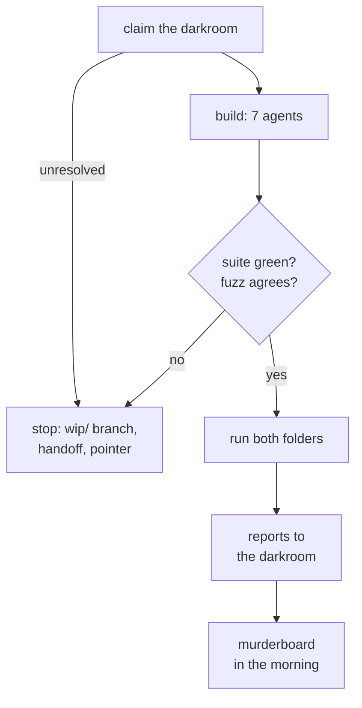

# The surrogate screen — measure tonight, decide tomorrow

> **Approved by Tony 2026-09-11 — staged, not yet launched.** The review ran past the night's 07:00 deadline. After the second round of this plan's review,
> Tony set the scope: every candidate is **measured** on both folders tonight, and **nothing is
> shortlisted**. The rule that turns measurements into a shortlist is designed tomorrow, from the
> numbers. Review record:
> [`reviews/2026-09-10-surrogate-evaluation-overnight_2026-09-10.md`](../reviews/2026-09-10-surrogate-evaluation-overnight_2026-09-10.md).

## The problem

A coordinated-event detector with **no labels** can only be trained one way here: teach a model to
tell a real recording from a **surrogate** of itself — a resampled copy that keeps each ROI's own
timing (an ROI is one imaged cell's trace) and destroys the timing *between* ROIs. Whatever the model
learns to spot is then coordination. That holds only if the surrogate differs from real data in
cross-ROI timing and nothing else. When something else gives it away, the surrogate **leaks**, and
the model learns the giveaway instead.

On 2026-09-10 an eleven-role review
([the coordination-without-labels review](../reviews/2026-09-10-coordination-without-labels_2026-09-10.md))
killed the surrogate that [the self-supervised proposal](2026-09-10-coordination-without-labels.html)
was built on. Uniform per-onset dither manufactures within-ROI intervals shorter than any real one,
so it can be told apart one ROI at a time — a defect Gerstein (2004) had already described. The
proposal's safeguard compared a once-dithered recording against a twice-dithered one; both already
leaked, so it read flat and would have passed the design.

**Two nulls this project already relies on are among the candidates**, so tonight's measurements bear
on shipped work: the shipped dither `jitter_trains` is the null behind the modularity result
(`modularity_vs_null`, at a 20-second jitter), and the per-ROI circular shift is the assessor's null —
and the standard one, used in the Cossart lab's own published analysis of the second folder here
(Dard et al. 2022).

Tony ruled that **every replacement candidate is tested, none pruned** — *"You can't predict a
priori which one is right"* — and that the tiers comparing them with a pooling operator **run as a
grid** ([the rulings](../todo/2026-09-10-which-surrogates-enter-the-screen.md)). He then asked whether
the evaluation belongs in the tool itself, for users whose data are not ours. ⚠ Whether the right
surrogate actually differs between datasets is a hypothesis tonight's cross-folder comparison tests,
not a premise, and any difference is confounded with preparation, event extraction and ROI count.

Two review rounds found blocking holes in the verdict rule each time, all needing numbers nobody has
yet — such as how wide real between-mouse variation is compared with the paired real-to-surrogate
differences a model would learn from. So tonight measures, and tomorrow decides.

## What was decided, and what tonight does

| decision | ruling |
|---|---|
| scope | measure every candidate on both folders; no shortlist, no verdict (Tony, 2026-09-10) |
| launch | a Workflow — a scripted multi-agent run — of 10 agents tonight; the murderboard runs on its report in the morning (Tony's go, in words) |
| Elephant, the Python package carrying Stella et al.'s surrogates | pinned at 1.2.1 as an optional extra; supplies seven of the twelve candidates; revisited [tomorrow](#tomorrow) |
| candidates beyond the eight Tony ruled in | ISI dither, window shuffling and trial shifting — completing the six surrogates Stella et al. 2022 compare — and the shipped dither |
| a provisional dead time *f* | swept, labelled provisional; the true dead time τ is the producer's to declare ([the τ todo](../todo/2026-09-10-the-dead-time-floor-is-the-producers-number.md)) |
| numbers from real recordings in the git tree | aggregates in plans and review prose, as this plan and the earlier review already carry; never per-recording data, figures of real recordings, or recording ids — everything else goes to the darkroom. Default taken; Tony can tighten it |
| the Cossart lab's folder | measured, as the different-data comparison |

**By morning:** a green PR adding `src/bugarach/surrogates.py`, `tools/build_surrogate_screen.py`, the
pattern-jitter clean-room harness and synthetic-only tests; a descriptive report per folder in the
darkroom, each opening with an executive summary, plus a cross-folder summary; the earlier review's
leak table rerun and its saturation table remeasured; and the list of choices the verdict rule must
make, each beside the measurement that bears on it.

**Not by morning:** a shortlist; the full model; τ; any figure of a real recording in a git tree; the
detectors' own rolling-context nulls, which answer a different question; the text-against-shape
overlap checker; any change to the encoder ([its own todo](../todo/2026-09-11-the-encoder-truncates-frame-positions.md)).

**Everything below is the execution spec for the sessions running the night.**

## Terms

| term | meaning |
|---|---|
| ROI, onset | region of interest, one imaged cell's trace; an onset is the time one of its events begins |
| stream | our folders carry two separately extracted event sets per recording, **fast** and **slow** (GLOSSARY: the stream axis); Cossart's carries one |
| surrogate, negatives | a resampled copy keeping each ROI's own timing and destroying cross-ROI timing; used as the model's negative class |
| leak | a real-versus-surrogate difference visible **without** cross-ROI information |
| screen | this tool: generators, statistics, controls, report |
| tiers | counting statistics, then a per-ROI-only discriminator, then the full model (not tonight) |
| *J* | jitter radius: how far a dither may move one onset, ± seconds; other candidates are matched to it by root-mean-square (RMS) displacement |
| τ | dead time: the shortest interval between two onsets of one ROI that the producer's extractor can emit. Not SPIKE-synch's τ, a coincidence window |
| observed floor | the shortest within-ROI interval in a folder's baselines: `steps_excluded` fast 0.40 s (4 frames), slow 2.80 s (28 frames). The senktide subset's slow floor, 3.20 s, is the earlier review's and is used only to reproduce it |
| *f* | the provisional dead time the candidates use, swept at 0.5, 0.75 and 1.0 × the observed floor, in whole frames |
| frame index | an onset's integer frame, the nearest whole number to *t*/d*t*. Every generator and statistic works on frame indices |
| generation window | the span a surrogate is generated over: the producer's baseline window, or the whole recording where a folder declares no regions |
| analysis window | a 60-second cut of the generation window |
| grid cell, draw | one combination of candidate, stream, *J* and any other swept parameter; one random surrogate of it |
| known-bad control | a surrogate built to fail one statistic; if the statistic does not register it, the statistic has no power there |
| destruction | whether a surrogate removes planted cross-ROI coordination |
| adapter | the wrapper in `src/bugarach/surrogates.py` that calls Elephant on frame indices and corrects its defects |
| group | `slices.csv` `group_id`: **ORX** and **OVX** are gonadectomized males and females, **DI** intact females in diestrus, **MALE** intact males. FOUNDATIONS §9 admits no number pooled across them unless the per-group numbers sit beside it |
| senktide | the 29 recordings of `steps_excluded` whose first treatment was senktide; used here only for the reproduction |
| pseudo-trial | a stretch of one ROI's onsets bounded by silences, treated as a trial for trial shifting |
| α | the false-positive rate accepted per test |
| UD, UDD, JISI-D, ISI-D, WIN-SHUFF, TR-SHIFT | Stella et al. 2022's names: uniform dithering, uniform dithering with dead time, joint-ISI dithering, ISI dithering (ISI: inter-onset interval), window shuffling, trial shifting |
| producer, export folder | the MATLAB stage that extracts events; the folder it writes, which is this analysis's only input |
| darkroom | the shared Dropbox folder for figures and reports, resolved by `bugarach.paths.darkroom()` — never the git tree |
| murderboard | this repo's eleven-role document review |
| epoch | one pass of a training loop over its data |
| ⚠ | a gap or claim carried unresolved |

## Where the data come from

- **`steps_excluded` baselines** — the producer's newest folder, whose README says to use it for any
  new analysis: 84 recordings from 44 mice, 35 of whom contribute more than one; 12, 12, 10 and 10 mice
  in ORX, OVX, DI and MALE.
- **The generation-window rule** already exists inline in `src/bugarach/assess_folder.py` (lines
  177–223). The build moves it into one function returning the window and its source, keeping both of
  its fallbacks: no regions declared means the whole recording, labelled an assumption; regions declared
  with none a baseline means the recording is skipped. Five drifted copies elsewhere
  (`tools/modularity_null.py`, `tools/synfire_scan.py`, `tools/make_membership_example.py`,
  `tools/assess_archive.py`, `tools/fit_background_shape.py`) are left for their own change.
- **Cossart's folder** (`cossart`): 59 sessions from 32 subjects, in vivo two-photon recordings of
  hippocampal area CA1 in mouse pups, onsets taken as the rising edge of a binarised active run. No
  regions, so each whole recording is a generation window, labelled; one stream; no groups. Its onsets
  are off the frame grid, so each maps to its nearest frame on its own session's frame interval; its
  floor is two frames (to within the frame interval's rounding). Every report using it cites the dataset,
  DANDI:000219 (Dard, Picardo & Cossart).
- **Rules are per folder**: every stream the folder carries, every group it declares, if any.
- **No recording is excluded.** The four whose motion correction pinned ROIs to a common frame value
  ([their todo](../todo/2026-09-10-four-recordings-carry-an-unflagged-contaminant.md)) are flagged per
  recording in the report. There is no "without" view: dropping them would be a consumer-side filter,
  and their fate is Tony's and the producer's call.
- **Every split and fold is grouped by mouse** (`subject_id`, as `src/bugarach/io.py` `_identity`
  resolves it).
- **Surrogates are generated over the whole generation window**, then cut into analysis windows. Scored
  windows reach the generation-window edges, as training crops can.

## The candidates

**Table 1. The twelve candidates.** The eight Tony ruled in — circular shift, uniform dither, rigid
shift, dither with dead time, joint-ISI dither, pattern jitter, interval jitter, operational-time
dither — plus ISI dither, window shuffling, trial shifting and the shipped dither.

| candidate | origin | implementation | what it does to one ROI's onsets | what *J* controls | at the edge |
|---|---|---|---|---|---|
| uniform per-onset dither (UD) | spike-centred jitter: Abeles & Gat 2001; Hatsopoulos et al. 2003 | Elephant `dither_spikes` | moves each onset uniformly within ±*J* | radius | drops onsets pushed out |
| shipped dither | this repo | `jitter_trains`, generated exactly as `modularity_vs_null` does: inactive ROIs dropped, half-open window, `RandomState` | as UD | radius; also its production 20 s | wraps, adding a seam interval |
| dither with dead time (UDD) | Stella et al. 2022 | Elephant `dither_spikes(refractory_period=f)` | as UD, keeping each onset at least the dead time from its neighbours; the dead time is capped at the ROI's own shortest interval (documented behaviour) | radius | never drops |
| circular shift | the standard per-ROI null (e.g. Dard et al. 2022); its root is unsearched | `assess.py` lines 540–541 moved into a function that `assess_coactivity` itself calls, draw order unchanged — the parity fixtures depend on it | shifts the whole train by one random offset per ROI, wrapping | none | wraps, with a seam |
| rigid shift, no wrap | Pipa et al. 2008 | Elephant `dither_spike_train`, dropping | shifts the whole train by one offset within ±*J* | radius | drops |
| trial shifting (TR-SHIFT) | Pipa et al. 2008 via Stella; trials as silence-bounded sequences after Harrison & Geman 2009 | **written here**: pseudo-trials cut at within-ROI silences longer than 2*J* + *f*, each shifted rigidly within ±*J*, no wrap | shifts each pseudo-trial independently | radius | drops |
| joint-ISI dither (JISI-D) | Gerstein 2004, whose recipe takes the square root of the joint interval histogram | Elephant `JointISI`, method `window`, with the square root swept on (Gerstein) and off (Stella's runs) | moves each onset along its preceding/following interval pair's distribution | maximum displacement | first and last onsets fixed |
| ISI dither (ISI-D) | Stella et al. 2022, modified from Gerstein 2004 | Elephant `JointISI(..., isi_dithering=True)` | as JISI-D, ignoring interval order | maximum displacement | first and last onsets fixed |
| interval jitter | Date, Bienenstock & Geman 1998 | Elephant `jitter_spikes` | re-places each onset uniformly within its fixed bin | bin √2·*J* (RMS-matched) | bins span the window |
| window shuffling (WIN-SHUFF) | Stella et al. 2022 | Elephant `bin_shuffling`, bin = 1 frame | shuffles bins within short windows | window √2·*J* in whole frames (RMS rule; Stella's own convention is 2·*J*) | drops onsets not strictly inside; the last partial window handled explicitly |
| pattern jitter | Harrison & Geman 2009 (applications in Harrison 2005) | **written here**, clean room: fixed-partition windows (their equation 4.2) on frame indices | re-places each onset within its window, keeping every interval of *R* frames or less exactly and every longer one longer than *R* | window √2·*J* in whole frames | first and last onsets fixed, as their footnote 4 recommends |
| operational-time dither | Louis, Gerstein, Grün & Diesmann 2010 (first presented Diesmann et al. 2009) | **written here** | dithers in time warped by a leave-one-out kernel estimate of the ROI's own rate | width *J*·*N*/*T* in expected-count units (*N* onsets in a window of length *T*) | recorded in the build |

**Table 2. Six controls**, each built to fail one statistic. Uniform dither, a candidate, is also the
known-bad control for the two floor statistics; the whole-window circular shift is destruction's
must-pass control.

| control | built from | the statistic it must move |
|---|---|---|
| do-nothing | returns its input | movement; destruction |
| interval shuffle | Elephant `shuffle_isis`, restricted to within-train intervals (it otherwise permutes the leading gap too) | serial dependence |
| homogeneous resample | Elephant `randomise_spikes` | interval distribution; rate profile |
| edge thinning | Elephant `dither_spikes(edges=True)`, generated per analysis window | edge-band density, low |
| edge piling | Elephant `dither_spikes(edges=False)`, generated per analysis window | edge-band density, high |
| per-window circular shift | the circular shift, generated per analysis window | sub-floor rate, through its seam intervals |

**Elephant's defects, and what the adapter does about each** (found by running it in a scratch
install; each gets a test):

- **Floating-point time.** `bin_shuffling` floor-divides seconds and puts on-grid onsets a frame early;
  `jitter_spikes` counts a window's start twice and crashes or misplaces onsets whenever it is not
  zero. The adapter runs every Elephant call on integer frame indices starting at zero, then maps back.
- **`JointISI` fails silently three ways**: a train of fewer than three onsets comes back unchanged; an
  interval pair beyond its truncation, or a bin wider than the dither, falls back to plain uniform
  dither; and with a small smoothing width it runs and moves nothing. The adapter counts all three per
  ROI, and such ROIs are *not estimable* — never scored as preserving anything. Its memory grows with
  the square of its bin count; a cell over 4 GB, or over its phase's time budget, is declared
  *intractable* and reported so.
- **`dither_spikes`' dead time is capped** at each train's own shortest interval, and zero silently
  runs plain UD. The adapter reports the dead time in effect per ROI and refuses zero.
- **`bin_shuffling` drops** edge onsets, so its counts are not exactly preserved.
- **No seed.** Elephant draws from numpy's and Python's global generators. Every draw is seeded from a
  `zlib.crc32` key of (recording, ROI, candidate, cell, draw): our own code uses `np.random.RandomState`
  (sapper rule SAP002 blocks `default_rng` in `src/`), and both global generators are seeded before each
  Elephant call. A test checks that two runs agree.
- **Millisecond defaults** — 2 ms smoothing, 15 ms dither. A test fails if any default is reached.

## What is measured

Every statistic works on frame indices; two onsets of one ROI in one frame count as a zero interval.
For every grid cell, per stream and group where the folder has them:

**Table 3. The statistics.**

| statistic | the property or leak | control that must move it |
|---|---|---|
| sub-floor interval rate, per interval | impossible short intervals | UD; per-window circular shift |
| interval density from *f* to 2*f*, excess and deficit | distortion just above the floor | UD; UDD at 0.5 × the floor |
| intervals shorter than the preceding event's width (slow stream) | an onset inside the previous event — real slow data never has one | UD |
| per-ROI interval distribution, Kolmogorov–Smirnov distance | each ROI's own intervals changed | homogeneous resample |
| serial dependence: mean per-ROI lag-1 Spearman correlation of consecutive intervals, ROIs with at least five onsets, against a within-ROI shuffle null | interval order destroyed | interval shuffle |
| rate profile: per-ROI Fano factor over 60-second counts and lag-1 count autocorrelation | drift erased | homogeneous resample |
| edge-band density, 5-second bands at the generation-window edges | onsets thinned or piled at an edge | edge thinning; edge piling |
| movement: share of onsets moved, median displacement, RMS displacement, share of ROIs unchanged | a surrogate that does nothing | do-nothing, which must read zero |
| coverage | the share of ROIs each statistic could score | — |
| cost | generation time and peak memory per ROI | — |

The Fano factor reuses `burst_rows` and `fano` from `tools/fit_background_shape.py`, moved into
`src/`. A control that fails to move its statistic is **not** a stop: it is a measurement of that
statistic's power, reported first.

**Three yardsticks for every statistic — all measured, none chosen:**

- **Mouse-split band**: real against real across 100 mouse-grouped half splits — the scale of
  between-mouse variation.
- **Paired surrogate histogram**: the statistic on the real recordings against *K* draws of the same
  recordings; two-sided *P* is the share of draws at least as extreme (Amarasingham et al. 2012).
  *K* = 99 where cost allows, never below 19; the report states *K*.
- **Exchangeable negative**: a real held-out half, and a fresh synthetic draw, each scored as if it
  were a candidate — the rate at which each yardstick flags something that should pass.

Each check's *P* is reported raw and Holm-adjusted per grid cell. The second review round measured
that the mouse-split band misses a full interval shuffle in three of the four groups, which is why
the paired yardstick is measured beside it; choosing between them is tomorrow's first decision.

**Destruction.** A new opt-in background floor in `src/bugarach/simulate.py`, following its
`bg_rate_shape` pattern so existing seeds reproduce, draws each synthetic ROI with a hard floor *f*
(placing its background with `_place_renewal` at `min_sep = f`) and a rate from the folder's per-ROI
count distribution. Planted coordinated events **replace** background onsets, so the floor holds in
both twins; planted jitter is one frame; participation 20% and 50%. Coincidence is scored with the
assessor's selection-corrected excess (`Assessment.coact_excess`) in a ±2-frame window, over all ROIs,
unchanged ones included. For each candidate and *J*, the planted twin's excess after the surrogate is
compared with the unplanted twin's across draws. The do-nothing control must keep the excess, the
whole-window circular shift must remove it, and freezing half the ROIs is the graded control. If
do-nothing loses the excess, the destruction measure is broken: it is reported as not run, and the
night continues.

**The per-ROI-only discriminator — required.** A classifier two-sample test (Friedman 2003;
Lopez-Paz & Oquab 2017): a numpy logistic model on per-ROI features computed over each analysis
window — count, interval quantiles, shortest interval, edge-band count — pooled across ROIs by
symmetric statistics, so no operation touches a second ROI until each ROI has been reduced over time.
Each real window is paired with its own surrogate and scored as a forced choice; the null permutes
the label within each pair; folds are grouped by mouse; α = 0.05, the smallest effect worth detecting
is 55% forced-choice accuracy, and the test set is sized in mice. Uniform dither is its positive
control and real against real its negative control; if either fails, its results are marked void.
`src/bugarach/learn/nets/tiny.py` is not usable: it sums per-ROI votes frame by frame, which is a
coactivity trace — exactly what a sound surrogate removes.

## The grid

**Table 4. Parameters.**

| parameter | values | basis |
|---|---|---|
| *J*, fast | 0.1, 0.2, 0.4, 0.8, 1.6, 2.5 s | doubling around the 0.40 s floor, plus the earlier review's 2.5 |
| *J*, slow | 0.7, 1.4, 2.5, 2.8, 5.6, 11.2 s | doubling around `steps_excluded`'s 2.80 s floor, plus the earlier review's 2.5 |
| *J*, Cossart | 1, 2, 4, 8, 16, 32 frames | doubling from one frame; its floor is two |
| shipped dither, extra | 20 s | its production setting |
| *f* | 0.5, 0.75, 1.0 × the observed floor, whole frames (Cossart: 1 and 2 frames) | at or below the floor, since τ cannot exceed it |
| pattern-jitter *R* | *f* − 1 frames | their equation 2.2 keeps intervals of *R* or less and forces longer ones above *R*, so *R* = *f* − 1 cannot make an interval shorter than *f* |
| joint-ISI | all ten keyword parameters set and recorded per cell: method `window`; square root on and off; smoothing width *J*/2 and *J*; dead time *f*; truncation at least the ROI's largest interval-pair sum; bins narrower than *J*; cutoff and alternation on | Gerstein's recipe and Stella's; on sparse ROIs the smoothing width, not *J*, decides whether onsets move |
| operational-time kernel | Gaussian, σ of 2, 5 and 10 minutes, leave-one-out | exploratory |
| draws *K* | 99 where cost allows, never below 19 | *P* resolution |
| splits | 100, grouped by mouse | the band's edges |
| analysis window | 60 s | ⚠ inherited from the earlier review, not justified |
| destruction | ±2-frame coincidence window; 1-frame planted jitter; 20% and 50% participation | declared |
| discriminator | α = 0.05; 55% forced-choice accuracy | declared |

## The reproduction — reported, not a stop

The earlier review's leak table reconstructs exactly — 543 windows of 60 s inside the senktide baseline
analysis windows — and is rerun under all three edge policies (wrap, drop, clamp). The expected outcome
is that the policies cannot be told apart: the second round found all three within about 1.6
percentage points of each other. Its saturation table's conditions were never recorded, so it is
remeasured under the leak table's. The review's 0% real sub-floor rate is by construction, because its
floor is the minimum of those same windows.

## How the night runs

**Table 5. The Workflow — 10 agents.**

| phase | agents | work | budget |
|---|---|---|---|
| claim | 1 (the integrator) | resolve the darkroom; confirm the darkroom claim on `docs/SESSIONS.md` has reached `main`; otherwise stop | 10 min |
| build | 7 | the adapter, controls, shipped dither, trial shifting, seeding and their tests · pattern-jitter spec author · pattern-jitter primary, from the spec alone · pattern-jitter adversary, fuzzer and mutant check, from the spec alone · operational-time dither · its hand-derived vectors · statistics, yardsticks, destruction generator, generation-window function, the time-axis port and the report builder | 3 h |
| integrate | 1 (the integrator) | full suite; commit and push — the only agent that touches git | 45 min |
| run | 1 | both folders, the reproduction, the discriminator; cost-capped | 3 h |
| report | 1 | the per-folder reports and the cross-folder summary, to the darkroom | 1 h |

Build agents share the one claimed worktree and write disjoint paths; only the integrator commits.
The pattern-jitter primary and adversary start only after the spec exists. **The deadline is 07:00**:
whatever is done by then is written up as partial.

## Figure 1. The night, and where it stops

**Stops**: the suite still red after two repair attempts; the pattern-jitter fuzz disagreeing, or a
mutant surviving it; the darkroom unresolved or its claim not on `main`; anything derived from a real
recording about to be committed — the integrator checks `git status` before every commit, and only
`src/`, `tools/`, `tests/`, `docs/clean_room/` and `pyproject.toml` may change. On any stop: a `wip/`
branch, a handoff at `docs/handoffs/2026-09-11-surrogate-screen-overnight.md`, and an additive pointer
block in the root `HANDOFF.md`, which carries the loop thread and this thread's existing pointer.

## The report

- **An executive summary first**, per folder: for each candidate, what it keeps and what it destroys;
  where each statistic had power; coverage and cost; the discriminator; the three yardsticks side by
  side; the choices the verdict rule faces. No shortlist.
- **Figures numbered and referred to by number and name**; every abbreviation defined at first use;
  *J*, τ and *f* defined before any figure uses them. The first figures are synthetic: a surrogate and
  its leak (a black-and-white raster with marks in a lane above it, beside one ROI's interval
  histogram), what each candidate does to one ROI, and the window anatomy.
- **Inline SVG only.** Time axes use a pure-Python port of `_time_axis_hook`'s tick rule (60-base
  ticks, labels such as `45s`, `2m`, `2m30s`), tested against the original.
- **Gated** by `render_check.py` (canonical in the downLow repo) and draughtsman's `edge_collisions.py`,
  each run as a stamped copy in the darkroom run folder's `tools/`, so that their roots and screenshots
  resolve there rather than in a git tree. The builder refuses a page with no SVG, which render_check
  would pass. ⚠ No tool catches text crossing a shape; a person looks at the screenshots.

## Tomorrow

- Design the verdict rule from the three yardsticks and the exchangeable-negative rates; then the shortlist.
- Murderboard the report.
- Send the producer the τ question.
- Read what Grün's group has published on selecting surrogates (Louis, Borgelt & Grün 2010; Grün et al.
  2010 — both on the literature ask-list), then decide whether to write to them.
- Decide on filing Elephant's defects upstream ([todo](../todo/2026-09-11-elephant-surrogate-defects-are-not-filed-upstream.md)),
  on the encoder's truncation, on Elephant as a dependency, and on whether the screen becomes a stage in
  [`pipeline.md`](../pipeline.md).

## Residual ⚠

- FOUNDATIONS §9's per-ROI rate range does not reproduce ([todo](../todo/2026-09-10-the-foundations-rate-range-does-not-reproduce.md)).
- The 60-second analysis window is inherited; the saturation table's original conditions are unrecoverable.
- Joint-ISI dither is intractable at the smallest *J*; operational-time dither may degenerate on data this sparse.
- No tool catches text crossing a shape.
- The circular shift's root, and the physics surrogate literature, were not searched.
- Nobody has asked Grün's group or the Cossart lab anything.
- This plan's review stopped at round two by escalation, unconverged; tonight measures what the verdict rule needs.

## Sources

- The review that killed the surrogate, and the proposal it reviewed: [`reviews/2026-09-10-coordination-without-labels_2026-09-10.md`](../reviews/2026-09-10-coordination-without-labels_2026-09-10.md), [`proposals/2026-09-10-coordination-without-labels.html`](2026-09-10-coordination-without-labels.html)
- Tony's rulings and the Stella reading: [`todo/2026-09-10-which-surrogates-enter-the-screen.md`](../todo/2026-09-10-which-surrogates-enter-the-screen.md)
- The earlier plan this replaces: [`todo/2026-09-10-build-the-surrogate-screen.md`](../todo/2026-09-10-build-the-surrogate-screen.md)
- Stella, Bouss, Palm & Grün 2022, *eNeuro* 9(3), ENEURO.0505-21.2022; code at <https://github.com/INM-6/SPADE_surrogates>
- Gerstein 2004, *Acta Neurobiologiae Experimentalis* 64(2):203–207; Pipa et al. 2008, *Journal of Computational Neuroscience* 25:64–88
- Date, Bienenstock & Geman 1998; Abeles & Gat 2001; Hatsopoulos et al. 2003; Harrison & Geman 2009, *Neural Computation* 21:1244–1258; Amarasingham et al. 2012
- Louis, Gerstein, Grün & Diesmann 2010, *Frontiers in Computational Neuroscience* 4:127; Louis, Borgelt & Grün 2010, in *Analysis of Parallel Spike Trains*; Grün et al. 2010, *BMC Neuroscience* 11(Suppl 1):O15
- Friedman 2003; Lopez-Paz & Oquab 2017
- Dard et al. 2022, *eLife* 11:e78116; the dataset DANDI:000219 (Dard, Picardo & Cossart)
- The literature shelf at `<darkroom>/bugarach/lit/` holds most of these; [`lit_needed.md`](../lit_needed.md) lists the rest
- Elephant 1.2.1, `elephant/spike_train_surrogates.py`, read and run 2026-09-10 in a scratch install
