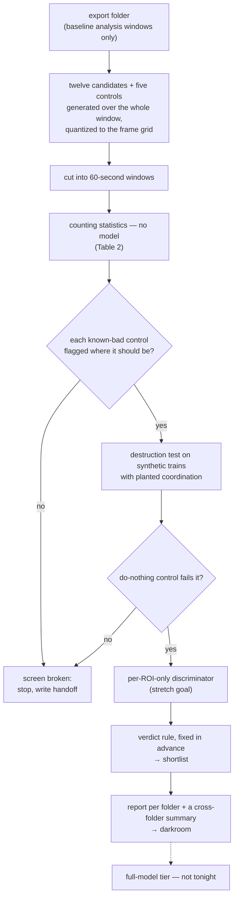
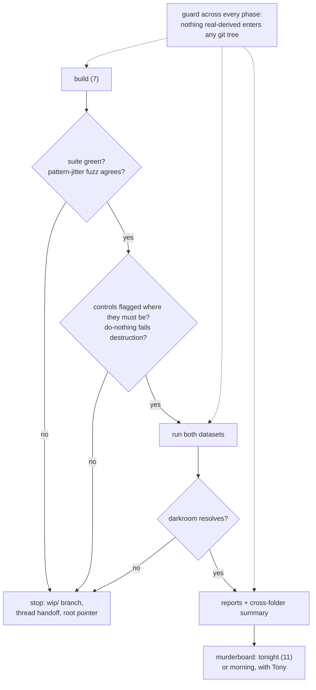

# The surrogate screen — an overnight build and run, waiting on Tony's go

> **A plan for Tony's review, 2026-09-10. Nothing runs until he says go.** Revised after an
> eleven-role murderboard whose first round found the screen could not do its job as drafted; the
> review record is in `docs/reviews/`.

## The problem

A coordinated-event detector with **no labels** can only be trained one way here: teach a model to
tell a real recording from a **surrogate** of itself — a resampled copy that keeps each ROI's own
timing and destroys the timing *between* ROIs. Whatever the model learns to spot is then
coordination. That holds only if the surrogate differs from real data in cross-ROI timing and
nothing else. When something else gives it away, the surrogate **leaks**, and the model learns the
giveaway instead.

On 2026-09-10 an eleven-role review
([the coordination-without-labels review](../reviews/2026-09-10-coordination-without-labels_2026-09-10.md))
killed the surrogate the proposal was built on. Uniform per-onset dither manufactures within-ROI
intervals shorter than any real one, so it can be told apart one ROI at a time — a defect Gerstein
(2004) had already described, flat dither adding short intervals to the interval histogram. The
proposal's safeguard compared a once-dithered recording against a twice-dithered one; both already
leaked, so the safeguard read flat and would have passed the design.

Tony then ruled that **every replacement candidate is tested, none pruned** — *"You can't predict a
priori which one is right"* — and that the tiers comparing them **run as a grid**
([the rulings](../todo/2026-09-10-which-surrogates-enter-the-screen.md)). He also asked whether the
evaluation belongs in the tool itself, for users whose data are not ours. This plan builds the
screen as that tool and runs it on our data and one other lab's.

## What Tony decides tonight

| decision | default if he says nothing | why it is a decision |
|---|---|---|
| **Launch as a Workflow of 21 agents, or 10 with the murderboard moved to morning** | **none — needs his go** | 21 exceeds this Claude Code install's workflow-size setting of 15 (`/config` → dynamic workflow size); the murderboard's eleven roles are what push it over. See [How the night runs](#how-the-night-runs) |
| Elephant, pinned at 1.2.1, as an optional extra | yes | it supplies eight of the twelve generators, raises the numpy floor to 2, and carries defects the adapter must handle — [The candidates](#the-candidates) |
| Beside the ruled eight: ISI dither, window shuffling, trial shifting on pseudo-trials, and the shipped `jitter_trains` dither | yes | the first three complete Stella's six; the shipped dither is the only candidate whose verdict bears on a result already in production |
| A **provisional floor *f*** swept while the producer is asked for τ | yes, labelled provisional everywhere | τ is theirs to declare ([the τ todo](../todo/2026-09-10-the-dead-time-floor-is-the-producers-number.md)); nothing fitted becomes a constant |
| What numbers from real recordings may enter the git tree | aggregate numbers in review prose, as the existing review record already does; never per-recording data, figures of real recordings, or recording ids | FOUNDATIONS §5 keeps anything derived from real data machine-local, and the tree already holds aggregates (the review record; FOUNDATIONS §9 itself). Tony can tighten this |
| The Cossart lab's folder as the different-data test | yes | the only dataset here from another preparation — [Where the data come from](#where-the-data-come-from) |

## Figure 1. The screen, and what each gate is for

A candidate reaches the shortlist only if it **keeps** what real data has — no statistic in Table 2
flags it — **and destroys** planted coordination. The first draft tested only the first half, so a
surrogate that changed nothing would have passed everything.

## What the night delivers, and what it does not

**Delivers:** a green PR adding `src/bugarach/surrogates.py` and `tools/build_surrogate_screen.py`,
tested on synthetic trains only; one report per export folder in the darkroom, each opening with an
executive summary, plus a cross-folder summary; the review record's leak table rerun and its
saturation table remeasured under one stated set of conditions; a shortlist produced by the rule
fixed below, not chosen after seeing the results.

**Does not:** train the full model; declare τ; put any figure of a real recording in a git tree;
build the text-against-shape overlap checker; touch the viewer or any detector; screen the
detectors' own rolling-context nulls, which answer a different question (the null for detection,
not the negatives for training).

## Terms

| term | meaning |
|---|---|
| ROI | region of interest — one imaged cell's trace; its **onsets** are the times its events begin |
| stream | each recording carries two separately detected event sets, **fast** and **slow** (GLOSSARY: the stream axis); every statistic is computed per stream |
| surrogate | a resampled copy of a recording that keeps each ROI's own timing and destroys cross-ROI timing |
| leak | a difference between real data and a surrogate visible **without** cross-ROI information — the thing a model would learn instead of coordination |
| *J* | jitter radius: how far a dither may move one onset, ± seconds. Other candidates' parameters are matched to it by equal root-mean-square displacement (Table 1) |
| τ | dead time: the shortest interval between two onsets of one ROI that the producer's event extractor can emit. The producer's number, not yet declared. (Not SPIKE-synch's τ, which is a coincidence window.) |
| floor, *f* | the shortest within-ROI interval **observed** in real data — 0.40 s fast and 3.20 s slow in the senktide baselines, i.e. 4 and 32 frames — standing in for τ. *f* is the provisional value swept in its place |
| generation window | the span a surrogate is generated over: the producer's baseline analysis window |
| analysis window | a 60-second cut of the generation window, the unit every counting statistic is computed on |
| known-bad control | a surrogate built to fail one statistic; if that statistic does not flag it, the statistic has no power there |
| group | the experimental group column in `slices.csv` (ORX, OVX, DI, MALE); FOUNDATIONS §9 does not admit a number pooled across them on its own |
| AUC | area under the receiver-operating-characteristic (ROC) curve; 0.5 is chance |
| UD, UDD, JISI-D, ISI-D, WIN-SHUFF, TR-SHIFT | Stella et al. 2022's names: uniform dithering, uniform dithering with dead time, joint-ISI dithering, ISI dithering (ISI: inter-onset interval), window shuffling, trial shifting |
| Elephant | the BSD-3-licensed Python package whose surrogate code descends from Stella's (their paper ran version 0.10.0) |
| producer | the MATLAB stage that detects events and writes the export folder |
| darkroom | the shared Dropbox folder where figures and reports go, resolved by `bugarach.paths.darkroom()` — never the git tree |
| Workflow | a scripted multi-agent run in Claude Code; the murderboard is this repo's eleven-role document review |
| epoch | here, one pass of a training loop over its data (Stella's "epochs" are behavioural phases, a different thing) |

## The candidates

**Table 1. Twelve candidates and five controls.** Edge behaviour is *measured* on Elephant 1.2.1 by
the review's claim-verification and methods roles, not read from its documentation.

| candidate | origin | implementation | what it does to one ROI's onsets | *J* sets | at the window edge |
|---|---|---|---|---|---|
| uniform per-onset dither (UD) | Date, Bienenstock & Geman 1998 lineage | Elephant `dither_spikes` | moves each onset independently, uniformly within ±*J* | the radius | drops onsets pushed out |
| shipped dither | this repo | `src/bugarach/graph.py` `jitter_trains`, in production in `modularity_vs_null` | as UD | the radius | wraps — adding a seam interval that can be sub-floor |
| dither with dead time (UDD) | Stella et al. 2022 | Elephant `dither_spikes(refractory_period=f)` | as UD, but each onset stays at least the dead time from its neighbours | the radius | never drops — confined between neighbours; can land exactly on the window end, so the adapter clips it |
| circular shift | this repo's assessor null | `src/bugarach/assess.py` lines 540–542, reused | shifts the whole train by one random offset per ROI, wrapping | none — the offset spans the window | wraps, with a seam interval |
| rigid shift, no wrap | Pipa et al. 2008 | Elephant `dither_spike_train`, dropping (its clamp option piles onsets on the edge and is not used) | shifts the whole train by one offset within ±*J* | the radius | drops |
| trial shifting (TR-SHIFT) | Pipa et al. 2008, via Stella | Elephant `trial_shifting` in its concatenated-train mode, one pseudo-trial per analysis window | shifts each pseudo-trial's onsets together within ±*J*, wrapping inside the pseudo-trial | the radius | wraps at every pseudo-trial edge |
| joint-ISI dither (JISI-D) | Gerstein 2004 | Elephant `JointISI(...).dithering()` | moves each onset along the distribution of its preceding and following interval pair | the dither | first and last onsets fixed |
| ISI dither (ISI-D) | Stella et al. 2022, modified from Gerstein 2004 | Elephant `JointISI(..., isi_dithering=True)` | as JISI-D, ignoring interval order | the dither | first and last onsets fixed |
| interval jitter | Date, Bienenstock & Geman 1998 | Elephant `jitter_spikes`, each train shifted to start at 0 | moves each onset uniformly within its own fixed bin | bin width √2·*J* | bins span the window |
| window shuffling (WIN-SHUFF) | Stella et al. 2022 | Elephant `bin_shuffling`, bin = the frame interval | shuffles bins within short windows, then randomises times within each bin | window 2·*J* | drops onsets not strictly inside; the last, partial window is handled explicitly |
| pattern jitter | Harrison & Geman 2009 (earlier in Harrison 2005) | **written here**, clean room, fixed-partition windows (their eq. 4.2) on the frame grid | resamples each onset within its jitter window while keeping every within-ROI interval shorter than a history length *R* exactly | window length 2·*J* in frames | first and last onsets fixed, as the paper recommends |
| operational-time dither | Louis, Gerstein, Grün & Diesmann 2010 (first presented Diesmann et al. 2009) | **written here** | dithers in a time axis warped by the ROI's own rate profile | the dither, in expected-count units, matched to *J* in seconds | recorded in the build |
| *control:* do-nothing | — | returns its input | nothing | — | — |
| *control:* interval shuffle | — | Elephant `shuffle_isis` | permutes the ROI's intervals | — | — |
| *control:* homogeneous resample | — | Elephant `randomise_spikes` | redraws the ROI's onsets uniformly over the window | — | — |
| *control:* per-window circular shift | — | the circular shift, generated per analysis window | wraps inside every analysis window | — | wraps at every window edge |

Stella's description of trial shifting is a rigid shift per trial; Elephant's wraps within the
trial. Stella allow a "trial" to be a long spike sequence separated by long silences, which is what
makes it runnable on continuous recordings here.

**Pattern jitter's history length *R* is tied to *f*:** an interval shorter than *R* is kept
exactly, so with *R* ≥ *f* the candidate cannot manufacture a sub-floor interval. At these rates
nearly every "pattern" is a single onset, so it may behave close to interval jitter with an
exclusion zone — which is a result, not a failure.

**Operational-time dither may degenerate here.** Louis et al. estimate the rate profile across
trials; a single ROI with a handful of baseline onsets gives a staircase, and the dither then maps
back to roughly one bandwidth around each onset — a disguised *J* sweep. The report shows its
displacement distribution in seconds so that is visible either way. (The repo's per-ROI-capable rate
estimator, `rate.event_rate`, refuses fewer than two trains and needs its core factored out.)

**Elephant defects, found by running it in a scratch install**, each handled in the adapter with a
test that fails if it recurs:

- `JointISI` returns any train with **fewer than three onsets unchanged**, silently, and silently
  falls back to plain uniform dither whenever an interval pair exceeds its truncation or a bin is
  wider than the dither. The adapter counts both per ROI; an unchanged ROI is *not estimable*, never
  scored. Its memory grows with the square of its bin count, so the smallest-*J* cells, which need
  bins finer than *J* across the whole interval range, are declared **intractable** and reported so.
  All nine of its parameters are set explicitly, with truncation at least the largest interval-pair
  sum and bin width below *J*.
- `dither_spikes` with a refractory period **uses the smaller of it and the train's own shortest
  interval** — so *f* is a cap, not a guarantee — and a refractory period of zero silently runs plain
  UD. The adapter reports the dead time actually in effect per ROI and refuses zero.
- `jitter_spikes` builds its bins from the window start counted twice and **crashes or misplaces
  onsets** on any window not starting at 0 — every baseline. The adapter shifts to 0 and back; a test
  uses a nonzero start.
- `bin_shuffling` **drops** onsets at the edge, so its count is not exactly preserved.
- Elephant draws from both numpy's and Python's random generators and **takes no seed**. Both are
  seeded from a key per (recording, ROI, candidate, draw), and a test checks two runs agree.

Every Elephant default is millisecond-scale — joint-ISI smoothing 2 ms, dither 15 ms — and a test
fails if any default is reached.

## The counting statistics, each with its own control

**Onsets in our folders sit exactly on the 0.1-second frame grid**, and every continuous-time
candidate produces off-grid times, which would be a leak of their own. Where a folder's real onsets
are on-grid (checked per folder), every surrogate is quantized onto the recording's frame grid
before any statistic; Cossart's onsets are off-grid and are not. Intervals and floors are counted in
frames.

**Table 2. What each statistic can see, and what proves it can.**

| statistic | leak it targets | known-bad control that must be flagged |
|---|---|---|
| sub-floor interval rate, per interval | impossible short intervals | uniform dither |
| interval density just above the floor, *f* to 2*f*, both directions | a surrogate that clears the floor but distorts what sits just above it | uniform dither; dither with dead time at a mis-set *f* |
| per-ROI interval distribution, Kolmogorov–Smirnov distance on the frame grid, against a real split-half reference | each ROI's own interval distribution changed | homogeneous resample |
| serial dependence: lag-1 rank correlation of each ROI's consecutive log-intervals | interval order destroyed | interval shuffle |
| rate profile: count autocorrelation and Fano factor across windows | within-ROI drift erased | homogeneous resample |
| edge-band onset density | onsets thinned or piled at a window edge | per-window circular shift |
| collisions after the encoder's own frame binning (`src/bugarach/learn/encode.py`) | onsets merged by binning, lost to training | uniform dither at large *J* |
| movement: share of onsets moved, median absolute displacement, share of ROIs returned unchanged | a surrogate that "passes" by doing nothing | do-nothing must score zero movement |
| coverage | how many ROIs each statistic could score at all | — |
| generation time | cost inside a training loop that draws fresh negatives every epoch | — |

Real baseline intervals are serially dependent in both streams, so the serial statistic has
something to preserve; it is also what separates joint-ISI from ISI dither. Sub-floor rates are
counted **per interval**, not per window, because a per-window share grows with ROI count — the
Cossart folder has roughly ten to thirty times our ROIs per recording.

**Coverage is a result, not a footnote.** About half the ROIs in a baseline have fewer than two
onsets and so no within-ROI interval at all. Every statistic reports the share of ROIs it could
score.

## The verdict rule, fixed before the run

- **Reference band.** Split the recordings in half **by mouse**, 100 times. For each statistic,
  stream and group, the real-against-real difference across those splits gives a central 95% band.
  The floor itself is re-estimated on each split's calibration half, and the report prints its spread
  and the real sub-floor rate's expected value under an order-statistic argument (roughly one in
  *N*+1 per interval, for *N* calibration intervals).
- **Flagged.** A candidate at a given stream and *J* is flagged on a statistic when its
  real-against-surrogate difference — the median over 20 draws — falls outside that band.
- **Powered region.** A statistic's verdicts count only where its known-bad control is flagged.
  Below that *J* a cell is reported *underpowered*, never as a pass. This is where uniform dither
  genuinely cannot be seen: at fast *J* of 0.1–0.2 s and slow 0.8 s it is indistinguishable from real
  data on the sub-floor statistic. It **must** be flagged at the review record's own cells — fast 1.6
  and 2.5 s, slow 2.5 s — or the screen is broken.
- **Destruction.** Synthetic trains with planted coordination, each ROI drawn with a hard floor
  (`src/bugarach/simulate.py` `_place_renewal`). A candidate passes when the planted cross-ROI
  coincidence excess falls inside the band of an unplanted twin. The do-nothing control must fail; if
  it passes, the test is broken and the night stops.
- **Shortlist.** Every (candidate, *J*) that is flagged by no statistic in its powered region, in
  both streams and in no group, and that passes destruction. The report shows the whole grid, not only
  the shortlist.

This is a pre-registered screening rule, not a significance test; the grid has hundreds of cells and
the report says so.

## Where the data come from

- **Generation window**: the producer's baseline analysis window where the folder has one, else the
  region's extent — the two differ in 24 of the 84 `steps_excluded` baselines. The rule already
  exists inline in `src/bugarach/assess_folder.py` (lines 178–223), and a second copy in
  `tools/modularity_null.py` has drifted from it; the build factors it into one function, the screen
  calls it, and the report prints each recording's window source.
- **Surrogates are generated over the whole generation window**, then cut into 60-second analysis
  windows — which is what training does (random crops) and avoids manufacturing an edge in every
  window. The per-window circular shift is the control that shows what that edge costs.
- **Our data**: the baselines of `steps_excluded`, the producer's newest folder, whose README says to
  use it for any new analysis — 84 recordings from 44 mice, with the mice in each group reported.
  `senktide` is 29 of those same 84 and is used only for the reproduction below. So there are **two
  datasets, not three**.
- **The Cossart lab's folder** (`cossart`): 59 sessions from 32 subjects, in vivo two-photon
  recordings of hippocampal area CA1 in mouse pups, onsets taken as the rising edge of a binarised
  active run, one stream, frame intervals of about 0.1 s. *J* is set in frames. Its floor is exactly
  two frames in every session, so its real zero is by construction and legitimately so. Its authors
  set their own synchronous-event threshold with independent per-cell circular shifts (Dard et al.
  2022, *eLife*), so the circular-shift verdict bears on their published null as well as ours.
- **No recording is excluded.** The four whose motion correction pinned ROIs to a common frame value
  ([their todo](../todo/2026-09-10-four-recordings-carry-an-unflagged-contaminant.md)) are shown with
  and without, as a sensitivity view.
- **Folds and splits are grouped by mouse** (`subject_id` as `src/bugarach/io.py` `_identity`
  resolves it), because 35 of the 44 mice contribute more than one recording — the review record
  already filed splitting by recording as a leak.

⚠ **"Does the verdict change with the data?" is a hypothesis this run tests, not a premise.**
Stella's figure 10 shows the choice matters on one dataset; it does not show the right choice differs
between datasets. If our folder and Cossart's agree, one documented choice suffices and the tool
becomes a check rather than a selector. Differences between the two are confounded with preparation,
extractor and ROI count, and the report says so.

## The reproduction — reported, not a stop

- **The leak table's windows reconstruct exactly**: non-overlapping 60-second windows inside each
  senktide baseline analysis window, leaving a 2*J* margin, give its 543. The generator that produced
  it is not recorded, so the rerun uses uniform dither under all three edge policies — wrap, drop,
  clamp — and reports which lands within draw tolerance.
- **The saturation table cannot be reproduced** — its stream, *J* and window were never recorded. It
  is remeasured at level (real against one application) and increment (one against two), under the
  leak table's conditions.
- **The review record's real 0% is confirmed as by construction**: the floor is exactly the minimum
  of those same windows. The screen does not rely on it.

Nothing in the screen depends on these numbers, so a failure to reproduce is written up, not a
reason to stop.

## The per-ROI-only discriminator — a stretch goal

A classifier two-sample test (Lopez-Paz & Oquab 2017): a numpy logistic model on per-ROI features
computed over the whole analysis window — count, interval quantiles, shortest interval, edge-band
count — pooled across ROIs by symmetric statistics, so **no operation touches a second ROI until each
ROI has been reduced over time**. It runs on **every** candidate (Tony's grid ruling). Held-out
accuracy with folds grouped by mouse; the null permutes the real/surrogate label within each pair;
α and the smallest effect worth detecting are declared before the run, and the test-set size that
bound requires is reported beside every verdict so that *not flagged* can be told from
*underpowered*. Uniform dither is its positive control and real against real its negative control;
if either fails, the discriminator's verdicts are void and the night continues without them.

`src/bugarach/learn/nets/tiny.py` is **not** usable here: it sums per-ROI votes frame by frame,
which is a coactivity trace — exactly what a sound surrogate removes. If the discriminator does not
run, the shortlist is labelled *screened for the known leak classes only*.

## The grid

**Table 3. Parameters, and where each value comes from.**

| parameter | values | basis |
|---|---|---|
| *J*, fast stream | 0.1, 0.2, 0.4, 0.8, 1.6, 2.5 s | doubling steps around the 0.40 s floor; includes the review record's 1.6 and 2.5 |
| *J*, slow stream | 0.8, 1.6, 2.5, 3.2, 6.4, 12.8 s | doubling steps around the 3.20 s floor; includes the review record's 2.5 |
| *J*, Cossart | 1, 2, 4, 8, 16, 32 frames | doubling steps from its two-frame floor |
| provisional floor *f* | 0.5, 0.75, 1.0 × the held-out floor, in frames | brackets the observed floor; Elephant's cap is reported, not hidden |
| pattern-jitter history length *R* | equal to *f* | the smallest *R* that cannot manufacture a sub-floor interval |
| operational-time rate bandwidth | 2, 5 and 10 minutes | a baseline is 17–20 minutes; exploratory, and labelled so |
| draws per cell | 20 | enough that the band, not the draw noise, dominates — the report prints both |
| splits | 100, grouped by mouse | the band's 95% edges |
| analysis window | 60 s | the review record's; one of the constants this plan inherits rather than justifies |

## How the night runs

**Table 4. The Workflow.**

| phase | agents | work |
|---|---|---|
| build | 7 | Elephant adapter, controls, shipped dither and their support tests · pattern-jitter **spec author** · pattern-jitter **primary**, from the spec alone · pattern-jitter **adversary and fuzzer**, from the spec alone · operational-time dither · operational-time dither's hand-derived vectors · the statistics, verdict rule, destruction test, window function and report builder |
| verify | 1 | full suite; each control flagged in its powered region; the reproduction |
| run | 1 | both datasets; the discriminator if time allows |
| report | 1 | the cross-folder summary |
| review | 11 | the murderboard on that summary |

The pattern-jitter primary and adversary start only after the spec exists, so that phase is
sequential, not parallel. Support-test fixtures are built per ROI with a hard floor, because the
simulator's background is Poisson with no dead time and would contain sub-floor intervals itself.

## Figure 2. The night, and where it stops

**Stop-on-a-dime.** Branch `surrogate-screen-overnight`, each verified step committed and pushed. On
any stop: a `wip/` branch, a handoff at `docs/handoffs/2026-09-11-surrogate-screen-overnight.md`, and
an *additive* pointer block in the root `HANDOFF.md`, which already carries two other threads and
must not be overwritten. The darkroom folder `<darkroom>/bugarach/2026-09-11-surrogate-screen/` is
claimed on `docs/SESSIONS.md` before anything is written to it.

## The report

- An executive summary first: the shortlist and the rule that produced it, per stream; which
  controls fired and where each statistic had power; coverage; what the discriminator saw.
- Figures numbered and referred to by number and name; every abbreviation defined at first use;
  *J*, τ and *f* defined before any figure uses them; the repo's plot conventions, including
  `_time_axis_hook` for time axes.
- **Inline SVG only**, because the render gate measures nothing else — it passes a page of
  `<canvas>` figures with zero flags. The gate refuses a page with no SVG.
- **Gated by `render_check.py`** (canonical in the downLow repo): no text overlaps, no text outside
  its figure, no rendered type below its floor. It resolves its root as the parent of its own
  `tools/` folder and writes screenshots under that root, so it runs as a stamped copy placed in
  `<darkroom run folder>/tools/`, keeping both its root and its screenshots in the darkroom — its
  default location is inside a git tree, and a destination outside its root crashes it. ⚠ It cannot
  see text crossing a box edge or a line — the defect in the 2026-09-10 decision brief; filed as
  armory FINDINGS 19. Until that check exists, report figures keep text out of shapes and a person
  looks at the screenshots.

## Tomorrow's targets, if the night succeeds

- Read the executive summary; accept or amend the shortlist for the full-model tier.
- Send the producer the τ question, already drafted in its todo.
- Decide whether to write to Grün's group about surrogate choice on sparse data — the
  coordination-without-labels review proposed it and nobody has asked.
- Decide whether Elephant stays a dependency or becomes only the reference our own code is tested against.
- Choose the grid for the full-model tier.
- Decide whether the screen becomes a stage in [`pipeline.md`](../pipeline.md) that every user's
  folder passes through — which tonight's cross-folder comparison bears on directly.

## Residual ⚠, carried into the run

- ⚠ **FOUNDATIONS §9's interquartile per-ROI rate does not reproduce** from any current folder, with
  or without zero-event ROIs. Not used here; [filed for its own review](../todo/2026-09-10-the-foundations-rate-range-does-not-reproduce.md).
- ⚠ The 60-second analysis window is inherited, not justified.
- ⚠ The saturation table's original conditions are unrecoverable.
- ⚠ Joint-ISI dither is intractable at the smallest *J*, and operational-time dither may be
  degenerate on data this sparse; both are reported as such rather than forced.
- ⚠ The text-against-shape gap in the render gate.

## Sources

- The review that killed the surrogate: [`reviews/2026-09-10-coordination-without-labels_2026-09-10.md`](../reviews/2026-09-10-coordination-without-labels_2026-09-10.md)
- Tony's rulings and the Stella reading: [`todo/2026-09-10-which-surrogates-enter-the-screen.md`](../todo/2026-09-10-which-surrogates-enter-the-screen.md)
- The earlier plan this replaces: [`todo/2026-09-10-build-the-surrogate-screen.md`](../todo/2026-09-10-build-the-surrogate-screen.md)
- Stella, Bouss, Palm & Grün 2022, *eNeuro* 9(3), ENEURO.0505-21.2022; code at
  <https://github.com/INM-6/SPADE_surrogates>.
- Gerstein 2004, *Acta Neurobiologiae Experimentalis* 64(2):203–207 — the joint-interval dither, and
  flat dither's added short intervals.
- Date, Bienenstock & Geman 1998; Harrison & Geman 2009, *Neural Computation* 21:1244–1258; Louis,
  Gerstein, Grün & Diesmann 2010, *Frontiers in Computational Neuroscience* 4:127; Pipa et al. 2008,
  *Journal of Computational Neuroscience* 25:64–88; Platkiewicz, Stark & Amarasingham 2017;
  Lopez-Paz & Oquab 2017 — the shelf holds all but Gerstein and Pipa, at
  `<darkroom>/bugarach/lit/`.
- Dard et al. 2022, *eLife* 11:e78116 — the Cossart folder's own analysis.
- Elephant 1.2.1, `elephant/spike_train_surrogates.py`, read and run 2026-09-10 in a scratch install.
