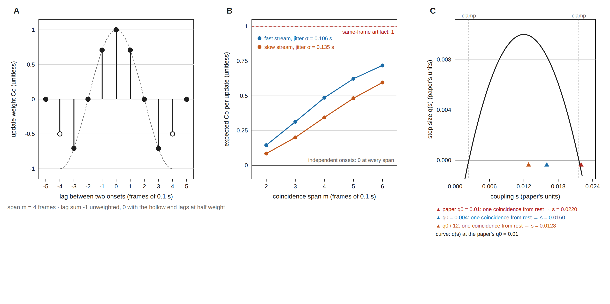

# A coupling that learns inside one recording: the von der Malsburg–Schneider plasticity rule as a detector

> **Status: draft, NOT converged — two review rounds, stopped for a decision that is Tony's.
> Nothing has been built or run. Do not approve any stage below as written.**
> Goal: [unsupervised learning](../goals/unsupervised-learning.md). Review record:
> [`reviews/2026-09-25-hebbian-coupling-detector_2026-09-25.md`](../reviews/2026-09-25-hebbian-coupling-detector_2026-09-25.md).
>
> **What the second round found, which the page below does not yet reflect:**
>
> - **In the regime the page allows, the rule is not learning much.** Below the step size that
>   avoids the clamp, each coupling is close to *q*₀ times a sum of kernel weights, and
>   standardizing to *Z* cancels *q*₀. So *Z* is a fixed, kernel-weighted cross-correlogram (a
>   centre-minus-flanks statistic, close to Stark & Abeles 2009) plus a little saturation for
>   busy pairs. That may still be a useful detector. It is not the Hebbian learner the title
>   promises, and the page should either say so or give the nonlinearity a job.
> - **The busy-core stop cannot trigger as written.** Against ±20 s jitter surrogates, two
>   independent simulations of a pure one-core field passed it in 9 of 9 and 12 of 12 recordings:
>   varying membership from event to event lifts eigenvalues 2–4 above any timing-destroying
>   null. The stop needs the membership (curveball) null the page reserves for readout 2, with
>   controls planted as trains, and it should be judged per group.
> - **Known errors in the body.** The recovery test tunes *m* and *q*₀ on the metric it then
>   scores. *Z* is 0/0 for pairs that never update. The call's comparison control is a
>   constant. At the paper's step only a same-frame first pair locks a coupling, not "the sign
>   of its first pair". *m* = 3 puts more coordinated updates on the negative lobe than *m* = 2,
>   so the stated reason for the 3–6 sweep is wrong. σ was re-measured on the default dataset
>   on 2026-09-23 (0.105 s fast, 0.131 s slow). The ±20 s surrogates are not snapped to frames
>   by `graph.jitter_trains`. And a penumbra-subtracted export folder does exist, as the `eval`
>   role `pensub`.
> - **One decision the page leaves out.** clamor is private and bugarach is public, so
>   vendoring `malsburg1986.py` publishes it, along with its copyright notice.

Abbreviations and symbols, used throughout:

- **ROI**: region of interest, one imaged cell.
- **Stream**: the fast or slow class of calcium event, analyzed separately (FOUNDATIONS §3).
- **STTC**: spike time tiling coefficient (Cutts & Eglen 2014), the pairwise coincidence
  measure `bugarach.graph.sttc_matrix` computes. The name is the literature's; here it scores
  calcium-event onsets.
- **CoactDetect**: the repository's coincidence-count detector, one of its six hand-coded
  detectors of coordinated events.
- **Frame**: one imaging frame, about 0.1 s on the default dataset.
- ***m***: the coincidence span, in whole frames. Two onsets closer than *m* frames can update a
  coupling; further apart they cannot.
- **Co(*k*)**: the coincidence kernel, the weight one pair of onsets *k* frames apart adds to
  their coupling. The paper calls it "coactivity"; this page does not, because the glossary
  reserves that word for a count of active ROIs.
- ***s***: the coupling between two ROIs, written *W*ij as a matrix. ***s*₀** = 0.012 is
  its resting value in the paper's units; ***s***d = 0.8 sets the bound, so every
  coupling stays between 0.2 *s*₀ and 1.8 *s*₀.
- ***q*(*s*)**: the size of one step at coupling *s*. ***q*₀** is its largest value, at rest.
- ***D*** = *W* − *s*₀: the learned deviation, 0 for a pair that never changed. ***Z***: *D*
  standardized pair by pair against its own surrogates.

---

## The gap

This project has a detector-learning goal with one route, and that route is stopped. The goal
wants a detector that learns from real recordings rather than from the simulator, whose
assumptions every learned number here currently inherits. Its one route trains a network to tell
a recording from a surrogate of itself, and it waits on Tony's choice of surrogate, via a stopped
screen and a pre-registration that has not been cleared to build
([goal page](../goals/unsupervised-learning.md)).

The rule proposed here learns inside one real recording, from that recording's own onsets, with
no training negatives. It cannot have learned the simulator, and it does not wait on the screen.
It still needs a null for significance and a simulator to set its two knobs. Both are named
below, so the claim is narrower than "label-free".

**Its main job is the detector.** A second job comes with it, and a stop that ends one ends both:
the learned coupling matrix is an instrument aimed at the assembly result's first open risk.
That result found no recurring groups of cells by modularity, which sorts every cell into
exactly one group and cannot see cells that belong to several
([the open-risks todo](../todo/2026-08-20-what-could-still-overturn-the-assembly-negative.md),
item 1).

## The idea

Treat each ROI as a unit coupled to every other. Walk through a baseline window in time order.
When two ROIs have onsets within a frame or two of each other, strengthen their coupling. When
the onsets are a near-miss apart, close to *m* frames, weaken it. At the end, the couplings
record which pairs kept coinciding more often than their event rates alone would produce.
Figure 1 shows the kernel that does this and what it gives a real pair.

A plain Hebbian rule, which only strengthens, fails twice here. Coupling grows for any two busy
cells, so it learns event rates rather than coordination. And it grows without bound.

**Figure 1. The kernel, what one update is worth, and the bound.** Computed from the rule's
definitions by `tools/make_hebbian_kernel_figure.py`; no recording is read.
**(A)** The coincidence kernel on whole-frame lags at *m* = 4 frames (0.4 s). The dashed curve is
the continuous cosine; the two hollow end lags carry half weight, which makes the sum over lags 0
rather than −1. **(B)** The expected weight of one update for a pair of ROIs that share event
times. Their onsets are scattered by the ruled per-participant jitter σ and floored to 0.1 s
frames. Independent onsets average 0 at every span, and a same-frame artifact scores 1. At
*m* = 2 frames a coordinated fast pair averages 0.144 and a same-frame artifact 1, so an artifact
weighs about seven coordinated pairs. ⚠ σ was measured on a folder since superseded (see the
span, under Method detail). **(C)** Equation 8's step size *q*(*s*) at the paper's
*q*₀ = 0.01 (curve), the clamp at 0.2 *s*₀ and 1.8 *s*₀ (dashed), and where one coincidence from
rest lands at three step sizes (triangles). At the paper's step it lands past the clamp.

## Why this rule

Three properties, each a repair to the plain rule or a fit to this project:

- **It learns during one stimulus.** In von der Malsburg & Schneider (1986) the coupling is not
  trained across stimuli; it changes within a single presentation. Here that means one matrix per
  recording, built from that recording alone. Negatives drawn across recordings taught a model
  which recording it was looking at in every study the goal page found that measured it; this
  rule never compares two recordings.
- **Its kernel averages to zero.** A learning window that integrates to zero causes no drift
  from event rates alone. That principle is Kempter, Gerstner & van Hemmen (1999), not this page.
  Figure 1A shows how the kernel meets it on a frame grid. The zero is in the mean only: the
  spread of *D* still grows with how busy a pair is, which is why readouts use *Z*.
- **Its step shrinks near the bound.** *q*(*s*) is largest at rest and zero at the clamp, so no
  coupling leaves 0.2–1.8 *s*₀. That holds only with the clamp in place and a step below 0.0048,
  as Figure 1C shows.

## What the detector reports

Three readouts. Each is computed on *Z*, *D* standardized pair by pair against its surrogates,
so a busy pair's larger chance swings do not read as structure:

1. **Does the rule register coordination at all?** The largest eigenvalue of *Z* against the
   same statistic from surrogates that keep each ROI's slow rate changes and destroy its fine
   timing. The surrogates are onsets jittered uniformly within ±20 s and snapped to frames
   (`graph.jitter_trains`, the null behind the modularity result). These recordings are known to
   be coordinated, so this should come out significant nearly everywhere. It is a **power check,
   not a finding**: a recording where it fails is one where the rule cannot see what every other
   instrument sees ([why a timing-destroying null says yes everywhere](../todo/2026-08-18-do-real-slices-have-recurring-assemblies.md)).
2. **Is there structure beyond coordination?** The eigenvalues of *Z* after the first, and
   overlapping groups found in *Z* by a method that lets one ROI join several. This null must
   hold the coordinated events fixed and move only who takes part in them. It is the
   fixed-margin (curveball) null the assembly report uses for membership, applied to the onsets
   inside the assessor's coordinated clusters. ⚠ Building that null for timed trains is new work.
   The grouping method is not chosen: a weighted stochastic block model (Aicher, Jacobs & Clauset
   2015) handles signed weights, and link communities (Ahn, Bagrow & Lehmann 2010) take only
   positive ones. With about 32 ROIs per recording, either must pass its own null first.
3. **A call per frame.** For the set *A*(*t*) of ROIs with an onset within *m* frames of frame
   *t*, the score *E*(*t*) is the mean of *Z* over the pairs in *A*(*t*). A mean rather than a
   sum, because a sum grows with the square of the active count. *Z* is learned on one half of
   the baseline window and scores the other, then the halves swap, so no frame is scored by
   couplings it built. The threshold comes from surrogates put through the same learn-and-score.
   This readout makes the rule a seventh detector, comparable with the six.

**Baseline only**, as FOUNDATIONS §9 requires (coordination properties come from untreated
recordings). Carrying a baseline *Z* into a treatment window is the quiet-to-busy transfer the
goal page lists under *Waiting on Tony*, and is out of scope.

## What could make this worthless

Two checks. The first runs before any detector code exists; the second needs the rule and runs
first in the simulation stage.

**The busy-core check: is there anything beyond one busy core?** Stop if, in more than half the
recordings of a stream, none of the second to fourth eigenvalues of the STTC matrix exceeds the
95th percentile of the same eigenvalue on ±20 s jitter surrogates. That stream stops, and the
proposal ends if both do: without structure beyond a core, the shape readout has nothing to find
and the call reduces to a weighted count of active ROIs, which CoactDetect already is.
- Why this statistic: a matrix that is one core plus noise leaves little variance after the
  first eigenvector, and so does a surrogate. Comparing that remaining share against surrogates
  would pass a pure core. The second to fourth eigenvalues do not have that blind spot.
- The STTC is computed fresh at a tile of half the coincidence span, to match the kernel's
  positive lobe. The only STTC matrices this project has computed used a 2 s tile and were never
  stored. The diagonal is zeroed, and ROIs with no onsets are left out of this check only; STTC
  is undefined for them.
- Controls: a planted one-core-plus-noise matrix must trip the stop, and a planted two-group
  matrix must pass it.
- The assembly report calls the field core–periphery as an interpretation, not a fitted model.
  This check is the test that interpretation lacked.

**The just-STTC check: is *Z* STTC by another name?** Stop if either arm says yes:
- *Rank*: Kendall's τ-b between *Z* and STTC exceeds 0.9 in more than half the recordings of a
  stream, over pairs where STTC is defined, at whichever STTC tile (half the span or the full
  span) agrees best. τ-b because most pairs in a sparse recording never update and sit tied at 0.
- *Recovery*: on simulated recordings with planted overlapping groups, *Z* does not recover the
  planted pairs better than STTC does, measured as area under the curve (AUC) for planted pairs
  against the rest, over 20 seeds.

If either arm says yes, the finding is that the rule adds nothing to STTC; the detector is not
built, and the shape readout runs on STTC directly.

## What is asked

**Now**
- Set the two stop thresholds or accept the drafts above ("more than half the recordings", the
  95th percentile, τ-b 0.9, 20 seeds). They are proposals, not measurements, and are set before
  any number is read.
- Approve the busy-core check. It needs no detector code and reads baseline windows from the
  confirmed default dataset. The work is STTC matrices at the chosen tile and their jitter
  surrogates: 66 recordings × 2 streams × 200 surrogate draws, the count the modularity run
  used.

**Later, at each stage's end**
- Approve the simulation stage, then the real-recording stage.
- Post one request to the producer, drafted here: centroid positions and a penumbra-subtracted
  export folder (see Distance).
- Say whether anyone has written to von der Malsburg or his group about equations 7 and 8, or
  about the step size. clamor's record plans to write and shows no letter. Correspondence would
  be cited as a dated personal communication, never quoted.

## Stages

| stage | what runs | ends with | stops if |
|---|---|---|---|
| **Busy-core check** | the check above, both streams | a per-stream verdict | the check's stop triggers in both streams |
| **Simulation** | the rule on simulated recordings (below); the just-STTC check | *m* and *q*₀ frozen by a declared objective | either just-STTC arm says yes |
| **Real baseline recordings** | the three readouts, both streams | per-group results, in the order DI (diestrus female), OVX (ovariectomized female), MALE, ORX (orchiectomized male) | — |
| **Back to clamor** | a finding for clamor on what *q*₀ and the kernel do on real calcium data | clamor's record | — |
| **Distance** | whether couplings fall with distance between ROIs | a covariate result | waits on data bugarach does not have |

**The simulation stage** needs a generator that does not exist yet: timed onsets with planted,
overlapping groups. `tools/assembly_power.py` plants one group in a table with no times. So this
stage adds a group-membership option to `simulate_coordination`. That option inherits the
simulator's rate spread, burstiness, dead-time floor and frame grid. "Strength" keeps
`assembly_power.py`'s meaning, the fraction of events recruited from a group. It runs:
- **Rate neutrality.** Independent trains at mismatched rates: mean *D* regressed on the product
  of the two event counts must have a slope within ±2 surrogate standard errors of 0. The same
  kernel without half-weighted ends must fail this, which proves the test can.
- **Recovery.** Planted groups at the strengths the membership test has power for, with the
  just-STTC recovery arm.
- **The call.** The per-frame call against CoactDetect, against *E*(*t*) with *Z* replaced by
  its own mean (a squared active count), and against *Z* shuffled with row sums kept. "Beats"
  means a higher F1 score (the harmonic mean of precision and recall) on the planted events,
  with a 20-seed paired 95 % interval that excludes 0.
- **Two comparison arms.** A covariance rule (Sejnowski 1977): a flat positive window minus the
  coincidences expected from the two rates, with no negative lobe. For calcium events a
  near-miss may mean loose coordination rather than evidence against it (antiphase), and if the
  covariance arm recovers as well, the lobe is dropped. Also a same-frame-excluded kernel, whose
  negative lobe is rescaled to keep the lag sum 0. Real-data conclusions must survive it, because
  same-frame coincidences are where motion, light and neuropil artifacts sit.
- **Freezing.** *m* is chosen from 3 to 6 frames and *q*₀ from {0.004, 0.01/12} by planted-pair
  AUC at the middle strength. That objective is declared here, before any simulation is run.

**The real-recording stage** reports every result per group and per stream, never pooled alone.
FOUNDATIONS §9 makes group-dependence mandatory. Two limits travel with every per-group number:
- Group is nested in imaging day on the approved export (no date holds more than one group), so
  a per-group difference is not a group effect.
- The unit of replication is the mouse: 66 recordings from 36 mice (ADR-0008).

**Distance.** The export carries no ROI positions. Nearby ROIs share scattered light, so a
coupling learned between neighbors may be optical crosstalk. Distance is therefore a covariate to
test against, never a restriction on which pairs couple. The request goes to the producer as an
outcome, not a method (ADR-0007: bugarach sessions do not act in interface2): *each ROI's
centroid, in µm, and a penumbra-subtracted copy of the default folder; every other file
unchanged.* The penumbra-subtracted data exist only as a `.mat` store, which analysis here may
not read.

## Method detail

**The source.** von der Malsburg & Schneider, *A Neural Cocktail-Party Processor*, Biological
Cybernetics 54:29–40 (1986), DOI [10.1007/BF00337113](https://doi.org/10.1007/BF00337113). It
applies the synaptic modulation of von der Malsburg's 1981 correlation theory. ⚠ Neither the
1986 PDF nor the 1981 report was reachable during review, so every "the paper says" below is
verified against clamor's transcription only (syncytium2/clamor, file `malsburg1986.py`, at
`c25c7e5`).

- **Equation 7**, the kernel: +1 when two bursts coincide, 0 at half overlap, −1 in antiphase. The
  paper states it exactly as a cosine for a burst lasting half the period. clamor's general form
  for other burst lengths is its own interpolation, marked `INTERPOLATED`.
- **Equation 8**, the step: *q*(*s*) = *q*₀ (1 − ((*s* − *s*₀)/(*s*₀ *s*d))²).
- **The subliminal rule** (p. 33): no change for a cell that has not burst within one period
  plus half a burst.

**What changes for calcium events.** The 1986 units are oscillators, and antiphase means half a
period away. Calcium events are not periodic, so the oscillator is left behind and the kernel's
shape is kept over a finite span:
- **The kernel at the one point the paper states exactly.** Period 2*m* and burst *m* give
  Co(*k*) = cos(π*k*/*m*): +1 at lag 0, 0 at *m*/2, −1 at *m*. That is the burst-equals-half-period
  case, where clamor's `selftest()` pins its general form to the paper's cosine. No sweep here
  leaves this case, so the interpolated form is never used.
- **Whole frames, ends at half weight.** Onsets are floored to frames before lags are taken, and
  *m* is a whole number of frames for each recording's own frame interval. Summed over lags −*m*
  to *m*, the cosine gives −1 for every *m*, because both ends sit at −1. Weighting the two end
  lags by one half (the trapezoid rule) gives 0 (Figure 1A). At a span that is not a whole number
  of frames there is no end lag to halve, and the sum drifts either way.
- **Gated before the kernel.** clamor's kernel wraps lags modulo the period, so a pair 2*m* apart
  would score as a perfect coincidence. Pairs further apart than *m* frames are dropped before the
  kernel is called. This is also this page's version of the subliminal rule: a ±*m* cutoff, not
  the paper's one and a half periods, listed as a deliberate deviation.
- **One update per pair of onsets, symmetric.** Each unordered pair of onsets within ±*m*
  updates *W*ij and *W*ji once, when the later onset arrives. clamor updates
  one row per burst and leaves open whether that row is the pre- or postsynaptic cell; Co is even,
  and the symmetric form sidesteps the question.
- **The span.** The ruled jitter is σ = 0.106 s fast and 0.135 s slow, each participant's scatter
  around a shared event time (`decisions_pending.md` item 2). The lag between two participants
  scatters by σ√2, so a span of two jitters puts about a fifth of coordinated updates on the
  negative lobe (Figure 1B). The sweep therefore runs from 3 to 6 frames. ⚠ The jitter was
  measured on a folder since superseded ([todo](../todo/2026-09-23-the-overnight-runs-are-pinned-to-an-export-that-has-changed.md));
  *m* is frozen only after it is re-measured on the default dataset.
- **The step and the clamp.** The bound needs the clamp in clamor's `modulate()`, not only
  *q*(*s*). At the paper's *q*₀ = 0.01 one coincidence from rest lands at 0.0220, past the clamp at
  0.0216. There *q* = 0, so the coupling never moves again, and each entry of *D* records the sign
  of its first pair of onsets (Figure 1C). Below *q*₀ = *s*₀*s*d/2 = 0.0048, no step from
  inside the band crosses the clamp. The paper's 0.01 is therefore out of the sweep. clamor's own
  question about the step size (the paper states 0.01; its p. 35 implies about 0.01/12) is
  what the Back to clamor stage reports on.
- **Rate neutrality is in the mean.** For independent onsets the expected update is 0 however
  busy either ROI is, because the kernel's lag sum is 0 (Kempter et al. 1999). Before the clamp
  that is exact, not approximate. The spread is not neutral: the variance of *D*ij
  grows with the number of onset pairs, roughly the product of the two event counts. At the
  per-ROI background rates FOUNDATIONS §9 gives, most independent pairs in a baseline window
  never update at all (derived during review, not measured).

## Where the code comes from

clamor's `malsburg1986.py` is copied **whole and verbatim** into `third_party/clamor/`, stamped
`vendored from syncytium2/clamor @ <sha>` and never edited. That follows the draughtsman
precedent in `third_party/draughtsman/`. Tony chose a stamped copy over a dependency on
2026-09-25, in the session that wrote this page, and an architecture decision record (ADR) goes
with the first commit that copies code. Copying two methods out of the class would have lost the
clamp and the module constants the step reads, and an excerpt cannot be checked against its
source.

- Both repositories are BSD-3-Clause, under the same GitHub organization. clamor's open license
  item concerns tooling it copied from elsewhere, not this model.
- The module imports torch, which bugarach has only as an optional extra (`dl`, `dev`). The
  detector imports it lazily, so `import bugarach.detectors` still works without torch. The
  kernel's functions take tensors, and the detector converts at the boundary.
- `tools/check_vendor_freshness.sh` gains a clamor family, read through a local clone named by
  `BUGARACH_CLAMOR`, as draughtsman is. That gate is advisory and nothing runs it on its own
  ([todo](../todo/2026-09-19-the-vendor-freshness-gate-is-advisory-and-nothing-runs-it.md)), so
  the stamp records which version was measured rather than guaranteeing it is current.
- A seventh detector registers where the six do (`detect_folder.DETECTORS`, the operating
  points, the display names). It takes its frame interval from `with_microscope`, its baseline
  windows from `effective_region_windows`, its input from `dataset.default()` and its group
  order from `bugarach.groups`. It cannot have a MATLAB parity test, and its landing PR says so.

## What this does not claim

- That the preparation has assemblies. The assembly negative stands until something overturns it.
  This is one instrument that could, and a null result from it is a result.
- That rate neutrality holds for real trains beyond the mean. It is exact in expectation for
  independent trains. Real trains have a dead-time floor and slow drift, and the simulation stage
  measures what those do.
- That clamor's transcription reproduces the paper. clamor's record says the first stability
  test reproduces and the second does not (its CLAIMS item 5). A one-step onset gap reproduces
  under one reading of the paper's Figure 4 (item 1). Equation 8's step size re-locks streams the
  dynamics had separated (item 2). So the step size is an open fidelity question in the source,
  which is why it is swept here and not taken from the paper.

## References

- Ahn, Bagrow & Lehmann 2010, *Nature* 466:761–764, doi:10.1038/nature09182.
- Aicher, Jacobs & Clauset, *Learning latent block structure in weighted networks*,
  arXiv:1404.0431 (the weighted stochastic block model).
- Cutts & Eglen 2014, *J Neurosci* 34:14288–14303, doi:10.1523/JNEUROSCI.2767-14.2014.
- Kempter, Gerstner & van Hemmen 1999, *Phys Rev E* 59:4498–4514, doi:10.1103/PhysRevE.59.4498.
- Sejnowski 1977, *J Math Biol* 4:303–321, doi:10.1007/BF00275079.
- Stark & Abeles 2009, *J Neurosci Methods* 179:90–100, doi:10.1016/j.jneumeth.2008.12.029. A
  cross-correlogram statistic with a hollowed window, the nearest relative of the kernel's
  positive center and negative flanks.
- von der Malsburg & Schneider 1986, *Biol Cybern* 54:29–40, doi:10.1007/BF00337113.
- ⚠ Not reached: von der Malsburg 1981, *The Correlation Theory of Brain Function* (the rule's
  origin). Not searched: the machine-learning "fast weights" literature (weights that change
  within one input sequence), and oscillator-synchronization physics.
