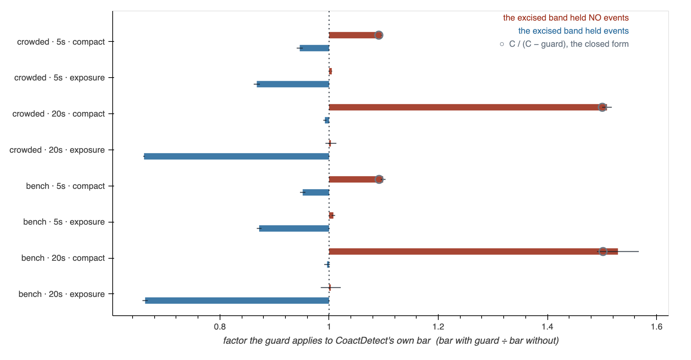
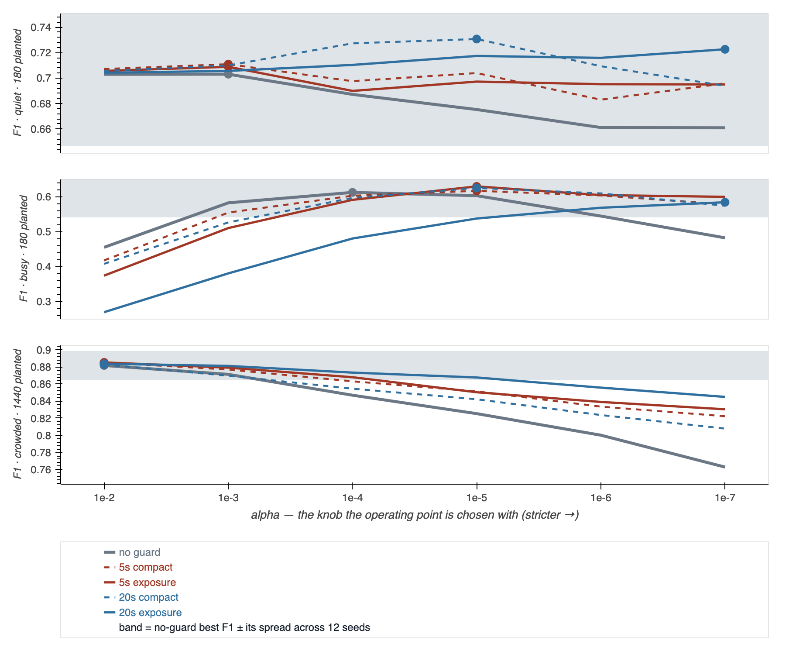

# The rise where the guard excised nothing is C / (C − guard). Radar divides it out; we multiplied by it.

**For an independent session, and written to be attacked.** It has **not** been
murderboarded; if any of it goes outward, run one. Nothing in `docs/forks.md` or
`docs/detector_history.md` has been changed on its strength, and neither
`docs/reviews/guard_where_it_lands_2026-08-25.md` nor the tools #308/#310 landed have
been touched — this stands beside them and says where one of their readings is wrong.

Tony asked whether radar, astrophysics or sonar had done this before. They had, all
three, and they disagree with each other in a way that turns out to settle the question.



## The claim, in one sentence

**The guard's rise at empty anchors is not a property of these recordings — it is the
ratio of the reference window's length before and after the guard, `C / (C − guard)`,
which the measurement reproduces to within 0.5% at both guard widths on both
recordings; and because that factor is applied at *every* bin, it was also cancelling
most of the masking relief at the occupied ones.**

## Why anyone should care

`guard_where_it_lands_2026-08-25.md` reports the two strata moving in opposite
directions and reads the empty-stratum rise as *"its own argument against wide
guards"* — at a 20 s guard, it says, *"the occupied effect collapses while the empty
effect grows."*

The occupied effect does not collapse. It is **the largest in the table**, and a
+50% normalization was sitting on top of it:

| recording | guard | normalization | occupied stratum |
|---|---|---|---|
| crowded | 20 s | `compact` (shipped) | ×0.9923 — looks like nothing happens |
| crowded | 20 s | `exposure` | **×0.6609** — a third of the bar, in every seed |

So the sentence that made wide guards look self-defeating was measuring the
normalization, not the guard. That matters downstream:
[`censoring is the instrument the guard was not`](../todo/2026-08-23-censoring-is-the-instrument-the-guard-was-not.md)
and the knob-axis todo both rank work on the size of the guard's effect, and the size
they have is compressed by a factor that has nothing to do with the tissue.

## The closed form, so it can be refused

CoactDetect's bar is `nullmean` — the mean over surrogates of the number of ROIs with
at least one circularly-shifted event landing in one bin width. Take one ROI whose
retained events sit on a line of length `L`, and let `m` be the measure of the union of
the bin-width neighborhoods of those events. A uniform circular shift puts at least one
of them in the test window with probability `m / L`, so

```
nullmean  =  Σ_ROIs  m_i / L
```

**A null mean here is a density, not a count.** Now excise a guard band of width `g`
that holds *no events*. Every `m_i` is untouched. `L` goes from `C` to `C − g`. So

```
nullmean(guard) / nullmean(0)  =  C / (C − g)
```

with **no free parameter**: 60/55 = 1.0909 at a 5 s guard, 60/40 = 1.5000 at 20 s.
That is a prediction about arithmetic. It would hold if the recording contained no
biology at all.

**Attack this first.** It is the only step here that is an argument rather than a
measurement, and everything else is downstream of it. The obvious hole: `m_i` is *not*
strictly untouched, because compaction splices two pieces together and events that were
far apart can land within a bin width of each other across the seam, which shrinks `m`.
That predicts the measurement should sit slightly *below* the closed form at wide
guards, and it does not — see *Where I think it is most likely wrong*.

## The measurement

`coact_detect` grew one keyword, `guard_norm`, whose default is the shipped behavior:

- **`compact`** (shipped, and the only thing that existed before this) — the guard
  removes the excised events **and** the excised span. The retained pieces are laid end
  to end and shifted on the shorter line.
- **`exposure`** — the guard removes the excised events and **keeps the window length**.
  Counts come out; exposure does not.

4 seeds, `baseline_quiet`, shipped operating points, 500 surrogates per bin.
`seeds<1` counts how many of the four seeds individually put the occupied bar below 1 —
that is the strength test, not a *p*-value; four seeds cannot support one.

| recording | guard | norm | n empty | ratio empty | predicted | n occupied | ratio occupied | seeds<1 |
|---|---|---|---|---|---|---|---|---|
| crowded | 5 s | compact | 8372 | **1.0964** ± 0.0012 | **1.0911** | 13204 | 0.9462 ± 0.0017 | 4/4 |
| crowded | 5 s | exposure | 8372 | **1.0050** ± 0.0011 | 1.0000 | 13204 | **0.8675** ± 0.0015 | 4/4 |
| crowded | 20 s | compact | 534 | **1.5092** ± 0.0070 | **1.5007** | 21042 | 0.9923 ± 0.0021 | 4/4 |
| crowded | 20 s | exposure | 534 | **1.0033** ± 0.0051 | 1.0000 | 21042 | **0.6609** ± 0.0014 | 4/4 |
| bench | 5 s | compact | 1904 | 1.0990 ± 0.0027 | 1.0917 | 3456 | 0.9517 ± 0.0024 | 4/4 |
| bench | 5 s | exposure | 1904 | 1.0079 ± 0.0025 | 1.0000 | 3456 | 0.8719 ± 0.0022 | 4/4 |
| bench | 20 s | compact | 129 | 1.5292 ± 0.0149 | 1.5019 | 5231 | 0.9963 ± 0.0038 | 3/4 |
| bench | 20 s | exposure | 129 | 1.0031 ± 0.0117 | 1.0000 | 5231 | 0.6629 ± 0.0025 | 4/4 |

Every cell is copied from the tool's stdout. `predicted` is computed **per bin**, with
the same edge clipping `coact.py` applies, and then averaged — near the ends of a
recording the context window is short and the guard band can hang off the end, so it is
not one number.

Read it as three statements:

1. **`compact` empty ≈ predicted.** 96% of the 5 s rise and 98% of the 20 s rise is the
   exposure factor. What is left over is ~0.5%, at both widths, on both recordings.
2. **`exposure` empty ≈ 1.** Removing the span, not the events, was essentially the
   whole of it. The residual is +0.5% on crowded and +0.8% on bench.
3. **`exposure` occupied is much deeper.** ×0.868 rather than ×0.946 at 5 s — 2.5× the
   relief — and ×0.661 rather than ×0.992 at 20 s.

### LoCo is the same disease with a quantizer in front of it

LoCo's halves are one-sided, so its guard shortens each half from 60 s to 57.5 s with no
splice: same density inflation, factor 1.0437. Its bar is a **99.9th percentile of an
integer-valued pool** of distinct-ROI counts, so a 4% density change often fails to move
it at all.

| recording | guard | ratio empty | predicted |
|---|---|---|---|
| crowded | 5 s | 1.0212 ± 0.0034 | 1.0437 |
| crowded | 20 s | 1.1050 ± 0.0229 | 1.2009 |

It moves about half the prediction, in the predicted direction. **No fix is offered for
LoCo here** — its threshold pool is built over bins inside each half, so `exposure` is
not a one-line change there, and claiming the quantizer is the whole of the shortfall
would be a story, not a measurement.

## Does it detect better? No — and that is the result

Everything above is about the **bar**. Tony asked the question the bar cannot answer, and
this document's first version admitted it had never been asked: does the fixed
normalization *detect* better?



**Comparing at a fixed α would rig it.** `exposure` lowers a bar `compact` raised, so at
a frozen α it buys recall and pays precision — which is what any threshold change does
and is not evidence about a detector. So sweep the knob the operating point is actually
chosen with (`bench.OPERATING_POINTS["coact"].grid`, α from 1e-2 to 1e-7) and compare the
best each configuration can reach. 12 seeds, 1.5 s match tolerance.

| recording | no guard | 5 s compact | 5 s exposure | 20 s compact | 20 s exposure | seed sd |
|---|---|---|---|---|---|---|
| quiet | 0.703 | 0.711 | 0.709 | **0.731** | 0.723 | ±0.05 |
| busy | 0.613 | 0.617 | **0.630** | 0.625 | 0.584 | ±0.08 |
| crowded | 0.882 | **0.885** | **0.885** | 0.883 | 0.884 | ±0.02 |

**Every number in every row is inside one seed standard deviation of the no-guard entry
beside it.** The widest gap anywhere — 0.703 to 0.731 on quiet — is half that row's
spread. Moving α one decade moves F1 further than the guard does, and further than the
normalization does: on busy, α alone spans 0.269 to 0.630.

So `forks.md` §4a's *conclusion* — the guard is a threshold knob — survives, on outcome,
while the mechanism it gave for that conclusion does not. #308 and #310 corrected the
mechanism and this corrects what the correction is worth. Both are true at once and
neither is the other's refutation.

**What did change is where the operating point sits**, and it changed exactly as the
normalization argument predicts. The 20 s `exposure` row peaks at **α = 1e-7** where 20 s
`compact` peaks at **1e-5**: the bar genuinely dropped, so it takes two more decades of
strictness to get back to the same place. That is CFAR's own discipline — change the
reference and you recompute the multiplier — showing up in the measurement rather than
in an argument. Nothing in bugarach recomputes it, which is why the shipped `alpha=1e-4`
would be the wrong constant for a guard this repo does not currently use.

One row is worth flagging on its own: **20 s `exposure` on the busy regime is the only
configuration that is clearly worse than no guard at all** at the shipped α (F1 0.481 vs
0.613, precision 0.345 vs 0.639). Its best is still inside the noise band, but a wide
guard with a correctly-normalized reference and an uncorrected α is the one combination
that actively hurts.

`python tools/probe_guard_norm_bench.py --selftest` runs guard 0 under both
normalizations and demands identical detections — neither branch is entered, so anything
else means the tool is measuring itself. Clean on quiet (145/247) and crowded
(1151/1278).

## Reproduce it

```
python tools/probe_guard_norm_bench.py --selftest          # identical detections
python tools/probe_guard_norm_bench.py                     # the F1 sweep
python tools/make_guard_norm_bench_figure.py --also docs/learned
python tools/probe_guard_exposure.py --selftest            # must print "clean" twice
python tools/probe_guard_exposure.py --crowded --loco      # the tables above
python tools/make_guard_exposure_figure.py --also docs/learned   # the figure
```

`--selftest` runs guard 0 against guard 0 under **both** normalizations and demands
every delta be exactly zero — 1347 bins, `max |delta| = 0.000e+00`. Without it this is
RNG drift with a formula attached, which is the failure #308 was corrected for twice.
The figure imports the probe rather than recomputing, so it and the tables cannot
diverge.

## The prior art, and the thing it settles

The repo's radar shelf (`detector_history.md` §4) already has the guard-cell literature
and reads it correctly. What it has not asked is **what those fields do with the
denominator**, and that is where they stop agreeing with this implementation.

### Radar and sonar: the shape is there, and the arithmetic makes it invisible

CA-CFAR's estimate is a **mean** — the sum over `N` reference cells divided by `N`
(Finn & Johnson 1968, on this repo's shelf and read in full). Guard cells are excluded
from the sum *and* from `N`. Dropping a cell that sits at the background level therefore
changes the estimate not at all: the numerator and the denominator both shrink, in
proportion. Sonar's split-window normalizer has the same structure — guard/notch bands
either side of the cell under test, and an average over what is left (Struzinski & Lowe
1984 compare four such schemes).

**Radar's threshold does rise when the reference shrinks — but by an amount someone
computed.** The multiplier that holds the false-alarm rate fixed is
`α_N = N(P_fa^(−1/N) − 1)`, which grows as `N` falls; the sensitivity price is named
*CFAR loss*, and `detector_history.md` §5.2 already cites it. That is a deliberate
constant, recomputed for the reference you actually have. Nothing in bugarach recomputes
anything: `n_surrogates` is fixed, so there is no CFAR-loss term here at all, and the
entire shift is the density bias.

**Why radar never reports this asymmetry: a radar reference cell is never empty.** Its
value is noise power, which has a floor and no atom at zero, so an excised cell is
almost never *below* the window mean by much and the effect is second-order. Point-
process detection — spikes, photons, sequencing reads — has an atom at zero, "the band
held nothing" is the common case, and the same arithmetic becomes first-order. That is
the sentence this whole document exists to write down: **the mechanism is textbook and
the regime is not**, and the two fields that share the regime handle it explicitly.

### Astrophysics: the excluded region enters the denominator by definition

VHE gamma-ray astronomy runs the identical comparison — counts in an ON region against
counts in an OFF region — and carries the exposure ratio as an explicit term, `α`, with
significance defined in terms of it (Li & Ma 1983). Regions of the field known to
contain sources are removed from the background estimate with an **exclusion mask**, and
the reflected-region and ring-background methods are built around that step (Berge, Funk
& Hinton 2007). Because `α` *is* the ratio of ON to OFF exposure, removing part of the
OFF field lands in the denominator by construction. Nobody squeezes the surviving counts
onto the retained area instead.

`guard_norm="exposure"` is that choice, transliterated: the guard takes out counts, and
the window keeps its length.

### Genomics: the same fix, spelled in base pairs

ChIP-seq peak calling estimates a local background — MACS's `λ_local` — from windows
around the candidate peak, and scales it explicitly by window length (Zhang et al. 2008;
the implementation multiplies by the ratio of the fragment size to the window size). The
window length is in the denominator on purpose, for the same reason.

The murderboard on the withdrawn CFAR page named genomics peak calling *"the closest
live prior-art risk"* and left it unsearched. It is closer than that: it is not a risk,
it is the answer.

### And one from this repo's own ancestry

Self-masking has a name in the spike-train surrogate literature too — the concern that a
surrogate preserving the rate profile absorbs the very structure under test, so the null
is built partly out of the signal (Grün and colleagues, in the Unitary Events line
`docs/todo/2026-08-24-the-methods-are-not-ours-and-the-app-says-otherwise.md` already
names as these detectors' method). That is the *other* half of #308's argument and it is
untouched by anything here.

## What bugarach already half-knew

`detector_history.md` §5.2 gets to the edge of this and then prescribes the version that
causes it:

> *"the null is a circular shift within the window, so excising a middle chunk changes
> the wrap length and each ROI's rate inside the reference. The shift has to be defined
> on the retained reference span, not on a window with a hole in it."*

Both halves of the first sentence are right, and the second sentence acts on only one of
them. Avoiding the hole is necessary — a wrap across the excised span re-imports the
events the guard removed, and `coact.py`'s comment says so. Compacting is not the only
way to avoid it, and it is the way that changes the rate the same sentence names.
**That document is not edited here**; whether §5.2 should be amended is a ruling, not a
patch, exactly as §4a was.

## What this does NOT show

- **It measures the bar, not recall.** The link from a bar that falls at occupied
  anchors to any recall number is still **unrun** — the largest gap in #310, and it
  stays the largest gap here. What changes is the size of the thing whose consequence is
  unmeasured.
- **CoactDetect only.** LoCo is reported beside the prediction and no fix is offered.
- **It buys no measurable detection.** Benched after the fact — see *Does it detect
  better* below. Every guard configuration's best F1 lands inside one seed sd of the
  no-guard configuration's, on all three recordings. The fix is real and its consequence
  for detection is not.
- **4 seeds, simulated, one regime.** `baseline_quiet` only. `forks.md` §4b says the
  background axis matters more than crowding does, and this was not swept across it.
- **Nothing here is about real slices**, and no export folder was opened.
- **`compact` is still the default** and every shipped operating point is unchanged.
  `guard_sec` is 0.0 everywhere anyway, so nothing in the tree currently reaches either
  branch.

## Where I think it is most likely wrong

1. **The residual is the wrong sign, and I cannot account for it.** The splice argument
   predicts the measurement should fall *below* `C / (C − g)`; it sits ~0.5% *above*, at
   both widths and on both recordings, which is consistent rather than random. Something
   small and systematic is unmodeled. It does not threaten the headline — 0.5% against a
   50% factor — but a reviewer who explains it may find it explains more.
2. **`exposure` empty is 1.005, not 1.000,** and with 8372 bins that is several standard
   errors from 1. My explanation is that the guarded and unguarded runs consume the RNG
   stream differently once any occupied bin removes an ROI entirely, so the two runs are
   not paired draws. That is an explanation, not a measurement, and it could be hiding a
   real residual.
3. **"Occupied" is still defined on the pooled event train** — inherited from #310, and
   its own objection. A band with three events from one ROI counts the same as three from
   three ROIs, and only the second is coactivity.
4. **The density identity assumes independent uniform shifts.** It is exactly what
   `coact.py` does, so this is a claim about the code and not about spike trains — but if
   anyone changes the surrogate, the closed form goes with it.
5. **`exposure` may be the wrong repair even though `compact` is wrong.** Shifting on the
   full window means retained events can land inside the excised band, so the null
   samples a stretch of time the observation was forbidden to use. Radar has no analogue
   of that because its reference cells do not move. It is defensible — the test window is
   a width, not a position, which `coact.py` already relies on — but it is a third
   option's worth of argument, and a third option may be better than both.

## Citations, with read status

This repo has been burned once by a confident attribution (`detector_history.md` §4, the
greatest-of correction), so: **none of the works below were read in full for this
document.** They are cited from abstracts, publisher metadata and derivative sources, and
each is used only for a structural claim that its abstract or documentation supports. The
radar entries are on the repo's shelf already and their read status there is authoritative.

| claim used | work | read status here |
|---|---|---|
| CA-CFAR estimate is a mean over `N` reference cells | Finn & Johnson, *RCA Review* **29**(3), Sept 1968, 414–464 | on the shelf, read in full (§4) |
| guard cells standard by 1983; OS-CFAR | Rohling, *IEEE T-AES* **AES-19**(4), July 1983, 608–621 | on the shelf, read in full (§4) |
| censoring the largest reference cells | Rickard & Dillard, *IEEE T-AES* **AES-13**(4), July 1977, 338–343 | **not read** — via Rohling and secondary sources |
| sonar split-window normalizers with guard bands | Struzinski & Lowe, *JASA* **76**(6), Dec 1984, 1738–1742, doi:10.1121/1.391621 | **not read** — abstract only |
| ON/OFF significance carries the exposure ratio α | Li & Ma, *ApJ* **272**, 1983, 317–324 | **not read** — abstract only |
| exclusion masks in VHE background models | Berge, Funk & Hinton, *A&A* **466**(3), 2007, 1219–1229, doi:10.1051/0004-6361:20066674 | **not read** — abstract + gammapy docs |
| MACS `λ_local` scaled by window length | Zhang et al., *Genome Biology* **9**, 2008, R137, doi:10.1186/gb-2008-9-9-r137 | **not read** — MACS docs and man pages |
| surrogates absorbing the structure under test | Grün and colleagues, Unitary Events line | **not read** — named, not relied on |

The open item is Berge et al. §3–4: the structural point (α is an exposure ratio, so an
exclusion region is a denominator change) follows from the definition, but the exact
wording of how the field recomputes it after masking is quoted here from documentation
rather than from the paper. Somebody should read it before this leaves the repo.
