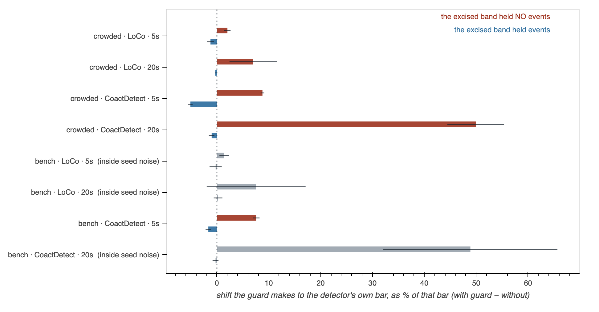

# The guard raises the bar where it excised nothing — a finding written to be attacked

**For an independent session.** Everything needed to reproduce, disagree with, or overturn
this is below. It has **not** been murderboarded; if any of it goes outward, run one.
Nothing in `docs/forks.md` has been changed on its strength.



## The claim, in one sentence

**A guard interval does not lower these detectors' thresholds globally. It raises the
threshold where the excised band held no events, and lowers it only where the band held
events — which is what self-masking relief looks like, and is not what `forks.md` §4a's
stated mechanism predicts.**

## Why anyone should care

`docs/forks.md` §4 records the guard as **off everywhere** (`guard_sec = 0.0` on all three
rolling detectors) and §4a explains why: the guard's recall gain is *flat across the
nearest-neighbour gap*, so it is *"a threshold knob that happens to be spelled in seconds"*
rather than the guard-cell mechanism. Two downstream documents are ranked on that:
[`censoring is the instrument the guard was not`](../todo/2026-08-23-censoring-is-the-instrument-the-guard-was-not.md)
takes it as its title, and
[`CFAR variants are a knob axis`](../todo/2026-08-25-cfar-variants-are-a-knob-axis-not-new-detectors.md)
ranks censoring second on it.

If this finding stands, §4a's *observation* survives untouched and its *mechanism* does not
— and "the guard was not the instrument" stops being a settled premise.

## The argument, stated so it can be refused

1. Guard cells relieve **two** maskings. `detector_history.md` §5.1 names both: **self**-masking
   (the event's own energy in its own reference) and **mutual** masking (a neighbour's).
2. **Self-masking relief is gap-independent by construction.** Every event self-masks whether
   or not it has a neighbour.
3. Therefore a recall gain that is flat across the neighbour gap is **equally** the signature
   of pure self-masking relief and of a bar that simply dropped. §4a's instrument
   (`probe_guard_on_surrogates`) measures the mutual half correctly and cannot see the other.
4. A measurement that *can* separate them asks **where** the bar moves rather than how much:
   a bar that dropped because its reference got smaller drops **everywhere**; one relieving
   self-masking moves **only where events were removed**.
5. Measured, the two strata move in **opposite directions** — so neither hypothesis as posed
   is right, and the direction of the occupied stratum is self-masking relief's.

**Attack point 2 first.** It is the load-bearing step, it is an argument rather than a
measurement, and if it is wrong the rest does not matter.

## Reproduce it

```
python tools/probe_guard_where_it_lands.py --selftest    # must print "clean" twice
python tools/probe_guard_where_it_lands.py --crowded     # the table below
python tools/make_guard_figure.py --also docs/learned    # the figure above
```

No arguments to tune, no data outside the simulated bench, about 20 minutes for the crowded
run. The figure imports the probe rather than recomputing, so a divergence between the
picture and the table is impossible by construction rather than by checking.

## What was measured

Both detectors expose their own bar per bin — LoCo the rolling threshold envelope
(`signal.threshold`), CoactDetect the surrogate null mean (`nullmean_prof`). Run each at
guard 0 and guard *g*, same recording, same seed, and split the bins by whether any event
falls inside the excised band.

4 seeds, `baseline_quiet`, shipped operating points. Shift as a percentage of the bar it
moved — LoCo's bar sits near 2.9 and CoactDetect's near 0.5, so absolute shifts are not
comparable between them. **flip** = every seed individually shows empty > 0 and occupied < 0.

| recording | detector | guard | empty ± sd | n | occupied ± sd | n | flip |
|---|---|---|---|---|---|---|---|
| crowded | LoCo | 5 s | **+2.03%** ± 0.60 | 1128 | **−1.24%** ± 0.65 | 1746 | **yes** |
| crowded | LoCo | 20 s | **+6.99%** ± 4.57 | 73 | **−0.31%** ± 0.08 | 2798 | **yes** |
| crowded | CoactDetect | 5 s | **+8.78%** ± 0.36 | 8372 | **−5.11%** ± 0.42 | 13204 | **yes** |
| crowded | CoactDetect | 20 s | **+49.91%** ± 5.47 | 534 | **−1.02%** ± 0.54 | 21042 | **yes** |
| bench | CoactDetect | 5 s | +7.56% ± 0.66 | 1904 | −1.66% ± 0.53 | 3456 | **yes** |
| bench | LoCo | 5 s | +1.40% ± 0.91 | 259 | −0.25% ± 1.17 | 453 | no |
| bench | LoCo | 20 s | +7.56% ± 9.53 | 20 | +0.22% ± 0.84 | 690 | no |
| bench | CoactDetect | 20 s | +48.87% ± 16.79 | 129 | −0.27% ± 0.57 | 5231 | no |

Every cell above is copied from the tool's own stdout, not derived. Hand-dividing the
absolute shift by a rounded bar reproduces these to about a tenth of a percentage point and
disagrees in the last digit — which is the whole reason they are transcribed from the run.

On the crowded recording — the one §4a's headline numbers come from — all four rows flip in
every seed.

**Why the empty stratum rises has an arithmetic reason.** The retained span is compacted onto
one shorter line before shifting, so the same events sit at higher density and land in the
test bin more often. Shortening a reference pushes a bar **up**. At a 20 s guard that effect
dominates everything else, which is its own argument against wide guards.

## What this does NOT show

- **It measures the bar, not recall.** That the bar falls at occupied anchors does not
  demonstrate it is what produces §4a's +0.045 recall gain. **That link is unrun**, and it is
  the single largest gap here.
- **Effects are small** where they are cleanest — −1.24% of LoCo's bar, −5.11% of
  CoactDetect's.
- **Three rows are inside seed noise** and are labelled so, in the table and greyed in the
  figure. Bench LoCo at 5 s has a standard deviation larger than its occupied mean.
- **4 seeds.** No confidence intervals are claimed and none should be read in; "every seed
  agrees" is the strength test, not a *p*-value.
- **Simulated recordings, one regime.** `baseline_quiet` only. `forks.md` §4b establishes the
  background axis matters more than crowding does, and this was not swept across it.
- **Nothing here is about real slices.**

## Where I think it is most likely wrong

Written down so a reviewer does not have to find them, and can go past them.

1. **Step 2 of the argument may be too strong.** "Self-masking relief is gap-independent"
   assumes the amount of an event's own energy in its own reference does not depend on
   whether a neighbour is present. In a dense window it might: a neighbour changes the
   reference's composition, so the *fraction* the event's own events contribute changes.
   If that dependence is material, gap-flatness is weaker evidence than I have made it.
2. **"Occupied" is defined by the pooled event train, not by the statistic.** A band holding
   three events from one ROI is counted the same as three from three ROIs, and only the
   second is coactivity. A better stratification would use distinct-ROI participation.
3. **CoactDetect's profiling run uses `min_rois = 0`**, not the shipped 3, because a bin with
   no events fails any positive candidacy test and the empty stratum would be empty. This
   does not change the guard arithmetic or the surrogate draw, but it is not the shipped
   configuration and someone should check that claim rather than accept it.
4. **The compaction explanation for the rising empty stratum is mine, not measured.** It
   predicts the rise should scale with the fraction of the context excised; that is testable
   by sweeping guard width and is consistent with the 5 s → 20 s growth, but I did not run it
   as a test.
5. **LoCo's bench rows barely move**, and I have treated that as low power (n = 259 anchors)
   rather than as evidence against. A reviewer may reasonably read it the other way.

## Traps, if you pick this up

- **`forks.md` §4a has been corrected twice**, and the current text is the careful one. Its
  first version reported the opposite conclusion; §4b records that the first was measured off
  the difficulty axis. **Do not reconstruct any of this from `git log`** — commit `a15f5e3` is
  titled *"the prediction held"* and §4a says it did not.
- **LoCo excises its guard around the ANCHOR, not the bin under test.** A bin sits up to
  `thr_step_sec / 2` — 7.5 s at shipped FAST — from the anchor whose threshold it inherits, so
  scoring occupancy at the bin asks about time the guard never touched. The first run of this
  probe did exactly that and reported LoCo as showing nothing: +0.0074 empty against +0.0098
  occupied, both positive. Scoring at the anchor turned the same data into +0.0405 against
  −0.0093. **If you rewrite the stratification, check which position you are scoring at.**
- **`--selftest` exists because this probe could otherwise report RNG drift with a mechanism
  attached.** It runs guard 0 against guard 0 and requires every delta to be exactly zero;
  it passes on 6,072 bins. If you change how the detectors are called, run it again first.

## What would settle it beyond this

The measurement that closes the gap in "what this does not show": **hold the bar fixed and
vary only the guard**. If the guard's recall gain survives when the threshold is pinned to
its unguarded value, the gain is not the bar moving. That is a bigger change than a probe —
it needs a threshold override the detectors do not currently expose — which is why it is
named here rather than run.

Cheaper and nearly as good: stratify the existing recall measurement by **whether each
event's own guard band held events**, rather than by its neighbour gap. Self-masking relief
predicts the gain concentrates where the band was occupied. `probe_guard_on_surrogates`
already has every part needed to do it.

## Provenance

Measurement and probe: `tools/probe_guard_where_it_lands.py`, landed in #308 with its
reasoning in
[`a flat guard gain is what self-masking relief looks like`](../todo/2026-08-25-a-flat-guard-gain-is-what-self-masking-relief-looks-like.md).
The objection was raised by the murderboard on a different artifact —
[`loco_coact_as_cfar_2026-08-25`](loco_coact_as_cfar_2026-08-25.md) §E2 — which is also where
two other open corrections to `detector_history.md` are recorded. Figure:
`tools/make_guard_figure.py`, darkroom copy at
`<darkroom>/bugarach/detector_history/guard_where_it_lands.png`.
