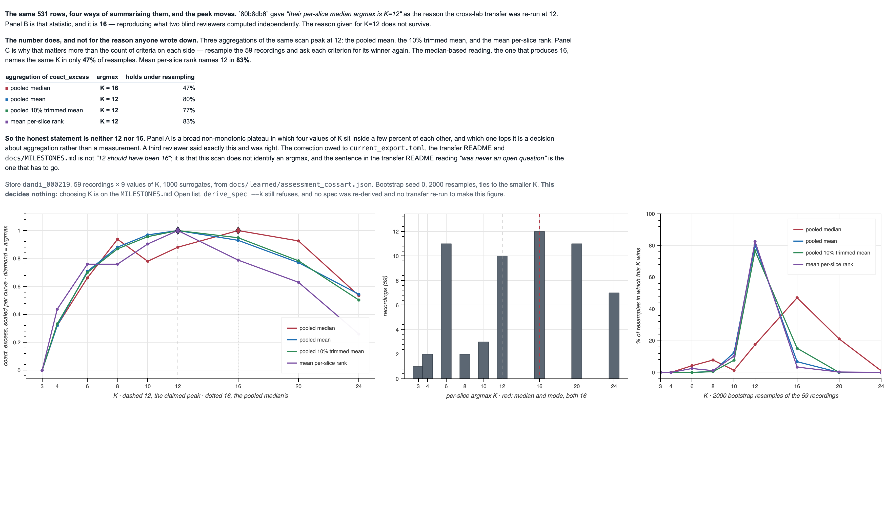

# "K=12 by per-slice argmax" does not reproduce from the assessment, and the whole Cossart thread rests on it

**Two independent blind reviewers computed the per-slice argmax of `coact_excess` across
all 59 recordings in `docs/learned/assessment_cossart.json` and got 16, not 12.** One
reported the distribution: `3:1, 4:2, 6:11, 8:2, 10:3, 12:10, 16:12, 20:11, 24:7` — median
**16**, mode **16**. `clusters_permin` argmaxes at 10, `jit_excess` at 20, `part_n_obs` at
24. Nothing tested yields 12.

**Nobody has verified this independently, including this session.** It is filed as a
question, not a finding — which is exactly the distinction the rest of this file is about.

---

> ## Verified 2026-09-01, and step 1 is answered: the argmax is aggregator-dependent
>
> 
>
> `tools/make_k_scan_figure.py` recomputes all of it from the 531 rows and draws it.
> **The reviewers are right, digit for digit** — per-slice argmax distribution
> `3:1 4:2 6:11 8:2 10:3 12:10 16:12 20:11 24:7`, median **16**, mode **16**, and the
> pooled-median series reproduces too. So *"their per-slice median argmax is K=12"*,
> `80b8db6`'s stated reason, is **false** and the correction in step 2 is owed.
>
> **But "nothing tested yields 12" is also false, and this is the part the filing did not
> anticipate.** Only the *median* family gives 16. Every mean-family aggregation of the
> same scan peaks at **12**:
>
> | aggregation of `coact_excess` | argmax | survives resampling |
> |---|---|---|
> | pooled median | **16** | **47%** |
> | pooled mean | **12** | 80% |
> | pooled 10% trimmed mean | **12** | 77% |
> | mean per-slice rank | **12** | **83%** |
>
> The right column is the figure's panel C: resample the 59 recordings 2,000 times and ask
> each criterion for its winner again. **The reading that produces 16 is the one that will
> not hold still.** Mean per-slice rank is the criterion worth naming — `coact_excess`
> spans two orders of magnitude across these recordings, so a pooled mean is a few large
> slices voting and a pooled median is one slice voting, while a rank asks all 59 the same
> question and weights them equally. It says 12, and says it in 83% of resamples.
>
> **So the correction is narrower and more awkward than "12 was wrong".** The number
> outlives the reason given for it. What the scan does not support is any bare argmax:
> the third reviewer's plateau is real, K=8/12/16/20 sit inside a few percent on the
> pooled median, and which one tops it is a decision about aggregation rather than a
> measurement.
>
> **Choosing K is still Tony's** and stays on the `MILESTONES.md` Open list. Nothing was
> re-derived and no transfer re-run; `derive_spec --k` still refuses. This is step 1 only.
>
> **A bigger defect than the arithmetic, found while checking where the claim propagated.**
> [`docs/learned/cossart_transfer/README.md`](../learned/cossart_transfer/README.md) says in
> bold: *"K=12 was measured on 2026-08-29 across all 59 of their recordings and **was never
> an open question**."* `80b8db6` says *"CHOOSING K IS STILL NOT DONE"*; `MILESTONES.md`
> says **NOT CHOSEN**; `spec_k12.json` carries `k_chosen: 12` with `review: null` and no
> derivation at all. That sentence retires Tony's open decision by assertion, and it is the
> four-documents-in-forty-two-hours drift the `MILESTONES.md` strength column was invented
> to catch — which it then survived. **It is the highest-value edit in step 2**, above the
> argmax wording.
>
> ⚠ **The figure is not murderboarded**, on the same footing as the README it sits beside:
> a finding for sessions in this tree. If any of it reaches an outside reader, murderboard
> that artifact first.

---

## Why it matters more than it looks

K=12 is the value the whole cross-lab transfer result was re-run at (#427), and the reason
given for it is *"the per-slice median argmax"* — from `80b8db6`'s commit message. That
message also named a second peak, K=16 by pooled median, and said in capitals that
**choosing K was not done**. If the per-slice argmax is in fact 16, then:

- the "two defensible peaks, 12 and 16" framing loses its 12 leg, and
- both readings point at **16**, which has never been run, and
- the K=12 re-run was done at a value with no surviving derivation.

A third reviewer noted the pooled series is not two peaks but a **broad non-monotonic
plateau** — 93.28 · 112.73 · 133.45 · **150.26** · 140.69 · 146.81 · **154.04** · 149.53 ·
125.74 across K=3…24 — in which K=12 is *fourth*, and K=8 and K=20 both beat it inside a
3% band. If that is right, "two defensible peaks" was always the wrong shape and the honest
statement is that no single argmax is defensible.

## What to do

1. **Recompute the per-slice argmax** from `assessment_cossart.json`'s `rows` (531 = 59×9)
   and say which summary statistic, if any, yields 12.
2. If none does, **correct `80b8db6`'s claim where it has propagated** — `current_export.toml`'s
   `[cossart]` role, `docs/learned/cossart_transfer/README.md`, and the `evidence` row in
   `docs/MILESTONES.md`, which currently says "K=12 as the commit reports it" precisely
   because this was unresolved at filing time.
3. **Do not run the transfer at a new K to settle it.** Choosing K is Tony's, it is on the
   Open list in `MILESTONES.md`, and `derive_spec --k` refuses for that reason.

## Why this is filed rather than fixed

The session that found it had already been wrong seven times that day about claims it had
not recomputed, and the reviewers who raised it disagree with each other about the shape of
the curve. Filing a question is the correct output; asserting a third number would be the
eighth instance.

See [the murderboard run record](../reviews/case_report_to_short_course_2026-08-31.md).
