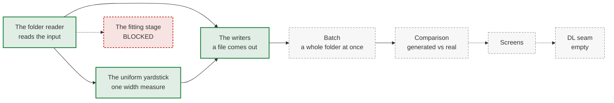

# From viewer to workflow — the plan

## Part I — the decision

### The problem

bugarach can already run six coordination detectors and draw them, and the viewer
already opens a whole directory. What it cannot do is finish: there is no way to
tune the generator to the recordings you loaded, and **no way to get a result out
of it** — every number stays on screen. Nothing in the tree writes a data file. It
writes pictures, and a page, and one text report; it has never written a table a
statistician could open.

Most of what is missing already exists as capability, locked inside command-line
scripts in `tools/` that take flags and write images to a shared folder. **A screen
needs a function it can call and a value it gets back; a script gives it neither.**
So the bulk of this work is moving capability into the library, not writing new
machinery. The screens are thin once that is done.

### What the app takes in, and what it gives back

The app reads **one export folder and nothing else**. It never opens a data
store, never derives an analysis window, and never reaches outside the folder it
was given. Region windowing is the exporter's job — ours in MATLAB, whoever else's
for an outside lab. Event properties (amplitude, width, rise time) belong to a
different project and are not read here: the detectors need per-ROI **event onset
times** and nothing more, which is what `src/bugarach/io.py` already says.

The contract is written in full in
[`docs/export_folder_spec.md`](export_folder_spec.md). In short: four CSVs, of
which **only `events.csv` is required** — `slice_id, stream, roi, time_sec`, and
nothing else read.

Periods are carried by `regions.csv`, one row per region, ordered by a plain
`region_idx` and named by the lab's own `label`. There is no notion of a treatment
*slot*, so there is nothing to run out of: one region is a recording with no
protocol, six is a baseline and five conditions. No region is privileged, no label
is special, and windows arrive **already computed** — bugarach never derives one.

Identity in `slices.csv` is an **open column set**, passed through untouched, with
exactly one exception: `frame_interval_sec`, the acquisition sampling interval.
That one is read, because three detectors assume a frame rate and it cannot be
recovered from onset times. **Only one of the three currently complains when it is
missing** — the other two fall back to ten hertz in silence, so a lab imaging at
twenty gets one warning and two quietly wrong answers. Wiring all three is part of
the first milestone.

Output is **one shape carrying nothing specific to any lab, including ours** —
`detections.csv`, one row per detected coordinated event, plus a settings file so a
result reproduces from the folder alone. Our own analysis must read it, and it must
also be readable by someone who has never heard of this project; where those pull
apart, the stranger wins and our R side adapts. No column changes meaning between
rows, no identifier has to be parsed, no lookup file is needed to read it.

### What acting buys first

The first thing to build is the **yardstick**: one function that measures how wide a
coordinated event is, applied identically to every detector, so their widths become
comparable at all. Porting it also yields a statistic this project has wanted since
the generator review.

`docs/generator.md` carries an open flag that the generator's onset-jitter constant
of 0.36 s is calibrated against a statistic that sits **below its own surrogate
null** of 0.42 s — that is, shuffle away every real relationship between cells and
the measurement barely moves — and that does not round-trip: build a recording at
0.36 and the estimator reads back about 0.64.
`docs/reviews/generator_2026-08-14.md` names two candidate replacements, a median
event **span** and a median **width**.

⚠ **The port delivers neither of them, and that is worth knowing before approving
the order.** The named `width` candidate is the stored transient width, which the
yardstick is defined to exclude and this app does not read. The named `span`
candidate is also not what the yardstick returns: it is computed from **one onset
per ROI** and only over clusters that clear a minimum-participant floor, while the
yardstick spans **every onset from every ROI** in its window with no floor at all.
They coincide only when no ROI fires twice inside the window.

So the port produces a **related** onset-span statistic, not the candidate as
specified. Making it the candidate means porting the participant-selection rule too
— a decision for whoever takes the yardstick, and one this plan does not pre-empt. Either way,
retiring the flag still needs a surrogate null computed *for the new statistic* and
a round-trip test, and the port delivers neither.

### Build order

**Green is the critical path**: the reader, the yardstick and the writers. That is
the shortest route to a file you can open, and each one is useless without the two
beside it — the reader has nothing to hand on, the yardstick has nothing to measure,
the writers have nothing to write. **Red is blocked** and off the path. **Grey is
afterwards**, and each of those is smaller than it looks.

- **The folder reader.** Nothing in the tree reads the input contract: none of its
  filenames or fields appear anywhere in the source, and the one CSV loader that
  exists reads a single file, takes the slice name as a code argument rather than
  from the required column, and ignores the stream column unless a caller asks for
  it. It also owns the entry point: the viewer currently loads *every* CSV in a
  directory as a separate recording, so pointed at a conforming folder today it
  would try to read the region and identity files as recordings and crash. First,
  because otherwise the plan specifies an input nobody can supply.
- **The uniform yardstick.** Port the one function that measures how wide a
  coordinated event is, identically for every detector. **Prerequisite, on a machine
  with MATLAB:** write its reference generator and commit the output. There is no
  generator for this function today, so the gate its acceptance rests on does not
  yet exist.
- **The writers.** The detections file and the settings file. Export button on the existing viewer; the quick
  path — see the data, tune each detector, run, get a file — is then complete.
- **The fitting stage.** Measure a folder well enough to configure the generator.
  **Blocked on an open decision** — it is out of the critical path until that is
  settled.
- **Batch.** Run a whole folder through all six detectors on one extracted
  dispatch.
- **Comparison.** Move the generated-versus-real tools into the library.
- **Generator and optimization screens.** Thin wrappers over machinery that already
  works.
- **A named deep-learning seam.** It appears in the interface and does nothing.
  Recorded for whoever fills it: training data comes from planted truth only, never
  from detector output — score against detector calls and you measure agreement,
  not truth; train on them and you get a detector emulator (`docs/generator.md`).

### How we will know it worked

- The full test suite, with the import path confirmed first.
- **Parity** for the port: synthetic fixtures through `tools/matlab_ref/`, compared
  to **1e-9** on the floating-point fields and **exactly** on the counts. Plus
  hand-derived vectors for the branches the MATLAB test file does not reach.
- **Round-trip the output**: write it, read it back, compare. `NA` spelled
  literally, newline-only endings, and a real zero preserved as zero rather than
  becoming missing.
- **Self-containment**, and it needs a test that can fail. "It ran on a one-file
  folder" proves only that no outside path was *needed* — on this machine the data
  root and the shared-folder variable are both set, so a stray read succeeds and the
  check passes anyway. Assert on **what was opened**: patch the file-open call and
  require every resolved path to sit inside the folder. Run it **twice** — once with
  the environment scrubbed, once with those variables pointed at empty sentinel
  directories — because scrubbing removes the very condition under which a stray
  read happens, so only the second run has power. Assert too that the
  missing-interval warning fires for **each** detector that needs it, not just the
  one that currently warns.
- **End to end**, and it is a smoke test rather than a gate: point the app at a
  folder, tune, run, export, and open the result. It proves the path runs; a file
  with every value multiplied by a thousand would pass it too.

### Decisions taken here, so nothing waits on them

- **Ordering is the index the producer sent; naming is the label it sent.** Nothing
  is renamed, nothing is renumbered, and no period is treated as special. A consumer
  wanting a before-and-after picks the two rows it wants; it knows which they are and
  we do not.
- **bugarach reports what it computed**, and how. If a detector ran peak-gated, the
  row says so in its own column. There is no run "mode" for the app as a whole —
  that is the upstream exporter's implementation detail and is not mirrored here.
- **Nothing is withheld because a consumer cannot yet read it.** A result that was
  computed is emitted; the consumer adapts.
- **Figures are deferred to the deliverables, not the plan** — with one exception
  owed. A plan that argues in prose is still a plan, and the same gate will demand
  figures of the reports and captions this work produces. But the yardstick section
  in Part II *specifies a mechanism* rather than planning one: five quantities laid
  out on one time axis, in words. That one gets drawn before it is built.

### What you are being asked to approve

**The folder reader, the uniform yardstick, and the writers.** Those three, in that
order, buy the quick path end to end: point the app at a folder, see the data, tune
each detector, run, get a file. Nothing before the writers produces anything you can
use. The fitting stage is blocked on an open decision and is not on this path.

Everything after is scale and comparison. The deep-learning seam is a name in the
interface and nothing else.

**⚠ The R side has work to do, and it is not this plan's.** The output carries no
project-specific detail by decision, which means our own analysis cannot read it
unchanged. Three things it does today that a general output will not feed:

- it requires the first period of every recording to be named `baseline`, while the
  input contract deliberately asks producers for the period's real name;
- one of its figure scripts keeps only labels beginning `ba`, `se` or `tt` and
  **silently discards the rest** — `washout`, `control` and `aCSF` would vanish with
  no error, which is this project's own unlabelled-rows incident waiting to happen;
- it reads a strength column whose meaning it recovers from a lookup table; the new
  output puts the unit in the row instead.

Two facts that make this cheaper than it sounds: the per-event shape is read by **no
R file at all** today — that side consumes a pre-reduced table built in MATLAB — and
the recruitment column two authorities disagree about is read by **zero** R files.
So the adaptation is smaller than the surface suggests, and worth scheduling on that
side before the writers land.

---

## Part II — execution detail

*Written for the session doing the work. Read the section for the milestone you are
starting; the screens and the seam have none, deliberately, and say why below.*

### Before you run anything

- **A worktree's Python imports the primary checkout's `src`.** The virtual
  environment is an editable install rooted in the primary checkout, so a test run
  from a worktree can execute a different branch's code and pass clean. Set
  `PYTHONPATH=src`, then confirm it took — `python -c "import bugarach;
  print(bugarach.__file__)"` must print a path inside your worktree. This has
  already turned a reported green suite into a result about the wrong branch, and it
  invalidates every other check on this page.
- **The primary checkout runs far behind `origin/main`.** Standing in it and setting
  `PYTHONPATH=src` loads stale code deterministically rather than correctly.

### The folder reader

**It owns the entry point, and the entry point is currently broken for folders.**
The viewer's directory mode globs every `.csv` and hands each one to the events
loader as a separate recording. Pointed at a conforming export folder it will try to
read the region and identity files as recordings and raise on the first one. So this
milestone changes what "open a directory" means: a folder containing `events.csv` is
**one input**, not a pile of independent slices.

What the existing loader does and does not do: it reads one file; it takes the slice
name as a code argument and ignores the `slice_id` column the contract requires; and
it ignores the `stream` column unless a caller opts in, silently collapsing every
event into one unnamed stream. All three need changing.

**Reuse rather than rebuild.** The library already has a constructor that takes
per-ROI event times plus regions as `(name, start, end)` tuples and builds the
internal slice object — that is the natural target for `regions.csv`, and it exists.
Two details it will need: the internal region type carries a slot field the export
contract deliberately has no notion of, so pass nothing for it; and the constructor
fills width and amplitude with missing values, which is correct here and is the
reason the yardstick's amplitude outputs will be empty on real folder input.

**The acquisition interval feeds more than one detector, and only one of them
complains.** `frame_interval_sec` sets the rate detector's grid, which warns when it
is missing. Two other detectors carry the same assumption silently — the synchrony
detector bins on its own interval parameter, and CICADA derives a grid from an
imaging-rate parameter that defaults to ten hertz. A lab imaging at twenty hertz
that sends no interval gets one warning and two quietly wrong answers. Wire the
folder's value into all three, or state in the spec which are left uncovered.

### The uniform yardstick

The detector decides **where** a coordinated event is; this function decides **how
wide**, identically for every detector, from real onset times. That is what makes
widths comparable across detectors at all — each detector's own width is a
different quantity (a tightness for some, an episode duration for others) and is
explicitly not comparable.

It returns the full extent between first and last onset, and a straggler-robust
version over the largest single-linkage cluster. Deliberately onset-based; stored
transient widths are excluded, and that boundary must survive the port.

**Parity, and the trap in it.** The reference exports come in two grains. The
**summary** files cannot test this function — a different reducer produces them and
never calls it, provable from the column shapes alone. The **per-event** export
does call it and is a genuine oracle, so it is the machine-local end-to-end check.
Neither can be committed: both are real-derived, which FOUNDATIONS §5 keeps
machine-local, and CI must still have a gate. So build synthetic fixtures through
`tools/matlab_ref/` the way every detector's oracle was built — those travel — and
use the per-event export as the second, local check.

**Pin the production settings, not the defaults.** Three of them, and the plan
previously named one:

- the **clustering gap** is per-stream — 0.5 s fast, 2.5 s slow. A fixture at the
  default validates one stream and silently ships a wrong yardstick for the other,
  so the port must carry the per-stream broadcast rather than a scalar.
- the **collection pad** is 0 in production, and the MATLAB test file's last case is
  entirely about it.
- the **collection aperture** belongs to the caller, not to this function — one
  second either side of the event centre. It is what Part I's ⚠ is actually about,
  and it is a different parameter in a different function.

**Amplitude: port it, and know it will be empty here.** Five of the function's
outputs aggregate event amplitudes. Amplitudes are another project's and this app's
input contract has no column for them, so on real bugarach input every one of those
fields is missing. Port them anyway — parity is against the MATLAB oracle, which
computes them — but do not present them as results, and note that the
length-mismatch branch compares against the ROI's **full** onset array rather than
the in-window subset. A port that naturally writes the in-window comparison
diverges on every ROI with an event outside the window, which is most of them.

**Branches the MATLAB test file does not reach** — hand-derive vectors for each:
the cluster tie-break when two clusters hold equal counts; the strict gap boundary
(onsets exactly a gap apart stay together); that peak coactivity counts distinct
ROIs rather than onsets; non-finite onsets; the defaulted coactivity window; the
amplitude-length-mismatch fill.

**MATLAB semantics that actually apply here** — the reductions drop non-finite
values and return missing on empty, which numpy's `nan*` family does not
reproduce: it propagates infinities, returns zero for an empty sum, and warns
rather than returning. Use an explicit finite mask and an empty guard. The
median in the summary reducer propagates missing values deliberately. The
percentile, rounding and grid helpers in `_shared.py` are not reached by this
function; say so rather than leaving it open. Sort with a stable kind so the
argument does not have to be re-derived.

### The fitting stage

**⚠ Open decision, and it blocks this milestone.** The estimator selects its input
by finding a region whose label is literally `baseline` and a stream literally named
`fast`. The input contract forbids both: no region is privileged, no label is
reserved, no stream name is. And this project's own exporter *overwrites* region 1's
name with `baseline`, so the label is not even evidence. Meanwhile FOUNDATIONS §9 is
canonical and requires calibrating from baseline recordings only. **On a conforming
folder, bugarach cannot identify a baseline window — by design.** Two ways out, and
someone must choose: ask the user which region to fit, or reintroduce label
special-casing for this one path — and that second option is not a free choice: it
is forbidden by the input contract and by FOUNDATIONS §4, so taking it means
amending both in the same change. Do not start this milestone before it is settled.

**Use the estimator that exists.** `tools/fit_background_shape.py` already fits
**three** shapes by maximum likelihood on a negative-binomial count model: how
unevenly activity is spread across ROIs, and how much each ROI clumps in time at
two scales. It fits **no rate level** — every window keeps its own mean by
construction. It also carries a drift gate that fails when the constants in the
source stop matching the data. **That gate lives entirely in the command-line half —
lift it with the compute.** But point it only at this lab's archive: it compares
against constants fitted on this preparation, so on an outside lab's folder it
would fire on every run, and that is a different preparation rather than drift.

**Do not fit to a summary.** The dispersion curve is a *reported diagnostic*, never
the objective. The file says why in its own docstring: matching the statistics by
search reproduces them without the mechanism. Report the curve beside the fitted
shapes.

**Report both the mean and the median rate, and state the pairing.** The mean is
what the generator consumes, and it is only correct when the heterogeneity
parameter is set. Fitting and then generating with heterogeneity off walks back
into a calibration error this project already made once.

**The acquisition interval cannot be fitted.** It is a property of the microscope,
and it arrives as `frame_interval_sec` in `slices.csv` — the one field in that file
bugarach reads. Absent, the 0.1 s fallback applies and warns, and the warning stays.
Note this is the detector-side grid governed by FOUNDATIONS §6, not the generator's
onset-quantization knob; different parameters in different modules, and only the
first warns at all.

**Do not fit jitter.** It is not identifiable *by the estimator that produced the
current value* — that estimator is censored by a minimum-group-size floor, sits
below its own surrogate null, and does not round-trip. Carry the number as a named
prior with the round-trip failure beside it.

**Participation — a consistency check, not an independent one.** Estimating it
from coactivity excess over a circular-shift null uses the same machinery four of
the six detectors use, so a fitted value cannot validate a detector calibrated on
it. Two further constraints: the excess must be taken as a *distribution* over
coactivity levels, since a scalar cannot separate how many coordinated moments
there are from how many ROIs each recruits; and the shift window must be at least as
long as the structure it is meant to destroy. The shipped detectors disagree about
that window — CoactDetect shifts inside a rolling minute and LoCo inside two, while
CICADA rolls across the whole recording and SCE across the whole region — and real
burst structure runs to five minutes. Say which window the fit uses and why. Apply
the same round-trip test jitter got; if it fails, participation joins jitter as a
named prior.

### The writers

**One shape, carrying nothing specific to any lab — including ours.** Tony settled
this: our own analysis must read the output, *and* the output must be general enough
for anyone, so no project-specific detail goes in it. Our R side adapts; it does not
get a private dialect. The columns are in
[`docs/export_folder_spec.md`](export_folder_spec.md).

That decision removes most of what this milestone used to be, and it is worth
knowing what it removes and why:

- **No column whose meaning changes by row.** The existing contract has one strength
  column that holds a cell count for some detectors, a dimensionless index for
  another and a rate for a third, disambiguated by a lookup table shipped alongside.
  A reader without the table gets a plausible wrong answer instead of an error. Here
  the unit travels in the row.
- **No packed identifiers.** Detector, stream and mode are three columns, not one
  string a consumer has to split.
- **No reserved vocabulary and no privileged period.** No treatment index, no
  required `baseline`. The index and name the producer sent come back unchanged, and
  the consumer picks the pair it wants to compare — it knows which they are.
- **No lookup file needed to read the output.** Which also means no dictionary
  validator: the check that was going to police conformance was a self-consistency
  check against a file the producer supplies, absent exactly when a stranger needs
  it most.

What survives, and still matters:

- Spell missing values literally as `NA` — Python's CSV writer defaults to an empty
  field. Emit newline-only endings; a stray carriage return corrupts the last column
  under exact comparison.
- **A real zero is not a missing value.** Some detectors legitimately report a width
  of exactly zero, meaning perfectly synchronous. Preserve it.
- Carry every identity column through untouched, and carry the settings file, so a
  result reproduces from the folder alone.

**What gates this, stated honestly.** A committed reference frame, byte-diffed on
every run, is a **regression** gate and not a correctness one — it is produced by
the code under test, so write the writer wrong, generate the reference, and the diff
stays clean forever. Freeze it, and require that regenerating it re-runs the
yardstick's oracle; otherwise a session that changes the writer and refreshes the
fixture disarms the gate permanently. **Correctness for the numbers comes from the
MATLAB oracle** — and note its scope: it covers the yardstick's arithmetic and has
no opinion at all about column assembly, missing-value spelling, or line endings.
Those need their own round-trip test, and it is cheap: write, read back, compare.

### Batch

**Do not reuse the viewer's compute path directly.** It is a compute function shaped
for the plot: it materialises a full-length trace per detector and forces two of
them to emit signals purely so the viewer can draw them. Over a folder that
dominates runtime and peak memory, for arrays that are discarded undrawn.

**Seed the extraction from the bench's runner, not the viewer's.** A name-keyed
six-way dispatch already exists there and already absorbs both call shapes — three
detectors take a whole recording, three take one stream's trains plus the extent —
so callers work in detector names rather than signatures. It has one limitation the
viewer's does not: it is hardcoded to a single stream. Lifting that assumption is a
smaller change than extracting the dispatch out of the viewer, and it leaves the
viewer a consumer rather than a donor.

Four divergences to resolve deliberately while extracting:

- **The viewer and the bench feed CICADA different onset fields.** They coincide on
  synthetic single-stream data and diverge on real recordings, which is why this has
  gone unnoticed. This is the one that changes a detector's input.
- **The bench's runner is hardcoded to a single stream**, so it cannot be the batch
  home unchanged; that assumption is what gets lifted.
- **A third consumer already exists** — the diagnostic tool imports the viewer's
  private compute function because it needs per-stream traces. Changing that
  signature breaks it silently.
- **One surrogate seed is shared across every slice**, so nulls across a folder are
  not independent draws. A feature in a redrawing viewer; a choice that must be made
  deliberately for a batch and stated in anything aggregated.

Two smaller ones. The synchrony branch reports a threshold default duplicated from
its own signature, so a partial parameter set makes the reported value diverge from
the applied one. And the detectors disagree about clipping: RateDetect is fed trains
clipped to the recording extent, while CoactDetect and SPIKE-synch are fed the raw
onset arrays. Decide which is correct and apply it once.

**Figures do not compare across slices** as they stand: drawn detection width is
floored relative to recording length, so the same detection renders differently on
a short and a long recording; raster height saturates at both ends of its clamp;
and each trace row scales to its own data with nothing marking it. Fix before any
cross-slice figure ships.

### Comparison

Move the comparison tools into the library, **but apply the outstanding fix list
first** — `docs/reviews/roi_rate_distribution_2026-08-15.md` is a do-not-ship record
whose fixes are not yet applied, and most of them are code. Lifting unchanged turns
its fourteen ranked blocking-and-major defects, plus ten smaller ones, into a
library interface.

Core returns numbers and figure objects — never a verdict, and never a file path.
The moment a function returns "match: yes/no", someone optimizes against it. The
command-line shell decides where anything lands.

Consolidate the four screenshot helpers into one. They differ in viewport, scale
and wait, and only one carries the fix for an empty-selection crash that another
still documents as a hazard. Keep the fixed clipping logic and the parameterized
scale; no single copy is canonical as it stands.

Match the library's window convention — the tools are half-open at the top, the
library closed at both ends. One event per boundary, systematically, across every
window the fitting stage measures.

### The screens and the seam — deliberately unspecified

The generator and optimization screens are thin wrappers over machinery that
already works, and the deep-learning seam does nothing. Neither has a section here,
and that is a decision rather than an omission: the generator is under active
development by another session, so writing its screen down now would specify a
moving target, and the seam has no defined output to specify at all. Whoever picks
either one starts by writing the section.

### Coordination

- Claim shared external output on `docs/SESSIONS.md` before writing it.
- The generator is under active development by another session. Call it; do not
  reach into it. Pin it by commit in the fitting stage, and make the semantic gate
  a round-trip test rather than a stable function signature — a parameter's meaning
  can change while its name does not.

### What changed from the previous revision

Region windowing, data-store reading, archive layout, the metadata sidecar, the
treated-window refusal and the quarantine hazard all left scope: the app now reads
one self-contained folder and derives no windows. Event properties left scope; only
onset times are read. The fitting method changed from moment-matching a dispersion
curve to the maximum-likelihood estimator already in the tree. The parity target
changed from the golden files to synthetic fixtures, because the goldens cannot
exercise the ported function. Four quantities that could not be traced to any source
were removed.
